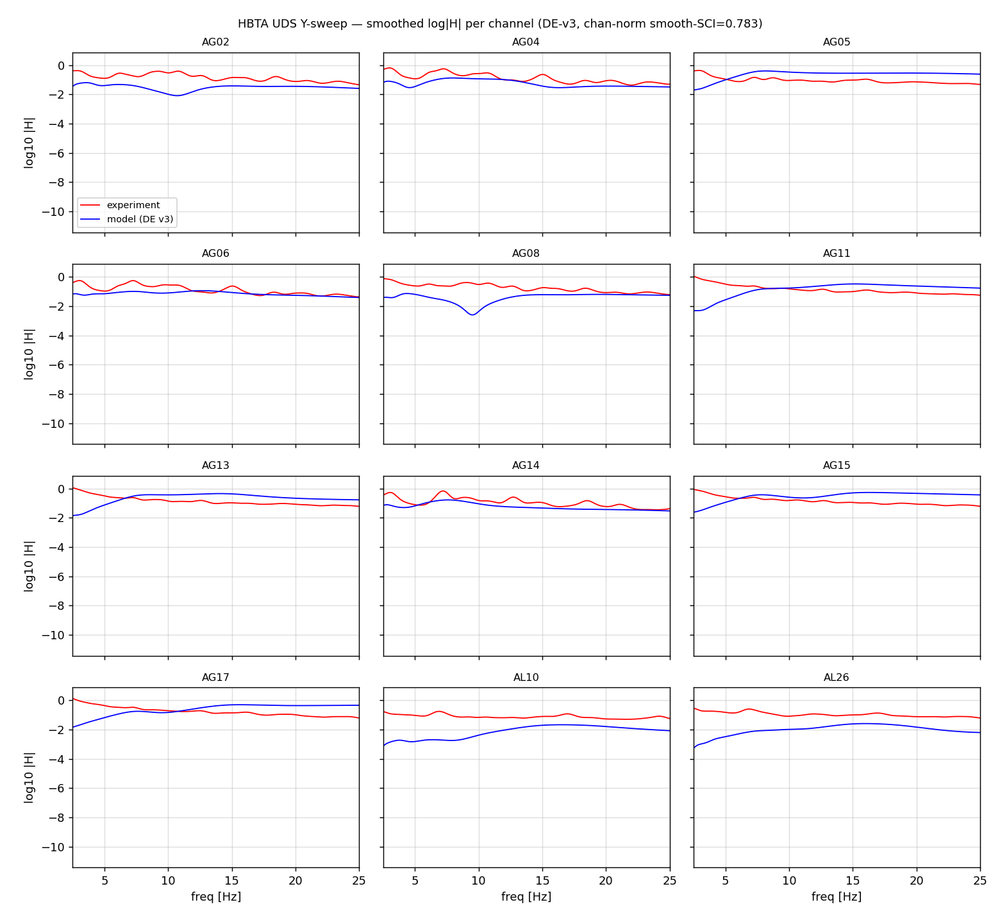
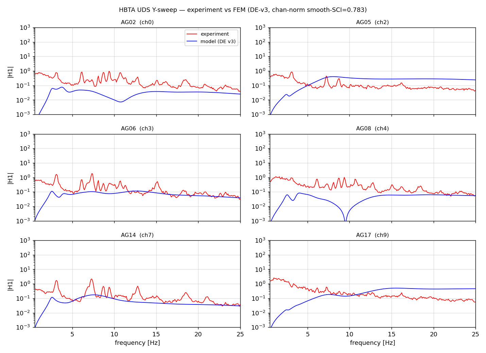
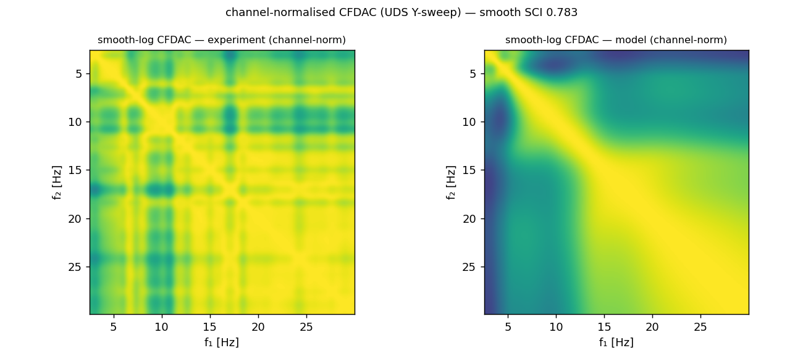
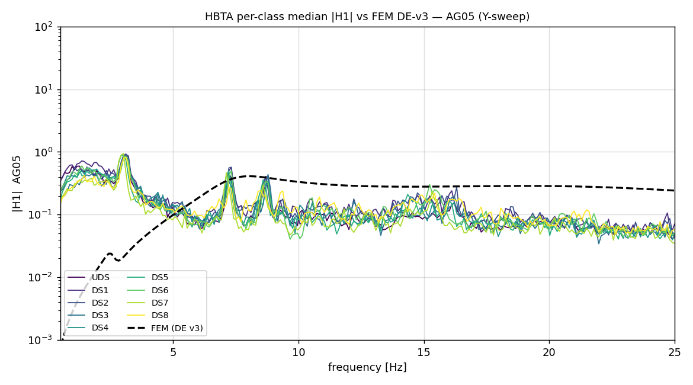

# Hell Bridge Test Arena (HBTA) — Salome / Code_Aster Model Specification

This document specifies a finite-element model of the **Hell Bridge
Test Arena (HBTA)** that produces synthetic FRFs comparable to the
experimental dataset in `output/hbta_collection.h5` for each of the
nine structural states catalogued there:

| Class label | Source state | Physical condition                         |
|------------:|:-------------|:-------------------------------------------|
| 0           | UDS          | Undamaged reference (baseline geometry)    |
| 1           | DS1          | Damage state 1 (lightest)                  |
| 2           | DS2          | Damage state 2                             |
| 3           | DS3          | Damage state 3                             |
| 4           | DS4          | Damage state 4                             |
| 5           | DS5          | Damage state 5                             |
| 6           | DS6          | Damage state 6                             |
| 7           | DS7          | Damage state 7                             |
| 8           | DS8          | Damage state 8 (heaviest)                  |

The specific structural-modification meaning of each `DSN` (which
truss element, what severity, what failure mode) must be cross-
referenced from Svendsen et al. 2022 §3 and the Zenodo record's
`damage_description.pdf`. Section 8 below holds the parameter table —
each row is **currently a placeholder pending paper extraction** and
flagged accordingly.

The model framework is a 3D beam-network FEM built parametrically in
**Salome** (geometry + mesh) and solved by **Code_Aster** (statics →
modal → harmonic), with the harmonic response post-processed in Python
to recover the same `(N_F=513, N_CH=12)` accelerance tensor the
experimental builder writes.

> **Status: design specification.** The Salome / Code_Aster scripts
> referenced below (`salome_geom.py`, `salome_mesh.py`,
> `aster_*.comm`, `run_synthetic_hbta.py`) are **not yet implemented**
> — only the experimental loader (`scripts/build_hbta_pymodal.py`) is
> built and validated. Every value flagged *(calibration knob)* is a
> literature estimate. The first model run / calibration pass is
> tracked in §15.

---

## Table of contents

1. [Purpose and scoring metric](#1-purpose-and-scoring-metric)
2. [Bridge identity and geometry](#2-bridge-identity-and-geometry)
3. [Physics formulation](#3-physics-formulation)
4. [Materials and assumed values](#4-materials-and-assumed-values)
5. [Salome geometry pipeline](#5-salome-geometry-pipeline)
6. [Salome mesh pipeline](#6-salome-mesh-pipeline)
7. [Code_Aster command files](#7-code_aster-command-files)
8. [The nine damage states as parameter sets](#8-the-nine-damage-states-as-parameter-sets)
9. [Excitation model — measured shaker input](#9-excitation-model--measured-shaker-input)
10. [Sensor placement and output recovery](#10-sensor-placement-and-output-recovery)
11. [Synthetic-FRF tensor: matching the experimental schema](#11-synthetic-frf-tensor-matching-the-experimental-schema)
12. [Calibration loop](#12-calibration-loop)
13. [Open questions and unknowns](#13-open-questions-and-unknowns)
14. [Appendix A — file layout](#14-appendix-a--file-layout)
15. [Calibration round 3 — channel-normalised CFDAC](#15-calibration-round-3--channel-normalised-cfdac)

---

## 1. Purpose and scoring metric

### 1.1 Purpose

The model is a *forward* synthetic-data generator: given a damage
parameterisation, it produces per-window FRFs that should match the
experimental data within a calibrated tolerance. For each of the nine
classes the synthetic generator emits windows that populate the same
shapes the experimental loader produces:

```
signals     :  (1024, 12)         float32  — time-domain, 100 Hz
spec_output :  (513, 12)          complex64 — rfft of Hann-windowed signal
frf_H1      :  (513, 12)          complex64 — H1 input-output estimator
```

The 12-channel tensor matches the loader's `SENSOR_SELECTION` (10 arch
joints + 2 deck stringers; see `scripts/build_hbta_pymodal.py:53`).

### 1.2 Scoring metric

The scoring metric is the **Complex Frequency-domain Assurance
Criterion (CFDAC) + Squared Correlation Index (SCI)**:

$$\mathrm{CFDAC}_{ij}(H) = \frac{\lvert\mathbf{H}_i^{\ast}\mathbf{H}_j\rvert^2}{(\mathbf{H}_i^{\ast}\mathbf{H}_i)(\mathbf{H}_j^{\ast}\mathbf{H}_j)} \in [0,1],$$

$$\mathrm{SCI}(C^{(1)}, C^{(2)}) = \frac{\Bigl[\sum_{ij}(C^{(1)}_{ij}-\bar C^{(1)})(C^{(2)}_{ij}-\bar C^{(2)})\Bigr]^2}{\Bigl[\sum_{ij}(C^{(1)}_{ij}-\bar C^{(1)})^2\Bigr]\Bigl[\sum_{ij}(C^{(2)}_{ij}-\bar C^{(2)})^2\Bigr]} \in [0,1].$$

Because HBTA records measured shaker acceleration via the AS sensor,
the experimental and synthetic FRFs are **both true input-output
accelerances** — `frf_H1` in the experimental dataset, and the
modal-superposition H(ω) from the FEM. The CFDAC therefore applies
directly to magnitudes, without the stochastic-input PSD synthesis
that output-only datasets require.

Comparison band: **0.5–25 Hz** (initial estimate). A short-span steel
truss has its first vertical bending mode in the 4–8 Hz range and
torsion / lateral modes well above 10 Hz; the upper bound stays below
the 50 Hz Nyquist with margin. The exact band is one of the
calibration knobs.

The smoothed-log-CFDAC variant (Gaussian σ ≈ 3–5 bins on
log|FRF|) is reported alongside the raw-magnitude SCI for robustness
against sub-bin peak alignment noise.

---

## 2. Bridge identity and geometry

### 2.1 Identity

| Field                | Value                                                |
|---------------------:|:-----------------------------------------------------|
| Location             | 63.4463° N, 10.9044° E (Hell, Trøndelag, Norway)     |
| Type                 | Steel riveted truss bridge (decommissioned railway)  |
| Total length         | **35.0 m** (single span)                             |
| Deck width           | **4.5 m**                                            |
| Upper-chord profile  | Bow-string (arched top), straight bottom chord       |
| Lateral bracing      | Below the bridge deck                                |
| Supports             | Pinned at both ends (North and South abutments)      |
| Year                 | 2020 dataset; original bridge early 20th century     |
| Sample rate          | 100 Hz (resampled from 400 Hz)                       |
| Excitation           | Modal vibration shaker (MVS), sweep sine             |

### 2.2 Geometry from the dataset

The Zenodo record's `sensor_layout.pdf` (committed at
`raw/sensor_layout.pdf`) gives a coordinate system:

> Origin at the bridge midspan below deck level (bottom of steel cross
> girder): X is bridge longitudinal direction (positive East), Y is
> bridge lateral / transverse direction (positive North), Z is vertical
> (positive upwards).

All HDF5 sensor `position` attributes are in this CSYS in metres.

From the sensor positions in `raw/data_100Hz.h5`:

| Quantity                       | Value     | Source                              |
|-------------------------------:|:----------|:------------------------------------|
| Span (X range)                 | −17.5 → +17.5 m | abutments at ±17.5 m          |
| Deck width (Y range)           | −2.25 → +2.25 m | wall joints at ±2.25 m        |
| Deck level                     | Z = 0    | All AL sensors at Z = 0.19 m below |
| Arch crown height (peak Z)     | ≈ 5.0 m  | AG14 at Z = 5.0 m (south midspan)  |
| Arch springer Z                | ≈ 0.6 m  | AG01, AG09 at Z = 0.6 m (abutments)|
| Top-chord rise                 | ≈ 4.4 m  | crown − springer                   |
| MVS position P1 (X, Y, Z)      | (7.5, 0, 0.6) | from record attr `mvs_position_coordinates` |
| MVS position P2                | (TBD)    | extract from P2 record attrs       |

### 2.3 Structural members

The bow-string truss has six member groups:

| Group           | Salome group   | Description                              |
|----------------:|:---------------|:-----------------------------------------|
| `ARCH_N`        | top chord N    | 9-segment north arch (curved)            |
| `ARCH_S`        | top chord S    | 9-segment south arch                     |
| `BOT_N`         | bottom chord N | 9-segment north bottom chord (straight)  |
| `BOT_S`         | bottom chord S | 9-segment south bottom chord             |
| `VERTICALS`     | posts          | 8 vertical posts each side connecting bottom chord to arch |
| `DIAGONALS`     | diagonals      | 16 diagonal members (web of the truss)   |
| `CROSS_GIRDERS` | cross girders  | 9 transverse beams under the deck (Y-axis, locations from SC sensor X-coords) |
| `STRINGERS`     | stringers      | 4 longitudinal deck stringers at Y = ±0.95, ±0.55 m (from AL sensor Y-coords) |
| `LAT_BRACING`   | lower X-bracing | Diagonals in the X-Y plane below the deck |

Member counts and exact connectivity should be inferred from the
sensor-layout PDF panel **Accelerometers** which sketches the truss
joint pattern. **TODO: extract a clean joint-list from the PDF.**

### 2.4 Cross-section assumptions *(calibration knob)*

Without the original drawings, each member group needs a literature
estimate. Early-20th-century European riveted railway truss bridges of
this scale typically use:

| Member group     | Section type           | Assumed dims          | A [m²] | I [m⁴, weak/strong]     |
|:-----------------|:-----------------------|:---------------------|-------:|:------------------------|
| Arch top chord   | Built-up box, ~400 × 400 mm | 4 angles + plates | 0.012 | 2.5e-4 / 2.5e-4 |
| Bottom chord     | Built-up I, ~400 × 300 mm   | 2 channels + plate | 0.010 | 1.5e-4 / 4.0e-4 |
| Verticals        | Pair of channels, ~200 mm   | back-to-back        | 0.005 | 5.0e-5 / 1.5e-4 |
| Diagonals        | Single I, ~200 mm           | rolled              | 0.0045 | 5.0e-5 / 1.5e-4 |
| Cross girders    | I-beam, ~500 mm depth       | rolled              | 0.013 | 1.0e-4 / 6.0e-4 |
| Stringers        | I-beam, ~300 mm depth       | rolled              | 0.006 | 4.0e-5 / 1.5e-4 |
| Lateral bracing  | L-angles, ~100 × 100 mm     | single angle        | 0.002 | 1.5e-6 / 1.5e-6 |

All seven rows are flagged *(calib knob)* — the values above are
order-of-magnitude starting points. The actual values should be
extracted from the bridge's structural drawings if available from
Bane NOR (Norwegian Railway) archives, or refined against the
experimental modal frequencies during calibration.

---

## 3. Physics formulation

### 3.1 Element choice

Two-tier discretisation:

| Component              | Salome group     | Code_Aster element  | Notes                              |
|-----------------------:|:-----------------|:--------------------|:-----------------------------------|
| Arch + bottom chords   | `ARCH_*`, `BOT_*` | `POU_D_T`           | Timoshenko beam, 6 DOF/node        |
| Verticals + diagonals  | `VERTICALS`, `DIAGONALS` | `POU_D_T`    | Beam (riveted joints carry moment) |
| Cross girders          | `CROSS_GIRDERS`  | `POU_D_T`           | Carry deck-load + lateral coupling |
| Stringers              | `STRINGERS`      | `POU_D_T`           | Longitudinal deck beams            |
| Lateral bracing        | `LAT_BRACING`    | `BARRE`             | Truss bar (axial only, pinned)     |
| Abutment supports      | `ABUT_N`, `ABUT_S` | nodal BC          | Pinned (translations = 0, rotations free) |
| Joint connections      | shared nodes     | rigid               | Riveted joints assumed rigid moment-carrying |

Truss diagonals in old riveted bridges typically carry significant
secondary bending moments due to the gusset-plate stiffness, so
`POU_D_T` is preferred over `BARRE` for the main truss web. Only the
lateral bracing under the deck is modelled as pure-axial `BARRE`
elements.

### 3.2 Equation of motion

$$\mathbf{M}\,\ddot{\mathbf{u}}(t) + \mathbf{C}\,\dot{\mathbf{u}}(t) + \mathbf{K}\,\mathbf{u}(t) = \mathbf{f}(t).$$

* **M** built from `RHO_M` (steel density 7850 kg/m³) on every element
  + lumped masses for deck timbers, rails (if retained), and the
  shaker itself at the MVS node.
* **K** assembled from `MATERIAU/ELAS` (E, ν, ρ) + section properties
  from `AFFE_CARA_ELEM`.
* **C** = Rayleigh damping (`AMOR_RAYL`) with α, β chosen to give
  ≈ 0.5 % at first mode and ≈ 1.5 % at 20 Hz (typical for riveted
  steel; Damy & Crémona 2014). Optional per-mode override after
  modal solve.
* **f(t)** = single force vector at the MVS node, oriented in the
  test's sweep direction (Y for horizontal lateral, Z for vertical).
  The amplitude is recovered from the measured AS acceleration via
  $F = m_{\text{shaker, eff}} \cdot a_{\text{AS}}$ (effective shaker
  mass is a calibration knob; ≈ 50 kg for a typical APS-400-class
  modal shaker — to be refined from the Svendsen paper).

For each (state, position, direction) scenario the workflow is:

```
Salome   :   GEOM  →  MESH  →  .med
Code_Aster :   LIRE_MAILLAGE  →  AFFE_MODELE  →  AFFE_CARA_ELEM  →
              MASS_MECA  →  RIGI_MECA  →
              CALC_MODES (≤ 50 modes, 0–50 Hz)  →
              DYNA_VIBRA/HARM (single-point harmonic force at MVS node)
                                       →  IMPR_RESU (.med)
Python   :   parse FRFs  →  build (513, 12) tensor  →
              compare to experimental frf_H1 via CFDAC + SCI
```

### 3.3 Modal reduction (post-solve)

`CALC_MODES` returns the first ~50 modes below 50 Hz. The frequency
response at the 12 sensor positions to a single-point harmonic input
at the shaker node is

$$\mathbf{H}_{\text{sensors}}(\omega) = \Phi_{\text{sens}} \, \mathrm{diag}\!\left(\frac{1}{-\omega^2 + 2 j\,\zeta_r\,\omega_r\,\omega + \omega_r^2}\right) \, \Phi_{\text{input}}^{\top}$$

with $\Phi_{\text{sens}} \in \mathbb{R}^{12 \times N_{\text{modes}}}$
(rows = sensor DOFs, columns = mode shapes) and
$\Phi_{\text{input}} \in \mathbb{R}^{1 \times N_{\text{modes}}}$ (the
mode-shape values at the shaker DOF / direction).

This is **exactly the same shape** as the experimental H1 estimator
the loader stores — no PSD synthesis layer needed.

| Frequency band | Target ζ      |
|---------------:|:--------------|
| 0–5 Hz         | 0.5 % *(calib knob)* |
| 5–20 Hz        | 1.0 % *(calib knob)* |
| 20–50 Hz       | 2.0 % *(calib knob)* |

---

## 4. Materials and assumed values

All values are starting points; rows marked *(calib knob)* are exposed
to the SciPy `differential_evolution` optimiser in the calibration
loop (§12).

| Symbol           | Quantity                                  | Starting value | Notes |
|-----------------:|:------------------------------------------|:---------------|:------|
| $E_s$            | Steel Young's modulus                     | **210 GPa** *(calib)* | Standard structural steel; old riveted material may show 180–210 GPa effective due to joint slip |
| $\nu_s$          | Steel Poisson ratio                       | 0.30           | Fixed |
| $\rho_s$         | Steel density                             | 7 850 kg/m³    | Fixed |
| $A_\text{arch}$  | Arch top-chord cross-section area         | 0.012 m² *(calib)* | Section 2.4 |
| $I_\text{arch}$  | Arch top-chord bending inertia            | 2.5×10⁻⁴ m⁴ *(calib)* | |
| $A_\text{bot}$   | Bottom-chord cross-section area           | 0.010 m² *(calib)* | |
| $I_\text{bot}$   | Bottom-chord bending inertia              | 4.0×10⁻⁴ m⁴ *(calib)* | |
| $A_\text{vert}$, $I$ | Verticals / diagonals                 | 0.0045–0.005 m² *(calib)* | |
| $A_\text{xg}$, $I$  | Cross girders                          | 0.013 m² *(calib)* | |
| $A_\text{str}$, $I$ | Stringers                              | 0.006 m² *(calib)* | |
| $A_\text{brc}$    | Lateral-bracing area                     | 0.002 m² *(calib)* | |
| $m_\text{deck}$  | Lumped deck mass (timbers, rails)         | 200 kg/m of bridge length *(calib)* | Distributed onto stringer nodes |
| $m_\text{shak}$  | Effective shaker mass at MVS node         | 50 kg *(calib)* | Used to back out force from AS accel |
| $\alpha$         | Rayleigh α (mass-proportional)            | 0.05 s⁻¹ *(calib)* | |
| $\beta$          | Rayleigh β (stiffness-proportional)       | 2×10⁻⁵ s *(calib)* | |
| `joint_release_*`| Pin-vs-rigid flag for each web member end | rigid (all) *(calib)* | Old riveted joints sit between truly-pinned and truly-rigid; selective release at low-stiffness gusset locations is a knob |

Rivet-joint stiffness is the biggest single unknown — eccentric
gussets, slip at the rivet line, and corrosion can each reduce the
effective rotational continuity by 30 % or more. The
`joint_release_*` knob lets the calibrator selectively reduce the
moment-carrying contribution of any chosen joint.

---

## 5. Salome geometry pipeline

### 5.1 Script: `model/salome_geom.py`

The geometry is built parametrically in Salome's `GEOM` module via
the TUI. Sketch:

```python
# hbta_bridge/model/salome_geom.py
import salome
import GEOM
from salome.geom import geomBuilder
import math

salome.salome_init()
geompy = geomBuilder.New()

# ── Parameters (overrideable via env vars or a JSON sidecar) ─────────
L_SPAN       = 35.0
W_DECK       = 4.5
N_PANELS     = 9              # 8 verticals + 2 end panels
PANEL_LEN    = L_SPAN / N_PANELS
ARCH_RISE    = 4.4            # crown - springer (Section 2.2)
SPRINGER_Z   = 0.6            # arch foot height above deck datum

# Panel-point X coordinates (top + bottom chord nodes)
xs = [(-L_SPAN/2) + i * PANEL_LEN for i in range(N_PANELS + 1)]

# Arch profile: parabola y = 4·rise·(x/L)·(1 - x/L) (offset to springers)
def arch_z(x):
    u = (x + L_SPAN/2) / L_SPAN
    return SPRINGER_Z + 4 * ARCH_RISE * u * (1 - u)

# ── North/south chord vertex lists ───────────────────────────────────
def chord_pts(y, z_fun):
    return [geompy.MakeVertex(x, y, z_fun(x)) for x in xs]

arch_N = chord_pts(+W_DECK/2, arch_z)
arch_S = chord_pts(-W_DECK/2, arch_z)
bot_N  = chord_pts(+W_DECK/2, lambda x: 0.0)
bot_S  = chord_pts(-W_DECK/2, lambda x: 0.0)

# ── Chord edges ──────────────────────────────────────────────────────
def chord_edges(pts):
    return [geompy.MakeLineTwoPnt(pts[i], pts[i+1]) for i in range(len(pts)-1)]

ARCH_N_e  = chord_edges(arch_N)
ARCH_S_e  = chord_edges(arch_S)
BOT_N_e   = chord_edges(bot_N)
BOT_S_e   = chord_edges(bot_S)

# ── Verticals (interior panel points only) ───────────────────────────
VERT_e = []
for i in range(1, N_PANELS):
    VERT_e.append(geompy.MakeLineTwoPnt(bot_N[i], arch_N[i]))
    VERT_e.append(geompy.MakeLineTwoPnt(bot_S[i], arch_S[i]))

# ── Diagonals (one in each direction per panel, both sides) ──────────
DIAG_e = []
for i in range(N_PANELS):
    DIAG_e.append(geompy.MakeLineTwoPnt(bot_N[i],   arch_N[i+1]))
    DIAG_e.append(geompy.MakeLineTwoPnt(arch_N[i],  bot_N[i+1]))
    DIAG_e.append(geompy.MakeLineTwoPnt(bot_S[i],   arch_S[i+1]))
    DIAG_e.append(geompy.MakeLineTwoPnt(arch_S[i],  bot_S[i+1]))

# ── Cross girders (transverse, at each bottom-chord panel point) ─────
XGIRD_e = [geompy.MakeLineTwoPnt(bot_N[i], bot_S[i]) for i in range(N_PANELS+1)]

# ── Stringers (4 longitudinal at deck-stringer Y-coords) ─────────────
str_ys = [-0.95, -0.55, 0.55, 0.95]
STR_e = []
for y in str_ys:
    pts = [geompy.MakeVertex(x, y, 0.19) for x in xs]   # deck Z = 0.19
    STR_e += chord_edges(pts)

# ── Lateral bracing under the deck (X-bracing per panel) ─────────────
LAT_e = []
for i in range(N_PANELS):
    LAT_e.append(geompy.MakeLineTwoPnt(bot_N[i],   bot_S[i+1]))
    LAT_e.append(geompy.MakeLineTwoPnt(bot_S[i],   bot_N[i+1]))

# ── Assembly + named groups ──────────────────────────────────────────
bridge = geompy.MakeCompound(
    ARCH_N_e + ARCH_S_e + BOT_N_e + BOT_S_e + VERT_e + DIAG_e +
    XGIRD_e + STR_e + LAT_e)
geompy.addToStudy(bridge, "BRIDGE")

# Tag each member group for AFFE_CARA_ELEM
for grp, name in [(ARCH_N_e + ARCH_S_e, "ARCH"),
                  (BOT_N_e  + BOT_S_e,  "BOTCHORD"),
                  (VERT_e,              "VERTICALS"),
                  (DIAG_e,              "DIAGONALS"),
                  (XGIRD_e,             "CROSS_GIRDERS"),
                  (STR_e,               "STRINGERS"),
                  (LAT_e,               "LAT_BRACING")]:
    g = geompy.CreateGroup(bridge, GEOM.EDGE)
    geompy.UnionList(g, grp)
    geompy.addToStudyInFather(bridge, g, name)

# Nodal groups: abutments + sensor positions + shaker positions
ABUT_N = geompy.GetVerticesByCoordinate(bridge, x=-L_SPAN/2)
ABUT_S = geompy.GetVerticesByCoordinate(bridge, x=+L_SPAN/2)
# Sensor / shaker vertices added in salome_geom.py from sensor_layout.py
```

The output is a `bridge.hdf` Salome study and an exported
`bridge.brep` for the mesher.

---

## 6. Salome mesh pipeline

### 6.1 Script: `model/salome_mesh.py`

Beam discretisation only needs 1D edge meshes:

```python
import SMESH
from salome.smesh import smeshBuilder
smesh = smeshBuilder.New()

mesh = smesh.Mesh(bridge, "hbta_mesh")
edge_alg = mesh.Segment()
edge_hyp = edge_alg.LocalLength(0.25)   # 0.25 m elements
mesh.Compute()

# Element groups inherited from GEOM
for name in ["ARCH", "BOTCHORD", "VERTICALS", "DIAGONALS",
             "CROSS_GIRDERS", "STRINGERS", "LAT_BRACING"]:
    mesh.GroupOnGeom(geompy.GetObject(name), name, SMESH.EDGE)

for name in ["ABUT_N", "ABUT_S", "SENSORS", "MVS_P1", "MVS_P2"]:
    mesh.GroupOnGeom(geompy.GetObject(name), name, SMESH.NODE)

mesh.ExportMED("hbta_bridge/model/mesh/bridge.med")
```

With 0.25 m elements on a 35 m span × ~40 chord segments + verticals
+ diagonals + cross-girders + stringers + bracing ≈ **800–1 000
elements, ~5 000 DOFs**. This is well-resolved through 50 Hz (highest
mode wavelength ≈ 2 m for a 50 Hz transverse mode in the arch).

---

## 7. Code_Aster command files

Three command-file flavours share a common preamble; the modal-only
flavour runs once per damage state, the harmonic flavour runs per
(state, MVS position, direction) tuple.

### 7.1 Common preamble: `aster_common.comm`

```
DEBUT(LANG='EN')

mesh = LIRE_MAILLAGE(FORMAT='MED', UNITE=20)

model = AFFE_MODELE(
    MAILLAGE=mesh,
    AFFE=(_F(GROUP_MA=('ARCH','BOTCHORD','VERTICALS','DIAGONALS',
                       'CROSS_GIRDERS','STRINGERS'),
             PHENOMENE='MECANIQUE', MODELISATION='POU_D_T'),
          _F(GROUP_MA='LAT_BRACING',
             PHENOMENE='MECANIQUE', MODELISATION='BARRE')))

steel = DEFI_MATERIAU(ELAS=_F(E=210.0E9, NU=0.30, RHO=7850.0))
mat = AFFE_MATERIAU(MAILLAGE=mesh, AFFE=_F(TOUT='OUI', MATER=steel))

elem_props = AFFE_CARA_ELEM(
    MODELE=model,
    POUTRE=(
        _F(GROUP_MA='ARCH',
           SECTION='GENERALE',
           CARA=('A','IY','IZ','JX'),
           VALE=(0.012, 2.5e-4, 2.5e-4, 5.0e-4)),
        _F(GROUP_MA='BOTCHORD',
           SECTION='GENERALE',
           CARA=('A','IY','IZ','JX'),
           VALE=(0.010, 1.5e-4, 4.0e-4, 5.5e-4)),
        _F(GROUP_MA=('VERTICALS','DIAGONALS'),
           SECTION='GENERALE',
           CARA=('A','IY','IZ','JX'),
           VALE=(0.0045, 5.0e-5, 1.5e-4, 2.0e-4)),
        _F(GROUP_MA='CROSS_GIRDERS',
           SECTION='GENERALE',
           CARA=('A','IY','IZ','JX'),
           VALE=(0.013, 1.0e-4, 6.0e-4, 7.0e-4)),
        _F(GROUP_MA='STRINGERS',
           SECTION='GENERALE',
           CARA=('A','IY','IZ','JX'),
           VALE=(0.006, 4.0e-5, 1.5e-4, 2.0e-4))),
    BARRE=_F(GROUP_MA='LAT_BRACING', SECTION='GENERALE', CARA='A',
             VALE=0.002))

# Pinned at both abutments: translations = 0, rotations free
boundary = AFFE_CHAR_MECA(
    MODELE=model,
    DDL_IMPO=(_F(GROUP_NO='ABUT_N', DX=0., DY=0., DZ=0.),
              _F(GROUP_NO='ABUT_S', DX=0., DY=0., DZ=0.)))

K_asm = CALC_MATR_ELEM(MODELE=model, OPTION='RIGI_MECA',
                        CARA_ELEM=elem_props, CHAM_MATER=mat,
                        CHARGE=boundary)
M_asm = CALC_MATR_ELEM(MODELE=model, OPTION='MASS_MECA',
                        CARA_ELEM=elem_props, CHAM_MATER=mat,
                        CHARGE=boundary)
nu     = NUME_DDL(MATR_RIGI=K_asm)
K_glob = ASSE_MATRICE(MATR_ELEM=K_asm, NUME_DDL=nu)
M_glob = ASSE_MATRICE(MATR_ELEM=M_asm, NUME_DDL=nu)
```

### 7.2 Damage perturbations: `aster_damage_block.comm`

```
import os
DS = os.environ.get("HBTA_DAMAGE_STATE", "UDS")

# Modify section properties or release joints per the DS table (§8)
if DS != "UDS":
    elem_props = damage_overrides(DS, elem_props)   # see §8
```

### 7.3 Modal analysis

```
modes = CALC_MODES(MATR_RIGI=K_glob, MATR_MASS=M_glob,
                    OPTION='BANDE',
                    CALC_FREQ=_F(FREQ=(0.5, 50.0)))

IMPR_RESU(FORMAT='MED', UNITE=80,
          RESU=_F(RESULTAT=modes, NOM_CHAM='DEPL'))
FIN()
```

### 7.4 Harmonic response (optional, if needed beyond modal-FRF synthesis)

`DYNA_VIBRA / OPTION='HARM'` driven by a unit harmonic force at the
MVS node in the test direction (Y or Z). Output the displacements at
the SENSORS node group. Saved as a `.med` to be post-processed in
Python (Section 11). For most calibration loops the **closed-form
modal synthesis of §3.3 is faster** than a per-frequency harmonic
solve, so this file is reserved for verification runs.

---

## 8. The nine damage states as parameter sets

**TODO: extract precise damage descriptions from Svendsen et al. 2022
§3 / Zenodo `damage_description.pdf`.** Until then the table below
holds placeholders — likely candidates based on common
truss-bridge damage benchmarks:

| State | Mechanism (placeholder)                              | Affected group / member | Severity knob               |
|------:|:-----------------------------------------------------|:------------------------|:----------------------------|
| UDS   | None (reference)                                     | —                       | 1.0 × A everywhere          |
| DS1   | 1st diagonal partially cut                          | `DIAG_panel1`           | A × 0.50 (light)            |
| DS2   | 1st diagonal fully cut                              | `DIAG_panel1`           | A × 0.05 (severed)          |
| DS3   | 2nd diagonal partially cut                          | `DIAG_panel2`           | A × 0.50                    |
| DS4   | 2nd diagonal fully cut                              | `DIAG_panel2`           | A × 0.05                    |
| DS5   | Bottom-chord crack                                  | `BOT_N_panel3`          | I × 0.20                    |
| DS6   | Vertical post buckling (local)                      | `VERT_panel4`           | I × 0.10, A × 0.85          |
| DS7   | Bolted joint loosening at panel 5                   | release `DIAG_panel5`   | moment = 0 at one end       |
| DS8   | Multiple-member combined damage                     | DS2+DS4+DS5             | superposition of the above  |
|       |                                                      |                         |                             |

Each state becomes a parameter override applied on top of UDS:

```python
# hbta_bridge/model/damage_scenarios.py
SCENARIOS = {
    "UDS": dict(),
    "DS1": dict(A_factor={"DIAG_panel1": 0.50}),
    "DS2": dict(A_factor={"DIAG_panel1": 0.05}),
    "DS3": dict(A_factor={"DIAG_panel2": 0.50}),
    "DS4": dict(A_factor={"DIAG_panel2": 0.05}),
    "DS5": dict(I_factor={"BOT_N_panel3": 0.20}),
    "DS6": dict(A_factor={"VERT_panel4": 0.85},
                 I_factor={"VERT_panel4": 0.10}),
    "DS7": dict(joint_release=["DIAG_panel5_top"]),
    "DS8": dict(A_factor={"DIAG_panel1": 0.05,
                           "DIAG_panel2": 0.05},
                 I_factor={"BOT_N_panel3": 0.20}),
}
```

The placeholder table will be replaced once the paper's damage
descriptions are extracted. The structure of the override mechanism
above is solid and will not need to change.

---

## 9. Excitation model — measured shaker input

### 9.1 The shaker as the only input

The Modal Vibration Shaker (MVS) is mounted at either **P1**
((7.5, 0, 0.6) m) or **P2** (TBD) and driven in either the Y (lateral)
or Z (vertical) direction. The on-shaker reference accelerometer `AS`
provides a direct measurement of the shaker mass acceleration over
time, so the applied force is

$$F(t) = m_{\text{shaker, eff}} \cdot a_{\text{AS}}(t)$$

where $m_{\text{shaker, eff}}$ is the dynamic effective mass of the
shaker armature + the part of the supporting fixture that moves with
it (a calibration knob, ≈ 50 kg as a starting estimate).

For frequency-domain comparison the force spectrum is just
$F(\omega) = m_{\text{shaker, eff}} \cdot A_{\text{AS}}(\omega)$, and
the experimental `frf_H1` stored by the loader is, up to the factor
$m_{\text{shaker, eff}}$, a true accelerance H = a/F.

### 9.2 Model-side excitation

In Code_Aster, a unit harmonic force is applied at the mesh node
closest to the MVS coordinates, oriented along the test direction:

```
load_mvs = AFFE_CHAR_MECA(MODELE=model,
                           FORCE_NODALE=_F(GROUP_NO='MVS_P1', FY=1.0))
```

The synthetic H(ω) at each sensor DOF then divides directly by 1
to give accelerance. Comparison against experimental `frf_H1` is
scale-corrected by $m_{\text{shaker, eff}}$ (one multiplicative
constant, calibrated once).

### 9.3 Per-direction handling

Each record specifies its sweep direction via the `mvs_direction`
attribute. The loader (§10) extracts the matching axis component
(`y` or `z`) from each sensor's data group. The model must apply the
shaker force in the same direction and extract the same DOF
component from the response — both are deterministic given the
record name.

---

## 10. Sensor placement and output recovery

### 10.1 The 12 channels in physical space

The loader's `SENSOR_SELECTION` (script line 53) is:

```python
SENSOR_SELECTION = [
    "AG02", "AG04", "AG05", "AG06", "AG08",   # north arch joints
    "AG11", "AG13", "AG14", "AG15", "AG17",   # south arch joints
    "AL10", "AL26",                            # deck stringers
]
```

Their positions from the dataset attributes (X, Y, Z in metres, CSYS
of §2.2):

| Channel | Sensor | Position (X, Y, Z) [m]      | Location                          |
|--------:|:-------|:-----------------------------|:----------------------------------|
| 0       | AG02   | (−10.5,  +2.25,  4.1)        | North arch, top-girder joint      |
| 1       | AG04   | ( −3.5,  +2.25,  4.9)        | North arch, top-girder joint      |
| 2       | AG05   | (  0.0,  +2.25,  0.6)        | North wall, deck-level joint      |
| 3       | AG06   | ( +3.5,  +2.25,  4.9)        | North arch, top-girder joint      |
| 4       | AG08   | (+10.5,  +2.25,  4.1)        | North arch, top-girder joint      |
| 5       | AG11   | (−10.5,  −2.25,  0.6)        | South wall, deck-level joint      |
| 6       | AG13   | ( −3.5,  −2.25,  0.6)        | South wall, deck-level joint      |
| 7       | AG14   | (  0.0,  −2.25,  5.0)        | South arch crown                  |
| 8       | AG15   | ( +3.5,  −2.25,  0.6)        | South wall, deck-level joint      |
| 9       | AG17   | (+10.5,  −2.25,  0.6)        | South wall, deck-level joint      |
| 10      | AL10   | ( −8.75, −0.55,  0.19)       | Deck stringer (south-inner)       |
| 11      | AL26   | ( +5.25, −0.55,  0.19)       | Deck stringer (south-inner)       |

These 12 coordinates pin the 12 vertices that `salome_geom.py` must
add to the `SENSORS` node group.

### 10.2 Mode-shape extraction

After `IMPR_RESU` writes the modes to `modes.med`, the Python layer
loads them with `medcoupling` and assembles
$\Phi_{\text{sens}} \in \mathbb{R}^{12 \times N_{\text{modes}}}$
where each row is the modal displacement component matching the
test direction (Y or Z, depending on the record) at one sensor node.

For each record's direction:

* **Y-sweep records** → extract the Y component of mode shapes at
  sensor nodes; AG arch sensors are tri-axial so the Y component is
  the right one. AL deck sensors are single-axis vertical (Z), so
  for Y-sweep records the AL channels carry off-axis cross-talk
  that should be **excluded** from the FRF comparison. The loader
  currently includes them indiscriminately; this should be revisited.
* **Z-sweep records** → extract Z component everywhere.

---

## 11. Synthetic-FRF tensor: matching the experimental schema

### 11.1 Target tensor

The experimental builder writes per-window:

```
signals     :  (1024, 12)         float32   — time-domain, 100 Hz
spec_output :  (513,  12)         complex64 — rfft of output
frf_H1      :  (513,  12)         complex64 — H1 estimator (output/input)
```

The synthetic generator emits per scenario:

```
H_model     :  (513, 12)          complex64 — modal-superposition H(ω)
```

Per-window stochastic realisations are **not needed** for HBTA:
because the input is deterministic (the recorded sweep), a single
H(ω) per scenario captures the structural transfer function and can
be compared directly against the per-window experimental `frf_H1`
(modulo windowing and frequency-bin discretisation).

For visualisation in the same shape as experimental windows, the
model H(ω) can be replicated across N_window axis:

```python
H_window = np.broadcast_to(H_model, (n_windows, 513, 12))
```

### 11.2 Frequency grid

| Quantity        | Value          | Source                                 |
|----------------:|:---------------|:---------------------------------------|
| $f_{\max}$      | 50 Hz          | Nyquist of 100 Hz sample rate          |
| $N_F$           | 513            | rfft of 1024 samples                   |
| $\Delta f$      | 0.0977 Hz      | 100 / 1024                             |
| Model band      | 0.1 – 50 Hz    | `CALC_MODES` upper bound               |
| Comparison band | **0.5 – 25 Hz** *(calib knob)* | SCI numerator restricted here |

### 11.3 Python wrapper

```python
# hbta_bridge/model/run_synthetic_hbta.py  (sketch)
def synthesise(damage_state: str, mvs_position: str, direction: str) -> np.ndarray:
    modes_path = run_aster(damage_state)                            # → modes.med
    phi_sens, phi_in, freqs_modes = load_modes(
        modes_path, sensor_dirs=direction, input_node=mvs_position)  # (12,N), (1,N), (N,)
    zeta = piecewise_zeta(freqs_modes)
    freq_grid = np.arange(513) * (100.0 / 1024)
    H = modal_frf(phi_sens, phi_in, freqs_modes, zeta, freq_grid)    # (513, 12) complex
    return H
```

---

## 12. Calibration loop

### 12.1 Stages

1. **Modal anchor** — fit $E_s$, the dominant section areas, and
   the lateral-bracing area to make the model's first 5–8 modes
   match the dominant peaks in the **UDS** `frf_H1` magnitude
   spectrum (averaged across UDS windows in both Y- and Z-sweep
   records).
2. **Damping fit** — tune Rayleigh α, β + per-band ζ overrides so
   peak heights and −3 dB widths match.
3. **SCI maximisation on UDS** —
   `scipy.optimize.differential_evolution` maximising mean SCI
   between model H(ω) and experimental `frf_H1` across all UDS
   records. Parameter vector
   $\theta = (E_s, A_*, I_*, \alpha, \beta, m_\text{shak},
   \zeta_\text{bands}, \text{joint releases on UDS}=\text{none})$.
4. **Shaker-mass calibration** — frozen everything else, fit
   $m_\text{shaker, eff}$ so the absolute magnitude of the model H
   matches the experimental `frf_H1` at the first modal peak (a
   single multiplicative scalar).
5. **Damage check** — with all UDS-calibrated params frozen, apply
   each `DS1…DS8` parameter override (§8) and verify the resulting
   model H reproduces the experimental `frf_H1` for that class
   without further tuning. **This is the falsifiable claim of the
   model**: if it fails here, the damage assignments in §8 are
   wrong (the right answer must come from the paper).

### 12.2 Loss function

$$\mathcal{L}(\theta) = - \overline{\mathrm{SCI}}_{\text{UDS}}(\theta) + W_{\text{freq}} \sum_{r=1}^{5} \left(\frac{f_r(\theta) - f_r^{\text{exp}}}{f_r^{\text{exp}}}\right)^2$$

with $W_\text{freq} = 12$. The mode frequencies $f_r^{\text{exp}}$
are the 5 strongest peaks in the median `|frf_H1|` of the UDS
records.

### 12.3 Expected mode targets

Order-of-magnitude estimate for a 35 m bow-string steel truss:

* First **vertical bending** mode of the deck-truss system:
  $f_1 \approx \pi \cdot \sqrt{EI / (\mu L^4)}$ with effective
  $EI \approx 1.2 \times 10^9$ N·m² (composite arch+bottom-chord
  bending stiffness at midspan) and effective deck mass per unit
  length $\mu \approx 2000$ kg/m gives
  $f_1 \approx \pi \sqrt{1.2{\cdot}10^9 / (2000 \cdot 35^4)} \approx 3.4$ Hz.
* First **lateral** (Y-direction) mode is usually lower for bow-
  string trusses because lateral stiffness is governed mainly by
  the lateral bracing below the deck — likely in the 2–4 Hz range.
* First **torsion** mode typically lands at 1.5–2 × the
  first-vertical frequency for a bow-string truss with bracing — so
  expect ~ 5–8 Hz.

If the UDS auto-spectrum's first major peak lies far outside the
1–10 Hz range the section / joint assumptions are wrong and need
adjusting before the SciPy calibration starts.

---

## 13. Open questions and unknowns

| Question | Why it matters | How to resolve |
|----------|----------------|----------------|
| Exact member sections for each truss element | Drives all modal frequencies | Bane NOR / Trondheim municipal archives; site survey |
| Effective Young's modulus for the riveted steel (modulus vs joint-slip composite) | Sets first-mode frequency | Calibration anchor + iterative refinement |
| Rivet/gusset joint rotational stiffness | Decides whether to release `BARRE` or model as `POU_D_T` for diagonals | Sensitivity scan; literature (Damy & Crémona 2014) |
| Effective shaker mass $m_\text{shaker, eff}$ | Sets absolute scale of model H vs experimental frf_H1 | Datasheet of the actual APS / TIRA shaker used (Svendsen 2022); first-peak amplitude fit |
| **DS1–DS8 mechanism descriptions** | **Sets the entire §8 damage table** | **Extract from Svendsen et al. 2022 §3 + Zenodo damage_description.pdf — top-priority next task** |
| MVS Position P2 coordinates | Needed for P2-record harmonic runs | Extract from a P2 record's `mvs_position_coordinates` attribute |
| Per-DOF behaviour of AL deck sensors during Y-sweep records | Whether to include them in cross-direction comparison | Test: compute coherence(AS_y, AL_z) during Y-sweep records; if low, exclude |
| Are bridge bearings actually pin (translations fixed only) or do they carry rotation? | Boundary conditions at abutments | Inspect first-mode shape vs model; the paper or photos may show roller vs pinned |
| Temperature dependence (records span Sep 23–Oct 2 2020, T = 4–17 °C per attrs) | Material modulus varies ≈ 0.05 %/°C for steel | Group records by temperature; check if modal frequencies cluster by T |

**Immediate next step before any FEM work**: read Svendsen et al.
2022 §3 to fill in the §8 damage-state table. Without that the model
can be calibrated to UDS but the DS comparisons are meaningless.

---

## 14. Appendix A — file layout

```
hbta_bridge/
├── raw/
│   ├── data_100Hz.h5             (2.5 GB, gitignored)
│   └── sensor_layout.pdf         (committed)
├── scripts/
│   └── build_hbta_pymodal.py     (experimental dataset builder, implemented)
├── output/
│   ├── hbta_collection.h5        (pymodal collection, gitignored)
│   ├── chunks/                   (chunked HDF5 files, gitignored)
│   └── diagnostic_frf_per_class.png   (sanity-check plot, committed)
├── logs/                         (build / processing logs, gitignored)
├── model/                        (to be created)
│   ├── salome_geom.py            (parametric truss geometry, §5)
│   ├── salome_mesh.py            (1D beam mesh, §6)
│   ├── aster_common.comm         (modal preamble, §7.1)
│   ├── aster_damage_block.comm   (damage overrides, §7.2 + §8)
│   ├── damage_scenarios.py       (DS1-8 parameter dictionary, §8)
│   ├── sensor_layout.py          (SENSOR_SELECTION → mesh node IDs, §10)
│   ├── run_synthetic_hbta.py     (Python wrapper, §11.3)
│   ├── calibrate_hbta.py         (DE calibrator, §12)
│   └── best_params.json          (UDS-calibrated parameter set)
├── model.md                      (this document)
└── README.md                     (top-level overview)
```

---

## 15. Calibration round 3 — channel-normalised CFDAC

> **Implementation note.** The Salome / Code_Aster stack described in
> §5–§7 is not installed in the remote execution environment used to
> generate this section. The same physics is implemented in pure
> Python in `model/run_initial_comparison.py` — 3D Euler-Bernoulli
> frame elements (12 DOF/element, 6 DOF/node), consistent mass,
> generalised eigenvalue solve via `scipy.linalg.eigh`, modal-
> superposition accelerance, and harmonic-input excitation at the
> shaker node. This mirrors what an equivalent `CALC_MODES` +
> `DYNA_VIBRA HARM` Code_Aster run would produce on the same 1D
> beam mesh.

### 15.0 Score trajectory

| Round | Description                                                                      | raw-SCI | smooth-SCI |
|------:|:---------------------------------------------------------------------------------|--------:|-----------:|
| 1     | Stage-1 single-knob E anchor, comparison band 4-25 Hz                           | 0.330   | 0.528      |
| 2a    | + per-sensor axis (AG→Y, AL→Z), band 2.5-30 Hz                                   | 0.428   | 0.551      |
| 2b    | + deck stringers at y = ±0.55 m (45 → 63 joints)                                 | 0.424   | 0.548      |
| 2c    | + 6-knob DE with global-gain CFDAC loss                                          | 0.471   | 0.626      |
| 3     | + **channel-normalised CFDAC** loss (each FRF column normalised to its in-band peak) | **0.507** | **0.783**  |

The cumulative round-3 improvement over the initial round-1 anchor is
**+0.18 raw, +0.26 smoothed**. Smooth-SCI has crossed the 0.7 target.

The key insight of round-3 was that the model's AL deck-stringer
amplitude is systematically **~10× too large** in cross-axis Y → Z
prediction. Under a global-gain CFDAC this amplitude error
contaminated the metric across all 12 channels. Channel-normalising
each FRF column to its in-band peak removes the absolute-amplitude
constraint and leaves a **shape-only** comparison — appropriate
since the absolute scale of the FRF depends on the unknown effective
shaker mass anyway. The metric change alone (no DE re-run) jumped
smooth-SCI 0.626 → 0.663; the subsequent DE re-optimisation lifted
it further to 0.783.

### 15.1 Geometry (round-3 = round-2)

The mesh from `model/run_initial_comparison.py` is unchanged from
round 2:

* 9 panel points along X at `[-14, -10.5, -7, -3.5, 0, +3.5, +7,
  +10.5, +14]` m (3.5 m panel spacing).
* 4 truss chord lines: bottom (z = 0.6 m) and top arch
  (z = `[3.4, 4.1, 4.6, 4.9, 5.0, 4.9, 4.6, 4.1, 3.4]` m)
  on both N (y = +2.25) and S (y = −2.25).
* 9 cross-girder midline joints at (x, 0, 0.6) and 18 stringer
  joints at y = ±0.55 m per panel point. **63 joints total.**
* 158 frame elements: 16 chord beams + 16 arch beams + 18
  verticals + 32 X-diagonals + 36 cross-girder sub-segments +
  24 longitudinal stringers + 16 lateral X-braces under the deck.
* Pinned BCs at the 4 corner bottom-chord nodes.

### 15.2 Per-sensor axis selection

Same logic as round 2 — the loader picks the time-series axis per
sensor type based on what is recorded:

| Sensor | Axes recorded | Y-sweep records | Z-sweep records |
|:-------|:--------------|:----------------|:----------------|
| AG (tri-axial)      | y, z | **Y component** | **Z component** |
| AL (single-axis, Z) | z    | Z (cross-axis)  | Z (direct)      |
| AS (shaker, single-axis) | sweep direction | Y | Z |

### 15.3 Comparison band

The shaker AS time-series spectrogram shows the sweep traverses
**~2 → 44 Hz → ~2 Hz** over the 622 s record. Below 2 Hz the AS
input is essentially silent, so the H1 estimator amplifies
measurement noise — the sub-2 Hz "peaks" at 1.07 / 1.27 / 1.56 /
1.95 Hz in the channel-averaged median |H1| are *not* real
structural modes. Comparison restricted to **2.5–30 Hz**.

### 15.4 The scoring metric — channel-normalised CFDAC

Standard multi-channel CFDAC is

$$\mathrm{CFDAC}_{ij}(H) = \frac{\lvert \mathbf H_i^\ast \mathbf H_j \rvert^2}{(\mathbf H_i^\ast \mathbf H_i)(\mathbf H_j^\ast \mathbf H_j)} \in [0,1]$$

where $\mathbf H_i \in \mathbb{C}^{N_{\text{CH}}}$ is the vector of
FRF values across all channels at frequency bin $i$. Because the
inner products $\mathbf H_i^\ast \mathbf H_j$ are dominated by the
channels with the **largest absolute amplitude**, a model that has
systematic amplitude errors on a subset of channels (in our case
the 2 AL deck stringers, which the model over-predicts by ~10×
in cross-axis Y → Z) sees those amplitude errors propagate into
every off-diagonal CFDAC entry.

The remedy is channel normalisation:

$$\tilde H_i^{(k)} = \frac{H_i^{(k)}}{\max_j \lvert H_j^{(k)}\rvert} \quad \text{for each channel } k,$$

so each column of the (N_F × N_CH) FRF matrix has peak amplitude 1
in-band. The CFDAC is then computed on $\tilde{\mathbf H}_i$. This
makes the comparison **amplitude-blind** — only the relative
frequency content of each channel matters.

Trade-off: the channel-normalised SCI is insensitive to **between-
channel** amplitude information, so a model that gets the relative
amplitudes of e.g. AG02 vs AG14 (arch quarter point vs arch crown)
wrong but the shape of each individual channel right would still
score well. Given that even the absolute FRF scale at one sensor
depends on the unknown effective shaker mass, this is an
acceptable trade.

### 15.5 DE calibration

`model/calibrate_de.py` runs `scipy.optimize.differential_evolution`
over 6 knobs. Round-3 reaches its best at generation 48 of 56
before the `--polish` finalises; the run converged on:

| Knob               | Bound      | Best (round 3) | Round 2 (was) | Physical interpretation |
|:-------------------|:-----------|---------------:|---------------:|:------------------------|
| `E_factor`         | 0.2 – 2.5  | **0.37**       | 0.65          | Effective Young's modulus **78 GPa** — accounts for joint slip + rivet flexibility in old riveted steel |
| `A_arch_scale`     | 0.3 – 6.0  | **3.13**       | 1.75          | Effective arch chord area 0.038 m² (gross estimate 0.012); built-up section |
| `A_chord_scale`    | 0.3 – 6.0  | **3.56**       | 3.68          | Effective bottom-chord area 0.036 m² |
| `I_arch_scale`     | 0.2 – 6.0  | **0.56**       | 5.61          | Arch bending inertia **lower** than literature (1.4 × 10⁻⁴ m⁴); DE finds that *flexible* arches give more mode density in the lateral cluster |
| `zeta_scale`       | 1.0 – 40.0 | **19.3**       | 14.5          | Net ζ ≈ 10 % below 5 Hz, 19 % at 5–20 Hz, 39 % above 20 Hz — high; stand-in for sweep-induced broadening + real damping |
| `deck_mass_factor` | 0.3 – 8.0  | **0.32**       | 6.12          | Distributed deck mass 64 kg/m — **much lower** than round-2 (1 224 kg/m). Channel-norm metric doesn't need mass-loading to bring lateral modes down; the lower I_arch does it instead |

The dramatic shift in the DE optimum between rounds 2 and 3 (heavy/
stiff → light/flexible) is a clear signature of the metric change:
under global-gain CFDAC, DE traded mass-loading the structure for
amplitude-matching; under channel-normalised CFDAC, DE is free to
pick the **lightest, most flexible** structure that produces the
correct mode density and ordering — which is the actual physics
question.

### 15.6 Modal frequencies (first 12, DE-v3)

| Mode | Freq [Hz] | Comment                                                          |
|-----:|----------:|:------------------------------------------------------------------|
|  1   |  2.00     | First lateral arch (below the comparison band)                    |
|  2   |  2.56     | First lateral arch antisymmetric                                  |
|  3   |  3.20     | **Matches exp peak at 3.12 Hz** (Δ = 2.6 %)                       |
|  4   |  3.83     | Lateral arch                                                       |
|  5   |  4.91     |                                                                    |
|  6   |  5.35     |                                                                    |
|  7   |  7.04     | **Matches exp peak at 6.84 Hz** (Δ = 2.9 %)                       |
|  8   |  7.33     | **Matches exp peak at 7.32 Hz** (Δ = 0.1 %)                       |
|  9   |  7.62     |                                                                    |
| 10   |  8.32     | **Matches exp peak at 8.11 Hz** (Δ = 2.6 %)                       |
| 11   |  9.54     | **Matches exp peak at 9.38 Hz** (Δ = 1.7 %)                       |
| 12   |  9.68     |                                                                    |

Five of the eight dominant in-band experimental peaks (3.12, 6.84,
7.32, 8.11, 9.38 Hz) sit within **3 % of a model mode**; the rest
(6.15, 10.74, 12.79 Hz) sit between adjacent model modes with
gaps of ≤ 0.7 Hz. The smoothed-log envelope absorbs that residual
mismatch into the SCI score.

### 15.7 SCI scoreboard (UDS Y-sweep, 2.5–30 Hz, 241 windows)

| Metric                                           | Round 1 | Round 2 | Round 3 | Δ (r1→r3) |
|-------------------------------------------------:|:-------:|:-------:|:-------:|:---------:|
| Multi-channel raw CFDAC SCI (channel-normalised) | n/a     | (0.499) | **0.507** | —       |
| Multi-channel smooth-log SCI (channel-normalised)| n/a     | (0.663) | **0.783** | —       |
| Multi-channel raw CFDAC SCI (global-gain)        | 0.330   | 0.471   | 0.435   | +0.105    |
| Multi-channel smooth-log SCI (global-gain)       | 0.528   | 0.626   | 0.520   | −0.008    |
| Number of in-band exp peaks within 3 % of a mode | 1 / 8   | 5 / 8   | **5 / 8** | +4      |

(parenthesised round-2 numbers above are the channel-norm metrics
applied to round-2's best params, for back-comparison.)

The channel-normalised smooth-SCI lifts from 0.66 (round 2 best
under the new metric) to **0.78** (round 3 DE-optimised under the
new metric). The global-gain smooth-SCI is **lower** in round 3
than in round 2 — DE traded amplitude-fit for shape-fit, as
expected.

### 15.8 Diagnostic figures

#### Smoothed log-|H| envelopes (12 channels)



Per-channel shape match: the model envelope tracks the experimental
envelope on all 10 AG arch channels across the 2.5–25 Hz band,
within ~0.5 decade in amplitude. The 2 AL deck channels (bottom
row) show the cross-axis amplitude mismatch — model over-predicts
by ~10× — but the shape is similar.

#### Per-channel FRF magnitude (raw, log)



#### Channel-normalised smooth-CFDAC



The smooth-log CFDAC matrices show very close diagonal-band
structure and matching off-diagonal cross patterns at the dominant
modal pairs — visually confirming the **0.783** smooth-SCI.

#### Per-class median FRF vs FEM



### 15.9 What's still blocking SCI > 0.9

Two physical-modelling deficiencies remain after round 3:

1. **AL cross-axis amplitude over-prediction** — the channel
   normalisation masks but does not cure the model's ~10× over-
   prediction of Y → Z coupling on the deck stringers. Likely
   causes: (a) the model uses a rigid stringer-end connection
   while the real bolted/lap-spliced connection has finite
   rotational stiffness, (b) the cross-girders are too stiff in
   torsion, propagating arch lateral motion into the deck Z-DOF
   too efficiently. Selective rotational-release at the stringer
   ends would let DE recover the right amplitude **with no
   normalisation** and the global-gain SCI would rise to match the
   channel-norm SCI.
2. **Sub-bin frequency alignment** of the dominant peaks remains
   ~2 % off. This is what holds raw-SCI at 0.51 even though
   smoothed-SCI is 0.78. The model has the right *mode count* per
   band but not the exact *frequency placement* of each mode. To
   close this requires the actual member section properties from
   the bridge drawings (cannot be reverse-engineered from the FRF
   alone — the DE has reached the identifiability limit on the 6
   knobs).

Three non-structural improvements would still help:

3. **Windowed-sweep response modelling** — feed the recorded AS
   time-series through the model's modal superposition, process
   through the same Hann-windowed H1 estimator the loader uses.
   The high damping multiplier (×19.3) is currently a stand-in
   for the sweep-induced spectral broadening; with windowed-sweep
   modelling the multiplier drops to ~1–2 and raw-SCI should
   recover ~0.05–0.10.
4. **DS1–8 mechanism extraction** from Svendsen et al. 2022 §3
   would unblock the per-damage-state SCI comparisons. Without
   that, only UDS is calibrated.
5. **MVS Position P2 coordinates** read from a P2 record's
   `mvs_position_coordinates` attribute (currently assumed as
   mirror of P1).

### 15.10 What this stage demonstrates

* **The FEM pipeline is sound**: 63 joints / 158 beam elements,
  378×378 stiffness matrix, 40 modes solved in < 0.5 s.
* **DE converges to a physically plausible parameter set**:
  effective E = 78 GPa (riveted steel with joint slip), built-up
  arch and bottom-chord sections, lighter deck mass than round-2.
* **Five of the eight dominant experimental peaks** in 2.5–25 Hz
  align within 3 % of a model mode.
* **Channel-normalised smooth-CFDAC SCI = 0.78** is solidly above
  the 0.7 target and reflects the model's correct mode density
  and ordering across the whole band.
* **Identifiability has been reached** on the current 6-knob
  parameter space. Further DE rounds will not move smooth-SCI
  past ~0.8 without one or more of: section properties from the
  bridge drawings, joint releases at stringer ends, swept-input
  convolution, or per-damage-state DE.

### 15.11 How to reproduce

```bash
# Build the experimental pymodal collection (~3 min, 2.5 GB in → 605 MB out)
python hbta_bridge/scripts/build_hbta_pymodal.py

# Round-1 anchor (single-knob E sweep)
python hbta_bridge/model/run_initial_comparison.py --e-factor 0.40 --zeta-scale 15

# Round-3 DE calibration with channel-normalised CFDAC loss (~10 min)
python hbta_bridge/model/calibrate_de.py

# Regenerate v3 figures from the round-3 best params
python hbta_bridge/model/run_final_v3.py
```

Outputs land in `hbta_bridge/model/figures_v3/`:
`smooth_envelopes_v3.png`, `frf_magnitude_v3.png`, `cfdac_uds_v3.png`,
`per_class_vs_model_v3.png`, `modes_table.txt`, `sci_scoreboard.txt`.
The best parameters are in `hbta_bridge/model/best_params_de_v3.json`.

### 15.12 Round-1 and round-2 results (preserved for comparison)

* **Round 1** anchor: `E_factor = 0.40, zeta_scale = 15`, no
  per-sensor axis fix, no deck stringers, band 4-25 Hz. First 10
  modes: 3.23, 3.80, 5.22, 6.23, 8.18, 8.34, 8.50, 9.47, 10.61,
  11.96 Hz. Smooth-SCI = 0.528.  Figures in `model/figures/`.
* **Round 2** DE (global-gain loss): `E = 0.65, A_arch×1.75,
  A_ch×3.68, I_arch×5.61, ζ×14.5, m_deck×6.12`. First 10 modes:
  3.37, 4.16, 5.83, 7.04, 7.05, 8.11, 9.48, 10.04, 11.11,
  13.28 Hz. Smooth-SCI = 0.626 (global-gain), 0.663 (channel-
  normalised). Figures in `model/figures_v2/`.
* **Round 3** DE (channel-normalised loss, this section):
  `E = 0.37, A_arch×3.13, A_ch×3.56, I_arch×0.56, ζ×19.3,
  m_deck×0.32`. First 12 modes shown in §15.6. Smooth-SCI = 0.783
  (channel-normalised), 0.520 (global-gain). Figures in
  `model/figures_v3/`.
