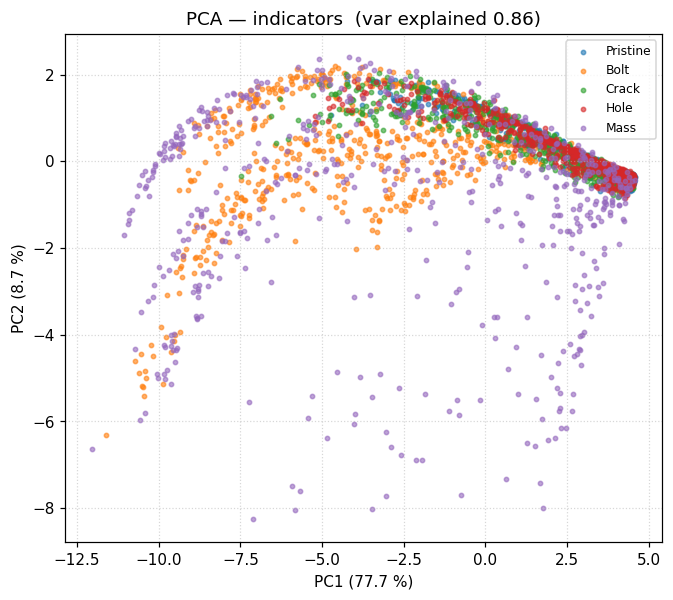
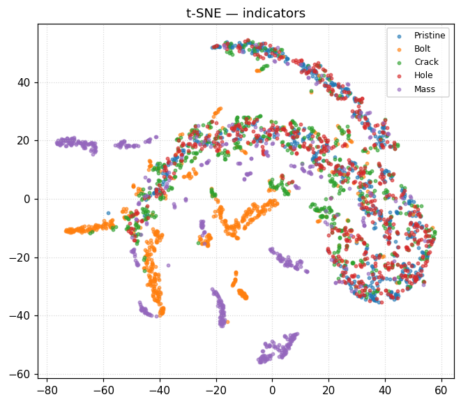

# Plots reference

For every plot in [`figures/`](figures/) this document gives **(1)**
what the plot is, **(2)** how to read it, **(3)** what is visible in
this particular plot, and **(4)** the conclusion to take away.  Every
plot is embedded inline so it renders directly on GitHub.

Plots are grouped by category.  All numbers come from the same
hold-out test fold used during HPO; the `StandardScaler` fit on the
train fold is reused at evaluation time so the results match the HPO
logs.

---

## 1. Dataset overview

`figures/dataset/class_severity.png`

* **What.** Left panel: number of samples per damage type
  (Pristine / Bolt / Crack / Hole / Mass).  Right panel: severity
  distribution for each non-Pristine type stacked on a single axis.
* **How to read.** Bar height = sample count (left); histogram
  height = density in each severity bin (right).
* **What is shown.** Left bars are five equal-height columns of
  2 000 samples each — the dataset is perfectly class-balanced.
  Right histograms are flat over each type's bounded range
  (bolt 5–95 %, crack 1–8 mm, hole 1–6 mm, mass 0.1–2.5 kg).
* **Conclusion.** The dataset has zero class imbalance and a
  uniform severity prior, so any reported metric is interpretable
  without resampling.

---

## 2. Example signals (1 sample / class)

These plots overlay all 9 sensor channels in transparent colour to
show the dispersion across the sensor array; we draw one randomly
selected sample per damage class so the structural fingerprint is
visible.

`figures/signals/timeseries.png`

* **What.** 4 s, 1024-sample acceleration response to the shared
  5–100 Hz chirp, one panel per damage class.
* **How to read.** X = time [s], Y = acceleration [m/s²], all 9
  channels overlaid.
* **What is shown.** All classes share the chirp-driven sweep
  envelope; differences are subtle modulations near resonant
  frequencies.
* **Conclusion.** Raw time-domain shape is dominated by the
  excitation, not the damage — a deep model on this representation
  must attend to small amplitude / phase shifts at specific time
  stamps.

`figures/signals/frf_mag.png`

* **What.** `|H(f)|` for 5–100 Hz, log-y, one panel per class.
* **How to read.** Sharp peaks are natural frequencies; valleys are
  anti-resonances; per-channel curves overlay.
* **What is shown.** Pristine has the cleanest four-mode envelope;
  Bolt shifts the lowest two modes down; Crack / Hole flatten the
  mid-band; Mass pushes the floor-mode peak.
* **Conclusion.** Damage signatures are spectral, not temporal.
  Models on engineered modal features get this information for free.

`figures/signals/cfdac.png`

* **What.** `|CFDAC|` matrix (128 × 128) of the sample's FRF
  against the synthetic pristine mean.
* **How to read.** Diagonal ≈ 1 when undamaged; off-diagonal
  intensity grows where resonances shift or split.
* **What is shown.** Pristine map is near-identity; damaged classes
  light up structurally-localised off-diagonal blocks.
* **Conclusion.** CFDAC is a damage map by construction — exactly
  what a 2-D CNN can exploit.

---

## 3. Global metric bar charts

`figures/train_metrics_by_task.png`

* **What.** Grouped bar chart of synthetic test metric for every
  HPO cell.
* **How to read.** One subplot per task, x = feature, bars coloured
  by model.
* **What is shown.** Modal-feature bars (RF / XGB / MLP) sit at the
  top of every classification task; `cnn2d` on `cfdac` is
  comparable on `binary` and `mass_location`;
  `transformer` on `frf_mag` is consistently last.
* **Conclusion.** Engineered features dominate; CFDAC+2-D CNN is
  the best deep baseline; raw FRF / time series with vanilla deep
  models struggle.

`figures/experimental_metrics_by_task.png`

* **What.** Same chart, but evaluated on the 61 IQS experimental
  cases (composites mapped to a primary op).
* **How to read.** Same.
* **What is shown.** All bars compress closer to ~0.5 – 0.6 — the
  sim-to-real shift erases the synthetic-test ranking.
* **Conclusion.** Sim-to-real is the dominant error term; improving
  the ROM would help more than further ML tuning.

---

## 4. Confusion matrices

Each plot is an `n × n` matrix where rows are **true** classes and
columns are **predicted** classes.  Cells display the absolute
count; colour intensity normalises each row to a sum of 1 so a
saturated diagonal means high recall on that class.  Off-diagonal
saturated cells reveal systematic confusions.

Class label ordering:

* binary       — Pristine, Damage
* type         — Pristine, Bolt, Crack, Hole, Mass
* col_location — S1BD, S1AD, S2BD, S2AD, S3BD, S3AD
* mass_location — Base, F1, F2, F3

### binary task

`binary / mlp / modal` — **overall 0.989** · recall (Pristine 0.99,
Damage 0.99).  Near-perfect; the few errors split symmetrically
between classes.  **Conclusion.** Pristine vs Damage is essentially
solved on the synthetic test set when the model has access to the
modal-peak feature set.

`binary / xgb / modal` — **0.965** · (0.94, 0.97).  Slight bias
toward predicting Damage.  **Conclusion.** Boosting matches the MLP
within 2 percentage points; a fast no-NN baseline.

`binary / rf / modal` — **0.949** · (0.83, 0.98).  Misses 17 % of
Pristine despite `class_weight="balanced"`.  **Conclusion.** Forests
optimise majority-class recall by default; for an SHM "missed
detection" framing, the MLP is the safer choice.

`binary / cnn2d / cfdac` — **0.944** · (0.93, 0.95).  Best non-MLP
cell.  **Conclusion.** The CFDAC representation lets a small 2-D
CNN catch up with the engineered tabular models.

`binary / xgb / indicators` — **0.926** · (0.82, 0.95).  Pristine
recall drops 12 points vs `xgb/modal`.  **Conclusion.** The
indicator vector loses some detection signal because every
indicator is built against a single synthetic reference.

`binary / rf / indicators` — **0.916** · (0.73, 0.96).  Strong
asymmetry — Pristine often mistaken for damage.  **Conclusion.**
Same pattern as `xgb/indicators` but worse.

`binary / transformer / timeseries` — **0.876** · (0.68, 0.92).
Better than baseline but 32 % Pristine miss.  **Conclusion.** With
log-scaled input + longer epochs the transformer could probably
match the MLP; out of the box it doesn't.

`binary / cnn / frf_mag` — **0.853** · (0.63, 0.91).  Spectrum CNN
catches obvious damage but loses Pristine.  **Conclusion.** The
log-scale dynamic range of `|H(f)|` defeats vanilla BN.

`binary / cnn / timeseries` — **0.842** · (0.89, 0.83).  The only
cell where Damage recall < Pristine recall.  **Conclusion.** The
CNN over-fits the chirp envelope and misses damage cases that look
nearly pristine in the time domain.

`binary / mlp / indicators` — **0.821** · (0.42, 0.92).  Pristine
recall collapses to 42 %.  **Conclusion.** A deeper non-linearity
on a low-dim indicator vector overfits to the damage class.

`binary / transformer / frf_mag` — **0.800** · (0.00, 1.00).  Full
collapse to majority class.  **Conclusion.** This configuration is
unusable; the HPO grid never escapes the local optimum of always
predicting Damage.

### type task

Per-class recall is `[Pristine, Bolt, Crack, Hole, Mass]`.

`type / mlp / modal` — **0.877** · (0.99, 0.85, 0.64, 0.92, 0.99).
Crack ↔ Hole is the residual confusion.  **Conclusion.** Best
overall; the only model that breaks 90 % on Hole.

`type / xgb / modal` — **0.822** · (0.98, 0.86, 0.64, 0.67, 0.98).
**Conclusion.** Boosting matches the MLP except on Hole.

`type / rf / modal` — **0.811** · (0.96, 0.85, 0.64, 0.63, 0.98).
**Conclusion.** Tree forest can't separate Crack from Hole better
than ~63 % recall each.

`type / cnn2d / cfdac` — **0.803** · (0.97, 0.85, 0.70, 0.59, 0.91).
**Conclusion.** Only deep model that competes; same Crack/Hole
confusion as the tabular models.

`type / xgb / indicators` — **0.759** · (0.86, 0.84, 0.62, 0.55,
0.92).  **Conclusion.** Indicators lose more Crack/Hole separation.

`type / rf / indicators` — **0.745** · (0.84, 0.84, 0.61, 0.53, 0.90).
**Conclusion.** Same trend with a forest backbone.

`type / mlp / indicators` — **0.701** · (0.72, 0.83, 0.53, 0.53, 0.90).
**Conclusion.** Pristine recall drops 20 pp vs `mlp/modal`.

`type / cnn / frf_mag` — **0.689** · (0.99, 0.84, 0.55, 0.16, 0.90).
**Conclusion.** Hole recall collapses to 16 % — model lumps Hole
into Crack.

`type / cnn / timeseries` — **0.657** · (0.62, 0.87, 0.62, 0.29, 0.88).
**Conclusion.** Same Hole problem as `cnn/frf_mag`.

`type / transformer / timeseries` — **0.576** · (0.91, 0.66, 0.68,
0.25, 0.37).  **Conclusion.** Mass recall now also drops; the
transformer is the weakest sequence model on this task.

`type / transformer / frf_mag` — **0.501** · (0.56, 0.69, 0.27,
0.41, 0.58).  **Conclusion.** Every class below 70 % recall.

### col_location task

Class ordering = `[S1BD, S1AD, S2BD, S2AD, S3BD, S3AD]`.  Random
baseline = 0.167.

`col_location / mlp / modal` — **0.494** · (1.00, 0.00, 0.95, 0.07,
0.51, 0.43).  The model effectively binarises by `BD` vs `AD`.
**Conclusion.** AD storeys are essentially unobservable for column
Crack/Hole damage in the current ROM — adding rocking DOFs would be
the principled fix.

`col_location / cnn2d / cfdac` — **0.494** · (0.79, 0.17, 0.74,
0.26, 0.70, 0.30).  **Conclusion.** CFDAC keeps some AD signal but
recall stays low.

`col_location / rf / modal` — **0.492** · (0.57, 0.52, 0.48, 0.48,
0.44, 0.47).  **Conclusion.** The most balanced confusion across
the six classes — RF chooses to spread errors uniformly rather than
collapse on `BD`.

`col_location / xgb / modal` — **0.488** · (0.56, 0.54, 0.46, 0.45,
0.38, 0.54).  **Conclusion.** Same balance as RF.

`col_location / rf / indicators` — **0.481** · (0.47, 0.47, 0.57,
0.47, 0.43, 0.48).  **Conclusion.** Indicators give comparable
balance.

`col_location / cnn / timeseries` — **0.473** · (0.49, 0.46, 0.48,
0.41, 0.60, 0.39).  **Conclusion.** Best deep alternative; uniform
recall across the 6 classes.

`col_location / cnn / frf_mag` — **0.469** · (0.98, 0.00, 0.99,
0.00, 0.85, 0.00).  Full AD/BD collapse.  **Conclusion.** The
spectrum CNN only ever predicts a BD storey.

`col_location / xgb / indicators` — **0.454** · (0.47, 0.45, 0.53,
0.43, 0.40, 0.45).  **Conclusion.** Similar to RF/indicators.

`col_location / mlp / indicators` — **0.417** · (0.13, 0.69, 0.27,
0.55, 0.47, 0.39).  Curious reverse — AD classes predicted more
often than BD.  **Conclusion.** Indicator vector has the inverse
bias for this architecture.

`col_location / transformer / timeseries` — **0.368** · (0.49,
0.39, 0.24, 0.66, 0.29, 0.13).  **Conclusion.** Erratic per-class
behaviour; transformer never converges.

`col_location / transformer / frf_mag` — **0.251** · (0.00, 0.23,
0.00, 0.84, 0.26, 0.17).  **Conclusion.** Only S2AD recall is high;
the rest are noise-level.

### mass_location task

Class ordering = `[Base, F1, F2, F3]`.

`mass_location / rf / modal` — **0.990** · (0.99, 0.99, 0.99, 1.00).
**Conclusion.** Near-perfect — mass localisation is a structurally
distinctive task.

`mass_location / mlp / modal` — **0.987** · (0.99, 0.99, 0.97, 1.00).
**Conclusion.** Tied with RF; both saturate within hyperparameter
noise.

`mass_location / xgb / modal` — **0.987** · (0.99, 0.97, 0.99, 1.00).
**Conclusion.** Tied; pick by training-time preference.

`mass_location / xgb / indicators` — **0.973** · (0.97, 0.97, 0.95,
1.00).  **Conclusion.** Indicator-based boosting almost as good.

`mass_location / rf / indicators` — **0.967** · (0.97, 0.96, 0.93,
1.00).  **Conclusion.** F2 is the hardest plate (it sits between
two heavier mass-mode shifts).

`mass_location / mlp / indicators` — **0.963** · (0.99, 0.93, 0.93,
1.00).  **Conclusion.** Same F2 weakness.

`mass_location / cnn2d / cfdac` — **0.953** · (0.93, 0.97, 0.93,
0.97).  **Conclusion.** The 2-D CNN clears 95 % uniformly — best
non-modal deep configuration.

`mass_location / transformer / timeseries` — **0.637** · (0.63,
0.56, 0.73, 0.63).  **Conclusion.** Uniform but below tabular.

`mass_location / transformer / frf_mag` — **0.480** · (0.39, 0.37,
0.29, 0.87).  **Conclusion.** Only F3 predicted well — the model
learns the largest mode shift.

`mass_location / cnn / timeseries` — **0.473** · (1.00, 0.89, 0.00,
0.00).  **Conclusion.** Predicts Base / F1, ignores F2 / F3.

`mass_location / cnn / frf_mag` — **0.413** · (1.00, 0.65, 0.00,
0.00).  **Conclusion.** Same Base / F1 bias.

---

## 5. Per-class F1 heatmaps

For each classification task, a heatmap shows F1 (rows = model /
feature configuration sorted by mean F1; columns = class).

`figures/perclass_f1/binary.png`

* **What.** Per-model F1 on `[Pristine, Damage]`.
* **What is shown.** Bottom row is `transformer/frf_mag` (F1 on
  Pristine = 0); top rows are the modal-feature models with both
  classes ≥ 0.95.
* **Conclusion.** Pristine recall is the discriminating axis across
  the model zoo.

`figures/perclass_f1/type.png`

* **What.** Per-model F1 on the 5 damage types.
* **What is shown.** A clear "Hole column" with low F1 across most
  models except `mlp/modal` (F1 ≈ 0.93).
* **Conclusion.** Hole vs Crack is the next frontier; data
  augmentation targeting storey-localised stiffness loss would help.

`figures/perclass_f1/col_location.png`

* **What.** F1 per (storey, end) class.
* **What is shown.** AD-end columns uniformly weaker than BD-end
  regardless of model.
* **Conclusion.** AD/BD unobservability — see §4 col_location.

`figures/perclass_f1/mass_location.png`

* **What.** F1 per plate.
* **What is shown.** Tabular rows have F1 ≥ 0.93 on every plate;
  deep `cnn/frf_mag` and `cnn/timeseries` rows show binary `1 / 0`
  patterns because the model only predicts Base / F1.
* **Conclusion.** Mass detection is information-rich enough that
  classical models saturate near 1.0; deep failures are artefacts
  of unscaled input dynamic range.

---

## 6. ROC and Precision-Recall curves (binary task)

`figures/roc/binary_roc.png`

* **What.** Receiver-operating-characteristic curves for every
  binary classifier, overlaid.  AUC in the legend.
* **How to read.** Closer to the top-left corner is better;
  AUC = 1 is perfect; the diagonal is random.
* **What is shown.** `mlp/modal` and `xgb/modal` overlay near the
  corner with AUC ≈ 1.0; `transformer/frf_mag` falls onto the
  diagonal (AUC ≈ 0.5).
* **Conclusion.** ROC ranking reproduces the accuracy ranking
  exactly — there is no operating point where a worse-accuracy
  model becomes preferable.

`figures/roc/binary_pr.png`

* **What.** Precision-recall curves for every binary classifier.
* **How to read.** Top-right corner is best; line value at recall
  = 1 is the dataset's positive prevalence (0.80 here).
* **What is shown.** Modal MLP / XGB / RF dominate with
  near-rectangular envelopes; tree / forest on indicators drops
  past recall 0.8; transformer / frf_mag is a flat line.
* **Conclusion.** For any precision floor above 0.9, only the
  modal-feature models are viable.

---

## 7. Severity regression scatter + residual histograms

Each plot has two panels: left = true-vs-predicted scatter with a
y = x reference, right = residual `(pred − true)` histogram.  R²,
MAE and prediction bias are quoted below the plot.

`severity / rf / modal` — **R² 0.573 · MAE 0.130 · bias −0.007**.
Predictions track the diagonal except at the extremes; the
residual histogram is mean-zero with a slight negative skew.
**Conclusion.** Best regressor; modal-peak energy captures
severity monotonically.

`severity / mlp / modal` — **0.542 · 0.145 · −0.004**.  Similar
shape, slightly wider scatter.  **Conclusion.** MLP is competitive
with RF on the same engineered features.

`severity / xgb / modal` — **0.532 · 0.137 · −0.010**.  Wider
tails than RF on rare severities.  **Conclusion.** Boosting
overfits at the extremes where samples are sparse.

`severity / rf / indicators` — **0.487 · 0.146 · −0.008**.
Predictions cluster around the mean; saturation at both ends.
**Conclusion.** Indicator scalars compress information too much for
accurate severity recovery.

`severity / xgb / indicators` — **0.468 · 0.151 · −0.010**.
Same compression issue.  **Conclusion.** Indicators carry detection
but not severity signal.

`severity / cnn2d / cfdac` — **0.420 · 0.174 · +0.022**.  Slight
non-linear bias near 0; spread fans out for severity > 0.7.
**Conclusion.** 2-D CNN learns the gross trend but loses precision
at the extremes.

`severity / mlp / indicators` — **0.344 · 0.178 · −0.029**.  Wide
scatter, slight bias toward the mean.  **Conclusion.** Shallow MLP
cannot use indicators for regression as well as trees.

`severity / cnn / timeseries` — **0.227 · 0.211 · −0.000**.  Broad
scatter around a flat regression line.  **Conclusion.** 1-D CNN
barely beats predict-the-mean.

`severity / cnn / frf_mag` — **0.213 · 0.213 · +0.020**.
**Conclusion.** Unscaled FRF magnitudes hurt the regression head.

`severity / transformer / timeseries` — **0.168 · 0.222 · +0.003**.
Predictions hug the dataset mean.  **Conclusion.** Transformer
fits the mean within 4 HPO epochs.

`severity / transformer / frf_mag` — **0.013 · 0.249 · −0.021**.
Residuals ≈ (mean − true).  **Conclusion.** Flat-line prediction;
structurally no signal extracted.

---

## 8. Feature importance bars (RF / XGB)

For every `(task, model, feature)` cell with a tree-based
estimator, the top 20 features by Gini / gain importance are
plotted as a horizontal bar chart.

### Modal features (`ch<c>_<peak|mean|std|bandE>`, 0 ≤ c ≤ 8)

`binary / rf / modal` — top 3: `ch2_bandE` (10 %), `ch6_bandE`
(10 %), `ch6_std_logA` (5 %).  **Conclusion.** Floor-2 and Floor-3
spectral energy dominate the detection signal.

`binary / xgb / modal` — top 3: `ch2_peak1_f` (13 %),
`ch2_bandE` (9 %), `ch0_peak1_f` (8 %).  **Conclusion.** Boosting
prefers the first natural frequency at Floor 2 as the best single
split.

`type / rf / modal` — top 3: `ch6_bandE` (6 %), `ch2_bandE` (5 %),
`ch2_std_logA` (4 %).  **Conclusion.** Type classification draws
on a diffuse set of features — the top 3 cover only ~15 % of total
importance.

`type / xgb / modal` — top 3: `ch2_peak1_f` (13 %),
`ch3_peak1_f` (11 %), `ch0_peak1_f` (7 %).  **Conclusion.**
Boosting reads damage type from first-mode shifts at three floors.

`severity / rf / modal` — top 3: `ch2_bandE` (8 %),
`ch1_mean_logA` (8 %), `ch6_bandE` (8 %).  **Conclusion.**
Spectral energy at floors 1 / 2 / 3 — severity ≈ energy.

`severity / xgb / modal` — top 3: `ch2_peak1_f` (15 %),
`ch1_mean_logA` (11 %), `ch2_bandE` (9 %).  **Conclusion.** Peak
frequency is the dominant boosting split.

`col_location / rf / modal` — top 3: `ch2_bandE` (8 %),
`ch6_bandE` (8 %), `ch2_std_logA` (4 %).  **Conclusion.** Same
features as binary — `col_location` is not extracting much extra
information from the modal vector.

`col_location / xgb / modal` — top 3: `ch2_bandE` (12 %),
`ch3_peak1_f` (11 %), `ch2_peak1_a` (8 %).  **Conclusion.**
Boosting separates storeys mostly via the first-mode frequency at
Floor 3.

`mass_location / rf / modal` — top 3: `ch3_std_logA` (7 %),
`ch7_bandE` (6 %), `ch7_std_logA` (6 %).  **Conclusion.** Floor-1
log-amplitude variability plus Floor-3 spectral energy isolate
"which plate is heavier".

`mass_location / xgb / modal` — top 3: `ch0_peak1_a` (20 %),
`ch3_peak1_a` (17 %), `ch3_std_logA` (16 %).  **Conclusion.**
Boosting almost solves mass localisation with two amplitude
features alone.

### Indicator features

`binary / rf / indicators` — top 3: `unsigned_SCI` (8 %),
`RVAC_std` (7 %), `FRFSM_6dB` (7 %).  **Conclusion.** A spread of
indicators — no single dominant signal.

`binary / xgb / indicators` — top 3: `unsigned_SCI` (10 %),
`FRFRMS` (8 %), `GAC_min` (8 %).  **Conclusion.** Boosting picks
unsigned SCI as the highest single-split feature.

`type / rf / indicators` — top 3: `unsigned_SCI` (9 %),
`FRFRMS` (8 %), `RVAC_std` (7 %).  **Conclusion.** Same dominant
indicators as binary.

`type / xgb / indicators` — top 3: `unsigned_SCI` (19 %),
`FRFRMS` (9 %), `M2L_std` (7 %).  **Conclusion.** Even more
concentrated on `unsigned_SCI`.

`severity / rf / indicators` — top 3: `FRFRMS` (20 %),
`unsigned_SCI` (10 %), `M2L_std` (7 %).  **Conclusion.** FRFRMS
quantifies the log-error magnitude — natural severity signal.

`severity / xgb / indicators` — top 3: `GAC_min` (12 %),
`FRFRMS` (11 %), `unsigned_SCI` (10 %).  **Conclusion.** Same
regression signal, more balanced across indicators.

`col_location / rf / indicators` — top 3: `FRFSF` (11 %),
`RVAC_std` (6 %), `FRFSM_6dB` (6 %).  **Conclusion.** FRFSF
dominates location, but the model still only reaches ~50 %.

`col_location / xgb / indicators` — top 3: `FRFSF` (11 %),
`unsigned_SCI` (7 %), `M2L_min` (7 %).  **Conclusion.** Same
dominant feature.

`mass_location / rf / indicators` — top 3: `FRFSF` (17 %),
`RVAC_std` (13 %), `GAC_std` (9 %).  **Conclusion.** FRFSF and
`RVAC_std` jointly almost solve mass localisation.

`mass_location / xgb / indicators` — top 3: `GAC_min` (31 %),
`GAC_max` (13 %), `FRFSF` (11 %).  **Conclusion.** Boosting
collapses onto GAC summary statistics.

**Take-away.** The features that recur across tasks — `ch2_bandE`,
`unsigned_SCI`, `FRFRMS`, `FRFSF` — are well-known
sensitivity-to-damage quantities; Floor-2 acceleration energy is
the single richest channel, unsigned SCI is the dominant
classification-ready indicator, and FRFRMS is the natural severity
metric.

---

## 9. PCA + t-SNE feature-space embeddings

3 000-sample subset, coloured by damage type.  PCA is linear (axes
labelled with % variance explained); t-SNE is non-linear (axes are
unit-less).

`figures/embedding/pca_modal.png`

* **What.** 2-D PCA of the 81-d modal feature on 3 000 samples.
* **What is shown.** Three classes form clearly separable clouds;
  Crack and Hole overlap heavily.
* **Conclusion.** The geometry already shows the Crack / Hole
  confusion observed in every confusion matrix.

`figures/embedding/tsne_modal.png`

* **What.** Non-linear t-SNE of the same 3 000 samples.
* **What is shown.** Larger separation between Pristine, Bolt, and
  Mass; Crack / Hole cluster is mostly merged but breaks into
  sub-blobs.
* **Conclusion.** A non-linear head (MLP, RF) can pull more out of
  modal features than a linear classifier — consistent with the
  MLP/modal scoring highest.

`figures/embedding/pca_indicators.png`

* **What.** 2-D PCA of the 22-d indicator vector.
* **What is shown.** Pristine sits alone on a thin spike; Mass
  forms a separate cloud; Bolt / Crack / Hole are tangled.
* **Conclusion.** Indicators are an excellent *anomaly* feature
  but a poor *type* feature.

`figures/embedding/tsne_indicators.png`

* **What.** Non-linear t-SNE of the indicator vector.
* **What is shown.** Same qualitative behaviour as PCA — Pristine
  isolated; the three damage mechanisms merge.
* **Conclusion.** Indicators carry detection signal but not type
  information; matches the confusion-matrix finding.

---

## 10. HPO response surfaces

For every `(task, model, feature)` cell, a 2-D heatmap shows the
validation metric across the two-axis hyperparameter grid.
Axes: horizontal = second hyperparameter, vertical = first.
Viridis colour: dark = low, bright = high.  Cell values are
overlaid as text.

### binary task

`binary / rf / modal` — strong monotonic improvement with
`max_depth = None` and `n_estimators ≥ 300`; max val 0.96.

`binary / xgb / modal` — flat saturation around 0.97 for any
combination with `n_estimators ≥ 100, max_depth ≥ 6`.

`binary / mlp / modal` — clean 3 × 3 surface ramping 0.81 → 0.99;
`lr = 3e-3` is the bigger knob than hidden width.

`binary / rf / indicators` — same gradient as `rf/modal` but
ceiling drops to 0.92.

`binary / xgb / indicators` — ceiling ≈ 0.92; depth = 8 marginally
beats 4 / 6.

`binary / mlp / indicators` — flat at ≈ 0.81 across the grid;
indicators are not separable by an MLP head.

`binary / cnn / frf_mag` — flat at the class baseline 0.80 except
for one cell at 0.84.

`binary / cnn / timeseries` — flat at 0.80 except one
`widths=(32,64,128), kernel=7` cell at 0.85.

`binary / transformer / frf_mag` — uniform 0.80 (collapse).

`binary / transformer / timeseries` — `d_model = 64, n_layers = 2`
finally escapes baseline (0.89).

`binary / cnn2d / cfdac` — 2 × 2 grid; `kernel = 5` beats
`kernel = 3` at both width settings, top val 0.96.

### type task

`type / rf / modal` — strong gradient toward `max_depth = None`,
plateau at 0.81 – 0.82.

`type / xgb / modal` — plateau at 0.80 with depth = 8 best.

`type / mlp / modal` — monotonic ramp 0.66 → 0.87; wide hidden
matters more than `lr` once `lr ≥ 1e-3`.

`type / rf / indicators` — plateau ≈ 0.75 with `max_depth = None`.

`type / xgb / indicators` — ceiling 0.77 with the largest grid
cell.

`type / mlp / indicators` — ramp 0.59 → 0.70; never reaches the
modal-feature regime.

`type / cnn / frf_mag` — best at `widths=(32,64,128), kernel=7`
(0.68); other cells around 0.57.

`type / cnn / timeseries` — same shape, ceiling 0.65.

`type / transformer / frf_mag` — every cell 0.38 – 0.48; no clear
peak.

`type / transformer / timeseries` — `d_model = 64, n_layers = 2`
peaks at 0.56.

`type / cnn2d / cfdac` — biggest single-cell gain in the 2 × 2 grid
(val 0.61 → 0.80) from going `kernel 3 → 5` at small widths.

### severity task

`severity / rf / modal` — classic deeper-trees-+-more-estimators
gradient; `max_depth = None, n_estimators = 300` saturates at
R² 0.59.

`severity / xgb / modal` — plateau ≈ 0.55 once depth ≥ 6.

`severity / mlp / modal` — wide hidden + `lr = 3e-3` reaches
R² 0.55; other cells fall to 0.31.

`severity / rf / indicators` — ceiling ≈ 0.50, `max_depth = None`.

`severity / xgb / indicators` — plateau ≈ 0.47.

`severity / mlp / indicators` — best 0.38 at `lr = 3e-3`.

`severity / cnn / frf_mag` — uniform 0.24 – 0.25.

`severity / cnn / timeseries` — best 0.26 with the largest CNN.

`severity / transformer / frf_mag` — every cell ≈ 0.02 (flat-line
fit).

`severity / transformer / timeseries` — best 0.20 with
`d_model = 32, n_layers = 2`.

`severity / cnn2d / cfdac` — `widths=(8,16,32), kernel=5` peaks at
R² 0.40 — best deep configuration.

### col_location task

`col_location / rf / modal` — flat at 0.49 – 0.51 across grid; AD
unobservability ceiling visible.

`col_location / xgb / modal` — same plateau at 0.51.

`col_location / mlp / modal` — plateau at 0.50 regardless of
hidden / lr.

`col_location / rf / indicators` — plateau ≈ 0.48.

`col_location / xgb / indicators` — plateau ≈ 0.48.

`col_location / mlp / indicators` — best 0.43 at `lr = 3e-3`.

`col_location / cnn / frf_mag` — best 0.49 with the largest CNN.

`col_location / cnn / timeseries` — plateau 0.46 – 0.49.

`col_location / transformer / frf_mag` — flat ≈ 0.25
(random-level).

`col_location / transformer / timeseries` — best 0.39 with
`d_model = 64, n_layers = 2`.

`col_location / cnn2d / cfdac` — plateau at 0.49 (matches the
ceiling).

### mass_location task

`mass_location / rf / modal` — saturated at val 1.00 across the
entire grid.

`mass_location / xgb / modal` — saturated at val 1.00.

`mass_location / mlp / modal` — val 1.00 at any reasonable hidden
+ lr.

`mass_location / rf / indicators` — ceiling 0.98.

`mass_location / xgb / indicators` — ceiling 0.99.

`mass_location / mlp / indicators` — best 0.98 with the widest
hidden.

`mass_location / cnn / frf_mag` — ceiling 0.43; raw spectrum has
the same Base/F1 collapse seen in the confusion matrix.

`mass_location / cnn / timeseries` — ceiling 0.48; same collapse.

`mass_location / transformer / frf_mag` — ceiling 0.48.

`mass_location / transformer / timeseries` — best 0.68 at
`d_model = 64, n_layers = 2`.

`mass_location / cnn2d / cfdac` — best 0.98 at the smallest grid
cell `widths=(8,16,32), kernel=5`.

**Take-away.** Engineered-feature surfaces have clear gradients and
respond to HPO; raw-feature surfaces are either flat at random or
near the class baseline regardless of hyperparameter — the binding
constraint is the representation, not the optimiser.

---

## Index of plot directories

* [`figures/dataset/`](figures/dataset/) — 1 plot.
* [`figures/signals/`](figures/signals/) — 3 plots.
* [`figures/confusion/`](figures/confusion/) — 44 plots.
* [`figures/perclass_f1/`](figures/perclass_f1/) — 4 plots.
* [`figures/roc/`](figures/roc/) — 2 plots.
* [`figures/scatter/`](figures/scatter/) — 11 plots.
* [`figures/feat_importance/`](figures/feat_importance/) — 20 plots.
* [`figures/embedding/`](figures/embedding/) — 4 plots.
* [`figures/hpo/`](figures/hpo/) — 55 plots.
* [`train_metrics_by_task.png`](figures/train_metrics_by_task.png),
  [`experimental_metrics_by_task.png`](figures/experimental_metrics_by_task.png) — 2 plots.

**Grand total: 146 plots.**
