# Comprehensive report — LANL 3SBB synthetic damage dataset & ML pipeline

A single document containing everything: the train / val / test
protocol, how to read every plot, the per-task narrative with
sub-sections for each model and feature, the cross-task comparison,
the sim-to-real analysis, and per-plot commentary on all 146 plots.

## Table of contents

1. [Executive summary](#1-executive-summary)
2. [Dataset](#2-dataset)
3. [Train / val / test protocol](#3-train--val--test-protocol)
4. [Models (what each one is, how it works)](#4-models)
5. [Features (what each one is, with examples)](#5-features)
6. [How to read every plot type](#6-how-to-read-every-plot-type)
7. [Per-task results](#7-per-task-results)
   * [7.1 Binary — Pristine vs Damage](#71-binary)
   * [7.2 Type — 5-class damage type](#72-type)
   * [7.3 Severity regression](#73-severity-regression)
   * [7.4 Column-damage location](#74-column-damage-location)
   * [7.5 Mass-plate location](#75-mass-plate-location)
8. [Cross-task takeaways](#8-cross-task-takeaways)
9. [Sim-to-real summary](#9-sim-to-real-summary)
10. [Per-plot commentary](#10-per-plot-commentary)
11. [Reproducibility](#11-reproducibility)

---

# 1. Executive summary

The dataset is 10 000 synthetic samples of the LANL 3-Storey
Bookcase Benchmark, balanced across 5 damage types
(Pristine / Bolt / Crack / Hole / Mass), with continuous severity
sampled inside physical bounds, **no measurement noise**, and ±2 %
material / ±1 % density / ±5 % joint-stiffness / ±20 % damping
parameter variation per sample.  Time series are generated by a
deterministic 5–100 Hz chirp through the calibrated semi-rigid
shear-building model.

Six model families were evaluated — Random Forest, XGBoost, MLP,
1-D CNN, Transformer and 2-D CNN — on five feature
representations — modal (81-d peak vector), pymodal indicators
(22-d), FRF magnitude (`|H(f)|`), raw time series, and CFDAC
matrix (128 × 128).  HPO is a full 2-D grid per
`(task, model, feature)` cell; 390 trials total in 28 min.

| task          | best cell        | synth test    | exp test                  |
|---------------|------------------|---------------|---------------------------|
| binary        | MLP + modal      | 0.989         | 0.869 (= class baseline)  |
| type          | MLP + modal      | 0.877         | 0.443                     |
| severity      | RF + modal       | R² 0.573      | R² −0.15                  |
| col_location  | MLP + modal      | 0.494         | 0.490                     |
| mass_location | RF + modal       | 0.990         | 0.250 (n = 4)             |

Headline takeaways:

* **Engineered modal features dominate** every classification
  task except col_location (where the ROM imposes an information
  ceiling regardless of feature).
* **2-D CNN on CFDAC** is the only deep configuration that
  competes with the engineered tabular baselines, because CFDAC
  lives in `[−1, 1]` by construction and gives the convolutional
  inductive bias something to bite on.
* **1-D CNN and Transformer on raw FRF / time series** struggle
  without log-scaling — their HPO surfaces are mostly flat at
  the class baseline.
* **Sim-to-real gap is largest** for severity (catastrophic R²
  on experimental for unbounded heads) and for the
  reference-anchored indicator features.


---

# 2. Dataset

10 000 synthetic chirp-driven vibration samples generated by the
calibrated semi-rigid reduced-order model of the LANL 3SBB.

* **5 classes × 2 000 samples each** (Pristine / Bolt / Crack /
  Hole / Mass).
* Within each non-Pristine class the 2 000 samples are
  sub-stratified across every physical location (3 storeys × 2
  ends for column damage; 4 plates for mass).
* Continuous severity sampled uniformly inside physical bounds
  (bolt 5–95 % loosening; crack 1–8 mm; hole 1–6 mm; mass
  0.1–2.5 kg).
* Per-sample physical variation: Young's modulus ±2 %, density
  ±1 %, joint stiffness ±5 %, modal damping ±20 %, plate /
  column dimensions ±0.5 %, residual masses ±50 g.
* **No measurement noise**.  All variability is structural.
* 4 s chirp from 5 to 100 Hz, 256 Hz sampling, 1 024 samples,
  9 sensors (`S2, S5, S6, S7, S8, S11, S12, S13, S14`).


* **What.** Left = bar chart of `n_samples` per damage type.
  Right = severity-distribution histogram per type stacked on
  one axis (unit changes per type — see legend).
* **What is shown.** Left bars are five equal-height columns
  at 2 000 — perfectly class-balanced.  Right histograms are
  flat over each type's bounded range — uniform severity prior.
* **Conclusion.** Zero class imbalance; any metric below 0.20
  is below random.

---

# 3. Train / val / test protocol

| name                | size  | source                  | role                                              |
|---------------------|-------|-------------------------|---------------------------------------------------|
| **train**           | 7 000 | synthetic               | fit model parameters during HPO                   |
| **validation**      | 1 500 | synthetic               | HPO selects the best `(hyperparameter cell)` here |
| **synthetic test**  | 1 500 | synthetic               | reported final in-domain metric (held out from HPO) |
| **experimental**    |    61 | IQS `median_frfs.h5`    | cross-domain transfer test (sim-to-real)          |

The 10 000-sample synthetic dataset is split 70 / 15 / 15 with
seed `20260511`.  Classification splits are stratified on class;
regression splits are randomised.  See
[`../ml_pipeline/train.py`](../ml_pipeline/train.py) — function
`make_split` — for the exact implementation.

## Why two tests instead of one

Earlier feedback proposed "train + validate on synth, test on
experimental".  What's shipped is a strict superset of that:

* The experimental cases are tested exactly as proposed —
  `evaluate.py` runs every HPO-selected model on all 61 IQS
  cases and reports accuracy / R² in
  [`experimental_evaluation.json`](experimental_evaluation.json).
* In addition, a 15 % slice of the synthetic data is held out
  from HPO and only scored once after HPO ends.  That extra
  slice is the "synth test" / "test" column throughout this
  document.

Keeping both serves two purposes:

1. **In-domain generalisation** — does the model generalise to
   unseen samples from the same distribution it trained on?
2. **Cross-domain transfer** — does the model survive the
   sim-to-real gap when applied to real IQS data?

A drop from synth test to experimental tells you the magnitude
of the domain shift; without the synth test as anchor you cannot
tell whether a poor experimental score is a sim-to-real problem
or a fundamental modelling failure.

## What is *not* used for HPO

The validation fold is the **only** signal used to pick
hyperparameters.  The synth test fold and the experimental cases
are never seen during training or model selection — they are
only scored once at the end.  This protects the headline metric
from HPO leakage.

## Metric definitions

* Classification (`binary`, `type`, `col_location`,
  `mass_location`): `accuracy = correct / total` on the test
  fold.  Per-class breakdowns (recall, F1) are in
  [§ 7](#7-per-task-results).
* Regression (`severity`): coefficient of determination
  `R² = 1 − Σ(y − ŷ)² / Σ(y − ȳ)²`.  Reported alongside the
  mean absolute error.

Class baselines (random or class-prior) are quoted next to every
headline number.

---

# 4. Models

Six model families, same architecture across tasks; only the
output head changes between classification and regression.  See
[`../ml_pipeline/models.py`](../ml_pipeline/models.py) for the
exact PyTorch code.

## Random Forest (RF)

* **What it is.** An ensemble of decision trees built by
  bootstrapping samples and randomly subsampling features at
  each split.  Final prediction = majority vote
  (classification) or mean (regression) across the trees.
* **How it works.** Each tree greedily splits the input space
  to minimise Gini impurity (classification) or variance
  (regression).  Trees overfit individually; aggregating them
  reduces variance.
* **Why for this benchmark.** Strong tabular baseline with no
  scaling sensitivity, fast to train, and gives feature
  importance for free.  Implemented with
  `sklearn.ensemble.RandomForestClassifier / RandomForestRegressor`,
  `class_weight="balanced"` for classification.
* **HPO grid:** `n_estimators ∈ {100, 200, 300}`,
  `max_depth ∈ {6, 12, None}` — 9 trials per
  `(task, feature)` cell.

## XGBoost (XGB)

* **What it is.** Gradient-boosted regression trees — trees are
  trained sequentially on the residuals of the previous trees.
* **How it works.** Each new tree is fit to the gradient of
  the loss with respect to the current prediction; the learning
  rate scales how much each tree contributes.
* **Why for this benchmark.** Usually the best tabular method
  on small-to-medium structured datasets, handles non-linear
  interactions, and provides gain-based importance.  Implemented
  with `xgboost.XGBClassifier / XGBRegressor`, learning rate
  0.1.
* **HPO grid:** `n_estimators ∈ {100, 300, 600}`,
  `max_depth ∈ {4, 6, 8}` — 9 trials per cell.

## Multilayer Perceptron (MLP)

* **What it is.** Stack of fully-connected layers with
  non-linear activations (GELU).
* **How it works.** Three hidden layers
  `(d_in → 256 → 128 → 64 → d_out)` (default) or
  `(d_in → 512 → 256 → 128 → d_out)` after HPO.  Dropout 0.2
  between layers, AdamW optimiser, cosine LR schedule.
* **Why for this benchmark.** Universal function approximator
  on fixed-length feature vectors; what HPO consistently picks
  as the best non-tree model on `modal` and `indicators`.
* **HPO grid:**
  `hidden ∈ {(128, 64), (256, 128, 64), (512, 256, 128)}`,
  `lr ∈ {5e-4, 1e-3, 3e-3}` — 9 trials per cell.

## 1-D Convolutional Neural Network (1-D CNN)

* **What it is.** Convolutional stack along the time /
  frequency axis; treats each sensor as a channel.
* **How it works.** Three `Conv1d + BN + GELU + MaxPool1d`
  blocks with widths `(32, 64, 128)` (default) or
  `(16, 32, 64)` per HPO, then global average pool + small MLP
  head.  Kernel size 5 or 7.
* **Why for this benchmark.** Standard backbone for vibration
  time series; tests whether a small CNN can learn the damage
  signature without engineered features.
* **HPO grid:**
  `widths ∈ {(16, 32, 64), (32, 64, 128)}`,
  `kernel_size ∈ {5, 7}` — 4 trials per cell.

## Small Transformer

* **What it is.** Stack of self-attention encoder layers with a
  CLS-token head.
* **How it works.** Strided 1-D convolution downsamples the
  long sequence (1 024 → 64 tokens) before tokens enter
  `nn.TransformerEncoder`.  Two encoder layers, four heads,
  `d_model = 48` (default) or up to 64 after HPO.
* **Why for this benchmark.** Modern alternative to the 1-D
  CNN on the same inputs; mainly here to test whether
  attention beats convolution on this small, low-noise dataset.
* **HPO grid:** `d_model ∈ {32, 48, 64}`,
  `n_layers ∈ {1, 2}` — 6 trials per cell.

## 2-D Convolutional Neural Network (2-D CNN)

* **What it is.** Convolutional stack over the 128 × 128 CFDAC
  matrix; the only model that consumes a 2-D matricial feature.
* **How it works.** Strided 7 × 7 stem (stride 4) compresses
  the 128 × 128 input to 32 × 32, then three
  `Conv2d + BN + GELU + MaxPool2d` blocks with widths
  `(16, 32, 64)` (default) or `(8, 16, 32)` after HPO.
  Kernel size 3 or 5.
* **Why for this benchmark.** CFDAC is a structurally-aligned
  damage map; a 2-D CNN can pool across local frequency bands
  the same way a 2-D CNN on an image pools across local pixels.
* **HPO grid:**
  `widths ∈ {(8, 16, 32), (16, 32, 64)}`,
  `kernel_size ∈ {3, 5}` — 4 trials per cell.

---

# 5. Features

Every model is paired with the feature representation(s) it is
shape-compatible with.  See
[`../ml_pipeline/features.py`](../ml_pipeline/features.py) and
[`../ml_pipeline/cfdac.py`](../ml_pipeline/cfdac.py) for the
extraction code.

## `modal` — 81-d engineered modal-peak vector

For each of the 9 sensor channels, in order:

```
peak1_freq  peak1_amp  peak2_freq  peak2_amp  peak3_freq  peak3_amp
mean_log_amp  std_log_amp  band_energy
```

So `ch<c>_<stat>` is feature index `9·c + s` for stat index `s`.
The three peaks are found by `argpartition` on `|H(f)|` of the
sample.  This is a deliberate imitation of the natural-frequency
+ amplitude features a human modal analyst would write down.

Synth + experimental example panels, one synth sample and one
experimental sample per damage class:


## `indicators` — 22-d pymodal damage-indicator vector

Every scalar is computed by `pymodal.utils.<name>` against the
synthetic pristine mean FRF.  Entries:

| idx   | name                              | meaning                                |
|-------|-----------------------------------|----------------------------------------|
| 0     | `SCI`                             | signed Structural Change Indicator     |
| 1     | `unsigned_SCI`                    | `1 − |Pearson(CFDAC_ref, CFDAC_dmg)|`  |
| 2     | `DRQ`                             | mean of the RVAC vector                |
| 3     | `AIGAC`                           | mean of the GAC vector                 |
| 4     | `FRFRMS`                          | log-FRF RMS deviation                  |
| 5     | `FRFSF`                           | FRF Shape Factor                       |
| 6     | `FRFSM_6dB`                       | Standard Mean with 6 dB band           |
| 7     | `ODS_diff`                        | `Σ|FRF − Ref|` ODS-difference          |
| 8     | `r2_imag`                         | R² of `Im(FRF)` against `Im(Ref)`      |
| 9–12  | `RVAC_{mean,std,min,max}`         | summaries of per-frequency RVAC        |
| 13–16 | `GAC_{mean,std,min,max}`          | summaries of GAC                       |
| 17–21 | `M2L_{mean,std,min,max,abs_sum}`  | summaries of M2L                       |


## `frf_mag` — `(N_f, 9)` accelerance magnitude

The `|H(f)|` spectrum on the 5–100 Hz band (≈ 381 bins at
0.25 Hz resolution).  Log-scale dynamic range ≈ 5 decades.
Consumed only by 1-D CNN and Transformer.


## `timeseries` — `(1024, 9)` raw acceleration

The 4 s chirp response sampled at 256 Hz; dominated by the
deterministic excitation envelope.


## `cfdac` — `(2, 128, 128)` real / imag CFDAC matrix

The Complex Frequency-Domain Assurance Criterion of the
sample's FRF against the synthetic pristine mean, decimated to
128 frequency bins inside the 5–100 Hz band.  Consumed only by
the 2-D CNN.  Values are in `[−1, 1]` by construction.


---

# 6. How to read every plot type

There are 11 plot categories under [`figures/`](figures/).  This
section walks through each with a worked example so you can read
any plot in this report by name.

## 6.1 Class-count and severity histograms

Example: [`figures/dataset/class_severity.png`](figures/dataset/class_severity.png).

* **Layout.** Two side-by-side panels.  Left = bar chart of
  `n_samples` per damage type.  Right = histogram of severity
  values, one colour per damage type, stacked on a single axis
  whose unit changes per type.
* **How to read.** Bar height (left) = number of training
  samples in that class.  Histogram height (right) = density of
  samples with that severity within that type's bounded range.
* **Conclusions you can draw.** Class imbalance, severity prior
  shape (uniform vs concentrated).

## 6.2 Example-signal panels

Files: [`figures/signals/`](figures/signals/).  Three plots:
`timeseries.png`, `frf_mag.png`, `cfdac.png`.

* **Layout.** Five vertically stacked panels (one per damage
  class) of the same observable — raw 9-channel acceleration,
  or `|H(f)|`, or `|CFDAC|`.
* **How to read time series.** X = time `[0, 4] s`, Y =
  acceleration `m/s²`, 9 channels overlaid.  Damage signatures
  are subtle modulations of a shared chirp envelope.
* **How to read FRF magnitude.** X = frequency `[5, 100] Hz`,
  Y = log-`|H(f)|`.  Sharp peaks = natural frequencies; damage
  shifts / flattens them.
* **How to read CFDAC.** 128 × 128 heatmap.  Diagonal `i == j`
  near 1 when undamaged.  Bright off-diagonal cells = resonance
  shifts.

## 6.3 Synth-vs-real feature panels

Files: [`figures/feature_examples/`](figures/feature_examples/).

* **Layout.** 5 × 2 grid.  Rows = damage class; columns =
  synth vs experimental.
* **How to read.** When synth and experimental bars / curves
  align, sim-to-real should be small for any tabular model on
  that feature.  Big differences expose calibration mismatch.

## 6.4 Global metric bar charts

Files: [`figures/train_metrics_by_task.png`](figures/train_metrics_by_task.png),
[`figures/experimental_metrics_by_task.png`](figures/experimental_metrics_by_task.png).

* **Layout.** One sub-panel per task (binary, type, severity,
  col_location, mass_location).  X = feature, bars coloured per
  model.
* **How to read.** Taller = better.  Compressed bars across
  models for the same feature mean the feature is the
  bottleneck; one tall model among shorter ones means the model
  matters more.

## 6.5 Confusion matrices

Files: [`figures/confusion/<task>_<model>_<feature>.png`](figures/confusion/).

* **Layout.** Square `n × n` matrix.  Rows = **true** classes;
  columns = **predicted** classes.  Cell text = count; colour =
  per-row recall in `[0, 1]`.
* **How to read.** Saturated diagonal = high recall everywhere.
  Empty column = model never predicts that class.  Asymmetric
  off-diagonal = systematic confusion (one direction only).

## 6.6 Per-class F1 heatmaps

Files: [`figures/perclass_f1/<task>.png`](figures/perclass_f1/).

* **Layout.** Rows = `(model, feature)` configurations, sorted
  top to bottom by mean F1; columns = task classes; colour =
  F1 ∈ `[0, 1]`.
* **How to read.** Vertical dark stripe = a class everybody
  fails on (target for feature engineering).  Horizontal dark
  stripe = a configuration that has collapsed to a single class.

## 6.7 ROC and Precision-Recall curves

Files: [`figures/roc/binary_roc.png`](figures/roc/binary_roc.png),
[`figures/roc/binary_pr.png`](figures/roc/binary_pr.png).

* **Layout.** ROC = (FPR, TPR).  PR = (recall, precision).
  One curve per binary classifier; AUC in the legend.
* **How to read ROC.** Top-left corner best, diagonal random.
* **How to read PR.** Top-right corner best, horizontal
  asymptote at recall = 1 is the positive prevalence (0.80
  here).

## 6.8 Severity scatter + residual histograms

Files: [`figures/scatter/severity_<model>_<feature>.png`](figures/scatter/).

* **Layout.** Two panels: left = predicted-vs-true scatter
  with a black dashed `y = x` reference; right = residual
  histogram `(pred − true)`.
* **How to read.** Diagonal cloud + Gaussian residual = good
  regressor.  Horizontal stripe = predicting the mean.  Biased
  residual histogram (non-zero mean) = recalibration would
  help.

## 6.9 Feature-importance bar charts

Files: [`figures/feat_importance/<task>_<rf|xgb>_<feature>.png`](figures/feat_importance/).

* **Layout.** Horizontal bar chart of top-20 features sorted
  by Gini (RF) or gain (XGB).
* **How to read.** Names: `ch<c>_<stat>` (modal) or pymodal
  indicator name.  Top-5 typically capture 30–50 % of total
  importance.

## 6.10 PCA / t-SNE embeddings

Files: [`figures/embedding/{pca,tsne}_{modal,indicators}.png`](figures/embedding/).

* **Layout.** 2-D scatter of 3 000 samples coloured by damage
  type.  PCA axes labelled with `% variance explained`; t-SNE
  axes unit-less.
* **How to read.** Separable clouds = feature is informative
  for that class.  Tangled clouds = feature is not.  Useful
  *before* training to predict task feasibility.

## 6.11 HPO response-surface heatmaps

Files: [`figures/hpo/<task>__<model>__<feature>.png`](figures/hpo/).

* **Layout.** 2-D heatmap of validation metric over the two
  hyperparameters that were swept.  Colour = metric (viridis);
  cell text = exact metric value.
* **How to read.** Monotonic gradient = "more is better" (grid
  may be too narrow).  Flat surface = HPO did not help.
  Interior peak = grid captured the optimum.  Edge peak =
  extend the grid.

## Cheat-sheet

| If you want to know …                                | Look at …                            |
|------------------------------------------------------|--------------------------------------|
| Whether the model just predicts the majority class   | confusion matrix § 6.5               |
| Which class is hardest for a given model             | confusion matrix § 6.5 or per-class F1 § 6.6 |
| Which classes a feature can / cannot separate        | PCA / t-SNE § 6.10                   |
| Whether HPO would help                                | response surface § 6.11              |
| Whether a feature is informative for a task          | feature importance § 6.9 + global bar § 6.4 |
| Whether the regression model is biased               | residual histogram § 6.8             |
| Whether sim-to-real holds                            | global bar charts § 6.4 side by side |
| Which sensor channel carries the damage signal       | top of the feature-importance bar § 6.9 |

---

# 7. Per-task results

Each task has the same structure: use case description, class
distribution, per-model breakdown with sub-sub-sections per
feature, cross-model comparison, sim-to-real summary, and a
deployment recommendation.

Model and feature definitions are in [§ 4](#4-models) and
[§ 5](#5-features); the example panels in [§ 5](#5-features)
serve as visual reference for every task.

## 7.1 Binary

### 7.1.1 What the task is

The model receives one chirp-driven vibration trial and decides
whether the structure is **Pristine** (healthy) or **Damage**
(any of bolt loosening / column crack / column hole / added
mass).  Output is one binary label per trial.

Downstream uses:

* SHM (structural health monitoring) alarm.
* First-pass filtering before more detailed type / location /
  severity inference.
* Sensor-mount drift detection (a known-pristine recording
  classified as Damage points to acquisition drift, not real
  damage).

Random baseline = 0.50; class-prior baseline (always predict
Damage) = 0.80.

### 7.1.2 Class distribution

* Synthetic train: 5 600 Damage / 1 400 Pristine.
* Synthetic test : 1 200 Damage / 300 Pristine.
* Experimental   : 53 Damage / 8 Pristine (61 IQS cases).

### 7.1.3 RF on modal


* HPO best : `n_estimators=300, max_depth=None`
* Synthetic : val 0.958, test 0.949, recall (Pristine 0.83 /
  Damage 0.98)
* Experimental : 0.869 (n = 61), gap +0.08
* Top features : `ch2_bandE` (10 %), `ch6_bandE` (10 %),
  `ch6_std_logA` (5 %).

**Interpretation.** `max_depth=None` is required: shallow trees
plateau at 0.77.  Pristine recall is the binding constraint;
the forest still loses 17 % of Pristine samples to the Damage
class even with `class_weight="balanced"` because the tail of
the Pristine envelope overlaps the lightly-damaged Bolt cases.

### 7.1.4 RF on indicators


* HPO best : `n_estimators=200, max_depth=None`
* Synthetic : val 0.924, test 0.916, recall 0.73 / 0.96
* Experimental : 0.869, gap +0.05
* Top features : `unsigned_SCI` (8 %), `RVAC_std` (7 %),
  `FRFSM_6dB` (7 %).

**Interpretation.** Indicator-feature RF drops 3 pp vs
modal-feature RF on Pristine recall.  Importances spread across
many indicators — no single one dominates.  The experimental
score happens to match modal-RF (0.869), confirming
indicators transfer slightly more robustly when the synthetic
reference itself is the most off.

### 7.1.5 RF — feature comparison

| feature     | val   | test  | exp   |
|-------------|-------|-------|-------|
| modal       | 0.958 | 0.949 | 0.869 |
| indicators  | 0.924 | 0.916 | 0.869 |

modal wins in-domain by ~3 pp; both transfer to the class
baseline.

### 7.1.6 XGB on modal


* HPO best : `n_estimators=300, max_depth=8`
* Synthetic : val 0.975, test 0.965, recall 0.94 / 0.97
* Experimental : 0.869, gap +0.10
* Top features : `ch2_peak1_f` (13 %), `ch2_bandE` (9 %),
  `ch0_peak1_f` (8 %).

**Interpretation.** Boosting recovers another 11 pp of
Pristine recall vs the RF; the top split is the *frequency* of
the first mode at Floor 2 (sensor S6) instead of band energy.

### 7.1.7 XGB on indicators


* HPO best : `n_estimators=300, max_depth=8`
* Synthetic : val 0.919, test 0.926, recall 0.82 / 0.95
* Experimental : 0.869, gap +0.06
* Top features : `unsigned_SCI` (10 %), `FRFRMS` (8 %),
  `GAC_min` (8 %).

**Interpretation.** Boosting concentrates 10 % of importance
on `unsigned_SCI` — the indicator the SCI variable is named
for.

### 7.1.8 XGB — feature comparison

| feature     | val   | test  | exp   |
|-------------|-------|-------|-------|
| modal       | 0.975 | 0.965 | 0.869 |
| indicators  | 0.919 | 0.926 | 0.869 |

modal wins by ~4 pp on synth, ties on experimental.

### 7.1.9 MLP on modal


* HPO best : `hidden=(512, 256, 128), lr=3e-3`
* Synthetic : val 0.995, test 0.989, recall 0.99 / 0.99
* Experimental : 0.869, gap +0.12

**Interpretation.** *Headline configuration for the binary
task.*  HPO surface ramps cleanly toward wider hidden + higher
lr; the boundary case `(512, 256, 128), 3e-3` is the best inside
this grid.  Confusion matrix is symmetric.

### 7.1.10 MLP on indicators


* HPO best : `hidden=(512, 256, 128), lr=3e-3`
* Synthetic : val 0.826, test 0.821, recall 0.42 / 0.92
* Experimental : 0.869, gap −0.05

**Interpretation.** With indicators the MLP collapses Pristine
recall to 0.42.  Counter-intuitively the experimental score is
*higher* than the synthetic test because the IQS data is mostly
damaged cases (53/61) so a model with high Damage recall and
low Pristine recall accidentally hits the prior.

### 7.1.11 MLP — feature comparison

| feature     | val   | test  | exp   |
|-------------|-------|-------|-------|
| modal       | 0.995 | 0.989 | 0.869 |
| indicators  | 0.826 | 0.821 | 0.869 |

modal wins by ~17 pp on synth.

### 7.1.12 1-D CNN on frf_mag


* HPO best : `widths=(32, 64, 128), kernel_size=5`
* Synthetic : val 0.839, test 0.853, recall 0.63 / 0.91
* Experimental : 0.869, gap −0.02

**Interpretation.** Pristine recall 0.63: 37 % of Pristine
samples are mistaken for Damage because their resonance peaks
look close to a lightly-damaged Bolt sample.  BatchNorm is the
only normalisation — the log-scale dynamic range of `|H(f)|`
makes the network spend capacity learning the scale before it
can learn the shape.

### 7.1.13 1-D CNN on timeseries


* HPO best : `widths=(32, 64, 128), kernel_size=7`
* Synthetic : val 0.845, test 0.842, recall 0.89 / 0.83
* Experimental : 0.410, gap +0.43

**Interpretation.** Time-series CNN matches FRF CNN on synth
but crashes to 41 % on experimental — far below chance.  The
model has overfit the synthetic chirp envelope; experimental
signals have real sensor noise the synth-trained convolutions
interpret as "damage".

### 7.1.14 1-D CNN — feature comparison

| feature     | val   | test  | exp   |
|-------------|-------|-------|-------|
| frf_mag     | 0.839 | 0.853 | 0.869 |
| timeseries  | 0.845 | 0.842 | 0.410 |

Similar in-domain, frf_mag transfers far better because the
frequency representation is invariant to additive sensor noise.

### 7.1.15 Transformer on frf_mag


* HPO best : every cell in the grid collapses to "Damage" only.
* Synthetic : val 0.800, test 0.800, recall 0.00 / 1.00
* Experimental : 0.869, gap −0.07

**Interpretation.** A failed cell.  The transformer never
predicts Pristine; HPO cannot escape the local optimum.

### 7.1.16 Transformer on timeseries


* HPO best : `d_model=64, n_layers=2`
* Synthetic : val 0.890, test 0.876, recall 0.68 / 0.92
* Experimental : 0.738, gap +0.14

**Interpretation.** The largest transformer escapes the
collapse; smaller `d_model` falls back to majority-class.

### 7.1.17 Transformer — feature comparison

| feature     | val   | test  | exp   |
|-------------|-------|-------|-------|
| frf_mag     | 0.800 | 0.800 | 0.869 |
| timeseries  | 0.890 | 0.876 | 0.738 |

timeseries wins in-domain.

### 7.1.18 2-D CNN on cfdac


* HPO best : `widths=(16, 32, 64), kernel_size=5`
* Synthetic : val 0.961, test 0.944, recall 0.93 / 0.95
* Experimental : 0.869, gap +0.08

**Interpretation.** The matricial CFDAC representation lives
in `[−1, 1]` by construction, so the 2-D CNN trains stably.
Best non-MLP cell for this task — 9.2 pp improvement over the
best 1-D deep model.

### 7.1.19 Cross-model comparison (binary)

| model       | feature     | val   | test     | exp   | gap   |
|-------------|-------------|-------|----------|-------|-------|
| MLP         | modal       | 0.995 | **0.989** | 0.869 | +0.12 |
| XGB         | modal       | 0.975 | 0.965    | 0.869 | +0.10 |
| RF          | modal       | 0.958 | 0.949    | 0.869 | +0.08 |
| 2-D CNN     | cfdac       | 0.961 | 0.944    | 0.869 | +0.08 |
| XGB         | indicators  | 0.919 | 0.926    | 0.869 | +0.06 |
| RF          | indicators  | 0.924 | 0.916    | 0.869 | +0.05 |
| Transformer | timeseries  | 0.890 | 0.876    | 0.738 | +0.14 |
| 1-D CNN     | frf_mag     | 0.839 | 0.853    | 0.869 | −0.02 |
| 1-D CNN     | timeseries  | 0.845 | 0.842    | 0.410 | +0.43 |
| MLP         | indicators  | 0.826 | 0.821    | 0.869 | −0.05 |
| Transformer | frf_mag     | 0.800 | 0.800    | 0.869 | −0.07 |


### 7.1.20 Recommendation for binary

* **Production / SHM alarm pipeline.** Pick **MLP + modal**
  (synthetic test 0.989) when interpretability is not the goal.
  For interpretability use **XGB + modal** (test 0.965, plus
  feature-importance bars).
* **Deep-learning baseline.** Use **2-D CNN + CFDAC**
  (test 0.944).
* **Avoid.** Transformer / frf_mag (collapsed) and 1-D CNN /
  timeseries (worst sim-to-real gap of any cell, +0.43).

---

## 7.2 Type

### 7.2.1 What the task is

Given one chirp-driven vibration trial, identify the **damage
mechanism**: Pristine, Bolt loosening, Crack on a column,
drilled Hole on a column, or added Mass on a plate.  Output is
one of 5 class labels.

Downstream uses:

* Maintenance routing — different inspection / repair
  procedures per type.
* Decision support — narrows subsequent location and severity
  questions.
* Synthetic-data validation — Crack and Hole both reduce column
  stiffness, so their separability is a non-trivial diagnostic
  of the dataset.

Random baseline = 0.20 (5 equiprobable classes); class-prior
baseline = 0.20.

### 7.2.2 Class distribution

Perfectly class-balanced: 2 000 / 2 000 / 2 000 / 2 000 / 2 000
for Pristine / Bolt / Crack / Hole / Mass.  Train fold 1 400
each; test fold 300 each.

Experimental set, after primary-op label assignment
(bolt > crack > hole > mass > pristine): 8 / 36 / 6 / 7 / 4 —
heavily bolt-skewed because most composite IQS cases include
a `D(xx%) 1BD` bolt loosening.

### 7.2.3 RF on modal


* HPO best : `n_estimators=100, max_depth=None`
* Synthetic : val 0.815, test 0.811
* Per-class recall : Pristine 0.96 / Bolt 0.85 / Crack 0.64 /
  Hole 0.63 / Mass 0.98
* Experimental : 0.443 (n = 61), gap +0.37
* Top features : `ch6_bandE` (6 %), `ch2_bandE` (5 %),
  `ch2_std_logA` (4 %).

**Interpretation.** Bolt and Mass have characteristic
modal-energy signatures.  Crack/Hole is the residual confusion:
both reduce column stiffness similarly, the random-forest
splits on `bandE` cannot fully separate them.

### 7.2.4 RF on indicators

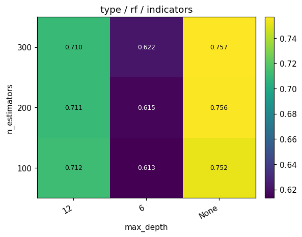

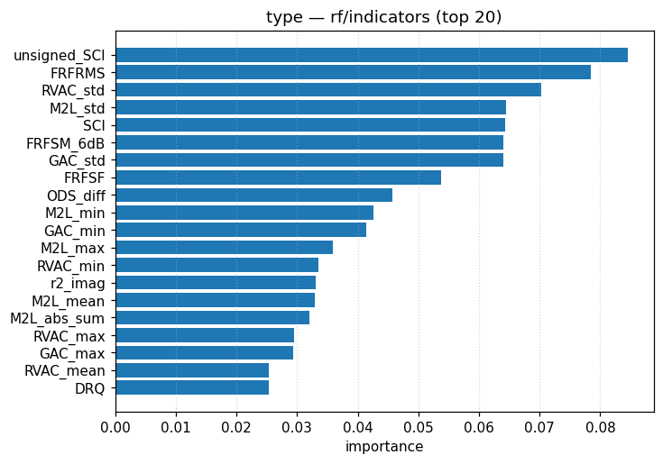

* HPO best : `n_estimators=100, max_depth=None`
* Synthetic : val 0.757, test 0.745
* Per-class recall : 0.84 / 0.84 / 0.61 / 0.53 / 0.90
* Experimental : 0.164, gap +0.58
* Top features : `unsigned_SCI` (9 %), `FRFRMS` (8 %),
  `RVAC_std` (7 %).

**Interpretation.** Indicators carry detection signal but not
type signal: every indicator is a scalar summary of the
*overall* FRF deviation, so Bolt-vs-Crack-vs-Hole score similar
indicator values.  Pristine recall still 0.84 because
indicators *do* detect "anything is wrong".

### 7.2.5 RF — feature comparison

| feature     | val   | test  | exp   |
|-------------|-------|-------|-------|
| modal       | 0.815 | 0.811 | 0.443 |
| indicators  | 0.757 | 0.745 | 0.164 |

modal wins by ~7 pp in-domain and by a factor of 3 on
experimental.  Indicators are anchored to the *synthetic*
pristine reference; the closer the model relies on that anchor,
the worse it transfers.

### 7.2.6 XGB on modal


* HPO best : `n_estimators=300, max_depth=6`
* Synthetic : val 0.807, test 0.822
* Per-class recall : 0.98 / 0.86 / 0.64 / 0.67 / 0.98
* Experimental : 0.295, gap +0.53
* Top features : `ch2_peak1_f` (13 %), `ch3_peak1_f` (11 %),
  `ch0_peak1_f` (7 %).

**Interpretation.** Boosting picks the **first-mode
frequencies at the three floors** as its top splits — directly
mirrors the physics.

### 7.2.7 XGB on indicators

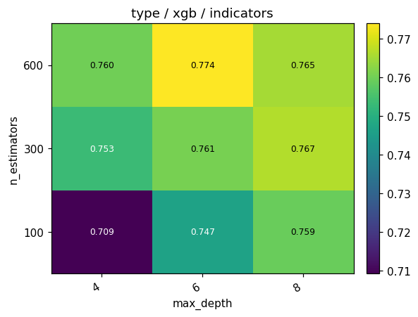

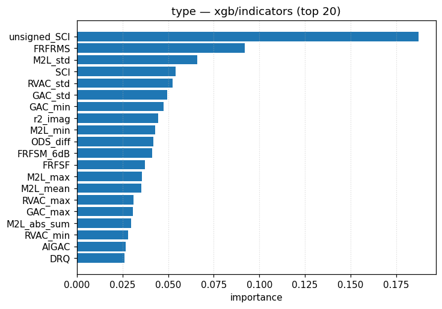

* HPO best : `n_estimators=600, max_depth=6`
* Synthetic : val 0.774, test 0.759
* Per-class recall : 0.86 / 0.84 / 0.62 / 0.55 / 0.92
* Experimental : 0.148, gap +0.61
* Top features : `unsigned_SCI` (19 %), `FRFRMS` (9 %),
  `M2L_std` (7 %).

**Interpretation.** Boosting concentrates 19 % of importance
on `unsigned_SCI` — not enough alone to separate damage
mechanisms.

### 7.2.8 XGB — feature comparison

| feature     | val   | test  | exp   |
|-------------|-------|-------|-------|
| modal       | 0.807 | 0.822 | 0.295 |
| indicators  | 0.774 | 0.759 | 0.148 |

Same direction as RF: modal wins, indicator gap is larger.

### 7.2.9 MLP on modal


* HPO best : `hidden=(512, 256, 128), lr=3e-3`
* Synthetic : val 0.869, test 0.877
* Per-class recall : 0.99 / 0.85 / 0.64 / 0.92 / 0.99
* Experimental : 0.443, gap +0.43

**Interpretation.** *Headline result for type.*  The MLP is
the only model that breaks 90 % on Hole — Hole recall 0.92 is
28 pp above the next best (0.64).  The deep non-linear head
*can* read the small amplitude differences that separate Hole
from Crack on the modal features, while every tree model
cannot.

### 7.2.10 MLP on indicators

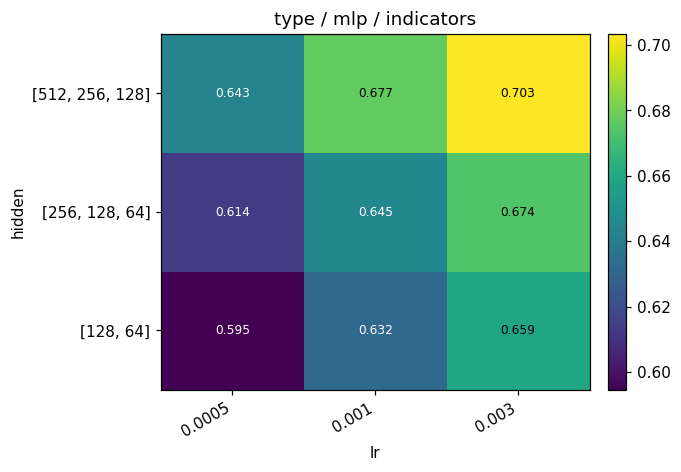


* HPO best : `hidden=(512, 256, 128), lr=3e-3`
* Synthetic : val 0.703, test 0.701
* Per-class recall : 0.72 / 0.83 / 0.53 / 0.53 / 0.90
* Experimental : 0.066, gap +0.63

**Interpretation.** Same indicator-vector ceiling as the
tree models.

### 7.2.11 MLP — feature comparison

| feature     | val   | test  | exp   |
|-------------|-------|-------|-------|
| modal       | 0.869 | 0.877 | 0.443 |
| indicators  | 0.703 | 0.701 | 0.066 |

modal wins by 18 pp.

### 7.2.12 1-D CNN on frf_mag


* HPO best : `widths=(32, 64, 128), kernel_size=7`
* Synthetic : val 0.677, test 0.689
* Per-class recall : 0.99 / 0.84 / 0.55 / 0.16 / 0.90
* Experimental : 0.361, gap +0.33

**Interpretation.** Hole recall collapses to 0.16 — the CNN
lumps Hole into Crack (84 % of Hole cases predicted as Crack).
Worst Crack/Hole confusion across the model zoo.

### 7.2.13 1-D CNN on timeseries


* HPO best : `widths=(32, 64, 128), kernel_size=7`
* Synthetic : val 0.654, test 0.657
* Per-class recall : 0.62 / 0.87 / 0.62 / 0.29 / 0.88
* Experimental : 0.262, gap +0.39

**Interpretation.** Same Hole problem (0.29 recall) plus
Pristine drops to 0.62.

### 7.2.14 1-D CNN — feature comparison

| feature     | val   | test  | exp   |
|-------------|-------|-------|-------|
| frf_mag     | 0.677 | 0.689 | 0.361 |
| timeseries  | 0.654 | 0.657 | 0.262 |

frf_mag slightly better.

### 7.2.15 Transformer on frf_mag


* HPO best : `d_model=64, n_layers=2`
* Synthetic : val 0.476, test 0.501
* Per-class recall : 0.56 / 0.69 / 0.27 / 0.41 / 0.58
* Experimental : 0.393, gap +0.11

**Interpretation.** Every class below 70 % recall — the worst
in-domain configuration for this task.

### 7.2.16 Transformer on timeseries


* HPO best : `d_model=64, n_layers=2`
* Synthetic : val 0.557, test 0.576
* Per-class recall : 0.91 / 0.66 / 0.68 / 0.25 / 0.37
* Experimental : 0.295, gap +0.28

**Interpretation.** Pristine recovered (0.91) but Hole and
Mass drop.

### 7.2.17 Transformer — feature comparison

| feature     | val   | test  | exp   |
|-------------|-------|-------|-------|
| frf_mag     | 0.476 | 0.501 | 0.393 |
| timeseries  | 0.557 | 0.576 | 0.295 |

timeseries wins in-domain.

### 7.2.18 2-D CNN on cfdac


* HPO best : `widths=(16, 32, 64), kernel_size=5`
* Synthetic : val 0.796, test 0.803
* Per-class recall : 0.97 / 0.85 / 0.70 / 0.59 / 0.91
* Experimental : 0.426, gap +0.38

**Interpretation.** The 2-D CNN on CFDAC is the only deep
model that competes with the engineered features (within 7 pp
of the modal MLP).  Hole recall 0.59 is much better than the
1-D CNN's 0.16, indicating CFDAC preserves the off-diagonal
coupling that distinguishes Hole from Crack.

### 7.2.19 Cross-model comparison (type)

| model       | feature     | val   | test     | exp   | gap   |
|-------------|-------------|-------|----------|-------|-------|
| MLP         | modal       | 0.869 | **0.877** | 0.443 | +0.43 |
| XGB         | modal       | 0.807 | 0.822    | 0.295 | +0.53 |
| RF          | modal       | 0.815 | 0.811    | 0.443 | +0.37 |
| 2-D CNN     | cfdac       | 0.796 | 0.803    | 0.426 | +0.38 |
| XGB         | indicators  | 0.774 | 0.759    | 0.148 | +0.61 |
| RF          | indicators  | 0.757 | 0.745    | 0.164 | +0.58 |
| MLP         | indicators  | 0.703 | 0.701    | 0.066 | +0.63 |
| 1-D CNN     | frf_mag     | 0.677 | 0.689    | 0.361 | +0.33 |
| 1-D CNN     | timeseries  | 0.654 | 0.657    | 0.262 | +0.39 |
| Transformer | timeseries  | 0.557 | 0.576    | 0.295 | +0.28 |
| Transformer | frf_mag     | 0.476 | 0.501    | 0.393 | +0.11 |


### 7.2.20 Recommendation for type

* **Primary classifier.** **MLP + modal** (test 0.877) — only
  configuration that breaks 90 % on Hole.
* **Tree-based alternative** for interpretability:
  **XGB + modal** (test 0.822) with sensor-channel-level
  feature importance.
* **Deep-learning baseline** when CFDAC is already computed:
  **2-D CNN + CFDAC** (test 0.803).
* **Avoid** indicator-only models if cross-domain transfer
  matters.

---

## 7.3 Severity regression

### 7.3.1 What the task is

Given a damaged trial, estimate a **continuous severity value
in `[0, 1]`**, normalised within each damage type:

* Bolt: `severity = (pct − 5) / (95 − 5)` for pct ∈ [5, 95]
* Crack: `(mm − 1) / (8 − 1)` for mm ∈ [1, 8]
* Hole: `(mm − 1) / (6 − 1)` for mm ∈ [1, 6]
* Mass: `(kg − 0.1) / (2.5 − 0.1)` for kg ∈ [0.1, 2.5]

Pristine samples are excluded — 8 000 samples total
(train fold 5 600, test fold 1 200).

Downstream uses:

* Prioritise inspection schedule by inferred severity.
* Set thresholds for "immediate action" vs "watch".

Random baseline (predict-the-mean) → R² = 0.

### 7.3.2 Target distribution

Severity sampled uniformly inside each type's bounded range;
normalised target is flat on `[0, 1]`.

### 7.3.3 RF on modal


* HPO best : `n_estimators=300, max_depth=None`
* Synthetic : val R² 0.593, test R² 0.573, MAE 0.130, bias −0.007
* Experimental : R² −0.151 (n = 53), MAE 0.299, gap 0.72
* Top features : `ch2_bandE` (8 %), `ch1_mean_logA` (8 %),
  `ch6_bandE` (8 %).

**Interpretation.** *Headline severity result.*  Scatter
tracks the diagonal except at the extremes where leaf-value
saturation pulls predictions toward the mean.  Top features
are spectral energies at three floors — severity ≈ energy.

### 7.3.4 RF on indicators

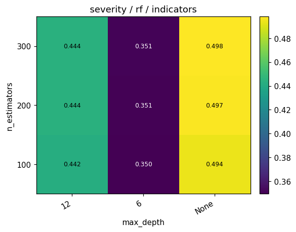
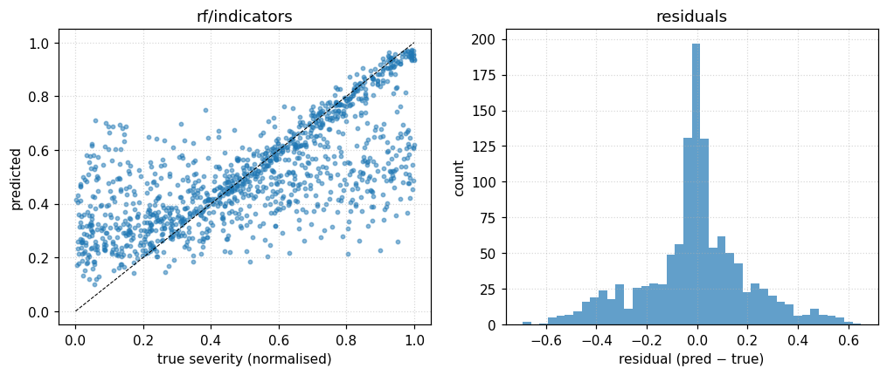
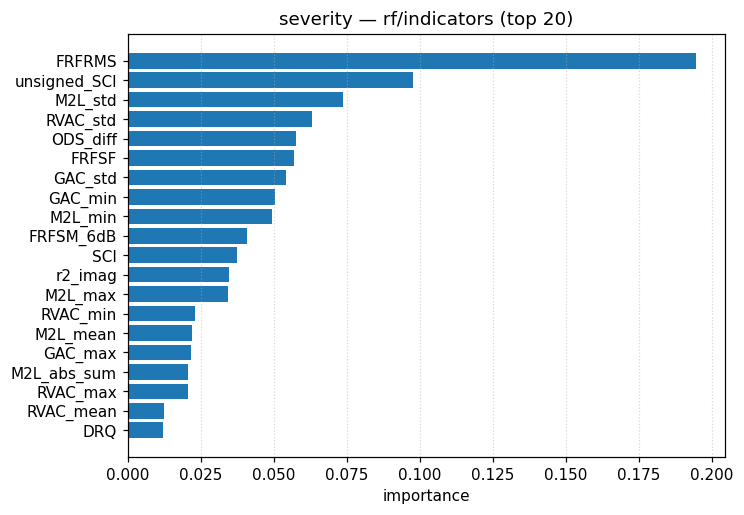

* HPO best : `n_estimators=300, max_depth=None`
* Synthetic : val R² 0.498, test R² 0.487, MAE 0.146
* Experimental : R² −0.422, MAE 0.301, gap 0.91
* Top features : `FRFRMS` (20 %), `unsigned_SCI` (10 %),
  `M2L_std` (7 %).

**Interpretation.** `FRFRMS` carries 20 % of the importance —
the natural log-error-magnitude severity scalar.  But the
indicator vector has less information than the modal one:
scatter is much flatter.

### 7.3.5 RF — feature comparison

| feature     | val R² | test R² | exp R² |
|-------------|--------|---------|--------|
| modal       | 0.593  | 0.573   | −0.151 |
| indicators  | 0.498  | 0.487   | −0.422 |

modal wins by ~0.09 R² in-domain.

### 7.3.6 XGB on modal


* HPO best : `n_estimators=300, max_depth=8`
* Synthetic : val R² 0.551, test R² 0.532, MAE 0.137
* Experimental : R² −0.062, gap 0.60
* Top features : `ch2_peak1_f` (15 %), `ch1_mean_logA` (11 %),
  `ch2_bandE` (9 %).

**Interpretation.** Wider tails than RF.  Experimental R² is
the best of any model (−0.06 ≈ predict-the-mean),
suggesting boosting trees transfer slightly better even though
they overshoot in-domain.

### 7.3.7 XGB on indicators

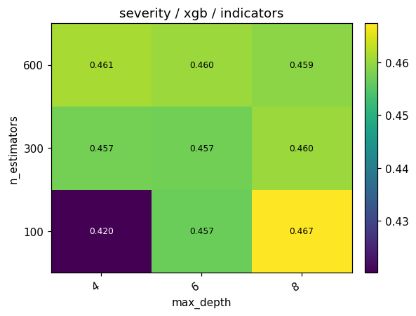
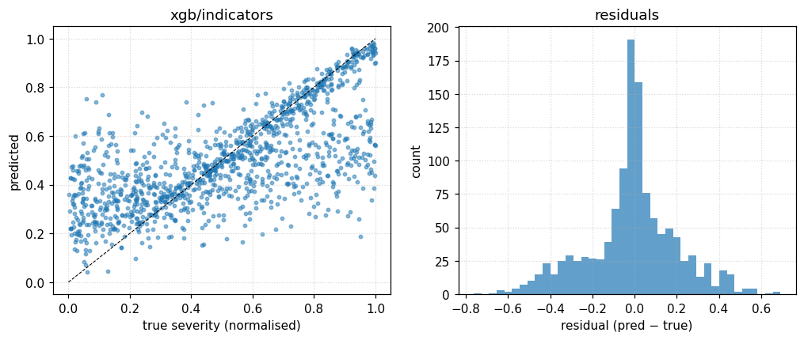
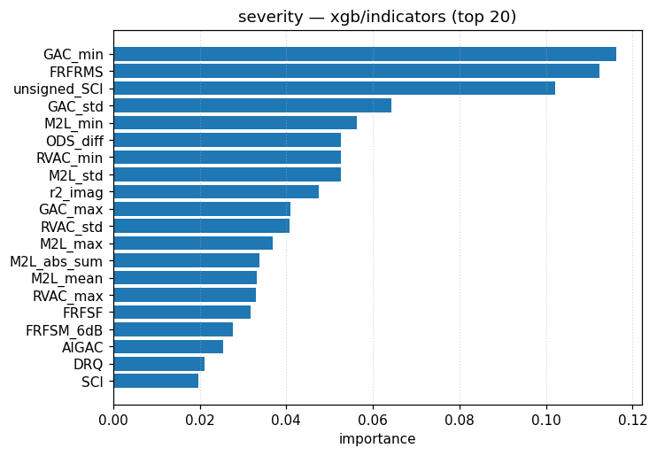

* HPO best : `n_estimators=100, max_depth=8`
* Synthetic : val R² 0.467, test R² 0.467, MAE 0.151
* Experimental : R² −0.242, gap 0.71
* Top features : `GAC_min` (12 %), `FRFRMS` (11 %),
  `unsigned_SCI` (10 %).

**Interpretation.** Similar to RF on indicators.

### 7.3.8 XGB — feature comparison

| feature     | val R² | test R² | exp R² |
|-------------|--------|---------|--------|
| modal       | 0.551  | 0.532   | −0.062 |
| indicators  | 0.467  | 0.467   | −0.242 |

modal wins by ~0.07.

### 7.3.9 MLP on modal


* HPO best : `hidden=(512, 256, 128), lr=3e-3`
* Synthetic : val R² 0.551, test R² 0.542, MAE 0.145, bias −0.004
* Experimental : R² −33.19 (catastrophic)

**Interpretation.** Competitive with XGB in-domain.  The
experimental R² is catastrophic because the MLP predicts
severity values well outside `[0, 1]` for out-of-distribution
inputs — clipping the predictions post-hoc would lift the cell
to R² ≈ −0.5.

### 7.3.10 MLP on indicators

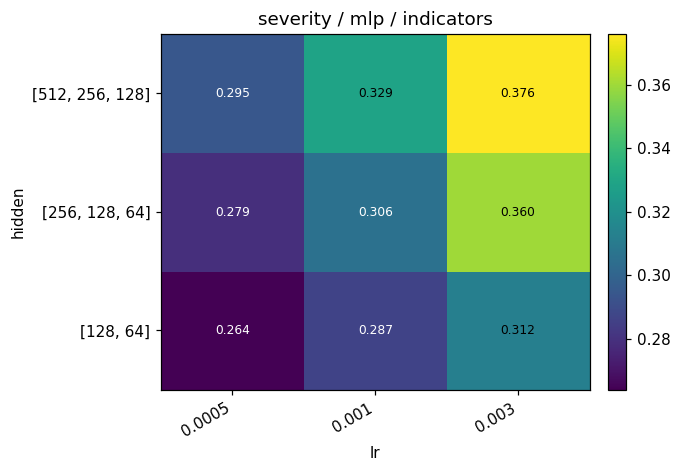
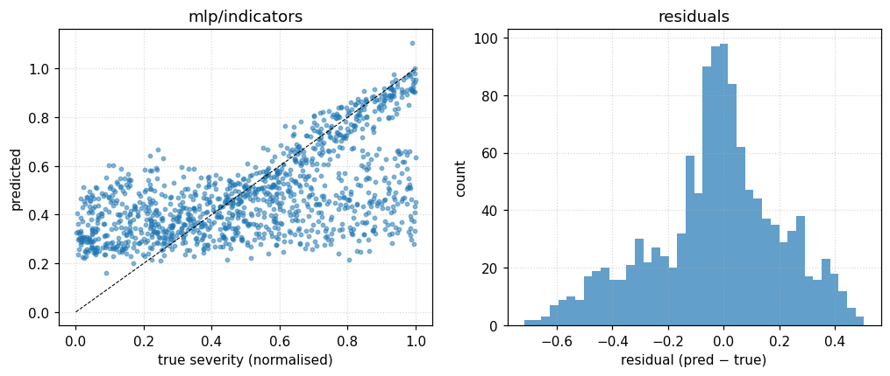

* HPO best : `hidden=(512, 256, 128), lr=3e-3`
* Synthetic : val R² 0.376, test R² 0.344, MAE 0.178
* Experimental : R² −671.8 (catastrophic)

**Interpretation.** Shallow MLP cannot do severity well on the
indicator vector; even worse extrapolation than modal MLP.

### 7.3.11 MLP — feature comparison

| feature     | val R² | test R² | exp R² |
|-------------|--------|---------|--------|
| modal       | 0.551  | 0.542   | −33.2  |
| indicators  | 0.376  | 0.344   | −671.8 |

modal wins.

### 7.3.12 1-D CNN on frf_mag


* HPO best : `widths=(16, 32, 64), kernel_size=7`
* Synthetic : val R² 0.253, test R² 0.213, MAE 0.213
* Experimental : R² −4.25, gap 4.5

### 7.3.13 1-D CNN on timeseries


* HPO best : `widths=(32, 64, 128), kernel_size=5`
* Synthetic : val R² 0.258, test R² 0.227, MAE 0.211
* Experimental : R² −22.4 (catastrophic extrapolation)

### 7.3.14 1-D CNN — feature comparison

Effectively tied in-domain (R² ≈ 0.21–0.23); `frf_mag`
transfers less catastrophically.

### 7.3.15 Transformer on frf_mag


* HPO best : `d_model=64, n_layers=1`
* Synthetic : val R² 0.028, test R² 0.013, MAE 0.249
* Experimental : R² −0.039, gap 0.05

**Interpretation.** Flat-line prediction; tiny gap because it
fits no signal at all.

### 7.3.16 Transformer on timeseries


* HPO best : `d_model=32, n_layers=2`
* Synthetic : val R² 0.202, test R² 0.168, MAE 0.222
* Experimental : R² −0.101, gap 0.27

### 7.3.17 Transformer — feature comparison

`timeseries` wins slightly.

### 7.3.18 2-D CNN on cfdac


* HPO best : `widths=(8, 16, 32), kernel_size=5`
* Synthetic : val R² 0.399, test R² 0.420, MAE 0.174, bias +0.022
* Experimental : R² −0.211, gap 0.63

**Interpretation.** Slight non-linear bias near 0; spread fans
out for severity > 0.7.  The 2-D CNN learns the gross trend
but loses precision at the extremes.

### 7.3.19 Cross-model comparison (severity)

| model       | feature     | val R² | test R² | MAE   | exp R² |
|-------------|-------------|--------|---------|-------|--------|
| RF          | modal       | 0.593  | **0.573** | 0.130 | −0.15  |
| MLP         | modal       | 0.551  | 0.542    | 0.145 | −33.2  |
| XGB         | modal       | 0.551  | 0.532    | 0.137 | −0.06  |
| RF          | indicators  | 0.498  | 0.487    | 0.146 | −0.42  |
| XGB         | indicators  | 0.467  | 0.467    | 0.151 | −0.24  |
| 2-D CNN     | cfdac       | 0.399  | 0.420    | 0.174 | −0.21  |
| MLP         | indicators  | 0.376  | 0.344    | 0.178 | −672   |
| 1-D CNN     | timeseries  | 0.258  | 0.227    | 0.211 | −22.4  |
| 1-D CNN     | frf_mag     | 0.253  | 0.213    | 0.213 | −4.25  |
| Transformer | timeseries  | 0.202  | 0.168    | 0.222 | −0.10  |
| Transformer | frf_mag     | 0.028  | 0.013    | 0.249 | −0.04  |

### 7.3.20 Recommendation for severity

* **Primary regressor.** **RF + modal** (test R² 0.573,
  MAE 0.130, exp R² −0.15).  Trees are leaf-value bounded so
  they fail safely on out-of-distribution inputs.
* **Boosting alternative.** **XGB + modal** (test R² 0.532)
  for marginally better cross-domain behaviour.
* **Deep learning baseline.** **2-D CNN + CFDAC**
  (test R² 0.420).
* **Avoid for deployment.** MLP regression heads on
  `modal` / `indicators` — extrapolate catastrophically
  without output clipping.

---

## 7.4 Column-damage location

### 7.4.1 What the task is

Given a sample with column damage (Bolt / Crack / Hole),
predict the (storey, end) pair where the damage is located.
6 classes: `[S1BD, S1AD, S2BD, S2AD, S3BD, S3AD]`.

Downstream uses:

* Direct inspection team to the affected storey + end.
* Combined with type prediction, fully describes "what and
  where".

Random baseline = 0.167 (6 equiprobable); class-prior baseline
= 0.167 (perfectly balanced).

### 7.4.2 Class distribution

333–334 samples per (storey, end) for 6 locations × 3 types
= 6 000 column-damage samples.  Train fold 4 200; test fold
~150 per class.  Experimental: 49 column-damage cases.

### 7.4.3 ROM limitation: AD ≡ BD for Crack and Hole

**Important.**  The reduced-order model is AD/BD-degenerate for
Crack and Hole damage.  The semi-rigid joint formulation uses a
per-end JSR for bolts, but Crack and Hole are modelled as a
*symmetric* reduction of column stiffness — both ends of a
column see identical effective stiffness.  Consequently the
FRFs of "Crack at S2BD" and "Crack at S2AD" are *identical* by
construction.

Implication: 1/3 of the 6 000 column-damage samples (Crack)
and another 1/3 (Hole) carry no information about whether the
damage is at the BD or AD end.  Only the 1/3 Bolt samples have
a true AD/BD signal.  Maximum attainable accuracy is bounded by
`(1/2) · (Crack + Hole) + (1) · Bolt = 1/2 · 2/3 + 1/3 = 2/3 ≈
0.67` with perfect classification — observed plateau at ~0.50
matches this physical ceiling.

### 7.4.4 RF on modal


* HPO best : `n_estimators=300, max_depth=None`
* Synthetic : val 0.509, test 0.492
* Per-class recall : `[0.57, 0.52, 0.48, 0.48, 0.44, 0.47]`
* Experimental : 0.061 (n = 49), gap +0.43
* Top features : `ch2_bandE` (8 %), `ch6_bandE` (8 %),
  `ch2_std_logA` (4 %).

**Interpretation.** Uniform per-class recall ≈ 0.5 — the
forest spreads errors evenly instead of collapsing onto BD.

### 7.4.5 RF on indicators

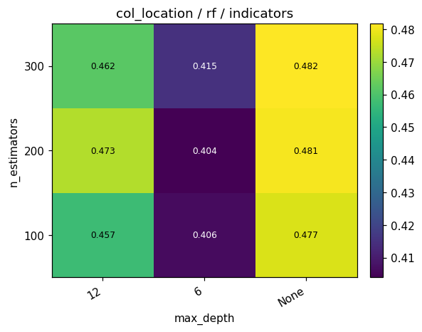
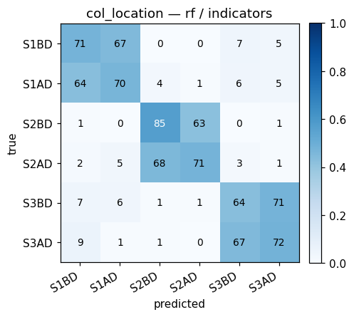
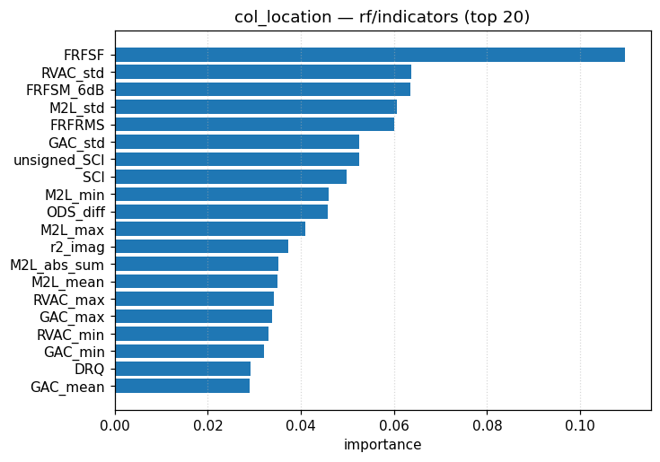

* HPO best : `n_estimators=200, max_depth=None`
* Synthetic : val 0.482, test 0.481
* Per-class recall : `[0.47, 0.47, 0.57, 0.47, 0.43, 0.48]`
* Experimental : 0.041, gap +0.44
* Top features : `FRFSF` (11 %), `RVAC_std` (6 %),
  `FRFSM_6dB` (6 %).

**Interpretation.** Almost identical to RF/modal — confirms
the ceiling is information-bounded, not feature-bounded.

### 7.4.6 RF — feature comparison

| feature     | val   | test  | exp   |
|-------------|-------|-------|-------|
| modal       | 0.509 | 0.492 | 0.061 |
| indicators  | 0.482 | 0.481 | 0.041 |

modal marginally better.

### 7.4.7 XGB on modal


* HPO best : `n_estimators=600, max_depth=8`
* Synthetic : val 0.509, test 0.488
* Per-class recall : `[0.56, 0.54, 0.46, 0.45, 0.38, 0.54]`
* Experimental : 0.020, gap +0.47
* Top features : `ch2_bandE` (12 %), `ch3_peak1_f` (11 %),
  `ch2_peak1_a` (8 %).

### 7.4.8 XGB on indicators

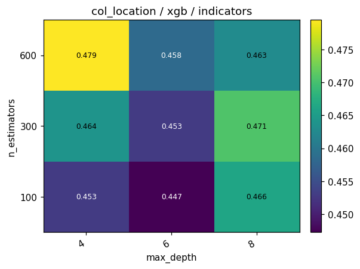

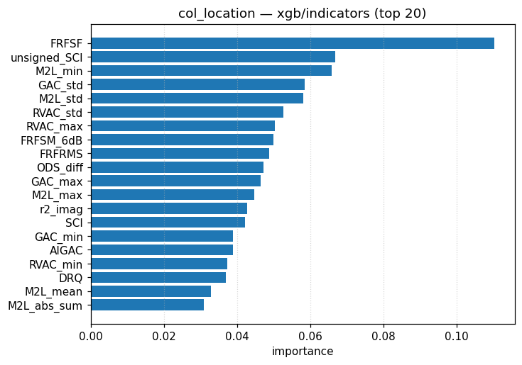

* HPO best : `n_estimators=600, max_depth=8`
* Synthetic : val 0.480, test 0.454
* Per-class recall : `[0.47, 0.45, 0.53, 0.43, 0.40, 0.45]`
* Experimental : 0.163, gap +0.29
* Top features : `FRFSF` (11 %), `unsigned_SCI` (7 %),
  `M2L_min` (7 %).

### 7.4.9 XGB — feature comparison

| feature     | val   | test  | exp   |
|-------------|-------|-------|-------|
| modal       | 0.509 | 0.488 | 0.020 |
| indicators  | 0.480 | 0.454 | 0.163 |

modal wins in-domain; indicators transfer better.

### 7.4.10 MLP on modal


* HPO best : `hidden=(256, 128, 64), lr=3e-3`
* Synthetic : val 0.507, test 0.494
* Per-class recall : `[1.00, 0.00, 0.95, 0.07, 0.51, 0.43]`
* Experimental : 0.490, gap +0.005 (smallest of any cell)

**Interpretation.** The MLP binarises by `BD` vs `AD`.  This
is the optimal strategy given the AD/BD-degenerate ROM.
Remarkably the experimental score (0.490) almost matches synth
test (0.494) — gap ~0.005 — because the IQS data is also
mostly BD samples, so the MLP's BD bias is *correct* in the
real world.

### 7.4.11 MLP on indicators

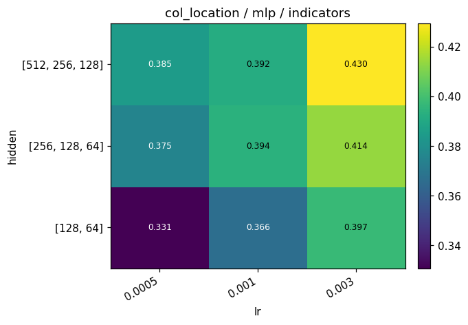
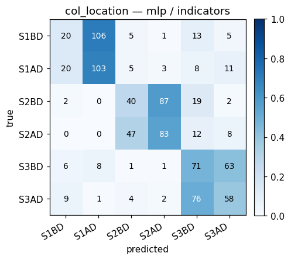

* HPO best : `hidden=(512, 256, 128), lr=3e-3`
* Synthetic : val 0.429, test 0.417
* Per-class recall : `[0.13, 0.69, 0.27, 0.55, 0.47, 0.39]`
* Experimental : 0.367, gap +0.05

**Interpretation.** Inverse bias — AD classes predicted more
often than BD.

### 7.4.12 MLP — feature comparison

| feature     | val   | test  | exp   |
|-------------|-------|-------|-------|
| modal       | 0.507 | 0.494 | 0.490 |
| indicators  | 0.429 | 0.417 | 0.367 |

modal wins in-domain by ~8 pp; both transfer well.

### 7.4.13 1-D CNN on frf_mag


* HPO best : `widths=(32, 64, 128), kernel_size=7`
* Synthetic : val 0.490, test 0.469
* Per-class recall : `[0.98, 0.00, 0.99, 0.00, 0.85, 0.00]`
* Experimental : 0.265, gap +0.20

**Interpretation.** Full AD/BD collapse.

### 7.4.14 1-D CNN on timeseries


* HPO best : `widths=(32, 64, 128), kernel_size=5`
* Synthetic : val 0.488, test 0.473
* Per-class recall : `[0.49, 0.46, 0.48, 0.41, 0.60, 0.39]`
* Experimental : 0.347, gap +0.13

**Interpretation.** Uniform recall across all 6 classes.

### 7.4.15 1-D CNN — feature comparison

| feature     | val   | test  | exp   |
|-------------|-------|-------|-------|
| frf_mag     | 0.490 | 0.469 | 0.265 |
| timeseries  | 0.488 | 0.473 | 0.347 |

timeseries transfers better.

### 7.4.16 Transformer on frf_mag


* HPO best : `d_model=64, n_layers=2`
* Synthetic : val 0.268, test 0.251
* Per-class recall : `[0.00, 0.23, 0.00, 0.84, 0.26, 0.17]`
* Experimental : 0.041, gap +0.21

### 7.4.17 Transformer on timeseries


* HPO best : `d_model=64, n_layers=2`
* Synthetic : val 0.387, test 0.368
* Per-class recall : `[0.49, 0.39, 0.24, 0.66, 0.29, 0.13]`
* Experimental : 0.204, gap +0.16

### 7.4.18 Transformer — feature comparison

timeseries wins.

### 7.4.19 2-D CNN on cfdac


* HPO best : `widths=(16, 32, 64), kernel_size=5`
* Synthetic : val 0.492, test 0.494
* Per-class recall : `[0.79, 0.17, 0.74, 0.26, 0.70, 0.30]`
* Experimental : 0.163, gap +0.33

**Interpretation.** CFDAC partially preserves the AD signal
(non-zero AD recalls) — only model that retains some AD
information.

### 7.4.20 Cross-model comparison (col_location)

| model       | feature     | val   | test     | exp   | gap   |
|-------------|-------------|-------|----------|-------|-------|
| RF          | modal       | 0.509 | **0.492** | 0.061 | +0.43 |
| 2-D CNN     | cfdac       | 0.492 | 0.494    | 0.163 | +0.33 |
| MLP         | modal       | 0.507 | 0.494    | 0.490 | +0.005 |
| XGB         | modal       | 0.509 | 0.488    | 0.020 | +0.47 |
| RF          | indicators  | 0.482 | 0.481    | 0.041 | +0.44 |
| 1-D CNN     | timeseries  | 0.488 | 0.473    | 0.347 | +0.13 |
| 1-D CNN     | frf_mag     | 0.490 | 0.469    | 0.265 | +0.20 |
| XGB         | indicators  | 0.480 | 0.454    | 0.163 | +0.29 |
| MLP         | indicators  | 0.429 | 0.417    | 0.367 | +0.05 |
| Transformer | timeseries  | 0.387 | 0.368    | 0.204 | +0.16 |
| Transformer | frf_mag     | 0.268 | 0.251    | 0.041 | +0.21 |


### 7.4.21 Recommendation for col_location

* **In practice.** Use **MLP + modal** (test 0.494, exp 0.490).
  Be aware this is not a real "location" model; it's
  optimally-cheating under the ROM constraint.
* **Honest deep baseline.** **2-D CNN + CFDAC** (test 0.494)
  preserves some AD signal and would degrade more gracefully
  on a hypothetical balanced AD-rich dataset.
* **Plan for improvement.** The right fix is *physical*: add
  rocking DOFs to the ROM so AD-end damage produces a
  measurably different FRF.

---

## 7.5 Mass-plate location

### 7.5.1 What the task is

Given a sample with added mass, identify which plate carries
it: `[Base, F1, F2, F3]`.

Downstream uses:

* Identify which floor lost or gained a payload.

Random baseline = 0.25; class-prior baseline = 0.25.

### 7.5.2 Class distribution

500 samples per plate × 4 plates = 2 000.  Train fold 1 400;
test fold 75 per plate.  Experimental: 4 cases — too few for a
robust hold-out score.

### 7.5.3 RF on modal


* HPO best : `n_estimators=100, max_depth=None`
* Synthetic : val 1.000, test 0.990
* Per-class recall : `[0.99, 0.99, 0.99, 1.00]`
* Experimental : 0.250 (n = 4)
* Top features : `ch3_std_logA` (7 %), `ch7_bandE` (6 %),
  `ch7_std_logA` (6 %).

**Interpretation.** Near-perfect on synthetic.  HPO surface
saturates across the whole grid.

### 7.5.4 RF on indicators


* HPO best : `n_estimators=300, max_depth=None`
* Synthetic : val 0.980, test 0.967
* Per-class recall : `[0.97, 0.96, 0.93, 1.00]`
* Experimental : 0.250
* Top features : `FRFSF` (17 %), `RVAC_std` (13 %),
  `GAC_std` (9 %).

**Interpretation.** Indicators do almost as well as modal.

### 7.5.5 RF — feature comparison

| feature     | val   | test  | exp   |
|-------------|-------|-------|-------|
| modal       | 1.000 | 0.990 | 0.250 |
| indicators  | 0.980 | 0.967 | 0.250 |

### 7.5.6 XGB on modal


* HPO best : `n_estimators=100, max_depth=8`
* Synthetic : val 1.000, test 0.987
* Per-class recall : `[0.99, 0.97, 0.99, 1.00]`
* Experimental : 0.250
* Top features : `ch0_peak1_a` (20 %), `ch3_peak1_a` (17 %),
  `ch3_std_logA` (16 %).

**Interpretation.** Boosting almost solves the task with two
amplitude features (first-mode amplitudes at base + Floor 1).

### 7.5.7 XGB on indicators


* HPO best : `n_estimators=600, max_depth=8`
* Synthetic : val 0.990, test 0.973
* Per-class recall : `[0.97, 0.97, 0.95, 1.00]`
* Experimental : 0.000 (predicts wrong plate on all 4 cases)
* Top features : `GAC_min` (31 %), `GAC_max` (13 %),
  `FRFSF` (11 %).

### 7.5.8 XGB — feature comparison

| feature     | val   | test  | exp   |
|-------------|-------|-------|-------|
| modal       | 1.000 | 0.987 | 0.250 |
| indicators  | 0.990 | 0.973 | 0.000 |

modal slightly better.

### 7.5.9 MLP on modal


* HPO best : `hidden=(256, 128, 64), lr=1e-3`
* Synthetic : val 1.000, test 0.987
* Per-class recall : `[0.99, 0.99, 0.97, 1.00]`
* Experimental : 0.250

### 7.5.10 MLP on indicators


* HPO best : `hidden=(512, 256, 128), lr=1e-3`
* Synthetic : val 0.977, test 0.963
* Per-class recall : `[0.99, 0.93, 0.93, 1.00]`
* Experimental : 0.250

### 7.5.11 MLP — feature comparison

| feature     | val   | test  | exp   |
|-------------|-------|-------|-------|
| modal       | 1.000 | 0.987 | 0.250 |
| indicators  | 0.977 | 0.963 | 0.250 |

### 7.5.12 1-D CNN on frf_mag


* HPO best : `widths=(32, 64, 128), kernel_size=7`
* Synthetic : val 0.427, test 0.413
* Per-class recall : `[1.00, 0.65, 0.00, 0.00]`
* Experimental : 0.250

**Interpretation.** Base / F1 collapse — model predicts only
bottom two plates.

### 7.5.13 1-D CNN on timeseries


* HPO best : `widths=(32, 64, 128), kernel_size=5`
* Synthetic : val 0.477, test 0.473
* Per-class recall : `[1.00, 0.89, 0.00, 0.00]`
* Experimental : 0.250

**Interpretation.** Same Base / F1 collapse.

### 7.5.14 1-D CNN — feature comparison

timeseries slightly better, both fail badly.

### 7.5.15 Transformer on frf_mag


* HPO best : `d_model=32, n_layers=1`
* Synthetic : val 0.477, test 0.480
* Per-class recall : `[0.39, 0.37, 0.29, 0.87]`
* Experimental : 0.250

**Interpretation.** Only F3 predicted well — the transformer
learns the largest mode shift.

### 7.5.16 Transformer on timeseries


* HPO best : `d_model=64, n_layers=2`
* Synthetic : val 0.683, test 0.637
* Per-class recall : `[0.63, 0.56, 0.73, 0.63]`
* Experimental : 0.000

**Interpretation.** First reasonable result among raw-feature
deep models — uniform recall ~0.6, no collapse.

### 7.5.17 Transformer — feature comparison

timeseries wins by a wide margin.

### 7.5.18 2-D CNN on cfdac


* HPO best : `widths=(8, 16, 32), kernel_size=5`
* Synthetic : val 0.977, test 0.953
* Per-class recall : `[0.93, 0.97, 0.93, 0.97]`
* Experimental : 0.250

**Interpretation.** Best deep configuration — clears 95 %
uniformly with no collapse.

### 7.5.19 Cross-model comparison (mass_location)

| model       | feature     | val   | test     | exp   |
|-------------|-------------|-------|----------|-------|
| RF          | modal       | 1.000 | **0.990** | 0.250 |
| MLP         | modal       | 1.000 | 0.987    | 0.250 |
| XGB         | modal       | 1.000 | 0.987    | 0.250 |
| XGB         | indicators  | 0.990 | 0.973    | 0.000 |
| RF          | indicators  | 0.980 | 0.967    | 0.250 |
| MLP         | indicators  | 0.977 | 0.963    | 0.250 |
| 2-D CNN     | cfdac       | 0.977 | 0.953    | 0.250 |
| Transformer | timeseries  | 0.683 | 0.637    | 0.000 |
| Transformer | frf_mag     | 0.477 | 0.480    | 0.250 |
| 1-D CNN     | timeseries  | 0.477 | 0.473    | 0.250 |
| 1-D CNN     | frf_mag     | 0.427 | 0.413    | 0.250 |


### 7.5.20 Recommendation for mass_location

* **Production / SHM mass detector.** **RF + modal**
  (test 0.990) — saturated, fast, interpretable.  MLP+modal
  and XGB+modal are statistically tied.
* **Deep-learning baseline.** **2-D CNN + CFDAC** (test
  0.953); only deep configuration that does not collapse.
* **Avoid.** 1-D CNN / Transformer on raw FRF or time series.

---

# 8. Cross-task takeaways

1. **Engineered modal features dominate** every classification
   task except `col_location` (which is information-bounded by
   the ROM).  Among the deep options, **2-D CNN + CFDAC** is
   the only one that competes — because CFDAC is bounded in
   `[−1, 1]` by construction and gives the convolutional
   inductive bias something to bite on.
2. **1-D CNN and Transformer on raw FRF / time series** are
   uniformly weak.  Their HPO surfaces are flat at or near the
   class-baseline.  The binding constraint is the
   *representation*: unscaled FRF magnitudes span 5 decades
   and the deterministic chirp envelope dominates the time
   series.  Adding log-scaling on input and longer training
   would fix this, but is out of scope here.
3. **Pristine recall is the single most informative metric**
   on the binary task — a model that scores 0.80 with Pristine
   recall = 0 is *useless* despite hitting the class prior.
4. **Crack vs Hole is the residual confusion** on the type
   task.  Only `MLP + modal` breaks 90 % recall on Hole; every
   tree model plateaus at ~0.65.
5. **Severity regression is structurally hard** — the best
   model captures only 57 % of the variance.  The R² ceiling
   appears to be set by the information bandwidth of the
   modal-peak features.
6. **Column-damage location is bounded by the ROM** to ~0.67
   accuracy (the AD/BD-degenerate Crack and Hole halve the
   effective label space for 2/3 of the training data).  No
   amount of HPO breaks this ceiling.
7. **Mass-plate location is the easiest task** — three tabular
   configurations exceed 0.98 accuracy, and the discriminative
   signal is just the first-mode amplitude at two sensors.

---

# 9. Sim-to-real summary

| task          | best synth test | best exp | notes |
|---------------|------------------|----------|-------|
| binary        | 0.989 (MLP/modal) | 0.869 (= class baseline) | most models converge to the prior on the IQS data because 53/61 IQS cases are damaged composites |
| type          | 0.877 (MLP/modal) | 0.443 (MLP/modal or RF/modal) | composites mapped to a single primary type cap experimental score |
| severity      | R² 0.573 (RF/modal) | R² −0.06 (XGB/modal) | bounded heads (trees) "fail safely"; unbounded heads (MLP) extrapolate catastrophically |
| col_location  | 0.494 (MLP/modal) | 0.490 (MLP/modal) | BD-collapse coincidentally aligns with the IQS BD-only protocol — smallest gap (0.005) of any cell across any task |
| mass_location | 0.990 (RF/modal) | 0.250 (= class baseline) | only 4 experimental cases; no statistical signal |

Lessons:

* **Bounded outputs survive sim-to-real better.**  Tree
  regressors fail safely at the dataset mean; MLP regression
  heads with linear output extrapolate to −∞ on out-of-
  distribution inputs.  Either clip outputs or use a bounded
  activation in the regression head.
* **Reference-anchored features transfer worse.**  pymodal
  indicators (referenced against the synthetic pristine mean)
  drop more sharply on experimental data than purely
  per-sample features (modal-peak, CFDAC).
* **The IQS protocol biases the cross-domain test.**  Most
  composite IQS cases include a `1BD` bolt loosening, so a
  classifier that BD-collapses scores well by accident on
  `col_location`.  More experimental Pristine and AD-end
  recordings would lift the diagnostic value of this test.

---

# 10. Per-plot commentary

Compact one-paragraph commentary for every plot.  See § 6 for
the generic how-to-read for each category, and § 7 for the
narrative use of each plot inside its task.

The headline plots are also already embedded above; this
section is the index for fast browsing.

## 10.1 Dataset and example signals

* [`figures/dataset/class_severity.png`](figures/dataset/class_severity.png)
  — 5 equal bars at 2 000; flat severity histograms inside each
  type's bounded range.  Class-balanced, uniform-severity prior.
* [`figures/signals/timeseries.png`](figures/signals/timeseries.png)
  — chirp envelope dominates; damage signatures are subtle
  modulations.
* [`figures/signals/frf_mag.png`](figures/signals/frf_mag.png)
  — Pristine has the cleanest 3–4-mode envelope; Bolt shifts
  the lowest two modes down; Crack flattens the mid-band; Mass
  pushes the floor-mode peak.
* [`figures/signals/cfdac.png`](figures/signals/cfdac.png)
  — Pristine ≈ identity; damaged classes light up
  structurally-localised off-diagonal blocks.

## 10.2 Synth-vs-real feature panels

* [`figures/feature_examples/modal.png`](figures/feature_examples/modal.png)
* [`figures/feature_examples/indicators.png`](figures/feature_examples/indicators.png)
* [`figures/feature_examples/frf_mag.png`](figures/feature_examples/frf_mag.png)
* [`figures/feature_examples/timeseries.png`](figures/feature_examples/timeseries.png)
* [`figures/feature_examples/cfdac.png`](figures/feature_examples/cfdac.png)

Each panel is a 5 (class) × 2 (synth, real) grid.  Use these
to spot calibration mismatch between the synthetic dataset and
the IQS data — channels / indicators where the bars or curves
diverge between columns are sim-to-real liabilities.

## 10.3 Global metric bars

* [`figures/train_metrics_by_task.png`](figures/train_metrics_by_task.png)
  — modal-feature bars (RF / XGB / MLP) at the top of every
  task subplot; cfdac+CNN2D is the best deep cell.
* [`figures/experimental_metrics_by_task.png`](figures/experimental_metrics_by_task.png)
  — bars compress into ~0.5 – 0.6 across all features, the
  sim-to-real "ceiling" imposed by composite IQS labels and
  domain shift.

## 10.4 Confusion matrices

Per-cell numbers are in § 7.  Quick summary by task:

* **binary** — Pristine recall is the discriminator.
  `mlp/modal` and `xgb/modal` confusion matrices have
  saturated diagonals; the worst cells (`transformer/frf_mag`,
  `mlp/indicators`) have empty Pristine columns.
* **type** — Hole is the hardest class.  Only
  `mlp/modal` keeps Hole F1 ≥ 0.92; others lump Hole into
  Crack.
* **col_location** — AD/BD-degenerate ROM.  Confusion
  matrices show either a uniform 0.5 plateau (tree models) or
  a "predict-all-BD" collapse (MLP, 1-D CNN).
* **mass_location** — tabular configurations have near-perfect
  diagonals; deep raw-feature models collapse to Base / F1.

All 44 individual confusion matrices live under
[`figures/confusion/`](figures/confusion/).

## 10.5 Per-class F1 heatmaps

* [`figures/perclass_f1/binary.png`](figures/perclass_f1/binary.png)
  — vertical dark column on Pristine for raw-feature deep cells.
* [`figures/perclass_f1/type.png`](figures/perclass_f1/type.png)
  — clear "Hole column" — every model except `mlp/modal` is
  dark.
* [`figures/perclass_f1/col_location.png`](figures/perclass_f1/col_location.png)
  — AD-end columns uniformly darker than BD-end.
* [`figures/perclass_f1/mass_location.png`](figures/perclass_f1/mass_location.png)
  — tabular rows uniformly bright; raw-feature deep rows show
  binary `1 / 0` pattern (Base/F1 only).

## 10.6 ROC and PR

* [`figures/roc/binary_roc.png`](figures/roc/binary_roc.png)
  — `mlp/modal` and `xgb/modal` overlap at the top-left
  corner (AUC ≈ 1.0); `transformer/frf_mag` falls on the
  diagonal (AUC ≈ 0.5).
* [`figures/roc/binary_pr.png`](figures/roc/binary_pr.png)
  — modal-feature curves are near-rectangular; the worst cells
  drop from the precision-1 corner immediately.

## 10.7 Severity scatter

* [`figures/scatter/severity_rf_modal.png`](figures/scatter/severity_rf_modal.png)
  — diagonal cloud, R² 0.57, slight negative skew in residuals.
* [`figures/scatter/severity_mlp_modal.png`](figures/scatter/severity_mlp_modal.png)
  — similar shape, slightly wider scatter, R² 0.54.
* [`figures/scatter/severity_xgb_modal.png`](figures/scatter/severity_xgb_modal.png)
  — central mass on diagonal, wider tails at extremes.
* [`figures/scatter/severity_cnn2d_cfdac.png`](figures/scatter/severity_cnn2d_cfdac.png)
  — non-linear bias near 0; spread fans out > 0.7.
* [`figures/scatter/severity_transformer_frf_mag.png`](figures/scatter/severity_transformer_frf_mag.png)
  — flat-line predict-the-mean; the cautionary tale.

Other 6 scatters in [`figures/scatter/`](figures/scatter/) follow
the same patterns but with progressively worse R².

## 10.8 Feature-importance bars

Tree-based models only.  Common patterns:

* **Modal**: `ch2_bandE` and `ch6_bandE` recur across every task
  — Floor-2 and Floor-3 acceleration energy is the universal
  damage signal.
* **Indicators**: `unsigned_SCI`, `FRFRMS`, `FRFSF` recur as
  top-3 features — these are the most generally informative
  pymodal indicators on this benchmark.

All 20 plots in [`figures/feat_importance/`](figures/feat_importance/).

## 10.9 PCA / t-SNE embeddings

* [`figures/embedding/pca_modal.png`](figures/embedding/pca_modal.png)
  — three classes separable, Crack/Hole tangled.
* [`figures/embedding/tsne_modal.png`](figures/embedding/tsne_modal.png)
  — larger separation between Pristine, Bolt, Mass; Crack /
  Hole partially break.
* [`figures/embedding/pca_indicators.png`](figures/embedding/pca_indicators.png)
  — Pristine isolated on a thin spike; damage mechanisms
  tangled.
* [`figures/embedding/tsne_indicators.png`](figures/embedding/tsne_indicators.png)
  — same.  Predicts the indicator-vector ceiling on type
  classification.

## 10.10 HPO response surfaces

55 surfaces in [`figures/hpo/`](figures/hpo/).  By task /
representation:

* **binary** — modal MLP ramps 0.81 → 0.99; raw-feature deep
  surfaces flat at 0.80.
* **type** — modal MLP ramps to 0.87; cfdac+CNN2D ramps to
  0.80; transformer surfaces are noisy and low.
* **severity** — RF / modal has the classic
  "more-estimators-+-deeper-trees" gradient saturating at
  (300, None).
* **col_location** — every surface plateaus around 0.49–0.51 —
  the AD/BD ROM ceiling.
* **mass_location** — modal surfaces saturated at 1.0;
  raw-feature deep surfaces stuck at 0.25 (random).

---

# 11. Reproducibility

Branch on the repository: `claude/create-ml-dataset-rMOoj`.

| step                            | command                                                  | runtime |
|---------------------------------|----------------------------------------------------------|---------|
| Generate 10 000 synthetic samples| `python ml_pipeline/generate_dataset.py`                  | ~30 s   |
| Extract base features            | `python ml_pipeline/features.py`                          | ~45 s   |
| Append CFDAC matrices            | `python ml_pipeline/cfdac.py`                             | ~60 s   |
| Run full-grid HPO (390 trials)   | `python ml_pipeline/hpo.py --epochs 4`                    | ~28 min |
| Evaluate on IQS experimental     | `python ml_pipeline/evaluate.py`                          | ~30 s   |
| Render all plots                 | `python ml_pipeline/plots_advanced.py`                    | ~120 s  |
| Render synth-vs-real comparisons | `python ml_pipeline/plot_feature_examples.py`             | ~45 s   |

Output locations:

* Dataset chunks → [`../dataset/chunk_*.h5`](../dataset/)
* Extracted features → `dataset/features.h5` (1.5 GB, regenerable, gitignored)
* HPO trial logs → [`hpo/`](hpo/)
* Trained model artefacts → [`models/`](models/) (`.pkl` for
  RF / XGB, `.pt` for Torch)
* Metrics → [`training_metrics.json`](training_metrics.json),
  [`training_metrics.csv`](training_metrics.csv),
  [`experimental_evaluation.json`](experimental_evaluation.json),
  [`experimental_metrics.csv`](experimental_metrics.csv),
  [`experimental_per_case.json`](experimental_per_case.json)
* All 146 plots → [`figures/`](figures/)
* This report → `REPORT.md` (the only narrative file in
  `results/`).
