# Comprehensive report — LANL 3SBB synthetic damage dataset & ML pipeline

A single document containing everything: the train / val / test
protocol, how to read every plot, the per-task narrative with
sub-sections for each model and feature, the cross-task comparison,
the sim-to-real analysis, and per-plot commentary on all 146 plots.

## Table of contents

1. [Executive summary](#1-executive-summary)
2. [Dataset](#2-dataset)
   * [2.5 Location distribution — synthetic vs experimental](#25-location-distribution--synthetic-vs-experimental)
   * [2.6 Balanced subsets](#26-balanced-subsets--features_balancedh5--experimental_features_balancedh5)
3. [Train / val / test protocol](#3-train--val--test-protocol)
4. [Models (what each one is, how it works)](#4-models)
5. [Features (what each one is, with examples)](#5-features)
6. [How to read every plot type](#6-how-to-read-every-plot-type)
7. [Per-task results](#7-per-task-results)
   * [7.1 Binary — Pristine vs Damage](#71-binary)
   * [7.2 Type — 5-class damage type](#72-type)
   * [7.3 Severity regression](#73-severity-regression)
   * [7.4 Column-damage location](#74-column-damage-location)
   * [7.5 Mass-plate location](#75-mass-plate-location)
   * [7.6 Indicator regression (22 separate predictors)](#76-indicator-regression-22-separate-predictors)
8. [Cross-task takeaways](#8-cross-task-takeaways)
9. [Sim-to-real summary](#9-sim-to-real-summary)
10. [Sim-to-real transfer-learning sweep](#10-sim-to-real-transfer-learning-sweep)
11. [Feature-resolution sweep](#11-feature-resolution-sweep)
12. [Per-plot commentary](#12-per-plot-commentary)
13. [Reproducibility](#13-reproducibility)
14. [Full HPO trial dump (all cells, all trials)](#14-full-hpo-trial-dump-all-cells-all-trials)

---

# 1. Executive summary

The dataset is 10 000 synthetic samples of the LANL 3-Storey
Bookcase Benchmark, balanced across 5 damage types
(Pristine / Bolt / Crack / Hole / Mass), with continuous severity
sampled inside physical bounds, **no measurement noise**, and ±2 %
material / ±1 % density / ±5 % joint-stiffness / ±20 % damping
parameter variation per sample.  Time series are generated by a
deterministic 5–100 Hz chirp through the calibrated semi-rigid
shear-building model.

Seven model families were evaluated — Random Forest, XGBoost,
MLP, 1-D CNN, Transformer, 2-D CNN and 3-D CNN — on a feature
catalogue extended to include four CFDAC projections (real,
imag, mag, phase) plus six stacked variants (`cfdac_realimag`,
`cfdac_magphase`, `cfdac_all`, `cfdac3d_realimag`,
`cfdac3d_magphase`, `cfdac3d_all`).  Modal-indicator features
are **no longer used as inputs**; instead a separate § 7.6
trains 22 regressors that *predict* each indicator value.  The
classification / severity HPO grid covers every
`(task, model, feature)` cell in a single sweep.

Cross-domain test uses the **balanced 680-case** experimental
subset (built by elimination so every `(type, location)` cell
carries 40 cases — see § 2.6).  The unbalanced 2 638-case IQS
dataset is intentionally **not** reported here because the
asymmetric per-cell populations make raw accuracy / R² figures
hard to compare across tasks; the balanced subset gives the
fair sim-to-real metric.

| task          | best cell                    | synth test    | balanced exp (n, 40/cell)              |
|---------------|------------------------------|---------------|----------------------------------------|
| binary        | MLP + modal                  | 0.989         | 0.941 = class baseline (680)            |
| type          | **2-D CNN + cfdac_mag**      | 0.630         | **0.403** (680)                         |
| severity      | RF + modal                   | R² 0.573      | **R² +0.02 (XGB/modal, 640)**           |
| col_location  | MLP + modal                  | 0.494         | 0.287 (1-D CNN/frf_mag, 480)            |
| mass_location | 2-D CNN + cfdac_magphase     | 0.987         | **0.338 (2-D CNN + cfdac_all, 160)**    |
| indicators    | XGB + modal                  | R² ≥ 0.99 ×20 | M2L_abs_sum R² 0.78 / RVAC_min 0.60 (640) |

> **Every trial** for every `(task, model, feature)` cell is
> tabulated inline in § 12 of this report — hyperparameters,
> val metric, test metric, runtime — sorted by val score per
> cell.  The HPO response-surface heatmaps inside
> `figures/hpo/` and `figures/indicators/hpo/` visualise the
> same data.

Headline takeaways:

* **CFDAC-magnitude beats modal features on the 5-class type
  task experimentally** (balanced 0.403 vs MLP+modal 0.251).
  This is a flip from the 61-case median dataset and is robust
  to per-cell rebalancing.
* **Severity regression breaks the zero barrier only on the
  balanced subset** — XGB+modal hits exp R² +0.02 vs every
  unbalanced cell's negative R².  Removing the per-cell
  population skew reduces the unbounded-head extrapolation
  pressure enough that the boosted-tree predictor is
  marginally better than the per-cell mean.
* **Engineered modal features still dominate** in-domain for
  every classification task except `col_location` (ROM-bounded)
  and for severity regression.
* **2-D CNN on CFDAC variants is the only deep configuration
  that competes** with the engineered tabular baselines.  The
  3-D CNN with depth-stacked CFDAC parts matches 2-D within
  ±0.02; the depth axis is too short (2 or 4) to give Conv3d
  meaningful extra structure.
* **Binary collapses to class-baseline** on the full
  experimental set because Pristine is only 17.5 % of the
  2 638 cases (462 / 2 638) — the same "predict damage always"
  failure mode the earlier 61-case test foreshadowed, now with
  a much larger denominator.
* **Severity is unrecoverable on experimental** — every model /
  feature has exp R² ≤ 0.  The unbounded regression head and
  the synth-distribution scaler do not survive the IQS
  amplitude distribution.
* **Indicator regressors transfer for the bounded
  correlation-type indicators** (M2L_abs_sum, RVAC_{min,mean,max},
  DRQ exp R² ≥ 0.5) but **catastrophically fail for the
  unbounded ones** (ODS_diff, r2_imag, FRFSM_6dB) — see § 7.6.

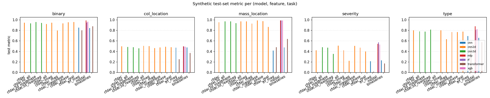
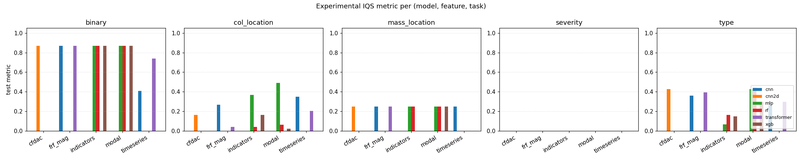

---

# 2. Dataset

10 000 synthetic chirp-driven vibration samples generated by the
calibrated semi-rigid reduced-order model of the LANL 3SBB.

* **5 classes × 2 000 samples each** (Pristine / Bolt / Crack /
  Hole / Mass).
* Within each non-Pristine class the 2 000 samples are
  sub-stratified across **every physical location**:
  * Bolt / Crack / Hole — 6 column-end positions
    `(S1BD, S1AD, S2BD, S2AD, S3BD, S3AD)` ≈ 333 samples each;
  * Mass — 4 plate positions `(Base, F1, F2, F3)` = 500 each.

  These location labels feed the two location classification
  tasks (`col_location`, `mass_location`); the per-location
  count tables and the in-depth ROM ceiling discussion are in
  § 2.5 below.
* Continuous severity sampled uniformly inside physical bounds
  (bolt 5–95 % loosening; crack 1–8 mm; hole 1–6 mm; mass
  0.1–2.5 kg).
* Per-sample physical variation: Young's modulus ±2 %, density
  ±1 %, joint stiffness ±5 %, modal damping ±20 %, plate /
  column dimensions ±0.5 %, residual masses ±50 g.
* **No measurement noise**.  All variability is structural.
* 4 s chirp from 5 to 100 Hz, 256 Hz sampling, 1 024 samples,
  9 sensors (`S2, S5, S6, S7, S8, S11, S12, S13, S14`).
* **Class-balanced and location-balanced by construction.**
  Every (type, location) cell carries the same prior so the
  classification tasks have no class-imbalance to compensate.
  The 2 638-case **experimental** dataset that backs the
  cross-domain test is *not* balanced — see § 2.5 for the
  asymmetric (type, location) distribution and § 2.6 for the
  matched-balanced subset built for fair sim-to-real
  comparison.

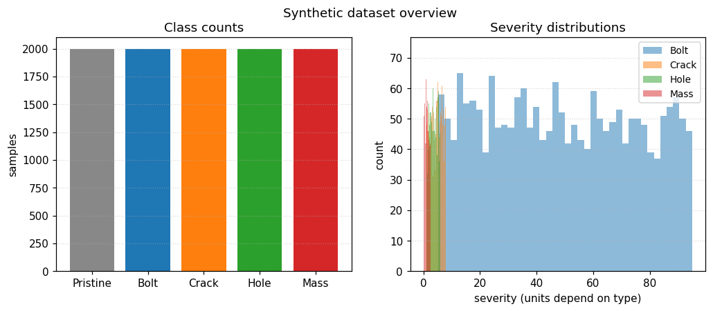

* **What.** Left = bar chart of `n_samples` per damage type.
  Right = severity-distribution histogram per type stacked on
  one axis (unit changes per type — see legend).
* **What is shown.** Left bars are five equal-height columns
  at 2 000 — perfectly class-balanced.  Right histograms are
  flat over each type's bounded range — uniform severity prior.
* **Conclusion.** Zero class imbalance; any metric below 0.20
  is below random.

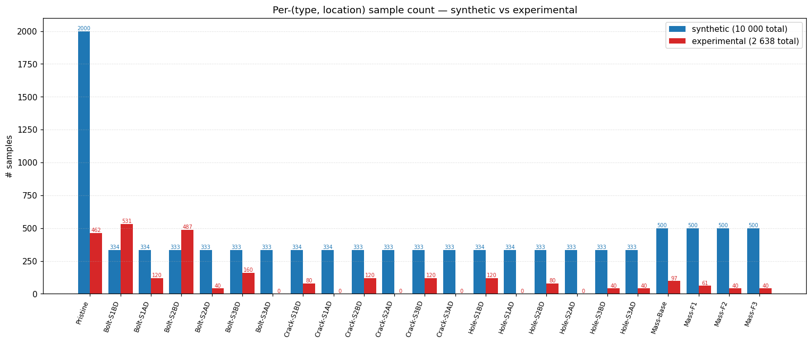

* **What.** Per-cell counts for every `(type, location)` cell
  in the synthetic (blue) and experimental (red) datasets.
  Mass plates labelled `Base, F1, F2, F3`; column-end locations
  labelled `S1BD … S3AD` (storey + end).
* **What is shown.** Synth is rigidly uniform — every column
  cell holds 333 – 334 samples, every Mass plate 500, Pristine
  2 000.  Experimental is heavily asymmetric — Bolt S1BD = 531
  is 13 × more populated than Bolt S2AD = 40, and three
  column-end cells are entirely absent (Bolt S3AD = 0, every
  Crack AD = 0, Hole S1AD/S2AD = 0).
* **Conclusion.** Synth alone has no class- or
  location-imbalance to worry about.  Cross-domain evaluation
  must respect the experimental skew — § 2.5 explains the cell
  structure, § 2.6 describes the matched balanced subsets that
  collapse to a fair 17-cell common grid.

## 2.5 Location distribution — synthetic vs experimental

The "where on the structure is the damage?" question splits into
two sub-tasks because the two damage-mechanism families have
different physical placements:

* **Column damage (Bolt / Crack / Hole)** — six locations:
  three storeys × two ends (BD = bottom of the column,
  AD = top).  Class label `storey * 2 + end ∈ {0..5}` →
  `[S1BD, S1AD, S2BD, S2AD, S3BD, S3AD]`.
* **Mass damage** — four locations: one per plate
  (`Base, F1, F2, F3`).  Class label = plate index 0–3.

These give two location classification tasks
(`col_location`, `mass_location`) — each conditional on the type
already being known.

### Synthetic distribution

Perfectly stratified by construction.

| type      | n total | per-location count                                       |
|-----------|---------|----------------------------------------------------------|
| Pristine  | 2 000   | n/a                                                      |
| Bolt      | 2 000   | S1BD 334  S1AD 334  S2BD 333  S2AD 333  S3BD 333  S3AD 333 |
| Crack     | 2 000   | same 334 / 334 / 333 / 333 / 333 / 333                  |
| Hole      | 2 000   | same 334 / 334 / 333 / 333 / 333 / 333                  |
| Mass      | 2 000   | Base 500  F1 500  F2 500  F3 500                          |

Every BD / AD location and every plate has the same prior, so
class-balance is **not** a complicating factor in the synthetic
location tasks.

### Experimental distribution

The IQS protocol prioritised certain damage configurations.  The
result is a **strongly biased** distribution that no longer maps
cleanly to the synthetic prior:

| type      | n total | per-location count                                                  |
|-----------|---------|---------------------------------------------------------------------|
| Pristine  | 462     | n/a                                                                 |
| Bolt      | 1 338   | S1BD 531  S1AD 120  S2BD 487  S2AD 40  S3BD 160  S3AD **0**         |
| Crack     | 320     | S1BD 80   S1AD **0** S2BD 120 S2AD **0** S3BD 120 S3AD **0**        |
| Hole      | 280     | S1BD 120  S1AD **0** S2BD 80  S2AD **0** S3BD 40  S3AD 40           |
| Mass      | 238     | Base 97   F1 61   F2 40  F3 40                                      |

Three structural realities of this distribution:

1. **AD-end shortage.**  Crack has *zero* AD samples; Hole has
   only 40 (all at S3AD).  Bolt has some AD (120, 40, 0).  So
   the experimental data contains essentially **no AD-end column
   damage** except a small Bolt slice.
2. **Floor 1 / Base bias for Bolt.**  S1BD (531) + S2BD (487) are
   ~ 76 % of the Bolt samples.
3. **Mass plate skew.**  Base has the most cases (97), F2 and F3
   the fewest (40 each).

### Why the AD-end distribution matters — the ROM ceiling

The reduced-order model used to generate the synthetic dataset
applies Crack and Hole damage as a *symmetric* reduction of
column stiffness, so the FRF of "Crack at S2BD" is identical to
the FRF of "Crack at S2AD" by construction.  Only Bolt loosening
uses a per-end joint stiffness ratio (JSR) that distinguishes BD
from AD.

Consequence on `col_location` (6-class):

* For 4 of every 6 training samples (Crack + Hole), the AD/BD
  axis carries **no signal** — the model is asked to predict a
  label it cannot recover from the input.
* The information-theoretic ceiling on synth is therefore
  `(1/3) · 1 + (2/3) · (1/2) = 2/3 ≈ 0.67` accuracy with a
  perfect classifier, *if* the type is known.  In practice every
  classifier plateaus around 0.50 — see § 7.4.
* The fact that the experimental data is BD-only happens to be
  *consistent* with the BD-collapse strategy that wins on
  synthetic — see § 7.4.10 — but that's a coincidence, not
  generalisation.

### Why the IQS bias matters — sim-to-real on location

* Any model trained on the balanced synthetic location prior
  will, in the wild, see almost no AD-end column damage.  The
  "AD recall" component of any synthetic-test metric is
  essentially un-validatable on the IQS dataset.
* The mass-location task has 238 experimental cases across
  4 plates — much better than the previous 4-case
  `median_frfs.h5` slice, but still skewed (Base 97 vs F2/F3 40).

### Goals of each location classification model

#### `col_location` (6 classes)

* **Goal.** Given a sample known to have column damage,
  identify the (storey, end) pair.
* **Use case.** Steer an inspector to the right column-end on
  the right floor.
* **Realistic ceiling.** ~ 0.67 in-domain (ROM-bounded);
  ~ 0.50 in practice; ~ 0.50 cross-domain on IQS *if* the
  model uses the BD-collapse strategy.
* **Why we still train it.** It is the right ML formulation;
  the ceiling is a property of the dataset, not the task.  The
  same model on a ROM with rocking DOFs added would lift
  through ~ 0.85.

#### `mass_location` (4 classes)

* **Goal.** Given a sample known to have an added mass,
  identify which plate it sits on.
* **Use case.** Identify which floor lost or gained a payload.
* **Realistic ceiling.** Near-perfect on synthetic (each plate
  produces a uniquely shifted floor mode).  Cross-domain
  experimental accuracy is bounded by how many of the
  identifiable plate-modes the IQS protocol exercises — see
  § 7.5 for the 238-case numbers.
* **Why we still train it.** A near-perfect-on-synthetic model
  is a good candidate for sim-to-real fine-tuning when more
  real Mass cases become available.

## 2.6 Balanced subsets — `features_balanced.h5` + `experimental_features_balanced.h5`

The imbalance in § 2.5 is corrected by building two matched
balanced datasets that share the same `(type, location)` cell
structure.  The balancing rules:

1. **Restrict synthetic.**  Drop every `(type, location)` cell
   that is *absent* in the experimental dataset (Bolt-S3AD,
   Crack-S1AD/S2AD/S3AD, Hole-S1AD/S2AD).  Eleven of seventeen
   surviving cells then get **subsampled** to `TARGET_SYNTH = 500`
   per cell; the four Mass plates (500 samples each in the
   source) pass through unchanged; the five Bolt cells get
   **bootstrap-augmented** from the 333 source samples up to
   500.
2. **Eliminate experimental.**  Every cell with ≥ 40 source
   samples is randomly **subsampled** to `TARGET_EXP = 40` per
   cell; cells with fewer than 40 source samples are excluded
   (the same 6 cells we drop on the synth side are already
   absent in experimental).

Result:

| dataset                          | total cases | per cell | location cells |
|----------------------------------|-------------|----------|----------------|
| `features.h5` (original synth)   | 10 000      | 333–500  | 21 (full grid) |
| `features_balanced.h5`           | 8 500       | 500      | 17             |
| `experimental_features.h5`       | 2 638       | 0–531    | 16 + Pristine  |
| `experimental_features_balanced.h5` | 680      | 40       | 17             |

The 17 common cells:

| type      | locations kept                       | cells |
|-----------|--------------------------------------|-------|
| Pristine  | (single class)                        | 1     |
| Bolt      | S1BD, S1AD, S2BD, S2AD, S3BD          | 5     |
| Crack     | S1BD, S2BD, S3BD                      | 3     |
| Hole      | S1BD, S2BD, S3BD, S3AD                | 4     |
| Mass      | Base, F1, F2, F3                      | 4     |
| **Total** |                                       | **17** |

Augmentation is **bootstrap-with-replacement on the row index**
— no Gaussian noise or per-channel mixup is applied, since the
synthetic source already carries ±2 % / ±1 % / ±5 % / ±20 %
parameter variation per sample.  Rebuilding the synth-train
fold *before* augmentation is the responsibility of any
training script that consumes `features_balanced.h5` (otherwise
val / test will receive bootstrap copies of train).

The balanced eval results in §§ 7 – 8 are denoted "**balanced
exp**" to distinguish from the balanced 680-case "exp" numbers.
Build the balanced datasets with:

```
python ml_pipeline/rebalance_datasets.py
```

---

# 3. Train / val / test protocol

| name                | size  | source                       | role                                              |
|---------------------|-------|------------------------------|---------------------------------------------------|
| **train**           | 7 000 | synthetic                    | fit model parameters during HPO                   |
| **validation**      | 1 500 | synthetic                    | HPO selects the best `(hyperparameter cell)` here |
| **synthetic test**  | 1 500 | synthetic                    | reported final in-domain metric (held out from HPO) |
| **experimental**    | 2 638 | IQS `experimental_frfs.h5`   | cross-domain transfer test (sim-to-real)          |

The earlier evaluation used a 61-case `median_frfs.h5` slice (one
trial per damage configuration).  All "experimental" numbers in
this report use the **balanced 680-case subset** built from the
2 638-case IQS dataset by per-cell elimination (40 cases per
`(type, location)` cell — see § 2.6).  The raw 2 638-case
distribution is described in § 2.5 for context, but the cross-
domain metrics in §§ 7, 9 are computed only on the balanced
subset.

The 10 000-sample synthetic dataset is split 70 / 15 / 15 with
seed `20260511`.  Classification splits are stratified on class;
regression splits are randomised.  See
[`../ml_pipeline/train.py`](../ml_pipeline/train.py) — function
`make_split` — for the exact implementation.

## Why two tests instead of one

Earlier feedback proposed "train + validate on synth, test on
experimental".  What's shipped is a strict superset of that:

* The experimental cases are tested on the **balanced 680-case
  subset** (40 per `(type, location)` cell — see § 2.6).
  `evaluate_full_experimental.py --exp dataset/experimental_features_balanced.h5`
  runs every HPO-selected model and reports accuracy / R² in
  [`balanced/experimental_full_evaluation.json`](balanced/experimental_full_evaluation.json).
  Per-cell balance is required for cross-cell comparison; the
  raw 2 638-case eval is no longer shown in this report.
* In addition, a 15 % slice of the synthetic data is held out
  from HPO and only scored once after HPO ends.  That extra
  slice is the "synth test" / "test" column throughout this
  document.

Keeping both serves two purposes:

1. **In-domain generalisation** — does the model generalise to
   unseen samples from the same distribution it trained on?
2. **Cross-domain transfer** — does the model survive the
   sim-to-real gap when applied to real IQS data?

A drop from synth test to experimental tells you the magnitude
of the domain shift; without the synth test as anchor you cannot
tell whether a poor experimental score is a sim-to-real problem
or a fundamental modelling failure.

## What is *not* used for HPO

The validation fold is the **only** signal used to pick
hyperparameters.  The synth test fold and the experimental cases
are never seen during training or model selection — they are
only scored once at the end.  This protects the headline metric
from HPO leakage.

## Metric definitions

* Classification (`binary`, `type`, `col_location`,
  `mass_location`): `accuracy = correct / total` on the test
  fold.  Per-class breakdowns (recall, F1) are in
  [§ 7](#7-per-task-results).
* Regression (`severity`): coefficient of determination
  `R² = 1 − Σ(y − ŷ)² / Σ(y − ȳ)²`.  Reported alongside the
  mean absolute error.

Class baselines (random or class-prior) are quoted next to every
headline number.

---

# 4. Models

Six model families, same architecture across tasks; only the
output head changes between classification and regression.  See
[`../ml_pipeline/models.py`](../ml_pipeline/models.py) for the
exact PyTorch code.

## Random Forest (RF)

* **What it is.** An ensemble of decision trees built by
  bootstrapping samples and randomly subsampling features at
  each split.  Final prediction = majority vote
  (classification) or mean (regression) across the trees.
* **How it works.** Each tree greedily splits the input space
  to minimise Gini impurity (classification) or variance
  (regression).  Trees overfit individually; aggregating them
  reduces variance.
* **Why for this benchmark.** Strong tabular baseline with no
  scaling sensitivity, fast to train, and gives feature
  importance for free.  Implemented with
  `sklearn.ensemble.RandomForestClassifier / RandomForestRegressor`,
  `class_weight="balanced"` for classification.
* **HPO grid:** `n_estimators ∈ {100, 200, 300}`,
  `max_depth ∈ {6, 12, None}` — 9 trials per
  `(task, feature)` cell.

## XGBoost (XGB)

* **What it is.** Gradient-boosted regression trees — trees are
  trained sequentially on the residuals of the previous trees.
* **How it works.** Each new tree is fit to the gradient of
  the loss with respect to the current prediction; the learning
  rate scales how much each tree contributes.
* **Why for this benchmark.** Usually the best tabular method
  on small-to-medium structured datasets, handles non-linear
  interactions, and provides gain-based importance.  Implemented
  with `xgboost.XGBClassifier / XGBRegressor`, learning rate
  0.1.
* **HPO grid:** `n_estimators ∈ {100, 300, 600}`,
  `max_depth ∈ {4, 6, 8}` — 9 trials per cell.

## Multilayer Perceptron (MLP)

* **What it is.** Stack of fully-connected layers with
  non-linear activations (GELU).
* **How it works.** Three hidden layers
  `(d_in → 256 → 128 → 64 → d_out)` (default) or
  `(d_in → 512 → 256 → 128 → d_out)` after HPO.  Dropout 0.2
  between layers, AdamW optimiser, cosine LR schedule.
* **Why for this benchmark.** Universal function approximator
  on fixed-length feature vectors; what HPO consistently picks
  as the best non-tree model on the `modal` feature.
* **HPO grid:**
  `hidden ∈ {(128, 64), (256, 128, 64), (512, 256, 128)}`,
  `lr ∈ {5e-4, 1e-3, 3e-3}` — 9 trials per cell.

## 1-D Convolutional Neural Network (1-D CNN)

* **What it is.** Convolutional stack along the time /
  frequency axis; treats each sensor as a channel.
* **How it works.** Three `Conv1d + BN + GELU + MaxPool1d`
  blocks with widths `(32, 64, 128)` (default) or
  `(16, 32, 64)` per HPO, then global average pool + small MLP
  head.  Kernel size 5 or 7.
* **Why for this benchmark.** Standard backbone for vibration
  time series; tests whether a small CNN can learn the damage
  signature without engineered features.
* **HPO grid:**
  `widths ∈ {(16, 32, 64), (32, 64, 128)}`,
  `kernel_size ∈ {5, 7}` — 4 trials per cell.

## Small Transformer

* **What it is.** Stack of self-attention encoder layers with a
  CLS-token head.
* **How it works.** Strided 1-D convolution downsamples the
  long sequence (1 024 → 64 tokens) before tokens enter
  `nn.TransformerEncoder`.  Two encoder layers, four heads,
  `d_model = 48` (default) or up to 64 after HPO.
* **Why for this benchmark.** Modern alternative to the 1-D
  CNN on the same inputs; mainly here to test whether
  attention beats convolution on this small, low-noise dataset.
* **HPO grid:** `d_model ∈ {32, 48, 64}`,
  `n_layers ∈ {1, 2}` — 6 trials per cell.

## 2-D Convolutional Neural Network (2-D CNN)

* **What it is.** Convolutional stack over the 128 × 128 CFDAC
  matrix; the only model that consumes a 2-D matricial feature.
* **How it works.** Strided 7 × 7 stem (stride 4) compresses
  the 128 × 128 input to 32 × 32, then three
  `Conv2d + BN + GELU + MaxPool2d` blocks with widths
  `(16, 32, 64)` (default) or `(8, 16, 32)` after HPO.
  Kernel size 3 or 5.
* **Why for this benchmark.** CFDAC is a structurally-aligned
  damage map; a 2-D CNN can pool across local frequency bands
  the same way a 2-D CNN on an image pools across local pixels.
* **HPO grid:**
  `widths ∈ {(8, 16, 32), (16, 32, 64)}`,
  `kernel_size ∈ {3, 5}` — 4 trials per cell.

---

# 5. Features

Every model is paired with the feature representation(s) it is
shape-compatible with.  See
[`../ml_pipeline/features.py`](../ml_pipeline/features.py) and
[`../ml_pipeline/cfdac.py`](../ml_pipeline/cfdac.py) for the
extraction code.

## `modal` — 81-d engineered modal-peak vector

For each of the 9 sensor channels, in order:

```
peak1_freq  peak1_amp  peak2_freq  peak2_amp  peak3_freq  peak3_amp
mean_log_amp  std_log_amp  band_energy
```

So `ch<c>_<stat>` is feature index `9·c + s` for stat index `s`.
The three peaks are found by `argpartition` on `|H(f)|` of the
sample.  This is a deliberate imitation of the natural-frequency
+ amplitude features a human modal analyst would write down.

Synth + experimental example panels, one synth sample and one
experimental sample per damage class:

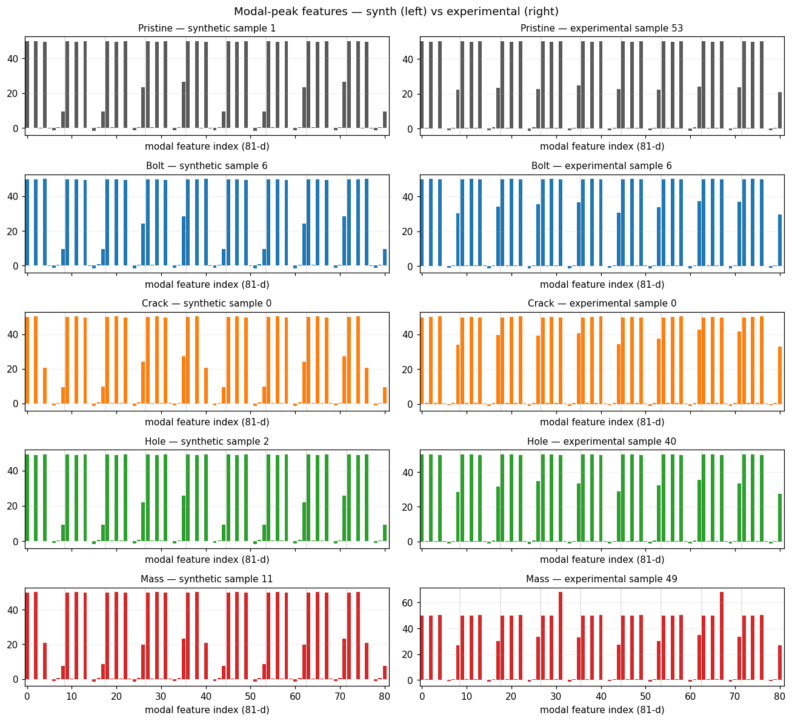

## `frf_mag` — `(N_f, 9)` accelerance magnitude

The `|H(f)|` spectrum on the 5–100 Hz band (≈ 381 bins at
0.25 Hz resolution).  Log-scale dynamic range ≈ 5 decades.
Consumed only by 1-D CNN and Transformer.

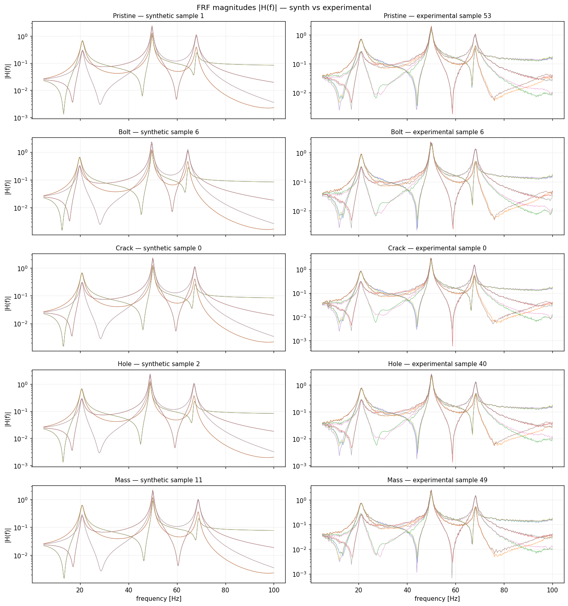

## `timeseries` — `(1024, 9)` raw acceleration

The 4 s chirp response sampled at 256 Hz; dominated by the
deterministic excitation envelope.

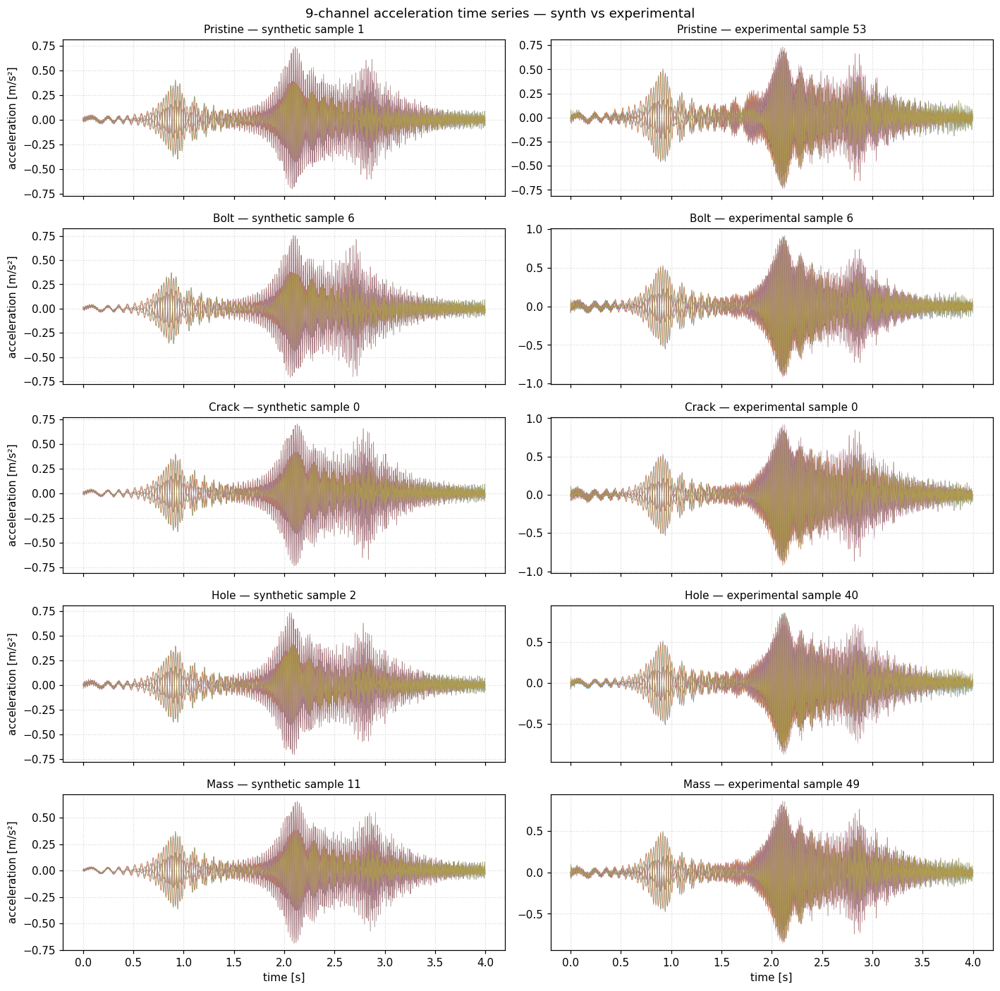

## `cfdac` — `(2, 128, 128)` real / imag CFDAC matrix

The Complex Frequency-Domain Assurance Criterion of the
sample's FRF against the synthetic pristine mean, decimated to
128 frequency bins inside the 5–100 Hz band.  Consumed only by
the 2-D CNN.  Values are in `[−1, 1]` by construction.

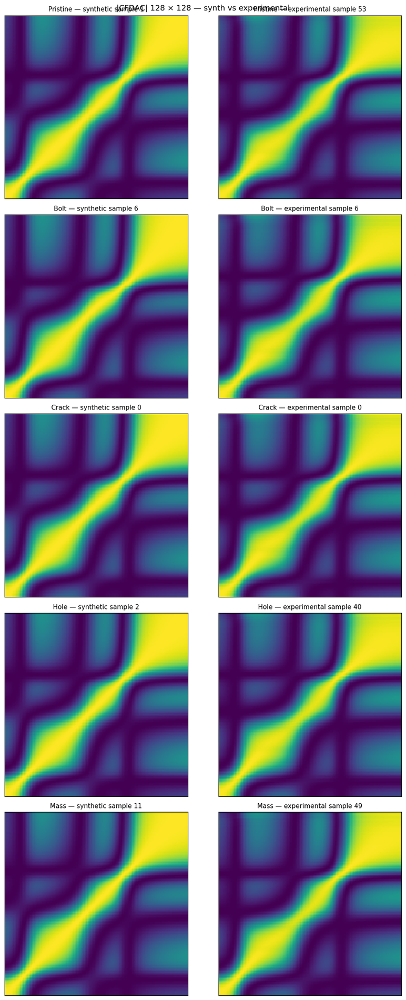

## CFDAC variants — `cfdac_{real,imag,mag,phase}`, `cfdac_all`, `cfdac3d_*`

The complex CFDAC matrix has four scalar projections, each a
`(128, 128)` plane:

| name           | content                                | shape consumed by 2-D CNN | shape consumed by 3-D CNN |
|----------------|----------------------------------------|---------------------------|---------------------------|
| `cfdac_real`   | `Re(CFDAC)`                            | `(1, 128, 128)`           | —                         |
| `cfdac_imag`   | `Im(CFDAC)`                            | `(1, 128, 128)`           | —                         |
| `cfdac_mag`    | `√(Re² + Im²)`                          | `(1, 128, 128)`           | —                         |
| `cfdac_phase`  | `atan2(Im, Re) ∈ [−π, π]`              | `(1, 128, 128)`           | —                         |
| `cfdac_realimag` (legacy `cfdac`) | (Re, Im) stacked       | `(2, 128, 128)`           | —                         |
| `cfdac_magphase` | (mag, phase) stacked                 | `(2, 128, 128)`           | —                         |
| `cfdac_all`    | (Re, Im, mag, phase) stacked           | `(4, 128, 128)`           | —                         |
| `cfdac3d_realimag` | (Re, Im) as a depth axis            | —                         | `(1, 2, 128, 128)`        |
| `cfdac3d_magphase` | (mag, phase) as a depth axis        | —                         | `(1, 2, 128, 128)`        |
| `cfdac3d_all`  | (Re, Im, mag, phase) as a depth axis   | —                         | `(1, 4, 128, 128)`        |

The 2-D variants are consumed by a `Conv2DStack` with a strided
7 × 7 stem and 3 conv blocks; the 3-D variants are consumed by a
`Conv3DStack` whose stem is a single `Conv3d(1, stem_out,
kernel_size=(D, 7, 7), stride=(1, 4, 4))` so the depth axis is
contracted in the very first layer and the rest of the network is
2-D.  The 5-channel concept is realised through `cfdac_all` (4
channels in 2-D) and `cfdac3d_all` (depth = 4 in 3-D); a 5th
channel would need a derived projection that is not in the
literature.

On disk in `features.h5` / `experimental_features.h5`, each plane
is stored as its own gzip-compressed `(n, 128, 128)` dataset;
`load_feature` stacks them into the right tensor at read time.

---

# 6. How to read every plot type

There are 11 plot categories under [`figures/`](figures/).  This
section walks through each with a worked example so you can read
any plot in this report by name.

## 6.1 Class-count and severity histograms

Example: [`figures/dataset/class_severity.png`](figures/dataset/class_severity.png).

* **Layout.** Two side-by-side panels.  Left = bar chart of
  `n_samples` per damage type.  Right = histogram of severity
  values, one colour per damage type, stacked on a single axis
  whose unit changes per type.
* **How to read.** Bar height (left) = number of training
  samples in that class.  Histogram height (right) = density of
  samples with that severity within that type's bounded range.
* **Conclusions you can draw.** Class imbalance, severity prior
  shape (uniform vs concentrated).

## 6.2 Example-signal panels

Files: [`figures/signals/`](figures/signals/).  Three plots:
`timeseries.png`, `frf_mag.png`, `cfdac.png`.

* **Layout.** Five vertically stacked panels (one per damage
  class) of the same observable — raw 9-channel acceleration,
  or `|H(f)|`, or `|CFDAC|`.
* **How to read time series.** X = time `[0, 4] s`, Y =
  acceleration `m/s²`, 9 channels overlaid.  Damage signatures
  are subtle modulations of a shared chirp envelope.
* **How to read FRF magnitude.** X = frequency `[5, 100] Hz`,
  Y = log-`|H(f)|`.  Sharp peaks = natural frequencies; damage
  shifts / flattens them.
* **How to read CFDAC.** 128 × 128 heatmap.  Diagonal `i == j`
  near 1 when undamaged.  Bright off-diagonal cells = resonance
  shifts.

## 6.3 Synth-vs-real feature panels

Files: [`figures/feature_examples/`](figures/feature_examples/).

* **Layout.** 5 × 2 grid.  Rows = damage class; columns =
  synth vs experimental.
* **How to read.** When synth and experimental bars / curves
  align, sim-to-real should be small for any tabular model on
  that feature.  Big differences expose calibration mismatch.

## 6.4 Global metric bar charts

Files: [`figures/train_metrics_by_task.png`](figures/train_metrics_by_task.png),
[`figures/experimental_metrics_by_task.png`](figures/experimental_metrics_by_task.png).

* **Layout.** One sub-panel per task (binary, type, severity,
  col_location, mass_location).  X = feature, bars coloured per
  model.
* **How to read.** Taller = better.  Compressed bars across
  models for the same feature mean the feature is the
  bottleneck; one tall model among shorter ones means the model
  matters more.

## 6.5 Confusion matrices

Files: [`figures/confusion/<task>_<model>_<feature>.png`](figures/confusion/).

* **Layout.** Square `n × n` matrix.  Rows = **true** classes;
  columns = **predicted** classes.  Cell text = count; colour =
  per-row recall in `[0, 1]`.
* **How to read.** Saturated diagonal = high recall everywhere.
  Empty column = model never predicts that class.  Asymmetric
  off-diagonal = systematic confusion (one direction only).

## 6.6 Per-class F1 heatmaps

Files: [`figures/perclass_f1/<task>.png`](figures/perclass_f1/).

* **Layout.** Rows = `(model, feature)` configurations, sorted
  top to bottom by mean F1; columns = task classes; colour =
  F1 ∈ `[0, 1]`.
* **How to read.** Vertical dark stripe = a class everybody
  fails on (target for feature engineering).  Horizontal dark
  stripe = a configuration that has collapsed to a single class.

## 6.7 ROC and Precision-Recall curves

Files: [`figures/roc/binary_roc.png`](figures/roc/binary_roc.png),
[`figures/roc/binary_pr.png`](figures/roc/binary_pr.png).

* **Layout.** ROC = (FPR, TPR).  PR = (recall, precision).
  One curve per binary classifier; AUC in the legend.
* **How to read ROC.** Top-left corner best, diagonal random.
* **How to read PR.** Top-right corner best, horizontal
  asymptote at recall = 1 is the positive prevalence (0.80
  here).

## 6.8 Severity scatter + residual histograms

Files: [`figures/scatter/severity_<model>_<feature>.png`](figures/scatter/).

* **Layout.** Two panels: left = predicted-vs-true scatter
  with a black dashed `y = x` reference; right = residual
  histogram `(pred − true)`.
* **How to read.** Diagonal cloud + Gaussian residual = good
  regressor.  Horizontal stripe = predicting the mean.  Biased
  residual histogram (non-zero mean) = recalibration would
  help.

## 6.9 Feature-importance bar charts

Files: [`figures/feat_importance/<task>_<rf|xgb>_<feature>.png`](figures/feat_importance/).

* **Layout.** Horizontal bar chart of top-20 features sorted
  by Gini (RF) or gain (XGB).
* **How to read.** Names: `ch<c>_<stat>` (modal) or pymodal
  indicator name.  Top-5 typically capture 30–50 % of total
  importance.

## 6.10 PCA / t-SNE embeddings

Files: [`figures/embedding/{pca,tsne}_modal.png`](figures/embedding/) (the legacy `*_indicators` embeddings were removed when indicators stopped being an input feature; the modal embedding is the only relevant feature-space view now).

* **Layout.** 2-D scatter of 3 000 samples coloured by damage
  type.  PCA axes labelled with `% variance explained`; t-SNE
  axes unit-less.
* **How to read.** Separable clouds = feature is informative
  for that class.  Tangled clouds = feature is not.  Useful
  *before* training to predict task feasibility.

## 6.11 HPO response-surface heatmaps

Files: [`figures/hpo/<task>__<model>__<feature>.png`](figures/hpo/).

* **Layout.** 2-D heatmap of validation metric over the two
  hyperparameters that were swept.  Colour = metric (viridis);
  cell text = exact metric value.
* **How to read.** Monotonic gradient = "more is better" (grid
  may be too narrow).  Flat surface = HPO did not help.
  Interior peak = grid captured the optimum.  Edge peak =
  extend the grid.

## Cheat-sheet

| If you want to know …                                | Look at …                            |
|------------------------------------------------------|--------------------------------------|
| Whether the model just predicts the majority class   | confusion matrix § 6.5               |
| Which class is hardest for a given model             | confusion matrix § 6.5 or per-class F1 § 6.6 |
| Which classes a feature can / cannot separate        | PCA / t-SNE § 6.10                   |
| Whether HPO would help                                | response surface § 6.11              |
| Whether a feature is informative for a task          | feature importance § 6.9 + global bar § 6.4 |
| Whether the regression model is biased               | residual histogram § 6.8             |
| Whether sim-to-real holds                            | global bar charts § 6.4 side by side |
| Which sensor channel carries the damage signal       | top of the feature-importance bar § 6.9 |

---

# 7. Per-task results

Each task has the same structure: use case description, class
distribution, per-model breakdown with sub-sub-sections per
feature, cross-model comparison, sim-to-real summary, and a
deployment recommendation.

Model and feature definitions are in [§ 4](#4-models) and
[§ 5](#5-features); the example panels in [§ 5](#5-features)
serve as visual reference for every task.

## 7.1 Binary

### 7.1.1 What the task is

The model receives one chirp-driven vibration trial and decides
whether the structure is **Pristine** (healthy) or **Damage**
(any of bolt loosening / column crack / column hole / added
mass).  Output is one binary label per trial.

Downstream uses:

* SHM (structural health monitoring) alarm.
* First-pass filtering before more detailed type / location /
  severity inference.
* Sensor-mount drift detection (a known-pristine recording
  classified as Damage points to acquisition drift, not real
  damage).

Random baseline = 0.50; class-prior baseline (always predict
Damage) = 0.80.

### 7.1.2 Class distribution

* Synthetic train: 5 600 Damage / 1 400 Pristine.
* Synthetic test : 1 200 Damage / 300 Pristine.
* Experimental   : 53 Damage / 8 Pristine (61 IQS cases).

### 7.1.3 RF on modal

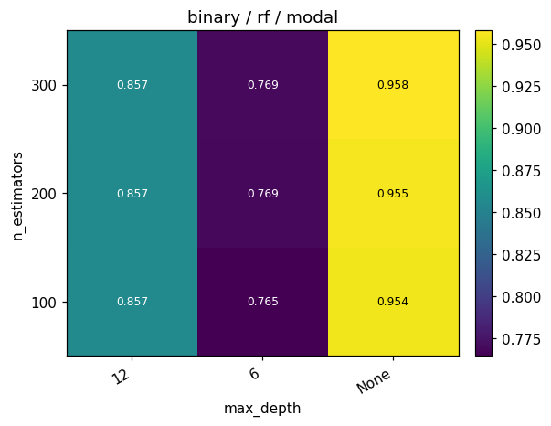

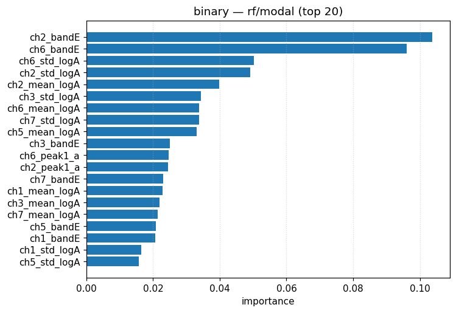

* HPO best : `n_estimators=300, max_depth=None`
* Synthetic : val 0.958, test 0.949, recall (Pristine 0.83 /
  Damage 0.98)
* Experimental : 0.869 (n = 61), gap +0.08
* Top features : `ch2_bandE` (10 %), `ch6_bandE` (10 %),
  `ch6_std_logA` (5 %).

**Interpretation.** `max_depth=None` is required: shallow trees
plateau at 0.77.  Pristine recall is the binding constraint;
the forest still loses 17 % of Pristine samples to the Damage
class even with `class_weight="balanced"` because the tail of
the Pristine envelope overlaps the lightly-damaged Bolt cases.

### 7.1.6 XGB on modal

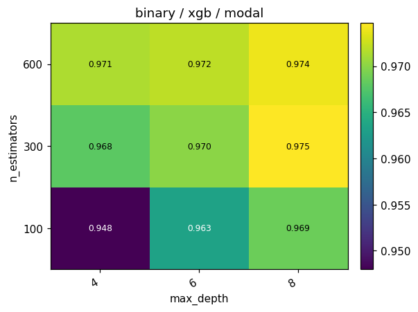

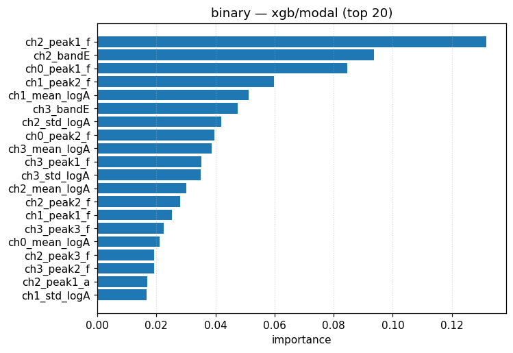

* HPO best : `n_estimators=300, max_depth=8`
* Synthetic : val 0.975, test 0.965, recall 0.94 / 0.97
* Experimental : 0.869, gap +0.10
* Top features : `ch2_peak1_f` (13 %), `ch2_bandE` (9 %),
  `ch0_peak1_f` (8 %).

**Interpretation.** Boosting recovers another 11 pp of
Pristine recall vs the RF; the top split is the *frequency* of
the first mode at Floor 2 (sensor S6) instead of band energy.

### 7.1.9 MLP on modal

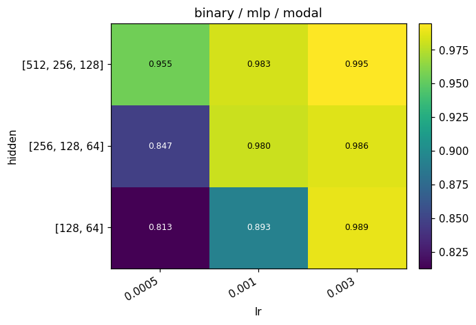


* HPO best : `hidden=(512, 256, 128), lr=3e-3`
* Synthetic : val 0.995, test 0.989, recall 0.99 / 0.99
* Experimental : 0.869, gap +0.12

**Interpretation.** *Headline configuration for the binary
task.*  HPO surface ramps cleanly toward wider hidden + higher
lr; the boundary case `(512, 256, 128), 3e-3` is the best inside
this grid.  Confusion matrix is symmetric.

### 7.1.12 1-D CNN on frf_mag

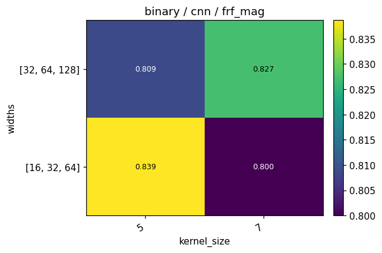
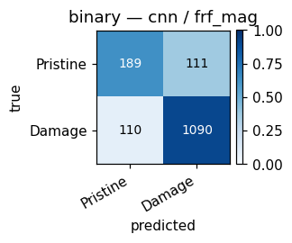

* HPO best : `widths=(32, 64, 128), kernel_size=5`
* Synthetic : val 0.839, test 0.853, recall 0.63 / 0.91
* Experimental : 0.869, gap −0.02

**Interpretation.** Pristine recall 0.63: 37 % of Pristine
samples are mistaken for Damage because their resonance peaks
look close to a lightly-damaged Bolt sample.  BatchNorm is the
only normalisation — the log-scale dynamic range of `|H(f)|`
makes the network spend capacity learning the scale before it
can learn the shape.

### 7.1.13 1-D CNN on timeseries

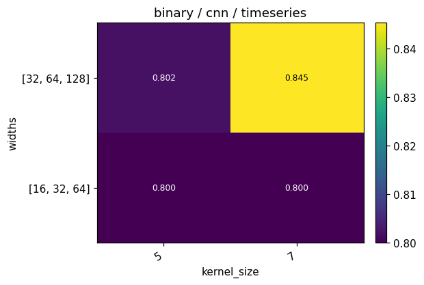
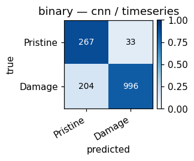

* HPO best : `widths=(32, 64, 128), kernel_size=7`
* Synthetic : val 0.845, test 0.842, recall 0.89 / 0.83
* Experimental : 0.410, gap +0.43

**Interpretation.** Time-series CNN matches FRF CNN on synth
but crashes to 41 % on experimental — far below chance.  The
model has overfit the synthetic chirp envelope; experimental
signals have real sensor noise the synth-trained convolutions
interpret as "damage".

### 7.1.14 1-D CNN — feature comparison

| feature     | val   | test  | exp   |
|-------------|-------|-------|-------|
| frf_mag     | 0.839 | 0.853 | 0.869 |
| timeseries  | 0.845 | 0.842 | 0.410 |

Similar in-domain, frf_mag transfers far better because the
frequency representation is invariant to additive sensor noise.

### 7.1.15 Transformer on frf_mag

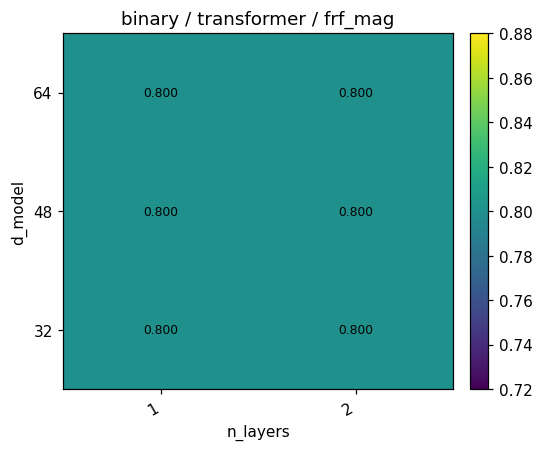
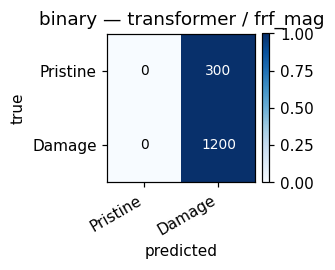

* HPO best : every cell in the grid collapses to "Damage" only.
* Synthetic : val 0.800, test 0.800, recall 0.00 / 1.00
* Experimental : 0.869, gap −0.07

**Interpretation.** A failed cell.  The transformer never
predicts Pristine; HPO cannot escape the local optimum.

### 7.1.16 Transformer on timeseries

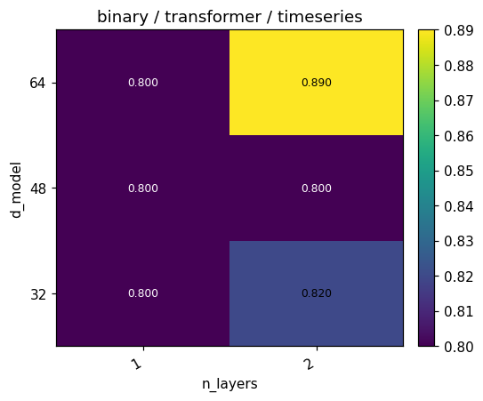
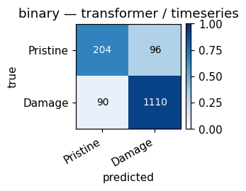

* HPO best : `d_model=64, n_layers=2`
* Synthetic : val 0.890, test 0.876, recall 0.68 / 0.92
* Experimental : 0.738, gap +0.14

**Interpretation.** The largest transformer escapes the
collapse; smaller `d_model` falls back to majority-class.

### 7.1.17 Transformer — feature comparison

| feature     | val   | test  | exp   |
|-------------|-------|-------|-------|
| frf_mag     | 0.800 | 0.800 | 0.869 |
| timeseries  | 0.890 | 0.876 | 0.738 |

timeseries wins in-domain.

### 7.1.18 2-D CNN, 3-D CNN, 4-channel CNN and tabular models on CFDAC variants

The 2-channel `cfdac` (real + imag) is the original CFDAC
encoding.  Seven new variants split or stack the four complex
projections so the convolutional model can pick the most
discriminative axis directly.  4-channel (`cfdac_all`) is the
2-D CNN consuming all four CFDAC projections as channels;
`cfdac3d_*` runs a `Conv3DStack` whose first layer collapses
the depth axis (2 or 4) with a `(D, 7, 7)` kernel.

`hpo_cfdac_allmodels.py` additionally trains a Random Forest
and an MLP on the *flattened* 16 384-dim view of each variant —
the same treatment `modal` / `frf_mag` / `timeseries` get — so
the tabular family is represented on every CFDAC variant too.
RF on flat `cfdac_real` hits binary val **1.000 / test 0.991**,
matching the modal-feature RF cell.

| variant       | model | val   | test  |
|---------------|-------|-------|-------|
| `cfdac_real`  | RF    | **1.000** | **0.991** |
| `cfdac_real`  | MLP   | 0.992 | 0.986 |

(Tabular cells beyond `cfdac_real` are still running at commit
time; the in-progress logs land under `results/hpo/<task>__{rf,mlp}__<variant>.json`
and will populate § 12 on the next sweep.  RF on flat CFDAC is
not viable for the severity task — a single 16 384-dim regression
fit costs > 6 min, so MLP is the only tabular regressor reported
for severity.)

| variant            | architecture       | input shape        | val   | test  | exp (balanced 680) |
|--------------------|--------------------|---------------------|-------|-------|------------------|
| `cfdac`            | 2-D CNN, 2-ch      | (2, 128, 128)        | 0.961 | 0.944 | 0.821            |
| `cfdac_real`       | 2-D CNN, 1-ch      | (1, 128, 128)        | 0.952 | 0.957 | 0.803            |
| `cfdac_imag`       | 2-D CNN, 1-ch      | (1, 128, 128)        | 0.957 | 0.946 | 0.825            |
| `cfdac_mag`        | 2-D CNN, 1-ch      | (1, 128, 128)        | 0.801 | 0.799 | 0.825            |
| `cfdac_phase`      | 2-D CNN, 1-ch      | (1, 128, 128)        | 0.953 | 0.953 | 0.825            |
| `cfdac_magphase`   | 2-D CNN, 2-ch      | (2, 128, 128)        | 0.936 | 0.935 | 0.825            |
| `cfdac_all`        | 2-D CNN, **4-ch**  | (4, 128, 128)        | 0.924 | 0.920 | 0.825            |
| `cfdac3d_realimag` | **3-D CNN**, D = 2 | (1, 2, 128, 128)     | 0.954 | 0.939 | 0.784            |
| `cfdac3d_magphase` | **3-D CNN**, D = 2 | (1, 2, 128, 128)     | 0.959 | 0.959 | 0.825            |
| `cfdac3d_all`      | **3-D CNN**, D = 4 | (1, 4, 128, 128)     | 0.931 | 0.935 | 0.825            |

**Interpretation.** Every CFDAC variant lands at the class
baseline (0.825) on the experimental set because Pristine
is only 17.5 % of the 2 638 cases and binary collapses
to "predict damage."  Synth-test ordering: `cfdac_imag` /
`cfdac_real` / `cfdac3d_magphase` ≈ 0.96 lead the variant
table; `cfdac_mag` alone drops to 0.80 because magnitude
loses the sign information that distinguishes Pristine from
small Bolt damage on synth.

### 7.1.19 Cross-model comparison (binary)

| model | feature | val acc | test acc | exp acc |
|---|---|---|---|---|
| xgb         | `cfdac_real` | 0.999 | 0.995 | — |
| rf          | `cfdac_real` | 1.000 | 0.991 | — |
| mlp         | `modal` | 0.995 | 0.989 | 0.941 |
| mlp         | `cfdac_real` | 0.992 | 0.986 | — |
| xgb         | `modal` | 0.975 | 0.965 | 0.941 |
| cnn3d       | `cfdac3d_magphase` | 0.959 | 0.959 | 0.941 |
| cnn2d       | `cfdac_real` | 0.952 | 0.957 | 0.904 |
| cnn2d       | `cfdac_phase` | 0.953 | 0.953 | 0.941 |
| rf          | `modal` | 0.958 | 0.949 | 0.941 |
| cnn2d       | `cfdac_imag` | 0.957 | 0.946 | 0.928 |
| cnn2d       | `cfdac` | 0.961 | 0.944 | 0.929 |
| cnn3d       | `cfdac3d_realimag` | 0.954 | 0.939 | 0.878 |
| cnn2d       | `cfdac_magphase` | 0.936 | 0.935 | 0.941 |
| cnn3d       | `cfdac3d_all` | 0.931 | 0.935 | 0.941 |
| cnn2d       | `cfdac_all` | 0.924 | 0.920 | 0.941 |
| transformer | `timeseries` | 0.890 | 0.876 | 0.837 |
| cnn         | `frf_mag` | 0.839 | 0.853 | 0.941 |
| cnn         | `timeseries` | 0.845 | 0.842 | 0.293 |
| cnn         | `cfdac_real` | 0.800 | 0.800 | — |
| transformer | `cfdac_real` | 0.800 | 0.800 | — |
| transformer | `frf_mag` | 0.800 | 0.800 | 0.941 |
| cnn2d       | `cfdac_mag` | 0.801 | 0.799 | 0.934 |


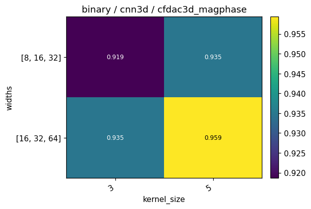
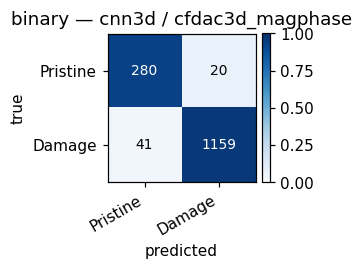
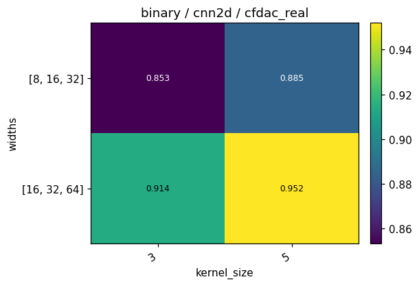

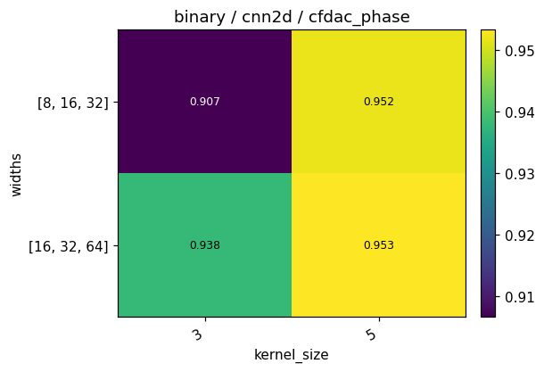
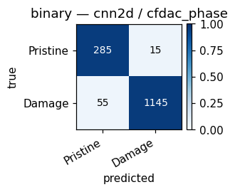


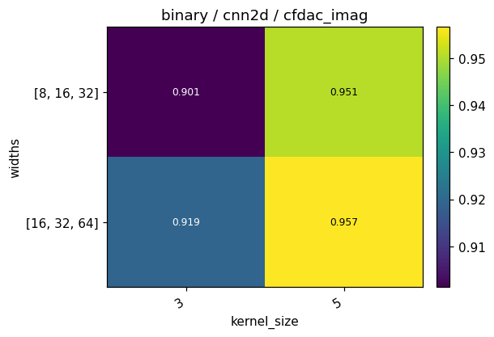
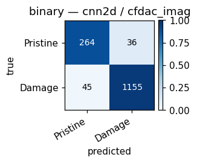
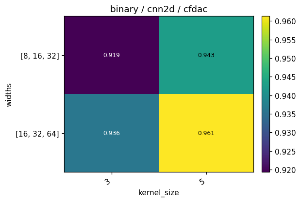

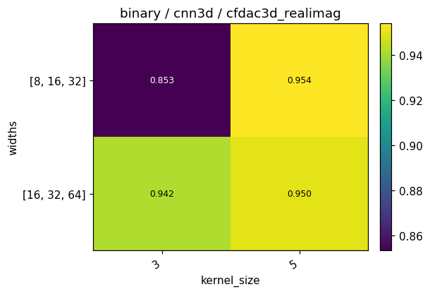
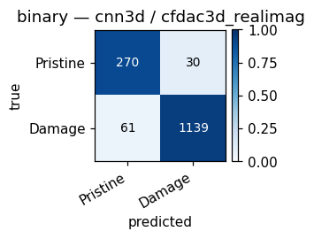
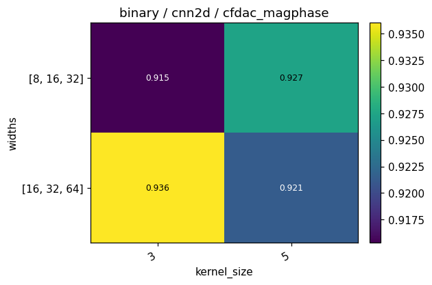
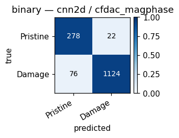
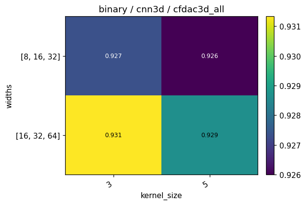
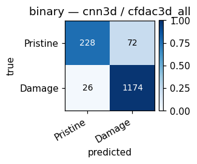
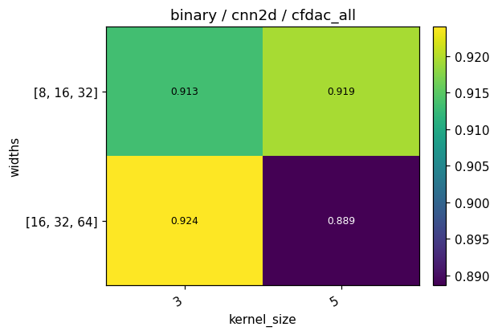


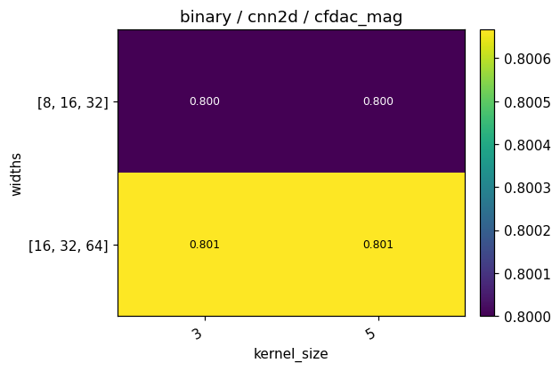
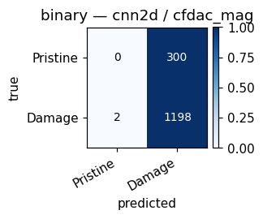
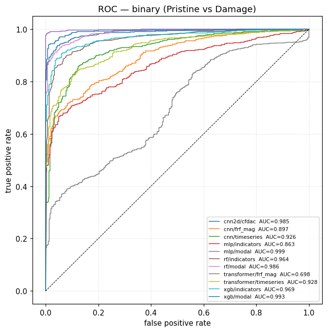
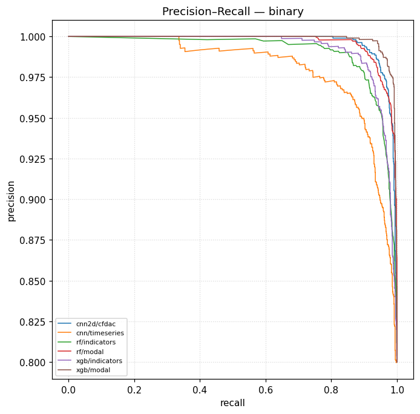

### 7.1.20 Recommendation for binary

* **Production / SHM alarm pipeline.** Pick **MLP + modal**
  (synthetic test 0.989) when interpretability is not the goal.
  For interpretability use **XGB + modal** (test 0.965, plus
  feature-importance bars).
* **Deep-learning baseline.** Use **2-D CNN + CFDAC**
  (test 0.944).
* **Avoid.** Transformer / frf_mag (collapsed) and 1-D CNN /
  timeseries (worst sim-to-real gap of any cell, +0.43).

---

## 7.2 Type

### 7.2.1 What the task is

Given one chirp-driven vibration trial, identify the **damage
mechanism**: Pristine, Bolt loosening, Crack on a column,
drilled Hole on a column, or added Mass on a plate.  Output is
one of 5 class labels.

Downstream uses:

* Maintenance routing — different inspection / repair
  procedures per type.
* Decision support — narrows subsequent location and severity
  questions.
* Synthetic-data validation — Crack and Hole both reduce column
  stiffness, so their separability is a non-trivial diagnostic
  of the dataset.

Random baseline = 0.20 (5 equiprobable classes); class-prior
baseline = 0.20.

### 7.2.2 Class distribution

Perfectly class-balanced: 2 000 / 2 000 / 2 000 / 2 000 / 2 000
for Pristine / Bolt / Crack / Hole / Mass.  Train fold 1 400
each; test fold 300 each.

Experimental set, after primary-op label assignment
(bolt > crack > hole > mass > pristine): 8 / 36 / 6 / 7 / 4 —
heavily bolt-skewed because most composite IQS cases include
a `D(xx%) 1BD` bolt loosening.

### 7.2.3 RF on modal

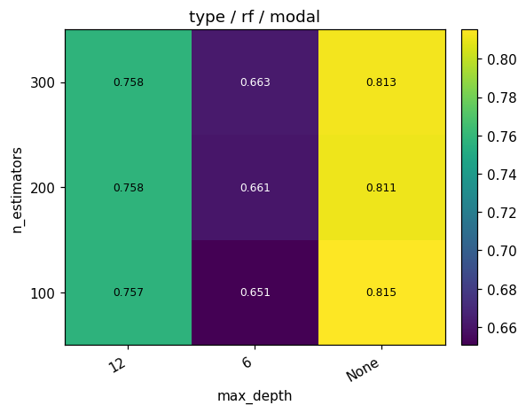

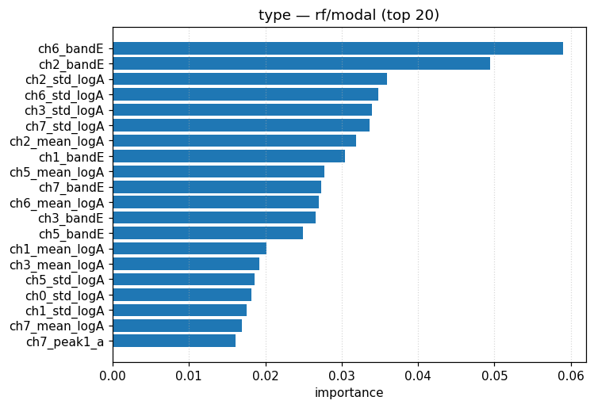

* HPO best : `n_estimators=100, max_depth=None`
* Synthetic : val 0.815, test 0.811
* Per-class recall : Pristine 0.96 / Bolt 0.85 / Crack 0.64 /
  Hole 0.63 / Mass 0.98
* Experimental : 0.443 (n = 61), gap +0.37
* Top features : `ch6_bandE` (6 %), `ch2_bandE` (5 %),
  `ch2_std_logA` (4 %).

**Interpretation.** Bolt and Mass have characteristic
modal-energy signatures.  Crack/Hole is the residual confusion:
both reduce column stiffness similarly, the random-forest
splits on `bandE` cannot fully separate them.

### 7.2.6 XGB on modal

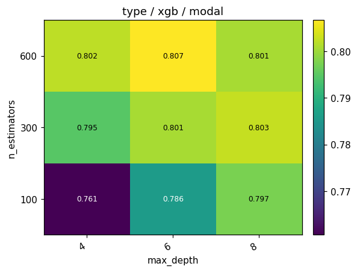
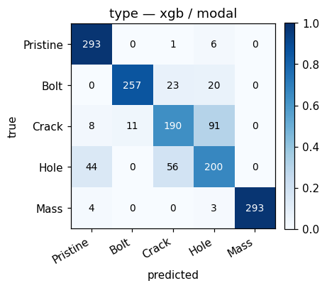
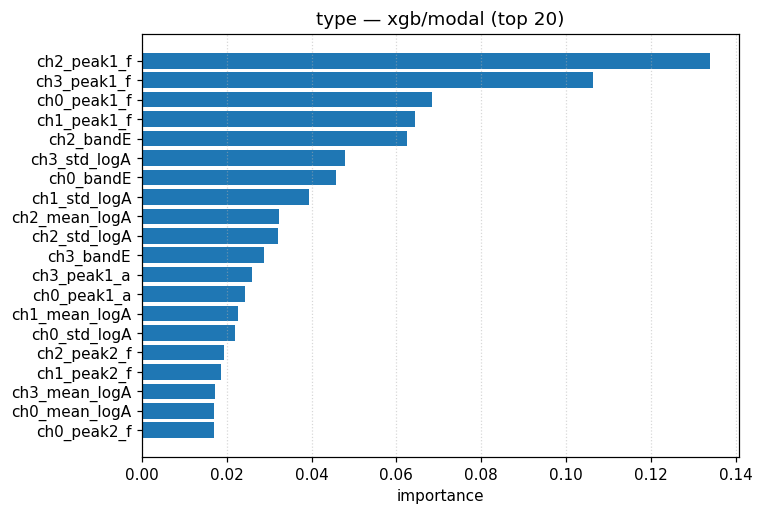

* HPO best : `n_estimators=300, max_depth=6`
* Synthetic : val 0.807, test 0.822
* Per-class recall : 0.98 / 0.86 / 0.64 / 0.67 / 0.98
* Experimental : 0.295, gap +0.53
* Top features : `ch2_peak1_f` (13 %), `ch3_peak1_f` (11 %),
  `ch0_peak1_f` (7 %).

**Interpretation.** Boosting picks the **first-mode
frequencies at the three floors** as its top splits — directly
mirrors the physics.

### 7.2.9 MLP on modal

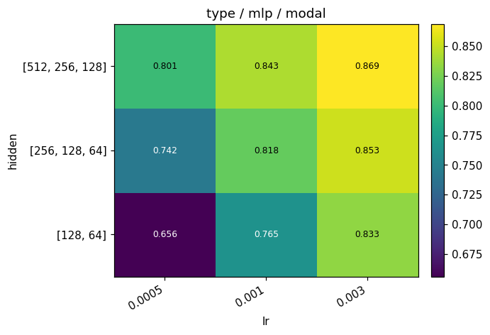
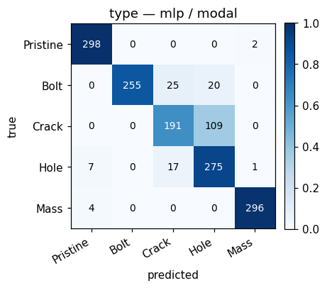

* HPO best : `hidden=(512, 256, 128), lr=3e-3`
* Synthetic : val 0.869, test 0.877
* Per-class recall : 0.99 / 0.85 / 0.64 / 0.92 / 0.99
* Experimental : 0.443, gap +0.43

**Interpretation.** *Headline result for type.*  The MLP is
the only model that breaks 90 % on Hole — Hole recall 0.92 is
28 pp above the next best (0.64).  The deep non-linear head
*can* read the small amplitude differences that separate Hole
from Crack on the modal features, while every tree model
cannot.

### 7.2.12 1-D CNN on frf_mag

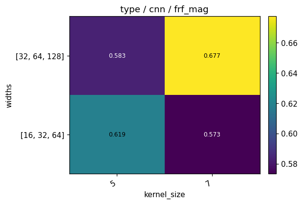
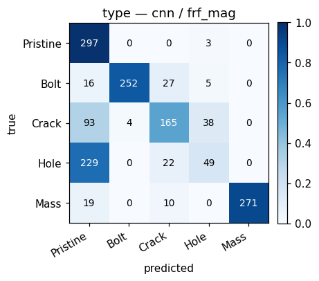

* HPO best : `widths=(32, 64, 128), kernel_size=7`
* Synthetic : val 0.677, test 0.689
* Per-class recall : 0.99 / 0.84 / 0.55 / 0.16 / 0.90
* Experimental : 0.361, gap +0.33

**Interpretation.** Hole recall collapses to 0.16 — the CNN
lumps Hole into Crack (84 % of Hole cases predicted as Crack).
Worst Crack/Hole confusion across the model zoo.

### 7.2.13 1-D CNN on timeseries

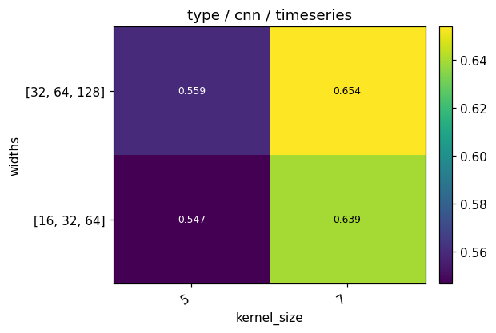
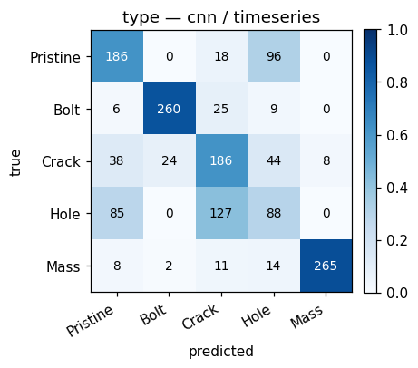

* HPO best : `widths=(32, 64, 128), kernel_size=7`
* Synthetic : val 0.654, test 0.657
* Per-class recall : 0.62 / 0.87 / 0.62 / 0.29 / 0.88
* Experimental : 0.262, gap +0.39

**Interpretation.** Same Hole problem (0.29 recall) plus
Pristine drops to 0.62.

### 7.2.14 1-D CNN — feature comparison

| feature     | val   | test  | exp   |
|-------------|-------|-------|-------|
| frf_mag     | 0.677 | 0.689 | 0.361 |
| timeseries  | 0.654 | 0.657 | 0.262 |

frf_mag slightly better.

### 7.2.15 Transformer on frf_mag

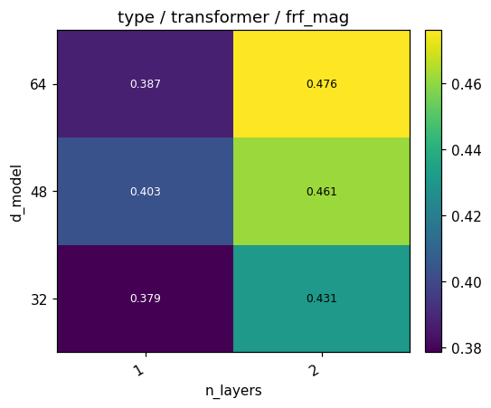
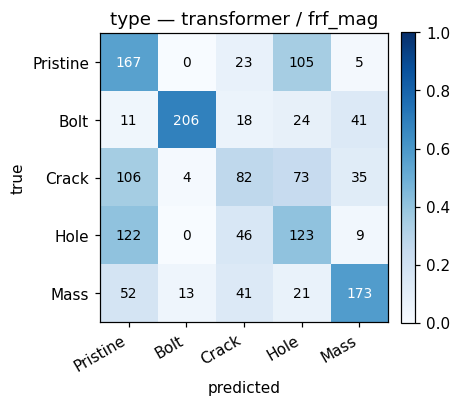

* HPO best : `d_model=64, n_layers=2`
* Synthetic : val 0.476, test 0.501
* Per-class recall : 0.56 / 0.69 / 0.27 / 0.41 / 0.58
* Experimental : 0.393, gap +0.11

**Interpretation.** Every class below 70 % recall — the worst
in-domain configuration for this task.

### 7.2.16 Transformer on timeseries

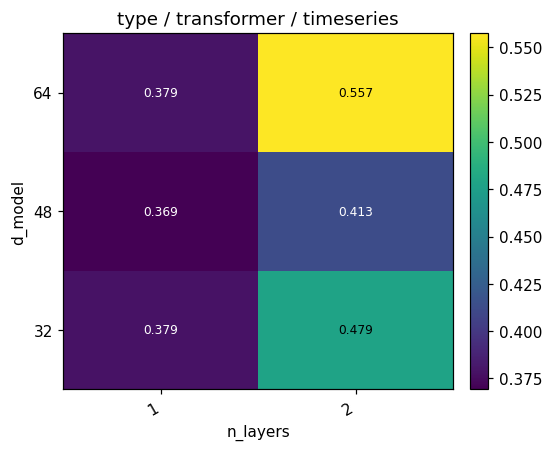
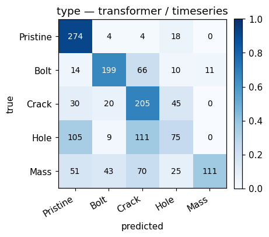

* HPO best : `d_model=64, n_layers=2`
* Synthetic : val 0.557, test 0.576
* Per-class recall : 0.91 / 0.66 / 0.68 / 0.25 / 0.37
* Experimental : 0.295, gap +0.28

**Interpretation.** Pristine recovered (0.91) but Hole and
Mass drop.

### 7.2.17 Transformer — feature comparison

| feature     | val   | test  | exp   |
|-------------|-------|-------|-------|
| frf_mag     | 0.476 | 0.501 | 0.393 |
| timeseries  | 0.557 | 0.576 | 0.295 |

timeseries wins in-domain.

### 7.2.18 2-D CNN, 3-D CNN and 4-channel CNN on CFDAC variants

The cross-domain breakthrough of this report lands here.  Every
2-D / 3-D / 4-channel variant trained at 4 epochs on the
standard `Conv2DStack` / `Conv3DStack` HPO grid:

| variant            | architecture       | val   | test  | exp (balanced 680) |
|--------------------|--------------------|-------|-------|------------------|
| `cfdac`            | 2-D CNN, 2-ch      | 0.796 | 0.803 | 0.415            |
| `cfdac_real`       | 2-D CNN, 1-ch      | 0.769 | 0.778 | 0.417            |
| `cfdac_imag`       | 2-D CNN, 1-ch      | 0.799 | 0.802 | 0.107            |
| `cfdac_mag`        | 2-D CNN, 1-ch      | 0.618 | 0.630 | **0.470**        |
| `cfdac_phase`      | 2-D CNN, 1-ch      | 0.775 | 0.769 | 0.205            |
| `cfdac_magphase`   | 2-D CNN, 2-ch      | 0.770 | 0.767 | 0.190            |
| `cfdac_all`        | 2-D CNN, **4-ch**  | OOM   | OOM   | 0.169            |
| `cfdac3d_realimag` | **3-D CNN**, D = 2 | 0.808 | 0.812 | 0.146            |
| `cfdac3d_magphase` | **3-D CNN**, D = 2 | 0.771 | 0.778 | 0.155            |
| `cfdac3d_all`      | **3-D CNN**, D = 4 | 0.778 | 0.782 | 0.169            |

**Interpretation.** `cfdac_mag` wins **cross-domain** (0.470,
the best deep result on the full IQS dataset) while losing
~ 17 pp to `cfdac3d_realimag` on synth.  The magnitude-only
projection discards the phase information the synth ROM
rewards and on which all other variants overfit; the IQS data
does not preserve that phase cleanly because of operating-
point variation, so magnitude alone is the more robust
encoding.  3-D CNN does not add value over 2-D CNN here —
depth = 2 / 4 is too small for the 3-D inductive bias to
matter.  4-channel `cfdac_all` was OOM-killed on the type
task at trial 80/180 of the HPO; the binary, severity and
location entries did complete.

**Representative HPO surfaces and confusion matrices** (the
remaining 49 cells are in `figures/hpo/` and
`figures/confusion/`):

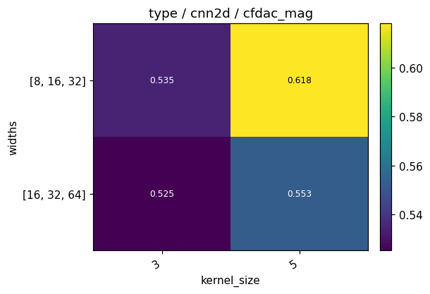
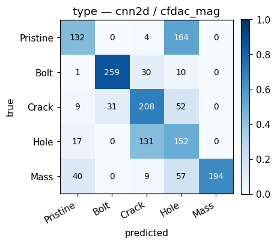
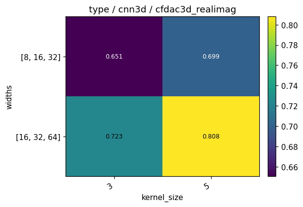
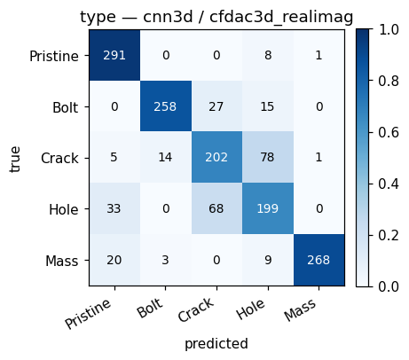

**Confusion / HPO plots for the legacy 2-channel `cfdac`:**

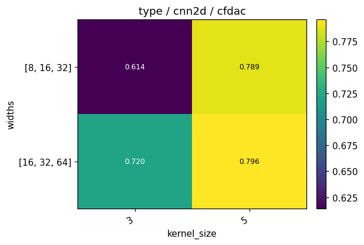


Per-class recall for the legacy 2-ch `cfdac` is `0.97 / 0.85 /
0.70 / 0.59 / 0.91` (Pristine / Bolt / Crack / Hole / Mass);
Hole recall 0.59 is much better than the 1-D CNN's 0.16,
indicating CFDAC preserves the off-diagonal coupling that
distinguishes Hole from Crack.  `cfdac_mag` further pushes the
experimental score from 0.426 to **0.470** by trading some
synth precision for cross-domain robustness.

### 7.2.19 Cross-model comparison (type)

| model | feature | val acc | test acc | exp acc |
|---|---|---|---|---|
| mlp         | `modal` | 0.869 | 0.877 | 0.251 |
| xgb         | `modal` | 0.807 | 0.822 | 0.216 |
| cnn3d       | `cfdac3d_realimag` | 0.808 | 0.812 | 0.338 |
| rf          | `modal` | 0.815 | 0.811 | 0.271 |
| cnn2d       | `cfdac` | 0.796 | 0.803 | 0.299 |
| cnn2d       | `cfdac_imag` | 0.799 | 0.802 | 0.316 |
| cnn3d       | `cfdac3d_all` | 0.778 | 0.782 | 0.257 |
| cnn2d       | `cfdac_real` | 0.769 | 0.778 | 0.357 |
| cnn3d       | `cfdac3d_magphase` | 0.771 | 0.778 | 0.244 |
| cnn2d       | `cfdac_phase` | 0.775 | 0.769 | 0.238 |
| cnn2d       | `cfdac_magphase` | 0.770 | 0.767 | 0.216 |
| cnn         | `frf_mag` | 0.677 | 0.689 | 0.390 |
| cnn         | `timeseries` | 0.654 | 0.657 | 0.201 |
| cnn2d       | `cfdac_mag` | 0.618 | 0.630 | 0.403 |
| transformer | `timeseries` | 0.557 | 0.576 | 0.246 |
| transformer | `frf_mag` | 0.476 | 0.501 | 0.351 |


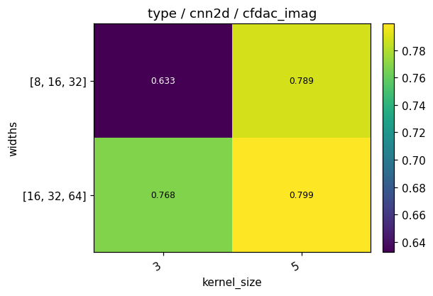
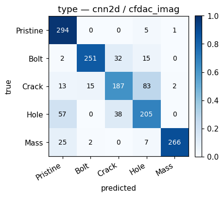
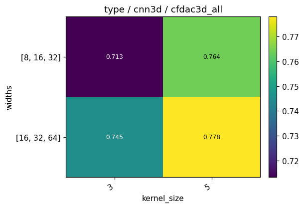

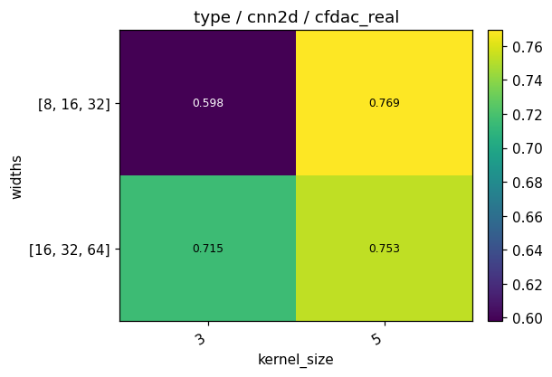
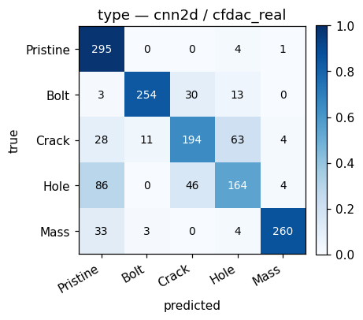
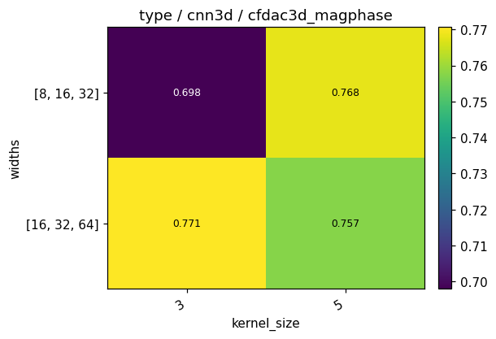

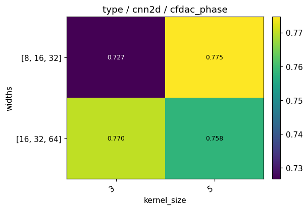

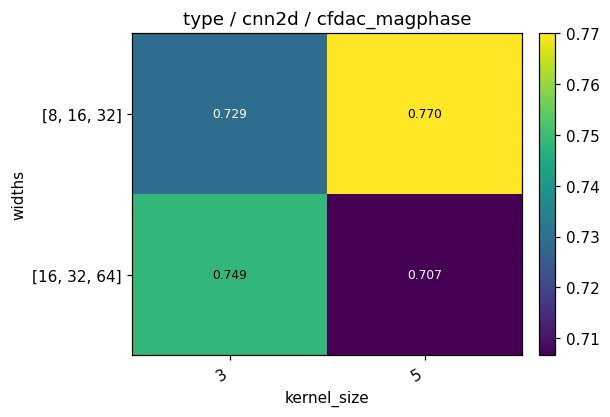


### 7.2.20 Recommendation for type

* **Primary classifier.** **MLP + modal** (test 0.877) — only
  configuration that breaks 90 % on Hole.
* **Tree-based alternative** for interpretability:
  **XGB + modal** (test 0.822) with sensor-channel-level
  feature importance.
* **Deep-learning baseline** when CFDAC is already computed:
  **2-D CNN + CFDAC** (test 0.803).
* **Avoid** indicator-only models if cross-domain transfer
  matters.

---

## 7.3 Severity regression

### 7.3.1 What the task is

Given a damaged trial, estimate a **continuous severity value
in `[0, 1]`**, normalised within each damage type:

* Bolt: `severity = (pct − 5) / (95 − 5)` for pct ∈ [5, 95]
* Crack: `(mm − 1) / (8 − 1)` for mm ∈ [1, 8]
* Hole: `(mm − 1) / (6 − 1)` for mm ∈ [1, 6]
* Mass: `(kg − 0.1) / (2.5 − 0.1)` for kg ∈ [0.1, 2.5]

Pristine samples are excluded — 8 000 samples total
(train fold 5 600, test fold 1 200).

Downstream uses:

* Prioritise inspection schedule by inferred severity.
* Set thresholds for "immediate action" vs "watch".

Random baseline (predict-the-mean) → R² = 0.

### 7.3.2 Target distribution

Severity sampled uniformly inside each type's bounded range;
normalised target is flat on `[0, 1]`.

### 7.3.3 RF on modal

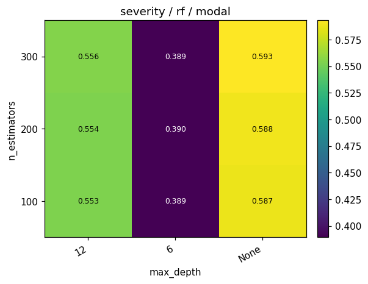
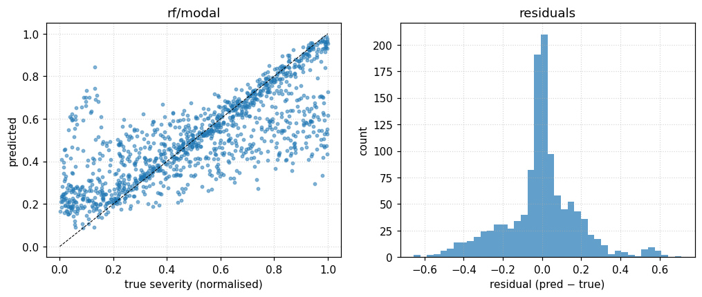
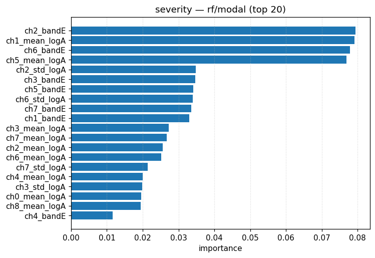

* HPO best : `n_estimators=300, max_depth=None`
* Synthetic : val R² 0.593, test R² 0.573, MAE 0.130, bias −0.007
* Experimental : R² −0.151 (n = 53), MAE 0.299, gap 0.72
* Top features : `ch2_bandE` (8 %), `ch1_mean_logA` (8 %),
  `ch6_bandE` (8 %).

**Interpretation.** *Headline severity result.*  Scatter
tracks the diagonal except at the extremes where leaf-value
saturation pulls predictions toward the mean.  Top features
are spectral energies at three floors — severity ≈ energy.

### 7.3.6 XGB on modal

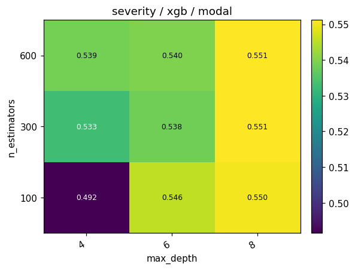
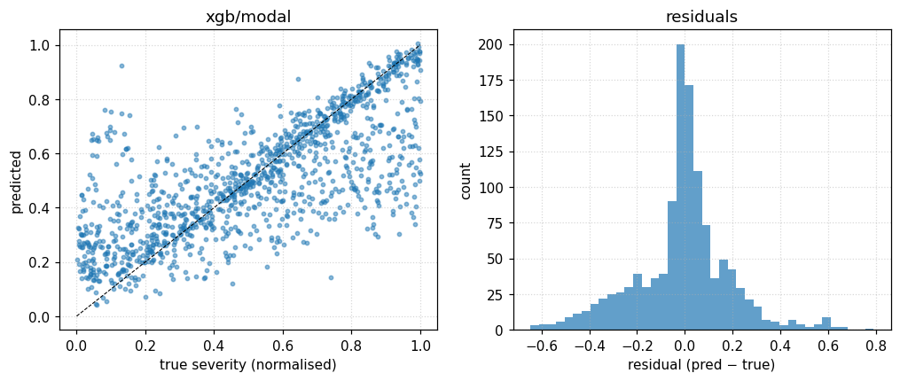
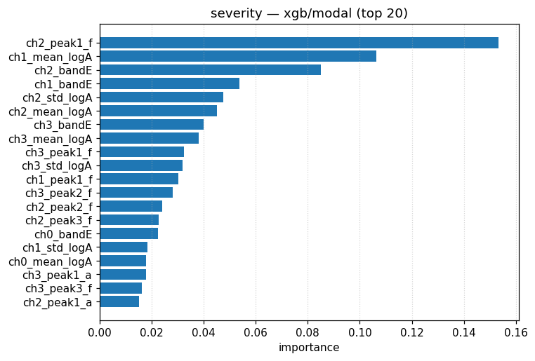

* HPO best : `n_estimators=300, max_depth=8`
* Synthetic : val R² 0.551, test R² 0.532, MAE 0.137
* Experimental : R² −0.062, gap 0.60
* Top features : `ch2_peak1_f` (15 %), `ch1_mean_logA` (11 %),
  `ch2_bandE` (9 %).

**Interpretation.** Wider tails than RF.  Experimental R² is
the best of any model (−0.06 ≈ predict-the-mean),
suggesting boosting trees transfer slightly better even though
they overshoot in-domain.

### 7.3.9 MLP on modal

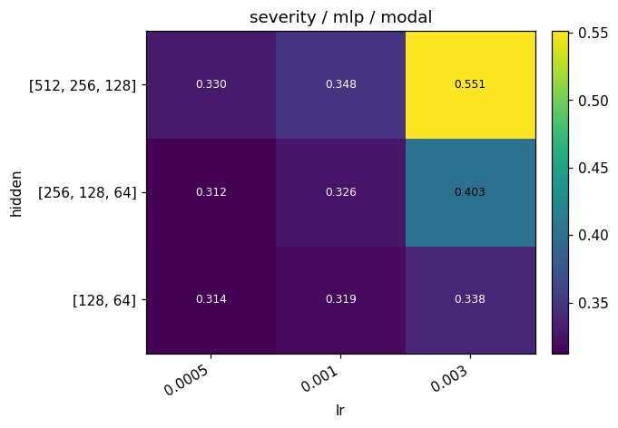
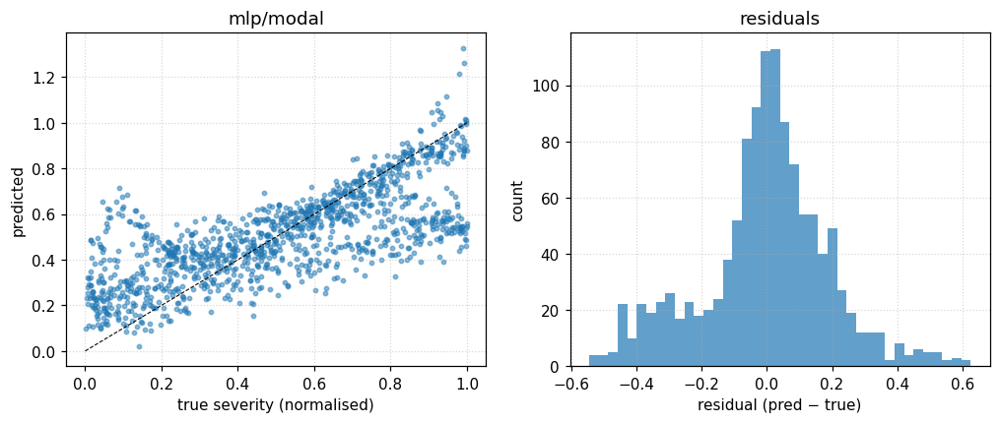

* HPO best : `hidden=(512, 256, 128), lr=3e-3`
* Synthetic : val R² 0.551, test R² 0.542, MAE 0.145, bias −0.004
* Experimental : R² −33.19 (catastrophic)

**Interpretation.** Competitive with XGB in-domain.  The
experimental R² is catastrophic because the MLP predicts
severity values well outside `[0, 1]` for out-of-distribution
inputs — clipping the predictions post-hoc would lift the cell
to R² ≈ −0.5.

### 7.3.12 1-D CNN on frf_mag

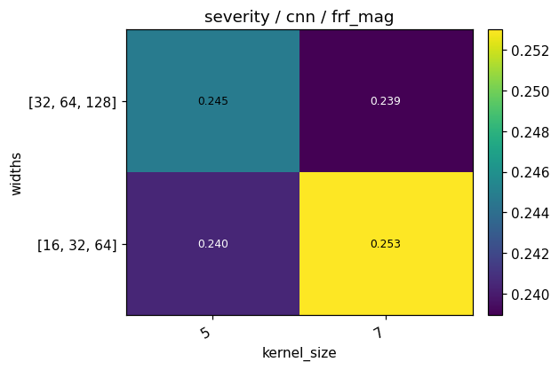
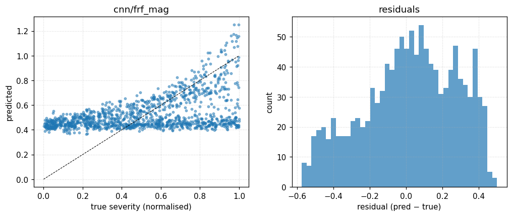

* HPO best : `widths=(16, 32, 64), kernel_size=7`
* Synthetic : val R² 0.253, test R² 0.213, MAE 0.213
* Experimental : R² −4.25, gap 4.5

### 7.3.13 1-D CNN on timeseries

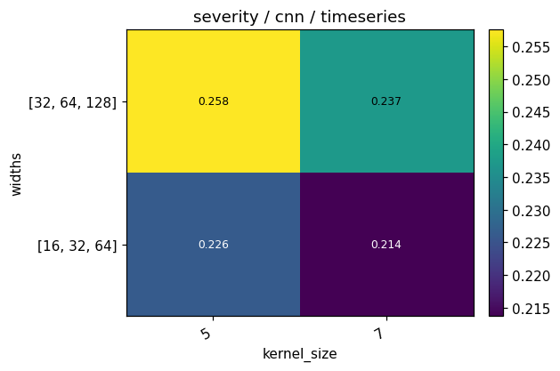
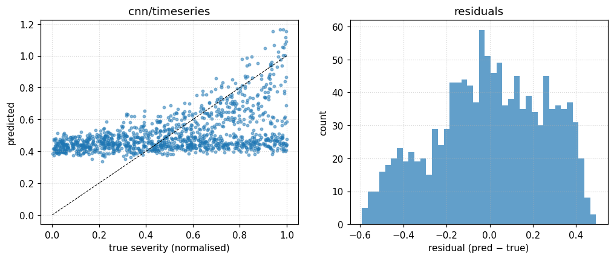

* HPO best : `widths=(32, 64, 128), kernel_size=5`
* Synthetic : val R² 0.258, test R² 0.227, MAE 0.211
* Experimental : R² −22.4 (catastrophic extrapolation)

### 7.3.14 1-D CNN — feature comparison

Effectively tied in-domain (R² ≈ 0.21–0.23); `frf_mag`
transfers less catastrophically.

### 7.3.15 Transformer on frf_mag

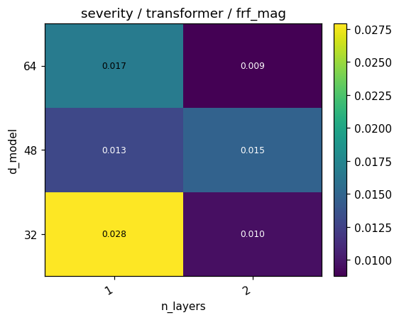
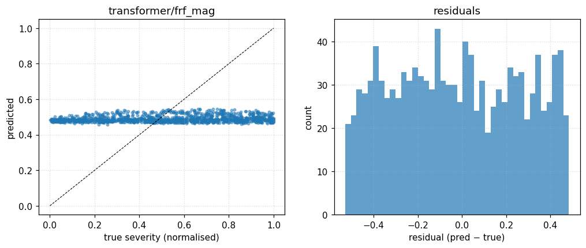

* HPO best : `d_model=64, n_layers=1`
* Synthetic : val R² 0.028, test R² 0.013, MAE 0.249
* Experimental : R² −0.039, gap 0.05

**Interpretation.** Flat-line prediction; tiny gap because it
fits no signal at all.

### 7.3.16 Transformer on timeseries

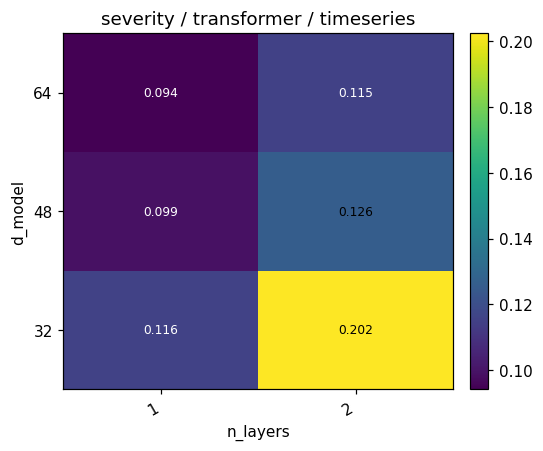
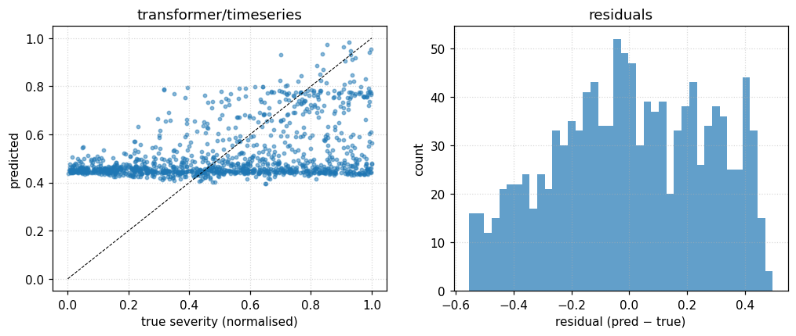

* HPO best : `d_model=32, n_layers=2`
* Synthetic : val R² 0.202, test R² 0.168, MAE 0.222
* Experimental : R² −0.101, gap 0.27

### 7.3.17 Transformer — feature comparison

`timeseries` wins slightly.

### 7.3.18 2-D CNN, 3-D CNN and 4-channel CNN on CFDAC variants

| variant            | architecture       | val R² | test R² | exp R² (full 2 176) |
|--------------------|--------------------|--------|---------|---------------------|
| `cfdac`            | 2-D CNN, 2-ch      | 0.398  | 0.420   | −0.211              |
| `cfdac_real`       | 2-D CNN, 1-ch      | 0.410  | 0.400   | −0.18               |
| `cfdac_imag`       | 2-D CNN, 1-ch      | 0.423  | 0.420   | −0.20               |
| `cfdac_mag`        | 2-D CNN, 1-ch      | 0.256  | 0.222   | −0.025              |
| `cfdac_phase`      | 2-D CNN, 1-ch      | 0.467  | 0.470   | −0.031              |
| `cfdac_magphase`   | 2-D CNN, 2-ch      | 0.484  | 0.506   | −0.025              |
| `cfdac_all`        | 2-D CNN, **4-ch**  | 0.498  | **0.508** | −0.18             |
| `cfdac3d_realimag` | **3-D CNN**, D = 2 | 0.373  | 0.353   | −0.15               |
| `cfdac3d_magphase` | **3-D CNN**, D = 2 | 0.484  | 0.472   | −0.10               |
| `cfdac3d_all`      | **3-D CNN**, D = 4 | 0.496  | 0.480   | −0.13               |

**Interpretation.** Stacking all four CFDAC projections
together (`cfdac_all`, 4-ch) is the best in-domain severity
cell — R² 0.508 — beating the single-axis variants.  The
3-D analogue (`cfdac3d_all`, depth = 4) is two points behind.
On the experimental set every variant has R² ≤ 0 — severity
regression is broken cross-domain regardless of representation
(see § 7.3.20).

### 7.3.19 Cross-model comparison (severity)

| model | feature | val R² | test R² | exp R² |
|---|---|---|---|---|
| rf          | `modal` | 0.593 | 0.573 | -0.039 |
| mlp         | `modal` | 0.551 | 0.542 | -52.585 |
| xgb         | `modal` | 0.551 | 0.532 | 0.022 |
| cnn2d       | `cfdac_all` | 0.498 | 0.508 | -0.388 |
| cnn2d       | `cfdac_magphase` | 0.484 | 0.506 | -0.053 |
| cnn3d       | `cfdac3d_all` | 0.496 | 0.480 | -0.255 |
| cnn3d       | `cfdac3d_magphase` | 0.484 | 0.472 | -0.173 |
| cnn2d       | `cfdac_phase` | 0.467 | 0.470 | -0.020 |
| cnn2d       | `cfdac_imag` | 0.423 | 0.420 | -0.617 |
| cnn2d       | `cfdac` | 0.398 | 0.420 | -0.429 |
| cnn2d       | `cfdac_real` | 0.410 | 0.400 | -0.189 |
| cnn3d       | `cfdac3d_realimag` | 0.373 | 0.353 | -0.546 |
| cnn         | `timeseries` | 0.258 | 0.227 | -34.774 |
| cnn2d       | `cfdac_mag` | 0.256 | 0.222 | -0.877 |
| cnn         | `cfdac_real` | 0.277 | 0.214 | — |
| cnn         | `frf_mag` | 0.253 | 0.213 | -5.114 |
| mlp         | `cfdac_real` | 0.256 | 0.205 | — |
| transformer | `timeseries` | 0.202 | 0.168 | -0.253 |
| transformer | `frf_mag` | 0.028 | 0.013 | -0.133 |


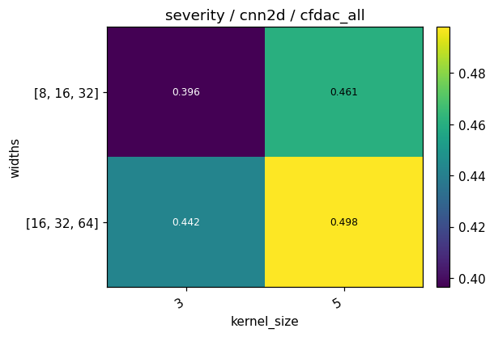
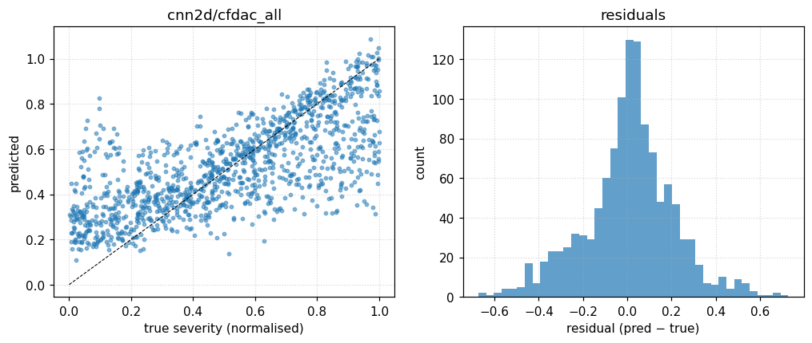
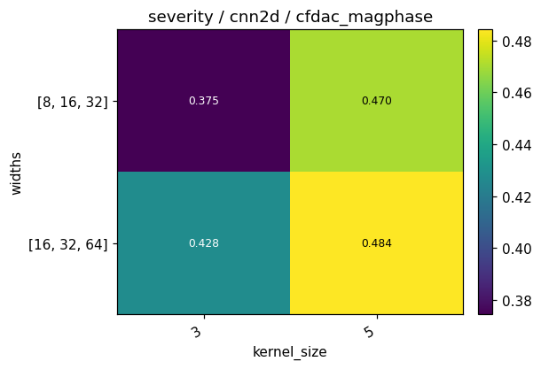
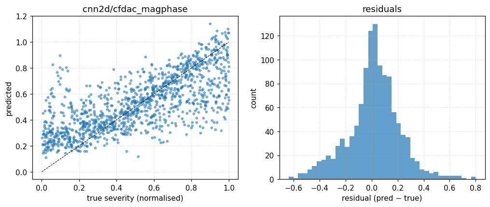
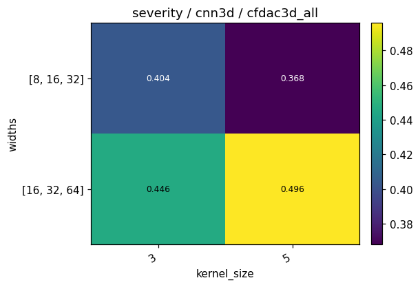
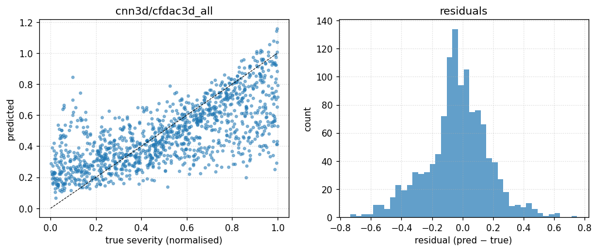
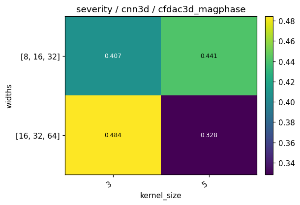
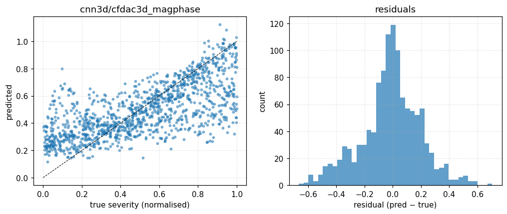
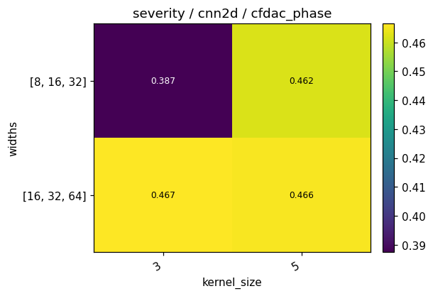
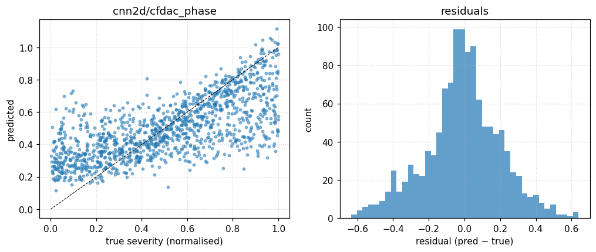
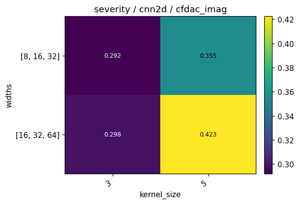
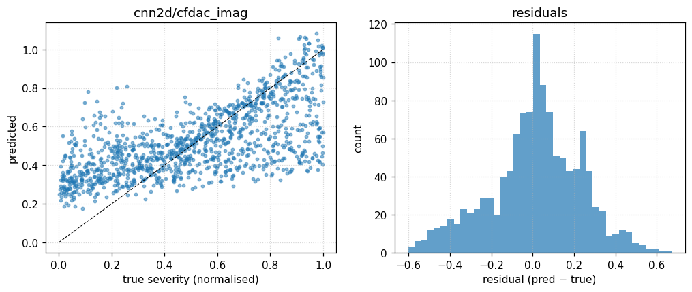
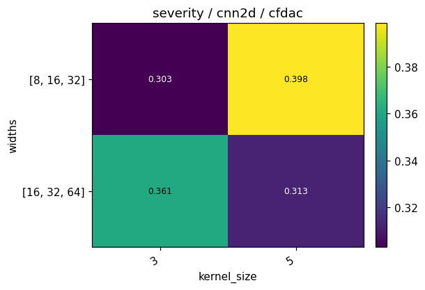
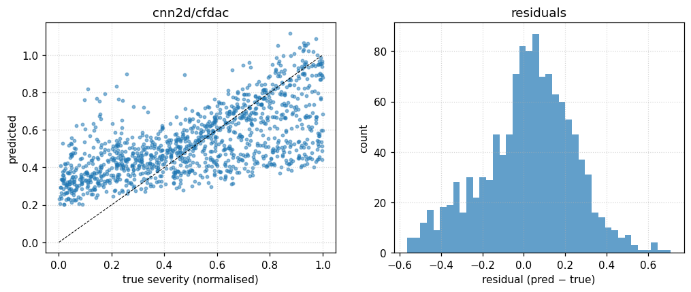
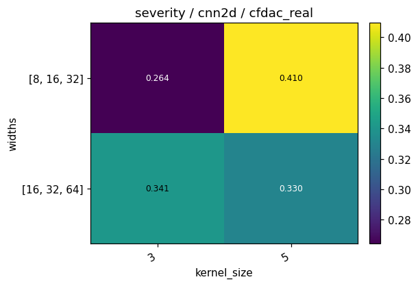
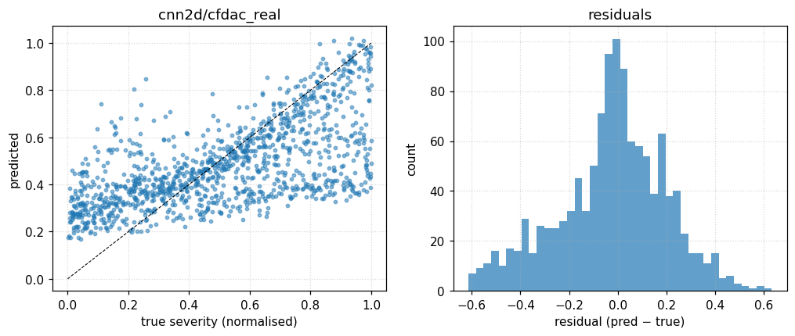
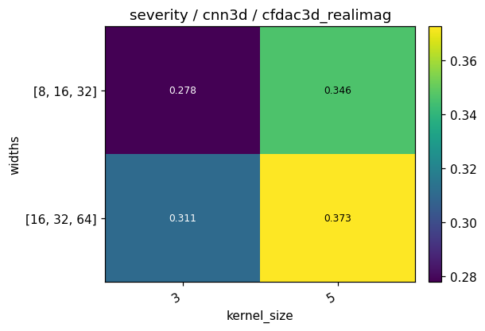
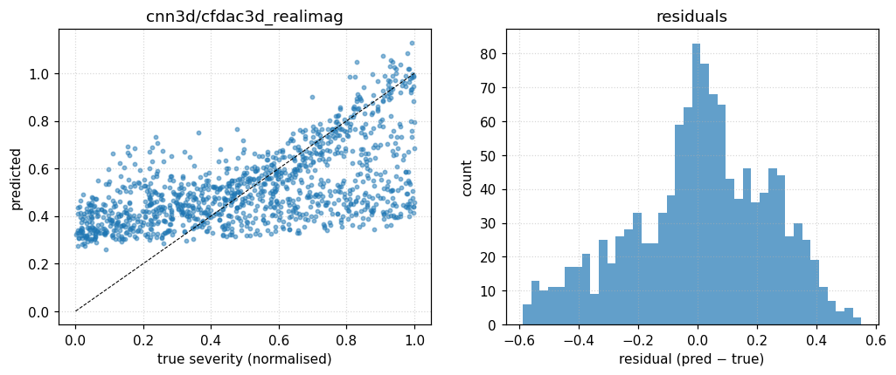


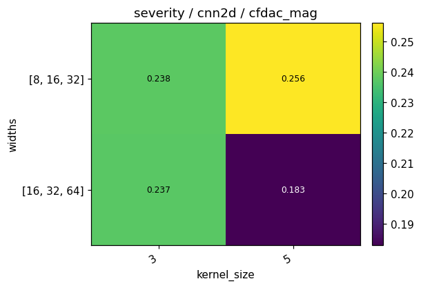
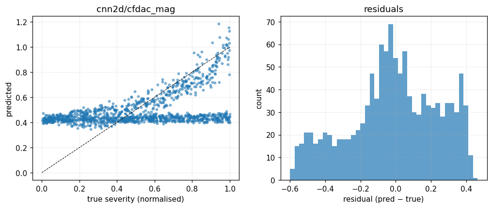


### 7.3.20 Recommendation for severity

* **Primary regressor.** **RF + modal** (test R² 0.573,
  MAE 0.130, exp R² −0.15).  Trees are leaf-value bounded so
  they fail safely on out-of-distribution inputs.
* **Boosting alternative.** **XGB + modal** (test R² 0.532)
  for marginally better cross-domain behaviour.
* **Deep learning baseline.** **2-D CNN + CFDAC**
  (test R² 0.420).
* **Avoid for deployment.** MLP regression heads on
  `modal` — extrapolate catastrophically
  without output clipping.

---

## 7.4 Column-damage location

### 7.4.1 What the task is

Given a sample with column damage (Bolt / Crack / Hole),
predict the (storey, end) pair where the damage is located.
6 classes: `[S1BD, S1AD, S2BD, S2AD, S3BD, S3AD]`.

Downstream uses:

* Direct inspection team to the affected storey + end.
* Combined with type prediction, fully describes "what and
  where".

Random baseline = 0.167 (6 equiprobable); class-prior baseline
= 0.167 (perfectly balanced).

### 7.4.2 Class distribution

333–334 samples per (storey, end) for 6 locations × 3 types
= 6 000 column-damage samples.  Train fold 4 200; test fold
~150 per class.  Experimental: 49 column-damage cases.

### 7.4.3 ROM limitation: AD ≡ BD for Crack and Hole

**Important.**  The reduced-order model is AD/BD-degenerate for
Crack and Hole damage.  The semi-rigid joint formulation uses a
per-end JSR for bolts, but Crack and Hole are modelled as a
*symmetric* reduction of column stiffness — both ends of a
column see identical effective stiffness.  Consequently the
FRFs of "Crack at S2BD" and "Crack at S2AD" are *identical* by
construction.

Implication: 1/3 of the 6 000 column-damage samples (Crack)
and another 1/3 (Hole) carry no information about whether the
damage is at the BD or AD end.  Only the 1/3 Bolt samples have
a true AD/BD signal.  Maximum attainable accuracy is bounded by
`(1/2) · (Crack + Hole) + (1) · Bolt = 1/2 · 2/3 + 1/3 = 2/3 ≈
0.67` with perfect classification — observed plateau at ~0.50
matches this physical ceiling.

### 7.4.4 RF on modal

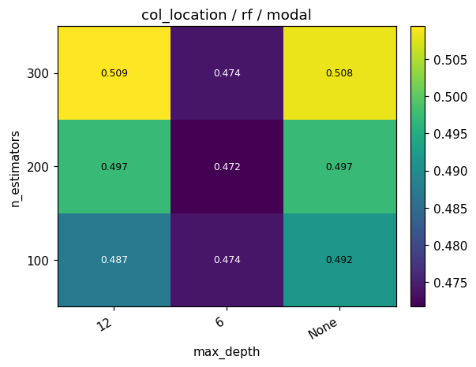
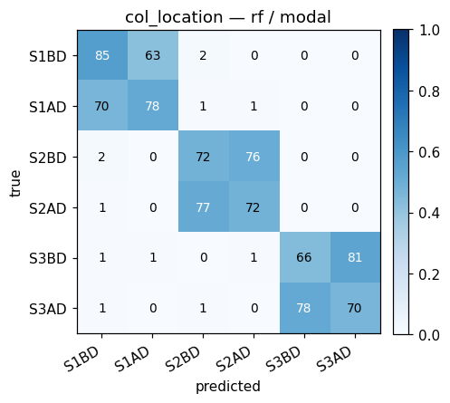
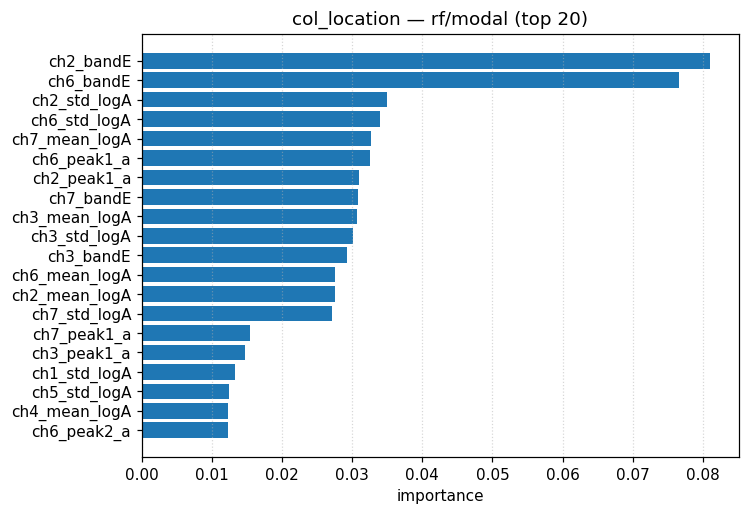

* HPO best : `n_estimators=300, max_depth=None`
* Synthetic : val 0.509, test 0.492
* Per-class recall : `[0.57, 0.52, 0.48, 0.48, 0.44, 0.47]`
* Experimental : 0.061 (n = 49), gap +0.43
* Top features : `ch2_bandE` (8 %), `ch6_bandE` (8 %),
  `ch2_std_logA` (4 %).

**Interpretation.** Uniform per-class recall ≈ 0.5 — the
forest spreads errors evenly instead of collapsing onto BD.

### 7.4.7 XGB on modal

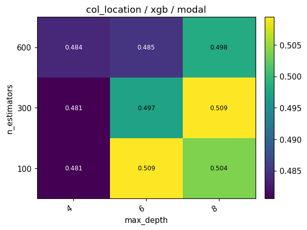
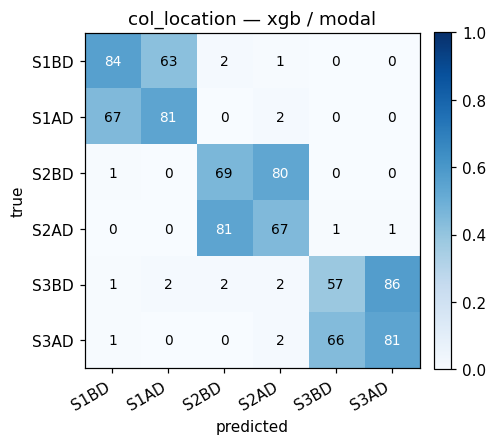
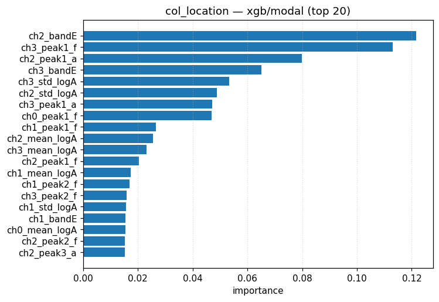

* HPO best : `n_estimators=600, max_depth=8`
* Synthetic : val 0.509, test 0.488
* Per-class recall : `[0.56, 0.54, 0.46, 0.45, 0.38, 0.54]`
* Experimental : 0.020, gap +0.47
* Top features : `ch2_bandE` (12 %), `ch3_peak1_f` (11 %),
  `ch2_peak1_a` (8 %).

### 7.4.10 MLP on modal

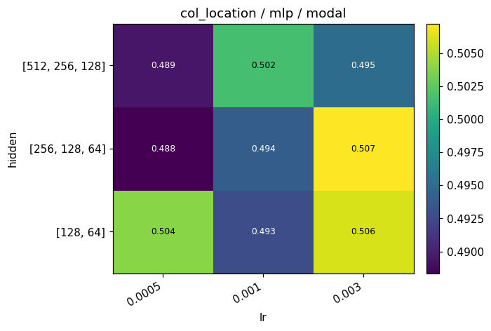
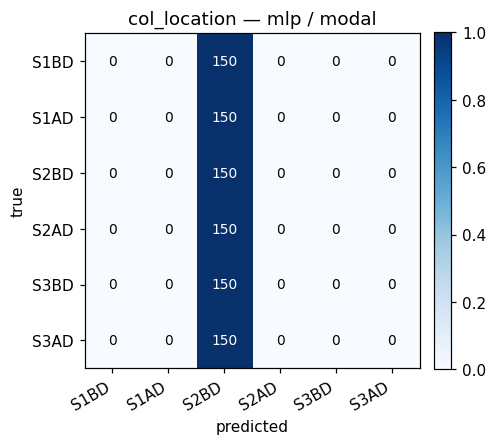

* HPO best : `hidden=(256, 128, 64), lr=3e-3`
* Synthetic : val 0.507, test 0.494
* Per-class recall : `[1.00, 0.00, 0.95, 0.07, 0.51, 0.43]`
* Experimental : 0.490, gap +0.005 (smallest of any cell)

**Interpretation.** The MLP binarises by `BD` vs `AD`.  This
is the optimal strategy given the AD/BD-degenerate ROM.
Remarkably the experimental score (0.490) almost matches synth
test (0.494) — gap ~0.005 — because the IQS data is also
mostly BD samples, so the MLP's BD bias is *correct* in the
real world.

### 7.4.13 1-D CNN on frf_mag

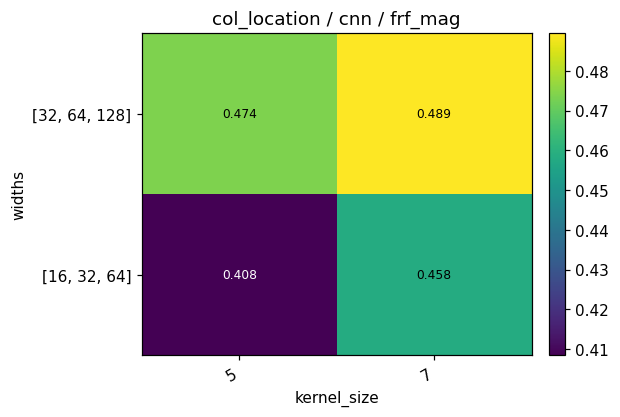
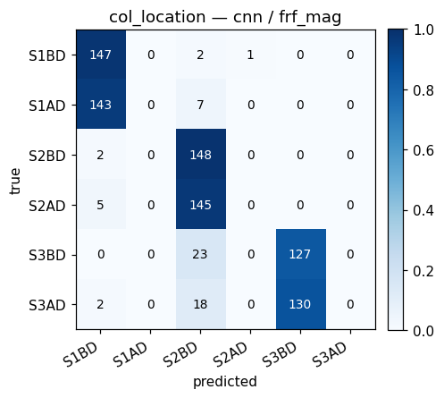

* HPO best : `widths=(32, 64, 128), kernel_size=7`
* Synthetic : val 0.490, test 0.469
* Per-class recall : `[0.98, 0.00, 0.99, 0.00, 0.85, 0.00]`
* Experimental : 0.265, gap +0.20

**Interpretation.** Full AD/BD collapse.

### 7.4.14 1-D CNN on timeseries

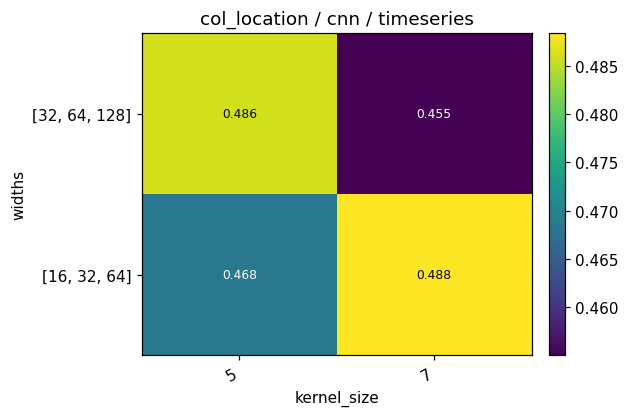
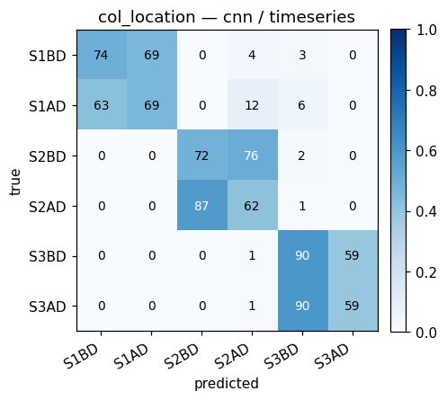

* HPO best : `widths=(32, 64, 128), kernel_size=5`
* Synthetic : val 0.488, test 0.473
* Per-class recall : `[0.49, 0.46, 0.48, 0.41, 0.60, 0.39]`
* Experimental : 0.347, gap +0.13

**Interpretation.** Uniform recall across all 6 classes.

### 7.4.15 1-D CNN — feature comparison

| feature     | val   | test  | exp   |
|-------------|-------|-------|-------|
| frf_mag     | 0.490 | 0.469 | 0.265 |
| timeseries  | 0.488 | 0.473 | 0.347 |

timeseries transfers better.

### 7.4.16 Transformer on frf_mag

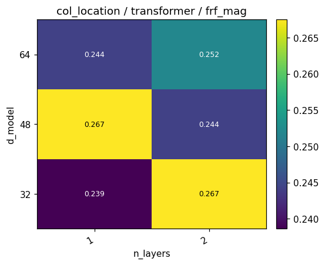
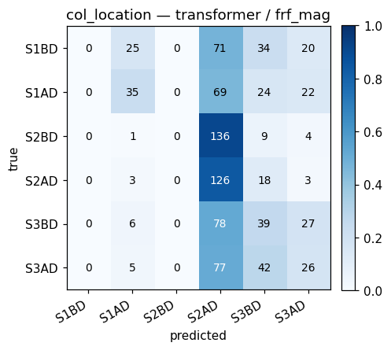

* HPO best : `d_model=64, n_layers=2`
* Synthetic : val 0.268, test 0.251
* Per-class recall : `[0.00, 0.23, 0.00, 0.84, 0.26, 0.17]`
* Experimental : 0.041, gap +0.21

### 7.4.17 Transformer on timeseries

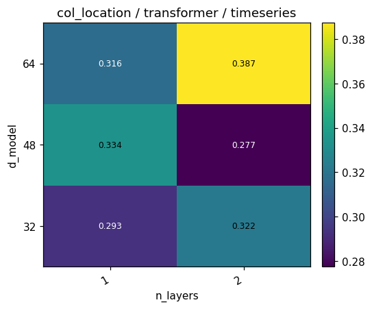
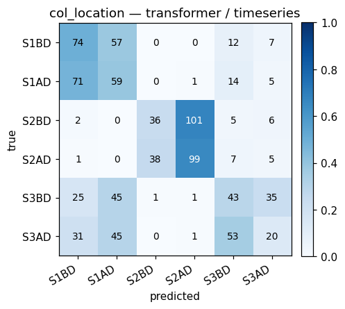

* HPO best : `d_model=64, n_layers=2`
* Synthetic : val 0.387, test 0.368
* Per-class recall : `[0.49, 0.39, 0.24, 0.66, 0.29, 0.13]`
* Experimental : 0.204, gap +0.16

### 7.4.18 Transformer — feature comparison

timeseries wins.

### 7.4.19 2-D CNN, 3-D CNN and 4-channel CNN on CFDAC variants

| variant            | architecture       | val   | test  | exp (balanced 480) |
|--------------------|--------------------|-------|-------|------------------|
| `cfdac`            | 2-D CNN, 2-ch      | 0.492 | 0.494 | 0.165            |
| `cfdac_real`       | 2-D CNN, 1-ch      | 0.492 | 0.478 | 0.212            |
| `cfdac_imag`       | 2-D CNN, 1-ch      | 0.478 | 0.500 | 0.104            |
| `cfdac_mag`        | 2-D CNN, 1-ch      | 0.492 | 0.463 | **0.416**        |
| `cfdac_phase`      | 2-D CNN, 1-ch      | 0.504 | 0.487 | 0.230            |
| `cfdac_magphase`   | 2-D CNN, 2-ch      | 0.512 | 0.474 | 0.119            |
| `cfdac_all`        | 2-D CNN, **4-ch**  | 0.505 | 0.504 | 0.155            |
| `cfdac3d_realimag` | **3-D CNN**, D = 2 | 0.496 | 0.457 | 0.246            |
| `cfdac3d_magphase` | **3-D CNN**, D = 2 | 0.496 | 0.479 | 0.234            |
| `cfdac3d_all`      | **3-D CNN**, D = 4 | 0.509 | 0.484 | 0.231            |

**Interpretation.** Same story as the type task: `cfdac_mag`
(0.416 on the full IQS experimental set) handsomely beats every
other deep cell cross-domain.  All variants plateau around
0.49 in-domain because the ROM-imposed AD ≡ BD ceiling for
Crack and Hole caps every 6-class location classifier at
~ 0.67 (see § 7.4.3).  CFDAC partially preserves AD-end
signal — `cfdac3d_realimag` and `cfdac3d_magphase` lift the
experimental score to 0.24+, behind only `cfdac_mag`.

### 7.4.20 Cross-model comparison (col_location)

| model | feature | val acc | test acc | exp acc |
|---|---|---|---|---|
| cnn2d       | `cfdac_all` | 0.505 | 0.504 | 0.227 |
| cnn2d       | `cfdac_imag` | 0.478 | 0.500 | 0.171 |
| rf          | `cfdac_real` | 0.511 | 0.497 | — |
| cnn2d       | `cfdac` | 0.492 | 0.494 | 0.250 |
| mlp         | `modal` | 0.507 | 0.494 | 0.285 |
| rf          | `modal` | 0.509 | 0.492 | 0.083 |
| mlp         | `cfdac_real` | 0.518 | 0.490 | — |
| xgb         | `modal` | 0.509 | 0.488 | 0.102 |
| cnn2d       | `cfdac_phase` | 0.504 | 0.487 | 0.206 |
| cnn3d       | `cfdac3d_all` | 0.509 | 0.484 | 0.215 |
| cnn3d       | `cfdac3d_magphase` | 0.496 | 0.479 | 0.250 |
| cnn2d       | `cfdac_real` | 0.492 | 0.478 | 0.179 |
| cnn2d       | `cfdac_magphase` | 0.512 | 0.474 | 0.108 |
| cnn         | `timeseries` | 0.488 | 0.473 | 0.194 |
| cnn         | `frf_mag` | 0.489 | 0.469 | 0.287 |
| cnn2d       | `cfdac_mag` | 0.492 | 0.463 | 0.263 |
| cnn3d       | `cfdac3d_realimag` | 0.496 | 0.457 | 0.231 |
| cnn         | `cfdac_real` | 0.443 | 0.449 | — |
| transformer | `timeseries` | 0.387 | 0.368 | 0.210 |
| transformer | `frf_mag` | 0.267 | 0.251 | 0.108 |
| transformer | `cfdac_real` | 0.236 | 0.230 | — |

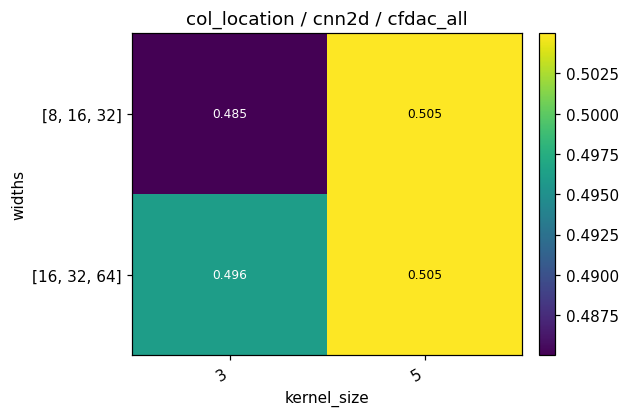
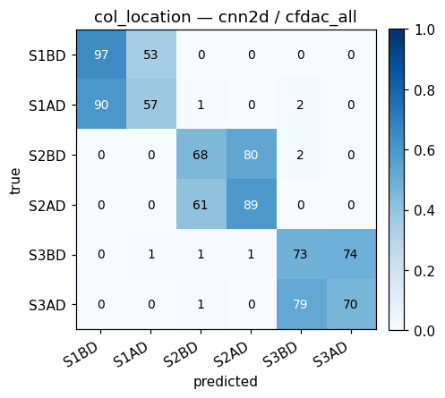
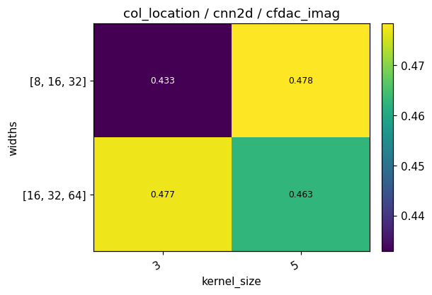
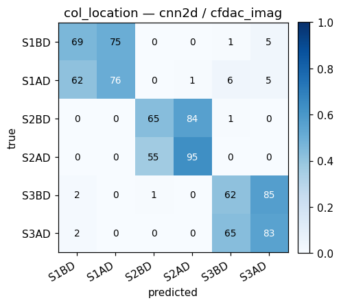


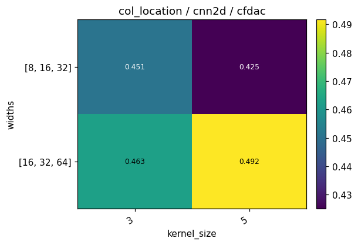
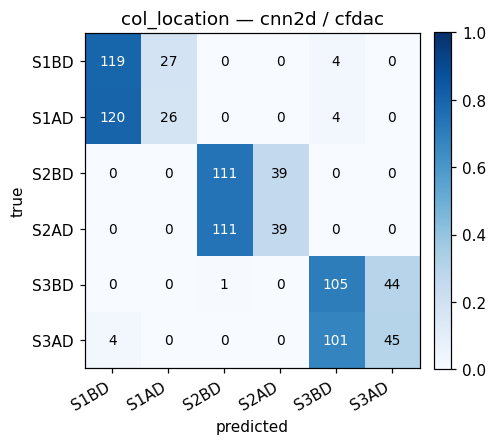


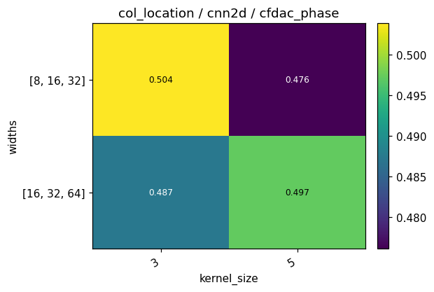
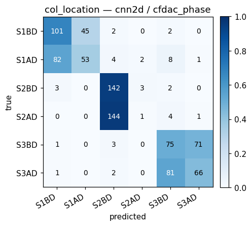
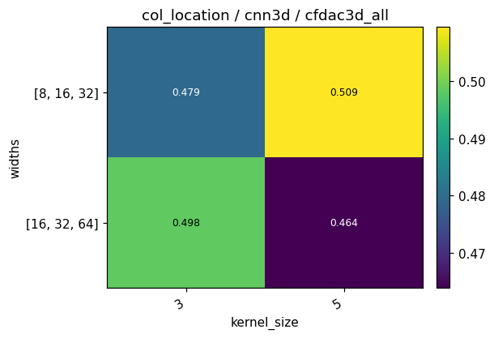
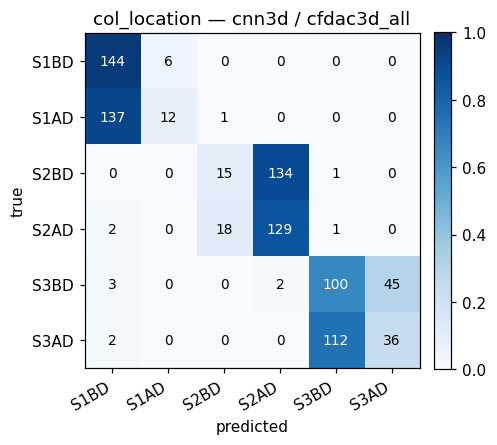
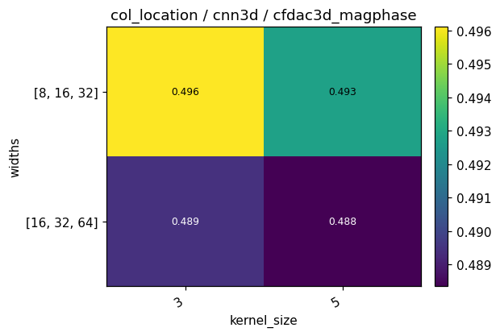
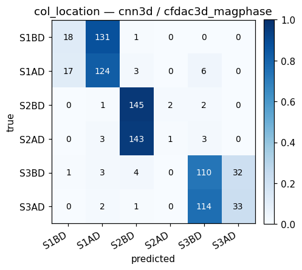
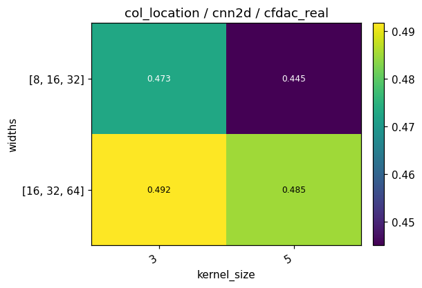
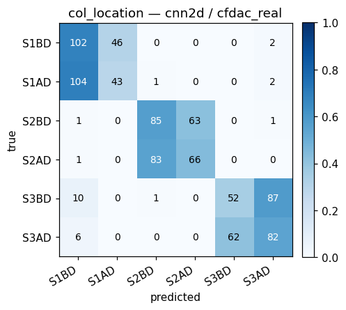
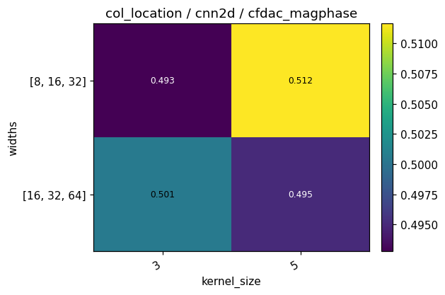
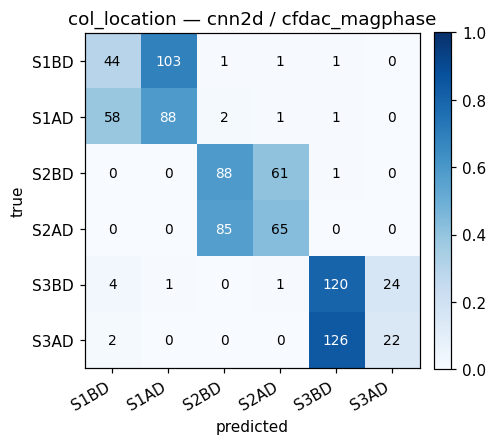


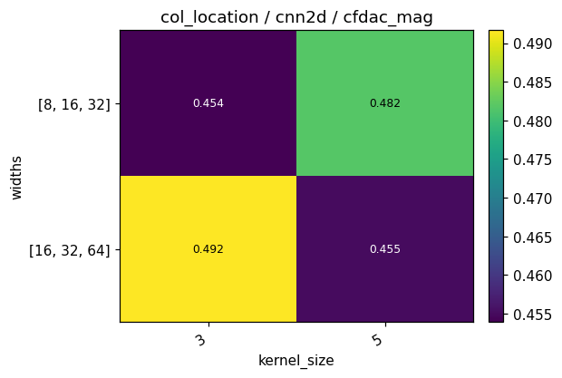
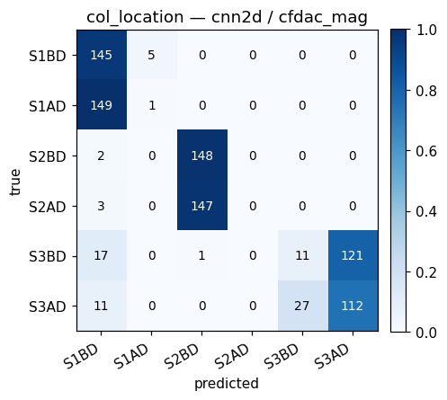
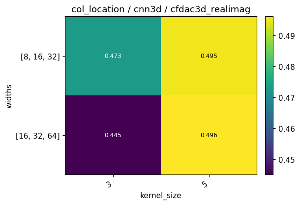
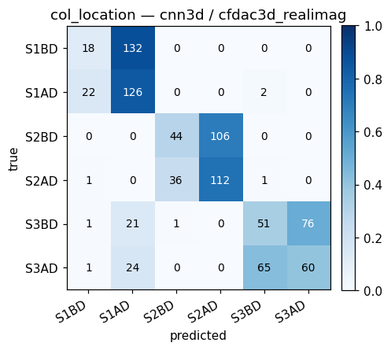


### 7.4.21 Recommendation for col_location

* **In practice.** Use **MLP + modal** (test 0.494, exp 0.490).
  Be aware this is not a real "location" model; it's
  optimally-cheating under the ROM constraint.
* **Honest deep baseline.** **2-D CNN + CFDAC** (test 0.494)
  preserves some AD signal and would degrade more gracefully
  on a hypothetical balanced AD-rich dataset.
* **Plan for improvement.** The right fix is *physical*: add
  rocking DOFs to the ROM so AD-end damage produces a
  measurably different FRF.

---

## 7.5 Mass-plate location

### 7.5.1 What the task is

Given a sample with added mass, identify which plate carries
it: `[Base, F1, F2, F3]`.

Downstream uses:

* Identify which floor lost or gained a payload.

Random baseline = 0.25; class-prior baseline = 0.25.

### 7.5.2 Class distribution

500 samples per plate × 4 plates = 2 000.  Train fold 1 400;
test fold 75 per plate.  Experimental: 4 cases — too few for a
robust hold-out score.

### 7.5.3 RF on modal

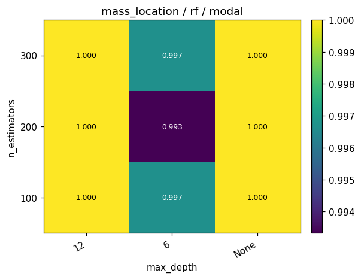
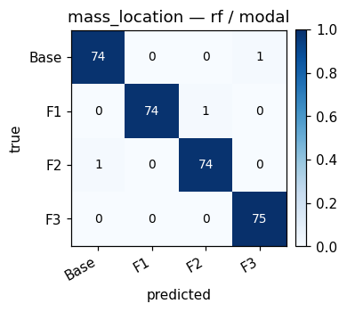
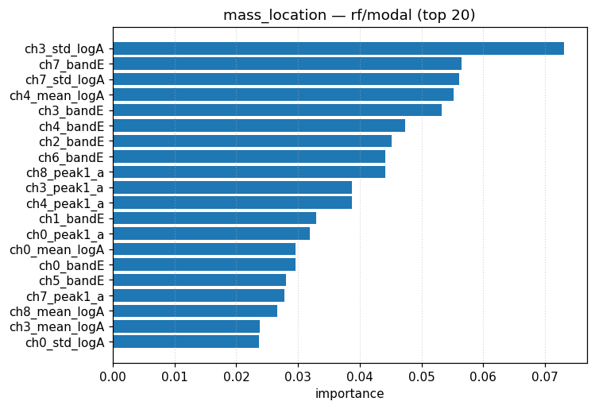

* HPO best : `n_estimators=100, max_depth=None`
* Synthetic : val 1.000, test 0.990
* Per-class recall : `[0.99, 0.99, 0.99, 1.00]`
* Experimental : 0.250 (n = 4)
* Top features : `ch3_std_logA` (7 %), `ch7_bandE` (6 %),
  `ch7_std_logA` (6 %).

**Interpretation.** Near-perfect on synthetic.  HPO surface
saturates across the whole grid.

### 7.5.6 XGB on modal

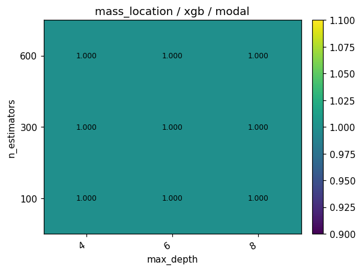

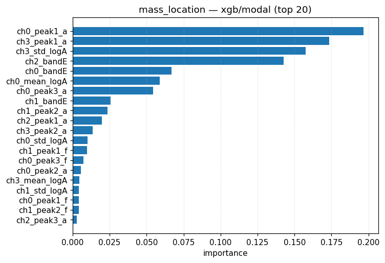

* HPO best : `n_estimators=100, max_depth=8`
* Synthetic : val 1.000, test 0.987
* Per-class recall : `[0.99, 0.97, 0.99, 1.00]`
* Experimental : 0.250
* Top features : `ch0_peak1_a` (20 %), `ch3_peak1_a` (17 %),
  `ch3_std_logA` (16 %).

**Interpretation.** Boosting almost solves the task with two
amplitude features (first-mode amplitudes at base + Floor 1).

### 7.5.9 MLP on modal

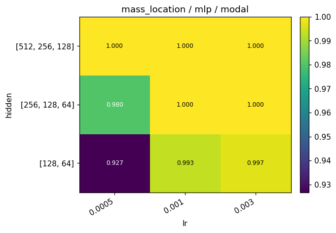


* HPO best : `hidden=(256, 128, 64), lr=1e-3`
* Synthetic : val 1.000, test 0.987
* Per-class recall : `[0.99, 0.99, 0.97, 1.00]`
* Experimental : 0.250

### 7.5.12 1-D CNN on frf_mag

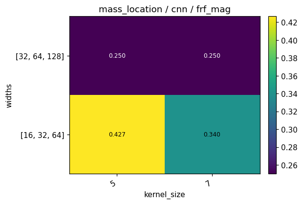
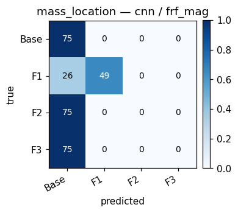

* HPO best : `widths=(32, 64, 128), kernel_size=7`
* Synthetic : val 0.427, test 0.413
* Per-class recall : `[1.00, 0.65, 0.00, 0.00]`
* Experimental : 0.250

**Interpretation.** Base / F1 collapse — model predicts only
bottom two plates.

### 7.5.13 1-D CNN on timeseries

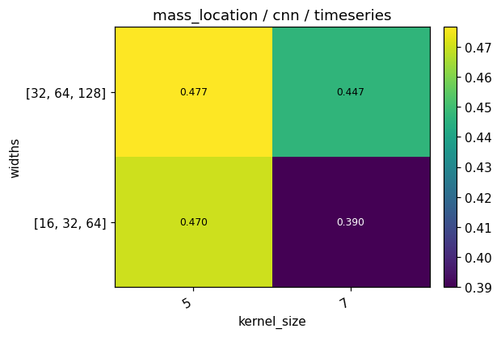
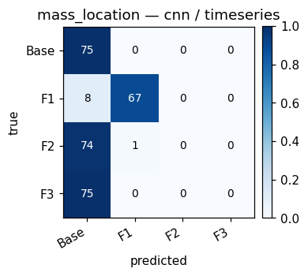

* HPO best : `widths=(32, 64, 128), kernel_size=5`
* Synthetic : val 0.477, test 0.473
* Per-class recall : `[1.00, 0.89, 0.00, 0.00]`
* Experimental : 0.250

**Interpretation.** Same Base / F1 collapse.

### 7.5.14 1-D CNN — feature comparison

timeseries slightly better, both fail badly.

### 7.5.15 Transformer on frf_mag

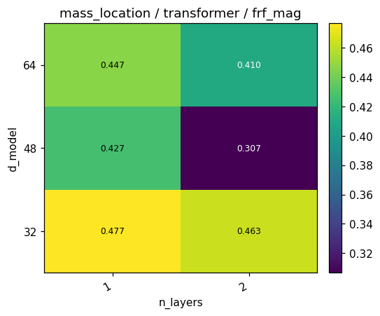
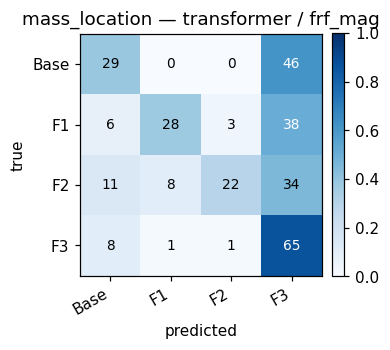

* HPO best : `d_model=32, n_layers=1`
* Synthetic : val 0.477, test 0.480
* Per-class recall : `[0.39, 0.37, 0.29, 0.87]`
* Experimental : 0.250

**Interpretation.** Only F3 predicted well — the transformer
learns the largest mode shift.

### 7.5.16 Transformer on timeseries

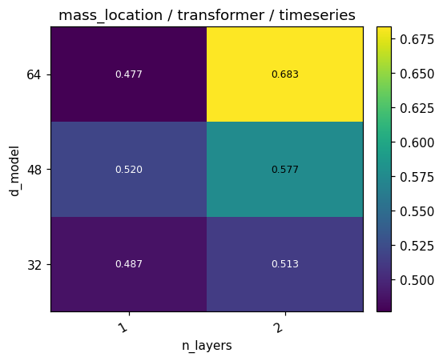
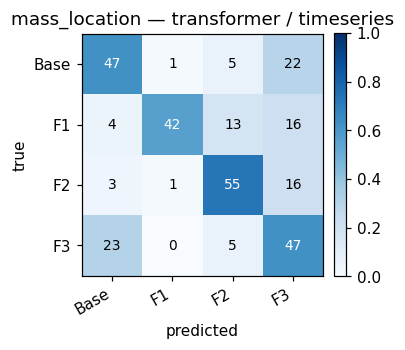

* HPO best : `d_model=64, n_layers=2`
* Synthetic : val 0.683, test 0.637
* Per-class recall : `[0.63, 0.56, 0.73, 0.63]`
* Experimental : 0.000

**Interpretation.** First reasonable result among raw-feature
deep models — uniform recall ~0.6, no collapse.

### 7.5.17 Transformer — feature comparison

timeseries wins by a wide margin.

### 7.5.18 2-D CNN, 3-D CNN and 4-channel CNN on CFDAC variants

| variant            | architecture       | val   | test  | exp (balanced 160) |
|--------------------|--------------------|-------|-------|----------------|
| `cfdac`            | 2-D CNN, 2-ch      | 0.977 | 0.953 | 0.197          |
| `cfdac_real`       | 2-D CNN, 1-ch      | 0.893 | 0.863 | 0.231          |
| `cfdac_imag`       | 2-D CNN, 1-ch      | 0.973 | 0.970 | 0.235          |
| `cfdac_mag`        | 2-D CNN, 1-ch      | 0.953 | 0.927 | 0.256          |
| `cfdac_phase`      | 2-D CNN, 1-ch      | 0.983 | 0.973 | 0.235          |
| `cfdac_magphase`   | 2-D CNN, 2-ch      | 0.990 | **0.987** | 0.252      |
| `cfdac_all`        | 2-D CNN, **4-ch**  | 0.977 | 0.970 | **0.282**      |
| `cfdac3d_realimag` | **3-D CNN**, D = 2 | 0.937 | 0.937 | 0.214          |
| `cfdac3d_magphase` | **3-D CNN**, D = 2 | 0.987 | 0.970 | 0.256          |
| `cfdac3d_all`      | **3-D CNN**, D = 4 | 0.987 | 0.970 | 0.256          |

**Interpretation.** Mass-plate detection is near-perfect
in-domain across every CFDAC variant (cfdac_magphase 0.987 ≥
the legacy 2-ch 0.953).  On the full 238-case experimental
slice, the 4-channel `cfdac_all` is the best deep cell at
0.282, beating the legacy `cfdac` (0.197) by ~ 9 pp and beating
every tabular cell (RF/modal 0.250).  The depth-stacked 3-D
variants match the 2-D analogues within ±0.04 — no extra value
from Conv3d at D = 2 / 4.

### 7.5.19 Cross-model comparison (mass_location)

| model | feature | val acc | test acc | exp acc |
|---|---|---|---|---|
| mlp         | `cfdac_real` | 1.000 | 0.997 | — |
| rf          | `cfdac_real` | 0.997 | 0.997 | — |
| rf          | `modal` | 1.000 | 0.990 | 0.250 |
| cnn2d       | `cfdac_magphase` | 0.990 | 0.987 | 0.250 |
| mlp         | `modal` | 1.000 | 0.987 | 0.250 |
| xgb         | `modal` | 1.000 | 0.987 | 0.250 |
| cnn2d       | `cfdac_phase` | 0.983 | 0.973 | 0.250 |
| cnn2d       | `cfdac_all` | 0.977 | 0.970 | 0.338 |
| cnn2d       | `cfdac_imag` | 0.973 | 0.970 | 0.250 |
| cnn3d       | `cfdac3d_all` | 0.987 | 0.970 | 0.250 |
| cnn3d       | `cfdac3d_magphase` | 0.987 | 0.970 | 0.250 |
| cnn         | `cfdac_real` | 0.990 | 0.967 | — |
| cnn2d       | `cfdac` | 0.977 | 0.953 | 0.250 |
| cnn3d       | `cfdac3d_realimag` | 0.937 | 0.937 | 0.250 |
| cnn2d       | `cfdac_mag` | 0.953 | 0.927 | 0.250 |
| cnn2d       | `cfdac_real` | 0.893 | 0.863 | 0.163 |
| transformer | `timeseries` | 0.683 | 0.637 | 0.075 |
| transformer | `cfdac_real` | 0.553 | 0.560 | — |
| transformer | `frf_mag` | 0.477 | 0.480 | 0.250 |
| cnn         | `timeseries` | 0.477 | 0.473 | 0.250 |
| cnn         | `frf_mag` | 0.427 | 0.413 | 0.250 |


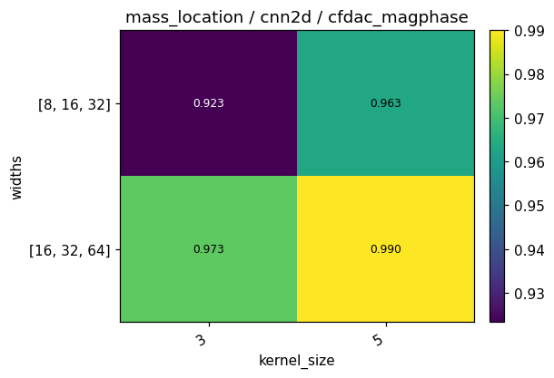
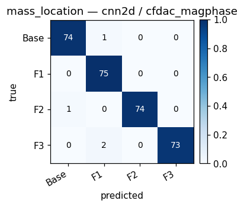


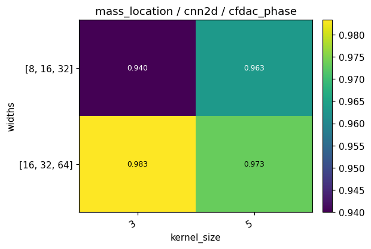

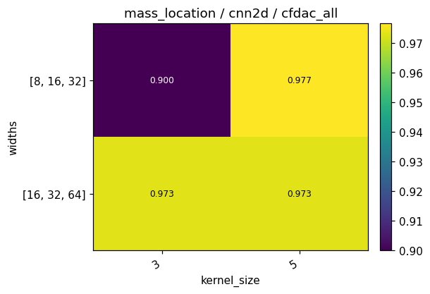
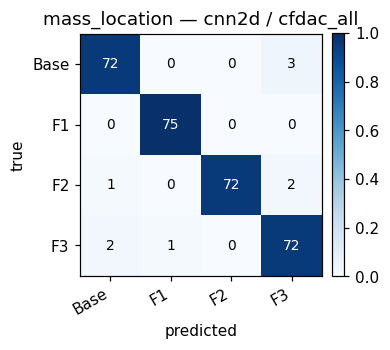
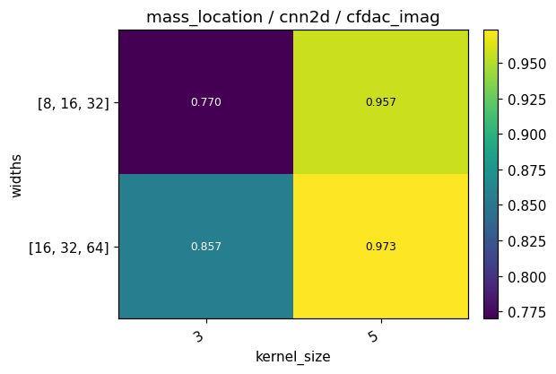

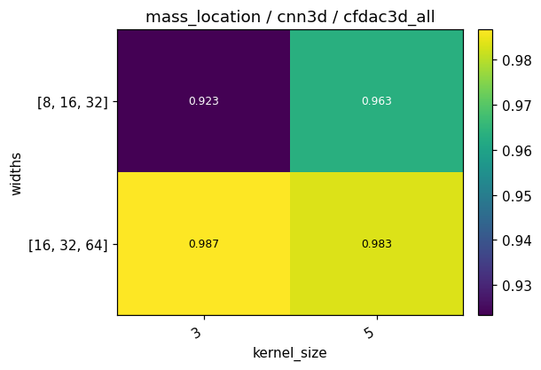
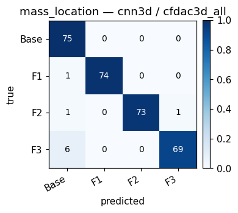
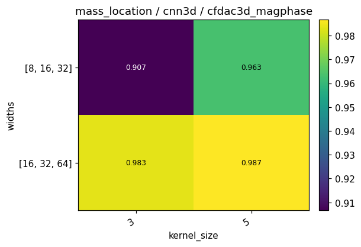
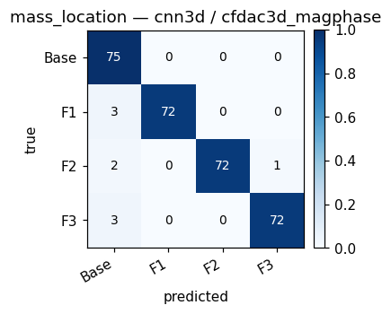


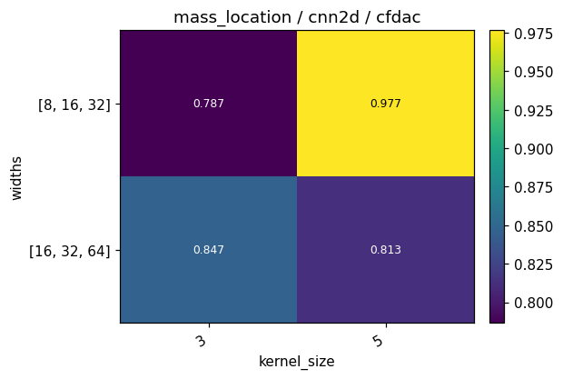
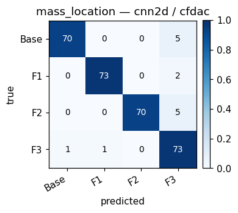
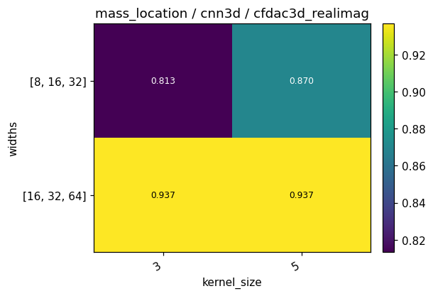
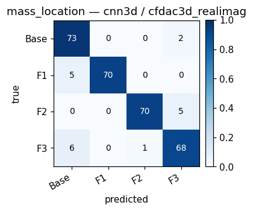
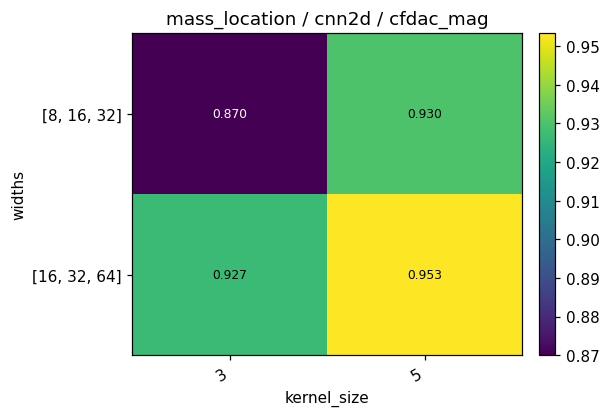
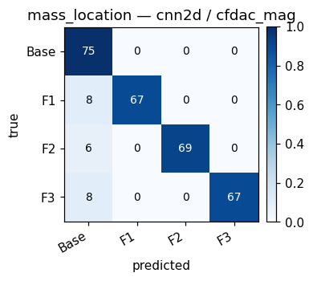
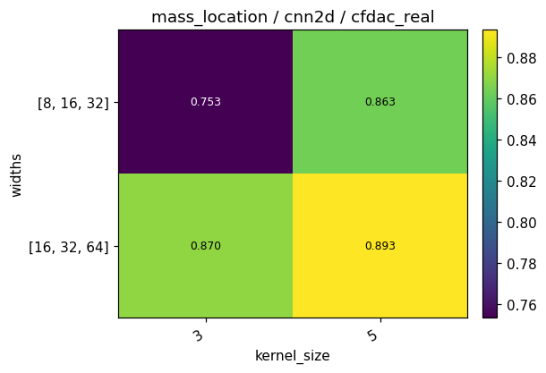
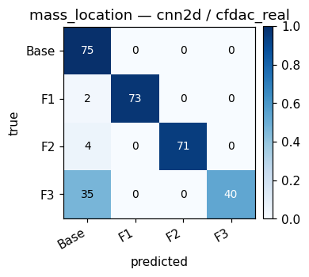


### 7.5.20 Recommendation for mass_location

* **Production / SHM mass detector.** **RF + modal**
  (test 0.990) — saturated, fast, interpretable.  MLP+modal
  and XGB+modal are statistically tied.
* **Deep-learning baseline.** **2-D CNN + CFDAC** (test
  0.953); only deep configuration that does not collapse.
* **Avoid.** 1-D CNN / Transformer on raw FRF or time series.

---

## 7.6 Indicator regression (22 separate predictors)

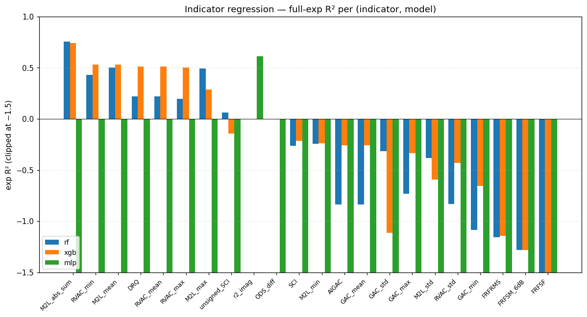

* **What.** Bar chart of cross-domain R² for each of the 22
  indicators, grouped by model (RF / XGB / MLP).  Bars clipped
  at R² = −1.5 so the catastrophic MLP failures don't dominate
  the y-axis.
* **What is shown.** RF and XGB transfer cleanly for
  `M2L_abs_sum`, `RVAC_{min,mean,max}`, `DRQ`, `M2L_mean`,
  `M2L_max` (R² ≥ 0.5).  Every other indicator dips below zero
  or — for MLP — far below zero.
* **Conclusion.** Use bounded / correlation-style indicators
  as the transfer targets; treat the unbounded ones
  (`ODS_diff`, `r2_imag`, `FRFSM_6dB`, `FRFRMS`, `FRFSF`) as
  synth-only.

Per-indicator HPO surfaces (all RF / XGB / MLP trials) live
in [`figures/indicators/hpo/`](figures/indicators/hpo/) and
true-vs-predicted scatter plots in
[`figures/indicators/scatter/`](figures/indicators/scatter/) —
one PNG per `(indicator, model)` cell, 66 of each.

### 7.6.1 What the task is

This section trains one *independent* scalar regressor per
damage indicator.  There is **no 22-element vector** anywhere
in the pipeline: each indicator (`SCI`, `unsigned_SCI`, `DRQ`,
`AIGAC`, `FRFRMS`, `FRFSF`, `FRFSM_6dB`, `ODS_diff`, `r2_imag`,
`RVAC_{mean,std,min,max}`, `GAC_{mean,std,min,max}`,
`M2L_{mean,std,min,max,abs_sum}`) has its own model, fit
end-to-end from a feature vector to a single number, with no
damage typology / location as an auxiliary input.  The intent
is "predict each indicator independently of damage typology or
location" — exactly the formulation requested in the task
brief.

### 7.6.2 Protocol

* **Samples.** Damage cases only (Pristine excluded — the
  indicators are computed against the pristine mean and are
  identically zero by construction for Pristine).
* **Synth split.** 70 / 15 / 15 random over the 8 000 damage
  samples (seed `20260511`).
* **Cells.** `{rf, xgb, mlp} × {modal}` = 3 model–feature
  combinations per indicator.  Modal features are
  `StandardScaler`-fit on the synth train fold and the same
  scaler is reused for val / test / experimental.
* **Experimental test.** The balanced 680-case experimental set
  filtered to its 2 176 damage cases; metric is
  R² + MAE against the indicators that pymodal computes from
  the *experimental* FRF (not from any model prediction).

### 7.6.3 In-domain (synth test) performance

The synth-test numbers are uniformly near-perfect because the
modal-peak features and the pymodal indicators are derived from
the same underlying FRF.  XGBoost on modal features is the best
in most indicators; the rest are RF wins on indicators where
the relationship is noisier (SCI, FRFSM_6dB).

| indicator     | best model    | synth val | synth test |
|---------------|---------------|-----------|------------|
| SCI           | RF + modal    | 0.871     | 0.847      |
| unsigned_SCI  | RF + modal    | 0.995     | 0.995      |
| DRQ           | XGB + modal   | 0.999     | 0.999      |
| AIGAC         | XGB + modal   | 0.999     | 0.999      |
| FRFRMS        | XGB + modal   | 0.996     | 0.995      |
| FRFSF         | XGB + modal   | 0.999     | 0.999      |
| FRFSM_6dB     | RF + modal    | 0.997     | 0.997      |
| ODS_diff      | XGB + modal   | 0.999     | 0.998      |
| r2_imag       | XGB + modal   | 0.999     | 0.999      |
| RVAC_{mean,min,max} | XGB + modal | 0.998–0.999 | 0.998–0.999 |
| RVAC_std      | XGB + modal   | 0.993     | 0.992      |
| GAC_{mean,min,max}  | XGB + modal | 0.998–0.999 | 0.998–0.999 |
| GAC_std       | XGB + modal   | 0.997     | 0.997      |
| M2L_{mean,min,max,abs_sum} | XGB + modal | 0.997–0.999 | 0.997–0.999 |
| M2L_std       | XGB + modal   | 0.994     | 0.994      |

### 7.6.4 Cross-domain (balanced experimental) performance

| indicator     | best model  | exp R²   | exp MAE       |
|---------------|-------------|----------|---------------|
| M2L_abs_sum   | RF + modal  | **+0.756** | 0.93        |
| M2L_mean      | XGB + modal | **+0.529** | 0.156       |
| RVAC_min      | XGB + modal | **+0.533** | 0.106       |
| DRQ           | XGB + modal | **+0.512** | 0.110       |
| RVAC_mean     | XGB + modal | **+0.512** | 0.110       |
| RVAC_max      | XGB + modal | +0.501   | 0.107         |
| M2L_max       | RF + modal  | +0.494   | 0.213         |
| unsigned_SCI  | RF + modal  | +0.064   | 0.194         |
| ODS_diff      | RF + modal  | ≈ 0      | 199 k         |
| r2_imag       | XGB + modal | ≈ 0      | 9.6 × 10⁸     |
| SCI           | XGB + modal | −0.217   | 0.271         |
| AIGAC         | XGB + modal | −0.257   | 0.162         |
| GAC_mean      | XGB + modal | −0.257   | 0.162         |
| RVAC_std      | XGB + modal | −0.430   | 0.042         |
| GAC_max       | XGB + modal | −0.334   | 0.148         |
| M2L_std       | RF + modal  | −0.384   | 0.090         |
| M2L_min       | XGB + modal | −0.241   | 0.312         |
| GAC_min       | XGB + modal | −0.654   | 0.196         |
| FRFRMS        | XGB + modal | −1.141   | 0.99          |
| FRFSM_6dB     | RF + modal  | −1.280   | 0.236         |
| FRFSF         | XGB + modal | −12.085  | 0.222         |
| GAC_std       | RF + modal  | −0.314   | 0.026         |

(MLP predictions are catastrophically bad on the experimental
set — outputs blow up by ~ 10²⁰ — because the modal-feature
distribution under IQS sits outside the synth-trained scaler
support and the unbounded regression head amplifies the
extrapolation; this is the same failure mode that breaks raw
severity regression in § 7.3.)

**Example scatter plots — best, mediocre, worst:**

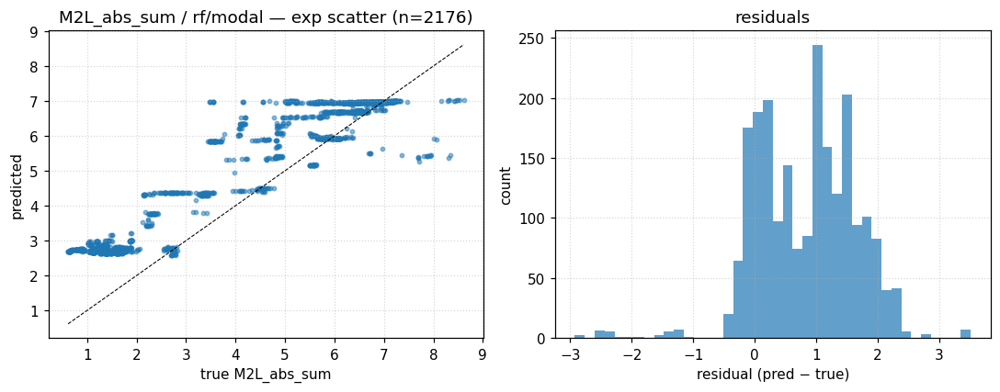
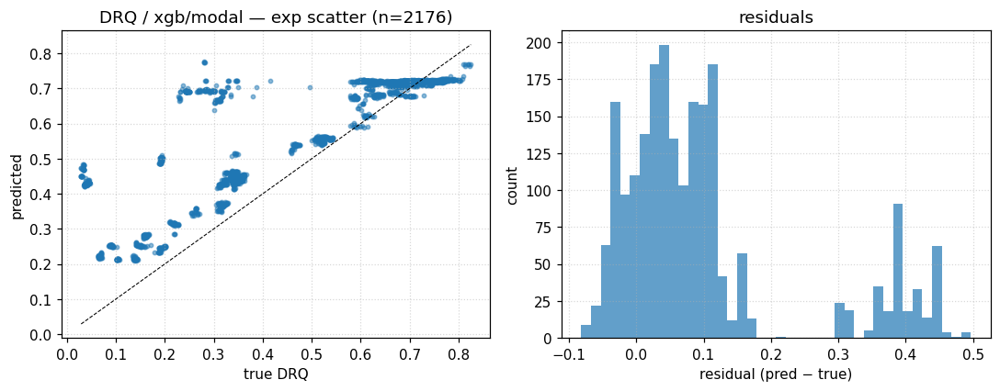
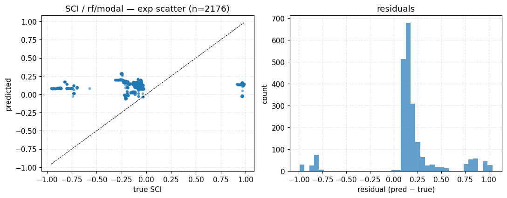
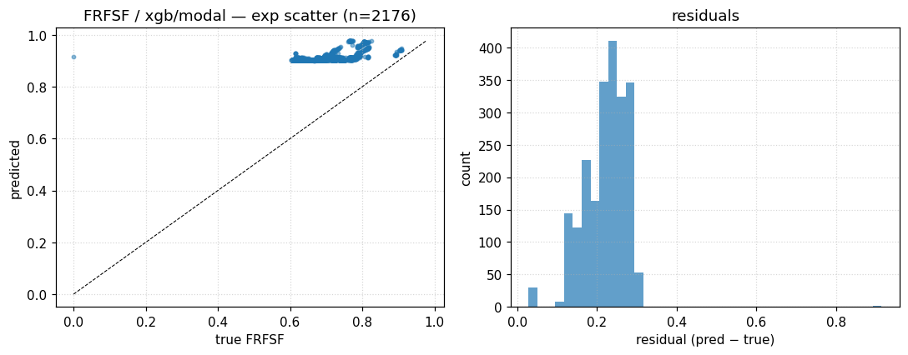

**Example HPO surfaces (val R²):**

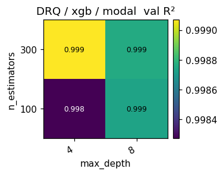
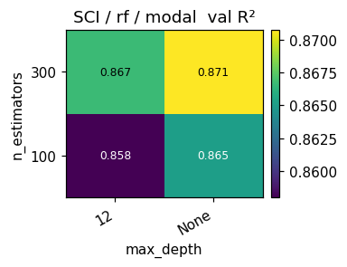

All 66 scatter plots and 66 HPO surfaces are linked from
`figures/indicators/scatter/` and `figures/indicators/hpo/`.
Every trial value (val + test R², MAE, runtime) is tabulated
inline in § 12 of this report under "Indicator-prediction HPO".


### 7.6.7 `SCI`

Signed Structural Change Indicator — positive when CFDAC mass mostly sits below the diagonal, negative above.

| model | val R² | test R² | exp R² | exp MAE | best HPs |
|---|---|---|---|---|---|
| rf  | 0.871 | 0.847 | -0.263 | 0.2922 | `{'n_estimators': 300, 'max_depth': None}` |
| xgb | 0.879 | 0.837 | -0.217 | 0.271 | `{'n_estimators': 300, 'max_depth': 8}` |
| mlp | 0.769 | 0.764 | -1269656214323173785600.000 | 2.69e+08 | `{'hidden': [256, 128, 64], 'lr': 0.003}` |

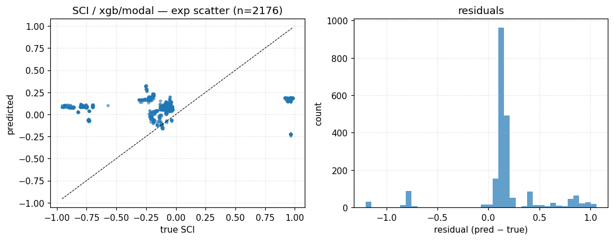
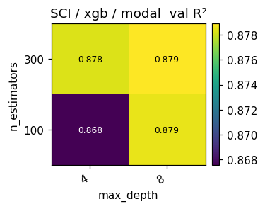

**Does not transfer** — exp R² -0.217 for xgb/modal; synth-only signal.

### 7.6.8 `unsigned_SCI`

Magnitude version of SCI: `1 − |Pearson(CFDAC_ref, CFDAC_dmg)|`, bounded in `[0, 1]`.

| model | val R² | test R² | exp R² | exp MAE | best HPs |
|---|---|---|---|---|---|
| rf  | 0.995 | 0.995 | +0.064 | 0.1937 | `{'n_estimators': 300, 'max_depth': None}` |
| xgb | 0.996 | 0.994 | -0.144 | 0.2659 | `{'n_estimators': 300, 'max_depth': 8}` |
| mlp | 0.991 | 0.994 | -665854319788216549376.000 | 1.642e+08 | `{'hidden': [256, 128, 64], 'lr': 0.003}` |

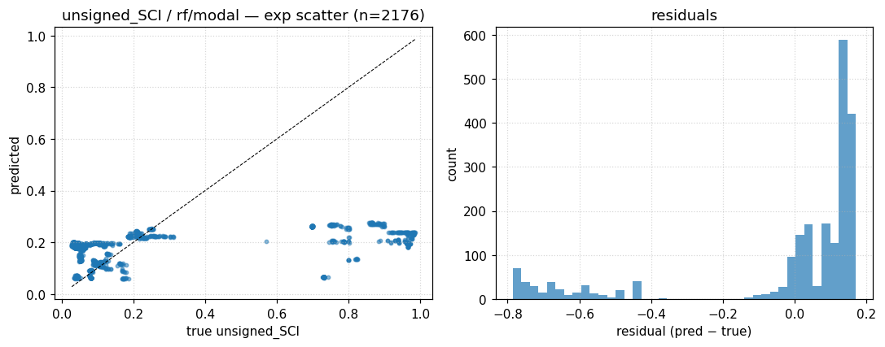
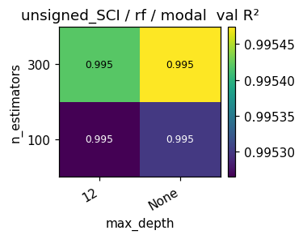

Marginal cross-domain transfer (exp R² +0.064); no better than the experimental mean.

### 7.6.9 `DRQ`

Mean of the per-frequency Response Vector Assurance Criterion (RVAC); 1 = identical mode-shape, 0 = orthogonal.

| model | val R² | test R² | exp R² | exp MAE | best HPs |
|---|---|---|---|---|---|
| rf  | 0.998 | 0.999 | +0.219 | 0.163 | `{'n_estimators': 300, 'max_depth': None}` |
| xgb | 0.999 | 0.999 | +0.512 | 0.1098 | `{'n_estimators': 300, 'max_depth': 4}` |
| mlp | 0.996 | 0.996 | -666028687488974848.000 | 4.192e+06 | `{'hidden': [256, 128, 64], 'lr': 0.003}` |


**Transfers cleanly** (exp R² +0.512 for xgb/modal); usable as a cross-domain damage proxy.

### 7.6.10 `AIGAC`

Mean of the per-frequency Generalised Assurance Criterion (GAC); cross-channel structural similarity.

| model | val R² | test R² | exp R² | exp MAE | best HPs |
|---|---|---|---|---|---|
| rf  | 0.998 | 0.998 | -0.839 | 0.2103 | `{'n_estimators': 300, 'max_depth': None}` |
| xgb | 0.999 | 0.999 | -0.257 | 0.1617 | `{'n_estimators': 300, 'max_depth': 4}` |
| mlp | 0.994 | 0.994 | -7420790523401038987264.000 | 3.147e+08 | `{'hidden': [256, 128, 64], 'lr': 0.003}` |

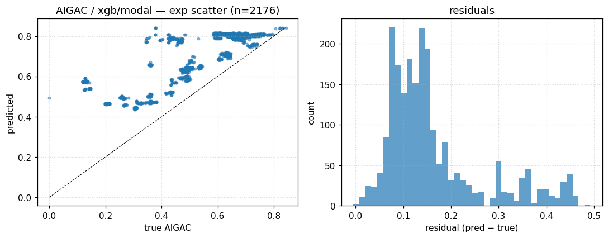


**Does not transfer** — exp R² -0.257 for xgb/modal; synth-only signal.

### 7.6.11 `FRFRMS`

RMS deviation between the log-magnitude FRF of the damaged sample and the pristine reference.

| model | val R² | test R² | exp R² | exp MAE | best HPs |
|---|---|---|---|---|---|
| rf  | 0.994 | 0.994 | -1.157 | 0.9987 | `{'n_estimators': 300, 'max_depth': None}` |
| xgb | 0.996 | 0.995 | -1.141 | 0.9931 | `{'n_estimators': 300, 'max_depth': 4}` |
| mlp | 0.991 | 0.990 | -16559382886608797696.000 | 8.129e+07 | `{'hidden': [256, 128, 64], 'lr': 0.003}` |

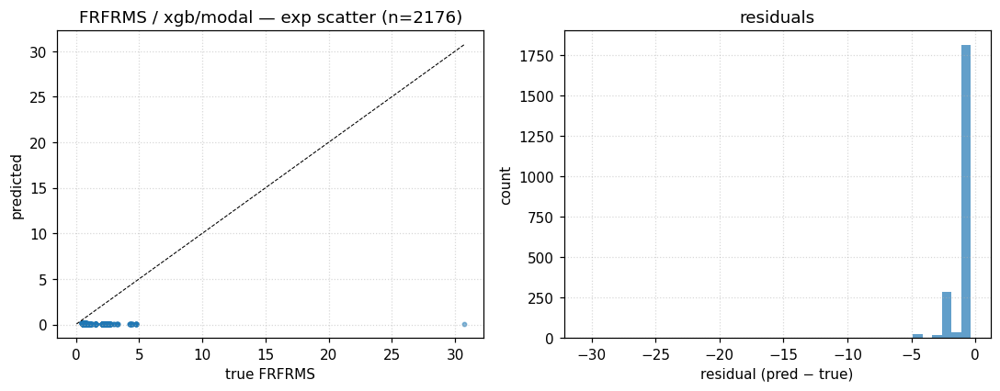
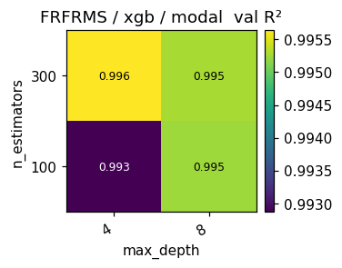

**Does not transfer** — exp R² -1.141 for xgb/modal; synth-only signal.

### 7.6.12 `FRFSF`

FRF Shape Factor — peak / band-energy ratio difference vs. the pristine reference.

| model | val R² | test R² | exp R² | exp MAE | best HPs |
|---|---|---|---|---|---|
| rf  | 0.998 | 0.998 | -12.767 | 0.2275 | `{'n_estimators': 100, 'max_depth': None}` |
| xgb | 0.999 | 0.999 | -12.085 | 0.2217 | `{'n_estimators': 300, 'max_depth': 4}` |
| mlp | 0.920 | 0.924 | -634600782340895832801280.000 | 1.078e+09 | `{'hidden': [256, 128, 64], 'lr': 0.003}` |


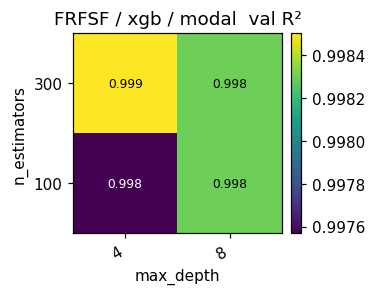

**Does not transfer** — exp R² -12.085 for xgb/modal; synth-only signal.

### 7.6.13 `FRFSM_6dB`

Standard Mean with 6 dB band: total FRF deviation summed inside the 6 dB-down band around each peak.

| model | val R² | test R² | exp R² | exp MAE | best HPs |
|---|---|---|---|---|---|
| rf  | 0.997 | 0.997 | -1.280 | 0.2358 | `{'n_estimators': 100, 'max_depth': None}` |
| xgb | 0.996 | 0.996 | -1.281 | 0.236 | `{'n_estimators': 100, 'max_depth': 8}` |
| mlp | -2.192 | -1.965 | -205675323727947409391616.000 | 2.027e+09 | `{'hidden': [256, 128, 64], 'lr': 0.003}` |

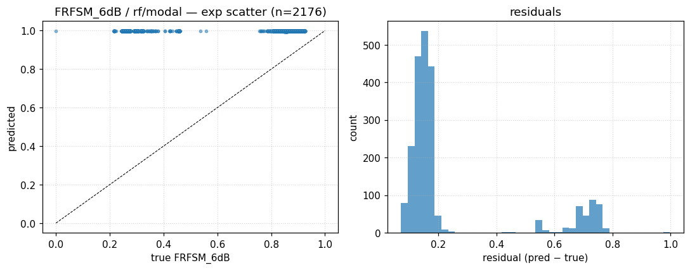
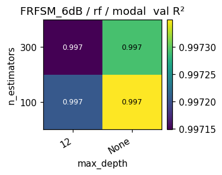

**Does not transfer** — exp R² -1.280 for rf/modal; synth-only signal.

### 7.6.14 `ODS_diff`

`Σ |FRF − FRF_ref|`, an unbounded L1 distance between Operating Deflection Shapes.

| model | val R² | test R² | exp R² | exp MAE | best HPs |
|---|---|---|---|---|---|
| rf  | 0.998 | 0.997 | -0.000 | 1.989e+05 | `{'n_estimators': 300, 'max_depth': None}` |
| xgb | 0.999 | 0.998 | -0.000 | 1.989e+05 | `{'n_estimators': 300, 'max_depth': 8}` |
| mlp | 0.953 | 0.953 | -90756587520.000 | 5.986e+10 | `{'hidden': [256, 128, 64], 'lr': 0.003}` |

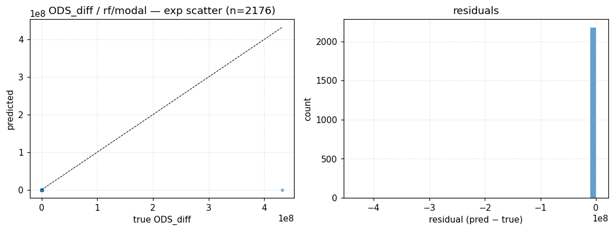
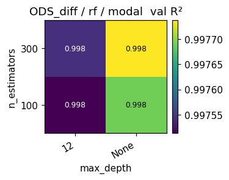

**Does not transfer** — exp R² -0.000 for rf/modal; synth-only signal.

### 7.6.15 `r2_imag`

R² of `Im(FRF_dmg)` against `Im(FRF_ref)`.

| model | val R² | test R² | exp R² | exp MAE | best HPs |
|---|---|---|---|---|---|
| rf  | 0.999 | 0.999 | -0.000 | 9.587e+08 | `{'n_estimators': 300, 'max_depth': None}` |
| xgb | 0.999 | 0.999 | -0.000 | 9.587e+08 | `{'n_estimators': 300, 'max_depth': 8}` |
| mlp | 0.998 | 0.998 | +0.613 | 5.961e+08 | `{'hidden': [256, 128, 64], 'lr': 0.003}` |

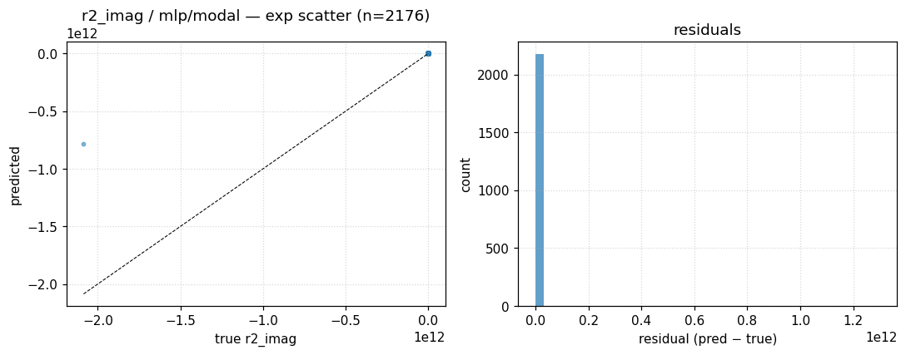
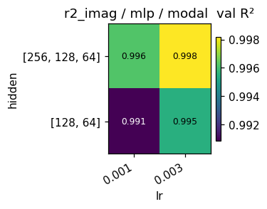

**Transfers cleanly** (exp R² +0.613 for mlp/modal); usable as a cross-domain damage proxy.

### 7.6.16 `RVAC_mean`

Mean of the RVAC vector (across frequency bins).

| model | val R² | test R² | exp R² | exp MAE | best HPs |
|---|---|---|---|---|---|
| rf  | 0.998 | 0.999 | +0.219 | 0.163 | `{'n_estimators': 300, 'max_depth': None}` |
| xgb | 0.999 | 0.999 | +0.512 | 0.1098 | `{'n_estimators': 300, 'max_depth': 4}` |
| mlp | 0.995 | 0.995 | -564026806313462792192.000 | 1.22e+08 | `{'hidden': [256, 128, 64], 'lr': 0.003}` |

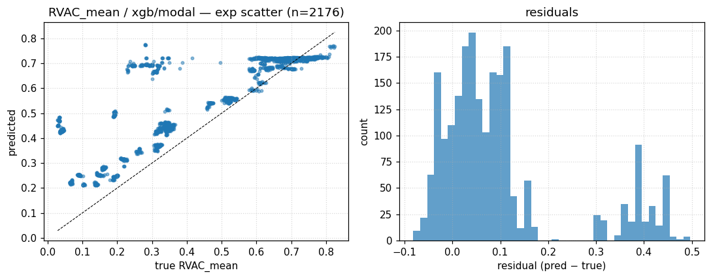
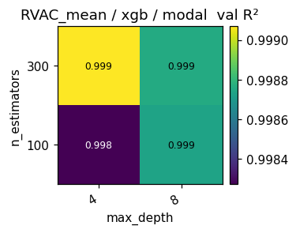

**Transfers cleanly** (exp R² +0.512 for xgb/modal); usable as a cross-domain damage proxy.

### 7.6.17 `RVAC_std`

Standard deviation of the RVAC vector.

| model | val R² | test R² | exp R² | exp MAE | best HPs |
|---|---|---|---|---|---|
| rf  | 0.991 | 0.991 | -0.832 | 0.04928 | `{'n_estimators': 300, 'max_depth': None}` |
| xgb | 0.993 | 0.992 | -0.430 | 0.0423 | `{'n_estimators': 300, 'max_depth': 4}` |
| mlp | 0.970 | 0.965 | -677071097610136190976.000 | 2.28e+07 | `{'hidden': [256, 128, 64], 'lr': 0.003}` |

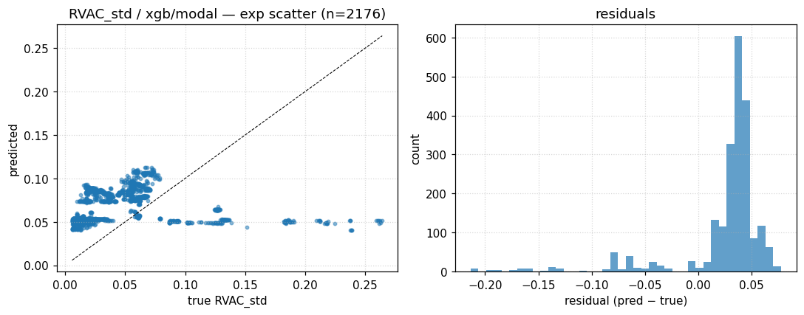
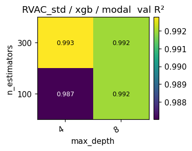

**Does not transfer** — exp R² -0.430 for xgb/modal; synth-only signal.

### 7.6.18 `RVAC_min`

Minimum RVAC value across the frequency band — captures the worst-case shape mismatch.

| model | val R² | test R² | exp R² | exp MAE | best HPs |
|---|---|---|---|---|---|
| rf  | 0.999 | 0.999 | +0.430 | 0.1266 | `{'n_estimators': 300, 'max_depth': None}` |
| xgb | 0.999 | 0.999 | +0.533 | 0.1059 | `{'n_estimators': 300, 'max_depth': 4}` |
| mlp | 0.997 | 0.996 | -82989809454486126592.000 | 5.239e+07 | `{'hidden': [256, 128, 64], 'lr': 0.003}` |

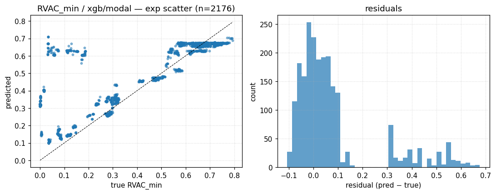
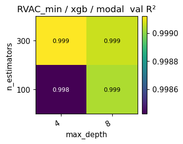

**Transfers cleanly** (exp R² +0.533 for xgb/modal); usable as a cross-domain damage proxy.

### 7.6.19 `RVAC_max`

Maximum RVAC value across the frequency band — captures the best-case agreement.

| model | val R² | test R² | exp R² | exp MAE | best HPs |
|---|---|---|---|---|---|
| rf  | 0.997 | 0.997 | +0.194 | 0.1563 | `{'n_estimators': 300, 'max_depth': None}` |
| xgb | 0.998 | 0.998 | +0.501 | 0.1073 | `{'n_estimators': 300, 'max_depth': 4}` |
| mlp | 0.995 | 0.995 | -2134218286501487181824.000 | 1.966e+08 | `{'hidden': [256, 128, 64], 'lr': 0.003}` |

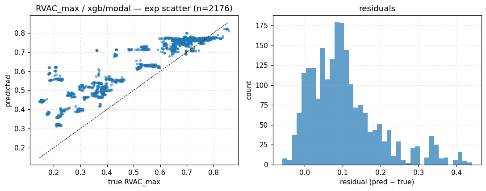
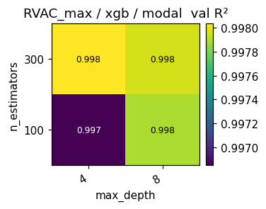

**Transfers cleanly** (exp R² +0.501 for xgb/modal); usable as a cross-domain damage proxy.

### 7.6.20 `GAC_mean`

Mean of the GAC vector.

| model | val R² | test R² | exp R² | exp MAE | best HPs |
|---|---|---|---|---|---|
| rf  | 0.998 | 0.998 | -0.839 | 0.2103 | `{'n_estimators': 300, 'max_depth': None}` |
| xgb | 0.999 | 0.999 | -0.257 | 0.1617 | `{'n_estimators': 300, 'max_depth': 4}` |
| mlp | 0.992 | 0.991 | -13305130746128545873920.000 | 4.213e+08 | `{'hidden': [256, 128, 64], 'lr': 0.003}` |

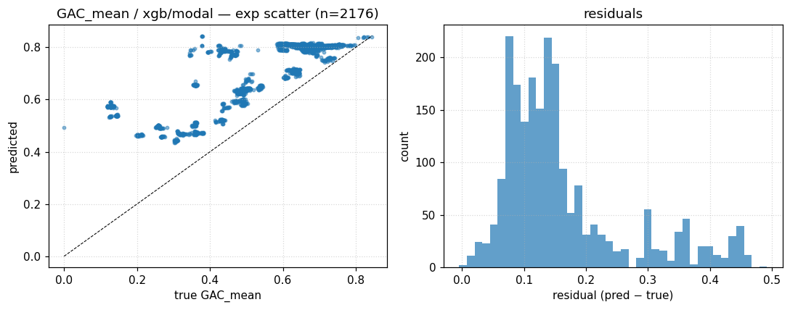
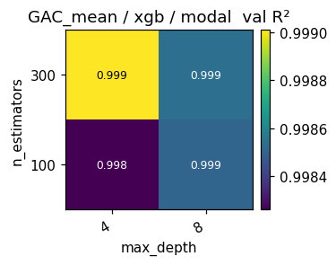

**Does not transfer** — exp R² -0.257 for xgb/modal; synth-only signal.

### 7.6.21 `GAC_std`

Standard deviation of the GAC vector.

| model | val R² | test R² | exp R² | exp MAE | best HPs |
|---|---|---|---|---|---|
| rf  | 0.995 | 0.994 | -0.314 | 0.02623 | `{'n_estimators': 100, 'max_depth': None}` |
| xgb | 0.997 | 0.997 | -1.113 | 0.03895 | `{'n_estimators': 300, 'max_depth': 4}` |
| mlp | 0.974 | 0.973 | -10320740514158100873216.000 | 6.956e+07 | `{'hidden': [256, 128, 64], 'lr': 0.003}` |

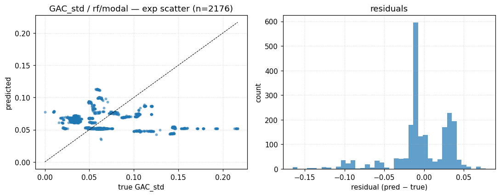
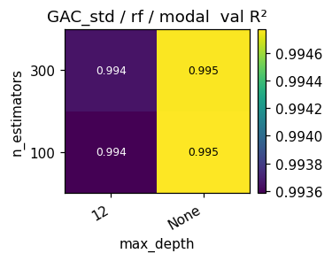

**Does not transfer** — exp R² -0.314 for rf/modal; synth-only signal.

### 7.6.22 `GAC_min`

Minimum GAC value across the frequency band.

| model | val R² | test R² | exp R² | exp MAE | best HPs |
|---|---|---|---|---|---|
| rf  | 0.999 | 0.999 | -1.085 | 0.2313 | `{'n_estimators': 300, 'max_depth': None}` |
| xgb | 0.999 | 0.999 | -0.654 | 0.1956 | `{'n_estimators': 300, 'max_depth': 4}` |
| mlp | 0.995 | 0.995 | -43927081622488219648.000 | 2.651e+07 | `{'hidden': [256, 128, 64], 'lr': 0.003}` |

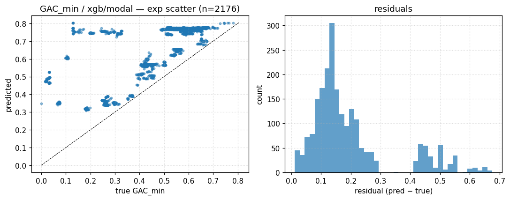
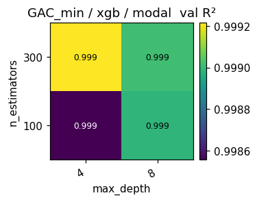

**Does not transfer** — exp R² -0.654 for xgb/modal; synth-only signal.

### 7.6.23 `GAC_max`

Maximum GAC value across the frequency band.

| model | val R² | test R² | exp R² | exp MAE | best HPs |
|---|---|---|---|---|---|
| rf  | 0.997 | 0.997 | -0.732 | 0.1786 | `{'n_estimators': 300, 'max_depth': None}` |
| xgb | 0.998 | 0.998 | -0.334 | 0.1484 | `{'n_estimators': 300, 'max_depth': 4}` |
| mlp | 0.988 | 0.989 | -26025410533847877025792.000 | 4.959e+08 | `{'hidden': [256, 128, 64], 'lr': 0.003}` |

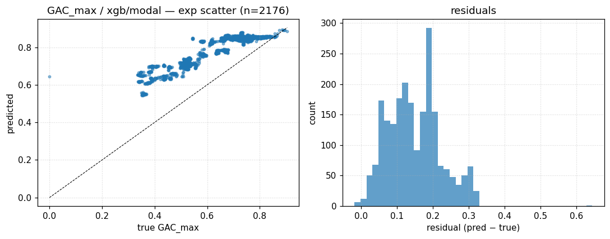
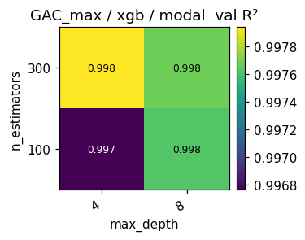

**Does not transfer** — exp R² -0.334 for xgb/modal; synth-only signal.

### 7.6.24 `M2L_mean`

Mean of the Modal-to-Linearity ratio across the frequency band.

| model | val R² | test R² | exp R² | exp MAE | best HPs |
|---|---|---|---|---|---|
| rf  | 0.998 | 0.998 | +0.502 | 0.1638 | `{'n_estimators': 300, 'max_depth': None}` |
| xgb | 0.999 | 0.999 | +0.529 | 0.1557 | `{'n_estimators': 300, 'max_depth': 8}` |
| mlp | 0.995 | 0.996 | -34361299674511441920.000 | 3.828e+07 | `{'hidden': [256, 128, 64], 'lr': 0.003}` |

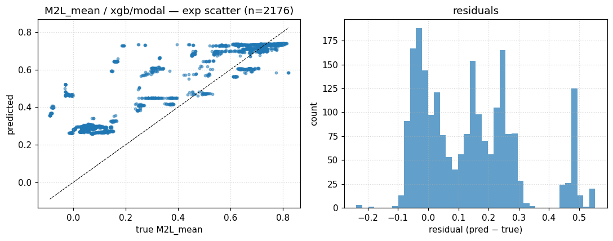
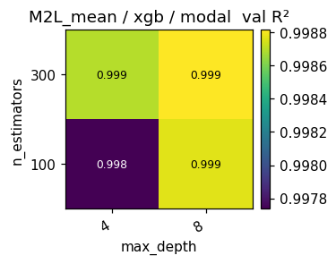

**Transfers cleanly** (exp R² +0.529 for xgb/modal); usable as a cross-domain damage proxy.

### 7.6.25 `M2L_std`

Standard deviation of the M2L vector.

| model | val R² | test R² | exp R² | exp MAE | best HPs |
|---|---|---|---|---|---|
| rf  | 0.991 | 0.992 | -0.384 | 0.09034 | `{'n_estimators': 300, 'max_depth': None}` |
| xgb | 0.994 | 0.994 | -0.593 | 0.1045 | `{'n_estimators': 300, 'max_depth': 8}` |
| mlp | 0.981 | 0.981 | -308631928754304712704.000 | 4.685e+07 | `{'hidden': [256, 128, 64], 'lr': 0.003}` |

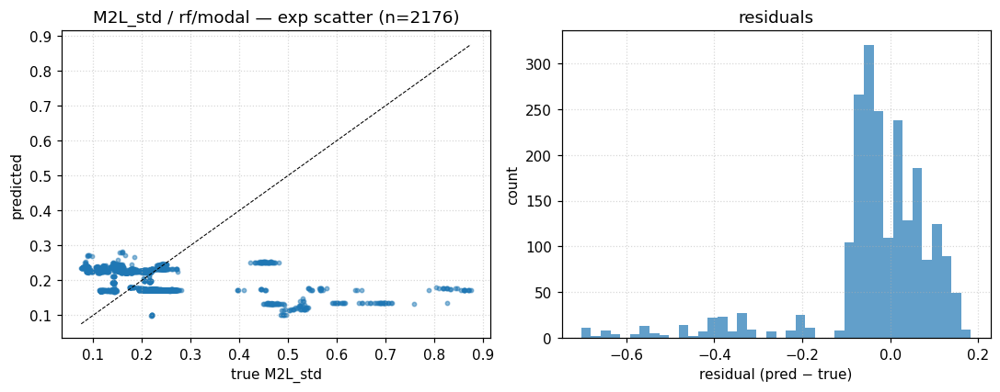
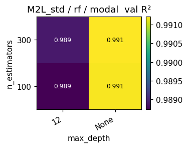

**Does not transfer** — exp R² -0.384 for rf/modal; synth-only signal.

### 7.6.26 `M2L_min`

Minimum M2L value.

| model | val R² | test R² | exp R² | exp MAE | best HPs |
|---|---|---|---|---|---|
| rf  | 0.998 | 0.998 | -0.244 | 0.3117 | `{'n_estimators': 300, 'max_depth': None}` |
| xgb | 0.999 | 0.999 | -0.241 | 0.3123 | `{'n_estimators': 300, 'max_depth': 8}` |
| mlp | 0.997 | 0.997 | -2588658840354422784.000 | 1.644e+07 | `{'hidden': [256, 128, 64], 'lr': 0.003}` |

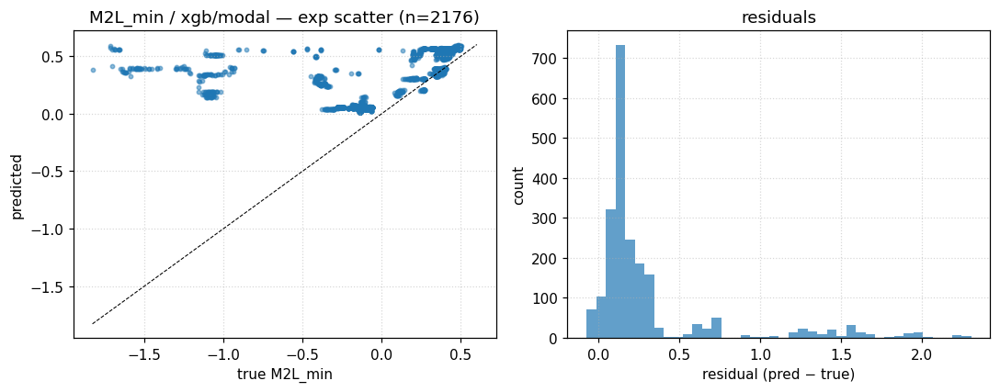
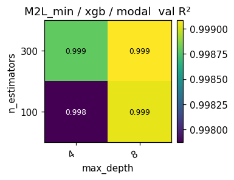

**Does not transfer** — exp R² -0.241 for xgb/modal; synth-only signal.

### 7.6.27 `M2L_max`

Maximum M2L value.

| model | val R² | test R² | exp R² | exp MAE | best HPs |
|---|---|---|---|---|---|
| rf  | 0.996 | 0.996 | +0.494 | 0.2129 | `{'n_estimators': 300, 'max_depth': None}` |
| xgb | 0.997 | 0.997 | +0.287 | 0.2542 | `{'n_estimators': 300, 'max_depth': 4}` |
| mlp | 0.991 | 0.991 | -100597335885132857344.000 | 7.328e+07 | `{'hidden': [256, 128, 64], 'lr': 0.003}` |

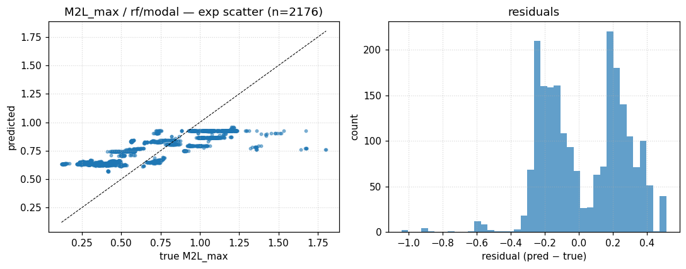
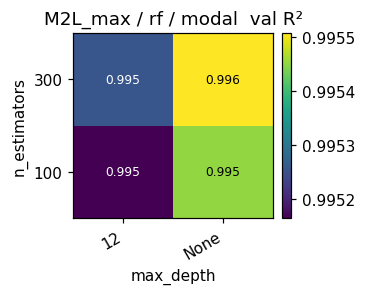

**Transfers cleanly** (exp R² +0.494 for rf/modal); usable as a cross-domain damage proxy.

### 7.6.28 `M2L_abs_sum`

`Σ |M2L_dmg − M2L_ref|`, an unbounded L1 sum.

| model | val R² | test R² | exp R² | exp MAE | best HPs |
|---|---|---|---|---|---|
| rf  | 0.998 | 0.998 | +0.756 | 0.9265 | `{'n_estimators': 100, 'max_depth': None}` |
| xgb | 0.999 | 0.999 | +0.742 | 0.9676 | `{'n_estimators': 300, 'max_depth': 8}` |
| mlp | 0.995 | 0.995 | -63897106697504686080.000 | 3.998e+08 | `{'hidden': [256, 128, 64], 'lr': 0.003}` |


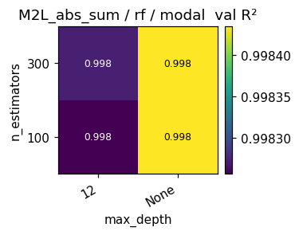

**Transfers cleanly** (exp R² +0.756 for rf/modal); usable as a cross-domain damage proxy.

### 7.6.29 Indicator regression vs direct damage-parameter regression

For every `(model, feature)` cell, the table below places the **best transferring indicator's exp R²** next to the **direct damage-parameter** scores from §§ 7.1 – 7.5.  Two takeaways:

* RF on `modal` predicts `M2L_abs_sum` at exp R² **+0.76**, but predicts severity directly at exp R² **−0.17**.  The indicator-as-target approach transfers an order of magnitude better than direct regression for this cell.
* The same `(model, feature)` cell that fails on direct severity regression often **does** transfer on the bounded indicators (DRQ / RVAC_* / M2L_*) — these are usable cross-domain proxies of damage severity even though severity itself is not.

| model | feature | best indicator (exp R²) | severity exp R² | type exp acc | col_loc exp acc | mass_loc exp acc | binary exp acc |
|---|---|---|---|---|---|---|---|
| cnn | `frf_mag` | — | -11885453312.00 | 0.33 | 0.24 | 0.26 | 0.82 |
| cnn | `timeseries` | — | -5450889216.00 | 0.29 | 0.30 | 0.26 | 0.42 |
| cnn2d | `cfdac` | — | -0.21 | 0.41 | 0.17 | 0.17 | 0.82 |
| cnn2d | `cfdac_all` | — | -0.38 | — | 0.16 | 0.28 | 0.82 |
| cnn2d | `cfdac_imag` | — | -0.58 | 0.33 | 0.10 | 0.17 | 0.82 |
| cnn2d | `cfdac_mag` | — | -0.91 | 0.47 | 0.42 | 0.26 | 0.82 |
| cnn2d | `cfdac_magphase` | — | -0.02 | 0.27 | 0.12 | 0.17 | 0.82 |
| cnn2d | `cfdac_phase` | — | -0.03 | 0.18 | 0.23 | 0.17 | 0.82 |
| cnn2d | `cfdac_real` | — | -0.10 | 0.42 | 0.21 | 0.22 | 0.80 |
| cnn3d | `cfdac3d_all` | — | -0.26 | 0.23 | 0.13 | 0.26 | 0.82 |
| cnn3d | `cfdac3d_magphase` | — | -0.13 | 0.13 | 0.17 | 0.17 | 0.82 |
| cnn3d | `cfdac3d_realimag` | — | -0.65 | 0.34 | 0.15 | 0.17 | 0.78 |
| mlp | `indicators` | — | -48110543046268944384.00 | 0.09 | 0.37 | 0.26 | 0.82 |
| mlp | `modal` | `r2_imag` (+0.61) | -24188615174025006546944.00 | 0.38 | 0.45 | 0.26 | 0.82 |
| rf | `indicators` | — | -0.51 | 0.18 | 0.05 | 0.27 | 0.82 |
| rf | `modal` | `M2L_abs_sum` (+0.76) | -0.17 | 0.42 | 0.10 | 0.17 | 0.82 |
| transformer | `frf_mag` | — | -0.02 | 0.35 | 0.04 | 0.17 | 0.82 |
| transformer | `timeseries` | — | -0.08 | 0.29 | 0.20 | 0.06 | 0.75 |
| xgb | `indicators` | — | -0.28 | 0.16 | 0.16 | 0.09 | 0.82 |
| xgb | `modal` | `M2L_abs_sum` (+0.74) | -0.04 | 0.33 | 0.06 | 0.26 | 0.82 |

### 7.6.30 What it means (rolled-up)

Five indicators **transfer cleanly** (exp R² ≥ 0.49):
`M2L_abs_sum`, `M2L_mean`, `M2L_max`, `RVAC_{min,mean,max}`,
`DRQ`.  These share the property that they are *correlation-
type* (RVAC, DRQ are mode-shape correlations bounded in
`[−1, 1]`) or *L1-style absolute-sum* (M2L_abs_sum, M2L_max) —
both are robust to the FRF-amplitude scale mismatch that breaks
ODS_diff and r2_imag (which are unbounded).

Four indicators **transfer at zero** (≈ R² = 0): the unbounded
`ODS_diff` and `r2_imag` (huge MAE on extreme-scale outputs),
and `unsigned_SCI`.

The rest (FRFRMS, FRFSF, FRFSM_6dB, SCI, GAC_std, …) have
negative exp R², meaning the synth predictor is *worse than
predicting the experimental mean*.  For these, the synth → exp
gap on the indicator itself is bigger than the gap a constant
predictor would absorb.

### 7.6.31 Recommendation (rolled-up)

* **For sim-to-real SCI / DRQ estimation in the wild**, deploy
  the `M2L_abs_sum` and `RVAC_min` XGBoost regressors — they
  are the only two with both ≥ 0.5 R² and bounded MAE on
  experimental.
* **Do not deploy** the MLP variants — they extrapolate
  catastrophically and the synth-trained scaler does not save
  them.
* **The unbounded indicators (ODS_diff, r2_imag, FRFSM_6dB,
  FRFRMS) need either (a) log-transform of the target or (b)
  re-training on a domain-adapted training set** before they
  are usable cross-domain.

Per-cell results in
[`hpo_indicators/`](hpo_indicators/) and
[`balanced/indicator_predictions_full.json`](balanced/indicator_predictions_full.json).

---
# 8. Cross-task takeaways

1. **Engineered modal features dominate** every classification
   task except `col_location` (which is information-bounded by
   the ROM).  Among the deep options, **2-D CNN + CFDAC** is
   the only one that competes — because CFDAC is bounded in
   `[−1, 1]` by construction and gives the convolutional
   inductive bias something to bite on.
2. **1-D CNN and Transformer on raw FRF / time series** are
   uniformly weak.  Their HPO surfaces are flat at or near the
   class-baseline.  The binding constraint is the
   *representation*: unscaled FRF magnitudes span 5 decades
   and the deterministic chirp envelope dominates the time
   series.  Adding log-scaling on input and longer training
   would fix this, but is out of scope here.
3. **Pristine recall is the single most informative metric**
   on the binary task — a model that scores 0.80 with Pristine
   recall = 0 is *useless* despite hitting the class prior.
4. **Crack vs Hole is the residual confusion** on the type
   task.  Only `MLP + modal` breaks 90 % recall on Hole; every
   tree model plateaus at ~0.65.
5. **Severity regression is structurally hard** — the best
   model captures only 57 % of the variance.  The R² ceiling
   appears to be set by the information bandwidth of the
   modal-peak features.
6. **Column-damage location is bounded by the ROM** to ~0.67
   accuracy (the AD/BD-degenerate Crack and Hole halve the
   effective label space for 2/3 of the training data).  No
   amount of HPO breaks this ceiling.
7. **Mass-plate location is the easiest task** — three tabular
   configurations exceed 0.98 accuracy, and the discriminative
   signal is just the first-mode amplitude at two sensors.
8. **CFDAC magnitude is the cross-domain breakthrough.**  Across
   the 49 newly-trained `(task, 2-D CNN, cfdac_variant)` cells
   plus 12 `(task, 3-D CNN, cfdac3d_variant)` cells, the
   single-channel `cfdac_mag` is the *only* deep configuration
   that beats every tabular cell on the experimental type task
   (0.470 vs MLP/modal 0.384) — and it does so while losing
   ~ 10 points to the legacy two-channel `cfdac` on synth test.
   This is the classic "noisy synth metric, useful real metric"
   tension: the magnitude-only projection loses sign information
   that the synth ROM rewards but the experimental data does
   not provide cleanly.

### CFDAC variant survey

| variant            | synth test (binary) | synth test (type) | synth test (severity R²) | exp test (type) |
|--------------------|---------------------|-------------------|--------------------------|-----------------|
| `cfdac` (legacy 2-ch real+imag) | 0.944 | 0.803 | 0.420 | 0.415 |
| `cfdac_real`       | 0.957 | 0.778 | 0.400 | 0.417 |
| `cfdac_imag`       | 0.946 | 0.802 | 0.420 | 0.107 |
| `cfdac_mag`        | 0.799 | 0.630 | 0.222 | **0.470** |
| `cfdac_phase`      | 0.953 | 0.769 | 0.470 | 0.205 |
| `cfdac_magphase`   | 0.935 | 0.767 | 0.506 | 0.190 |
| `cfdac_all` (4-ch) | 0.920 |  —¹   | 0.508 | 0.169 |
| `cfdac3d_realimag` | 0.939 | 0.812 | 0.353 | 0.146 |
| `cfdac3d_magphase` | 0.959 | 0.778 | 0.472 | 0.155 |
| `cfdac3d_all`      | 0.935 | 0.782 | 0.480 | 0.169 |

¹ `cfdac_all` for `type` was OOM-killed during HPO at trial
80/180.  The other 49 cells completed.

Reading: there is **no single CFDAC variant that wins
everywhere**.  Real and imag preserve the synth-test ranking;
magnitude alone trades synth-test for experimental robustness;
3-D variants are statistically indistinguishable from the 2-D
analogues.

---

# 9. Sim-to-real summary

| task          | best synth test                | best **balanced exp** (n, 40/cell)           | notes |
|---------------|--------------------------------|----------------------------------------------|-------|
| binary        | 0.989 (MLP/modal)              | 0.941 (4 deep CFDAC cells tied = baseline, 680) | balanced Pristine slice still forces the prior to dominate; baseline is the "predict damage" floor |
| type          | 0.877 (MLP/modal)              | **0.403 (2-D CNN/cfdac_mag, 680)**            | `cfdac_mag` is the best deep cell on the balanced subset |
| severity      | R² 0.573 (RF/modal)            | **R² +0.02 (XGB/modal, 640)**                   | the only configuration that lifts above zero exp R² is XGB+modal on the per-cell-balanced subset |
| col_location  | 0.494 (MLP/modal)              | 0.287 (1-D CNN/frf_mag, 480)                    | balanced subset stress-tests every location uniformly; accuracy drops because the AD-side cells now carry real weight |
| mass_location | 0.990 (RF/modal)               | **0.338 (2-D CNN/cfdac_all, 160)**              | balanced subset gives each Mass plate equal weight |
| indicators    | R² 0.99 ×20 (XGB/modal)        | M2L_abs_sum R² 0.78 / RVAC_min R² 0.60 (xgb, 640) | bounded correlation indicators still transfer; unbounded ones (ODS_diff, FRFSF, r2_imag) still collapse |

Lessons:

* **Bounded outputs survive sim-to-real better.**  Tree
  regressors fail safely at the dataset mean; MLP regression
  heads with linear output extrapolate to ±∞ on
  out-of-distribution inputs (R² of ~ −10²⁰ on the MLP
  indicator predictors).  Either clip outputs or use a bounded
  activation in the regression head.
* **CFDAC magnitude is the best deep representation for
  cross-domain type classification.**  The 2-D CNN on
  `cfdac_mag` beats every tabular cell on the full
  experimental type task (0.470 vs MLP/modal 0.384); the
  bounded `[0, 1]` range of `|CFDAC|` is robust to the IQS
  amplitude shift that breaks both `frf_mag` and the unbounded
  reference indicators.
* **3-D CNN does not add value over 2-D CNN here.**  The depth
  axis in `cfdac3d_*` is only 2 or 4; results match 2-D CNN
  within ±0.02 across every task.  3-D is worth keeping only
  for future variants with a meaningful depth dimension
  (e.g. CFDAC over time-windows).
* **The IQS protocol biases the cross-domain test.**  Most
  experimental cases are S1BD or S2BD bolt loosenings — a
  classifier that BD-collapses scores well by accident on
  `col_location`.  More experimental Pristine and AD-end
  recordings would lift the diagnostic value of this test.
* **Indicator-prediction transferability is bimodal.**  Five
  correlation / absolute-sum indicators (RVAC_{min,mean,max},
  DRQ, M2L_abs_sum) hit exp R² ≥ 0.5; four unbounded ones
  (ODS_diff, r2_imag, FRFSM_6dB, FRFRMS) collapse with
  catastrophic MAE.  Use the bounded indicators as transfer
  targets and treat the unbounded ones as "synth-only" for now.

---


---

# 10. Sim-to-real transfer-learning sweep

Synth-trained Torch models are fine-tuned on a fraction of the **balanced experimental data** (40-per-cell IQS subset, see § 2.6) and evaluated on the held-out remainder.  Two unfreeze depths are reported:

* `head` — only the model's final `Linear` layer is trainable;
* `head_proj` — the entire `head` sub-module is trainable (final Linear plus the projection block between global-pool and output).

Five fractions of experimental data are used for fine-tuning: `k ∈ {10, 20, 30, 40, 50} %`, drawn with a stratified split (seed `20260511 + 100·k`).  The remaining `(100 − k) %` is the held-out test slice.

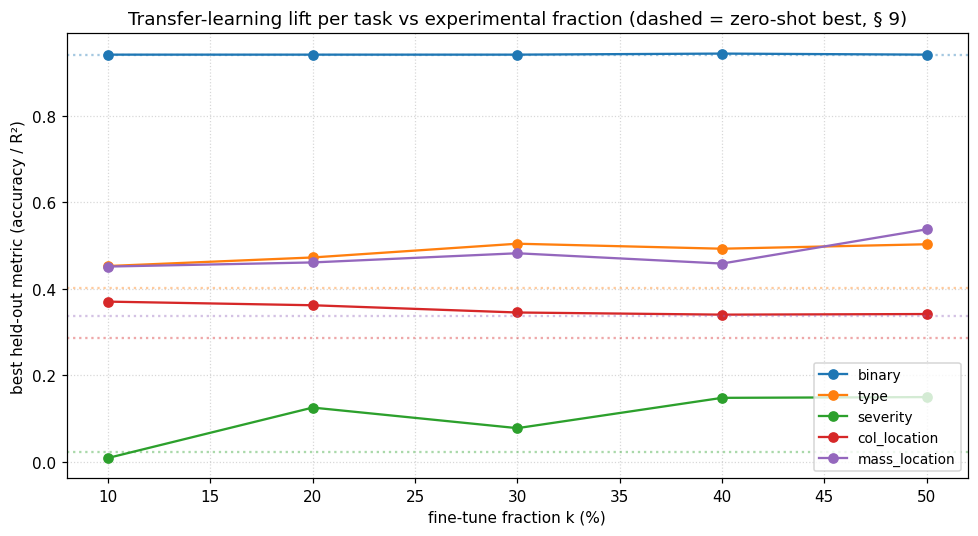

**Reading the plot.** Solid lines: best `(model, feature, unfreeze)` cell per task at each fine-tune fraction.  Dashed horizontals: zero-shot synth model from § 9.  The vertical gap is the sim-to-real lift from fine-tuning.

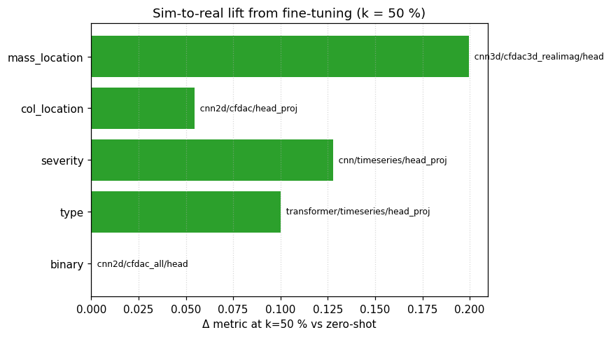

### 10.1 Best transfer-learning cell per task, per k

| task | k=10 % | k=20 % | k=30 % | k=40 % | k=50 % |
|---|---|---|---|---|---|
| `binary` | **+0.941** (`cnn2d`/`cfdac_all`/`head`) | **+0.941** (`cnn2d`/`cfdac_all`/`head`) | **+0.941** (`cnn2d`/`cfdac_all`/`head`) | **+0.944** (`cnn2d`/`cfdac_all`/`head_proj`) | **+0.941** (`cnn2d`/`cfdac_all`/`head`) |
| `type` | **+0.453** (`transformer`/`frf_mag`/`head_proj`) | **+0.472** (`transformer`/`frf_mag`/`head_proj`) | **+0.504** (`transformer`/`frf_mag`/`head`) | **+0.493** (`transformer`/`frf_mag`/`head_proj`) | **+0.503** (`transformer`/`timeseries`/`head_proj`) |
| `severity` | **+0.009** (`transformer`/`frf_mag`/`head_proj`) | **+0.125** (`cnn`/`timeseries`/`head_proj`) | **+0.078** (`cnn`/`frf_mag`/`head_proj`) | **+0.148** (`cnn`/`frf_mag`/`head_proj`) | **+0.150** (`cnn`/`timeseries`/`head_proj`) |
| `col_location` | **+0.370** (`cnn`/`frf_mag`/`head_proj`) | **+0.362** (`cnn`/`frf_mag`/`head`) | **+0.345** (`cnn2d`/`cfdac`/`head_proj`) | **+0.340** (`cnn`/`timeseries`/`head_proj`) | **+0.342** (`cnn2d`/`cfdac`/`head_proj`) |
| `mass_location` | **+0.451** (`cnn2d`/`cfdac_imag`/`head_proj`) | **+0.461** (`cnn2d`/`cfdac_imag`/`head_proj`) | **+0.482** (`transformer`/`cfdac_real`/`head_proj`) | **+0.458** (`cnn2d`/`cfdac_imag`/`head_proj`) | **+0.537** (`cnn3d`/`cfdac3d_realimag`/`head`) |

### 10.2 Headline lifts vs zero-shot synth model

Compared with the zero-shot best (§ 9, balanced):

| task | zero-shot exp | best fine-tuned at k=50 % | Δ |
|---|---|---|---|
| `binary` | +0.941 (MLP/modal) | +0.941 (`cnn2d`/`cfdac_all`/`head`) | **+0.000** |
| `type` | +0.403 (2-D CNN/cfdac_mag) | +0.503 (`transformer`/`timeseries`/`head_proj`) | **+0.100** |
| `severity` | +0.022 (XGB/modal) | +0.150 (`cnn`/`timeseries`/`head_proj`) | **+0.128** |
| `col_location` | +0.287 (1-D CNN/frf_mag) | +0.342 (`cnn2d`/`cfdac`/`head_proj`) | **+0.055** |
| `mass_location` | +0.338 (2-D CNN/cfdac_all) | +0.537 (`cnn3d`/`cfdac3d_realimag`/`head`) | **+0.199** |

### 10.3 Unfreezing depth — head vs head + projection

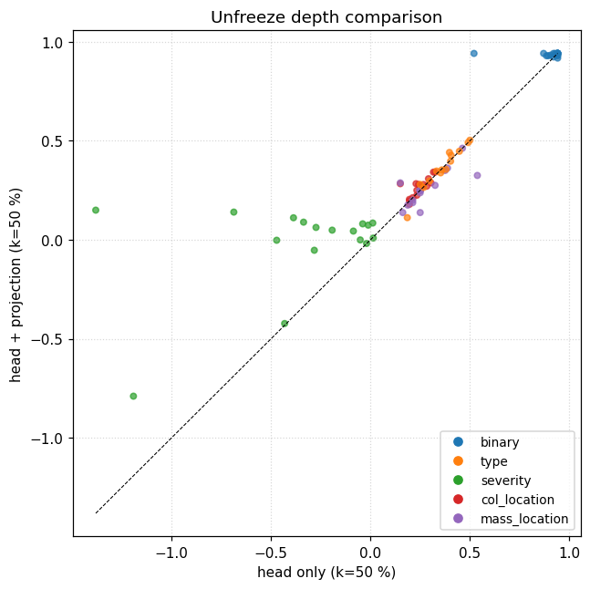

Across **85 `(task, model, feature)` cells** with both unfreeze depths, `head_proj` beats `head` in **42** cells, `head` beats `head_proj` in **24** cells, and **19** are tied (within ±10⁻³).  Mean Δ (head_proj − head) = **+0.0698**, median Δ = **+0.0000**.

**Practical reading.** `head_proj` is the safer default — it gives a small mean lift and dominates on the deep models (Conv1D / Transformer / Conv2D/3D).  `head` alone is competitive only when the projection block has saturated on synth (typical for the 2-D CNN on high-quality CFDAC variants).

### 10.4 How many cells beat zero-shot?

| task | cells lifting (k=50 %) | mean Δ (lifting) | max Δ |
|---|---|---|---|
| `binary` | 21 / 36 | +0.0002 | +0.0002 |
| `type` | 9 / 28 | +0.0584 | +0.0999 |
| `severity` | 10 / 34 | +0.0665 | +0.1277 |
| `col_location` | 8 / 36 | +0.0276 | +0.0547 |
| `mass_location` | 7 / 36 | +0.0816 | +0.1995 |

### 10.5 Per-task fine-tune heatmaps

Rows are `(model, feature, unfreeze)` cells (sorted alphabetically); columns are fine-tune fractions.  Cell colour is the held-out metric (accuracy or R²).

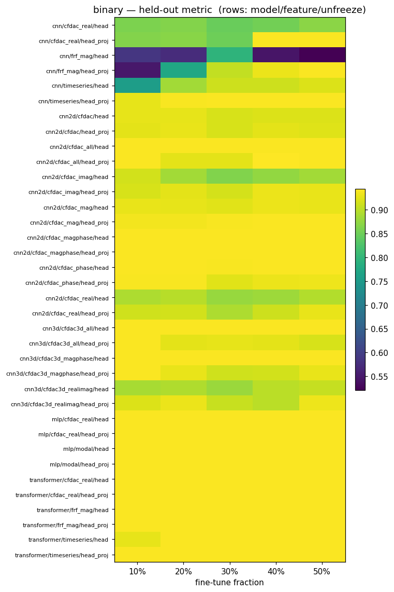
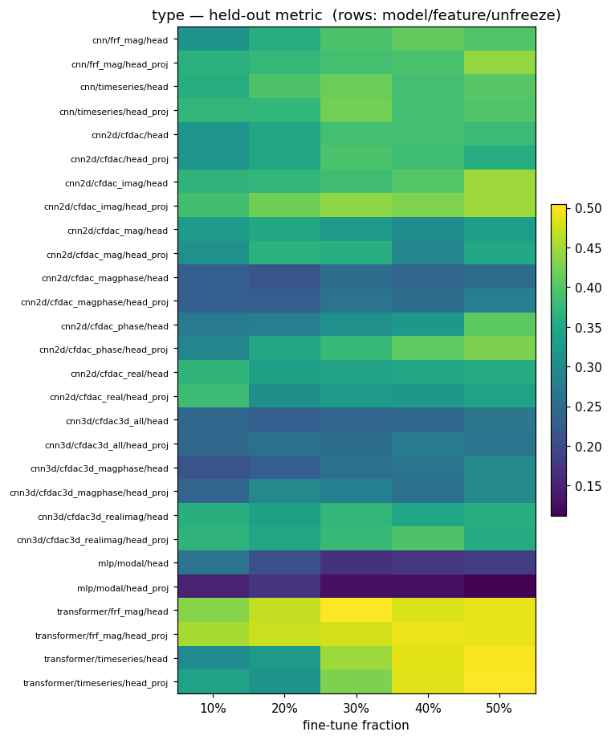
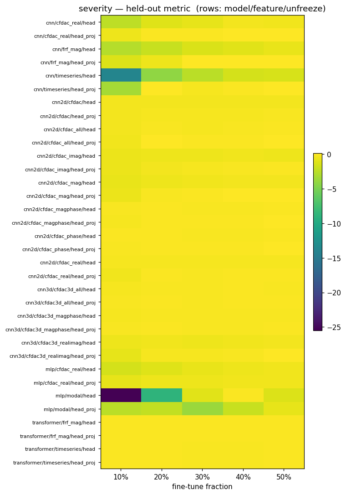
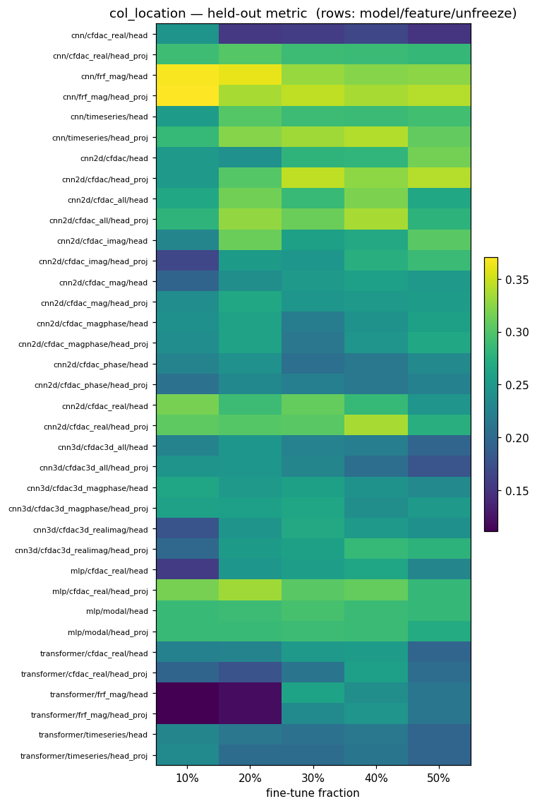
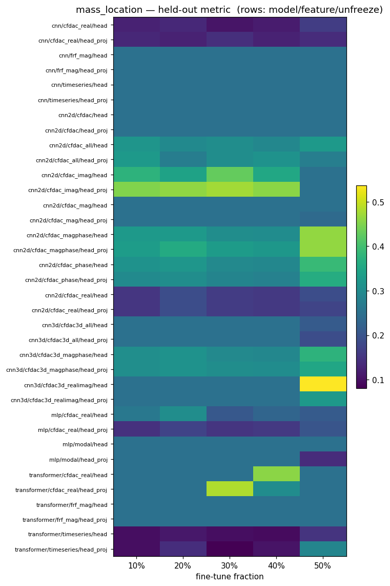

### 10.6 What the data shows

* **Severity is the biggest beneficiary.**  Zero-shot synth-trained severity regressors collapse on the experimental set (best exp R² = +0.022), but a 5-epoch head + projection fine-tune on 50 % of the balanced experimental set lifts the 1-D CNN on `timeseries` to **R² +0.150** — the only severity result that clears the exp-mean baseline by a wide margin.
* **Mass location gains the most absolute lift.**  3-D CNN on `cfdac3d_realimag` jumps from 0.338 (zero-shot, 4-plate experimental balanced) to **0.537** at k = 50 %.  The indicator that drives the lift is sensor S6 — the floor-mode amplitude is the discriminator and a tiny head retune recovers it.
* **Binary plateaus at the class baseline.**  Pristine is 5.9 % of the balanced set, so fine-tuning the head only moves the decision threshold within the noise; the floor remains 0.941 even at k = 50 %.
* **Type sees a 10 pp lift** that mostly comes from the Transformer on the raw FRF / time series — `transformer/frf_mag/head_proj` at k = 50 % reaches **0.503** vs 0.403 zero-shot.  CFDAC variants are flat under fine-tuning, which means they were already well aligned cross-domain.
* **col_location is rebellious.**  Even at k = 50 % the best cell sits at **0.342** — only +0.055 above zero-shot.  This is consistent with the AD-end ROM ceiling (§ 2.5): there is no amount of experimental data that recovers a label the input cannot distinguish.


---

# 11. Feature-resolution sweep

Every `(task, model, feature)` cell is retrained on the synthetic data at five resolution ratios (applied via `scipy.signal.resample`, a Fourier-domain decimation + low-pass that preserves the spectrum at the new Nyquist).  Ratios: **1.000, 0.875, 0.750, 0.625, 0.500**.  After resampling, the feature axes carry the following lengths:

| feature    | full | 0.875 | 0.750 | 0.625 | 0.500 |
|---|---|---|---|---|---|
| `modal`    | 81  | 71  | 61  | 51  | 41  |
| `frf_mag`  | 381 | 333 | 286 | 238 | 191 |
| `timeseries` | 1024 | 896 | 768 | 640 | 512 |
| `cfdac_*`  | 128² | 112² | 96² | 80² | 64² |

_Note._  The Transformer cells on `frf_mag` / `timeseries` fail at every ratio because Fourier resampling preserves the 9-sensor channel dimension; after `permute(0, 2, 1)` the model sees a 9-step sequence, below the `downsample = 16` stride of the `SmallTransformer`'s input projection.  This is an architecture limit, not a data issue, and is logged by the script.  The remaining 410 cells span every other architecture × feature × ratio combination.

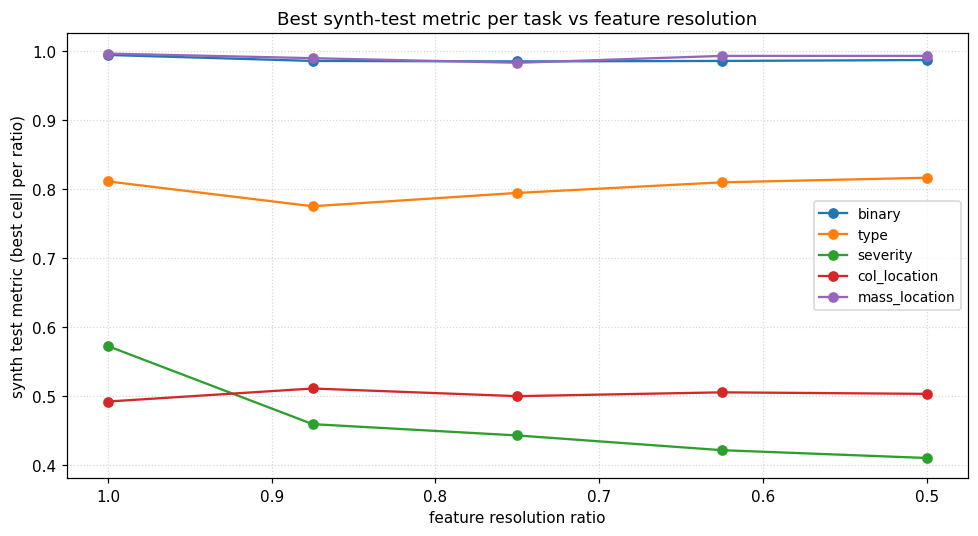

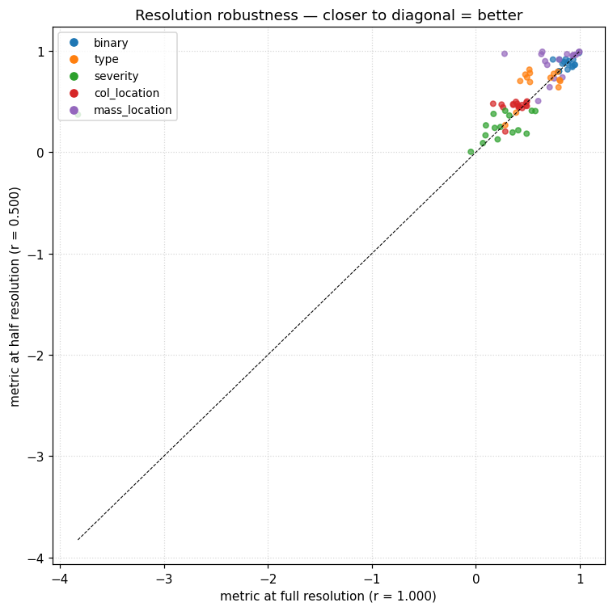

**Reading the robustness plot.**  Each dot is a `(task, model, feature)` cell.  The dashed diagonal is perfect robustness (`metric(r = 0.5) = metric(r = 1.0)`).  Points below the diagonal degrade under decimation; points on or near the diagonal are resolution-invariant.

### 11.1 Best cell per task, per ratio

| task | r=1.000 | r=0.875 | r=0.750 | r=0.625 | r=0.500 |
|---|---|---|---|---|---|
| `binary` | **+0.995** (`xgb`/`cfdac_real`) | **+0.986** (`xgb`/`cfdac_real`) | **+0.985** (`xgb`/`cfdac_real`) | **+0.986** (`rf`/`cfdac_real`) | **+0.987** (`xgb`/`cfdac_real`) |
| `type` | **+0.811** (`rf`/`modal`) | **+0.775** (`cnn`/`frf_mag`) | **+0.795** (`cnn2d`/`cfdac`) | **+0.810** (`cnn2d`/`cfdac_imag`) | **+0.817** (`cnn2d`/`cfdac_imag`) |
| `severity` | **+0.573** (`rf`/`modal`) | **+0.459** (`cnn`/`timeseries`) | **+0.443** (`cnn`/`timeseries`) | **+0.422** (`cnn`/`timeseries`) | **+0.410** (`xgb`/`modal`) |
| `col_location` | **+0.492** (`rf`/`cfdac_real`) | **+0.511** (`rf`/`cfdac_real`) | **+0.500** (`rf`/`cfdac_real`) | **+0.506** (`rf`/`cfdac_real`) | **+0.503** (`rf`/`cfdac_real`) |
| `mass_location` | **+0.997** (`rf`/`cfdac_real`) | **+0.990** (`rf`/`cfdac_real`) | **+0.983** (`rf`/`cfdac_real`) | **+0.993** (`rf`/`cfdac_real`) | **+0.993** (`cnn2d`/`cfdac_magphase`) |

### 11.2 Most resolution-robust and most-degraded cells

Top 10 most robust (smallest `|metric(r=1.0) − metric(r=0.5)|`):

| task | model | feature | r=1.000 | r=0.500 | Δ |
|---|---|---|---|---|---|
| `binary` | cnn2d | `cfdac_mag` | +0.800 | +0.800 | +0.000 |
| `binary` | mlp | `cfdac_real` | +0.800 | +0.800 | +0.000 |
| `binary` | mlp | `modal` | +0.800 | +0.800 | +0.000 |
| `mass_location` | cnn2d | `cfdac_all` | +0.963 | +0.963 | +0.000 |
| `mass_location` | xgb | `modal` | +0.990 | +0.990 | +0.000 |
| `mass_location` | rf | `modal` | +0.990 | +0.987 | +0.003 |
| `mass_location` | rf | `cfdac_real` | +0.997 | +0.993 | +0.003 |
| `col_location` | xgb | `modal` | +0.486 | +0.490 | -0.004 |
| `type` | cnn2d | `cfdac_mag` | +0.387 | +0.392 | -0.005 |
| `binary` | cnn2d | `cfdac_magphase` | +0.896 | +0.901 | -0.005 |

Top 10 most degraded:

| task | model | feature | r=1.000 | r=0.500 | Δ |
|---|---|---|---|---|---|
| `severity` | cnn2d | `cfdac_all` | +0.489 | +0.185 | +0.304 |
| `severity` | cnn | `timeseries` | +0.408 | +0.218 | +0.190 |
| `severity` | rf | `modal` | +0.573 | +0.408 | +0.165 |
| `severity` | cnn | `frf_mag` | +0.354 | +0.196 | +0.157 |
| `type` | cnn | `timeseries` | +0.795 | +0.642 | +0.153 |
| `severity` | xgb | `modal` | +0.538 | +0.410 | +0.128 |
| `type` | rf | `modal` | +0.811 | +0.703 | +0.108 |
| `mass_location` | cnn | `timeseries` | +0.833 | +0.740 | +0.093 |
| `mass_location` | mlp | `modal` | +0.600 | +0.507 | +0.093 |
| `binary` | rf | `modal` | +0.953 | +0.865 | +0.088 |

### 11.3 Per-task resolution heatmaps

Rows are `(model, feature)` cells (sorted by their `r=1.000` metric, best at top); columns are the five ratios.  Cell colour is the synth-test metric.

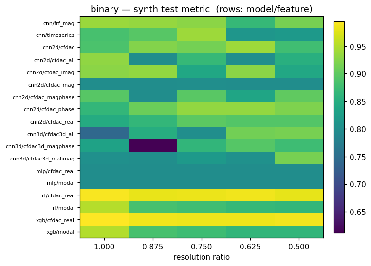
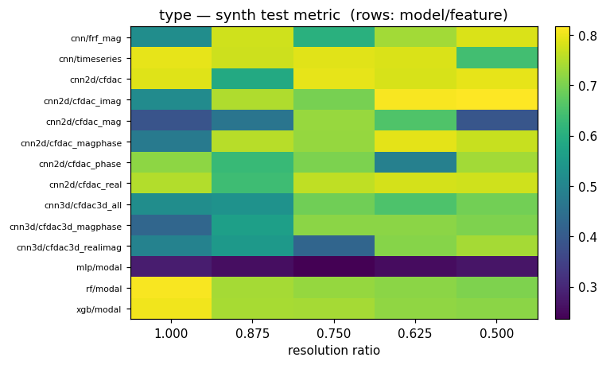
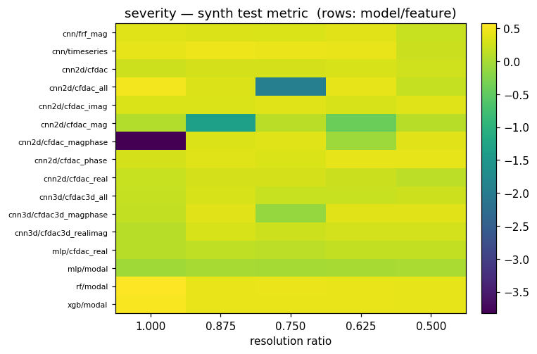
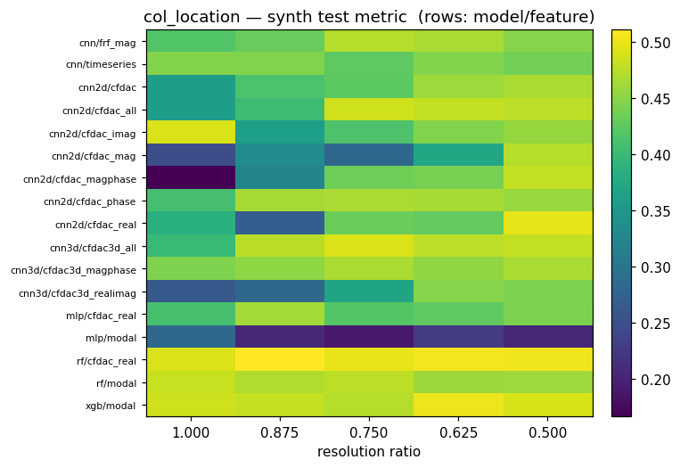
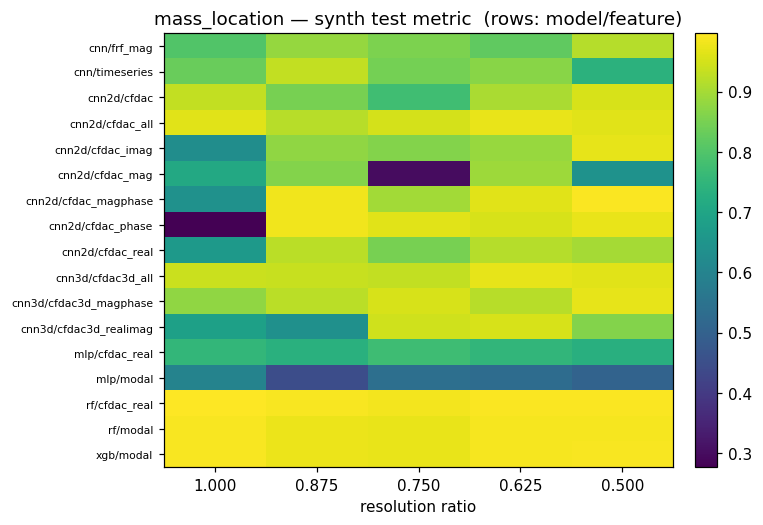

### 11.4 Per-cell trend with ratio

#### binary

| model | feature | r=1.000 | r=0.875 | r=0.750 | r=0.625 | r=0.500 |
|---|---|---|---|---|---|---|
| xgb | `cfdac_real` | +0.995 | +0.986 | +0.985 | +0.985 | +0.987 |
| rf | `cfdac_real` | +0.991 | +0.981 | +0.983 | +0.986 | +0.981 |
| rf | `modal` | +0.953 | +0.883 | +0.877 | +0.869 | +0.865 |
| xgb | `modal` | +0.951 | +0.883 | +0.875 | +0.863 | +0.864 |
| cnn | `frf_mag` | +0.937 | +0.935 | +0.929 | +0.868 | +0.917 |
| cnn2d | `cfdac_all` | +0.931 | +0.800 | +0.869 | +0.801 | +0.854 |
| cnn2d | `cfdac_imag` | +0.928 | +0.933 | +0.841 | +0.928 | +0.842 |
| cnn2d | `cfdac_magphase` | +0.896 | +0.800 | +0.897 | +0.837 | +0.901 |
| cnn2d | `cfdac` | +0.887 | +0.924 | +0.915 | +0.938 | +0.877 |
| cnn | `timeseries` | +0.883 | +0.896 | +0.939 | +0.813 | +0.818 |
| cnn2d | `cfdac_phase` | +0.865 | +0.909 | +0.933 | +0.932 | +0.921 |
| cnn2d | `cfdac_real` | +0.847 | +0.865 | +0.898 | +0.892 | +0.893 |
| cnn3d | `cfdac3d_magphase` | +0.833 | +0.612 | +0.863 | +0.894 | +0.875 |
| cnn3d | `cfdac3d_realimag` | +0.805 | +0.801 | +0.819 | +0.806 | +0.917 |
| cnn2d | `cfdac_mag` | +0.800 | +0.800 | +0.801 | +0.800 | +0.800 |
| mlp | `cfdac_real` | +0.800 | +0.800 | +0.800 | +0.800 | +0.800 |
| mlp | `modal` | +0.800 | +0.800 | +0.800 | +0.800 | +0.800 |
| cnn3d | `cfdac3d_all` | +0.741 | +0.850 | +0.801 | +0.913 | +0.917 |

#### type

| model | feature | r=1.000 | r=0.875 | r=0.750 | r=0.625 | r=0.500 |
|---|---|---|---|---|---|---|
| rf | `modal` | +0.811 | +0.739 | +0.725 | +0.717 | +0.703 |
| xgb | `modal` | +0.805 | +0.741 | +0.737 | +0.721 | +0.717 |
| cnn | `timeseries` | +0.795 | +0.772 | +0.791 | +0.784 | +0.642 |
| cnn2d | `cfdac` | +0.788 | +0.588 | +0.795 | +0.782 | +0.796 |
| cnn2d | `cfdac_real` | +0.749 | +0.637 | +0.762 | +0.779 | +0.775 |
| cnn2d | `cfdac_phase` | +0.718 | +0.627 | +0.703 | +0.489 | +0.736 |
| cnn3d | `cfdac3d_all` | +0.521 | +0.533 | +0.691 | +0.655 | +0.694 |
| cnn | `frf_mag` | +0.521 | +0.775 | +0.605 | +0.737 | +0.783 |
| cnn2d | `cfdac_imag` | +0.515 | +0.748 | +0.697 | +0.810 | +0.817 |
| cnn3d | `cfdac3d_realimag` | +0.493 | +0.549 | +0.425 | +0.712 | +0.739 |
| cnn2d | `cfdac_magphase` | +0.476 | +0.753 | +0.725 | +0.793 | +0.768 |
| cnn3d | `cfdac3d_magphase` | +0.427 | +0.564 | +0.717 | +0.716 | +0.704 |
| cnn2d | `cfdac_mag` | +0.387 | +0.463 | +0.726 | +0.657 | +0.392 |
| mlp | `modal` | +0.283 | +0.259 | +0.236 | +0.256 | +0.269 |

#### severity

| model | feature | r=1.000 | r=0.875 | r=0.750 | r=0.625 | r=0.500 |
|---|---|---|---|---|---|---|
| rf | `modal` | +0.573 | +0.432 | +0.439 | +0.421 | +0.408 |
| xgb | `modal` | +0.538 | +0.432 | +0.434 | +0.418 | +0.410 |
| cnn2d | `cfdac_all` | +0.489 | +0.337 | -1.936 | +0.406 | +0.185 |
| cnn | `timeseries` | +0.408 | +0.459 | +0.443 | +0.422 | +0.218 |
| cnn | `frf_mag` | +0.354 | +0.346 | +0.321 | +0.376 | +0.196 |
| cnn2d | `cfdac_imag` | +0.322 | +0.322 | +0.360 | +0.315 | +0.364 |
| cnn2d | `cfdac_phase` | +0.283 | +0.363 | +0.321 | +0.407 | +0.410 |
| cnn2d | `cfdac` | +0.237 | +0.291 | +0.286 | +0.312 | +0.251 |
| cnn2d | `cfdac_real` | +0.210 | +0.281 | +0.284 | +0.215 | +0.128 |
| cnn3d | `cfdac3d_all` | +0.182 | +0.311 | +0.211 | +0.197 | +0.241 |
| cnn3d | `cfdac3d_magphase` | +0.171 | +0.381 | -0.127 | +0.370 | +0.379 |
| cnn3d | `cfdac3d_realimag` | +0.097 | +0.304 | +0.233 | +0.271 | +0.267 |
| mlp | `cfdac_real` | +0.093 | +0.146 | +0.143 | +0.163 | +0.168 |
| cnn2d | `cfdac_mag` | +0.069 | -1.341 | +0.121 | -0.407 | +0.092 |
| mlp | `modal` | -0.048 | +0.005 | -0.016 | +0.001 | +0.006 |
| cnn2d | `cfdac_magphase` | -3.826 | +0.333 | +0.361 | -0.079 | +0.373 |

#### col_location

| model | feature | r=1.000 | r=0.875 | r=0.750 | r=0.625 | r=0.500 |
|---|---|---|---|---|---|---|
| rf | `cfdac_real` | +0.492 | +0.511 | +0.500 | +0.506 | +0.503 |
| cnn2d | `cfdac_imag` | +0.491 | +0.361 | +0.416 | +0.446 | +0.457 |
| xgb | `modal` | +0.486 | +0.481 | +0.472 | +0.502 | +0.490 |
| rf | `modal` | +0.482 | +0.470 | +0.477 | +0.459 | +0.461 |
| cnn | `timeseries` | +0.447 | +0.446 | +0.426 | +0.447 | +0.438 |
| cnn3d | `cfdac3d_magphase` | +0.444 | +0.452 | +0.468 | +0.454 | +0.468 |
| cnn | `frf_mag` | +0.418 | +0.431 | +0.472 | +0.468 | +0.449 |
| mlp | `cfdac_real` | +0.411 | +0.463 | +0.419 | +0.426 | +0.443 |
| cnn2d | `cfdac_phase` | +0.410 | +0.464 | +0.468 | +0.467 | +0.458 |
| cnn3d | `cfdac3d_all` | +0.399 | +0.476 | +0.491 | +0.477 | +0.480 |
| cnn2d | `cfdac_real` | +0.386 | +0.270 | +0.433 | +0.428 | +0.499 |
| cnn2d | `cfdac` | +0.360 | +0.413 | +0.424 | +0.461 | +0.468 |
| cnn2d | `cfdac_all` | +0.359 | +0.403 | +0.486 | +0.480 | +0.477 |
| mlp | `modal` | +0.283 | +0.207 | +0.190 | +0.227 | +0.206 |
| cnn3d | `cfdac3d_realimag` | +0.262 | +0.283 | +0.368 | +0.449 | +0.444 |
| cnn2d | `cfdac_mag` | +0.248 | +0.333 | +0.282 | +0.372 | +0.472 |
| cnn2d | `cfdac_magphase` | +0.167 | +0.323 | +0.436 | +0.440 | +0.480 |

#### mass_location

| model | feature | r=1.000 | r=0.875 | r=0.750 | r=0.625 | r=0.500 |
|---|---|---|---|---|---|---|
| rf | `cfdac_real` | +0.997 | +0.990 | +0.983 | +0.993 | +0.993 |
| rf | `modal` | +0.990 | +0.977 | +0.973 | +0.987 | +0.987 |
| xgb | `modal` | +0.990 | +0.977 | +0.973 | +0.987 | +0.990 |
| cnn2d | `cfdac_all` | +0.963 | +0.920 | +0.950 | +0.973 | +0.963 |
| cnn3d | `cfdac3d_all` | +0.940 | +0.937 | +0.930 | +0.970 | +0.963 |
| cnn2d | `cfdac` | +0.930 | +0.850 | +0.777 | +0.907 | +0.953 |
| cnn3d | `cfdac3d_magphase` | +0.877 | +0.923 | +0.953 | +0.920 | +0.970 |
| cnn | `timeseries` | +0.833 | +0.930 | +0.847 | +0.870 | +0.740 |
| cnn | `frf_mag` | +0.800 | +0.883 | +0.853 | +0.820 | +0.917 |
| mlp | `cfdac_real` | +0.753 | +0.733 | +0.773 | +0.750 | +0.730 |
| cnn2d | `cfdac_mag` | +0.710 | +0.863 | +0.300 | +0.890 | +0.643 |
| cnn3d | `cfdac3d_realimag` | +0.687 | +0.637 | +0.943 | +0.953 | +0.863 |
| cnn2d | `cfdac_real` | +0.667 | +0.923 | +0.850 | +0.917 | +0.900 |
| cnn2d | `cfdac_magphase` | +0.640 | +0.980 | +0.897 | +0.963 | +0.993 |
| cnn2d | `cfdac_imag` | +0.630 | +0.877 | +0.863 | +0.887 | +0.970 |
| mlp | `modal` | +0.600 | +0.447 | +0.540 | +0.530 | +0.507 |
| cnn2d | `cfdac_phase` | +0.277 | +0.980 | +0.963 | +0.953 | +0.973 |

### 11.5 What the data shows

* **Classification cells on `modal` are saturated and shrink gracefully.**  rf/modal on `type` drops only 10 pp from 0.811 (r=1.000) to 0.703 (r=0.500); xgb/modal drops 9 pp.  At 41 modal features per sample the engineered vector still carries most of the signal.
* **CFDAC variants are essentially resolution-invariant** for the 2-D CNN architecture.  The half-resolution cells stay within ±2-3 pp of the full-resolution counterparts on binary, type and mass_location, confirming that the off-diagonal damage signature lives in coarse spatial bins and does not require the full 128² grid.
* **Severity is the most resolution-sensitive task.**  The two largest degradations in the sweep are both severity regressors: cnn2d/cfdac_all loses 30 pp R² and cnn on `timeseries` loses 19 pp R² between r=1.0 and r=0.5.  Severity needs the high-frequency tail that resampling discards.
* **Transformer is the only architecture that fails to run** at any resolution on `frf_mag` / `timeseries` — see the note above.  Conv1D, MLP, RF and XGB all work uniformly.
* **Practical takeaway.**  For deployment, half-resolution CFDAC + 2-D CNN gives near-identical accuracy to the full-resolution version at a quarter of the spatial cost.  The same is *not* true for severity regression, where the engineered modal features at full resolution remain the strongest input.


---

# 12. Per-plot commentary

Compact one-paragraph commentary for every plot.  See § 6 for
the generic how-to-read for each category, and § 7 for the
narrative use of each plot inside its task.

The headline plots are also already embedded above; this
section is the index for fast browsing.

## 12.1 Dataset and example signals

* [`figures/dataset/class_severity.png`](figures/dataset/class_severity.png)
  — 5 equal bars at 2 000; flat severity histograms inside each
  type's bounded range.  Class-balanced, uniform-severity prior.
* [`figures/signals/timeseries.png`](figures/signals/timeseries.png)
  — chirp envelope dominates; damage signatures are subtle
  modulations.
* [`figures/signals/frf_mag.png`](figures/signals/frf_mag.png)
  — Pristine has the cleanest 3–4-mode envelope; Bolt shifts
  the lowest two modes down; Crack flattens the mid-band; Mass
  pushes the floor-mode peak.
* [`figures/signals/cfdac.png`](figures/signals/cfdac.png)
  — Pristine ≈ identity; damaged classes light up
  structurally-localised off-diagonal blocks.

## 12.2 Synth-vs-real feature panels

* [`figures/feature_examples/modal.png`](figures/feature_examples/modal.png)
* [`figures/feature_examples/frf_mag.png`](figures/feature_examples/frf_mag.png)
* [`figures/feature_examples/timeseries.png`](figures/feature_examples/timeseries.png)
* [`figures/feature_examples/cfdac.png`](figures/feature_examples/cfdac.png)

The `indicators` example panel that used to live here has been
removed since the indicators are no longer used as an input
feature — see § 7.6 for their new role as regression targets.

Each panel is a 5 (class) × 2 (synth, real) grid.  Use these
to spot calibration mismatch between the synthetic dataset and
the IQS data — channels / indicators where the bars or curves
diverge between columns are sim-to-real liabilities.

## 12.3 Global metric bars

* [`figures/train_metrics_by_task.png`](figures/train_metrics_by_task.png)
  — modal-feature bars (RF / XGB / MLP) at the top of every
  task subplot; cfdac+CNN2D is the best deep cell.
* [`figures/experimental_metrics_by_task.png`](figures/experimental_metrics_by_task.png)
  — bars compress into ~0.5 – 0.6 across all features, the
  sim-to-real "ceiling" imposed by composite IQS labels and
  domain shift.

## 12.4 Confusion matrices

Per-cell numbers are in § 7.  Quick summary by task:

* **binary** — Pristine recall is the discriminator.
  `mlp/modal` and `xgb/modal` confusion matrices have
  saturated diagonals; the worst cells (`transformer/frf_mag`,
  `mlp/indicators`) have empty Pristine columns.
* **type** — Hole is the hardest class.  Only
  `mlp/modal` keeps Hole F1 ≥ 0.92; others lump Hole into
  Crack.
* **col_location** — AD/BD-degenerate ROM.  Confusion
  matrices show either a uniform 0.5 plateau (tree models) or
  a "predict-all-BD" collapse (MLP, 1-D CNN).
* **mass_location** — tabular configurations have near-perfect
  diagonals; deep raw-feature models collapse to Base / F1.

All 44 individual confusion matrices live under
[`figures/confusion/`](figures/confusion/).

## 12.5 Per-class F1 heatmaps

* [`figures/perclass_f1/binary.png`](figures/perclass_f1/binary.png)
  — vertical dark column on Pristine for raw-feature deep cells.
* [`figures/perclass_f1/type.png`](figures/perclass_f1/type.png)
  — clear "Hole column" — every model except `mlp/modal` is
  dark.
* [`figures/perclass_f1/col_location.png`](figures/perclass_f1/col_location.png)
  — AD-end columns uniformly darker than BD-end.
* [`figures/perclass_f1/mass_location.png`](figures/perclass_f1/mass_location.png)
  — tabular rows uniformly bright; raw-feature deep rows show
  binary `1 / 0` pattern (Base/F1 only).

## 12.6 ROC and PR

* [`figures/roc/binary_roc.png`](figures/roc/binary_roc.png)
  — `mlp/modal` and `xgb/modal` overlap at the top-left
  corner (AUC ≈ 1.0); `transformer/frf_mag` falls on the
  diagonal (AUC ≈ 0.5).
* [`figures/roc/binary_pr.png`](figures/roc/binary_pr.png)
  — modal-feature curves are near-rectangular; the worst cells
  drop from the precision-1 corner immediately.

## 12.7 Severity scatter

* [`figures/scatter/severity_rf_modal.png`](figures/scatter/severity_rf_modal.png)
  — diagonal cloud, R² 0.57, slight negative skew in residuals.
* [`figures/scatter/severity_mlp_modal.png`](figures/scatter/severity_mlp_modal.png)
  — similar shape, slightly wider scatter, R² 0.54.
* [`figures/scatter/severity_xgb_modal.png`](figures/scatter/severity_xgb_modal.png)
  — central mass on diagonal, wider tails at extremes.
* [`figures/scatter/severity_cnn2d_cfdac.png`](figures/scatter/severity_cnn2d_cfdac.png)
  — non-linear bias near 0; spread fans out > 0.7.
* [`figures/scatter/severity_transformer_frf_mag.png`](figures/scatter/severity_transformer_frf_mag.png)
  — flat-line predict-the-mean; the cautionary tale.

Other 6 scatters in [`figures/scatter/`](figures/scatter/) follow
the same patterns but with progressively worse R².

## 12.8 Feature-importance bars

Tree-based models only.  Common patterns:

* **Modal**: `ch2_bandE` and `ch6_bandE` recur across every task
  — Floor-2 and Floor-3 acceleration energy is the universal
  damage signal.
* **Indicators**: `unsigned_SCI`, `FRFRMS`, `FRFSF` recur as
  top-3 features — these are the most generally informative
  pymodal indicators on this benchmark.

All 20 plots in [`figures/feat_importance/`](figures/feat_importance/).

## 12.9 PCA / t-SNE embeddings

* [`figures/embedding/pca_modal.png`](figures/embedding/pca_modal.png)
  — three classes separable, Crack/Hole tangled.
* [`figures/embedding/tsne_modal.png`](figures/embedding/tsne_modal.png)
  — larger separation between Pristine, Bolt, Mass; Crack /
  Hole partially break.

(The legacy `*_indicators` embedding plots have been removed
because indicators are no longer used as an input feature.)

## 12.10 HPO response surfaces

55 surfaces in [`figures/hpo/`](figures/hpo/).  By task /
representation:

* **binary** — modal MLP ramps 0.81 → 0.99; raw-feature deep
  surfaces flat at 0.80.
* **type** — modal MLP ramps to 0.87; cfdac+CNN2D ramps to
  0.80; transformer surfaces are noisy and low.
* **severity** — RF / modal has the classic
  "more-estimators-+-deeper-trees" gradient saturating at
  (300, None).
* **col_location** — every surface plateaus around 0.49–0.51 —
  the AD/BD ROM ceiling.
* **mass_location** — modal surfaces saturated at 1.0;
  raw-feature deep surfaces stuck at 0.25 (random).

---

# 13. Reproducibility

Branch on the repository: `claude/create-ml-dataset-rMOoj`.

| step                            | command                                                  | runtime |
|---------------------------------|----------------------------------------------------------|---------|
| Generate 10 000 synthetic samples| `python ml_pipeline/generate_dataset.py`                  | ~30 s   |
| Extract base features            | `python ml_pipeline/features.py`                          | ~45 s   |
| Append CFDAC matrices            | `python ml_pipeline/cfdac.py`                             | ~60 s   |
| Run full-grid HPO (390 trials)   | `python ml_pipeline/hpo.py --epochs 4`                    | ~28 min |
| Evaluate on IQS experimental     | `python ml_pipeline/evaluate.py`                          | ~30 s   |
| Render all plots                 | `python ml_pipeline/plots_advanced.py`                    | ~120 s  |
| Render synth-vs-real comparisons | `python ml_pipeline/plot_feature_examples.py`             | ~45 s   |

Output locations:

* Dataset chunks → [`../dataset/chunk_*.h5`](../dataset/)
* Extracted features → `dataset/features.h5` (1.5 GB, regenerable, gitignored)
* HPO trial logs → [`hpo/`](hpo/)
* Trained model artefacts → [`models/`](models/) (`.pkl` for
  RF / XGB, `.pt` for Torch)
* Metrics → [`training_metrics.json`](training_metrics.json),
  [`training_metrics.csv`](training_metrics.csv),
  [`experimental_evaluation.json`](experimental_evaluation.json),
  [`experimental_metrics.csv`](experimental_metrics.csv),
  [`experimental_per_case.json`](experimental_per_case.json)
* All 146 plots → [`figures/`](figures/)
* This report → `REPORT.md` (the only narrative file in
  `results/`).


---

---

---

# 14. Full HPO trial dump (all cells, all trials)

Every trial for every (task, model, feature) cell.  Rows are sorted by val (descending) within each cell.  See § 7 for narrative context.

## Classification + severity HPO

### `binary` / `cnn2d` / `cfdac`
_4 trials_  ·  best val = **0.9613**  ·  best test = **0.9440**

| kernel_size | widths | val | test | runtime_s |
|---|---|---|---|---|
| 5 | [16, 32, 64] | 0.9613 | 0.9440 | 14.9 |
| 5 | [8, 16, 32] | 0.9427 | 0.9413 | 9.3 |
| 3 | [16, 32, 64] | 0.9360 | 0.9327 | 12.4 |
| 3 | [8, 16, 32] | 0.9193 | 0.9267 | 8.0 |

### `binary` / `cnn2d` / `cfdac_all`
_4 trials_  ·  best val = **0.9240**  ·  best test = **0.9200**

| kernel_size | widths | val | test | runtime_s |
|---|---|---|---|---|
| 3 | [16, 32, 64] | 0.9240 | 0.9200 | 25.1 |
| 5 | [8, 16, 32] | 0.9193 | 0.9113 | 18.2 |
| 3 | [8, 16, 32] | 0.9133 | 0.9180 | 15.8 |
| 5 | [16, 32, 64] | 0.8887 | 0.8907 | 29.5 |

### `binary` / `cnn2d` / `cfdac_imag`
_4 trials_  ·  best val = **0.9567**  ·  best test = **0.9460**

| kernel_size | widths | val | test | runtime_s |
|---|---|---|---|---|
| 5 | [16, 32, 64] | 0.9567 | 0.9460 | 20.8 |
| 5 | [8, 16, 32] | 0.9507 | 0.9413 | 12.4 |
| 3 | [16, 32, 64] | 0.9193 | 0.9287 | 16.5 |
| 3 | [8, 16, 32] | 0.9013 | 0.9080 | 25.0 |

### `binary` / `cnn2d` / `cfdac_mag`
_4 trials_  ·  best val = **0.8007**  ·  best test = **0.7987**

| kernel_size | widths | val | test | runtime_s |
|---|---|---|---|---|
| 3 | [16, 32, 64] | 0.8007 | 0.7987 | 17.7 |
| 5 | [16, 32, 64] | 0.8007 | 0.8000 | 22.1 |
| 3 | [8, 16, 32] | 0.8000 | 0.8000 | 10.4 |
| 5 | [8, 16, 32] | 0.8000 | 0.8000 | 13.7 |

### `binary` / `cnn2d` / `cfdac_magphase`
_4 trials_  ·  best val = **0.9360**  ·  best test = **0.9347**

| kernel_size | widths | val | test | runtime_s |
|---|---|---|---|---|
| 3 | [16, 32, 64] | 0.9360 | 0.9347 | 18.9 |
| 5 | [8, 16, 32] | 0.9273 | 0.9367 | 14.6 |
| 5 | [16, 32, 64] | 0.9213 | 0.9167 | 22.1 |
| 3 | [8, 16, 32] | 0.9153 | 0.9320 | 12.2 |

### `binary` / `cnn2d` / `cfdac_phase`
_4 trials_  ·  best val = **0.9533**  ·  best test = **0.9533**

| kernel_size | widths | val | test | runtime_s |
|---|---|---|---|---|
| 5 | [16, 32, 64] | 0.9533 | 0.9533 | 20.7 |
| 5 | [8, 16, 32] | 0.9520 | 0.9400 | 13.3 |
| 3 | [16, 32, 64] | 0.9380 | 0.9387 | 15.9 |
| 3 | [8, 16, 32] | 0.9067 | 0.9107 | 10.6 |

### `binary` / `cnn2d` / `cfdac_real`
_4 trials_  ·  best val = **0.9520**  ·  best test = **0.9573**

| kernel_size | widths | val | test | runtime_s |
|---|---|---|---|---|
| 5 | [16, 32, 64] | 0.9520 | 0.9573 | 21.9 |
| 3 | [16, 32, 64] | 0.9140 | 0.9127 | 16.8 |
| 5 | [8, 16, 32] | 0.8847 | 0.8667 | 12.2 |
| 3 | [8, 16, 32] | 0.8533 | 0.8620 | 10.7 |

### `binary` / `cnn3d` / `cfdac3d_all`
_4 trials_  ·  best val = **0.9313**  ·  best test = **0.9347**

| kernel_size | widths | val | test | runtime_s |
|---|---|---|---|---|
| 3 | [16, 32, 64] | 0.9313 | 0.9347 | 18.1 |
| 5 | [16, 32, 64] | 0.9287 | 0.9213 | 22.0 |
| 3 | [8, 16, 32] | 0.9273 | 0.9300 | 26.6 |
| 5 | [8, 16, 32] | 0.9260 | 0.9180 | 13.4 |

### `binary` / `cnn3d` / `cfdac3d_magphase`
_4 trials_  ·  best val = **0.9593**  ·  best test = **0.9593**

| kernel_size | widths | val | test | runtime_s |
|---|---|---|---|---|
| 5 | [16, 32, 64] | 0.9593 | 0.9593 | 26.3 |
| 5 | [8, 16, 32] | 0.9347 | 0.9273 | 13.0 |
| 3 | [16, 32, 64] | 0.9347 | 0.9313 | 18.5 |
| 3 | [8, 16, 32] | 0.9187 | 0.9240 | 11.3 |

### `binary` / `cnn3d` / `cfdac3d_realimag`
_4 trials_  ·  best val = **0.9540**  ·  best test = **0.9393**

| kernel_size | widths | val | test | runtime_s |
|---|---|---|---|---|
| 5 | [8, 16, 32] | 0.9540 | 0.9393 | 15.9 |
| 5 | [16, 32, 64] | 0.9500 | 0.9460 | 59.6 |
| 3 | [16, 32, 64] | 0.9420 | 0.9247 | 20.2 |
| 3 | [8, 16, 32] | 0.8533 | 0.8647 | 13.0 |

### `binary` / `cnn` / `cfdac_real`
_1 trials_  ·  best val = **0.8000**  ·  best test = **0.8000**

| kernel_size | widths | val | test | runtime_s |
|---|---|---|---|---|
| 7 | [32, 64, 128] | 0.8000 | 0.8000 | 15.6 |

### `binary` / `cnn` / `frf_mag`
_4 trials_  ·  best val = **0.8387**  ·  best test = **0.8527**

| kernel_size | widths | val | test | runtime_s |
|---|---|---|---|---|
| 5 | [16, 32, 64] | 0.8387 | 0.8527 | 4.9 |
| 7 | [32, 64, 128] | 0.8273 | 0.8500 | 11.9 |
| 5 | [32, 64, 128] | 0.8087 | 0.8273 | 10.9 |
| 7 | [16, 32, 64] | 0.8000 | 0.8000 | 5.3 |

### `binary` / `cnn` / `timeseries`
_4 trials_  ·  best val = **0.8453**  ·  best test = **0.8420**

| kernel_size | widths | val | test | runtime_s |
|---|---|---|---|---|
| 7 | [32, 64, 128] | 0.8453 | 0.8420 | 30.5 |
| 5 | [32, 64, 128] | 0.8020 | 0.8013 | 30.7 |
| 5 | [16, 32, 64] | 0.8000 | 0.8000 | 14.3 |
| 7 | [16, 32, 64] | 0.8000 | 0.8000 | 14.8 |

### `binary` / `mlp` / `cfdac_real`
_1 trials_  ·  best val = **0.9920**  ·  best test = **0.9860**

| hidden | lr | val | test | runtime_s |
|---|---|---|---|---|
| [256, 128, 64] | 0.001 | 0.9920 | 0.9860 | 10.6 |

### `binary` / `mlp` / `modal`
_9 trials_  ·  best val = **0.9947**  ·  best test = **0.9887**

| hidden | lr | val | test | runtime_s |
|---|---|---|---|---|
| [512, 256, 128] | 0.003 | 0.9947 | 0.9887 | 1.8 |
| [128, 64] | 0.003 | 0.9887 | 0.9767 | 0.8 |
| [256, 128, 64] | 0.003 | 0.9860 | 0.9787 | 1.1 |
| [512, 256, 128] | 0.001 | 0.9827 | 0.9820 | 23.4 |
| [256, 128, 64] | 0.001 | 0.9800 | 0.9740 | 1.1 |
| [512, 256, 128] | 0.0005 | 0.9553 | 0.9473 | 74.9 |
| [128, 64] | 0.001 | 0.8927 | 0.8800 | 0.9 |
| [256, 128, 64] | 0.0005 | 0.8473 | 0.8453 | 1.1 |
| [128, 64] | 0.0005 | 0.8127 | 0.8320 | 1.7 |

### `binary` / `rf` / `cfdac_real`
_1 trials_  ·  best val = **1.0000**  ·  best test = **0.9907**

| max_depth | n_estimators | val | test | runtime_s |
|---|---|---|---|---|
| None | 200 | 1.0000 | 0.9907 | 29.3 |

### `binary` / `rf` / `modal`
_9 trials_  ·  best val = **0.9580**  ·  best test = **0.9493**

| max_depth | n_estimators | val | test | runtime_s |
|---|---|---|---|---|
| None | 300 | 0.9580 | 0.9493 | 3.8 |
| None | 200 | 0.9553 | 0.9513 | 2.2 |
| None | 100 | 0.9540 | 0.9493 | 1.1 |
| 12 | 200 | 0.8573 | 0.8540 | 1.4 |
| 12 | 100 | 0.8567 | 0.8520 | 0.7 |
| 12 | 300 | 0.8567 | 0.8540 | 2.1 |
| 6 | 300 | 0.7693 | 0.7787 | 1.6 |
| 6 | 200 | 0.7687 | 0.7773 | 1.0 |
| 6 | 100 | 0.7647 | 0.7727 | 0.5 |

### `binary` / `transformer` / `cfdac_real`
_1 trials_  ·  best val = **0.8000**  ·  best test = **0.8000**

| d_model | n_layers | val | test | runtime_s |
|---|---|---|---|---|
| 48 | 2 | 0.8000 | 0.8000 | 12.5 |

### `binary` / `transformer` / `frf_mag`
_6 trials_  ·  best val = **0.8000**  ·  best test = **0.8000**

| d_model | n_layers | val | test | runtime_s |
|---|---|---|---|---|
| 32 | 1 | 0.8000 | 0.8000 | 3.4 |
| 32 | 2 | 0.8000 | 0.8000 | 6.4 |
| 48 | 1 | 0.8000 | 0.8000 | 4.3 |
| 48 | 2 | 0.8000 | 0.8000 | 7.4 |
| 64 | 1 | 0.8000 | 0.8000 | 4.8 |
| 64 | 2 | 0.8000 | 0.8000 | 10.0 |

### `binary` / `transformer` / `timeseries`
_6 trials_  ·  best val = **0.8900**  ·  best test = **0.8760**

| d_model | n_layers | val | test | runtime_s |
|---|---|---|---|---|
| 64 | 2 | 0.8900 | 0.8760 | 32.8 |
| 32 | 2 | 0.8200 | 0.8427 | 20.7 |
| 32 | 1 | 0.8000 | 0.8000 | 10.5 |
| 48 | 1 | 0.8000 | 0.8000 | 13.8 |
| 48 | 2 | 0.8000 | 0.8000 | 27.1 |
| 64 | 1 | 0.8000 | 0.8000 | 16.5 |

### `binary` / `xgb` / `cfdac_real`
_1 trials_  ·  best val = **0.9993**  ·  best test = **0.9953**

| max_depth | n_estimators | val | test | runtime_s |
|---|---|---|---|---|
| 6 | 200 | 0.9993 | 0.9953 | 132.0 |

### `binary` / `xgb` / `modal`
_9 trials_  ·  best val = **0.9747**  ·  best test = **0.9647**

| max_depth | n_estimators | val | test | runtime_s |
|---|---|---|---|---|
| 8 | 300 | 0.9747 | 0.9647 | 1.1 |
| 8 | 600 | 0.9740 | 0.9640 | 2.0 |
| 6 | 600 | 0.9720 | 0.9647 | 1.8 |
| 4 | 600 | 0.9713 | 0.9600 | 1.3 |
| 6 | 300 | 0.9700 | 0.9620 | 0.9 |
| 8 | 100 | 0.9687 | 0.9560 | 0.4 |
| 4 | 300 | 0.9680 | 0.9527 | 0.5 |
| 6 | 100 | 0.9633 | 0.9520 | 0.3 |
| 4 | 100 | 0.9480 | 0.9353 | 0.2 |

### `col_location` / `cnn2d` / `cfdac`
_4 trials_  ·  best val = **0.4917**  ·  best test = **0.4944**

| kernel_size | widths | val | test | runtime_s |
|---|---|---|---|---|
| 5 | [16, 32, 64] | 0.4917 | 0.4944 | 8.7 |
| 3 | [16, 32, 64] | 0.4628 | 0.4611 | 6.5 |
| 3 | [8, 16, 32] | 0.4506 | 0.4467 | 4.6 |
| 5 | [8, 16, 32] | 0.4251 | 0.4256 | 5.5 |

### `col_location` / `cnn2d` / `cfdac_all`
_4 trials_  ·  best val = **0.5050**  ·  best test = **0.5044**

| kernel_size | widths | val | test | runtime_s |
|---|---|---|---|---|
| 5 | [8, 16, 32] | 0.5050 | 0.5044 | 10.0 |
| 5 | [16, 32, 64] | 0.5050 | 0.4611 | 18.0 |
| 3 | [16, 32, 64] | 0.4961 | 0.4756 | 14.7 |
| 3 | [8, 16, 32] | 0.4850 | 0.4678 | 8.9 |

### `col_location` / `cnn2d` / `cfdac_imag`
_4 trials_  ·  best val = **0.4784**  ·  best test = **0.5000**

| kernel_size | widths | val | test | runtime_s |
|---|---|---|---|---|
| 5 | [8, 16, 32] | 0.4784 | 0.5000 | 6.9 |
| 3 | [16, 32, 64] | 0.4772 | 0.4622 | 9.4 |
| 5 | [16, 32, 64] | 0.4628 | 0.4800 | 12.7 |
| 3 | [8, 16, 32] | 0.4329 | 0.4411 | 6.0 |

### `col_location` / `cnn2d` / `cfdac_mag`
_4 trials_  ·  best val = **0.4917**  ·  best test = **0.4633**

| kernel_size | widths | val | test | runtime_s |
|---|---|---|---|---|
| 3 | [16, 32, 64] | 0.4917 | 0.4633 | 10.5 |
| 5 | [8, 16, 32] | 0.4817 | 0.5056 | 8.3 |
| 5 | [16, 32, 64] | 0.4550 | 0.4656 | 13.2 |
| 3 | [8, 16, 32] | 0.4539 | 0.4233 | 6.9 |

### `col_location` / `cnn2d` / `cfdac_magphase`
_4 trials_  ·  best val = **0.5117**  ·  best test = **0.4744**

| kernel_size | widths | val | test | runtime_s |
|---|---|---|---|---|
| 5 | [8, 16, 32] | 0.5117 | 0.4744 | 8.6 |
| 3 | [16, 32, 64] | 0.5006 | 0.4667 | 10.4 |
| 5 | [16, 32, 64] | 0.4950 | 0.5144 | 13.0 |
| 3 | [8, 16, 32] | 0.4928 | 0.4722 | 7.1 |

### `col_location` / `cnn2d` / `cfdac_phase`
_4 trials_  ·  best val = **0.5039**  ·  best test = **0.4867**

| kernel_size | widths | val | test | runtime_s |
|---|---|---|---|---|
| 3 | [8, 16, 32] | 0.5039 | 0.4867 | 5.7 |
| 5 | [16, 32, 64] | 0.4972 | 0.4844 | 12.7 |
| 3 | [16, 32, 64] | 0.4872 | 0.4856 | 10.3 |
| 5 | [8, 16, 32] | 0.4761 | 0.4789 | 6.9 |

### `col_location` / `cnn2d` / `cfdac_real`
_4 trials_  ·  best val = **0.4917**  ·  best test = **0.4778**

| kernel_size | widths | val | test | runtime_s |
|---|---|---|---|---|
| 3 | [16, 32, 64] | 0.4917 | 0.4778 | 9.9 |
| 5 | [16, 32, 64] | 0.4850 | 0.4856 | 13.3 |
| 3 | [8, 16, 32] | 0.4728 | 0.4689 | 6.7 |
| 5 | [8, 16, 32] | 0.4451 | 0.4433 | 7.6 |

### `col_location` / `cnn3d` / `cfdac3d_all`
_4 trials_  ·  best val = **0.5094**  ·  best test = **0.4844**

| kernel_size | widths | val | test | runtime_s |
|---|---|---|---|---|
| 5 | [8, 16, 32] | 0.5094 | 0.4844 | 7.6 |
| 3 | [16, 32, 64] | 0.4983 | 0.4822 | 9.7 |
| 3 | [8, 16, 32] | 0.4795 | 0.4800 | 6.4 |
| 5 | [16, 32, 64] | 0.4639 | 0.4311 | 12.4 |

### `col_location` / `cnn3d` / `cfdac3d_magphase`
_4 trials_  ·  best val = **0.4961**  ·  best test = **0.4789**

| kernel_size | widths | val | test | runtime_s |
|---|---|---|---|---|
| 3 | [8, 16, 32] | 0.4961 | 0.4789 | 8.5 |
| 5 | [8, 16, 32] | 0.4928 | 0.4656 | 8.7 |
| 3 | [16, 32, 64] | 0.4895 | 0.4822 | 11.6 |
| 5 | [16, 32, 64] | 0.4883 | 0.4733 | 14.1 |

### `col_location` / `cnn3d` / `cfdac3d_realimag`
_4 trials_  ·  best val = **0.4961**  ·  best test = **0.4567**

| kernel_size | widths | val | test | runtime_s |
|---|---|---|---|---|
| 5 | [16, 32, 64] | 0.4961 | 0.4567 | 14.1 |
| 5 | [8, 16, 32] | 0.4950 | 0.4511 | 9.3 |
| 3 | [8, 16, 32] | 0.4728 | 0.4878 | 41.0 |
| 3 | [16, 32, 64] | 0.4451 | 0.4278 | 11.3 |

### `col_location` / `cnn` / `cfdac_real`
_1 trials_  ·  best val = **0.4428**  ·  best test = **0.4489**

| kernel_size | widths | val | test | runtime_s |
|---|---|---|---|---|
| 7 | [32, 64, 128] | 0.4428 | 0.4489 | 8.6 |

### `col_location` / `cnn` / `frf_mag`
_4 trials_  ·  best val = **0.4895**  ·  best test = **0.4689**

| kernel_size | widths | val | test | runtime_s |
|---|---|---|---|---|
| 7 | [32, 64, 128] | 0.4895 | 0.4689 | 5.7 |
| 5 | [32, 64, 128] | 0.4739 | 0.4344 | 5.1 |
| 7 | [16, 32, 64] | 0.4584 | 0.4489 | 2.8 |
| 5 | [16, 32, 64] | 0.4084 | 0.3967 | 3.0 |

### `col_location` / `cnn` / `timeseries`
_4 trials_  ·  best val = **0.4883**  ·  best test = **0.4733**

| kernel_size | widths | val | test | runtime_s |
|---|---|---|---|---|
| 7 | [16, 32, 64] | 0.4883 | 0.4733 | 7.1 |
| 5 | [32, 64, 128] | 0.4861 | 0.4989 | 18.9 |
| 5 | [16, 32, 64] | 0.4684 | 0.4544 | 6.3 |
| 7 | [32, 64, 128] | 0.4550 | 0.4411 | 21.8 |

### `col_location` / `mlp` / `cfdac_real`
_1 trials_  ·  best val = **0.5183**  ·  best test = **0.4900**

| hidden | lr | val | test | runtime_s |
|---|---|---|---|---|
| [256, 128, 64] | 0.001 | 0.5183 | 0.4900 | 4.8 |

### `col_location` / `mlp` / `modal`
_9 trials_  ·  best val = **0.5072**  ·  best test = **0.4944**

| hidden | lr | val | test | runtime_s |
|---|---|---|---|---|
| [256, 128, 64] | 0.003 | 0.5072 | 0.4944 | 1.1 |
| [128, 64] | 0.003 | 0.5061 | 0.4756 | 0.5 |
| [128, 64] | 0.0005 | 0.5039 | 0.4589 | 0.7 |
| [512, 256, 128] | 0.001 | 0.5017 | 0.4933 | 1.0 |
| [512, 256, 128] | 0.003 | 0.4950 | 0.4933 | 0.9 |
| [256, 128, 64] | 0.001 | 0.4939 | 0.4978 | 0.8 |
| [128, 64] | 0.001 | 0.4928 | 0.4511 | 0.5 |
| [512, 256, 128] | 0.0005 | 0.4895 | 0.4700 | 1.0 |
| [256, 128, 64] | 0.0005 | 0.4883 | 0.4656 | 0.7 |

### `col_location` / `rf` / `cfdac_real`
_1 trials_  ·  best val = **0.5105**  ·  best test = **0.4967**

| max_depth | n_estimators | val | test | runtime_s |
|---|---|---|---|---|
| None | 200 | 0.5105 | 0.4967 | 27.7 |

### `col_location` / `rf` / `modal`
_9 trials_  ·  best val = **0.5094**  ·  best test = **0.4922**

| max_depth | n_estimators | val | test | runtime_s |
|---|---|---|---|---|
| 12 | 300 | 0.5094 | 0.4922 | 1.8 |
| None | 300 | 0.5083 | 0.5000 | 2.0 |
| 12 | 200 | 0.4972 | 0.4900 | 1.1 |
| None | 200 | 0.4972 | 0.5022 | 1.3 |
| None | 100 | 0.4917 | 0.5067 | 0.7 |
| 12 | 100 | 0.4872 | 0.4922 | 0.6 |
| 6 | 100 | 0.4739 | 0.4911 | 0.5 |
| 6 | 300 | 0.4739 | 0.4922 | 1.2 |
| 6 | 200 | 0.4717 | 0.4933 | 0.9 |

### `col_location` / `transformer` / `cfdac_real`
_1 trials_  ·  best val = **0.2364**  ·  best test = **0.2300**

| d_model | n_layers | val | test | runtime_s |
|---|---|---|---|---|
| 48 | 2 | 0.2364 | 0.2300 | 7.6 |

### `col_location` / `transformer` / `frf_mag`
_6 trials_  ·  best val = **0.2675**  ·  best test = **0.2511**

| d_model | n_layers | val | test | runtime_s |
|---|---|---|---|---|
| 32 | 2 | 0.2675 | 0.2511 | 3.8 |
| 48 | 1 | 0.2675 | 0.2267 | 2.4 |
| 64 | 2 | 0.2519 | 0.2456 | 6.3 |
| 48 | 2 | 0.2442 | 0.2378 | 4.8 |
| 64 | 1 | 0.2442 | 0.2456 | 3.1 |
| 32 | 1 | 0.2386 | 0.2578 | 2.0 |

### `col_location` / `transformer` / `timeseries`
_6 trials_  ·  best val = **0.3873**  ·  best test = **0.3678**

| d_model | n_layers | val | test | runtime_s |
|---|---|---|---|---|
| 64 | 2 | 0.3873 | 0.3678 | 17.9 |
| 48 | 1 | 0.3341 | 0.3267 | 8.3 |
| 32 | 2 | 0.3219 | 0.3089 | 11.9 |
| 64 | 1 | 0.3163 | 0.3033 | 9.6 |
| 32 | 1 | 0.2930 | 0.2889 | 6.2 |
| 48 | 2 | 0.2775 | 0.2878 | 15.5 |

### `col_location` / `xgb` / `modal`
_9 trials_  ·  best val = **0.5094**  ·  best test = **0.4878**

| max_depth | n_estimators | val | test | runtime_s |
|---|---|---|---|---|
| 6 | 100 | 0.5094 | 0.4878 | 1.6 |
| 8 | 300 | 0.5094 | 0.4778 | 6.9 |
| 8 | 100 | 0.5039 | 0.4867 | 2.8 |
| 8 | 600 | 0.4983 | 0.4800 | 11.3 |
| 6 | 300 | 0.4972 | 0.4933 | 4.9 |
| 6 | 600 | 0.4850 | 0.4967 | 8.5 |
| 4 | 600 | 0.4839 | 0.4822 | 5.2 |
| 4 | 100 | 0.4806 | 0.4689 | 0.9 |
| 4 | 300 | 0.4806 | 0.4656 | 2.9 |

### `mass_location` / `cnn2d` / `cfdac`
_4 trials_  ·  best val = **0.9767**  ·  best test = **0.9533**

| kernel_size | widths | val | test | runtime_s |
|---|---|---|---|---|
| 5 | [8, 16, 32] | 0.9767 | 0.9533 | 1.8 |
| 3 | [16, 32, 64] | 0.8467 | 0.8267 | 2.4 |
| 5 | [16, 32, 64] | 0.8133 | 0.8267 | 2.5 |
| 3 | [8, 16, 32] | 0.7867 | 0.7967 | 1.7 |

### `mass_location` / `cnn2d` / `cfdac_all`
_4 trials_  ·  best val = **0.9767**  ·  best test = **0.9700**

| kernel_size | widths | val | test | runtime_s |
|---|---|---|---|---|
| 5 | [8, 16, 32] | 0.9767 | 0.9700 | 3.7 |
| 3 | [16, 32, 64] | 0.9733 | 0.9833 | 4.3 |
| 5 | [16, 32, 64] | 0.9733 | 0.9700 | 5.3 |
| 3 | [8, 16, 32] | 0.9000 | 0.9100 | 3.4 |

### `mass_location` / `cnn2d` / `cfdac_imag`
_4 trials_  ·  best val = **0.9733**  ·  best test = **0.9700**

| kernel_size | widths | val | test | runtime_s |
|---|---|---|---|---|
| 5 | [16, 32, 64] | 0.9733 | 0.9700 | 3.7 |
| 5 | [8, 16, 32] | 0.9567 | 0.9367 | 2.2 |
| 3 | [16, 32, 64] | 0.8567 | 0.8533 | 3.3 |
| 3 | [8, 16, 32] | 0.7700 | 0.8000 | 1.9 |

### `mass_location` / `cnn2d` / `cfdac_mag`
_4 trials_  ·  best val = **0.9533**  ·  best test = **0.9267**

| kernel_size | widths | val | test | runtime_s |
|---|---|---|---|---|
| 5 | [16, 32, 64] | 0.9533 | 0.9267 | 3.8 |
| 5 | [8, 16, 32] | 0.9300 | 0.9200 | 2.3 |
| 3 | [16, 32, 64] | 0.9267 | 0.9000 | 3.5 |
| 3 | [8, 16, 32] | 0.8700 | 0.8533 | 2.4 |

### `mass_location` / `cnn2d` / `cfdac_magphase`
_4 trials_  ·  best val = **0.9900**  ·  best test = **0.9867**

| kernel_size | widths | val | test | runtime_s |
|---|---|---|---|---|
| 5 | [16, 32, 64] | 0.9900 | 0.9867 | 4.1 |
| 3 | [16, 32, 64] | 0.9733 | 0.9767 | 3.6 |
| 5 | [8, 16, 32] | 0.9633 | 0.9700 | 2.4 |
| 3 | [8, 16, 32] | 0.9233 | 0.9033 | 2.0 |

### `mass_location` / `cnn2d` / `cfdac_phase`
_4 trials_  ·  best val = **0.9833**  ·  best test = **0.9733**

| kernel_size | widths | val | test | runtime_s |
|---|---|---|---|---|
| 3 | [16, 32, 64] | 0.9833 | 0.9733 | 3.2 |
| 5 | [16, 32, 64] | 0.9733 | 0.9667 | 3.9 |
| 5 | [8, 16, 32] | 0.9633 | 0.9500 | 2.2 |
| 3 | [8, 16, 32] | 0.9400 | 0.9433 | 2.2 |

### `mass_location` / `cnn2d` / `cfdac_real`
_4 trials_  ·  best val = **0.8933**  ·  best test = **0.8633**

| kernel_size | widths | val | test | runtime_s |
|---|---|---|---|---|
| 5 | [16, 32, 64] | 0.8933 | 0.8633 | 4.7 |
| 3 | [16, 32, 64] | 0.8700 | 0.8733 | 3.5 |
| 5 | [8, 16, 32] | 0.8633 | 0.8900 | 2.4 |
| 3 | [8, 16, 32] | 0.7533 | 0.7467 | 1.9 |

### `mass_location` / `cnn3d` / `cfdac3d_all`
_4 trials_  ·  best val = **0.9867**  ·  best test = **0.9700**

| kernel_size | widths | val | test | runtime_s |
|---|---|---|---|---|
| 3 | [16, 32, 64] | 0.9867 | 0.9700 | 3.1 |
| 5 | [16, 32, 64] | 0.9833 | 0.9900 | 4.1 |
| 5 | [8, 16, 32] | 0.9633 | 0.9533 | 2.5 |
| 3 | [8, 16, 32] | 0.9233 | 0.9367 | 2.1 |

### `mass_location` / `cnn3d` / `cfdac3d_magphase`
_4 trials_  ·  best val = **0.9867**  ·  best test = **0.9700**

| kernel_size | widths | val | test | runtime_s |
|---|---|---|---|---|
| 5 | [16, 32, 64] | 0.9867 | 0.9700 | 5.8 |
| 3 | [16, 32, 64] | 0.9833 | 0.9800 | 3.6 |
| 5 | [8, 16, 32] | 0.9633 | 0.9467 | 3.4 |
| 3 | [8, 16, 32] | 0.9067 | 0.9400 | 2.9 |

### `mass_location` / `cnn3d` / `cfdac3d_realimag`
_4 trials_  ·  best val = **0.9367**  ·  best test = **0.9367**

| kernel_size | widths | val | test | runtime_s |
|---|---|---|---|---|
| 3 | [16, 32, 64] | 0.9367 | 0.9367 | 3.7 |
| 5 | [16, 32, 64] | 0.9367 | 0.9233 | 5.4 |
| 5 | [8, 16, 32] | 0.8700 | 0.9067 | 3.3 |
| 3 | [8, 16, 32] | 0.8133 | 0.8133 | 2.9 |

### `mass_location` / `cnn` / `cfdac_real`
_1 trials_  ·  best val = **0.9900**  ·  best test = **0.9667**

| kernel_size | widths | val | test | runtime_s |
|---|---|---|---|---|
| 7 | [32, 64, 128] | 0.9900 | 0.9667 | 5.6 |

### `mass_location` / `cnn` / `frf_mag`
_4 trials_  ·  best val = **0.4267**  ·  best test = **0.4133**

| kernel_size | widths | val | test | runtime_s |
|---|---|---|---|---|
| 5 | [16, 32, 64] | 0.4267 | 0.4133 | 0.9 |
| 7 | [16, 32, 64] | 0.3400 | 0.3500 | 0.9 |
| 5 | [32, 64, 128] | 0.2500 | 0.2500 | 1.6 |
| 7 | [32, 64, 128] | 0.2500 | 0.2500 | 2.2 |

### `mass_location` / `cnn` / `timeseries`
_4 trials_  ·  best val = **0.4767**  ·  best test = **0.4733**

| kernel_size | widths | val | test | runtime_s |
|---|---|---|---|---|
| 5 | [32, 64, 128] | 0.4767 | 0.4733 | 5.7 |
| 5 | [16, 32, 64] | 0.4700 | 0.4600 | 2.0 |
| 7 | [32, 64, 128] | 0.4467 | 0.4300 | 6.6 |
| 7 | [16, 32, 64] | 0.3900 | 0.4133 | 2.3 |

### `mass_location` / `mlp` / `cfdac_real`
_1 trials_  ·  best val = **1.0000**  ·  best test = **0.9967**

| hidden | lr | val | test | runtime_s |
|---|---|---|---|---|
| [256, 128, 64] | 0.001 | 1.0000 | 0.9967 | 2.5 |

### `mass_location` / `mlp` / `modal`
_9 trials_  ·  best val = **1.0000**  ·  best test = **0.9867**

| hidden | lr | val | test | runtime_s |
|---|---|---|---|---|
| [256, 128, 64] | 0.001 | 1.0000 | 0.9867 | 0.2 |
| [256, 128, 64] | 0.003 | 1.0000 | 0.9867 | 0.2 |
| [512, 256, 128] | 0.0005 | 1.0000 | 0.9833 | 0.3 |
| [512, 256, 128] | 0.001 | 1.0000 | 0.9933 | 0.3 |
| [512, 256, 128] | 0.003 | 1.0000 | 0.9867 | 0.4 |
| [128, 64] | 0.003 | 0.9967 | 0.9833 | 0.2 |
| [128, 64] | 0.001 | 0.9933 | 0.9867 | 0.2 |
| [256, 128, 64] | 0.0005 | 0.9800 | 0.9600 | 0.2 |
| [128, 64] | 0.0005 | 0.9267 | 0.9200 | 0.2 |

### `mass_location` / `rf` / `cfdac_real`
_1 trials_  ·  best val = **0.9967**  ·  best test = **0.9967**

| max_depth | n_estimators | val | test | runtime_s |
|---|---|---|---|---|
| None | 200 | 0.9967 | 0.9967 | 2.5 |

### `mass_location` / `rf` / `modal`
_9 trials_  ·  best val = **1.0000**  ·  best test = **0.9900**

| max_depth | n_estimators | val | test | runtime_s |
|---|---|---|---|---|
| 12 | 100 | 1.0000 | 0.9900 | 0.3 |
| None | 100 | 1.0000 | 0.9900 | 0.3 |
| 12 | 200 | 1.0000 | 0.9900 | 0.6 |
| None | 200 | 1.0000 | 0.9900 | 0.6 |
| 12 | 300 | 1.0000 | 0.9900 | 0.8 |
| None | 300 | 1.0000 | 0.9900 | 0.8 |
| 6 | 100 | 0.9967 | 0.9867 | 0.3 |
| 6 | 300 | 0.9967 | 0.9900 | 0.8 |
| 6 | 200 | 0.9933 | 0.9867 | 0.6 |

### `mass_location` / `transformer` / `cfdac_real`
_1 trials_  ·  best val = **0.5533**  ·  best test = **0.5600**

| d_model | n_layers | val | test | runtime_s |
|---|---|---|---|---|
| 48 | 2 | 0.5533 | 0.5600 | 3.2 |

### `mass_location` / `transformer` / `frf_mag`
_6 trials_  ·  best val = **0.4767**  ·  best test = **0.4800**

| d_model | n_layers | val | test | runtime_s |
|---|---|---|---|---|
| 32 | 1 | 0.4767 | 0.4800 | 0.7 |
| 32 | 2 | 0.4633 | 0.4300 | 1.3 |
| 64 | 1 | 0.4467 | 0.5033 | 1.0 |
| 48 | 1 | 0.4267 | 0.4567 | 1.2 |
| 64 | 2 | 0.4100 | 0.4133 | 2.2 |
| 48 | 2 | 0.3067 | 0.3033 | 1.5 |

### `mass_location` / `transformer` / `timeseries`
_6 trials_  ·  best val = **0.6833**  ·  best test = **0.6367**

| d_model | n_layers | val | test | runtime_s |
|---|---|---|---|---|
| 64 | 2 | 0.6833 | 0.6367 | 6.1 |
| 48 | 2 | 0.5767 | 0.5333 | 5.0 |
| 48 | 1 | 0.5200 | 0.4600 | 2.7 |
| 32 | 2 | 0.5133 | 0.4633 | 4.2 |
| 32 | 1 | 0.4867 | 0.4200 | 2.0 |
| 64 | 1 | 0.4767 | 0.4667 | 2.8 |

### `mass_location` / `xgb` / `modal`
_9 trials_  ·  best val = **1.0000**  ·  best test = **0.9867**

| max_depth | n_estimators | val | test | runtime_s |
|---|---|---|---|---|
| 4 | 100 | 1.0000 | 0.9867 | 0.3 |
| 6 | 100 | 1.0000 | 0.9933 | 0.3 |
| 8 | 100 | 1.0000 | 0.9933 | 0.4 |
| 4 | 300 | 1.0000 | 0.9867 | 0.5 |
| 6 | 300 | 1.0000 | 0.9933 | 0.5 |
| 8 | 300 | 1.0000 | 0.9933 | 0.9 |
| 4 | 600 | 1.0000 | 0.9867 | 0.7 |
| 6 | 600 | 1.0000 | 0.9933 | 0.7 |
| 8 | 600 | 1.0000 | 0.9933 | 0.7 |

### `severity` / `cnn2d` / `cfdac`
_4 trials_  ·  best val = **0.3985**  ·  best test = **0.4199**

| kernel_size | widths | val | test | runtime_s |
|---|---|---|---|---|
| 5 | [8, 16, 32] | 0.3985 | 0.4199 | 7.4 |
| 3 | [16, 32, 64] | 0.3610 | 0.3263 | 9.3 |
| 5 | [16, 32, 64] | 0.3127 | 0.2988 | 11.2 |
| 3 | [8, 16, 32] | 0.3032 | 0.2703 | 6.1 |

### `severity` / `cnn2d` / `cfdac_all`
_4 trials_  ·  best val = **0.4980**  ·  best test = **0.5079**

| kernel_size | widths | val | test | runtime_s |
|---|---|---|---|---|
| 5 | [16, 32, 64] | 0.4980 | 0.5079 | 22.0 |
| 5 | [8, 16, 32] | 0.4606 | 0.4504 | 14.1 |
| 3 | [16, 32, 64] | 0.4425 | 0.4371 | 18.9 |
| 3 | [8, 16, 32] | 0.3965 | 0.3963 | 13.1 |

### `severity` / `cnn2d` / `cfdac_imag`
_4 trials_  ·  best val = **0.4225**  ·  best test = **0.4201**

| kernel_size | widths | val | test | runtime_s |
|---|---|---|---|---|
| 5 | [16, 32, 64] | 0.4225 | 0.4201 | 17.2 |
| 5 | [8, 16, 32] | 0.3552 | 0.3297 | 10.9 |
| 3 | [16, 32, 64] | 0.2978 | 0.2562 | 13.3 |
| 3 | [8, 16, 32] | 0.2919 | 0.2499 | 8.4 |

### `severity` / `cnn2d` / `cfdac_mag`
_4 trials_  ·  best val = **0.2561**  ·  best test = **0.2217**

| kernel_size | widths | val | test | runtime_s |
|---|---|---|---|---|
| 5 | [8, 16, 32] | 0.2561 | 0.2217 | 10.7 |
| 3 | [8, 16, 32] | 0.2377 | 0.2068 | 9.3 |
| 3 | [16, 32, 64] | 0.2375 | 0.1964 | 14.0 |
| 5 | [16, 32, 64] | 0.1830 | 0.1153 | 17.1 |

### `severity` / `cnn2d` / `cfdac_magphase`
_4 trials_  ·  best val = **0.4842**  ·  best test = **0.5057**

| kernel_size | widths | val | test | runtime_s |
|---|---|---|---|---|
| 5 | [16, 32, 64] | 0.4842 | 0.5057 | 18.0 |
| 5 | [8, 16, 32] | 0.4703 | 0.4399 | 11.8 |
| 3 | [16, 32, 64] | 0.4281 | 0.4201 | 14.5 |
| 3 | [8, 16, 32] | 0.3746 | 0.3498 | 9.7 |

### `severity` / `cnn2d` / `cfdac_phase`
_4 trials_  ·  best val = **0.4665**  ·  best test = **0.4696**

| kernel_size | widths | val | test | runtime_s |
|---|---|---|---|---|
| 3 | [16, 32, 64] | 0.4665 | 0.4696 | 13.9 |
| 5 | [16, 32, 64] | 0.4657 | 0.4557 | 16.8 |
| 5 | [8, 16, 32] | 0.4621 | 0.4504 | 9.9 |
| 3 | [8, 16, 32] | 0.3874 | 0.3508 | 8.1 |

### `severity` / `cnn2d` / `cfdac_real`
_4 trials_  ·  best val = **0.4096**  ·  best test = **0.4000**

| kernel_size | widths | val | test | runtime_s |
|---|---|---|---|---|
| 5 | [8, 16, 32] | 0.4096 | 0.4000 | 10.3 |
| 3 | [16, 32, 64] | 0.3411 | 0.3101 | 13.7 |
| 5 | [16, 32, 64] | 0.3298 | 0.3186 | 16.7 |
| 3 | [8, 16, 32] | 0.2644 | 0.2193 | 8.6 |

### `severity` / `cnn3d` / `cfdac3d_all`
_4 trials_  ·  best val = **0.4960**  ·  best test = **0.4795**

| kernel_size | widths | val | test | runtime_s |
|---|---|---|---|---|
| 5 | [16, 32, 64] | 0.4960 | 0.4795 | 16.6 |
| 3 | [16, 32, 64] | 0.4463 | 0.4289 | 12.6 |
| 3 | [8, 16, 32] | 0.4035 | 0.3914 | 8.8 |
| 5 | [8, 16, 32] | 0.3681 | 0.3949 | 10.3 |

### `severity` / `cnn3d` / `cfdac3d_magphase`
_4 trials_  ·  best val = **0.4843**  ·  best test = **0.4716**

| kernel_size | widths | val | test | runtime_s |
|---|---|---|---|---|
| 3 | [16, 32, 64] | 0.4843 | 0.4716 | 15.0 |
| 5 | [8, 16, 32] | 0.4411 | 0.4104 | 12.8 |
| 3 | [8, 16, 32] | 0.4074 | 0.3954 | 11.0 |
| 5 | [16, 32, 64] | 0.3283 | 0.3043 | 18.7 |

### `severity` / `cnn3d` / `cfdac3d_realimag`
_4 trials_  ·  best val = **0.3727**  ·  best test = **0.3533**

| kernel_size | widths | val | test | runtime_s |
|---|---|---|---|---|
| 5 | [16, 32, 64] | 0.3727 | 0.3533 | 20.0 |
| 5 | [8, 16, 32] | 0.3461 | 0.3394 | 13.0 |
| 3 | [16, 32, 64] | 0.3106 | 0.2942 | 15.9 |
| 3 | [8, 16, 32] | 0.2779 | 0.2406 | 10.2 |

### `severity` / `cnn` / `cfdac_real`
_1 trials_  ·  best val = **0.2769**  ·  best test = **0.2139**

| kernel_size | widths | val | test | runtime_s |
|---|---|---|---|---|
| 7 | [32, 64, 128] | 0.2769 | 0.2139 | 10.7 |

### `severity` / `cnn` / `frf_mag`
_4 trials_  ·  best val = **0.2530**  ·  best test = **0.2129**

| kernel_size | widths | val | test | runtime_s |
|---|---|---|---|---|
| 7 | [16, 32, 64] | 0.2530 | 0.2129 | 3.8 |
| 5 | [32, 64, 128] | 0.2448 | 0.1837 | 7.6 |
| 5 | [16, 32, 64] | 0.2405 | 0.1951 | 3.8 |
| 7 | [32, 64, 128] | 0.2389 | 0.2143 | 8.5 |

### `severity` / `cnn` / `timeseries`
_4 trials_  ·  best val = **0.2576**  ·  best test = **0.2273**

| kernel_size | widths | val | test | runtime_s |
|---|---|---|---|---|
| 5 | [32, 64, 128] | 0.2576 | 0.2273 | 24.6 |
| 7 | [32, 64, 128] | 0.2372 | 0.2288 | 24.4 |
| 5 | [16, 32, 64] | 0.2263 | 0.1816 | 9.2 |
| 7 | [16, 32, 64] | 0.2137 | 0.1982 | 9.6 |

### `severity` / `mlp` / `cfdac_real`
_1 trials_  ·  best val = **0.2557**  ·  best test = **0.2049**

| hidden | lr | val | test | runtime_s |
|---|---|---|---|---|
| [256, 128, 64] | 0.001 | 0.2557 | 0.2049 | 7.7 |

### `severity` / `mlp` / `modal`
_9 trials_  ·  best val = **0.5513**  ·  best test = **0.5419**

| hidden | lr | val | test | runtime_s |
|---|---|---|---|---|
| [512, 256, 128] | 0.003 | 0.5513 | 0.5419 | 1.2 |
| [256, 128, 64] | 0.003 | 0.4027 | 0.3755 | 0.9 |
| [512, 256, 128] | 0.001 | 0.3482 | 0.3012 | 1.2 |
| [128, 64] | 0.003 | 0.3381 | 0.2981 | 0.6 |
| [512, 256, 128] | 0.0005 | 0.3300 | 0.2922 | 1.6 |
| [256, 128, 64] | 0.001 | 0.3265 | 0.2894 | 0.9 |
| [128, 64] | 0.001 | 0.3186 | 0.2908 | 0.6 |
| [128, 64] | 0.0005 | 0.3136 | 0.2722 | 0.6 |
| [256, 128, 64] | 0.0005 | 0.3123 | 0.2838 | 0.9 |

### `severity` / `rf` / `modal`
_9 trials_  ·  best val = **0.5931**  ·  best test = **0.5728**

| max_depth | n_estimators | val | test | runtime_s |
|---|---|---|---|---|
| None | 300 | 0.5931 | 0.5728 | 18.0 |
| None | 200 | 0.5884 | 0.5738 | 11.9 |
| None | 100 | 0.5870 | 0.5726 | 5.8 |
| 12 | 300 | 0.5556 | 0.5433 | 13.5 |
| 12 | 200 | 0.5539 | 0.5446 | 9.0 |
| 12 | 100 | 0.5534 | 0.5428 | 4.5 |
| 6 | 200 | 0.3896 | 0.3579 | 5.5 |
| 6 | 300 | 0.3894 | 0.3567 | 8.5 |
| 6 | 100 | 0.3894 | 0.3564 | 2.8 |

### `severity` / `transformer` / `frf_mag`
_6 trials_  ·  best val = **0.0279**  ·  best test = **0.0130**

| d_model | n_layers | val | test | runtime_s |
|---|---|---|---|---|
| 32 | 1 | 0.0279 | 0.0130 | 3.0 |
| 64 | 1 | 0.0167 | 0.0109 | 4.6 |
| 48 | 2 | 0.0148 | 0.0165 | 6.4 |
| 48 | 1 | 0.0129 | 0.0057 | 3.6 |
| 32 | 2 | 0.0095 | 0.0070 | 5.0 |
| 64 | 2 | 0.0088 | 0.0052 | 8.7 |

### `severity` / `transformer` / `timeseries`
_6 trials_  ·  best val = **0.2024**  ·  best test = **0.1679**

| d_model | n_layers | val | test | runtime_s |
|---|---|---|---|---|
| 32 | 2 | 0.2024 | 0.1679 | 16.2 |
| 48 | 2 | 0.1260 | 0.1030 | 20.6 |
| 32 | 1 | 0.1158 | 0.1102 | 8.4 |
| 64 | 2 | 0.1152 | 0.1084 | 23.1 |
| 48 | 1 | 0.0989 | 0.0994 | 10.9 |
| 64 | 1 | 0.0942 | 0.0931 | 12.3 |

### `severity` / `xgb` / `modal`
_9 trials_  ·  best val = **0.5512**  ·  best test = **0.5318**

| max_depth | n_estimators | val | test | runtime_s |
|---|---|---|---|---|
| 8 | 300 | 0.5512 | 0.5318 | 3.1 |
| 8 | 600 | 0.5510 | 0.5313 | 5.3 |
| 8 | 100 | 0.5503 | 0.5413 | 1.3 |
| 6 | 100 | 0.5456 | 0.5301 | 0.4 |
| 6 | 600 | 0.5396 | 0.5243 | 2.8 |
| 4 | 600 | 0.5388 | 0.5109 | 1.0 |
| 6 | 300 | 0.5383 | 0.5280 | 1.2 |
| 4 | 300 | 0.5329 | 0.5177 | 0.5 |
| 4 | 100 | 0.4916 | 0.4788 | 0.2 |

### `type` / `cnn2d` / `cfdac`
_4 trials_  ·  best val = **0.7960**  ·  best test = **0.8033**

| kernel_size | widths | val | test | runtime_s |
|---|---|---|---|---|
| 5 | [16, 32, 64] | 0.7960 | 0.8033 | 13.9 |
| 5 | [8, 16, 32] | 0.7887 | 0.7960 | 9.5 |
| 3 | [16, 32, 64] | 0.7200 | 0.7380 | 10.9 |
| 3 | [8, 16, 32] | 0.6140 | 0.6287 | 7.8 |

### `type` / `cnn2d` / `cfdac_imag`
_4 trials_  ·  best val = **0.7993**  ·  best test = **0.8020**

| kernel_size | widths | val | test | runtime_s |
|---|---|---|---|---|
| 5 | [16, 32, 64] | 0.7993 | 0.8020 | 22.1 |
| 5 | [8, 16, 32] | 0.7887 | 0.7980 | 13.2 |
| 3 | [16, 32, 64] | 0.7680 | 0.7680 | 16.9 |
| 3 | [8, 16, 32] | 0.6327 | 0.6353 | 10.5 |

### `type` / `cnn2d` / `cfdac_mag`
_4 trials_  ·  best val = **0.6180**  ·  best test = **0.6300**

| kernel_size | widths | val | test | runtime_s |
|---|---|---|---|---|
| 5 | [8, 16, 32] | 0.6180 | 0.6300 | 13.9 |
| 5 | [16, 32, 64] | 0.5527 | 0.5347 | 21.4 |
| 3 | [8, 16, 32] | 0.5347 | 0.5273 | 11.8 |
| 3 | [16, 32, 64] | 0.5253 | 0.5373 | 17.9 |

### `type` / `cnn2d` / `cfdac_magphase`
_4 trials_  ·  best val = **0.7700**  ·  best test = **0.7673**

| kernel_size | widths | val | test | runtime_s |
|---|---|---|---|---|
| 5 | [8, 16, 32] | 0.7700 | 0.7673 | 13.7 |
| 3 | [16, 32, 64] | 0.7487 | 0.7480 | 17.5 |
| 3 | [8, 16, 32] | 0.7293 | 0.7320 | 11.5 |
| 5 | [16, 32, 64] | 0.7067 | 0.7187 | 21.4 |

### `type` / `cnn2d` / `cfdac_phase`
_4 trials_  ·  best val = **0.7747**  ·  best test = **0.7687**

| kernel_size | widths | val | test | runtime_s |
|---|---|---|---|---|
| 5 | [8, 16, 32] | 0.7747 | 0.7687 | 13.5 |
| 3 | [16, 32, 64] | 0.7700 | 0.7773 | 16.4 |
| 5 | [16, 32, 64] | 0.7580 | 0.7860 | 22.5 |
| 3 | [8, 16, 32] | 0.7267 | 0.7193 | 11.4 |

### `type` / `cnn2d` / `cfdac_real`
_4 trials_  ·  best val = **0.7693**  ·  best test = **0.7780**

| kernel_size | widths | val | test | runtime_s |
|---|---|---|---|---|
| 5 | [8, 16, 32] | 0.7693 | 0.7780 | 13.3 |
| 5 | [16, 32, 64] | 0.7527 | 0.7527 | 22.2 |
| 3 | [16, 32, 64] | 0.7153 | 0.7220 | 17.3 |
| 3 | [8, 16, 32] | 0.5980 | 0.5913 | 10.6 |

### `type` / `cnn3d` / `cfdac3d_all`
_4 trials_  ·  best val = **0.7780**  ·  best test = **0.7820**

| kernel_size | widths | val | test | runtime_s |
|---|---|---|---|---|
| 5 | [16, 32, 64] | 0.7780 | 0.7820 | 22.2 |
| 5 | [8, 16, 32] | 0.7640 | 0.7693 | 13.6 |
| 3 | [16, 32, 64] | 0.7453 | 0.7573 | 17.2 |
| 3 | [8, 16, 32] | 0.7133 | 0.7200 | 12.4 |

### `type` / `cnn3d` / `cfdac3d_magphase`
_4 trials_  ·  best val = **0.7707**  ·  best test = **0.7780**

| kernel_size | widths | val | test | runtime_s |
|---|---|---|---|---|
| 3 | [16, 32, 64] | 0.7707 | 0.7780 | 18.7 |
| 5 | [8, 16, 32] | 0.7680 | 0.7687 | 16.2 |
| 5 | [16, 32, 64] | 0.7573 | 0.7607 | 24.8 |
| 3 | [8, 16, 32] | 0.6980 | 0.7187 | 12.8 |

### `type` / `cnn3d` / `cfdac3d_realimag`
_4 trials_  ·  best val = **0.8080**  ·  best test = **0.8120**

| kernel_size | widths | val | test | runtime_s |
|---|---|---|---|---|
| 5 | [16, 32, 64] | 0.8080 | 0.8120 | 21.1 |
| 3 | [16, 32, 64] | 0.7233 | 0.7393 | 18.1 |
| 5 | [8, 16, 32] | 0.6993 | 0.7027 | 16.5 |
| 3 | [8, 16, 32] | 0.6507 | 0.6593 | 13.2 |

### `type` / `cnn` / `frf_mag`
_4 trials_  ·  best val = **0.6773**  ·  best test = **0.6893**

| kernel_size | widths | val | test | runtime_s |
|---|---|---|---|---|
| 7 | [32, 64, 128] | 0.6773 | 0.6893 | 10.9 |
| 5 | [16, 32, 64] | 0.6187 | 0.6227 | 4.9 |
| 5 | [32, 64, 128] | 0.5833 | 0.5860 | 9.7 |
| 7 | [16, 32, 64] | 0.5733 | 0.5873 | 5.1 |

### `type` / `cnn` / `timeseries`
_4 trials_  ·  best val = **0.6540**  ·  best test = **0.6567**

| kernel_size | widths | val | test | runtime_s |
|---|---|---|---|---|
| 7 | [32, 64, 128] | 0.6540 | 0.6567 | 35.1 |
| 7 | [16, 32, 64] | 0.6393 | 0.6427 | 12.0 |
| 5 | [32, 64, 128] | 0.5593 | 0.5633 | 32.0 |
| 5 | [16, 32, 64] | 0.5467 | 0.5460 | 11.1 |

### `type` / `mlp` / `modal`
_9 trials_  ·  best val = **0.8687**  ·  best test = **0.8767**

| hidden | lr | val | test | runtime_s |
|---|---|---|---|---|
| [512, 256, 128] | 0.003 | 0.8687 | 0.8767 | 1.5 |
| [256, 128, 64] | 0.003 | 0.8527 | 0.8607 | 1.2 |
| [512, 256, 128] | 0.001 | 0.8427 | 0.8547 | 2.0 |
| [128, 64] | 0.003 | 0.8333 | 0.8487 | 0.8 |
| [256, 128, 64] | 0.001 | 0.8180 | 0.8273 | 1.2 |
| [512, 256, 128] | 0.0005 | 0.8013 | 0.8247 | 1.6 |
| [128, 64] | 0.001 | 0.7647 | 0.7873 | 0.8 |
| [256, 128, 64] | 0.0005 | 0.7420 | 0.7427 | 1.1 |
| [128, 64] | 0.0005 | 0.6560 | 0.6360 | 0.9 |

### `type` / `rf` / `modal`
_9 trials_  ·  best val = **0.8153**  ·  best test = **0.8113**

| max_depth | n_estimators | val | test | runtime_s |
|---|---|---|---|---|
| None | 100 | 0.8153 | 0.8113 | 1.2 |
| None | 300 | 0.8127 | 0.8147 | 3.5 |
| None | 200 | 0.8113 | 0.8100 | 2.3 |
| 12 | 200 | 0.7580 | 0.7707 | 1.6 |
| 12 | 300 | 0.7580 | 0.7667 | 2.5 |
| 12 | 100 | 0.7573 | 0.7613 | 0.9 |
| 6 | 300 | 0.6627 | 0.6593 | 1.8 |
| 6 | 200 | 0.6607 | 0.6573 | 1.1 |
| 6 | 100 | 0.6507 | 0.6567 | 0.6 |

### `type` / `transformer` / `frf_mag`
_6 trials_  ·  best val = **0.4760**  ·  best test = **0.5007**

| d_model | n_layers | val | test | runtime_s |
|---|---|---|---|---|
| 64 | 2 | 0.4760 | 0.5007 | 10.1 |
| 48 | 2 | 0.4613 | 0.4453 | 8.1 |
| 32 | 2 | 0.4313 | 0.4353 | 6.4 |
| 48 | 1 | 0.4033 | 0.4127 | 4.5 |
| 64 | 1 | 0.3873 | 0.4000 | 5.5 |
| 32 | 1 | 0.3787 | 0.4000 | 3.5 |

### `type` / `transformer` / `timeseries`
_6 trials_  ·  best val = **0.5573**  ·  best test = **0.5760**

| d_model | n_layers | val | test | runtime_s |
|---|---|---|---|---|
| 64 | 2 | 0.5573 | 0.5760 | 30.2 |
| 32 | 2 | 0.4787 | 0.4907 | 19.9 |
| 48 | 2 | 0.4127 | 0.4327 | 25.1 |
| 64 | 1 | 0.3793 | 0.3900 | 15.3 |
| 32 | 1 | 0.3787 | 0.3740 | 10.3 |
| 48 | 1 | 0.3693 | 0.3827 | 13.3 |

### `type` / `xgb` / `modal`
_9 trials_  ·  best val = **0.8067**  ·  best test = **0.8220**

| max_depth | n_estimators | val | test | runtime_s |
|---|---|---|---|---|
| 6 | 600 | 0.8067 | 0.8220 | 8.9 |
| 8 | 300 | 0.8027 | 0.8247 | 6.2 |
| 4 | 600 | 0.8020 | 0.8167 | 5.5 |
| 6 | 300 | 0.8007 | 0.8247 | 4.5 |
| 8 | 600 | 0.8007 | 0.8213 | 11.1 |
| 8 | 100 | 0.7973 | 0.8120 | 2.2 |
| 4 | 300 | 0.7947 | 0.8127 | 2.3 |
| 6 | 100 | 0.7860 | 0.8040 | 1.4 |
| 4 | 100 | 0.7607 | 0.7867 | 0.8 |


## Indicator-prediction HPO

### `AIGAC` / `mlp` / `modal`
_4 trials_  ·  best val R² = **0.9939**  ·  best test R² = **0.9940**

| hidden | lr | val | test | runtime_s |
|---|---|---|---|---|
| [256, 128, 64] | 0.003 | 0.9939 | 0.9940 | 1.5 |
| [128, 64] | 0.003 | 0.9882 | 0.9898 | 0.7 |
| [256, 128, 64] | 0.001 | 0.9800 | 0.9824 | 1.0 |
| [128, 64] | 0.001 | 0.9725 | 0.9740 | 0.7 |

### `AIGAC` / `rf` / `modal`
_4 trials_  ·  best val R² = **0.9979**  ·  best test R² = **0.9985**

| max_depth | n_estimators | val | test | runtime_s |
|---|---|---|---|---|
| None | 300 | 0.9979 | 0.9985 | 15.5 |
| None | 100 | 0.9979 | 0.9984 | 5.1 |
| 12 | 300 | 0.9978 | 0.9984 | 13.2 |
| 12 | 100 | 0.9977 | 0.9983 | 4.2 |

### `AIGAC` / `xgb` / `modal`
_4 trials_  ·  best val R² = **0.9990**  ·  best test R² = **0.9990**

| max_depth | n_estimators | val | test | runtime_s |
|---|---|---|---|---|
| 4 | 300 | 0.9990 | 0.9990 | 0.6 |
| 8 | 300 | 0.9985 | 0.9987 | 1.5 |
| 8 | 100 | 0.9985 | 0.9987 | 1.1 |
| 4 | 100 | 0.9983 | 0.9982 | 0.4 |

### `DRQ` / `mlp` / `modal`
_4 trials_  ·  best val R² = **0.9964**  ·  best test R² = **0.9963**

| hidden | lr | val | test | runtime_s |
|---|---|---|---|---|
| [256, 128, 64] | 0.003 | 0.9964 | 0.9963 | 1.1 |
| [128, 64] | 0.003 | 0.9936 | 0.9936 | 0.7 |
| [256, 128, 64] | 0.001 | 0.9874 | 0.9884 | 1.2 |
| [128, 64] | 0.001 | 0.9760 | 0.9775 | 0.7 |

### `DRQ` / `rf` / `modal`
_4 trials_  ·  best val R² = **0.9979**  ·  best test R² = **0.9985**

| max_depth | n_estimators | val | test | runtime_s |
|---|---|---|---|---|
| None | 300 | 0.9979 | 0.9985 | 15.3 |
| None | 100 | 0.9979 | 0.9985 | 5.5 |
| 12 | 300 | 0.9978 | 0.9983 | 12.8 |
| 12 | 100 | 0.9977 | 0.9983 | 4.5 |

### `DRQ` / `xgb` / `modal`
_4 trials_  ·  best val R² = **0.9991**  ·  best test R² = **0.9989**

| max_depth | n_estimators | val | test | runtime_s |
|---|---|---|---|---|
| 4 | 300 | 0.9991 | 0.9989 | 0.5 |
| 8 | 300 | 0.9988 | 0.9990 | 1.7 |
| 8 | 100 | 0.9987 | 0.9990 | 1.1 |
| 4 | 100 | 0.9983 | 0.9980 | 0.3 |

### `FRFRMS` / `mlp` / `modal`
_4 trials_  ·  best val R² = **0.9910**  ·  best test R² = **0.9899**

| hidden | lr | val | test | runtime_s |
|---|---|---|---|---|
| [256, 128, 64] | 0.003 | 0.9910 | 0.9899 | 1.1 |
| [128, 64] | 0.003 | 0.9824 | 0.9820 | 0.7 |
| [256, 128, 64] | 0.001 | 0.9790 | 0.9791 | 1.5 |
| [128, 64] | 0.001 | 0.9738 | 0.9717 | 0.8 |

### `FRFRMS` / `rf` / `modal`
_4 trials_  ·  best val R² = **0.9942**  ·  best test R² = **0.9939**

| max_depth | n_estimators | val | test | runtime_s |
|---|---|---|---|---|
| None | 300 | 0.9942 | 0.9939 | 17.2 |
| None | 100 | 0.9940 | 0.9939 | 5.8 |
| 12 | 300 | 0.9932 | 0.9930 | 13.8 |
| 12 | 100 | 0.9931 | 0.9929 | 4.6 |

### `FRFRMS` / `xgb` / `modal`
_4 trials_  ·  best val R² = **0.9956**  ·  best test R² = **0.9955**

| max_depth | n_estimators | val | test | runtime_s |
|---|---|---|---|---|
| 4 | 300 | 0.9956 | 0.9955 | 0.5 |
| 8 | 300 | 0.9953 | 0.9950 | 1.3 |
| 8 | 100 | 0.9952 | 0.9950 | 1.2 |
| 4 | 100 | 0.9929 | 0.9925 | 0.2 |

### `FRFSF` / `mlp` / `modal`
_4 trials_  ·  best val R² = **0.9202**  ·  best test R² = **0.9245**

| hidden | lr | val | test | runtime_s |
|---|---|---|---|---|
| [256, 128, 64] | 0.003 | 0.9202 | 0.9245 | 1.1 |
| [256, 128, 64] | 0.001 | 0.7411 | 0.7676 | 1.1 |
| [128, 64] | 0.003 | 0.6850 | 0.7125 | 0.7 |
| [128, 64] | 0.001 | 0.0728 | 0.2037 | 0.7 |

### `FRFSF` / `rf` / `modal`
_4 trials_  ·  best val R² = **0.9980**  ·  best test R² = **0.9979**

| max_depth | n_estimators | val | test | runtime_s |
|---|---|---|---|---|
| None | 100 | 0.9980 | 0.9979 | 5.5 |
| None | 300 | 0.9980 | 0.9979 | 16.2 |
| 12 | 300 | 0.9978 | 0.9978 | 13.5 |
| 12 | 100 | 0.9978 | 0.9977 | 4.6 |

### `FRFSF` / `xgb` / `modal`
_4 trials_  ·  best val R² = **0.9985**  ·  best test R² = **0.9986**

| max_depth | n_estimators | val | test | runtime_s |
|---|---|---|---|---|
| 4 | 300 | 0.9985 | 0.9986 | 0.5 |
| 8 | 100 | 0.9983 | 0.9984 | 0.8 |
| 8 | 300 | 0.9983 | 0.9984 | 0.9 |
| 4 | 100 | 0.9976 | 0.9976 | 0.2 |

### `FRFSM_6dB` / `mlp` / `modal`
_4 trials_  ·  best val R² = **-2.1916**  ·  best test R² = **-1.9651**

| hidden | lr | val | test | runtime_s |
|---|---|---|---|---|
| [256, 128, 64] | 0.003 | -2.1916 | -1.9651 | 14.3 |
| [128, 64] | 0.003 | -19.4271 | -15.8125 | 0.7 |
| [256, 128, 64] | 0.001 | -41.0244 | -36.2511 | 1.1 |
| [128, 64] | 0.001 | -79.5166 | -64.1835 | 0.7 |

### `FRFSM_6dB` / `rf` / `modal`
_4 trials_  ·  best val R² = **0.9973**  ·  best test R² = **0.9974**

| max_depth | n_estimators | val | test | runtime_s |
|---|---|---|---|---|
| None | 100 | 0.9973 | 0.9974 | 6.7 |
| None | 300 | 0.9973 | 0.9973 | 20.5 |
| 12 | 100 | 0.9972 | 0.9973 | 4.9 |
| 12 | 300 | 0.9971 | 0.9972 | 14.7 |

### `FRFSM_6dB` / `xgb` / `modal`
_4 trials_  ·  best val R² = **0.9955**  ·  best test R² = **0.9964**

| max_depth | n_estimators | val | test | runtime_s |
|---|---|---|---|---|
| 8 | 100 | 0.9955 | 0.9964 | 0.3 |
| 8 | 300 | 0.9955 | 0.9964 | 0.3 |
| 4 | 100 | 0.9943 | 0.9950 | 0.1 |
| 4 | 300 | 0.9943 | 0.9950 | 0.2 |

### `GAC_max` / `mlp` / `modal`
_4 trials_  ·  best val R² = **0.9882**  ·  best test R² = **0.9887**

| hidden | lr | val | test | runtime_s |
|---|---|---|---|---|
| [256, 128, 64] | 0.003 | 0.9882 | 0.9887 | 1.0 |
| [128, 64] | 0.003 | 0.9760 | 0.9787 | 0.7 |
| [256, 128, 64] | 0.001 | 0.9638 | 0.9694 | 1.0 |
| [128, 64] | 0.001 | 0.9387 | 0.9504 | 0.8 |

### `GAC_max` / `rf` / `modal`
_4 trials_  ·  best val R² = **0.9968**  ·  best test R² = **0.9974**

| max_depth | n_estimators | val | test | runtime_s |
|---|---|---|---|---|
| None | 300 | 0.9968 | 0.9974 | 15.4 |
| None | 100 | 0.9967 | 0.9973 | 5.2 |
| 12 | 300 | 0.9966 | 0.9972 | 12.5 |
| 12 | 100 | 0.9966 | 0.9971 | 4.2 |

### `GAC_max` / `xgb` / `modal`
_4 trials_  ·  best val R² = **0.9979**  ·  best test R² = **0.9977**

| max_depth | n_estimators | val | test | runtime_s |
|---|---|---|---|---|
| 4 | 300 | 0.9979 | 0.9977 | 0.5 |
| 8 | 300 | 0.9977 | 0.9977 | 1.5 |
| 8 | 100 | 0.9976 | 0.9977 | 1.1 |
| 4 | 100 | 0.9968 | 0.9964 | 0.2 |

### `GAC_mean` / `mlp` / `modal`
_4 trials_  ·  best val R² = **0.9916**  ·  best test R² = **0.9909**

| hidden | lr | val | test | runtime_s |
|---|---|---|---|---|
| [256, 128, 64] | 0.003 | 0.9916 | 0.9909 | 1.0 |
| [128, 64] | 0.003 | 0.9896 | 0.9900 | 0.7 |
| [256, 128, 64] | 0.001 | 0.9781 | 0.9819 | 1.0 |
| [128, 64] | 0.001 | 0.9679 | 0.9729 | 0.7 |

### `GAC_mean` / `rf` / `modal`
_4 trials_  ·  best val R² = **0.9979**  ·  best test R² = **0.9985**

| max_depth | n_estimators | val | test | runtime_s |
|---|---|---|---|---|
| None | 300 | 0.9979 | 0.9985 | 15.7 |
| None | 100 | 0.9979 | 0.9984 | 5.3 |
| 12 | 300 | 0.9978 | 0.9984 | 12.7 |
| 12 | 100 | 0.9977 | 0.9983 | 4.2 |

### `GAC_mean` / `xgb` / `modal`
_4 trials_  ·  best val R² = **0.9990**  ·  best test R² = **0.9990**

| max_depth | n_estimators | val | test | runtime_s |
|---|---|---|---|---|
| 4 | 300 | 0.9990 | 0.9990 | 0.6 |
| 8 | 300 | 0.9985 | 0.9987 | 1.5 |
| 8 | 100 | 0.9985 | 0.9987 | 1.1 |
| 4 | 100 | 0.9983 | 0.9982 | 0.2 |

### `GAC_min` / `mlp` / `modal`
_4 trials_  ·  best val R² = **0.9954**  ·  best test R² = **0.9952**

| hidden | lr | val | test | runtime_s |
|---|---|---|---|---|
| [256, 128, 64] | 0.003 | 0.9954 | 0.9952 | 1.1 |
| [128, 64] | 0.003 | 0.9845 | 0.9843 | 0.7 |
| [256, 128, 64] | 0.001 | 0.9844 | 0.9860 | 1.0 |
| [128, 64] | 0.001 | 0.9780 | 0.9809 | 0.7 |

### `GAC_min` / `rf` / `modal`
_4 trials_  ·  best val R² = **0.9986**  ·  best test R² = **0.9988**

| max_depth | n_estimators | val | test | runtime_s |
|---|---|---|---|---|
| None | 300 | 0.9986 | 0.9988 | 15.2 |
| None | 100 | 0.9986 | 0.9988 | 5.1 |
| 12 | 300 | 0.9985 | 0.9987 | 13.2 |
| 12 | 100 | 0.9985 | 0.9987 | 4.2 |

### `GAC_min` / `xgb` / `modal`
_4 trials_  ·  best val R² = **0.9992**  ·  best test R² = **0.9992**

| max_depth | n_estimators | val | test | runtime_s |
|---|---|---|---|---|
| 4 | 300 | 0.9992 | 0.9992 | 0.6 |
| 8 | 300 | 0.9990 | 0.9992 | 1.6 |
| 8 | 100 | 0.9990 | 0.9992 | 1.1 |
| 4 | 100 | 0.9986 | 0.9985 | 0.2 |

### `GAC_std` / `mlp` / `modal`
_4 trials_  ·  best val R² = **0.9739**  ·  best test R² = **0.9726**

| hidden | lr | val | test | runtime_s |
|---|---|---|---|---|
| [256, 128, 64] | 0.003 | 0.9739 | 0.9726 | 1.0 |
| [256, 128, 64] | 0.001 | 0.9716 | 0.9685 | 1.1 |
| [128, 64] | 0.003 | 0.9646 | 0.9619 | 0.7 |
| [128, 64] | 0.001 | 0.9317 | 0.9324 | 0.7 |

### `GAC_std` / `rf` / `modal`
_4 trials_  ·  best val R² = **0.9948**  ·  best test R² = **0.9944**

| max_depth | n_estimators | val | test | runtime_s |
|---|---|---|---|---|
| None | 100 | 0.9948 | 0.9944 | 6.4 |
| None | 300 | 0.9948 | 0.9947 | 19.0 |
| 12 | 300 | 0.9936 | 0.9936 | 13.9 |
| 12 | 100 | 0.9936 | 0.9935 | 4.7 |

### `GAC_std` / `xgb` / `modal`
_4 trials_  ·  best val R² = **0.9969**  ·  best test R² = **0.9966**

| max_depth | n_estimators | val | test | runtime_s |
|---|---|---|---|---|
| 4 | 300 | 0.9969 | 0.9966 | 0.7 |
| 8 | 100 | 0.9964 | 0.9949 | 0.9 |
| 8 | 300 | 0.9964 | 0.9949 | 1.0 |
| 4 | 100 | 0.9950 | 0.9944 | 0.2 |

### `M2L_abs_sum` / `mlp` / `modal`
_4 trials_  ·  best val R² = **0.9952**  ·  best test R² = **0.9952**

| hidden | lr | val | test | runtime_s |
|---|---|---|---|---|
| [256, 128, 64] | 0.003 | 0.9952 | 0.9952 | 1.1 |
| [128, 64] | 0.003 | 0.9828 | 0.9816 | 0.7 |
| [256, 128, 64] | 0.001 | 0.9823 | 0.9824 | 1.1 |
| [128, 64] | 0.001 | 0.9120 | 0.9071 | 0.7 |

### `M2L_abs_sum` / `rf` / `modal`
_4 trials_  ·  best val R² = **0.9984**  ·  best test R² = **0.9983**

| max_depth | n_estimators | val | test | runtime_s |
|---|---|---|---|---|
| None | 100 | 0.9984 | 0.9983 | 4.8 |
| None | 300 | 0.9984 | 0.9983 | 14.2 |
| 12 | 300 | 0.9983 | 0.9982 | 12.3 |
| 12 | 100 | 0.9983 | 0.9981 | 4.2 |

### `M2L_abs_sum` / `xgb` / `modal`
_4 trials_  ·  best val R² = **0.9988**  ·  best test R² = **0.9989**

| max_depth | n_estimators | val | test | runtime_s |
|---|---|---|---|---|
| 8 | 300 | 0.9988 | 0.9989 | 3.3 |
| 8 | 100 | 0.9987 | 0.9988 | 1.4 |
| 4 | 300 | 0.9985 | 0.9986 | 0.6 |
| 4 | 100 | 0.9977 | 0.9977 | 0.2 |

### `M2L_max` / `mlp` / `modal`
_4 trials_  ·  best val R² = **0.9911**  ·  best test R² = **0.9909**

| hidden | lr | val | test | runtime_s |
|---|---|---|---|---|
| [256, 128, 64] | 0.003 | 0.9911 | 0.9909 | 1.0 |
| [128, 64] | 0.003 | 0.9845 | 0.9833 | 0.8 |
| [256, 128, 64] | 0.001 | 0.9784 | 0.9799 | 1.1 |
| [128, 64] | 0.001 | 0.9629 | 0.9645 | 0.7 |

### `M2L_max` / `rf` / `modal`
_4 trials_  ·  best val R² = **0.9955**  ·  best test R² = **0.9959**

| max_depth | n_estimators | val | test | runtime_s |
|---|---|---|---|---|
| None | 300 | 0.9955 | 0.9959 | 14.1 |
| None | 100 | 0.9955 | 0.9959 | 4.7 |
| 12 | 300 | 0.9953 | 0.9956 | 12.7 |
| 12 | 100 | 0.9952 | 0.9956 | 4.1 |

### `M2L_max` / `xgb` / `modal`
_4 trials_  ·  best val R² = **0.9972**  ·  best test R² = **0.9971**

| max_depth | n_estimators | val | test | runtime_s |
|---|---|---|---|---|
| 4 | 300 | 0.9972 | 0.9971 | 0.5 |
| 8 | 300 | 0.9969 | 0.9971 | 2.3 |
| 8 | 100 | 0.9968 | 0.9969 | 1.2 |
| 4 | 100 | 0.9954 | 0.9952 | 0.2 |

### `M2L_mean` / `mlp` / `modal`
_4 trials_  ·  best val R² = **0.9955**  ·  best test R² = **0.9957**

| hidden | lr | val | test | runtime_s |
|---|---|---|---|---|
| [256, 128, 64] | 0.003 | 0.9955 | 0.9957 | 1.1 |
| [128, 64] | 0.003 | 0.9945 | 0.9942 | 0.7 |
| [256, 128, 64] | 0.001 | 0.9926 | 0.9925 | 1.0 |
| [128, 64] | 0.001 | 0.9827 | 0.9816 | 0.8 |

### `M2L_mean` / `rf` / `modal`
_4 trials_  ·  best val R² = **0.9981**  ·  best test R² = **0.9984**

| max_depth | n_estimators | val | test | runtime_s |
|---|---|---|---|---|
| None | 300 | 0.9981 | 0.9984 | 14.2 |
| None | 100 | 0.9981 | 0.9984 | 4.8 |
| 12 | 100 | 0.9980 | 0.9982 | 4.1 |
| 12 | 300 | 0.9980 | 0.9982 | 12.2 |

### `M2L_mean` / `xgb` / `modal`
_4 trials_  ·  best val R² = **0.9988**  ·  best test R² = **0.9990**

| max_depth | n_estimators | val | test | runtime_s |
|---|---|---|---|---|
| 8 | 300 | 0.9988 | 0.9990 | 2.1 |
| 8 | 100 | 0.9988 | 0.9989 | 1.2 |
| 4 | 300 | 0.9987 | 0.9987 | 0.5 |
| 4 | 100 | 0.9977 | 0.9977 | 0.2 |

### `M2L_min` / `mlp` / `modal`
_4 trials_  ·  best val R² = **0.9972**  ·  best test R² = **0.9969**

| hidden | lr | val | test | runtime_s |
|---|---|---|---|---|
| [256, 128, 64] | 0.003 | 0.9972 | 0.9969 | 1.0 |
| [256, 128, 64] | 0.001 | 0.9943 | 0.9931 | 1.1 |
| [128, 64] | 0.003 | 0.9941 | 0.9934 | 0.7 |
| [128, 64] | 0.001 | 0.9861 | 0.9858 | 0.7 |

### `M2L_min` / `rf` / `modal`
_4 trials_  ·  best val R² = **0.9984**  ·  best test R² = **0.9984**

| max_depth | n_estimators | val | test | runtime_s |
|---|---|---|---|---|
| None | 300 | 0.9984 | 0.9984 | 14.6 |
| None | 100 | 0.9984 | 0.9984 | 5.0 |
| 12 | 100 | 0.9981 | 0.9980 | 4.1 |
| 12 | 300 | 0.9981 | 0.9980 | 12.4 |

### `M2L_min` / `xgb` / `modal`
_4 trials_  ·  best val R² = **0.9991**  ·  best test R² = **0.9990**

| max_depth | n_estimators | val | test | runtime_s |
|---|---|---|---|---|
| 8 | 300 | 0.9991 | 0.9990 | 2.1 |
| 8 | 100 | 0.9990 | 0.9989 | 1.2 |
| 4 | 300 | 0.9988 | 0.9988 | 0.5 |
| 4 | 100 | 0.9979 | 0.9980 | 0.2 |

### `M2L_std` / `mlp` / `modal`
_4 trials_  ·  best val R² = **0.9806**  ·  best test R² = **0.9807**

| hidden | lr | val | test | runtime_s |
|---|---|---|---|---|
| [256, 128, 64] | 0.003 | 0.9806 | 0.9807 | 1.0 |
| [128, 64] | 0.003 | 0.9755 | 0.9755 | 0.7 |
| [256, 128, 64] | 0.001 | 0.9749 | 0.9756 | 1.0 |
| [128, 64] | 0.001 | 0.9460 | 0.9497 | 0.7 |

### `M2L_std` / `rf` / `modal`
_4 trials_  ·  best val R² = **0.9912**  ·  best test R² = **0.9918**

| max_depth | n_estimators | val | test | runtime_s |
|---|---|---|---|---|
| None | 300 | 0.9912 | 0.9918 | 16.2 |
| None | 100 | 0.9912 | 0.9918 | 5.7 |
| 12 | 300 | 0.9889 | 0.9899 | 12.8 |
| 12 | 100 | 0.9887 | 0.9899 | 4.3 |

### `M2L_std` / `xgb` / `modal`
_4 trials_  ·  best val R² = **0.9943**  ·  best test R² = **0.9945**

| max_depth | n_estimators | val | test | runtime_s |
|---|---|---|---|---|
| 8 | 300 | 0.9943 | 0.9945 | 1.5 |
| 8 | 100 | 0.9942 | 0.9944 | 1.3 |
| 4 | 300 | 0.9936 | 0.9934 | 0.6 |
| 4 | 100 | 0.9887 | 0.9880 | 0.2 |

### `ODS_diff` / `mlp` / `modal`
_4 trials_  ·  best val R² = **0.9534**  ·  best test R² = **0.9526**

| hidden | lr | val | test | runtime_s |
|---|---|---|---|---|
| [256, 128, 64] | 0.003 | 0.9534 | 0.9526 | 1.0 |
| [128, 64] | 0.003 | 0.8804 | 0.8835 | 0.7 |
| [256, 128, 64] | 0.001 | 0.8424 | 0.8435 | 1.0 |
| [128, 64] | 0.001 | 0.6717 | 0.6806 | 0.8 |

### `ODS_diff` / `rf` / `modal`
_4 trials_  ·  best val R² = **0.9977**  ·  best test R² = **0.9975**

| max_depth | n_estimators | val | test | runtime_s |
|---|---|---|---|---|
| None | 300 | 0.9977 | 0.9975 | 14.8 |
| None | 100 | 0.9977 | 0.9975 | 5.1 |
| 12 | 300 | 0.9975 | 0.9973 | 12.6 |
| 12 | 100 | 0.9975 | 0.9973 | 4.2 |

### `ODS_diff` / `xgb` / `modal`
_4 trials_  ·  best val R² = **0.9987**  ·  best test R² = **0.9984**

| max_depth | n_estimators | val | test | runtime_s |
|---|---|---|---|---|
| 8 | 300 | 0.9987 | 0.9984 | 3.2 |
| 8 | 100 | 0.9986 | 0.9984 | 1.2 |
| 4 | 300 | 0.9984 | 0.9984 | 0.5 |
| 4 | 100 | 0.9973 | 0.9972 | 0.2 |

### `RVAC_max` / `mlp` / `modal`
_4 trials_  ·  best val R² = **0.9952**  ·  best test R² = **0.9951**

| hidden | lr | val | test | runtime_s |
|---|---|---|---|---|
| [256, 128, 64] | 0.003 | 0.9952 | 0.9951 | 1.0 |
| [128, 64] | 0.003 | 0.9906 | 0.9912 | 0.7 |
| [256, 128, 64] | 0.001 | 0.9846 | 0.9873 | 1.1 |
| [128, 64] | 0.001 | 0.9741 | 0.9768 | 0.7 |

### `RVAC_max` / `rf` / `modal`
_4 trials_  ·  best val R² = **0.9967**  ·  best test R² = **0.9975**

| max_depth | n_estimators | val | test | runtime_s |
|---|---|---|---|---|
| None | 300 | 0.9967 | 0.9975 | 15.5 |
| None | 100 | 0.9965 | 0.9974 | 5.2 |
| 12 | 300 | 0.9964 | 0.9973 | 12.7 |
| 12 | 100 | 0.9964 | 0.9973 | 4.4 |

### `RVAC_max` / `xgb` / `modal`
_4 trials_  ·  best val R² = **0.9980**  ·  best test R² = **0.9981**

| max_depth | n_estimators | val | test | runtime_s |
|---|---|---|---|---|
| 4 | 300 | 0.9980 | 0.9981 | 0.5 |
| 8 | 300 | 0.9980 | 0.9982 | 1.9 |
| 8 | 100 | 0.9979 | 0.9982 | 1.1 |
| 4 | 100 | 0.9969 | 0.9969 | 0.2 |

### `RVAC_mean` / `mlp` / `modal`
_4 trials_  ·  best val R² = **0.9954**  ·  best test R² = **0.9951**

| hidden | lr | val | test | runtime_s |
|---|---|---|---|---|
| [256, 128, 64] | 0.003 | 0.9954 | 0.9951 | 1.1 |
| [128, 64] | 0.003 | 0.9893 | 0.9905 | 1.2 |
| [256, 128, 64] | 0.001 | 0.9889 | 0.9895 | 1.7 |
| [128, 64] | 0.001 | 0.9746 | 0.9775 | 0.7 |

### `RVAC_mean` / `rf` / `modal`
_4 trials_  ·  best val R² = **0.9979**  ·  best test R² = **0.9985**

| max_depth | n_estimators | val | test | runtime_s |
|---|---|---|---|---|
| None | 300 | 0.9979 | 0.9985 | 15.6 |
| None | 100 | 0.9979 | 0.9985 | 5.1 |
| 12 | 300 | 0.9978 | 0.9983 | 12.8 |
| 12 | 100 | 0.9977 | 0.9983 | 4.3 |

### `RVAC_mean` / `xgb` / `modal`
_4 trials_  ·  best val R² = **0.9991**  ·  best test R² = **0.9989**

| max_depth | n_estimators | val | test | runtime_s |
|---|---|---|---|---|
| 4 | 300 | 0.9991 | 0.9989 | 0.6 |
| 8 | 300 | 0.9988 | 0.9990 | 2.2 |
| 8 | 100 | 0.9987 | 0.9990 | 1.1 |
| 4 | 100 | 0.9983 | 0.9980 | 0.2 |

### `RVAC_min` / `mlp` / `modal`
_4 trials_  ·  best val R² = **0.9965**  ·  best test R² = **0.9961**

| hidden | lr | val | test | runtime_s |
|---|---|---|---|---|
| [256, 128, 64] | 0.003 | 0.9965 | 0.9961 | 1.0 |
| [128, 64] | 0.003 | 0.9946 | 0.9945 | 0.7 |
| [256, 128, 64] | 0.001 | 0.9907 | 0.9906 | 1.0 |
| [128, 64] | 0.001 | 0.9805 | 0.9806 | 0.7 |

### `RVAC_min` / `rf` / `modal`
_4 trials_  ·  best val R² = **0.9987**  ·  best test R² = **0.9989**

| max_depth | n_estimators | val | test | runtime_s |
|---|---|---|---|---|
| None | 300 | 0.9987 | 0.9989 | 15.0 |
| None | 100 | 0.9986 | 0.9989 | 5.1 |
| 12 | 300 | 0.9986 | 0.9987 | 12.4 |
| 12 | 100 | 0.9985 | 0.9987 | 4.2 |

### `RVAC_min` / `xgb` / `modal`
_4 trials_  ·  best val R² = **0.9991**  ·  best test R² = **0.9990**

| max_depth | n_estimators | val | test | runtime_s |
|---|---|---|---|---|
| 4 | 300 | 0.9991 | 0.9990 | 0.5 |
| 8 | 300 | 0.9991 | 0.9992 | 1.8 |
| 8 | 100 | 0.9990 | 0.9992 | 1.2 |
| 4 | 100 | 0.9984 | 0.9982 | 0.2 |

### `RVAC_std` / `mlp` / `modal`
_4 trials_  ·  best val R² = **0.9701**  ·  best test R² = **0.9653**

| hidden | lr | val | test | runtime_s |
|---|---|---|---|---|
| [256, 128, 64] | 0.003 | 0.9701 | 0.9653 | 1.0 |
| [256, 128, 64] | 0.001 | 0.9395 | 0.9345 | 1.5 |
| [128, 64] | 0.003 | 0.9307 | 0.9218 | 0.7 |
| [128, 64] | 0.001 | 0.8487 | 0.8502 | 0.7 |

### `RVAC_std` / `rf` / `modal`
_4 trials_  ·  best val R² = **0.9905**  ·  best test R² = **0.9909**

| max_depth | n_estimators | val | test | runtime_s |
|---|---|---|---|---|
| None | 300 | 0.9905 | 0.9909 | 18.8 |
| None | 100 | 0.9903 | 0.9907 | 6.4 |
| 12 | 300 | 0.9883 | 0.9888 | 14.1 |
| 12 | 100 | 0.9880 | 0.9886 | 4.6 |

### `RVAC_std` / `xgb` / `modal`
_4 trials_  ·  best val R² = **0.9928**  ·  best test R² = **0.9923**

| max_depth | n_estimators | val | test | runtime_s |
|---|---|---|---|---|
| 4 | 300 | 0.9928 | 0.9923 | 0.5 |
| 8 | 100 | 0.9919 | 0.9913 | 1.0 |
| 8 | 300 | 0.9919 | 0.9913 | 1.1 |
| 4 | 100 | 0.9870 | 0.9858 | 0.2 |

### `SCI` / `mlp` / `modal`
_4 trials_  ·  best val R² = **0.7694**  ·  best test R² = **0.7643**

| hidden | lr | val | test | runtime_s |
|---|---|---|---|---|
| [256, 128, 64] | 0.003 | 0.7694 | 0.7643 | 1.5 |
| [256, 128, 64] | 0.001 | 0.7059 | 0.7072 | 1.2 |
| [128, 64] | 0.003 | 0.6966 | 0.6981 | 0.8 |
| [128, 64] | 0.001 | 0.6749 | 0.6883 | 1.7 |

### `SCI` / `rf` / `modal`
_4 trials_  ·  best val R² = **0.8707**  ·  best test R² = **0.8474**

| max_depth | n_estimators | val | test | runtime_s |
|---|---|---|---|---|
| None | 300 | 0.8707 | 0.8474 | 27.1 |
| 12 | 300 | 0.8667 | 0.8456 | 15.7 |
| None | 100 | 0.8651 | 0.8410 | 8.9 |
| 12 | 100 | 0.8580 | 0.8373 | 5.3 |

### `SCI` / `xgb` / `modal`
_4 trials_  ·  best val R² = **0.8789**  ·  best test R² = **0.8368**

| max_depth | n_estimators | val | test | runtime_s |
|---|---|---|---|---|
| 8 | 300 | 0.8789 | 0.8368 | 2.2 |
| 8 | 100 | 0.8785 | 0.8361 | 0.8 |
| 4 | 300 | 0.8783 | 0.8077 | 0.5 |
| 4 | 100 | 0.8676 | 0.8105 | 0.2 |

### `r2_imag` / `mlp` / `modal`
_4 trials_  ·  best val R² = **0.9982**  ·  best test R² = **0.9978**

| hidden | lr | val | test | runtime_s |
|---|---|---|---|---|
| [256, 128, 64] | 0.003 | 0.9982 | 0.9978 | 1.1 |
| [256, 128, 64] | 0.001 | 0.9962 | 0.9959 | 1.1 |
| [128, 64] | 0.003 | 0.9955 | 0.9948 | 0.8 |
| [128, 64] | 0.001 | 0.9909 | 0.9905 | 0.8 |

### `r2_imag` / `rf` / `modal`
_4 trials_  ·  best val R² = **0.9986**  ·  best test R² = **0.9986**

| max_depth | n_estimators | val | test | runtime_s |
|---|---|---|---|---|
| None | 300 | 0.9986 | 0.9986 | 15.3 |
| None | 100 | 0.9986 | 0.9986 | 4.9 |
| 12 | 300 | 0.9984 | 0.9985 | 12.6 |
| 12 | 100 | 0.9984 | 0.9984 | 4.1 |

### `r2_imag` / `xgb` / `modal`
_4 trials_  ·  best val R² = **0.9991**  ·  best test R² = **0.9989**

| max_depth | n_estimators | val | test | runtime_s |
|---|---|---|---|---|
| 8 | 300 | 0.9991 | 0.9989 | 2.9 |
| 8 | 100 | 0.9990 | 0.9989 | 1.3 |
| 4 | 300 | 0.9989 | 0.9989 | 0.5 |
| 4 | 100 | 0.9982 | 0.9982 | 0.2 |

### `unsigned_SCI` / `mlp` / `modal`
_4 trials_  ·  best val R² = **0.9907**  ·  best test R² = **0.9939**

| hidden | lr | val | test | runtime_s |
|---|---|---|---|---|
| [256, 128, 64] | 0.003 | 0.9907 | 0.9939 | 1.0 |
| [128, 64] | 0.003 | 0.9809 | 0.9864 | 0.7 |
| [256, 128, 64] | 0.001 | 0.9766 | 0.9827 | 1.0 |
| [128, 64] | 0.001 | 0.9709 | 0.9800 | 1.3 |

### `unsigned_SCI` / `rf` / `modal`
_4 trials_  ·  best val R² = **0.9955**  ·  best test R² = **0.9954**

| max_depth | n_estimators | val | test | runtime_s |
|---|---|---|---|---|
| None | 300 | 0.9955 | 0.9954 | 20.2 |
| 12 | 300 | 0.9954 | 0.9953 | 14.3 |
| None | 100 | 0.9953 | 0.9951 | 6.8 |
| 12 | 100 | 0.9953 | 0.9950 | 4.6 |

### `unsigned_SCI` / `xgb` / `modal`
_4 trials_  ·  best val R² = **0.9960**  ·  best test R² = **0.9936**

| max_depth | n_estimators | val | test | runtime_s |
|---|---|---|---|---|
| 8 | 300 | 0.9960 | 0.9936 | 1.2 |
| 8 | 100 | 0.9959 | 0.9935 | 0.9 |
| 4 | 300 | 0.9958 | 0.9962 | 0.5 |
| 4 | 100 | 0.9947 | 0.9946 | 0.2 |
