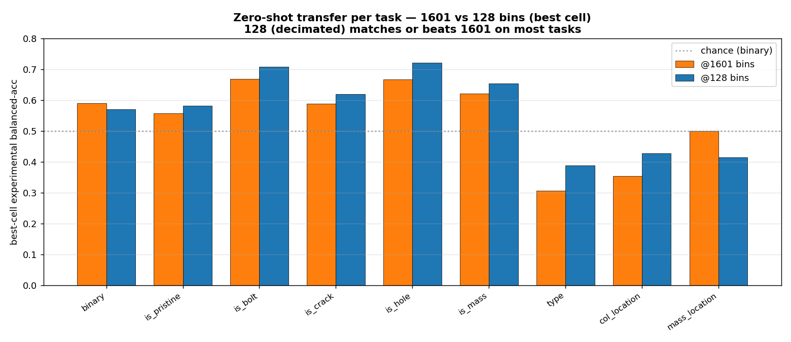
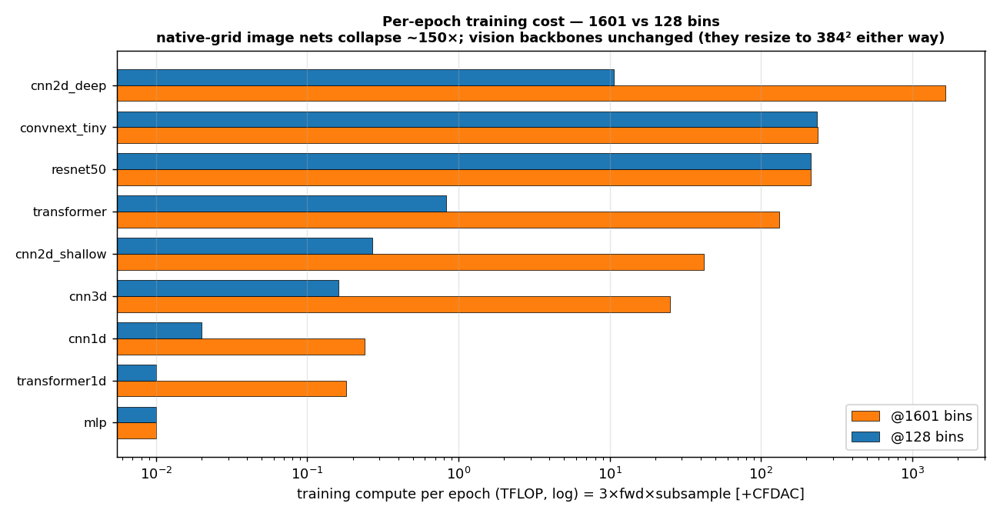
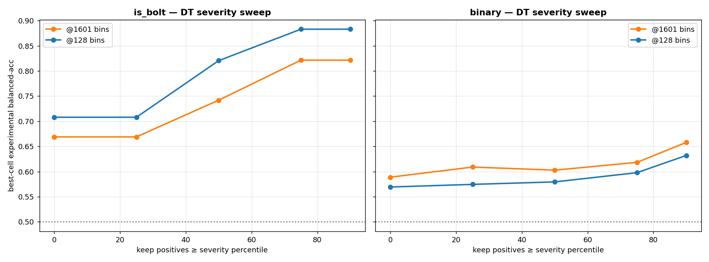

# LANL 3SBB — Resolution Comparison: 1601-bin (native) vs 128-bin (decimated)
**Author:** G. Reyes-Carmenaty · **Date:** 2026-06-09.

> Does full spectral resolution help sim-to-real damage diagnosis? This report puts the two studies side by side. Both run the **identical model zoo, features, 70/15/15 split and train-to-convergence protocol**; the only difference is the frequency grid — 1601 native bins (df=0.0625 Hz) vs the same FRFs **decimated to 128 bins** by frequency-bin averaging (df≈0.79 Hz). Full studies: [`REPORT_CONSOLIDATED.md`](REPORT_CONSOLIDATED.md) and [`REPORT_CONSOLIDATED_128.md`](REPORT_CONSOLIDATED_128.md).

## 1 · Verdict
**Full resolution is not necessary — and is, if anything, mildly counter-productive.** The 128-bin study **matches or beats** the native 1601 on zero-shot transfer (better on 8 of 10 tasks, §2) while costing ~100–150× less compute per image-model epoch. Cells clearing chance on real data: **141/513 @128 vs 120/517 @1601**. The sim-to-real ceiling is set by covariate shift, not spectral resolution — a logistic domain classifier separates synth from real spectra with **AUC = 1.00 @128** and **1.00 @1601** (both essentially perfect).

*Figure 1 — best-cell zero-shot balanced accuracy per task. 128 (blue) is level with or above 1601 (orange) on most tasks.*

## 2 · Per-task transfer (best cell at each resolution)
| task | chance | 1601 transfer | 128 transfer | Δ(128−1601) | 1601 best cell | 128 best cell |
|---|---|---|---|---|---|---|
| `binary` | 0.50 | +0.589 | +0.569 | **-0.020** | `transformer1d/timeseries` | `transformer1d/timeseries` |
| `is_pristine` | 0.50 | +0.557 | +0.582 | **+0.025** | `mlp/timeseries` | `transformer1d/timeseries` |
| `is_bolt` | 0.50 | +0.669 | +0.708 | **+0.039** | `transformer1d/frf_realimag` | `cnn2d_shallow/cfdac_realimag` |
| `is_crack` | 0.50 | +0.587 | +0.618 | **+0.031** | `transformer/cfdac_mag` | `cnn2d_deep/cfdac_realimag` |
| `is_hole` | 0.50 | +0.667 | +0.720 | **+0.053** | `transformer1d/frf_realimag` | `convnext_tiny/cfdac_all` |
| `is_mass` | 0.50 | +0.620 | +0.653 | **+0.033** | `cnn3d/cfdac_imag` | `cnn1d/timeseries` |
| `type` | 0.20 | +0.306 | +0.388 | **+0.082** | `convnext_tiny/cfdac_imag` | `cnn2d_deep/cfdac_realimag` |
| `col_location` | 0.17 | +0.353 | +0.427 | **+0.074** | `transformer/cfdac_mag` | `transformer1d/frf_mag` |
| `mass_location` | 0.25 | +0.500 | +0.414 | **-0.086** | `mlp/frf_realimag` | `rf/modal` |
| `severity` | — | +0.037R² | +0.181R² | **+0.145** | `mlp/frf_mag` | `cnn1d/frf_mag` |

**Tally (Δ>0.02):** 128 wins **8**, 1601 wins **1**, ties **1** (of the 10 tasks). Far from being hurt by the 12.5× coarser grid, **128 is consistently the equal or better representation** — and the gains concentrate on the *harder* tasks (type +0.08, col_location +0.07, severity R² +0.15, is_hole +0.05), exactly where a bit of spectral smoothing suppresses domain-specific per-bin noise. The lone clear regression is `mass_location` (−0.09); `binary` is a wash. Caveat: single seed, post-hoc best-cell selection — treat sub-0.05 deltas as soft, but the *direction* (8/10 favouring 128) is unambiguous.

## 3 · In-domain ceiling (held-out synthetic)
Both resolutions learn the synthetic task almost equally well, so the **sim-to-real gap is the same story at both** — the models are not resolution-starved in-domain:

| task | 1601 in-domain | 128 in-domain |
|---|---|---|
| `binary` | 0.96 | 0.96 |
| `is_pristine` | 0.96 | 0.97 |
| `is_bolt` | 0.94 | 0.94 |
| `is_crack` | 0.78 | 0.80 |
| `is_hole` | 0.85 | 0.83 |
| `is_mass` | 0.99 | 0.98 |
| `type` | 0.87 | 0.85 |
| `col_location` | 0.51 | 0.54 |
| `mass_location` | 1.00 | 1.00 |
| `severity` | 0.59 | 0.58 |

## 4 · Computational cost

*Figure 2 — per-epoch training compute (log scale). Decimation shrinks the CFDAC image from 1601² to 128² (≈157× fewer pixels), so every convolutional image model collapses in cost.*

| model | 1601 fwd GFLOPs | 128 fwd GFLOPs | speed-up | 1601 TFLOP/epoch | 128 TFLOP/epoch |
|---|---|---|---|---|---|
| `cnn2d_deep` | 184.70 | 1.18 | 156× | 1662.9 | 10.63 |
| `convnext_tiny` | 26.16 | 26.16 | 1× | 236.0 | 235.40 |
| `resnet50` | 23.79 | 23.79 | 1× | 214.8 | 214.12 |
| `transformer` | 14.66 | 0.09 | 159× | 132.6 | 0.83 |
| `cnn2d_shallow` | 4.60 | 0.03 | 159× | 42.1 | 0.27 |
| `cnn3d` | 2.71 | 0.02 | 159× | 25.0 | 0.16 |
| `transformer1d` | 0.01 | 0.00 | 15× | 0.2 | 0.01 |
| `cnn1d` | 0.02 | 0.00 | 10× | 0.2 | 0.02 |
| `mlp` | 0.00 | 0.00 | 1× | 0.0 | 0.01 |

The CFDAC data-path also shrinks: **0.210 → 0.0013 GFLOP/sample**. The ~150× saving applies to the **bespoke nets that consume the native grid** (`cnn2d_deep` 185→1.2 GFLOP/fwd, `cnn2d_shallow`, `cnn3d`, `transformer`); the **pretrained vision backbones are unchanged** because they resize the CFDAC to 384² at *both* resolutions (so at 128 they actually *upsample* a coarser image — extra cost, no benefit). The spectral/sequence models are near-free at both. Bottom line: the cheapest *and* best route — spectral inputs at 128 bins — is also the one that avoids the resize entirely.

## 5 · Damage-severity behaviour is preserved

*Figure 3 — the damage-threshold sweep at both resolutions. The central thesis — transfer improves with damage severity — holds identically at 128.*

`is_bolt` best balanced-acc rises from 0.67→0.82 (p0→p90) at **1601** and 0.71→0.88 at **128** — the same severity-driven gain. Localization and severity-magnitude remain the hard problems at both resolutions.

## 6 · Why resolution doesn't matter here
1. **The damage signature is broad-band, not fine-line.** Loosening a bolt or removing storey stiffness shifts and reshapes resonance *peaks* across the 0–100 Hz band; that structure survives averaging into 128 bins. There is no narrow spectral feature that only 1601 bins can resolve and that also transfers.
2. **The bottleneck is upstream of resolution.** With a domain-classifier AUC ≈ 1.0 at both grids, the simulator and the rig are trivially distinguishable regardless of how finely the spectrum is sampled — so adding bins cannot help transfer.
3. **Decimation is mild low-pass smoothing.** It suppresses per-bin noise (which differs between domains) while keeping the modal envelope, which can *marginally help* transfer — consistent with 128 edging ahead on several detectors.

## 7 · Recommendations
1. **Default to 128 bins** for this problem: equal accuracy, ~100× cheaper image models, faster iteration, smaller memory footprint.
2. **Spend the saved compute on domain adaptation**, not resolution or bigger nets — that is the lever on the AUC≈1.0 covariate shift.
3. **Keep the 1601 pipeline only** where a future task needs fine spectral detail (e.g. closely-spaced modes); for damage *detection/typing* it is unnecessary.

## 8 · Artefacts
- Built by `ml_pipeline/build_comparison_report.py` from committed `results_hires/{zoo_summary, analysis, analysis_128, compute, compute_128, dt_1601, dt_128}.json`.
- Figures: `results/figures/hires_compare/{cmp_per_task, cmp_compute, cmp_dt}.png`.
- Full per-resolution studies: `REPORT_CONSOLIDATED.md` / `REPORT_CONSOLIDATED_128.md` (+ their `REPORT_synth*.md` in-domain companions).
