# LANL 3SBB — Synth-to-Real Damage Diagnosis: Consolidated Report
**Author:** G. Carmenaty (PhD work, 2024–2026)  
**Date:** 2026-06-02  
**Scope:** Single source of truth. Supersedes every other `REPORT_*.md` in this directory (deprecation banners added to each).

---
## Executive summary
- Three synthetic-physics variants of the 3-storey bookcase benchmark are
  compared on the **same** 2 638-case experimental set under zero-shot
  transfer:
  - **v1** — baseline (`variation.py`); symmetric crack/hole; standard DR.
  - **v2** — widened domain randomisation (P1.2, `variation_v2.py`);
    asymmetric crack/hole (P2.1/P2.2).
  - **v2a** — disentangling ablation: v2's asymmetric damage geometry on
    v1's baseline DR.
- **244 cells** = (10 tasks) × (model, feature) combinations were trained
  on each variant for **3 seeds** (42 / 101 / 202), giving 244 × 3 × 3 =
  **2 196 individual model fits** behind the numbers in this report.
- **Verdict:**
  1. **v1 remains the reference.** It is robust and best-or-tied on
     localization.
  2. **v2 is REJECTED, multi-seed confirmed** — the `is_hole/mlp/modal`
     cell collapses to chance (BA 0.500) across all three seeds, and
     `mass_location` drops sharply.
  3. **v2a is REJECTED by its own pre-registered rule (C4 floor)** but
     only marginally. Crucially, v2a **identifies the cause** of v2's
     regression: the widened domain randomisation, **not** the asymmetric
     damage geometry. A separate widened-DR-only variant (v2b) is
     therefore unnecessary.
- **The bigger story** the cell-by-cell view reveals: the central
  synth-to-real failure is **detection** (`binary` / `is_pristine`), not
  any single variant. DT-stratification helps every classification axis
  *except* these two. The models can name a damage type when it is severe;
  they cannot reliably answer "is this damaged at all?".
- **Full-resolution CFDAC does not help (new).** A 1601² native-grid sweep
  (top CFDAC cell per task, synth regenerated at df = 0.0625 Hz) is **uniformly
  at-or-below** the 128² baseline on experimental data and mostly collapses to
  chance — see *§High-resolution 1601² CFDAC sweep*. The bottleneck is the
  sim-to-real covariate shift, not CFDAC resolution. The best real-data
  transfer is still the physics-grounded **`modal`-MLP** cells, not CFDAC images.

---
## Methodology
### Cells
A "cell" is one trained-and-evaluated model. Each cell is uniquely
determined by:

- **task** — what is being predicted (10 tasks; see per-task sections);
- **model** — architecture (mlp, cnn, cnn1d, cnn2d, rf, xgb, transformer);
- **feature** — input representation (modal, frf_mag, and 8 cfdac variants).

Not every combination is run — some are skipped where the feature is
incompatible with the model (e.g. cfdac_all on cnn1d). The 244 cells
that did run are the same across all 3 variants and all 3 seeds.

### Variants & seeds
| variant | domain randomisation | damage geometry | source script |
|---|---|---|---|
| v1  | baseline           | symmetric crack/hole         | `variation.py`     |
| v2  | **widened (P1.2)** | **asymmetric (P2.1/P2.2)**   | `variation_v2.py`  |
| v2a | baseline (= v1)    | **asymmetric (P2.1/P2.2)**   | `variation.py` + asymmetric placement |

Each variant was retrained for **seeds 42 / 101 / 202**. Reported "3-seed
mean ± sd" is across these three runs.

### Test set
The same 2 638-case experimental LANL 3SBB set is held fixed across all
variants/seeds — zero-shot synth-to-real transfer is the protocol.

### Metrics
- Binary tasks: **macro-F1** is the metric of record (the test set is
  82.5 % damaged on `binary`; accuracy is uninformative).
- Multi-class tasks: macro-F1 (chance varies by class count; per-task
  random baseline given inline).
- Regression (`severity`): **MAE** (lower is better).

### DT-stratification
A second analysis re-scores the same predictions while gradually removing
sub-threshold positives from the test set — the **damage threshold (DT)**
sweep. It answers: *within the domain of competence (severe damage),
what does each variant's best cell achieve?* This is exploratory
(post-hoc cell selection); it is hypothesis-generating, not confirmatory.

### Reproduce
```bash
python -m ml_pipeline.cells_aggregate         # 244-cell rollup
python -m ml_pipeline.dt_compare_variants     # DT sweep
python -m ml_pipeline.dt_feature_sweep        # per-damage-axis sweep
python -m ml_pipeline.plot_cell_zoo           # per-task bars (10 PNGs)
python -m ml_pipeline.plot_per_task_dt        # per-task DT curves (10 PNGs)
python -m ml_pipeline.plot_dt_3way            # cross-task figures (7 PNGs)
python -m ml_pipeline.build_consolidated_report  # regenerate this file
```

---
## Per-task review (10 tasks, 244 cells)
### 1. Damage detection — `binary` (any damage vs pristine)
**Question.** Given an experimental spectrum, is the structure damaged in any way (crack, hole, bolt loosening, or added mass) **or** pristine?
**Output axis.** presence/absence of any damage (model output → ŷ ∈ {0=pristine, 1=damaged})
**Notes.** Class prior on the 2 638-case set is 82.5 % damaged (2 176 damaged / 462 pristine). Accuracy is misleading; **macro-F1 is the metric of record**. A class-collapsed model (predicting all-damaged) scores accuracy 0.825 but macro-F1 ≈ 0.452. Random-balanced macro-F1 = 0.5.
**Cells in this task:** 26

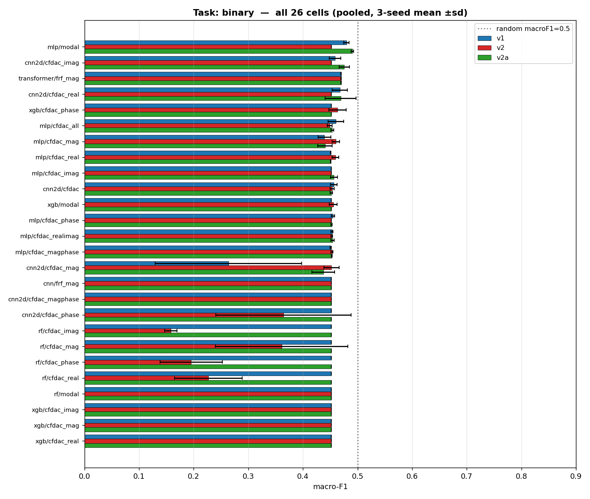

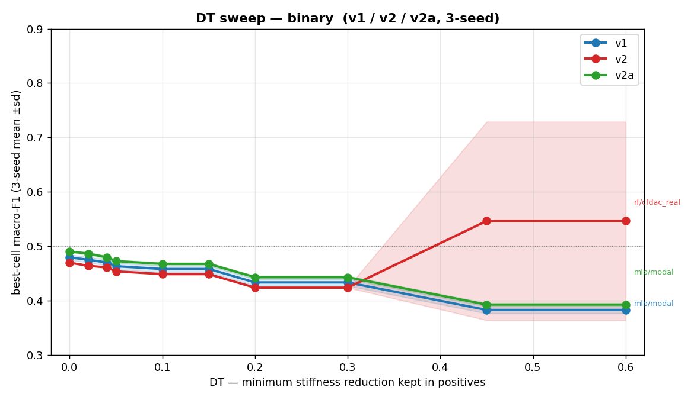

#### Cells in `binary`

Each cell shows what it explores, the 3-seed mean ± sd of macro-F1 per variant, and the cross-variant winner.

| cell | v1 | v2 | v2a | best | spread |
|---|---|---|---|---|---|
| `mlp/modal` | 0.480 ± 0.005 | 0.452 ± 0.000 | 0.491 ± 0.002 | **v2a** | 0.039 |
| `cnn2d/cfdac_imag` | 0.459 ± 0.011 | 0.452 ± 0.000 | 0.475 ± 0.010 | **v2a** | 0.023 |
| `transformer/frf_mag` | 0.470 ± 0.000 | 0.470 ± 0.000 | 0.470 ± 0.000 | **v2** | 0.000 |
| `cnn2d/cfdac_real` | 0.467 ± 0.014 | 0.452 ± 0.000 | 0.469 ± 0.028 | **v2a** | 0.017 |
| `xgb/cfdac_phase` | 0.452 ± 0.000 | 0.463 ± 0.016 | 0.452 ± 0.000 | **v2** | 0.011 |
| `mlp/cfdac_all` | 0.460 ± 0.014 | 0.449 ± 0.005 | 0.454 ± 0.003 | **v1** | 0.012 |
| `mlp/cfdac_mag` | 0.439 ± 0.012 | 0.460 ± 0.007 | 0.440 ± 0.013 | **v2** | 0.021 |
| `mlp/cfdac_real` | 0.451 ± 0.000 | 0.459 ± 0.006 | 0.451 ± 0.000 | **v2** | 0.009 |
| `mlp/cfdac_imag` | 0.452 ± 0.000 | 0.452 ± 0.000 | 0.457 ± 0.006 | **v2a** | 0.005 |
| `cnn2d/cfdac` | 0.456 ± 0.006 | 0.453 ± 0.004 | 0.452 ± 0.002 | **v1** | 0.005 |
| `xgb/modal` | 0.452 ± 0.000 | 0.455 ± 0.007 | 0.452 ± 0.000 | **v2** | 0.003 |
| `mlp/cfdac_phase` | 0.455 ± 0.003 | 0.452 ± 0.000 | 0.453 ± 0.001 | **v1** | 0.003 |
| `mlp/cfdac_realimag` | 0.453 ± 0.002 | 0.453 ± 0.002 | 0.454 ± 0.003 | **v2a** | 0.001 |
| `mlp/cfdac_magphase` | 0.451 ± 0.001 | 0.453 ± 0.002 | 0.453 ± 0.001 | **v2** | 0.002 |
| `cnn2d/cfdac_mag` | 0.264 ± 0.134 | 0.452 ± 0.014 | 0.437 ± 0.021 | **v2** | 0.189 |
| `cnn/frf_mag` | 0.452 ± 0.000 | 0.452 ± 0.000 | 0.452 ± 0.000 | **v1** | 0.000 |
| `cnn2d/cfdac_magphase` | 0.452 ± 0.000 | 0.452 ± 0.000 | 0.452 ± 0.000 | **v1** | 0.000 |
| `cnn2d/cfdac_phase` | 0.452 ± 0.000 | 0.364 ± 0.124 | 0.452 ± 0.000 | **v1** | 0.088 |
| `rf/cfdac_imag` | 0.452 ± 0.000 | 0.158 ± 0.011 | 0.452 ± 0.000 | **v1** | 0.294 |
| `rf/cfdac_mag` | 0.452 ± 0.000 | 0.361 ± 0.121 | 0.452 ± 0.000 | **v1** | 0.091 |
| `rf/cfdac_phase` | 0.452 ± 0.000 | 0.195 ± 0.057 | 0.452 ± 0.000 | **v1** | 0.257 |
| `rf/cfdac_real` | 0.452 ± 0.000 | 0.227 ± 0.062 | 0.452 ± 0.000 | **v1** | 0.225 |
| `rf/modal` | 0.452 ± 0.000 | 0.452 ± 0.000 | 0.452 ± 0.000 | **v1** | 0.000 |
| `xgb/cfdac_imag` | 0.452 ± 0.000 | 0.452 ± 0.000 | 0.452 ± 0.000 | **v1** | 0.000 |
| `xgb/cfdac_mag` | 0.452 ± 0.000 | 0.452 ± 0.000 | 0.452 ± 0.000 | **v1** | 0.000 |
| `xgb/cfdac_real` | 0.452 ± 0.000 | 0.452 ± 0.000 | 0.452 ± 0.000 | **v1** | 0.000 |

##### Cell-by-cell

- **`mlp/modal`** — **mlp** (fully connected baseline (3 hidden layers); fast, low capacity) on **modal** (physics-grounded — extracted natural frequencies + damping ratios + mode shapes).  
  macro-F1 — v1: 0.480 ± 0.005 · v2: 0.452 ± 0.000 · v2a: 0.491 ± 0.002.  
  Best variant: **v2a** (spread 0.039).  
  Secondary (v1): BA = 0.511, TPR = 0.991, TNR = 0.031.
- **`cnn2d/cfdac_imag`** — **cnn2d** (2-D CNN treating the feature as a (channel × bin) image) on **cfdac_imag** (imaginary part only of CFDAC).  
  macro-F1 — v1: 0.459 ± 0.011 · v2: 0.452 ± 0.000 · v2a: 0.475 ± 0.010.  
  Best variant: **v2a** (spread 0.023).  
  Secondary (v1): BA = 0.483, TPR = 0.931, TNR = 0.035.
- **`transformer/frf_mag`** — **transformer** (small self-attention encoder; captures long-range spectral structure) on **frf_mag** (FRF magnitude across frequency bins — what most damage indicators key on).  
  macro-F1 — v1: 0.470 ± 0.000 · v2: 0.470 ± 0.000 · v2a: 0.470 ± 0.000.  
  Best variant: **v2** (spread 0.000).  
  Secondary (v1): BA = 0.504, TPR = 0.987, TNR = 0.022.
- **`cnn2d/cfdac_real`** — **cnn2d** (2-D CNN treating the feature as a (channel × bin) image) on **cfdac_real** (real part only of CFDAC).  
  macro-F1 — v1: 0.467 ± 0.014 · v2: 0.452 ± 0.000 · v2a: 0.469 ± 0.028.  
  Best variant: **v2a** (spread 0.017).  
  Secondary (v1): BA = 0.497, TPR = 0.962, TNR = 0.032.
- **`xgb/cfdac_phase`** — **xgb** (gradient-boosted trees; usually pairs best with hand-crafted modal features) on **cfdac_phase** (phase of CFDAC).  
  macro-F1 — v1: 0.452 ± 0.000 · v2: 0.463 ± 0.016 · v2a: 0.452 ± 0.000.  
  Best variant: **v2** (spread 0.011).  
  Secondary (v1): BA = 0.500, TPR = 1.000, TNR = 0.000.
- **`mlp/cfdac_all`** — **mlp** (fully connected baseline (3 hidden layers); fast, low capacity) on **cfdac_all** (all 4 CFDAC channels stacked).  
  macro-F1 — v1: 0.460 ± 0.014 · v2: 0.449 ± 0.005 · v2a: 0.454 ± 0.003.  
  Best variant: **v1** (spread 0.012).  
  Secondary (v1): BA = 0.498, TPR = 0.980, TNR = 0.016.
- **`mlp/cfdac_mag`** — **mlp** (fully connected baseline (3 hidden layers); fast, low capacity) on **cfdac_mag** (magnitude of CFDAC).  
  macro-F1 — v1: 0.439 ± 0.012 · v2: 0.460 ± 0.007 · v2a: 0.440 ± 0.013.  
  Best variant: **v2** (spread 0.021).  
  Secondary (v1): BA = 0.451, TPR = 0.867, TNR = 0.035.
- **`mlp/cfdac_real`** — **mlp** (fully connected baseline (3 hidden layers); fast, low capacity) on **cfdac_real** (real part only of CFDAC).  
  macro-F1 — v1: 0.451 ± 0.000 · v2: 0.459 ± 0.006 · v2a: 0.451 ± 0.000.  
  Best variant: **v2** (spread 0.009).  
  Secondary (v1): BA = 0.498, TPR = 0.996, TNR = 0.000.
- **`mlp/cfdac_imag`** — **mlp** (fully connected baseline (3 hidden layers); fast, low capacity) on **cfdac_imag** (imaginary part only of CFDAC).  
  macro-F1 — v1: 0.452 ± 0.000 · v2: 0.452 ± 0.000 · v2a: 0.457 ± 0.006.  
  Best variant: **v2a** (spread 0.005).  
  Secondary (v1): BA = 0.500, TPR = 1.000, TNR = 0.000.
- **`cnn2d/cfdac`** — **cnn2d** (2-D CNN treating the feature as a (channel × bin) image) on **cfdac** (Cross-FRF Damage Assurance Criterion — pristine-vs-current FRF alignment image).  
  macro-F1 — v1: 0.456 ± 0.006 · v2: 0.453 ± 0.004 · v2a: 0.452 ± 0.002.  
  Best variant: **v1** (spread 0.005).  
  Secondary (v1): BA = 0.487, TPR = 0.951, TNR = 0.022.
- **`xgb/modal`** — **xgb** (gradient-boosted trees; usually pairs best with hand-crafted modal features) on **modal** (physics-grounded — extracted natural frequencies + damping ratios + mode shapes).  
  macro-F1 — v1: 0.452 ± 0.000 · v2: 0.455 ± 0.007 · v2a: 0.452 ± 0.000.  
  Best variant: **v2** (spread 0.003).  
  Secondary (v1): BA = 0.500, TPR = 1.000, TNR = 0.000.
- **`mlp/cfdac_phase`** — **mlp** (fully connected baseline (3 hidden layers); fast, low capacity) on **cfdac_phase** (phase of CFDAC).  
  macro-F1 — v1: 0.455 ± 0.003 · v2: 0.452 ± 0.000 · v2a: 0.453 ± 0.001.  
  Best variant: **v1** (spread 0.003).  
  Secondary (v1): BA = 0.500, TPR = 0.996, TNR = 0.004.
- **`mlp/cfdac_realimag`** — **mlp** (fully connected baseline (3 hidden layers); fast, low capacity) on **cfdac_realimag** (real and imaginary CFDAC concatenated).  
  macro-F1 — v1: 0.453 ± 0.002 · v2: 0.453 ± 0.002 · v2a: 0.454 ± 0.003.  
  Best variant: **v2a** (spread 0.001).  
  Secondary (v1): BA = 0.498, TPR = 0.994, TNR = 0.003.
- **`mlp/cfdac_magphase`** — **mlp** (fully connected baseline (3 hidden layers); fast, low capacity) on **cfdac_magphase** (magnitude and phase CFDAC concatenated).  
  macro-F1 — v1: 0.451 ± 0.001 · v2: 0.453 ± 0.002 · v2a: 0.453 ± 0.001.  
  Best variant: **v2** (spread 0.002).  
  Secondary (v1): BA = 0.492, TPR = 0.978, TNR = 0.006.
- **`cnn2d/cfdac_mag`** — **cnn2d** (2-D CNN treating the feature as a (channel × bin) image) on **cfdac_mag** (magnitude of CFDAC).  
  macro-F1 — v1: 0.264 ± 0.134 · v2: 0.452 ± 0.014 · v2a: 0.437 ± 0.021.  
  Best variant: **v2** (spread 0.189).  
  Secondary (v1): BA = 0.498, TPR = 0.348, TNR = 0.648.
- **`cnn/frf_mag`** — **cnn** (1-D convolutional net on the feature sequence; learns local spectral motifs) on **frf_mag** (FRF magnitude across frequency bins — what most damage indicators key on).  
  macro-F1 — v1: 0.452 ± 0.000 · v2: 0.452 ± 0.000 · v2a: 0.452 ± 0.000.  
  Best variant: **v1** (spread 0.000).  
  Secondary (v1): BA = 0.500, TPR = 1.000, TNR = 0.000.
- **`cnn2d/cfdac_magphase`** — **cnn2d** (2-D CNN treating the feature as a (channel × bin) image) on **cfdac_magphase** (magnitude and phase CFDAC concatenated).  
  macro-F1 — v1: 0.452 ± 0.000 · v2: 0.452 ± 0.000 · v2a: 0.452 ± 0.000.  
  Best variant: **v1** (spread 0.000).  
  Secondary (v1): BA = 0.500, TPR = 1.000, TNR = 0.000.
- **`cnn2d/cfdac_phase`** — **cnn2d** (2-D CNN treating the feature as a (channel × bin) image) on **cfdac_phase** (phase of CFDAC).  
  macro-F1 — v1: 0.452 ± 0.000 · v2: 0.364 ± 0.124 · v2a: 0.452 ± 0.000.  
  Best variant: **v1** (spread 0.088).  
  Secondary (v1): BA = 0.500, TPR = 1.000, TNR = 0.000.
- **`rf/cfdac_imag`** — **rf** (random forest on flattened feature; robust non-parametric baseline) on **cfdac_imag** (imaginary part only of CFDAC).  
  macro-F1 — v1: 0.452 ± 0.000 · v2: 0.158 ± 0.011 · v2a: 0.452 ± 0.000.  
  Best variant: **v1** (spread 0.294).  
  Secondary (v1): BA = 0.500, TPR = 1.000, TNR = 0.000.
- **`rf/cfdac_mag`** — **rf** (random forest on flattened feature; robust non-parametric baseline) on **cfdac_mag** (magnitude of CFDAC).  
  macro-F1 — v1: 0.452 ± 0.000 · v2: 0.361 ± 0.121 · v2a: 0.452 ± 0.000.  
  Best variant: **v1** (spread 0.091).  
  Secondary (v1): BA = 0.500, TPR = 1.000, TNR = 0.000.
- **`rf/cfdac_phase`** — **rf** (random forest on flattened feature; robust non-parametric baseline) on **cfdac_phase** (phase of CFDAC).  
  macro-F1 — v1: 0.452 ± 0.000 · v2: 0.195 ± 0.057 · v2a: 0.452 ± 0.000.  
  Best variant: **v1** (spread 0.257).  
  Secondary (v1): BA = 0.500, TPR = 1.000, TNR = 0.000.
- **`rf/cfdac_real`** — **rf** (random forest on flattened feature; robust non-parametric baseline) on **cfdac_real** (real part only of CFDAC).  
  macro-F1 — v1: 0.452 ± 0.000 · v2: 0.227 ± 0.062 · v2a: 0.452 ± 0.000.  
  Best variant: **v1** (spread 0.225).  
  Secondary (v1): BA = 0.500, TPR = 1.000, TNR = 0.000.
- **`rf/modal`** — **rf** (random forest on flattened feature; robust non-parametric baseline) on **modal** (physics-grounded — extracted natural frequencies + damping ratios + mode shapes).  
  macro-F1 — v1: 0.452 ± 0.000 · v2: 0.452 ± 0.000 · v2a: 0.452 ± 0.000.  
  Best variant: **v1** (spread 0.000).  
  Secondary (v1): BA = 0.500, TPR = 1.000, TNR = 0.000.
- **`xgb/cfdac_imag`** — **xgb** (gradient-boosted trees; usually pairs best with hand-crafted modal features) on **cfdac_imag** (imaginary part only of CFDAC).  
  macro-F1 — v1: 0.452 ± 0.000 · v2: 0.452 ± 0.000 · v2a: 0.452 ± 0.000.  
  Best variant: **v1** (spread 0.000).  
  Secondary (v1): BA = 0.500, TPR = 1.000, TNR = 0.000.
- **`xgb/cfdac_mag`** — **xgb** (gradient-boosted trees; usually pairs best with hand-crafted modal features) on **cfdac_mag** (magnitude of CFDAC).  
  macro-F1 — v1: 0.452 ± 0.000 · v2: 0.452 ± 0.000 · v2a: 0.452 ± 0.000.  
  Best variant: **v1** (spread 0.000).  
  Secondary (v1): BA = 0.500, TPR = 1.000, TNR = 0.000.
- **`xgb/cfdac_real`** — **xgb** (gradient-boosted trees; usually pairs best with hand-crafted modal features) on **cfdac_real** (real part only of CFDAC).  
  macro-F1 — v1: 0.452 ± 0.000 · v2: 0.452 ± 0.000 · v2a: 0.452 ± 0.000.  
  Best variant: **v1** (spread 0.000).  
  Secondary (v1): BA = 0.500, TPR = 1.000, TNR = 0.000.

---
### 2. Column-location classification — `col_location`
**Question.** Which column section is damaged (multi-class spatial localization)?
**Output axis.** 9 column sections (3 columns × 3 tiers)
**Notes.** Random = 1/9 ≈ 0.111. Spatial localization probes whether the spectrum encodes 'where' as well as 'what'. v2 specifically degrades here; v2a (asymmetric damage + v1 DR) is the **best** localizer.
**Cells in this task:** 22

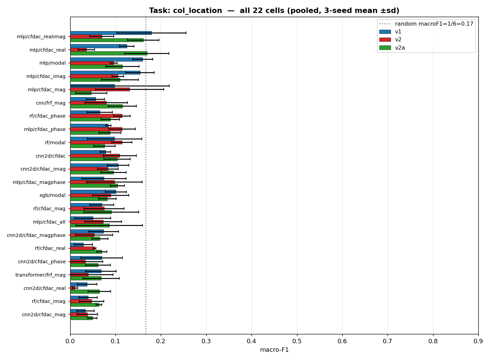

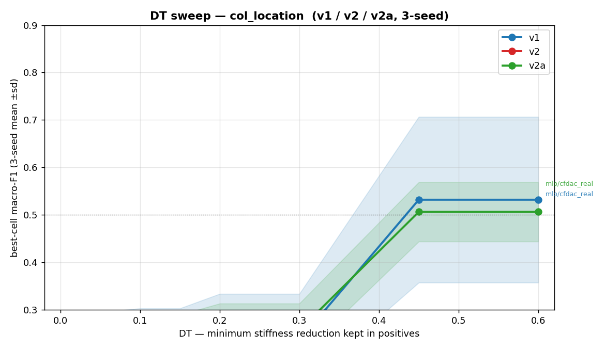

#### Cells in `col_location`

Each cell shows what it explores, the 3-seed mean ± sd of macro-F1 per variant, and the cross-variant winner.

| cell | v1 | v2 | v2a | best | spread |
|---|---|---|---|---|---|
| `mlp/cfdac_realimag` | 0.179 ± 0.077 | 0.070 ± 0.026 | 0.161 ± 0.035 | **v1** | 0.110 |
| `mlp/cfdac_real` | 0.125 ± 0.016 | 0.036 ± 0.018 | 0.169 ± 0.048 | **v2a** | 0.133 |
| `mlp/modal` | 0.160 ± 0.022 | 0.096 ± 0.008 | 0.115 ± 0.037 | **v1** | 0.064 |
| `mlp/cfdac_imag` | 0.154 ± 0.031 | 0.105 ± 0.013 | 0.110 ± 0.041 | **v1** | 0.049 |
| `mlp/cfdac_mag` | 0.098 ± 0.121 | 0.131 ± 0.075 | 0.047 ± 0.034 | **v2** | 0.085 |
| `cnn/frf_mag` | 0.056 ± 0.020 | 0.079 ± 0.047 | 0.115 ± 0.031 | **v2a** | 0.059 |
| `rf/cfdac_phase` | 0.065 ± 0.028 | 0.114 ± 0.018 | 0.089 ± 0.020 | **v2** | 0.049 |
| `mlp/cfdac_phase` | 0.084 ± 0.005 | 0.114 ± 0.029 | 0.088 ± 0.024 | **v2** | 0.030 |
| `rf/modal` | 0.098 ± 0.060 | 0.114 ± 0.022 | 0.076 ± 0.024 | **v2** | 0.038 |
| `cnn2d/cfdac` | 0.078 ± 0.012 | 0.109 ± 0.036 | 0.103 ± 0.029 | **v2** | 0.031 |
| `cnn2d/cfdac_imag` | 0.106 ± 0.024 | 0.083 ± 0.023 | 0.096 ± 0.028 | **v1** | 0.023 |
| `mlp/cfdac_magphase` | 0.075 ± 0.049 | 0.098 ± 0.061 | 0.104 ± 0.015 | **v2a** | 0.030 |
| `xgb/modal` | 0.101 ± 0.023 | 0.089 ± 0.040 | 0.082 ± 0.019 | **v1** | 0.019 |
| `rf/cfdac_mag` | 0.070 ± 0.027 | 0.075 ± 0.044 | 0.091 ± 0.061 | **v2a** | 0.021 |
| `mlp/cfdac_all` | 0.050 ± 0.040 | 0.073 ± 0.041 | 0.086 ± 0.073 | **v2a** | 0.036 |
| `cnn2d/cfdac_magphase` | 0.074 ± 0.033 | 0.053 ± 0.041 | 0.065 ± 0.018 | **v1** | 0.020 |
| `rf/cfdac_real` | 0.029 ± 0.020 | 0.054 ± 0.003 | 0.070 ± 0.011 | **v2a** | 0.041 |
| `cnn2d/cfdac_phase` | 0.069 ± 0.046 | 0.034 ± 0.038 | 0.061 ± 0.027 | **v1** | 0.036 |
| `transformer/frf_mag` | 0.068 ± 0.033 | 0.040 ± 0.055 | 0.068 ± 0.040 | **v2a** | 0.028 |
| `cnn2d/cfdac_real` | 0.037 ± 0.022 | 0.011 ± 0.006 | 0.065 ± 0.025 | **v2a** | 0.054 |
| `rf/cfdac_imag` | 0.039 ± 0.020 | 0.047 ± 0.027 | 0.063 ± 0.006 | **v2a** | 0.024 |
| `cnn2d/cfdac_mag` | 0.034 ± 0.019 | 0.038 ± 0.022 | 0.049 ± 0.010 | **v2a** | 0.015 |

##### Cell-by-cell

- **`mlp/cfdac_realimag`** — **mlp** (fully connected baseline (3 hidden layers); fast, low capacity) on **cfdac_realimag** (real and imaginary CFDAC concatenated).  
  macro-F1 — v1: 0.179 ± 0.077 · v2: 0.070 ± 0.026 · v2a: 0.161 ± 0.035.  
  Best variant: **v1** (spread 0.110).  
  Secondary (v1): BA = 0.217, acc = 0.431.
- **`mlp/cfdac_real`** — **mlp** (fully connected baseline (3 hidden layers); fast, low capacity) on **cfdac_real** (real part only of CFDAC).  
  macro-F1 — v1: 0.125 ± 0.016 · v2: 0.036 ± 0.018 · v2a: 0.169 ± 0.048.  
  Best variant: **v2a** (spread 0.133).  
  Secondary (v1): BA = 0.224, acc = 0.206.
- **`mlp/modal`** — **mlp** (fully connected baseline (3 hidden layers); fast, low capacity) on **modal** (physics-grounded — extracted natural frequencies + damping ratios + mode shapes).  
  macro-F1 — v1: 0.160 ± 0.022 · v2: 0.096 ± 0.008 · v2a: 0.115 ± 0.037.  
  Best variant: **v1** (spread 0.064).  
  Secondary (v1): BA = 0.179, acc = 0.306.
- **`mlp/cfdac_imag`** — **mlp** (fully connected baseline (3 hidden layers); fast, low capacity) on **cfdac_imag** (imaginary part only of CFDAC).  
  macro-F1 — v1: 0.154 ± 0.031 · v2: 0.105 ± 0.013 · v2a: 0.110 ± 0.041.  
  Best variant: **v1** (spread 0.049).  
  Secondary (v1): BA = 0.219, acc = 0.273.
- **`mlp/cfdac_mag`** — **mlp** (fully connected baseline (3 hidden layers); fast, low capacity) on **cfdac_mag** (magnitude of CFDAC).  
  macro-F1 — v1: 0.098 ± 0.121 · v2: 0.131 ± 0.075 · v2a: 0.047 ± 0.034.  
  Best variant: **v2** (spread 0.085).  
  Secondary (v1): BA = 0.120, acc = 0.165.
- **`cnn/frf_mag`** — **cnn** (1-D convolutional net on the feature sequence; learns local spectral motifs) on **frf_mag** (FRF magnitude across frequency bins — what most damage indicators key on).  
  macro-F1 — v1: 0.056 ± 0.020 · v2: 0.079 ± 0.047 · v2a: 0.115 ± 0.031.  
  Best variant: **v2a** (spread 0.059).  
  Secondary (v1): BA = 0.163, acc = 0.121.
- **`rf/cfdac_phase`** — **rf** (random forest on flattened feature; robust non-parametric baseline) on **cfdac_phase** (phase of CFDAC).  
  macro-F1 — v1: 0.065 ± 0.028 · v2: 0.114 ± 0.018 · v2a: 0.089 ± 0.020.  
  Best variant: **v2** (spread 0.049).  
  Secondary (v1): BA = 0.150, acc = 0.108.
- **`mlp/cfdac_phase`** — **mlp** (fully connected baseline (3 hidden layers); fast, low capacity) on **cfdac_phase** (phase of CFDAC).  
  macro-F1 — v1: 0.084 ± 0.005 · v2: 0.114 ± 0.029 · v2a: 0.088 ± 0.024.  
  Best variant: **v2** (spread 0.030).  
  Secondary (v1): BA = 0.081, acc = 0.156.
- **`rf/modal`** — **rf** (random forest on flattened feature; robust non-parametric baseline) on **modal** (physics-grounded — extracted natural frequencies + damping ratios + mode shapes).  
  macro-F1 — v1: 0.098 ± 0.060 · v2: 0.114 ± 0.022 · v2a: 0.076 ± 0.024.  
  Best variant: **v2** (spread 0.038).  
  Secondary (v1): BA = 0.240, acc = 0.136.
- **`cnn2d/cfdac`** — **cnn2d** (2-D CNN treating the feature as a (channel × bin) image) on **cfdac** (Cross-FRF Damage Assurance Criterion — pristine-vs-current FRF alignment image).  
  macro-F1 — v1: 0.078 ± 0.012 · v2: 0.109 ± 0.036 · v2a: 0.103 ± 0.029.  
  Best variant: **v2** (spread 0.031).  
  Secondary (v1): BA = 0.124, acc = 0.181.
- **`cnn2d/cfdac_imag`** — **cnn2d** (2-D CNN treating the feature as a (channel × bin) image) on **cfdac_imag** (imaginary part only of CFDAC).  
  macro-F1 — v1: 0.106 ± 0.024 · v2: 0.083 ± 0.023 · v2a: 0.096 ± 0.028.  
  Best variant: **v1** (spread 0.023).  
  Secondary (v1): BA = 0.173, acc = 0.215.
- **`mlp/cfdac_magphase`** — **mlp** (fully connected baseline (3 hidden layers); fast, low capacity) on **cfdac_magphase** (magnitude and phase CFDAC concatenated).  
  macro-F1 — v1: 0.075 ± 0.049 · v2: 0.098 ± 0.061 · v2a: 0.104 ± 0.015.  
  Best variant: **v2a** (spread 0.030).  
  Secondary (v1): BA = 0.101, acc = 0.227.
- **`xgb/modal`** — **xgb** (gradient-boosted trees; usually pairs best with hand-crafted modal features) on **modal** (physics-grounded — extracted natural frequencies + damping ratios + mode shapes).  
  macro-F1 — v1: 0.101 ± 0.023 · v2: 0.089 ± 0.040 · v2a: 0.082 ± 0.019.  
  Best variant: **v1** (spread 0.019).  
  Secondary (v1): BA = 0.177, acc = 0.153.
- **`rf/cfdac_mag`** — **rf** (random forest on flattened feature; robust non-parametric baseline) on **cfdac_mag** (magnitude of CFDAC).  
  macro-F1 — v1: 0.070 ± 0.027 · v2: 0.075 ± 0.044 · v2a: 0.091 ± 0.061.  
  Best variant: **v2a** (spread 0.021).  
  Secondary (v1): BA = 0.083, acc = 0.176.
- **`mlp/cfdac_all`** — **mlp** (fully connected baseline (3 hidden layers); fast, low capacity) on **cfdac_all** (all 4 CFDAC channels stacked).  
  macro-F1 — v1: 0.050 ± 0.040 · v2: 0.073 ± 0.041 · v2a: 0.086 ± 0.073.  
  Best variant: **v2a** (spread 0.036).  
  Secondary (v1): BA = 0.077, acc = 0.109.
- **`cnn2d/cfdac_magphase`** — **cnn2d** (2-D CNN treating the feature as a (channel × bin) image) on **cfdac_magphase** (magnitude and phase CFDAC concatenated).  
  macro-F1 — v1: 0.074 ± 0.033 · v2: 0.053 ± 0.041 · v2a: 0.065 ± 0.018.  
  Best variant: **v1** (spread 0.020).  
  Secondary (v1): BA = 0.179, acc = 0.162.
- **`rf/cfdac_real`** — **rf** (random forest on flattened feature; robust non-parametric baseline) on **cfdac_real** (real part only of CFDAC).  
  macro-F1 — v1: 0.029 ± 0.020 · v2: 0.054 ± 0.003 · v2a: 0.070 ± 0.011.  
  Best variant: **v2a** (spread 0.041).  
  Secondary (v1): BA = 0.132, acc = 0.074.
- **`cnn2d/cfdac_phase`** — **cnn2d** (2-D CNN treating the feature as a (channel × bin) image) on **cfdac_phase** (phase of CFDAC).  
  macro-F1 — v1: 0.069 ± 0.046 · v2: 0.034 ± 0.038 · v2a: 0.061 ± 0.027.  
  Best variant: **v1** (spread 0.036).  
  Secondary (v1): BA = 0.167, acc = 0.217.
- **`transformer/frf_mag`** — **transformer** (small self-attention encoder; captures long-range spectral structure) on **frf_mag** (FRF magnitude across frequency bins — what most damage indicators key on).  
  macro-F1 — v1: 0.068 ± 0.033 · v2: 0.040 ± 0.055 · v2a: 0.068 ± 0.040.  
  Best variant: **v2a** (spread 0.028).  
  Secondary (v1): BA = 0.072, acc = 0.162.
- **`cnn2d/cfdac_real`** — **cnn2d** (2-D CNN treating the feature as a (channel × bin) image) on **cfdac_real** (real part only of CFDAC).  
  macro-F1 — v1: 0.037 ± 0.022 · v2: 0.011 ± 0.006 · v2a: 0.065 ± 0.025.  
  Best variant: **v2a** (spread 0.054).  
  Secondary (v1): BA = 0.155, acc = 0.105.
- **`rf/cfdac_imag`** — **rf** (random forest on flattened feature; robust non-parametric baseline) on **cfdac_imag** (imaginary part only of CFDAC).  
  macro-F1 — v1: 0.039 ± 0.020 · v2: 0.047 ± 0.027 · v2a: 0.063 ± 0.006.  
  Best variant: **v2a** (spread 0.024).  
  Secondary (v1): BA = 0.131, acc = 0.078.
- **`cnn2d/cfdac_mag`** — **cnn2d** (2-D CNN treating the feature as a (channel × bin) image) on **cfdac_mag** (magnitude of CFDAC).  
  macro-F1 — v1: 0.034 ± 0.019 · v2: 0.038 ± 0.022 · v2a: 0.049 ± 0.010.  
  Best variant: **v2a** (spread 0.015).  
  Secondary (v1): BA = 0.167, acc = 0.117.

---
### 3. Bolt-loosening detection — `is_bolt`
**Question.** Does this spectrum exhibit bolt-loosening damage?
**Output axis.** positives = bolt-loosening cases; negatives = pristine + all other damage types
**Notes.** Strongest learnable axis in the study: at high loosening percentage (≥ 85 %), best cells reach ≥ 0.82 macro-F1 across all three variants. Random = 0.5.
**Cells in this task:** 26

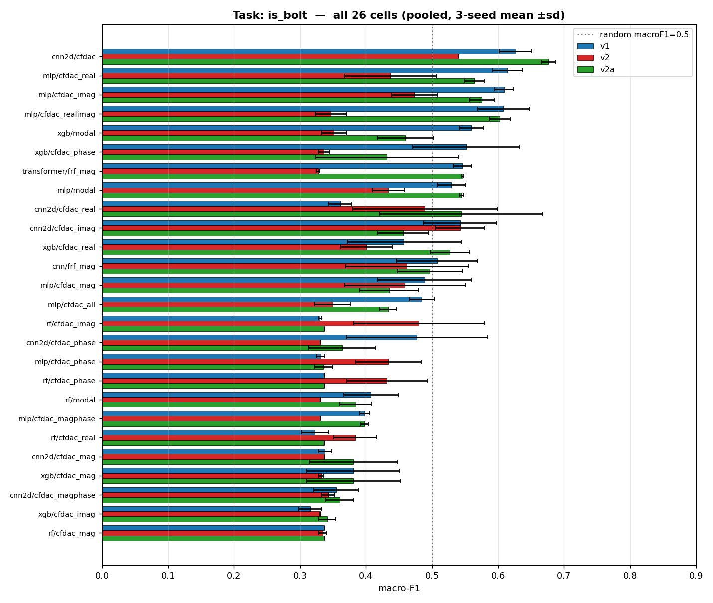

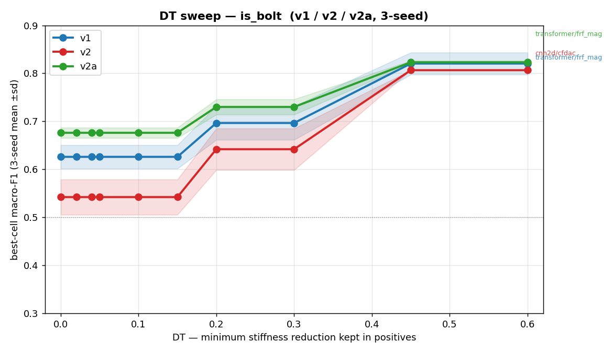

#### Cells in `is_bolt`

Each cell shows what it explores, the 3-seed mean ± sd of macro-F1 per variant, and the cross-variant winner.

| cell | v1 | v2 | v2a | best | spread |
|---|---|---|---|---|---|
| `cnn2d/cfdac` | 0.626 ± 0.025 | 0.540 ± 0.000 | 0.676 ± 0.011 | **v2a** | 0.136 |
| `mlp/cfdac_real` | 0.614 ± 0.023 | 0.437 ± 0.071 | 0.564 ± 0.015 | **v1** | 0.177 |
| `mlp/cfdac_imag` | 0.609 ± 0.014 | 0.473 ± 0.034 | 0.575 ± 0.019 | **v1** | 0.136 |
| `mlp/cfdac_realimag` | 0.608 ± 0.039 | 0.346 ± 0.024 | 0.602 ± 0.016 | **v1** | 0.261 |
| `xgb/modal` | 0.559 ± 0.018 | 0.351 ± 0.019 | 0.460 ± 0.043 | **v1** | 0.208 |
| `xgb/cfdac_phase` | 0.551 ± 0.080 | 0.336 ± 0.008 | 0.431 ± 0.109 | **v1** | 0.215 |
| `transformer/frf_mag` | 0.546 ± 0.014 | 0.327 ± 0.002 | 0.547 ± 0.002 | **v2a** | 0.220 |
| `mlp/modal` | 0.529 ± 0.021 | 0.434 ± 0.024 | 0.544 ± 0.003 | **v2a** | 0.110 |
| `cnn2d/cfdac_real` | 0.360 ± 0.017 | 0.489 ± 0.110 | 0.544 ± 0.124 | **v2a** | 0.184 |
| `cnn2d/cfdac_imag` | 0.542 ± 0.056 | 0.542 ± 0.037 | 0.457 ± 0.038 | **v2** | 0.086 |
| `xgb/cfdac_real` | 0.457 ± 0.086 | 0.401 ± 0.039 | 0.526 ± 0.029 | **v2a** | 0.126 |
| `cnn/frf_mag` | 0.508 ± 0.062 | 0.462 ± 0.093 | 0.497 ± 0.049 | **v1** | 0.046 |
| `mlp/cfdac_mag` | 0.489 ± 0.071 | 0.459 ± 0.091 | 0.435 ± 0.044 | **v1** | 0.053 |
| `mlp/cfdac_all` | 0.485 ± 0.018 | 0.349 ± 0.027 | 0.434 ± 0.013 | **v1** | 0.135 |
| `rf/cfdac_imag` | 0.330 ± 0.002 | 0.480 ± 0.099 | 0.336 ± 0.000 | **v2** | 0.150 |
| `cnn2d/cfdac_phase` | 0.477 ± 0.107 | 0.330 ± 0.000 | 0.363 ± 0.050 | **v1** | 0.147 |
| `mlp/cfdac_phase` | 0.331 ± 0.006 | 0.434 ± 0.050 | 0.335 ± 0.014 | **v2** | 0.103 |
| `rf/cfdac_phase` | 0.337 ± 0.000 | 0.432 ± 0.061 | 0.337 ± 0.000 | **v2** | 0.095 |
| `rf/modal` | 0.408 ± 0.042 | 0.330 ± 0.000 | 0.384 ± 0.025 | **v1** | 0.077 |
| `mlp/cfdac_magphase` | 0.398 ± 0.007 | 0.330 ± 0.000 | 0.398 ± 0.006 | **v1** | 0.068 |
| `rf/cfdac_real` | 0.322 ± 0.020 | 0.383 ± 0.032 | 0.337 ± 0.000 | **v2** | 0.061 |
| `cnn2d/cfdac_mag` | 0.337 ± 0.010 | 0.337 ± 0.000 | 0.381 ± 0.067 | **v2a** | 0.044 |
| `xgb/cfdac_mag` | 0.380 ± 0.071 | 0.332 ± 0.003 | 0.380 ± 0.071 | **v2a** | 0.049 |
| `cnn2d/cfdac_magphase` | 0.354 ± 0.034 | 0.342 ± 0.010 | 0.359 ± 0.021 | **v2a** | 0.017 |
| `xgb/cfdac_imag` | 0.315 ± 0.017 | 0.330 ± 0.000 | 0.341 ± 0.013 | **v2a** | 0.026 |
| `rf/cfdac_mag` | 0.337 ± 0.000 | 0.334 ± 0.006 | 0.337 ± 0.000 | **v1** | 0.002 |

##### Cell-by-cell

- **`cnn2d/cfdac`** — **cnn2d** (2-D CNN treating the feature as a (channel × bin) image) on **cfdac** (Cross-FRF Damage Assurance Criterion — pristine-vs-current FRF alignment image).  
  macro-F1 — v1: 0.626 ± 0.025 · v2: 0.540 ± 0.000 · v2a: 0.676 ± 0.011.  
  Best variant: **v2a** (spread 0.136).  
  Secondary (v1): BA = 0.635, TPR = 0.544, TNR = 0.726.
- **`mlp/cfdac_real`** — **mlp** (fully connected baseline (3 hidden layers); fast, low capacity) on **cfdac_real** (real part only of CFDAC).  
  macro-F1 — v1: 0.614 ± 0.023 · v2: 0.437 ± 0.071 · v2a: 0.564 ± 0.015.  
  Best variant: **v1** (spread 0.177).  
  Secondary (v1): BA = 0.637, TPR = 0.406, TNR = 0.868.
- **`mlp/cfdac_imag`** — **mlp** (fully connected baseline (3 hidden layers); fast, low capacity) on **cfdac_imag** (imaginary part only of CFDAC).  
  macro-F1 — v1: 0.609 ± 0.014 · v2: 0.473 ± 0.034 · v2a: 0.575 ± 0.019.  
  Best variant: **v1** (spread 0.136).  
  Secondary (v1): BA = 0.612, TPR = 0.530, TNR = 0.695.
- **`mlp/cfdac_realimag`** — **mlp** (fully connected baseline (3 hidden layers); fast, low capacity) on **cfdac_realimag** (real and imaginary CFDAC concatenated).  
  macro-F1 — v1: 0.608 ± 0.039 · v2: 0.346 ± 0.024 · v2a: 0.602 ± 0.016.  
  Best variant: **v1** (spread 0.261).  
  Secondary (v1): BA = 0.630, TPR = 0.406, TNR = 0.854.
- **`xgb/modal`** — **xgb** (gradient-boosted trees; usually pairs best with hand-crafted modal features) on **modal** (physics-grounded — extracted natural frequencies + damping ratios + mode shapes).  
  macro-F1 — v1: 0.559 ± 0.018 · v2: 0.351 ± 0.019 · v2a: 0.460 ± 0.043.  
  Best variant: **v1** (spread 0.208).  
  Secondary (v1): BA = 0.589, TPR = 0.344, TNR = 0.834.
- **`xgb/cfdac_phase`** — **xgb** (gradient-boosted trees; usually pairs best with hand-crafted modal features) on **cfdac_phase** (phase of CFDAC).  
  macro-F1 — v1: 0.551 ± 0.080 · v2: 0.336 ± 0.008 · v2a: 0.431 ± 0.109.  
  Best variant: **v1** (spread 0.215).  
  Secondary (v1): BA = 0.568, TPR = 0.510, TNR = 0.626.
- **`transformer/frf_mag`** — **transformer** (small self-attention encoder; captures long-range spectral structure) on **frf_mag** (FRF magnitude across frequency bins — what most damage indicators key on).  
  macro-F1 — v1: 0.546 ± 0.014 · v2: 0.327 ± 0.002 · v2a: 0.547 ± 0.002.  
  Best variant: **v2a** (spread 0.220).  
  Secondary (v1): BA = 0.612, TPR = 0.237, TNR = 0.987.
- **`mlp/modal`** — **mlp** (fully connected baseline (3 hidden layers); fast, low capacity) on **modal** (physics-grounded — extracted natural frequencies + damping ratios + mode shapes).  
  macro-F1 — v1: 0.529 ± 0.021 · v2: 0.434 ± 0.024 · v2a: 0.544 ± 0.003.  
  Best variant: **v2a** (spread 0.110).  
  Secondary (v1): BA = 0.574, TPR = 0.273, TNR = 0.876.
- **`cnn2d/cfdac_real`** — **cnn2d** (2-D CNN treating the feature as a (channel × bin) image) on **cfdac_real** (real part only of CFDAC).  
  macro-F1 — v1: 0.360 ± 0.017 · v2: 0.489 ± 0.110 · v2a: 0.544 ± 0.124.  
  Best variant: **v2a** (spread 0.184).  
  Secondary (v1): BA = 0.501, TPR = 0.973, TNR = 0.028.
- **`cnn2d/cfdac_imag`** — **cnn2d** (2-D CNN treating the feature as a (channel × bin) image) on **cfdac_imag** (imaginary part only of CFDAC).  
  macro-F1 — v1: 0.542 ± 0.056 · v2: 0.542 ± 0.037 · v2a: 0.457 ± 0.038.  
  Best variant: **v2** (spread 0.086).  
  Secondary (v1): BA = 0.573, TPR = 0.638, TNR = 0.509.
- **`xgb/cfdac_real`** — **xgb** (gradient-boosted trees; usually pairs best with hand-crafted modal features) on **cfdac_real** (real part only of CFDAC).  
  macro-F1 — v1: 0.457 ± 0.086 · v2: 0.401 ± 0.039 · v2a: 0.526 ± 0.029.  
  Best variant: **v2a** (spread 0.126).  
  Secondary (v1): BA = 0.535, TPR = 0.724, TNR = 0.345.
- **`cnn/frf_mag`** — **cnn** (1-D convolutional net on the feature sequence; learns local spectral motifs) on **frf_mag** (FRF magnitude across frequency bins — what most damage indicators key on).  
  macro-F1 — v1: 0.508 ± 0.062 · v2: 0.462 ± 0.093 · v2a: 0.497 ± 0.049.  
  Best variant: **v1** (spread 0.046).  
  Secondary (v1): BA = 0.583, TPR = 0.208, TNR = 0.958.
- **`mlp/cfdac_mag`** — **mlp** (fully connected baseline (3 hidden layers); fast, low capacity) on **cfdac_mag** (magnitude of CFDAC).  
  macro-F1 — v1: 0.489 ± 0.071 · v2: 0.459 ± 0.091 · v2a: 0.435 ± 0.044.  
  Best variant: **v1** (spread 0.053).  
  Secondary (v1): BA = 0.506, TPR = 0.497, TNR = 0.516.
- **`mlp/cfdac_all`** — **mlp** (fully connected baseline (3 hidden layers); fast, low capacity) on **cfdac_all** (all 4 CFDAC channels stacked).  
  macro-F1 — v1: 0.485 ± 0.018 · v2: 0.349 ± 0.027 · v2a: 0.434 ± 0.013.  
  Best variant: **v1** (spread 0.135).  
  Secondary (v1): BA = 0.503, TPR = 0.671, TNR = 0.336.
- **`rf/cfdac_imag`** — **rf** (random forest on flattened feature; robust non-parametric baseline) on **cfdac_imag** (imaginary part only of CFDAC).  
  macro-F1 — v1: 0.330 ± 0.002 · v2: 0.480 ± 0.099 · v2a: 0.336 ± 0.000.  
  Best variant: **v2** (spread 0.150).  
  Secondary (v1): BA = 0.484, TPR = 0.967, TNR = 0.001.
- **`cnn2d/cfdac_phase`** — **cnn2d** (2-D CNN treating the feature as a (channel × bin) image) on **cfdac_phase** (phase of CFDAC).  
  macro-F1 — v1: 0.477 ± 0.107 · v2: 0.330 ± 0.000 · v2a: 0.363 ± 0.050.  
  Best variant: **v1** (spread 0.147).  
  Secondary (v1): BA = 0.535, TPR = 0.404, TNR = 0.666.
- **`mlp/cfdac_phase`** — **mlp** (fully connected baseline (3 hidden layers); fast, low capacity) on **cfdac_phase** (phase of CFDAC).  
  macro-F1 — v1: 0.331 ± 0.006 · v2: 0.434 ± 0.050 · v2a: 0.335 ± 0.014.  
  Best variant: **v2** (spread 0.103).  
  Secondary (v1): BA = 0.432, TPR = 0.826, TNR = 0.039.
- **`rf/cfdac_phase`** — **rf** (random forest on flattened feature; robust non-parametric baseline) on **cfdac_phase** (phase of CFDAC).  
  macro-F1 — v1: 0.337 ± 0.000 · v2: 0.432 ± 0.061 · v2a: 0.337 ± 0.000.  
  Best variant: **v2** (spread 0.095).  
  Secondary (v1): BA = 0.500, TPR = 1.000, TNR = 0.000.
- **`rf/modal`** — **rf** (random forest on flattened feature; robust non-parametric baseline) on **modal** (physics-grounded — extracted natural frequencies + damping ratios + mode shapes).  
  macro-F1 — v1: 0.408 ± 0.042 · v2: 0.330 ± 0.000 · v2a: 0.384 ± 0.025.  
  Best variant: **v1** (spread 0.077).  
  Secondary (v1): BA = 0.522, TPR = 0.095, TNR = 0.950.
- **`mlp/cfdac_magphase`** — **mlp** (fully connected baseline (3 hidden layers); fast, low capacity) on **cfdac_magphase** (magnitude and phase CFDAC concatenated).  
  macro-F1 — v1: 0.398 ± 0.007 · v2: 0.330 ± 0.000 · v2a: 0.398 ± 0.006.  
  Best variant: **v1** (spread 0.068).  
  Secondary (v1): BA = 0.440, TPR = 0.708, TNR = 0.171.
- **`rf/cfdac_real`** — **rf** (random forest on flattened feature; robust non-parametric baseline) on **cfdac_real** (real part only of CFDAC).  
  macro-F1 — v1: 0.322 ± 0.020 · v2: 0.383 ± 0.032 · v2a: 0.337 ± 0.000.  
  Best variant: **v2** (spread 0.061).  
  Secondary (v1): BA = 0.462, TPR = 0.918, TNR = 0.006.
- **`cnn2d/cfdac_mag`** — **cnn2d** (2-D CNN treating the feature as a (channel × bin) image) on **cfdac_mag** (magnitude of CFDAC).  
  macro-F1 — v1: 0.337 ± 0.010 · v2: 0.337 ± 0.000 · v2a: 0.381 ± 0.067.  
  Best variant: **v2a** (spread 0.044).  
  Secondary (v1): BA = 0.502, TPR = 0.333, TNR = 0.671.
- **`xgb/cfdac_mag`** — **xgb** (gradient-boosted trees; usually pairs best with hand-crafted modal features) on **cfdac_mag** (magnitude of CFDAC).  
  macro-F1 — v1: 0.380 ± 0.071 · v2: 0.332 ± 0.003 · v2a: 0.380 ± 0.071.  
  Best variant: **v2a** (spread 0.049).  
  Secondary (v1): BA = 0.523, TPR = 0.054, TNR = 0.991.
- **`cnn2d/cfdac_magphase`** — **cnn2d** (2-D CNN treating the feature as a (channel × bin) image) on **cfdac_magphase** (magnitude and phase CFDAC concatenated).  
  macro-F1 — v1: 0.354 ± 0.034 · v2: 0.342 ± 0.010 · v2a: 0.359 ± 0.021.  
  Best variant: **v2a** (spread 0.017).  
  Secondary (v1): BA = 0.497, TPR = 0.037, TNR = 0.957.
- **`xgb/cfdac_imag`** — **xgb** (gradient-boosted trees; usually pairs best with hand-crafted modal features) on **cfdac_imag** (imaginary part only of CFDAC).  
  macro-F1 — v1: 0.315 ± 0.017 · v2: 0.330 ± 0.000 · v2a: 0.341 ± 0.013.  
  Best variant: **v2a** (spread 0.026).  
  Secondary (v1): BA = 0.433, TPR = 0.853, TNR = 0.014.
- **`rf/cfdac_mag`** — **rf** (random forest on flattened feature; robust non-parametric baseline) on **cfdac_mag** (magnitude of CFDAC).  
  macro-F1 — v1: 0.337 ± 0.000 · v2: 0.334 ± 0.006 · v2a: 0.337 ± 0.000.  
  Best variant: **v1** (spread 0.002).  
  Secondary (v1): BA = 0.500, TPR = 1.000, TNR = 0.000.

---
### 4. Crack detection — `is_crack`
**Question.** Does this spectrum exhibit crack damage?
**Output axis.** positives = crack cases; negatives = pristine + non-crack damage
**Notes.** Hard signal — crack depth/length physically couples weakly to global modal/FRF response. Best cells hover near 0.55–0.65 macro-F1. Random = 0.5.
**Cells in this task:** 26

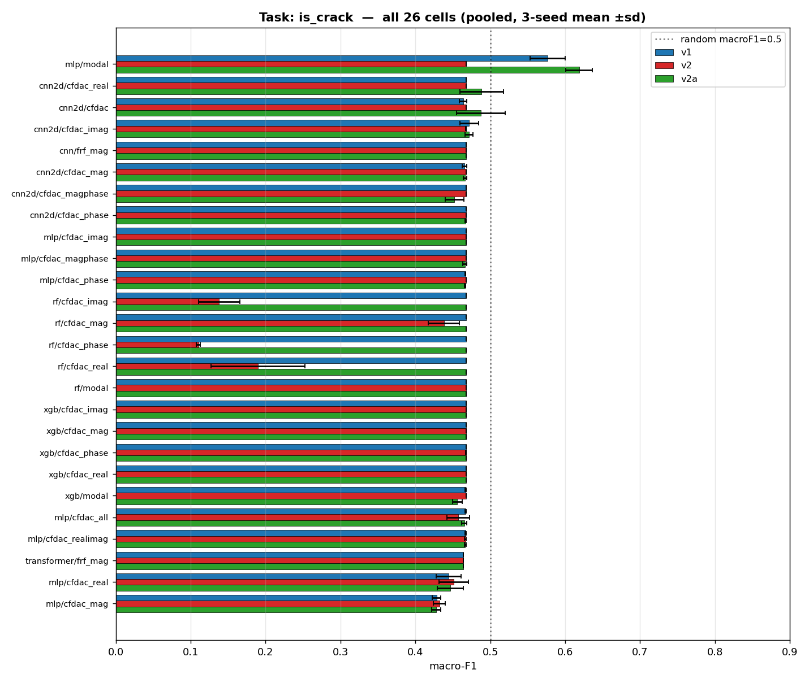

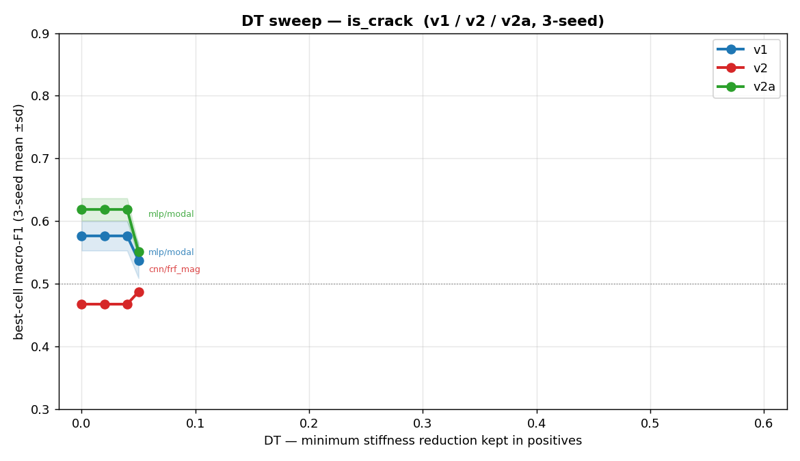

#### Cells in `is_crack`

Each cell shows what it explores, the 3-seed mean ± sd of macro-F1 per variant, and the cross-variant winner.

| cell | v1 | v2 | v2a | best | spread |
|---|---|---|---|---|---|
| `mlp/modal` | 0.577 ± 0.023 | 0.468 ± 0.000 | 0.619 ± 0.018 | **v2a** | 0.151 |
| `cnn2d/cfdac_real` | 0.468 ± 0.000 | 0.468 ± 0.000 | 0.488 ± 0.029 | **v2a** | 0.021 |
| `cnn2d/cfdac` | 0.464 ± 0.005 | 0.468 ± 0.000 | 0.487 ± 0.032 | **v2a** | 0.024 |
| `cnn2d/cfdac_imag` | 0.472 ± 0.012 | 0.468 ± 0.000 | 0.471 ± 0.005 | **v1** | 0.004 |
| `cnn/frf_mag` | 0.468 ± 0.000 | 0.468 ± 0.000 | 0.468 ± 0.000 | **v1** | 0.000 |
| `cnn2d/cfdac_mag` | 0.465 ± 0.003 | 0.468 ± 0.000 | 0.466 ± 0.002 | **v2** | 0.002 |
| `cnn2d/cfdac_magphase` | 0.468 ± 0.000 | 0.468 ± 0.000 | 0.452 ± 0.013 | **v2** | 0.016 |
| `cnn2d/cfdac_phase` | 0.468 ± 0.000 | 0.468 ± 0.000 | 0.467 ± 0.001 | **v2** | 0.001 |
| `mlp/cfdac_imag` | 0.468 ± 0.000 | 0.468 ± 0.000 | 0.468 ± 0.000 | **v1** | 0.000 |
| `mlp/cfdac_magphase` | 0.468 ± 0.000 | 0.468 ± 0.000 | 0.466 ± 0.003 | **v1** | 0.002 |
| `mlp/cfdac_phase` | 0.467 ± 0.000 | 0.468 ± 0.000 | 0.466 ± 0.001 | **v2** | 0.002 |
| `rf/cfdac_imag` | 0.468 ± 0.000 | 0.138 ± 0.028 | 0.468 ± 0.000 | **v1** | 0.330 |
| `rf/cfdac_mag` | 0.468 ± 0.000 | 0.438 ± 0.021 | 0.468 ± 0.000 | **v1** | 0.029 |
| `rf/cfdac_phase` | 0.468 ± 0.000 | 0.110 ± 0.003 | 0.468 ± 0.000 | **v1** | 0.358 |
| `rf/cfdac_real` | 0.468 ± 0.000 | 0.190 ± 0.063 | 0.468 ± 0.000 | **v1** | 0.278 |
| `rf/modal` | 0.468 ± 0.000 | 0.468 ± 0.000 | 0.468 ± 0.000 | **v1** | 0.000 |
| `xgb/cfdac_imag` | 0.468 ± 0.000 | 0.468 ± 0.000 | 0.468 ± 0.000 | **v1** | 0.000 |
| `xgb/cfdac_mag` | 0.468 ± 0.000 | 0.468 ± 0.000 | 0.468 ± 0.000 | **v1** | 0.000 |
| `xgb/cfdac_phase` | 0.468 ± 0.000 | 0.468 ± 0.000 | 0.468 ± 0.000 | **v1** | 0.000 |
| `xgb/cfdac_real` | 0.468 ± 0.000 | 0.468 ± 0.000 | 0.468 ± 0.000 | **v1** | 0.000 |
| `xgb/modal` | 0.467 ± 0.001 | 0.468 ± 0.000 | 0.456 ± 0.007 | **v2** | 0.012 |
| `mlp/cfdac_all` | 0.467 ± 0.001 | 0.457 ± 0.015 | 0.465 ± 0.003 | **v1** | 0.010 |
| `mlp/cfdac_realimag` | 0.467 ± 0.001 | 0.467 ± 0.001 | 0.466 ± 0.001 | **v1** | 0.001 |
| `transformer/frf_mag` | 0.464 ± 0.000 | 0.464 ± 0.000 | 0.464 ± 0.000 | **v1** | 0.000 |
| `mlp/cfdac_real` | 0.444 ± 0.017 | 0.451 ± 0.020 | 0.447 ± 0.017 | **v2** | 0.007 |
| `mlp/cfdac_mag` | 0.428 ± 0.006 | 0.432 ± 0.008 | 0.428 ± 0.006 | **v2** | 0.004 |

##### Cell-by-cell

- **`mlp/modal`** — **mlp** (fully connected baseline (3 hidden layers); fast, low capacity) on **modal** (physics-grounded — extracted natural frequencies + damping ratios + mode shapes).  
  macro-F1 — v1: 0.577 ± 0.023 · v2: 0.468 ± 0.000 · v2a: 0.619 ± 0.018.  
  Best variant: **v2a** (spread 0.151).  
  Secondary (v1): BA = 0.596, TPR = 0.332, TNR = 0.859.
- **`cnn2d/cfdac_real`** — **cnn2d** (2-D CNN treating the feature as a (channel × bin) image) on **cfdac_real** (real part only of CFDAC).  
  macro-F1 — v1: 0.468 ± 0.000 · v2: 0.468 ± 0.000 · v2a: 0.488 ± 0.029.  
  Best variant: **v2a** (spread 0.021).  
  Secondary (v1): BA = 0.500, TPR = 0.000, TNR = 1.000.
- **`cnn2d/cfdac`** — **cnn2d** (2-D CNN treating the feature as a (channel × bin) image) on **cfdac** (Cross-FRF Damage Assurance Criterion — pristine-vs-current FRF alignment image).  
  macro-F1 — v1: 0.464 ± 0.005 · v2: 0.468 ± 0.000 · v2a: 0.487 ± 0.032.  
  Best variant: **v2a** (spread 0.024).  
  Secondary (v1): BA = 0.492, TPR = 0.000, TNR = 0.985.
- **`cnn2d/cfdac_imag`** — **cnn2d** (2-D CNN treating the feature as a (channel × bin) image) on **cfdac_imag** (imaginary part only of CFDAC).  
  macro-F1 — v1: 0.472 ± 0.012 · v2: 0.468 ± 0.000 · v2a: 0.471 ± 0.005.  
  Best variant: **v1** (spread 0.004).  
  Secondary (v1): BA = 0.495, TPR = 0.010, TNR = 0.980.
- **`cnn/frf_mag`** — **cnn** (1-D convolutional net on the feature sequence; learns local spectral motifs) on **frf_mag** (FRF magnitude across frequency bins — what most damage indicators key on).  
  macro-F1 — v1: 0.468 ± 0.000 · v2: 0.468 ± 0.000 · v2a: 0.468 ± 0.000.  
  Best variant: **v1** (spread 0.000).  
  Secondary (v1): BA = 0.500, TPR = 0.000, TNR = 1.000.
- **`cnn2d/cfdac_mag`** — **cnn2d** (2-D CNN treating the feature as a (channel × bin) image) on **cfdac_mag** (magnitude of CFDAC).  
  macro-F1 — v1: 0.465 ± 0.003 · v2: 0.468 ± 0.000 · v2a: 0.466 ± 0.002.  
  Best variant: **v2** (spread 0.002).  
  Secondary (v1): BA = 0.496, TPR = 0.000, TNR = 0.991.
- **`cnn2d/cfdac_magphase`** — **cnn2d** (2-D CNN treating the feature as a (channel × bin) image) on **cfdac_magphase** (magnitude and phase CFDAC concatenated).  
  macro-F1 — v1: 0.468 ± 0.000 · v2: 0.468 ± 0.000 · v2a: 0.452 ± 0.013.  
  Best variant: **v2** (spread 0.016).  
  Secondary (v1): BA = 0.500, TPR = 0.000, TNR = 1.000.
- **`cnn2d/cfdac_phase`** — **cnn2d** (2-D CNN treating the feature as a (channel × bin) image) on **cfdac_phase** (phase of CFDAC).  
  macro-F1 — v1: 0.468 ± 0.000 · v2: 0.468 ± 0.000 · v2a: 0.467 ± 0.001.  
  Best variant: **v2** (spread 0.001).  
  Secondary (v1): BA = 0.500, TPR = 0.000, TNR = 1.000.
- **`mlp/cfdac_imag`** — **mlp** (fully connected baseline (3 hidden layers); fast, low capacity) on **cfdac_imag** (imaginary part only of CFDAC).  
  macro-F1 — v1: 0.468 ± 0.000 · v2: 0.468 ± 0.000 · v2a: 0.468 ± 0.000.  
  Best variant: **v1** (spread 0.000).  
  Secondary (v1): BA = 0.500, TPR = 0.000, TNR = 1.000.
- **`mlp/cfdac_magphase`** — **mlp** (fully connected baseline (3 hidden layers); fast, low capacity) on **cfdac_magphase** (magnitude and phase CFDAC concatenated).  
  macro-F1 — v1: 0.468 ± 0.000 · v2: 0.468 ± 0.000 · v2a: 0.466 ± 0.003.  
  Best variant: **v1** (spread 0.002).  
  Secondary (v1): BA = 0.500, TPR = 0.000, TNR = 1.000.
- **`mlp/cfdac_phase`** — **mlp** (fully connected baseline (3 hidden layers); fast, low capacity) on **cfdac_phase** (phase of CFDAC).  
  macro-F1 — v1: 0.467 ± 0.000 · v2: 0.468 ± 0.000 · v2a: 0.466 ± 0.001.  
  Best variant: **v2** (spread 0.002).  
  Secondary (v1): BA = 0.498, TPR = 0.000, TNR = 0.996.
- **`rf/cfdac_imag`** — **rf** (random forest on flattened feature; robust non-parametric baseline) on **cfdac_imag** (imaginary part only of CFDAC).  
  macro-F1 — v1: 0.468 ± 0.000 · v2: 0.138 ± 0.028 · v2a: 0.468 ± 0.000.  
  Best variant: **v1** (spread 0.330).  
  Secondary (v1): BA = 0.500, TPR = 0.000, TNR = 1.000.
- **`rf/cfdac_mag`** — **rf** (random forest on flattened feature; robust non-parametric baseline) on **cfdac_mag** (magnitude of CFDAC).  
  macro-F1 — v1: 0.468 ± 0.000 · v2: 0.438 ± 0.021 · v2a: 0.468 ± 0.000.  
  Best variant: **v1** (spread 0.029).  
  Secondary (v1): BA = 0.500, TPR = 0.000, TNR = 1.000.
- **`rf/cfdac_phase`** — **rf** (random forest on flattened feature; robust non-parametric baseline) on **cfdac_phase** (phase of CFDAC).  
  macro-F1 — v1: 0.468 ± 0.000 · v2: 0.110 ± 0.003 · v2a: 0.468 ± 0.000.  
  Best variant: **v1** (spread 0.358).  
  Secondary (v1): BA = 0.500, TPR = 0.000, TNR = 1.000.
- **`rf/cfdac_real`** — **rf** (random forest on flattened feature; robust non-parametric baseline) on **cfdac_real** (real part only of CFDAC).  
  macro-F1 — v1: 0.468 ± 0.000 · v2: 0.190 ± 0.063 · v2a: 0.468 ± 0.000.  
  Best variant: **v1** (spread 0.278).  
  Secondary (v1): BA = 0.500, TPR = 0.000, TNR = 1.000.
- **`rf/modal`** — **rf** (random forest on flattened feature; robust non-parametric baseline) on **modal** (physics-grounded — extracted natural frequencies + damping ratios + mode shapes).  
  macro-F1 — v1: 0.468 ± 0.000 · v2: 0.468 ± 0.000 · v2a: 0.468 ± 0.000.  
  Best variant: **v1** (spread 0.000).  
  Secondary (v1): BA = 0.500, TPR = 0.000, TNR = 1.000.
- **`xgb/cfdac_imag`** — **xgb** (gradient-boosted trees; usually pairs best with hand-crafted modal features) on **cfdac_imag** (imaginary part only of CFDAC).  
  macro-F1 — v1: 0.468 ± 0.000 · v2: 0.468 ± 0.000 · v2a: 0.468 ± 0.000.  
  Best variant: **v1** (spread 0.000).  
  Secondary (v1): BA = 0.500, TPR = 0.000, TNR = 1.000.
- **`xgb/cfdac_mag`** — **xgb** (gradient-boosted trees; usually pairs best with hand-crafted modal features) on **cfdac_mag** (magnitude of CFDAC).  
  macro-F1 — v1: 0.468 ± 0.000 · v2: 0.468 ± 0.000 · v2a: 0.468 ± 0.000.  
  Best variant: **v1** (spread 0.000).  
  Secondary (v1): BA = 0.500, TPR = 0.000, TNR = 1.000.
- **`xgb/cfdac_phase`** — **xgb** (gradient-boosted trees; usually pairs best with hand-crafted modal features) on **cfdac_phase** (phase of CFDAC).  
  macro-F1 — v1: 0.468 ± 0.000 · v2: 0.468 ± 0.000 · v2a: 0.468 ± 0.000.  
  Best variant: **v1** (spread 0.000).  
  Secondary (v1): BA = 0.500, TPR = 0.000, TNR = 1.000.
- **`xgb/cfdac_real`** — **xgb** (gradient-boosted trees; usually pairs best with hand-crafted modal features) on **cfdac_real** (real part only of CFDAC).  
  macro-F1 — v1: 0.468 ± 0.000 · v2: 0.468 ± 0.000 · v2a: 0.468 ± 0.000.  
  Best variant: **v1** (spread 0.000).  
  Secondary (v1): BA = 0.500, TPR = 0.000, TNR = 1.000.
- **`xgb/modal`** — **xgb** (gradient-boosted trees; usually pairs best with hand-crafted modal features) on **modal** (physics-grounded — extracted natural frequencies + damping ratios + mode shapes).  
  macro-F1 — v1: 0.467 ± 0.001 · v2: 0.468 ± 0.000 · v2a: 0.456 ± 0.007.  
  Best variant: **v2** (spread 0.012).  
  Secondary (v1): BA = 0.498, TPR = 0.000, TNR = 0.997.
- **`mlp/cfdac_all`** — **mlp** (fully connected baseline (3 hidden layers); fast, low capacity) on **cfdac_all** (all 4 CFDAC channels stacked).  
  macro-F1 — v1: 0.467 ± 0.001 · v2: 0.457 ± 0.015 · v2a: 0.465 ± 0.003.  
  Best variant: **v1** (spread 0.010).  
  Secondary (v1): BA = 0.499, TPR = 0.000, TNR = 0.998.
- **`mlp/cfdac_realimag`** — **mlp** (fully connected baseline (3 hidden layers); fast, low capacity) on **cfdac_realimag** (real and imaginary CFDAC concatenated).  
  macro-F1 — v1: 0.467 ± 0.001 · v2: 0.467 ± 0.001 · v2a: 0.466 ± 0.001.  
  Best variant: **v1** (spread 0.001).  
  Secondary (v1): BA = 0.499, TPR = 0.000, TNR = 0.997.
- **`transformer/frf_mag`** — **transformer** (small self-attention encoder; captures long-range spectral structure) on **frf_mag** (FRF magnitude across frequency bins — what most damage indicators key on).  
  macro-F1 — v1: 0.464 ± 0.000 · v2: 0.464 ± 0.000 · v2a: 0.464 ± 0.000.  
  Best variant: **v1** (spread 0.000).  
  Secondary (v1): BA = 0.492, TPR = 0.000, TNR = 0.985.
- **`mlp/cfdac_real`** — **mlp** (fully connected baseline (3 hidden layers); fast, low capacity) on **cfdac_real** (real part only of CFDAC).  
  macro-F1 — v1: 0.444 ± 0.017 · v2: 0.451 ± 0.020 · v2a: 0.447 ± 0.017.  
  Best variant: **v2** (spread 0.007).  
  Secondary (v1): BA = 0.456, TPR = 0.000, TNR = 0.912.
- **`mlp/cfdac_mag`** — **mlp** (fully connected baseline (3 hidden layers); fast, low capacity) on **cfdac_mag** (magnitude of CFDAC).  
  macro-F1 — v1: 0.428 ± 0.006 · v2: 0.432 ± 0.008 · v2a: 0.428 ± 0.006.  
  Best variant: **v2** (spread 0.004).  
  Secondary (v1): BA = 0.426, TPR = 0.000, TNR = 0.853.

---
### 5. Hole detection — `is_hole`
**Question.** Does this spectrum exhibit a drilled-hole defect?
**Output axis.** positives = hole cases; negatives = pristine + non-hole damage
**Notes.** This is the v1 modal-MLP showpiece (BA 0.651 on the registered cell) and the one that v2 catastrophically collapses (BA 0.500). Random = 0.5.
**Cells in this task:** 26

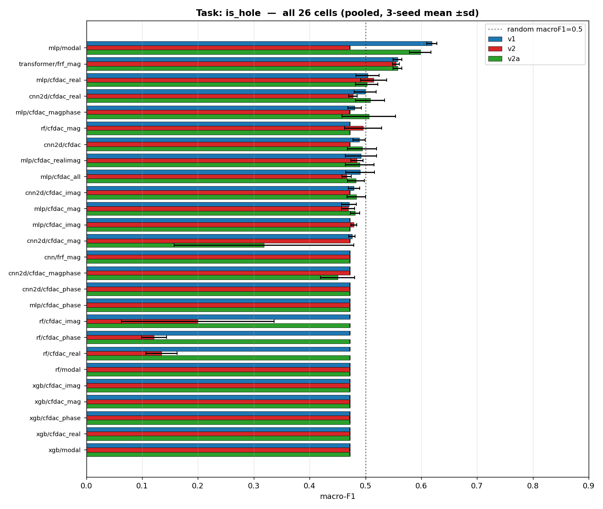

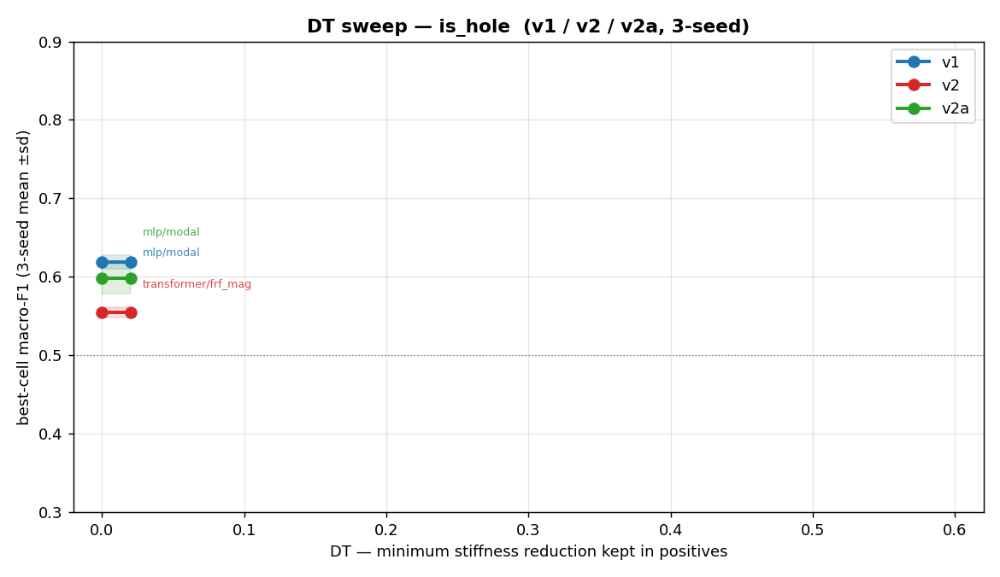

#### Cells in `is_hole`

Each cell shows what it explores, the 3-seed mean ± sd of macro-F1 per variant, and the cross-variant winner.

| cell | v1 | v2 | v2a | best | spread |
|---|---|---|---|---|---|
| `mlp/modal` | 0.619 ± 0.009 | 0.472 ± 0.000 | 0.598 ± 0.019 | **v1** | 0.147 |
| `transformer/frf_mag` | 0.558 ± 0.008 | 0.555 ± 0.006 | 0.558 ± 0.008 | **v1** | 0.003 |
| `mlp/cfdac_real` | 0.504 ± 0.021 | 0.515 ± 0.024 | 0.502 ± 0.020 | **v2** | 0.013 |
| `cnn2d/cfdac_real` | 0.499 ± 0.020 | 0.477 ± 0.008 | 0.508 ± 0.026 | **v2a** | 0.031 |
| `mlp/cfdac_magphase` | 0.481 ± 0.012 | 0.472 ± 0.000 | 0.506 ± 0.048 | **v2a** | 0.034 |
| `rf/cfdac_mag` | 0.472 ± 0.000 | 0.495 ± 0.033 | 0.472 ± 0.000 | **v2** | 0.024 |
| `cnn2d/cfdac` | 0.489 ± 0.011 | 0.472 ± 0.000 | 0.494 ± 0.026 | **v2a** | 0.022 |
| `mlp/cfdac_realimag` | 0.492 ± 0.028 | 0.485 ± 0.011 | 0.490 ± 0.026 | **v1** | 0.007 |
| `mlp/cfdac_all` | 0.490 ± 0.026 | 0.466 ± 0.008 | 0.483 ± 0.015 | **v1** | 0.024 |
| `cnn2d/cfdac_imag` | 0.479 ± 0.010 | 0.472 ± 0.000 | 0.484 ± 0.017 | **v2a** | 0.012 |
| `mlp/cfdac_mag` | 0.471 ± 0.013 | 0.469 ± 0.012 | 0.481 ± 0.008 | **v2a** | 0.013 |
| `mlp/cfdac_imag` | 0.472 ± 0.000 | 0.479 ± 0.005 | 0.472 ± 0.000 | **v2** | 0.007 |
| `cnn2d/cfdac_mag` | 0.476 ± 0.005 | 0.472 ± 0.000 | 0.318 ± 0.161 | **v1** | 0.158 |
| `cnn/frf_mag` | 0.472 ± 0.000 | 0.472 ± 0.000 | 0.472 ± 0.000 | **v1** | 0.000 |
| `cnn2d/cfdac_magphase` | 0.472 ± 0.000 | 0.472 ± 0.000 | 0.450 ± 0.031 | **v1** | 0.022 |
| `cnn2d/cfdac_phase` | 0.472 ± 0.000 | 0.472 ± 0.000 | 0.472 ± 0.000 | **v1** | 0.000 |
| `mlp/cfdac_phase` | 0.472 ± 0.000 | 0.472 ± 0.000 | 0.472 ± 0.000 | **v1** | 0.000 |
| `rf/cfdac_imag` | 0.472 ± 0.000 | 0.199 ± 0.137 | 0.472 ± 0.000 | **v1** | 0.273 |
| `rf/cfdac_phase` | 0.472 ± 0.000 | 0.121 ± 0.022 | 0.472 ± 0.000 | **v1** | 0.351 |
| `rf/cfdac_real` | 0.472 ± 0.000 | 0.135 ± 0.028 | 0.472 ± 0.000 | **v1** | 0.337 |
| `rf/modal` | 0.472 ± 0.000 | 0.472 ± 0.000 | 0.472 ± 0.000 | **v1** | 0.000 |
| `xgb/cfdac_imag` | 0.472 ± 0.000 | 0.472 ± 0.000 | 0.472 ± 0.000 | **v1** | 0.000 |
| `xgb/cfdac_mag` | 0.472 ± 0.000 | 0.472 ± 0.000 | 0.472 ± 0.000 | **v1** | 0.000 |
| `xgb/cfdac_phase` | 0.472 ± 0.000 | 0.472 ± 0.000 | 0.472 ± 0.000 | **v1** | 0.000 |
| `xgb/cfdac_real` | 0.472 ± 0.000 | 0.472 ± 0.000 | 0.472 ± 0.000 | **v1** | 0.000 |
| `xgb/modal` | 0.472 ± 0.000 | 0.472 ± 0.000 | 0.472 ± 0.000 | **v1** | 0.000 |

##### Cell-by-cell

- **`mlp/modal`** — **mlp** (fully connected baseline (3 hidden layers); fast, low capacity) on **modal** (physics-grounded — extracted natural frequencies + damping ratios + mode shapes).  
  macro-F1 — v1: 0.619 ± 0.009 · v2: 0.472 ± 0.000 · v2a: 0.598 ± 0.019.  
  Best variant: **v1** (spread 0.147).  
  Secondary (v1): BA = 0.651, TPR = 0.435, TNR = 0.868.
- **`transformer/frf_mag`** — **transformer** (small self-attention encoder; captures long-range spectral structure) on **frf_mag** (FRF magnitude across frequency bins — what most damage indicators key on).  
  macro-F1 — v1: 0.558 ± 0.008 · v2: 0.555 ± 0.006 · v2a: 0.558 ± 0.008.  
  Best variant: **v1** (spread 0.003).  
  Secondary (v1): BA = 0.545, TPR = 0.095, TNR = 0.996.
- **`mlp/cfdac_real`** — **mlp** (fully connected baseline (3 hidden layers); fast, low capacity) on **cfdac_real** (real part only of CFDAC).  
  macro-F1 — v1: 0.504 ± 0.021 · v2: 0.515 ± 0.024 · v2a: 0.502 ± 0.020.  
  Best variant: **v2** (spread 0.013).  
  Secondary (v1): BA = 0.508, TPR = 0.069, TNR = 0.947.
- **`cnn2d/cfdac_real`** — **cnn2d** (2-D CNN treating the feature as a (channel × bin) image) on **cfdac_real** (real part only of CFDAC).  
  macro-F1 — v1: 0.499 ± 0.020 · v2: 0.477 ± 0.008 · v2a: 0.508 ± 0.026.  
  Best variant: **v2a** (spread 0.031).  
  Secondary (v1): BA = 0.508, TPR = 0.070, TNR = 0.947.
- **`mlp/cfdac_magphase`** — **mlp** (fully connected baseline (3 hidden layers); fast, low capacity) on **cfdac_magphase** (magnitude and phase CFDAC concatenated).  
  macro-F1 — v1: 0.481 ± 0.012 · v2: 0.472 ± 0.000 · v2a: 0.506 ± 0.048.  
  Best variant: **v2a** (spread 0.034).  
  Secondary (v1): BA = 0.502, TPR = 0.014, TNR = 0.989.
- **`rf/cfdac_mag`** — **rf** (random forest on flattened feature; robust non-parametric baseline) on **cfdac_mag** (magnitude of CFDAC).  
  macro-F1 — v1: 0.472 ± 0.000 · v2: 0.495 ± 0.033 · v2a: 0.472 ± 0.000.  
  Best variant: **v2** (spread 0.024).  
  Secondary (v1): BA = 0.500, TPR = 0.000, TNR = 1.000.
- **`cnn2d/cfdac`** — **cnn2d** (2-D CNN treating the feature as a (channel × bin) image) on **cfdac** (Cross-FRF Damage Assurance Criterion — pristine-vs-current FRF alignment image).  
  macro-F1 — v1: 0.489 ± 0.011 · v2: 0.472 ± 0.000 · v2a: 0.494 ± 0.026.  
  Best variant: **v2a** (spread 0.022).  
  Secondary (v1): BA = 0.508, TPR = 0.017, TNR = 1.000.
- **`mlp/cfdac_realimag`** — **mlp** (fully connected baseline (3 hidden layers); fast, low capacity) on **cfdac_realimag** (real and imaginary CFDAC concatenated).  
  macro-F1 — v1: 0.492 ± 0.028 · v2: 0.485 ± 0.011 · v2a: 0.490 ± 0.026.  
  Best variant: **v1** (spread 0.007).  
  Secondary (v1): BA = 0.510, TPR = 0.021, TNR = 0.999.
- **`mlp/cfdac_all`** — **mlp** (fully connected baseline (3 hidden layers); fast, low capacity) on **cfdac_all** (all 4 CFDAC channels stacked).  
  macro-F1 — v1: 0.490 ± 0.026 · v2: 0.466 ± 0.008 · v2a: 0.483 ± 0.015.  
  Best variant: **v1** (spread 0.024).  
  Secondary (v1): BA = 0.509, TPR = 0.024, TNR = 0.993.
- **`cnn2d/cfdac_imag`** — **cnn2d** (2-D CNN treating the feature as a (channel × bin) image) on **cfdac_imag** (imaginary part only of CFDAC).  
  macro-F1 — v1: 0.479 ± 0.010 · v2: 0.472 ± 0.000 · v2a: 0.484 ± 0.017.  
  Best variant: **v2a** (spread 0.012).  
  Secondary (v1): BA = 0.504, TPR = 0.007, TNR = 1.000.
- **`mlp/cfdac_mag`** — **mlp** (fully connected baseline (3 hidden layers); fast, low capacity) on **cfdac_mag** (magnitude of CFDAC).  
  macro-F1 — v1: 0.471 ± 0.013 · v2: 0.469 ± 0.012 · v2a: 0.481 ± 0.008.  
  Best variant: **v2a** (spread 0.013).  
  Secondary (v1): BA = 0.470, TPR = 0.076, TNR = 0.863.
- **`mlp/cfdac_imag`** — **mlp** (fully connected baseline (3 hidden layers); fast, low capacity) on **cfdac_imag** (imaginary part only of CFDAC).  
  macro-F1 — v1: 0.472 ± 0.000 · v2: 0.479 ± 0.005 · v2a: 0.472 ± 0.000.  
  Best variant: **v2** (spread 0.007).  
  Secondary (v1): BA = 0.500, TPR = 0.000, TNR = 1.000.
- **`cnn2d/cfdac_mag`** — **cnn2d** (2-D CNN treating the feature as a (channel × bin) image) on **cfdac_mag** (magnitude of CFDAC).  
  macro-F1 — v1: 0.476 ± 0.005 · v2: 0.472 ± 0.000 · v2a: 0.318 ± 0.161.  
  Best variant: **v1** (spread 0.158).  
  Secondary (v1): BA = 0.494, TPR = 0.038, TNR = 0.950.
- **`cnn/frf_mag`** — **cnn** (1-D convolutional net on the feature sequence; learns local spectral motifs) on **frf_mag** (FRF magnitude across frequency bins — what most damage indicators key on).  
  macro-F1 — v1: 0.472 ± 0.000 · v2: 0.472 ± 0.000 · v2a: 0.472 ± 0.000.  
  Best variant: **v1** (spread 0.000).  
  Secondary (v1): BA = 0.500, TPR = 0.000, TNR = 1.000.
- **`cnn2d/cfdac_magphase`** — **cnn2d** (2-D CNN treating the feature as a (channel × bin) image) on **cfdac_magphase** (magnitude and phase CFDAC concatenated).  
  macro-F1 — v1: 0.472 ± 0.000 · v2: 0.472 ± 0.000 · v2a: 0.450 ± 0.031.  
  Best variant: **v1** (spread 0.022).  
  Secondary (v1): BA = 0.500, TPR = 0.000, TNR = 1.000.
- **`cnn2d/cfdac_phase`** — **cnn2d** (2-D CNN treating the feature as a (channel × bin) image) on **cfdac_phase** (phase of CFDAC).  
  macro-F1 — v1: 0.472 ± 0.000 · v2: 0.472 ± 0.000 · v2a: 0.472 ± 0.000.  
  Best variant: **v1** (spread 0.000).  
  Secondary (v1): BA = 0.500, TPR = 0.000, TNR = 1.000.
- **`mlp/cfdac_phase`** — **mlp** (fully connected baseline (3 hidden layers); fast, low capacity) on **cfdac_phase** (phase of CFDAC).  
  macro-F1 — v1: 0.472 ± 0.000 · v2: 0.472 ± 0.000 · v2a: 0.472 ± 0.000.  
  Best variant: **v1** (spread 0.000).  
  Secondary (v1): BA = 0.500, TPR = 0.000, TNR = 1.000.
- **`rf/cfdac_imag`** — **rf** (random forest on flattened feature; robust non-parametric baseline) on **cfdac_imag** (imaginary part only of CFDAC).  
  macro-F1 — v1: 0.472 ± 0.000 · v2: 0.199 ± 0.137 · v2a: 0.472 ± 0.000.  
  Best variant: **v1** (spread 0.273).  
  Secondary (v1): BA = 0.500, TPR = 0.000, TNR = 1.000.
- **`rf/cfdac_phase`** — **rf** (random forest on flattened feature; robust non-parametric baseline) on **cfdac_phase** (phase of CFDAC).  
  macro-F1 — v1: 0.472 ± 0.000 · v2: 0.121 ± 0.022 · v2a: 0.472 ± 0.000.  
  Best variant: **v1** (spread 0.351).  
  Secondary (v1): BA = 0.500, TPR = 0.000, TNR = 1.000.
- **`rf/cfdac_real`** — **rf** (random forest on flattened feature; robust non-parametric baseline) on **cfdac_real** (real part only of CFDAC).  
  macro-F1 — v1: 0.472 ± 0.000 · v2: 0.135 ± 0.028 · v2a: 0.472 ± 0.000.  
  Best variant: **v1** (spread 0.337).  
  Secondary (v1): BA = 0.500, TPR = 0.000, TNR = 1.000.
- **`rf/modal`** — **rf** (random forest on flattened feature; robust non-parametric baseline) on **modal** (physics-grounded — extracted natural frequencies + damping ratios + mode shapes).  
  macro-F1 — v1: 0.472 ± 0.000 · v2: 0.472 ± 0.000 · v2a: 0.472 ± 0.000.  
  Best variant: **v1** (spread 0.000).  
  Secondary (v1): BA = 0.500, TPR = 0.000, TNR = 1.000.
- **`xgb/cfdac_imag`** — **xgb** (gradient-boosted trees; usually pairs best with hand-crafted modal features) on **cfdac_imag** (imaginary part only of CFDAC).  
  macro-F1 — v1: 0.472 ± 0.000 · v2: 0.472 ± 0.000 · v2a: 0.472 ± 0.000.  
  Best variant: **v1** (spread 0.000).  
  Secondary (v1): BA = 0.500, TPR = 0.000, TNR = 1.000.
- **`xgb/cfdac_mag`** — **xgb** (gradient-boosted trees; usually pairs best with hand-crafted modal features) on **cfdac_mag** (magnitude of CFDAC).  
  macro-F1 — v1: 0.472 ± 0.000 · v2: 0.472 ± 0.000 · v2a: 0.472 ± 0.000.  
  Best variant: **v1** (spread 0.000).  
  Secondary (v1): BA = 0.500, TPR = 0.000, TNR = 1.000.
- **`xgb/cfdac_phase`** — **xgb** (gradient-boosted trees; usually pairs best with hand-crafted modal features) on **cfdac_phase** (phase of CFDAC).  
  macro-F1 — v1: 0.472 ± 0.000 · v2: 0.472 ± 0.000 · v2a: 0.472 ± 0.000.  
  Best variant: **v1** (spread 0.000).  
  Secondary (v1): BA = 0.500, TPR = 0.000, TNR = 1.000.
- **`xgb/cfdac_real`** — **xgb** (gradient-boosted trees; usually pairs best with hand-crafted modal features) on **cfdac_real** (real part only of CFDAC).  
  macro-F1 — v1: 0.472 ± 0.000 · v2: 0.472 ± 0.000 · v2a: 0.472 ± 0.000.  
  Best variant: **v1** (spread 0.000).  
  Secondary (v1): BA = 0.500, TPR = 0.000, TNR = 1.000.
- **`xgb/modal`** — **xgb** (gradient-boosted trees; usually pairs best with hand-crafted modal features) on **modal** (physics-grounded — extracted natural frequencies + damping ratios + mode shapes).  
  macro-F1 — v1: 0.472 ± 0.000 · v2: 0.472 ± 0.000 · v2a: 0.472 ± 0.000.  
  Best variant: **v1** (spread 0.000).  
  Secondary (v1): BA = 0.500, TPR = 0.000, TNR = 1.000.

---
### 6. Added-mass detection — `is_mass`
**Question.** Does this spectrum exhibit an added-mass condition?
**Output axis.** positives = added-mass cases; negatives = pristine + non-mass damage
**Notes.** Added-mass shifts global natural frequencies — a globally encoded signal. Random = 0.5.
**Cells in this task:** 26

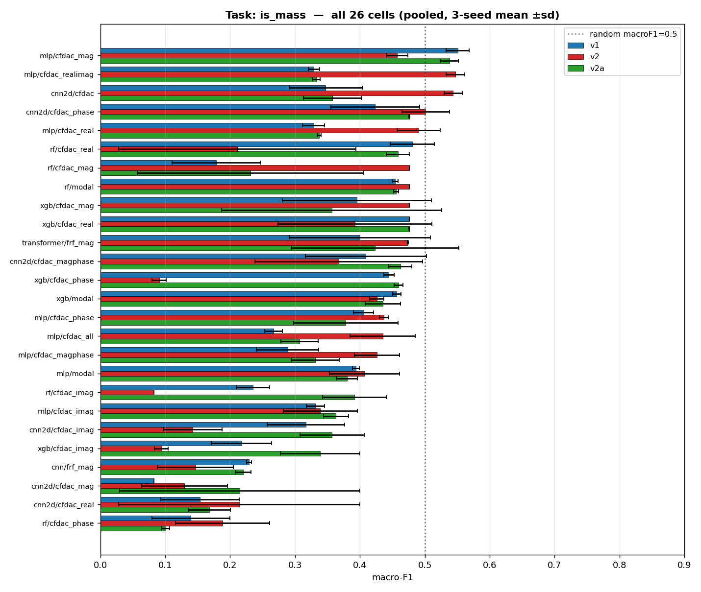

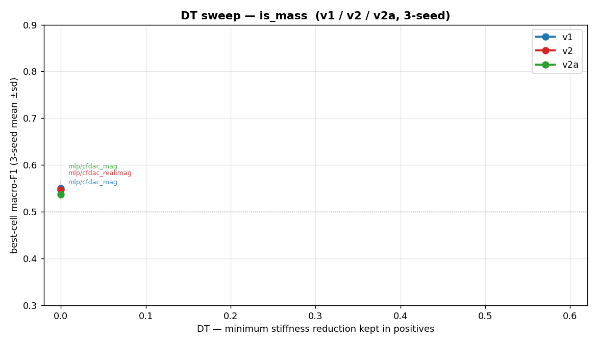

#### Cells in `is_mass`

Each cell shows what it explores, the 3-seed mean ± sd of macro-F1 per variant, and the cross-variant winner.

| cell | v1 | v2 | v2a | best | spread |
|---|---|---|---|---|---|
| `mlp/cfdac_mag` | 0.551 ± 0.018 | 0.458 ± 0.016 | 0.538 ± 0.014 | **v1** | 0.093 |
| `mlp/cfdac_realimag` | 0.329 ± 0.009 | 0.547 ± 0.014 | 0.333 ± 0.006 | **v2** | 0.218 |
| `cnn2d/cfdac` | 0.347 ± 0.057 | 0.544 ± 0.014 | 0.358 ± 0.045 | **v2** | 0.196 |
| `cnn2d/cfdac_phase` | 0.423 ± 0.068 | 0.501 ± 0.036 | 0.476 ± 0.000 | **v2** | 0.078 |
| `mlp/cfdac_real` | 0.329 ± 0.017 | 0.490 ± 0.033 | 0.337 ± 0.003 | **v2** | 0.162 |
| `rf/cfdac_real` | 0.481 ± 0.034 | 0.211 ± 0.183 | 0.458 ± 0.018 | **v1** | 0.270 |
| `rf/cfdac_mag` | 0.178 ± 0.068 | 0.476 ± 0.000 | 0.231 ± 0.175 | **v2** | 0.298 |
| `rf/modal` | 0.454 ± 0.005 | 0.476 ± 0.000 | 0.456 ± 0.004 | **v2** | 0.022 |
| `xgb/cfdac_mag` | 0.395 ± 0.115 | 0.476 ± 0.000 | 0.357 ± 0.169 | **v2** | 0.120 |
| `xgb/cfdac_real` | 0.476 ± 0.000 | 0.392 ± 0.119 | 0.476 ± 0.000 | **v1** | 0.084 |
| `transformer/frf_mag` | 0.400 ± 0.108 | 0.474 ± 0.001 | 0.423 ± 0.129 | **v2** | 0.074 |
| `cnn2d/cfdac_magphase` | 0.409 ± 0.094 | 0.367 ± 0.129 | 0.462 ± 0.018 | **v2a** | 0.095 |
| `xgb/cfdac_phase` | 0.444 ± 0.008 | 0.091 ± 0.011 | 0.460 ± 0.007 | **v2a** | 0.369 |
| `xgb/modal` | 0.457 ± 0.006 | 0.426 ± 0.011 | 0.435 ± 0.027 | **v1** | 0.031 |
| `mlp/cfdac_phase` | 0.405 ± 0.015 | 0.437 ± 0.007 | 0.378 ± 0.080 | **v2** | 0.059 |
| `mlp/cfdac_all` | 0.267 ± 0.014 | 0.435 ± 0.050 | 0.307 ± 0.029 | **v2** | 0.168 |
| `mlp/cfdac_magphase` | 0.288 ± 0.048 | 0.426 ± 0.035 | 0.331 ± 0.037 | **v2** | 0.138 |
| `mlp/modal` | 0.394 ± 0.005 | 0.407 ± 0.054 | 0.380 ± 0.016 | **v2** | 0.027 |
| `rf/cfdac_imag` | 0.235 ± 0.026 | 0.083 ± 0.000 | 0.392 ± 0.049 | **v2a** | 0.309 |
| `mlp/cfdac_imag` | 0.331 ± 0.014 | 0.339 ± 0.057 | 0.363 ± 0.019 | **v2a** | 0.032 |
| `cnn2d/cfdac_imag` | 0.317 ± 0.060 | 0.142 ± 0.045 | 0.357 ± 0.049 | **v2a** | 0.215 |
| `xgb/cfdac_imag` | 0.217 ± 0.047 | 0.094 ± 0.011 | 0.339 ± 0.061 | **v2a** | 0.245 |
| `cnn/frf_mag` | 0.229 ± 0.004 | 0.146 ± 0.059 | 0.220 ± 0.011 | **v1** | 0.083 |
| `cnn2d/cfdac_mag` | 0.083 ± 0.000 | 0.130 ± 0.066 | 0.215 ± 0.185 | **v2a** | 0.132 |
| `cnn2d/cfdac_real` | 0.154 ± 0.061 | 0.214 ± 0.186 | 0.168 ± 0.032 | **v2** | 0.060 |
| `rf/cfdac_phase` | 0.139 ± 0.060 | 0.188 ± 0.073 | 0.100 ± 0.006 | **v2** | 0.088 |

##### Cell-by-cell

- **`mlp/cfdac_mag`** — **mlp** (fully connected baseline (3 hidden layers); fast, low capacity) on **cfdac_mag** (magnitude of CFDAC).  
  macro-F1 — v1: 0.551 ± 0.018 · v2: 0.458 ± 0.016 · v2a: 0.538 ± 0.014.  
  Best variant: **v1** (spread 0.093).  
  Secondary (v1): BA = 0.622, TPR = 0.466, TNR = 0.777.
- **`mlp/cfdac_realimag`** — **mlp** (fully connected baseline (3 hidden layers); fast, low capacity) on **cfdac_realimag** (real and imaginary CFDAC concatenated).  
  macro-F1 — v1: 0.329 ± 0.009 · v2: 0.547 ± 0.014 · v2a: 0.333 ± 0.006.  
  Best variant: **v2** (spread 0.218).  
  Secondary (v1): BA = 0.489, TPR = 0.629, TNR = 0.350.
- **`cnn2d/cfdac`** — **cnn2d** (2-D CNN treating the feature as a (channel × bin) image) on **cfdac** (Cross-FRF Damage Assurance Criterion — pristine-vs-current FRF alignment image).  
  macro-F1 — v1: 0.347 ± 0.057 · v2: 0.544 ± 0.014 · v2a: 0.358 ± 0.045.  
  Best variant: **v2** (spread 0.196).  
  Secondary (v1): BA = 0.400, TPR = 0.317, TNR = 0.483.
- **`cnn2d/cfdac_phase`** — **cnn2d** (2-D CNN treating the feature as a (channel × bin) image) on **cfdac_phase** (phase of CFDAC).  
  macro-F1 — v1: 0.423 ± 0.068 · v2: 0.501 ± 0.036 · v2a: 0.476 ± 0.000.  
  Best variant: **v2** (spread 0.078).  
  Secondary (v1): BA = 0.489, TPR = 0.209, TNR = 0.770.
- **`mlp/cfdac_real`** — **mlp** (fully connected baseline (3 hidden layers); fast, low capacity) on **cfdac_real** (real part only of CFDAC).  
  macro-F1 — v1: 0.329 ± 0.017 · v2: 0.490 ± 0.033 · v2a: 0.337 ± 0.003.  
  Best variant: **v2** (spread 0.162).  
  Secondary (v1): BA = 0.508, TPR = 0.676, TNR = 0.340.
- **`rf/cfdac_real`** — **rf** (random forest on flattened feature; robust non-parametric baseline) on **cfdac_real** (real part only of CFDAC).  
  macro-F1 — v1: 0.481 ± 0.034 · v2: 0.211 ± 0.183 · v2a: 0.458 ± 0.018.  
  Best variant: **v1** (spread 0.270).  
  Secondary (v1): BA = 0.579, TPR = 0.473, TNR = 0.684.
- **`rf/cfdac_mag`** — **rf** (random forest on flattened feature; robust non-parametric baseline) on **cfdac_mag** (magnitude of CFDAC).  
  macro-F1 — v1: 0.178 ± 0.068 · v2: 0.476 ± 0.000 · v2a: 0.231 ± 0.175.  
  Best variant: **v2** (spread 0.298).  
  Secondary (v1): BA = 0.550, TPR = 1.000, TNR = 0.101.
- **`rf/modal`** — **rf** (random forest on flattened feature; robust non-parametric baseline) on **modal** (physics-grounded — extracted natural frequencies + damping ratios + mode shapes).  
  macro-F1 — v1: 0.454 ± 0.005 · v2: 0.476 ± 0.000 · v2a: 0.456 ± 0.004.  
  Best variant: **v2** (spread 0.022).  
  Secondary (v1): BA = 0.453, TPR = 0.013, TNR = 0.894.
- **`xgb/cfdac_mag`** — **xgb** (gradient-boosted trees; usually pairs best with hand-crafted modal features) on **cfdac_mag** (magnitude of CFDAC).  
  macro-F1 — v1: 0.395 ± 0.115 · v2: 0.476 ± 0.000 · v2a: 0.357 ± 0.169.  
  Best variant: **v2** (spread 0.120).  
  Secondary (v1): BA = 0.527, TPR = 0.333, TNR = 0.720.
- **`xgb/cfdac_real`** — **xgb** (gradient-boosted trees; usually pairs best with hand-crafted modal features) on **cfdac_real** (real part only of CFDAC).  
  macro-F1 — v1: 0.476 ± 0.000 · v2: 0.392 ± 0.119 · v2a: 0.476 ± 0.000.  
  Best variant: **v1** (spread 0.084).  
  Secondary (v1): BA = 0.500, TPR = 0.000, TNR = 0.999.
- **`transformer/frf_mag`** — **transformer** (small self-attention encoder; captures long-range spectral structure) on **frf_mag** (FRF magnitude across frequency bins — what most damage indicators key on).  
  macro-F1 — v1: 0.400 ± 0.108 · v2: 0.474 ± 0.001 · v2a: 0.423 ± 0.129.  
  Best variant: **v2** (spread 0.074).  
  Secondary (v1): BA = 0.584, TPR = 0.592, TNR = 0.575.
- **`cnn2d/cfdac_magphase`** — **cnn2d** (2-D CNN treating the feature as a (channel × bin) image) on **cfdac_magphase** (magnitude and phase CFDAC concatenated).  
  macro-F1 — v1: 0.409 ± 0.094 · v2: 0.367 ± 0.129 · v2a: 0.462 ± 0.018.  
  Best variant: **v2a** (spread 0.095).  
  Secondary (v1): BA = 0.531, TPR = 0.326, TNR = 0.736.
- **`xgb/cfdac_phase`** — **xgb** (gradient-boosted trees; usually pairs best with hand-crafted modal features) on **cfdac_phase** (phase of CFDAC).  
  macro-F1 — v1: 0.444 ± 0.008 · v2: 0.091 ± 0.011 · v2a: 0.460 ± 0.007.  
  Best variant: **v2a** (spread 0.369).  
  Secondary (v1): BA = 0.437, TPR = 0.038, TNR = 0.837.
- **`xgb/modal`** — **xgb** (gradient-boosted trees; usually pairs best with hand-crafted modal features) on **modal** (physics-grounded — extracted natural frequencies + damping ratios + mode shapes).  
  macro-F1 — v1: 0.457 ± 0.006 · v2: 0.426 ± 0.011 · v2a: 0.435 ± 0.027.  
  Best variant: **v1** (spread 0.031).  
  Secondary (v1): BA = 0.451, TPR = 0.084, TNR = 0.818.
- **`mlp/cfdac_phase`** — **mlp** (fully connected baseline (3 hidden layers); fast, low capacity) on **cfdac_phase** (phase of CFDAC).  
  macro-F1 — v1: 0.405 ± 0.015 · v2: 0.437 ± 0.007 · v2a: 0.378 ± 0.080.  
  Best variant: **v2** (spread 0.059).  
  Secondary (v1): BA = 0.587, TPR = 0.721, TNR = 0.453.
- **`mlp/cfdac_all`** — **mlp** (fully connected baseline (3 hidden layers); fast, low capacity) on **cfdac_all** (all 4 CFDAC channels stacked).  
  macro-F1 — v1: 0.267 ± 0.014 · v2: 0.435 ± 0.050 · v2a: 0.307 ± 0.029.  
  Best variant: **v2** (spread 0.168).  
  Secondary (v1): BA = 0.517, TPR = 0.805, TNR = 0.228.
- **`mlp/cfdac_magphase`** — **mlp** (fully connected baseline (3 hidden layers); fast, low capacity) on **cfdac_magphase** (magnitude and phase CFDAC concatenated).  
  macro-F1 — v1: 0.288 ± 0.048 · v2: 0.426 ± 0.035 · v2a: 0.331 ± 0.037.  
  Best variant: **v2** (spread 0.138).  
  Secondary (v1): BA = 0.509, TPR = 0.742, TNR = 0.276.
- **`mlp/modal`** — **mlp** (fully connected baseline (3 hidden layers); fast, low capacity) on **modal** (physics-grounded — extracted natural frequencies + damping ratios + mode shapes).  
  macro-F1 — v1: 0.394 ± 0.005 · v2: 0.407 ± 0.054 · v2a: 0.380 ± 0.016.  
  Best variant: **v2** (spread 0.027).  
  Secondary (v1): BA = 0.633, TPR = 0.864, TNR = 0.403.
- **`rf/cfdac_imag`** — **rf** (random forest on flattened feature; robust non-parametric baseline) on **cfdac_imag** (imaginary part only of CFDAC).  
  macro-F1 — v1: 0.235 ± 0.026 · v2: 0.083 ± 0.000 · v2a: 0.392 ± 0.049.  
  Best variant: **v2a** (spread 0.309).  
  Secondary (v1): BA = 0.500, TPR = 0.814, TNR = 0.187.
- **`mlp/cfdac_imag`** — **mlp** (fully connected baseline (3 hidden layers); fast, low capacity) on **cfdac_imag** (imaginary part only of CFDAC).  
  macro-F1 — v1: 0.331 ± 0.014 · v2: 0.339 ± 0.057 · v2a: 0.363 ± 0.019.  
  Best variant: **v2a** (spread 0.032).  
  Secondary (v1): BA = 0.596, TPR = 0.888, TNR = 0.305.
- **`cnn2d/cfdac_imag`** — **cnn2d** (2-D CNN treating the feature as a (channel × bin) image) on **cfdac_imag** (imaginary part only of CFDAC).  
  macro-F1 — v1: 0.317 ± 0.060 · v2: 0.142 ± 0.045 · v2a: 0.357 ± 0.049.  
  Best variant: **v2a** (spread 0.215).  
  Secondary (v1): BA = 0.386, TPR = 0.380, TNR = 0.393.
- **`xgb/cfdac_imag`** — **xgb** (gradient-boosted trees; usually pairs best with hand-crafted modal features) on **cfdac_imag** (imaginary part only of CFDAC).  
  macro-F1 — v1: 0.217 ± 0.047 · v2: 0.094 ± 0.011 · v2a: 0.339 ± 0.061.  
  Best variant: **v2a** (spread 0.245).  
  Secondary (v1): BA = 0.551, TPR = 0.954, TNR = 0.149.
- **`cnn/frf_mag`** — **cnn** (1-D convolutional net on the feature sequence; learns local spectral motifs) on **frf_mag** (FRF magnitude across frequency bins — what most damage indicators key on).  
  macro-F1 — v1: 0.229 ± 0.004 · v2: 0.146 ± 0.059 · v2a: 0.220 ± 0.011.  
  Best variant: **v1** (spread 0.083).  
  Secondary (v1): BA = 0.578, TPR = 1.000, TNR = 0.155.
- **`cnn2d/cfdac_mag`** — **cnn2d** (2-D CNN treating the feature as a (channel × bin) image) on **cfdac_mag** (magnitude of CFDAC).  
  macro-F1 — v1: 0.083 ± 0.000 · v2: 0.130 ± 0.066 · v2a: 0.215 ± 0.185.  
  Best variant: **v2a** (spread 0.132).  
  Secondary (v1): BA = 0.500, TPR = 1.000, TNR = 0.000.
- **`cnn2d/cfdac_real`** — **cnn2d** (2-D CNN treating the feature as a (channel × bin) image) on **cfdac_real** (real part only of CFDAC).  
  macro-F1 — v1: 0.154 ± 0.061 · v2: 0.214 ± 0.186 · v2a: 0.168 ± 0.032.  
  Best variant: **v2** (spread 0.060).  
  Secondary (v1): BA = 0.479, TPR = 0.873, TNR = 0.086.
- **`rf/cfdac_phase`** — **rf** (random forest on flattened feature; robust non-parametric baseline) on **cfdac_phase** (phase of CFDAC).  
  macro-F1 — v1: 0.139 ± 0.060 · v2: 0.188 ± 0.073 · v2a: 0.100 ± 0.006.  
  Best variant: **v2** (spread 0.088).  
  Secondary (v1): BA = 0.473, TPR = 0.871, TNR = 0.075.

---
### 7. Pristine detection — `is_pristine` (the inverse of `binary`)
**Question.** Is this spectrum genuinely pristine?
**Output axis.** positives = pristine cases (~17.5 %); negatives = all damage types
**Notes.** The complement of `binary`. Importantly it does **not** improve under DT restriction — the models can name a damage **type** when severe, but they cannot reliably answer 'is this damaged at all?'. This is the central synth-to-real failure mode. Random = 0.5.
**Cells in this task:** 26

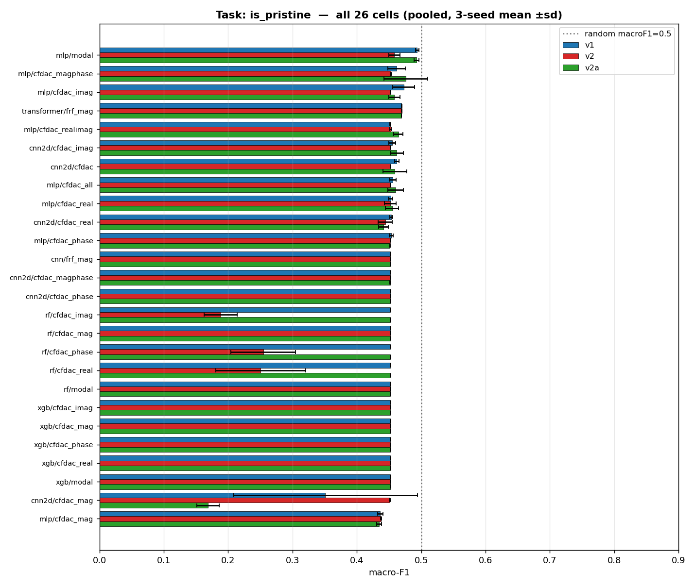

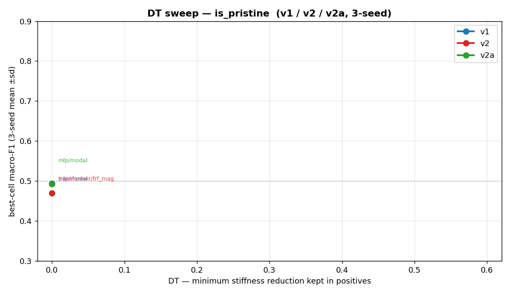

#### Cells in `is_pristine`

Each cell shows what it explores, the 3-seed mean ± sd of macro-F1 per variant, and the cross-variant winner.

| cell | v1 | v2 | v2a | best | spread |
|---|---|---|---|---|---|
| `mlp/modal` | 0.494 ± 0.003 | 0.458 ± 0.009 | 0.493 ± 0.004 | **v1** | 0.036 |
| `mlp/cfdac_magphase` | 0.462 ± 0.014 | 0.453 ± 0.001 | 0.476 ± 0.034 | **v2a** | 0.023 |
| `mlp/cfdac_imag` | 0.473 ± 0.017 | 0.452 ± 0.000 | 0.458 ± 0.009 | **v1** | 0.021 |
| `transformer/frf_mag` | 0.470 ± 0.001 | 0.470 ± 0.000 | 0.469 ± 0.000 | **v2** | 0.001 |
| `mlp/cfdac_realimag` | 0.452 ± 0.000 | 0.453 ± 0.001 | 0.465 ± 0.007 | **v2a** | 0.013 |
| `cnn2d/cfdac_imag` | 0.455 ± 0.005 | 0.452 ± 0.000 | 0.462 ± 0.010 | **v2a** | 0.010 |
| `cnn2d/cfdac` | 0.462 ± 0.003 | 0.452 ± 0.000 | 0.459 ± 0.019 | **v1** | 0.010 |
| `mlp/cfdac_all` | 0.456 ± 0.005 | 0.452 ± 0.001 | 0.460 ± 0.012 | **v2a** | 0.008 |
| `mlp/cfdac_real` | 0.452 ± 0.004 | 0.452 ± 0.009 | 0.455 ± 0.010 | **v2a** | 0.003 |
| `cnn2d/cfdac_real` | 0.453 ± 0.002 | 0.444 ± 0.011 | 0.441 ± 0.008 | **v1** | 0.012 |
| `mlp/cfdac_phase` | 0.453 ± 0.003 | 0.452 ± 0.000 | 0.451 ± 0.000 | **v1** | 0.002 |
| `cnn/frf_mag` | 0.452 ± 0.000 | 0.452 ± 0.000 | 0.452 ± 0.000 | **v1** | 0.000 |
| `cnn2d/cfdac_magphase` | 0.452 ± 0.000 | 0.452 ± 0.000 | 0.452 ± 0.000 | **v1** | 0.000 |
| `cnn2d/cfdac_phase` | 0.452 ± 0.000 | 0.452 ± 0.000 | 0.452 ± 0.000 | **v1** | 0.000 |
| `rf/cfdac_imag` | 0.452 ± 0.000 | 0.188 ± 0.025 | 0.452 ± 0.000 | **v1** | 0.264 |
| `rf/cfdac_mag` | 0.452 ± 0.000 | 0.452 ± 0.000 | 0.452 ± 0.000 | **v1** | 0.000 |
| `rf/cfdac_phase` | 0.452 ± 0.000 | 0.254 ± 0.050 | 0.452 ± 0.000 | **v1** | 0.198 |
| `rf/cfdac_real` | 0.452 ± 0.000 | 0.251 ± 0.070 | 0.452 ± 0.000 | **v1** | 0.201 |
| `rf/modal` | 0.452 ± 0.000 | 0.452 ± 0.000 | 0.452 ± 0.000 | **v1** | 0.000 |
| `xgb/cfdac_imag` | 0.452 ± 0.000 | 0.452 ± 0.000 | 0.452 ± 0.000 | **v1** | 0.000 |
| `xgb/cfdac_mag` | 0.452 ± 0.000 | 0.452 ± 0.000 | 0.452 ± 0.000 | **v1** | 0.000 |
| `xgb/cfdac_phase` | 0.452 ± 0.000 | 0.452 ± 0.000 | 0.452 ± 0.000 | **v1** | 0.000 |
| `xgb/cfdac_real` | 0.452 ± 0.000 | 0.452 ± 0.000 | 0.452 ± 0.000 | **v1** | 0.000 |
| `xgb/modal` | 0.452 ± 0.000 | 0.452 ± 0.000 | 0.452 ± 0.000 | **v1** | 0.000 |
| `cnn2d/cfdac_mag` | 0.351 ± 0.143 | 0.451 ± 0.001 | 0.169 ± 0.017 | **v2** | 0.283 |
| `mlp/cfdac_mag` | 0.436 ± 0.004 | 0.437 ± 0.001 | 0.434 ± 0.004 | **v2** | 0.003 |

##### Cell-by-cell

- **`mlp/modal`** — **mlp** (fully connected baseline (3 hidden layers); fast, low capacity) on **modal** (physics-grounded — extracted natural frequencies + damping ratios + mode shapes).  
  macro-F1 — v1: 0.494 ± 0.003 · v2: 0.458 ± 0.009 · v2a: 0.493 ± 0.004.  
  Best variant: **v1** (spread 0.036).  
  Secondary (v1): BA = 0.519, TPR = 0.045, TNR = 0.993.
- **`mlp/cfdac_magphase`** — **mlp** (fully connected baseline (3 hidden layers); fast, low capacity) on **cfdac_magphase** (magnitude and phase CFDAC concatenated).  
  macro-F1 — v1: 0.462 ± 0.014 · v2: 0.453 ± 0.001 · v2a: 0.476 ± 0.034.  
  Best variant: **v2a** (spread 0.023).  
  Secondary (v1): BA = 0.502, TPR = 0.013, TNR = 0.991.
- **`mlp/cfdac_imag`** — **mlp** (fully connected baseline (3 hidden layers); fast, low capacity) on **cfdac_imag** (imaginary part only of CFDAC).  
  macro-F1 — v1: 0.473 ± 0.017 · v2: 0.452 ± 0.000 · v2a: 0.458 ± 0.009.  
  Best variant: **v1** (spread 0.021).  
  Secondary (v1): BA = 0.506, TPR = 0.027, TNR = 0.985.
- **`transformer/frf_mag`** — **transformer** (small self-attention encoder; captures long-range spectral structure) on **frf_mag** (FRF magnitude across frequency bins — what most damage indicators key on).  
  macro-F1 — v1: 0.470 ± 0.001 · v2: 0.470 ± 0.000 · v2a: 0.469 ± 0.000.  
  Best variant: **v2** (spread 0.001).  
  Secondary (v1): BA = 0.504, TPR = 0.022, TNR = 0.987.
- **`mlp/cfdac_realimag`** — **mlp** (fully connected baseline (3 hidden layers); fast, low capacity) on **cfdac_realimag** (real and imaginary CFDAC concatenated).  
  macro-F1 — v1: 0.452 ± 0.000 · v2: 0.453 ± 0.001 · v2a: 0.465 ± 0.007.  
  Best variant: **v2a** (spread 0.013).  
  Secondary (v1): BA = 0.499, TPR = 0.000, TNR = 0.999.
- **`cnn2d/cfdac_imag`** — **cnn2d** (2-D CNN treating the feature as a (channel × bin) image) on **cfdac_imag** (imaginary part only of CFDAC).  
  macro-F1 — v1: 0.455 ± 0.005 · v2: 0.452 ± 0.000 · v2a: 0.462 ± 0.010.  
  Best variant: **v2a** (spread 0.010).  
  Secondary (v1): BA = 0.486, TPR = 0.019, TNR = 0.953.
- **`cnn2d/cfdac`** — **cnn2d** (2-D CNN treating the feature as a (channel × bin) image) on **cfdac** (Cross-FRF Damage Assurance Criterion — pristine-vs-current FRF alignment image).  
  macro-F1 — v1: 0.462 ± 0.003 · v2: 0.452 ± 0.000 · v2a: 0.459 ± 0.019.  
  Best variant: **v1** (spread 0.010).  
  Secondary (v1): BA = 0.477, TPR = 0.053, TNR = 0.902.
- **`mlp/cfdac_all`** — **mlp** (fully connected baseline (3 hidden layers); fast, low capacity) on **cfdac_all** (all 4 CFDAC channels stacked).  
  macro-F1 — v1: 0.456 ± 0.005 · v2: 0.452 ± 0.001 · v2a: 0.460 ± 0.012.  
  Best variant: **v2a** (spread 0.008).  
  Secondary (v1): BA = 0.499, TPR = 0.006, TNR = 0.993.
- **`mlp/cfdac_real`** — **mlp** (fully connected baseline (3 hidden layers); fast, low capacity) on **cfdac_real** (real part only of CFDAC).  
  macro-F1 — v1: 0.452 ± 0.004 · v2: 0.452 ± 0.009 · v2a: 0.455 ± 0.010.  
  Best variant: **v2a** (spread 0.003).  
  Secondary (v1): BA = 0.487, TPR = 0.014, TNR = 0.960.
- **`cnn2d/cfdac_real`** — **cnn2d** (2-D CNN treating the feature as a (channel × bin) image) on **cfdac_real** (real part only of CFDAC).  
  macro-F1 — v1: 0.453 ± 0.002 · v2: 0.444 ± 0.011 · v2a: 0.441 ± 0.008.  
  Best variant: **v1** (spread 0.012).  
  Secondary (v1): BA = 0.487, TPR = 0.079, TNR = 0.894.
- **`mlp/cfdac_phase`** — **mlp** (fully connected baseline (3 hidden layers); fast, low capacity) on **cfdac_phase** (phase of CFDAC).  
  macro-F1 — v1: 0.453 ± 0.003 · v2: 0.452 ± 0.000 · v2a: 0.451 ± 0.000.  
  Best variant: **v1** (spread 0.002).  
  Secondary (v1): BA = 0.499, TPR = 0.002, TNR = 0.997.
- **`cnn/frf_mag`** — **cnn** (1-D convolutional net on the feature sequence; learns local spectral motifs) on **frf_mag** (FRF magnitude across frequency bins — what most damage indicators key on).  
  macro-F1 — v1: 0.452 ± 0.000 · v2: 0.452 ± 0.000 · v2a: 0.452 ± 0.000.  
  Best variant: **v1** (spread 0.000).  
  Secondary (v1): BA = 0.500, TPR = 0.000, TNR = 1.000.
- **`cnn2d/cfdac_magphase`** — **cnn2d** (2-D CNN treating the feature as a (channel × bin) image) on **cfdac_magphase** (magnitude and phase CFDAC concatenated).  
  macro-F1 — v1: 0.452 ± 0.000 · v2: 0.452 ± 0.000 · v2a: 0.452 ± 0.000.  
  Best variant: **v1** (spread 0.000).  
  Secondary (v1): BA = 0.500, TPR = 0.000, TNR = 1.000.
- **`cnn2d/cfdac_phase`** — **cnn2d** (2-D CNN treating the feature as a (channel × bin) image) on **cfdac_phase** (phase of CFDAC).  
  macro-F1 — v1: 0.452 ± 0.000 · v2: 0.452 ± 0.000 · v2a: 0.452 ± 0.000.  
  Best variant: **v1** (spread 0.000).  
  Secondary (v1): BA = 0.500, TPR = 0.000, TNR = 1.000.
- **`rf/cfdac_imag`** — **rf** (random forest on flattened feature; robust non-parametric baseline) on **cfdac_imag** (imaginary part only of CFDAC).  
  macro-F1 — v1: 0.452 ± 0.000 · v2: 0.188 ± 0.025 · v2a: 0.452 ± 0.000.  
  Best variant: **v1** (spread 0.264).  
  Secondary (v1): BA = 0.500, TPR = 0.000, TNR = 1.000.
- **`rf/cfdac_mag`** — **rf** (random forest on flattened feature; robust non-parametric baseline) on **cfdac_mag** (magnitude of CFDAC).  
  macro-F1 — v1: 0.452 ± 0.000 · v2: 0.452 ± 0.000 · v2a: 0.452 ± 0.000.  
  Best variant: **v1** (spread 0.000).  
  Secondary (v1): BA = 0.500, TPR = 0.000, TNR = 1.000.
- **`rf/cfdac_phase`** — **rf** (random forest on flattened feature; robust non-parametric baseline) on **cfdac_phase** (phase of CFDAC).  
  macro-F1 — v1: 0.452 ± 0.000 · v2: 0.254 ± 0.050 · v2a: 0.452 ± 0.000.  
  Best variant: **v1** (spread 0.198).  
  Secondary (v1): BA = 0.500, TPR = 0.000, TNR = 1.000.
- **`rf/cfdac_real`** — **rf** (random forest on flattened feature; robust non-parametric baseline) on **cfdac_real** (real part only of CFDAC).  
  macro-F1 — v1: 0.452 ± 0.000 · v2: 0.251 ± 0.070 · v2a: 0.452 ± 0.000.  
  Best variant: **v1** (spread 0.201).  
  Secondary (v1): BA = 0.500, TPR = 0.000, TNR = 1.000.
- **`rf/modal`** — **rf** (random forest on flattened feature; robust non-parametric baseline) on **modal** (physics-grounded — extracted natural frequencies + damping ratios + mode shapes).  
  macro-F1 — v1: 0.452 ± 0.000 · v2: 0.452 ± 0.000 · v2a: 0.452 ± 0.000.  
  Best variant: **v1** (spread 0.000).  
  Secondary (v1): BA = 0.500, TPR = 0.000, TNR = 1.000.
- **`xgb/cfdac_imag`** — **xgb** (gradient-boosted trees; usually pairs best with hand-crafted modal features) on **cfdac_imag** (imaginary part only of CFDAC).  
  macro-F1 — v1: 0.452 ± 0.000 · v2: 0.452 ± 0.000 · v2a: 0.452 ± 0.000.  
  Best variant: **v1** (spread 0.000).  
  Secondary (v1): BA = 0.500, TPR = 0.000, TNR = 1.000.
- **`xgb/cfdac_mag`** — **xgb** (gradient-boosted trees; usually pairs best with hand-crafted modal features) on **cfdac_mag** (magnitude of CFDAC).  
  macro-F1 — v1: 0.452 ± 0.000 · v2: 0.452 ± 0.000 · v2a: 0.452 ± 0.000.  
  Best variant: **v1** (spread 0.000).  
  Secondary (v1): BA = 0.500, TPR = 0.000, TNR = 1.000.
- **`xgb/cfdac_phase`** — **xgb** (gradient-boosted trees; usually pairs best with hand-crafted modal features) on **cfdac_phase** (phase of CFDAC).  
  macro-F1 — v1: 0.452 ± 0.000 · v2: 0.452 ± 0.000 · v2a: 0.452 ± 0.000.  
  Best variant: **v1** (spread 0.000).  
  Secondary (v1): BA = 0.500, TPR = 0.000, TNR = 1.000.
- **`xgb/cfdac_real`** — **xgb** (gradient-boosted trees; usually pairs best with hand-crafted modal features) on **cfdac_real** (real part only of CFDAC).  
  macro-F1 — v1: 0.452 ± 0.000 · v2: 0.452 ± 0.000 · v2a: 0.452 ± 0.000.  
  Best variant: **v1** (spread 0.000).  
  Secondary (v1): BA = 0.500, TPR = 0.000, TNR = 1.000.
- **`xgb/modal`** — **xgb** (gradient-boosted trees; usually pairs best with hand-crafted modal features) on **modal** (physics-grounded — extracted natural frequencies + damping ratios + mode shapes).  
  macro-F1 — v1: 0.452 ± 0.000 · v2: 0.452 ± 0.000 · v2a: 0.452 ± 0.000.  
  Best variant: **v1** (spread 0.000).  
  Secondary (v1): BA = 0.500, TPR = 0.000, TNR = 1.000.
- **`cnn2d/cfdac_mag`** — **cnn2d** (2-D CNN treating the feature as a (channel × bin) image) on **cfdac_mag** (magnitude of CFDAC).  
  macro-F1 — v1: 0.351 ± 0.143 · v2: 0.451 ± 0.001 · v2a: 0.169 ± 0.017.  
  Best variant: **v2** (spread 0.283).  
  Secondary (v1): BA = 0.500, TPR = 0.333, TNR = 0.667.
- **`mlp/cfdac_mag`** — **mlp** (fully connected baseline (3 hidden layers); fast, low capacity) on **cfdac_mag** (magnitude of CFDAC).  
  macro-F1 — v1: 0.436 ± 0.004 · v2: 0.437 ± 0.001 · v2a: 0.434 ± 0.004.  
  Best variant: **v2** (spread 0.003).  
  Secondary (v1): BA = 0.445, TPR = 0.039, TNR = 0.851.

---
### 8. Mass-location classification — `mass_location`
**Question.** Which floor/tier carries the added mass?
**Output axis.** 3 tiers (added-mass cases only)
**Notes.** Random = 1/3 ≈ 0.333. DT-invariant by construction (mass cases have no native severity axis); same score across all DT thresholds.
**Cells in this task:** 22

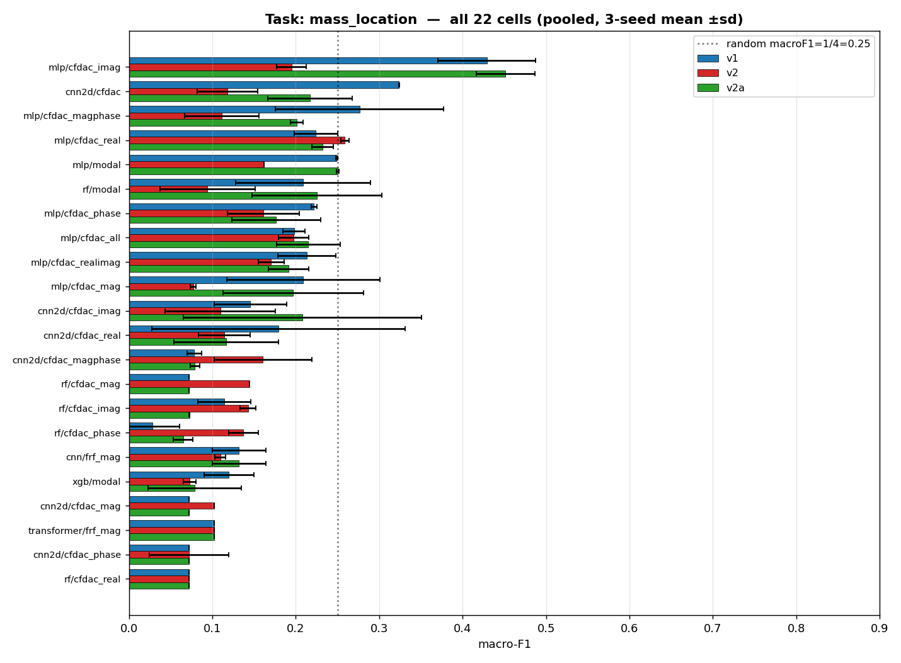

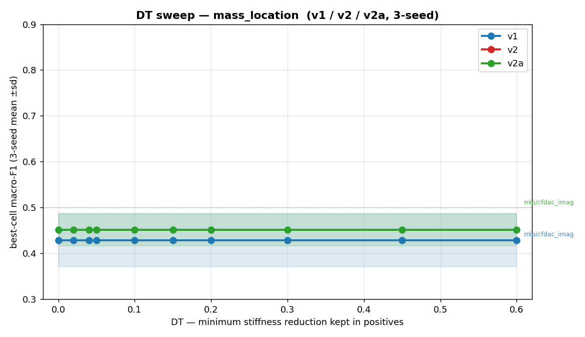

#### Cells in `mass_location`

Each cell shows what it explores, the 3-seed mean ± sd of macro-F1 per variant, and the cross-variant winner.

| cell | v1 | v2 | v2a | best | spread |
|---|---|---|---|---|---|
| `mlp/cfdac_imag` | 0.429 ± 0.058 | 0.195 ± 0.018 | 0.451 ± 0.035 | **v2a** | 0.256 |
| `cnn2d/cfdac` | 0.324 ± 0.000 | 0.118 ± 0.036 | 0.217 ± 0.051 | **v1** | 0.206 |
| `mlp/cfdac_magphase` | 0.276 ± 0.101 | 0.111 ± 0.045 | 0.201 ± 0.008 | **v1** | 0.166 |
| `mlp/cfdac_real` | 0.224 ± 0.026 | 0.259 ± 0.005 | 0.232 ± 0.013 | **v2** | 0.035 |
| `mlp/modal` | 0.249 ± 0.001 | 0.162 ± 0.000 | 0.250 ± 0.002 | **v2a** | 0.088 |
| `rf/modal` | 0.208 ± 0.081 | 0.094 ± 0.057 | 0.225 ± 0.078 | **v2a** | 0.131 |
| `mlp/cfdac_phase` | 0.222 ± 0.003 | 0.161 ± 0.043 | 0.176 ± 0.053 | **v1** | 0.061 |
| `mlp/cfdac_all` | 0.198 ± 0.013 | 0.198 ± 0.018 | 0.215 ± 0.038 | **v2a** | 0.017 |
| `mlp/cfdac_realimag` | 0.213 ± 0.035 | 0.170 ± 0.016 | 0.191 ± 0.024 | **v1** | 0.043 |
| `mlp/cfdac_mag` | 0.209 ± 0.092 | 0.077 ± 0.004 | 0.197 ± 0.084 | **v1** | 0.132 |
| `cnn2d/cfdac_imag` | 0.145 ± 0.043 | 0.109 ± 0.066 | 0.208 ± 0.143 | **v2a** | 0.099 |
| `cnn2d/cfdac_real` | 0.179 ± 0.152 | 0.114 ± 0.031 | 0.116 ± 0.063 | **v1** | 0.065 |
| `cnn2d/cfdac_magphase` | 0.078 ± 0.009 | 0.160 ± 0.059 | 0.079 ± 0.006 | **v2** | 0.082 |
| `rf/cfdac_mag` | 0.072 ± 0.000 | 0.145 ± 0.000 | 0.072 ± 0.000 | **v2** | 0.073 |
| `rf/cfdac_imag` | 0.115 ± 0.032 | 0.143 ± 0.009 | 0.072 ± 0.001 | **v2** | 0.070 |
| `rf/cfdac_phase` | 0.028 ± 0.032 | 0.137 ± 0.018 | 0.065 ± 0.012 | **v2** | 0.109 |
| `cnn/frf_mag` | 0.132 ± 0.032 | 0.109 ± 0.006 | 0.132 ± 0.032 | **v2a** | 0.023 |
| `xgb/modal` | 0.120 ± 0.030 | 0.073 ± 0.008 | 0.079 ± 0.056 | **v1** | 0.047 |
| `cnn2d/cfdac_mag` | 0.072 ± 0.000 | 0.102 ± 0.000 | 0.072 ± 0.000 | **v2** | 0.030 |
| `transformer/frf_mag` | 0.102 ± 0.000 | 0.102 ± 0.000 | 0.102 ± 0.000 | **v1** | 0.000 |
| `cnn2d/cfdac_phase` | 0.072 ± 0.000 | 0.072 ± 0.047 | 0.072 ± 0.000 | **v2** | 0.000 |
| `rf/cfdac_real` | 0.072 ± 0.000 | 0.072 ± 0.000 | 0.072 ± 0.000 | **v1** | 0.000 |

##### Cell-by-cell

- **`mlp/cfdac_imag`** — **mlp** (fully connected baseline (3 hidden layers); fast, low capacity) on **cfdac_imag** (imaginary part only of CFDAC).  
  macro-F1 — v1: 0.429 ± 0.058 · v2: 0.195 ± 0.018 · v2a: 0.451 ± 0.035.  
  Best variant: **v2a** (spread 0.256).  
  Secondary (v1): BA = 0.487, acc = 0.429.
- **`cnn2d/cfdac`** — **cnn2d** (2-D CNN treating the feature as a (channel × bin) image) on **cfdac** (Cross-FRF Damage Assurance Criterion — pristine-vs-current FRF alignment image).  
  macro-F1 — v1: 0.324 ± 0.000 · v2: 0.118 ± 0.036 · v2a: 0.217 ± 0.051.  
  Best variant: **v1** (spread 0.206).  
  Secondary (v1): BA = 0.406, acc = 0.370.
- **`mlp/cfdac_magphase`** — **mlp** (fully connected baseline (3 hidden layers); fast, low capacity) on **cfdac_magphase** (magnitude and phase CFDAC concatenated).  
  macro-F1 — v1: 0.276 ± 0.101 · v2: 0.111 ± 0.045 · v2a: 0.201 ± 0.008.  
  Best variant: **v1** (spread 0.166).  
  Secondary (v1): BA = 0.305, acc = 0.375.
- **`mlp/cfdac_real`** — **mlp** (fully connected baseline (3 hidden layers); fast, low capacity) on **cfdac_real** (real part only of CFDAC).  
  macro-F1 — v1: 0.224 ± 0.026 · v2: 0.259 ± 0.005 · v2a: 0.232 ± 0.013.  
  Best variant: **v2** (spread 0.035).  
  Secondary (v1): BA = 0.242, acc = 0.343.
- **`mlp/modal`** — **mlp** (fully connected baseline (3 hidden layers); fast, low capacity) on **modal** (physics-grounded — extracted natural frequencies + damping ratios + mode shapes).  
  macro-F1 — v1: 0.249 ± 0.001 · v2: 0.162 ± 0.000 · v2a: 0.250 ± 0.002.  
  Best variant: **v2a** (spread 0.088).  
  Secondary (v1): BA = 0.264, acc = 0.378.
- **`rf/modal`** — **rf** (random forest on flattened feature; robust non-parametric baseline) on **modal** (physics-grounded — extracted natural frequencies + damping ratios + mode shapes).  
  macro-F1 — v1: 0.208 ± 0.081 · v2: 0.094 ± 0.057 · v2a: 0.225 ± 0.078.  
  Best variant: **v2a** (spread 0.131).  
  Secondary (v1): BA = 0.357, acc = 0.328.
- **`mlp/cfdac_phase`** — **mlp** (fully connected baseline (3 hidden layers); fast, low capacity) on **cfdac_phase** (phase of CFDAC).  
  macro-F1 — v1: 0.222 ± 0.003 · v2: 0.161 ± 0.043 · v2a: 0.176 ± 0.053.  
  Best variant: **v1** (spread 0.061).  
  Secondary (v1): BA = 0.236, acc = 0.333.
- **`mlp/cfdac_all`** — **mlp** (fully connected baseline (3 hidden layers); fast, low capacity) on **cfdac_all** (all 4 CFDAC channels stacked).  
  macro-F1 — v1: 0.198 ± 0.013 · v2: 0.198 ± 0.018 · v2a: 0.215 ± 0.038.  
  Best variant: **v2a** (spread 0.017).  
  Secondary (v1): BA = 0.230, acc = 0.319.
- **`mlp/cfdac_realimag`** — **mlp** (fully connected baseline (3 hidden layers); fast, low capacity) on **cfdac_realimag** (real and imaginary CFDAC concatenated).  
  macro-F1 — v1: 0.213 ± 0.035 · v2: 0.170 ± 0.016 · v2a: 0.191 ± 0.024.  
  Best variant: **v1** (spread 0.043).  
  Secondary (v1): BA = 0.221, acc = 0.304.
- **`mlp/cfdac_mag`** — **mlp** (fully connected baseline (3 hidden layers); fast, low capacity) on **cfdac_mag** (magnitude of CFDAC).  
  macro-F1 — v1: 0.209 ± 0.092 · v2: 0.077 ± 0.004 · v2a: 0.197 ± 0.084.  
  Best variant: **v1** (spread 0.132).  
  Secondary (v1): BA = 0.236, acc = 0.332.
- **`cnn2d/cfdac_imag`** — **cnn2d** (2-D CNN treating the feature as a (channel × bin) image) on **cfdac_imag** (imaginary part only of CFDAC).  
  macro-F1 — v1: 0.145 ± 0.043 · v2: 0.109 ± 0.066 · v2a: 0.208 ± 0.143.  
  Best variant: **v2a** (spread 0.099).  
  Secondary (v1): BA = 0.291, acc = 0.235.
- **`cnn2d/cfdac_real`** — **cnn2d** (2-D CNN treating the feature as a (channel × bin) image) on **cfdac_real** (real part only of CFDAC).  
  macro-F1 — v1: 0.179 ± 0.152 · v2: 0.114 ± 0.031 · v2a: 0.116 ± 0.063.  
  Best variant: **v1** (spread 0.065).  
  Secondary (v1): BA = 0.329, acc = 0.297.
- **`cnn2d/cfdac_magphase`** — **cnn2d** (2-D CNN treating the feature as a (channel × bin) image) on **cfdac_magphase** (magnitude and phase CFDAC concatenated).  
  macro-F1 — v1: 0.078 ± 0.009 · v2: 0.160 ± 0.059 · v2a: 0.079 ± 0.006.  
  Best variant: **v2** (spread 0.082).  
  Secondary (v1): BA = 0.210, acc = 0.183.
- **`rf/cfdac_mag`** — **rf** (random forest on flattened feature; robust non-parametric baseline) on **cfdac_mag** (magnitude of CFDAC).  
  macro-F1 — v1: 0.072 ± 0.000 · v2: 0.145 ± 0.000 · v2a: 0.072 ± 0.000.  
  Best variant: **v2** (spread 0.073).  
  Secondary (v1): BA = 0.250, acc = 0.168.
- **`rf/cfdac_imag`** — **rf** (random forest on flattened feature; robust non-parametric baseline) on **cfdac_imag** (imaginary part only of CFDAC).  
  macro-F1 — v1: 0.115 ± 0.032 · v2: 0.143 ± 0.009 · v2a: 0.072 ± 0.001.  
  Best variant: **v2** (spread 0.070).  
  Secondary (v1): BA = 0.227, acc = 0.258.
- **`rf/cfdac_phase`** — **rf** (random forest on flattened feature; robust non-parametric baseline) on **cfdac_phase** (phase of CFDAC).  
  macro-F1 — v1: 0.028 ± 0.032 · v2: 0.137 ± 0.018 · v2a: 0.065 ± 0.012.  
  Best variant: **v2** (spread 0.109).  
  Secondary (v1): BA = 0.094, acc = 0.063.
- **`cnn/frf_mag`** — **cnn** (1-D convolutional net on the feature sequence; learns local spectral motifs) on **frf_mag** (FRF magnitude across frequency bins — what most damage indicators key on).  
  macro-F1 — v1: 0.132 ± 0.032 · v2: 0.109 ± 0.006 · v2a: 0.132 ± 0.032.  
  Best variant: **v2a** (spread 0.023).  
  Secondary (v1): BA = 0.279, acc = 0.256.
- **`xgb/modal`** — **xgb** (gradient-boosted trees; usually pairs best with hand-crafted modal features) on **modal** (physics-grounded — extracted natural frequencies + damping ratios + mode shapes).  
  macro-F1 — v1: 0.120 ± 0.030 · v2: 0.073 ± 0.008 · v2a: 0.079 ± 0.056.  
  Best variant: **v1** (spread 0.047).  
  Secondary (v1): BA = 0.206, acc = 0.218.
- **`cnn2d/cfdac_mag`** — **cnn2d** (2-D CNN treating the feature as a (channel × bin) image) on **cfdac_mag** (magnitude of CFDAC).  
  macro-F1 — v1: 0.072 ± 0.000 · v2: 0.102 ± 0.000 · v2a: 0.072 ± 0.000.  
  Best variant: **v2** (spread 0.030).  
  Secondary (v1): BA = 0.250, acc = 0.168.
- **`transformer/frf_mag`** — **transformer** (small self-attention encoder; captures long-range spectral structure) on **frf_mag** (FRF magnitude across frequency bins — what most damage indicators key on).  
  macro-F1 — v1: 0.102 ± 0.000 · v2: 0.102 ± 0.000 · v2a: 0.102 ± 0.000.  
  Best variant: **v1** (spread 0.000).  
  Secondary (v1): BA = 0.250, acc = 0.256.
- **`cnn2d/cfdac_phase`** — **cnn2d** (2-D CNN treating the feature as a (channel × bin) image) on **cfdac_phase** (phase of CFDAC).  
  macro-F1 — v1: 0.072 ± 0.000 · v2: 0.072 ± 0.047 · v2a: 0.072 ± 0.000.  
  Best variant: **v2** (spread 0.000).  
  Secondary (v1): BA = 0.250, acc = 0.168.
- **`rf/cfdac_real`** — **rf** (random forest on flattened feature; robust non-parametric baseline) on **cfdac_real** (real part only of CFDAC).  
  macro-F1 — v1: 0.072 ± 0.000 · v2: 0.072 ± 0.000 · v2a: 0.072 ± 0.000.  
  Best variant: **v1** (spread 0.000).  
  Secondary (v1): BA = 0.250, acc = 0.168.

---
### 9. Bolt-severity regression — `severity` (MAE, lower = better)
**Question.** What fraction of the bolt is loosened (regression on bolt cases)?
**Output axis.** continuous bolt-loosening fraction ∈ [0, 1]
**Notes.** Only defined on bolt cases. Sample mean ≈ 0.7, std ≈ 0.18 — the trivial predict-the-mean baseline gives MAE ≈ 0.15. **Lower is better.**
**Cells in this task:** 22

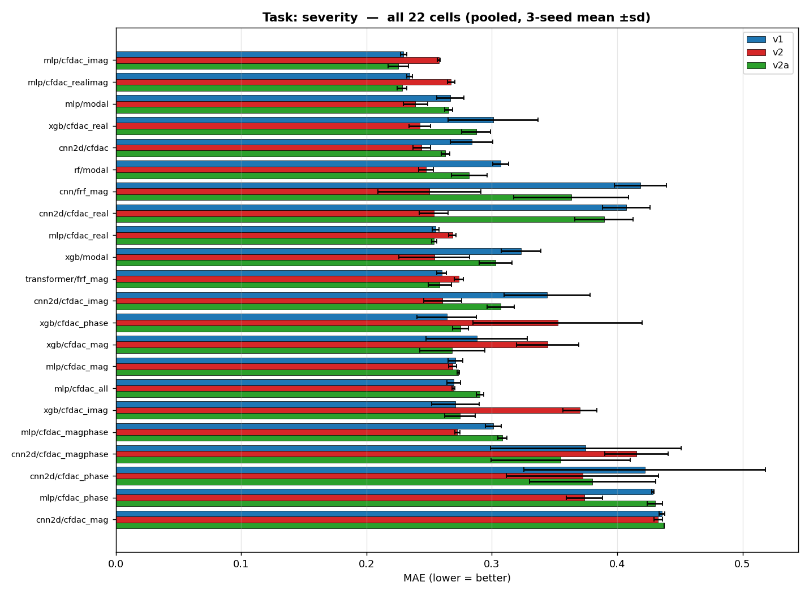

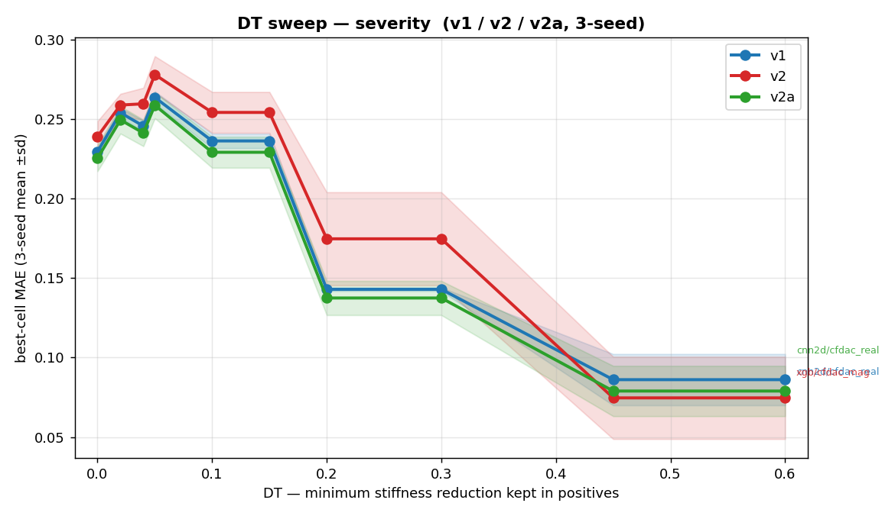

#### Cells in `severity`

Each cell shows what it explores, the 3-seed mean ± sd of MAE per variant, and the cross-variant winner.

| cell | v1 | v2 | v2a | best | spread |
|---|---|---|---|---|---|
| `mlp/cfdac_imag` | 0.230 ± 0.002 | 0.258 ± 0.001 | 0.225 ± 0.008 | **v2a** | 0.032 |
| `mlp/cfdac_realimag` | 0.235 ± 0.002 | 0.267 ± 0.003 | 0.228 ± 0.004 | **v2a** | 0.039 |
| `mlp/modal` | 0.267 ± 0.011 | 0.239 ± 0.010 | 0.265 ± 0.003 | **v2** | 0.028 |
| `xgb/cfdac_real` | 0.301 ± 0.036 | 0.242 ± 0.009 | 0.287 ± 0.011 | **v2** | 0.059 |
| `cnn2d/cfdac` | 0.284 ± 0.017 | 0.244 ± 0.007 | 0.263 ± 0.003 | **v2** | 0.040 |
| `rf/modal` | 0.307 ± 0.006 | 0.248 ± 0.006 | 0.282 ± 0.014 | **v2** | 0.059 |
| `cnn/frf_mag` | 0.419 ± 0.021 | 0.250 ± 0.041 | 0.363 ± 0.046 | **v2** | 0.168 |
| `cnn2d/cfdac_real` | 0.407 ± 0.019 | 0.254 ± 0.011 | 0.390 ± 0.023 | **v2** | 0.154 |
| `mlp/cfdac_real` | 0.255 ± 0.003 | 0.269 ± 0.003 | 0.254 ± 0.002 | **v2a** | 0.015 |
| `xgb/modal` | 0.323 ± 0.016 | 0.254 ± 0.028 | 0.303 ± 0.013 | **v2** | 0.069 |
| `transformer/frf_mag` | 0.260 ± 0.004 | 0.274 ± 0.003 | 0.258 ± 0.009 | **v2a** | 0.015 |
| `cnn2d/cfdac_imag` | 0.344 ± 0.034 | 0.261 ± 0.015 | 0.307 ± 0.011 | **v2** | 0.083 |
| `xgb/cfdac_phase` | 0.264 ± 0.024 | 0.353 ± 0.067 | 0.275 ± 0.006 | **v1** | 0.089 |
| `xgb/cfdac_mag` | 0.288 ± 0.040 | 0.345 ± 0.025 | 0.268 ± 0.026 | **v2a** | 0.076 |
| `mlp/cfdac_mag` | 0.271 ± 0.006 | 0.269 ± 0.003 | 0.273 ± 0.001 | **v2** | 0.004 |
| `mlp/cfdac_all` | 0.270 ± 0.005 | 0.269 ± 0.001 | 0.290 ± 0.003 | **v2** | 0.021 |
| `xgb/cfdac_imag` | 0.271 ± 0.019 | 0.370 ± 0.014 | 0.275 ± 0.012 | **v1** | 0.099 |
| `mlp/cfdac_magphase` | 0.301 ± 0.006 | 0.273 ± 0.002 | 0.308 ± 0.004 | **v2** | 0.036 |
| `cnn2d/cfdac_magphase` | 0.375 ± 0.076 | 0.415 ± 0.025 | 0.355 ± 0.056 | **v2a** | 0.060 |
| `cnn2d/cfdac_phase` | 0.422 ± 0.096 | 0.372 ± 0.061 | 0.380 ± 0.050 | **v2** | 0.049 |
| `mlp/cfdac_phase` | 0.428 ± 0.001 | 0.374 ± 0.015 | 0.430 ± 0.006 | **v2** | 0.056 |
| `cnn2d/cfdac_mag` | 0.436 ± 0.002 | 0.433 ± 0.003 | 0.437 ± 0.000 | **v2** | 0.005 |

##### Cell-by-cell

- **`mlp/cfdac_imag`** — **mlp** (fully connected baseline (3 hidden layers); fast, low capacity) on **cfdac_imag** (imaginary part only of CFDAC).  
  MAE — v1: 0.230 ± 0.002 · v2: 0.258 ± 0.001 · v2a: 0.225 ± 0.008.  
  Best variant: **v2a** (spread 0.032).  
  Secondary (v1): R² = 0.103, MSE = 0.092.
- **`mlp/cfdac_realimag`** — **mlp** (fully connected baseline (3 hidden layers); fast, low capacity) on **cfdac_realimag** (real and imaginary CFDAC concatenated).  
  MAE — v1: 0.235 ± 0.002 · v2: 0.267 ± 0.003 · v2a: 0.228 ± 0.004.  
  Best variant: **v2a** (spread 0.039).  
  Secondary (v1): R² = 0.135, MSE = 0.089.
- **`mlp/modal`** — **mlp** (fully connected baseline (3 hidden layers); fast, low capacity) on **modal** (physics-grounded — extracted natural frequencies + damping ratios + mode shapes).  
  MAE — v1: 0.267 ± 0.011 · v2: 0.239 ± 0.010 · v2a: 0.265 ± 0.003.  
  Best variant: **v2** (spread 0.028).  
  Secondary (v1): R² = -0.051, MSE = 0.108.
- **`xgb/cfdac_real`** — **xgb** (gradient-boosted trees; usually pairs best with hand-crafted modal features) on **cfdac_real** (real part only of CFDAC).  
  MAE — v1: 0.301 ± 0.036 · v2: 0.242 ± 0.009 · v2a: 0.287 ± 0.011.  
  Best variant: **v2** (spread 0.059).  
  Secondary (v1): R² = -0.226, MSE = 0.126.
- **`cnn2d/cfdac`** — **cnn2d** (2-D CNN treating the feature as a (channel × bin) image) on **cfdac** (Cross-FRF Damage Assurance Criterion — pristine-vs-current FRF alignment image).  
  MAE — v1: 0.284 ± 0.017 · v2: 0.244 ± 0.007 · v2a: 0.263 ± 0.003.  
  Best variant: **v2** (spread 0.040).  
  Secondary (v1): R² = -0.232, MSE = 0.127.
- **`rf/modal`** — **rf** (random forest on flattened feature; robust non-parametric baseline) on **modal** (physics-grounded — extracted natural frequencies + damping ratios + mode shapes).  
  MAE — v1: 0.307 ± 0.006 · v2: 0.248 ± 0.006 · v2a: 0.282 ± 0.014.  
  Best variant: **v2** (spread 0.059).  
  Secondary (v1): R² = -0.266, MSE = 0.131.
- **`cnn/frf_mag`** — **cnn** (1-D convolutional net on the feature sequence; learns local spectral motifs) on **frf_mag** (FRF magnitude across frequency bins — what most damage indicators key on).  
  MAE — v1: 0.419 ± 0.021 · v2: 0.250 ± 0.041 · v2a: 0.363 ± 0.046.  
  Best variant: **v2** (spread 0.168).  
  Secondary (v1): R² = -1.622, MSE = 0.270.
- **`cnn2d/cfdac_real`** — **cnn2d** (2-D CNN treating the feature as a (channel × bin) image) on **cfdac_real** (real part only of CFDAC).  
  MAE — v1: 0.407 ± 0.019 · v2: 0.254 ± 0.011 · v2a: 0.390 ± 0.023.  
  Best variant: **v2** (spread 0.154).  
  Secondary (v1): R² = -1.511, MSE = 0.259.
- **`mlp/cfdac_real`** — **mlp** (fully connected baseline (3 hidden layers); fast, low capacity) on **cfdac_real** (real part only of CFDAC).  
  MAE — v1: 0.255 ± 0.003 · v2: 0.269 ± 0.003 · v2a: 0.254 ± 0.002.  
  Best variant: **v2a** (spread 0.015).  
  Secondary (v1): R² = 0.032, MSE = 0.100.
- **`xgb/modal`** — **xgb** (gradient-boosted trees; usually pairs best with hand-crafted modal features) on **modal** (physics-grounded — extracted natural frequencies + damping ratios + mode shapes).  
  MAE — v1: 0.323 ± 0.016 · v2: 0.254 ± 0.028 · v2a: 0.303 ± 0.013.  
  Best variant: **v2** (spread 0.069).  
  Secondary (v1): R² = -0.447, MSE = 0.149.
- **`transformer/frf_mag`** — **transformer** (small self-attention encoder; captures long-range spectral structure) on **frf_mag** (FRF magnitude across frequency bins — what most damage indicators key on).  
  MAE — v1: 0.260 ± 0.004 · v2: 0.274 ± 0.003 · v2a: 0.258 ± 0.009.  
  Best variant: **v2a** (spread 0.015).  
  Secondary (v1): R² = 0.062, MSE = 0.097.
- **`cnn2d/cfdac_imag`** — **cnn2d** (2-D CNN treating the feature as a (channel × bin) image) on **cfdac_imag** (imaginary part only of CFDAC).  
  MAE — v1: 0.344 ± 0.034 · v2: 0.261 ± 0.015 · v2a: 0.307 ± 0.011.  
  Best variant: **v2** (spread 0.083).  
  Secondary (v1): R² = -0.699, MSE = 0.175.
- **`xgb/cfdac_phase`** — **xgb** (gradient-boosted trees; usually pairs best with hand-crafted modal features) on **cfdac_phase** (phase of CFDAC).  
  MAE — v1: 0.264 ± 0.024 · v2: 0.353 ± 0.067 · v2a: 0.275 ± 0.006.  
  Best variant: **v1** (spread 0.089).  
  Secondary (v1): R² = 0.025, MSE = 0.101.
- **`xgb/cfdac_mag`** — **xgb** (gradient-boosted trees; usually pairs best with hand-crafted modal features) on **cfdac_mag** (magnitude of CFDAC).  
  MAE — v1: 0.288 ± 0.040 · v2: 0.345 ± 0.025 · v2a: 0.268 ± 0.026.  
  Best variant: **v2a** (spread 0.076).  
  Secondary (v1): R² = -0.181, MSE = 0.122.
- **`mlp/cfdac_mag`** — **mlp** (fully connected baseline (3 hidden layers); fast, low capacity) on **cfdac_mag** (magnitude of CFDAC).  
  MAE — v1: 0.271 ± 0.006 · v2: 0.269 ± 0.003 · v2a: 0.273 ± 0.001.  
  Best variant: **v2** (spread 0.004).  
  Secondary (v1): R² = -0.052, MSE = 0.108.
- **`mlp/cfdac_all`** — **mlp** (fully connected baseline (3 hidden layers); fast, low capacity) on **cfdac_all** (all 4 CFDAC channels stacked).  
  MAE — v1: 0.270 ± 0.005 · v2: 0.269 ± 0.001 · v2a: 0.290 ± 0.003.  
  Best variant: **v2** (spread 0.021).  
  Secondary (v1): R² = -0.167, MSE = 0.120.
- **`xgb/cfdac_imag`** — **xgb** (gradient-boosted trees; usually pairs best with hand-crafted modal features) on **cfdac_imag** (imaginary part only of CFDAC).  
  MAE — v1: 0.271 ± 0.019 · v2: 0.370 ± 0.014 · v2a: 0.275 ± 0.012.  
  Best variant: **v1** (spread 0.099).  
  Secondary (v1): R² = -0.055, MSE = 0.109.
- **`mlp/cfdac_magphase`** — **mlp** (fully connected baseline (3 hidden layers); fast, low capacity) on **cfdac_magphase** (magnitude and phase CFDAC concatenated).  
  MAE — v1: 0.301 ± 0.006 · v2: 0.273 ± 0.002 · v2a: 0.308 ± 0.004.  
  Best variant: **v2** (spread 0.036).  
  Secondary (v1): R² = -0.437, MSE = 0.148.
- **`cnn2d/cfdac_magphase`** — **cnn2d** (2-D CNN treating the feature as a (channel × bin) image) on **cfdac_magphase** (magnitude and phase CFDAC concatenated).  
  MAE — v1: 0.375 ± 0.076 · v2: 0.415 ± 0.025 · v2a: 0.355 ± 0.056.  
  Best variant: **v2a** (spread 0.060).  
  Secondary (v1): R² = -1.237, MSE = 0.231.
- **`cnn2d/cfdac_phase`** — **cnn2d** (2-D CNN treating the feature as a (channel × bin) image) on **cfdac_phase** (phase of CFDAC).  
  MAE — v1: 0.422 ± 0.096 · v2: 0.372 ± 0.061 · v2a: 0.380 ± 0.050.  
  Best variant: **v2** (spread 0.049).  
  Secondary (v1): R² = -1.646, MSE = 0.273.
- **`mlp/cfdac_phase`** — **mlp** (fully connected baseline (3 hidden layers); fast, low capacity) on **cfdac_phase** (phase of CFDAC).  
  MAE — v1: 0.428 ± 0.001 · v2: 0.374 ± 0.015 · v2a: 0.430 ± 0.006.  
  Best variant: **v2** (spread 0.056).  
  Secondary (v1): R² = -1.762, MSE = 0.285.
- **`cnn2d/cfdac_mag`** — **cnn2d** (2-D CNN treating the feature as a (channel × bin) image) on **cfdac_mag** (magnitude of CFDAC).  
  MAE — v1: 0.436 ± 0.002 · v2: 0.433 ± 0.003 · v2a: 0.437 ± 0.000.  
  Best variant: **v2** (spread 0.005).  
  Secondary (v1): R² = -1.834, MSE = 0.292.

---
### 10. Damage-type classification — `type` (5 classes)
**Question.** Which of {pristine, crack, hole, bolt loosening, added mass} is this?
**Output axis.** closed-set 5-way classification
**Notes.** Hardest of the multi-class tasks because it mixes the difficult `is_crack` axis with the easy `is_bolt` axis. Random = 1/5 = 0.20.
**Cells in this task:** 22

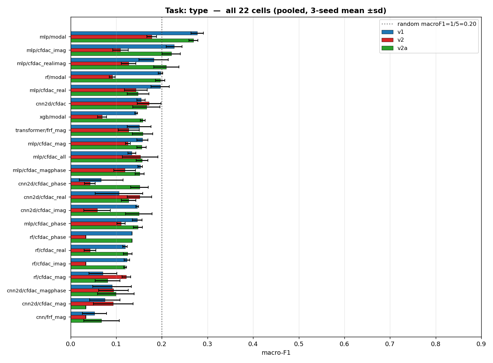

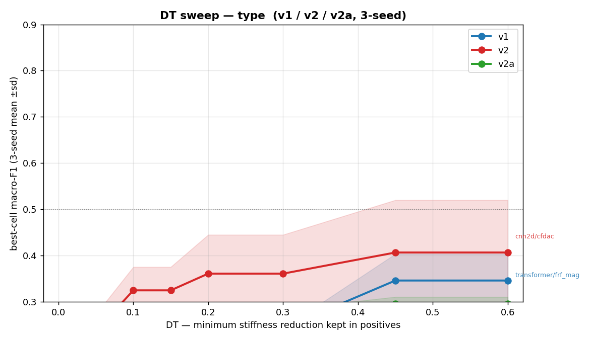

#### Cells in `type`

Each cell shows what it explores, the 3-seed mean ± sd of macro-F1 per variant, and the cross-variant winner.

| cell | v1 | v2 | v2a | best | spread |
|---|---|---|---|---|---|
| `mlp/modal` | 0.278 ± 0.013 | 0.178 ± 0.011 | 0.269 ± 0.010 | **v1** | 0.100 |
| `mlp/cfdac_imag` | 0.227 ± 0.017 | 0.109 ± 0.017 | 0.221 ± 0.020 | **v1** | 0.118 |
| `mlp/cfdac_realimag` | 0.182 ± 0.032 | 0.127 ± 0.016 | 0.210 ± 0.028 | **v2a** | 0.083 |
| `rf/modal` | 0.197 ± 0.005 | 0.091 ± 0.006 | 0.196 ± 0.010 | **v1** | 0.106 |
| `mlp/cfdac_real` | 0.196 ± 0.020 | 0.143 ± 0.025 | 0.148 ± 0.024 | **v1** | 0.053 |
| `cnn2d/cfdac` | 0.154 ± 0.009 | 0.172 ± 0.026 | 0.166 ± 0.030 | **v2** | 0.018 |
| `xgb/modal` | 0.144 ± 0.003 | 0.069 ± 0.010 | 0.158 ± 0.005 | **v2a** | 0.089 |
| `transformer/frf_mag` | 0.150 ± 0.026 | 0.127 ± 0.023 | 0.158 ± 0.022 | **v2a** | 0.030 |
| `mlp/cfdac_mag` | 0.157 ± 0.012 | 0.125 ± 0.005 | 0.156 ± 0.010 | **v1** | 0.032 |
| `mlp/cfdac_all` | 0.134 ± 0.009 | 0.153 ± 0.039 | 0.157 ± 0.013 | **v2a** | 0.022 |
| `mlp/cfdac_magphase` | 0.152 ± 0.005 | 0.119 ± 0.024 | 0.152 ± 0.010 | **v1** | 0.034 |
| `cnn2d/cfdac_phase` | 0.067 ± 0.048 | 0.042 ± 0.012 | 0.151 ± 0.019 | **v2a** | 0.109 |
| `cnn2d/cfdac_real` | 0.106 ± 0.052 | 0.151 ± 0.027 | 0.127 ± 0.016 | **v2** | 0.045 |
| `cnn2d/cfdac_imag` | 0.146 ± 0.003 | 0.058 ± 0.029 | 0.149 ± 0.029 | **v2a** | 0.091 |
| `mlp/cfdac_phase` | 0.146 ± 0.011 | 0.111 ± 0.009 | 0.148 ± 0.010 | **v2a** | 0.037 |
| `rf/cfdac_phase` | 0.135 ± 0.000 | 0.033 ± 0.000 | 0.135 ± 0.000 | **v1** | 0.102 |
| `rf/cfdac_real` | 0.119 ± 0.005 | 0.042 ± 0.013 | 0.125 ± 0.009 | **v2a** | 0.083 |
| `rf/cfdac_imag` | 0.124 ± 0.006 | 0.033 ± 0.000 | 0.120 ± 0.003 | **v1** | 0.090 |
| `rf/cfdac_mag` | 0.071 ± 0.031 | 0.122 ± 0.009 | 0.081 ± 0.027 | **v2** | 0.051 |
| `cnn2d/cfdac_magphase` | 0.091 ± 0.042 | 0.094 ± 0.032 | 0.099 ± 0.040 | **v2a** | 0.008 |
| `cnn2d/cfdac_mag` | 0.075 ± 0.033 | 0.093 ± 0.044 | 0.033 ± 0.000 | **v2** | 0.060 |
| `cnn/frf_mag` | 0.052 ± 0.026 | 0.033 ± 0.000 | 0.068 ± 0.039 | **v2a** | 0.035 |

##### Cell-by-cell

- **`mlp/modal`** — **mlp** (fully connected baseline (3 hidden layers); fast, low capacity) on **modal** (physics-grounded — extracted natural frequencies + damping ratios + mode shapes).  
  macro-F1 — v1: 0.278 ± 0.013 · v2: 0.178 ± 0.011 · v2a: 0.269 ± 0.010.  
  Best variant: **v1** (spread 0.100).  
  Secondary (v1): BA = 0.352, acc = 0.371.
- **`mlp/cfdac_imag`** — **mlp** (fully connected baseline (3 hidden layers); fast, low capacity) on **cfdac_imag** (imaginary part only of CFDAC).  
  macro-F1 — v1: 0.227 ± 0.017 · v2: 0.109 ± 0.017 · v2a: 0.221 ± 0.020.  
  Best variant: **v1** (spread 0.118).  
  Secondary (v1): BA = 0.304, acc = 0.321.
- **`mlp/cfdac_realimag`** — **mlp** (fully connected baseline (3 hidden layers); fast, low capacity) on **cfdac_realimag** (real and imaginary CFDAC concatenated).  
  macro-F1 — v1: 0.182 ± 0.032 · v2: 0.127 ± 0.016 · v2a: 0.210 ± 0.028.  
  Best variant: **v2a** (spread 0.083).  
  Secondary (v1): BA = 0.242, acc = 0.201.
- **`rf/modal`** — **rf** (random forest on flattened feature; robust non-parametric baseline) on **modal** (physics-grounded — extracted natural frequencies + damping ratios + mode shapes).  
  macro-F1 — v1: 0.197 ± 0.005 · v2: 0.091 ± 0.006 · v2a: 0.196 ± 0.010.  
  Best variant: **v1** (spread 0.106).  
  Secondary (v1): BA = 0.227, acc = 0.408.
- **`mlp/cfdac_real`** — **mlp** (fully connected baseline (3 hidden layers); fast, low capacity) on **cfdac_real** (real part only of CFDAC).  
  macro-F1 — v1: 0.196 ± 0.020 · v2: 0.143 ± 0.025 · v2a: 0.148 ± 0.024.  
  Best variant: **v1** (spread 0.053).  
  Secondary (v1): BA = 0.286, acc = 0.184.
- **`cnn2d/cfdac`** — **cnn2d** (2-D CNN treating the feature as a (channel × bin) image) on **cfdac** (Cross-FRF Damage Assurance Criterion — pristine-vs-current FRF alignment image).  
  macro-F1 — v1: 0.154 ± 0.009 · v2: 0.172 ± 0.026 · v2a: 0.166 ± 0.030.  
  Best variant: **v2** (spread 0.018).  
  Secondary (v1): BA = 0.205, acc = 0.264.
- **`xgb/modal`** — **xgb** (gradient-boosted trees; usually pairs best with hand-crafted modal features) on **modal** (physics-grounded — extracted natural frequencies + damping ratios + mode shapes).  
  macro-F1 — v1: 0.144 ± 0.003 · v2: 0.069 ± 0.010 · v2a: 0.158 ± 0.005.  
  Best variant: **v2a** (spread 0.089).  
  Secondary (v1): BA = 0.209, acc = 0.248.
- **`transformer/frf_mag`** — **transformer** (small self-attention encoder; captures long-range spectral structure) on **frf_mag** (FRF magnitude across frequency bins — what most damage indicators key on).  
  macro-F1 — v1: 0.150 ± 0.026 · v2: 0.127 ± 0.023 · v2a: 0.158 ± 0.022.  
  Best variant: **v2a** (spread 0.030).  
  Secondary (v1): BA = 0.255, acc = 0.236.
- **`mlp/cfdac_mag`** — **mlp** (fully connected baseline (3 hidden layers); fast, low capacity) on **cfdac_mag** (magnitude of CFDAC).  
  macro-F1 — v1: 0.157 ± 0.012 · v2: 0.125 ± 0.005 · v2a: 0.156 ± 0.010.  
  Best variant: **v1** (spread 0.032).  
  Secondary (v1): BA = 0.201, acc = 0.339.
- **`mlp/cfdac_all`** — **mlp** (fully connected baseline (3 hidden layers); fast, low capacity) on **cfdac_all** (all 4 CFDAC channels stacked).  
  macro-F1 — v1: 0.134 ± 0.009 · v2: 0.153 ± 0.039 · v2a: 0.157 ± 0.013.  
  Best variant: **v2a** (spread 0.022).  
  Secondary (v1): BA = 0.207, acc = 0.280.
- **`mlp/cfdac_magphase`** — **mlp** (fully connected baseline (3 hidden layers); fast, low capacity) on **cfdac_magphase** (magnitude and phase CFDAC concatenated).  
  macro-F1 — v1: 0.152 ± 0.005 · v2: 0.119 ± 0.024 · v2a: 0.152 ± 0.010.  
  Best variant: **v1** (spread 0.034).  
  Secondary (v1): BA = 0.200, acc = 0.384.
- **`cnn2d/cfdac_phase`** — **cnn2d** (2-D CNN treating the feature as a (channel × bin) image) on **cfdac_phase** (phase of CFDAC).  
  macro-F1 — v1: 0.067 ± 0.048 · v2: 0.042 ± 0.012 · v2a: 0.151 ± 0.019.  
  Best variant: **v2a** (spread 0.109).  
  Secondary (v1): BA = 0.200, acc = 0.229.
- **`cnn2d/cfdac_real`** — **cnn2d** (2-D CNN treating the feature as a (channel × bin) image) on **cfdac_real** (real part only of CFDAC).  
  macro-F1 — v1: 0.106 ± 0.052 · v2: 0.151 ± 0.027 · v2a: 0.127 ± 0.016.  
  Best variant: **v2** (spread 0.045).  
  Secondary (v1): BA = 0.201, acc = 0.360.
- **`cnn2d/cfdac_imag`** — **cnn2d** (2-D CNN treating the feature as a (channel × bin) image) on **cfdac_imag** (imaginary part only of CFDAC).  
  macro-F1 — v1: 0.146 ± 0.003 · v2: 0.058 ± 0.029 · v2a: 0.149 ± 0.029.  
  Best variant: **v2a** (spread 0.091).  
  Secondary (v1): BA = 0.198, acc = 0.322.
- **`mlp/cfdac_phase`** — **mlp** (fully connected baseline (3 hidden layers); fast, low capacity) on **cfdac_phase** (phase of CFDAC).  
  macro-F1 — v1: 0.146 ± 0.011 · v2: 0.111 ± 0.009 · v2a: 0.148 ± 0.010.  
  Best variant: **v2a** (spread 0.037).  
  Secondary (v1): BA = 0.189, acc = 0.436.
- **`rf/cfdac_phase`** — **rf** (random forest on flattened feature; robust non-parametric baseline) on **cfdac_phase** (phase of CFDAC).  
  macro-F1 — v1: 0.135 ± 0.000 · v2: 0.033 ± 0.000 · v2a: 0.135 ± 0.000.  
  Best variant: **v1** (spread 0.102).  
  Secondary (v1): BA = 0.200, acc = 0.507.
- **`rf/cfdac_real`** — **rf** (random forest on flattened feature; robust non-parametric baseline) on **cfdac_real** (real part only of CFDAC).  
  macro-F1 — v1: 0.119 ± 0.005 · v2: 0.042 ± 0.013 · v2a: 0.125 ± 0.009.  
  Best variant: **v2a** (spread 0.083).  
  Secondary (v1): BA = 0.161, acc = 0.352.
- **`rf/cfdac_imag`** — **rf** (random forest on flattened feature; robust non-parametric baseline) on **cfdac_imag** (imaginary part only of CFDAC).  
  macro-F1 — v1: 0.124 ± 0.006 · v2: 0.033 ± 0.000 · v2a: 0.120 ± 0.003.  
  Best variant: **v1** (spread 0.090).  
  Secondary (v1): BA = 0.167, acc = 0.414.
- **`rf/cfdac_mag`** — **rf** (random forest on flattened feature; robust non-parametric baseline) on **cfdac_mag** (magnitude of CFDAC).  
  macro-F1 — v1: 0.071 ± 0.031 · v2: 0.122 ± 0.009 · v2a: 0.081 ± 0.027.  
  Best variant: **v2** (spread 0.051).  
  Secondary (v1): BA = 0.221, acc = 0.145.
- **`cnn2d/cfdac_magphase`** — **cnn2d** (2-D CNN treating the feature as a (channel × bin) image) on **cfdac_magphase** (magnitude and phase CFDAC concatenated).  
  macro-F1 — v1: 0.091 ± 0.042 · v2: 0.094 ± 0.032 · v2a: 0.099 ± 0.040.  
  Best variant: **v2a** (spread 0.008).  
  Secondary (v1): BA = 0.192, acc = 0.263.
- **`cnn2d/cfdac_mag`** — **cnn2d** (2-D CNN treating the feature as a (channel × bin) image) on **cfdac_mag** (magnitude of CFDAC).  
  macro-F1 — v1: 0.075 ± 0.033 · v2: 0.093 ± 0.044 · v2a: 0.033 ± 0.000.  
  Best variant: **v2** (spread 0.060).  
  Secondary (v1): BA = 0.224, acc = 0.146.
- **`cnn/frf_mag`** — **cnn** (1-D convolutional net on the feature sequence; learns local spectral motifs) on **frf_mag** (FRF magnitude across frequency bins — what most damage indicators key on).  
  macro-F1 — v1: 0.052 ± 0.026 · v2: 0.033 ± 0.000 · v2a: 0.068 ± 0.039.  
  Best variant: **v2a** (spread 0.035).  
  Secondary (v1): BA = 0.211, acc = 0.118.

---
## Cross-task synthesis
### A. The v1 reference
v1 wins or ties on **localization** (`col_location` severe-only, `mass_location`)
and holds the `is_hole/mlp/modal` modal-MLP signal. It is the safe
reference.

### B. The v2 collapse — multi-seed confirmed, cause isolated
- `is_hole/mlp/modal`: v1 BA 0.651 → v2 BA **0.500** (chance) for all 3
  seeds.
- `is_crack/mlp/modal`: v1 BA 0.596 → v2 BA **0.500**.
- `mass_location`: 0.429 → **0.259**.
- **v2a does NOT collapse** on these cells. The only thing v2 adds over
  v2a is the **widened DR (P1.2)** → that is the culprit, not the
  asymmetric damage geometry.

### C. The v2a verdict — REJECTED-but-marginal, hypothesis-rescuing
- C4 floor (`is_hole/mlp/modal` ≥ v1 − 2σ) fails by ~1σ (0.621 vs floor
  0.653).
- C2 (`col_location/mlp/modal` 2σ improvement) fails.
- However, asymmetric geometry is **best-localizer** in the
  spatial-classification tasks (col_location severe-only 0.328 ≥ v1 0.309),
  and `is_crack` improves directionally.
- **Net:** v2a does not adopt under the registered rule, but it succeeds at
  its scientific job — pinpointing widened DR as v2's failure mode.

### D. The detection failure
Across `binary` and `is_pristine`, **DT restriction does not help.** This
is the real, variant-independent limitation: the synthetic spectra teach
the models damage *characterisation*, not damage *detection*. Any future
physics iteration should target this, not the geometry knob.

### E. Tasks that transfer at high severity (good news)
- `is_bolt` at 85 % loosening → ~0.82 macro-F1 across all variants.
- `is_hole` at ≥ 6 mm diameter → ≥ 0.65 across all variants.
- `type` (5-cls) climbs steadily with DT restriction.
- `severity` (MAE) improves with restriction, all three variants.

These results are **robust across the physics variant** — the positive
signal in the study is not an artefact of one DR choice.

---
## High-resolution 1601² CFDAC sweep — *does full resolution help?*

**Motivation.** Every result above uses CFDAC decimated to **128²**. The
experimental FRFs are natively **1601 bins** (0–100 Hz, df = 0.0625 Hz), so a
natural question is whether computing CFDAC at the **full 1601² native grid**
recovers signal that decimation throws away. To test it, the synthetic dataset
was **regenerated at a 16 s simulation length** (N_T = 4096, fs = 256 →
df = 0.0625 Hz, all 9 channels) so synth and experiment share the same FRF
grid exactly, and for **each of the 10 tasks the single top-performing CFDAC
cell** (by 128² synth ranking) was re-trained at 1601² and evaluated on
held-out synth (in-domain) and the full 2 638-case experimental set (zero-shot).

**Configuration (preliminary, single-seed).** 2-channel `cfdac_realimag`
(real+imag); CFDAC recomputed per-sample at 1601²; synth subsample 1 500;
4 epochs; seed 42; class-weighted loss; per-sample mean-subtract
normalisation. Bespoke `cnn2d` for binary / col_location / mass_location /
severity / type; ImageNet-pretrained **ConvNeXt-T** for is_bolt / is_crack /
is_mass and **ResNet50** for is_hole / is_pristine (head-probe 2 epochs, then
backbone unfreeze). Run on **CPU (no GPU available)**, ~25–50 min/cell.
Metrics are **balanced accuracy / macro-F1**, never raw accuracy.

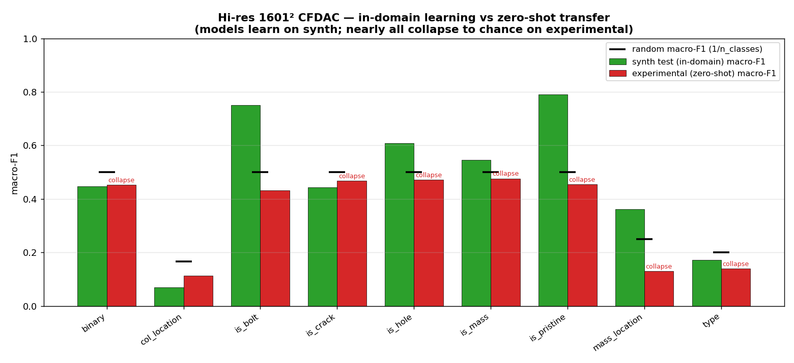

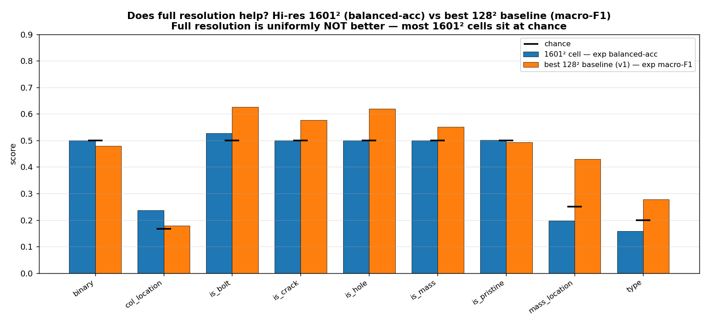

### Per-cell results (1601², seed 42)

| task | cell (model / feature) | synth test (in-domain) | **exp macro-F1** | **exp bal-acc** | exp acc | class prior | collapse? | best 128² (v1) |
|---|---|---|---|---|---|---|---|---|
| binary | `cnn2d/cfdac_realimag` | mF1 0.447 | 0.452 | **0.500** | 0.825 | 0.825 | **yes** (all-damaged) | mlp/modal 0.480 |
| is_pristine | `resnet50/cfdac_realimag` | mF1 0.791 | 0.454 | **0.501** | 0.825 | 0.825 | **yes** (all-damaged) | mlp/modal 0.494 |
| is_bolt | `convnext_tiny/cfdac_realimag` | mF1 0.750 | 0.432 | 0.527 | 0.521 | 0.507 | no (marginal) | cnn2d/cfdac 0.626 |
| is_crack | `convnext_tiny/cfdac_realimag` | mF1 0.443 | 0.468 | **0.500** | 0.879 | 0.879 | **yes** (all-negative) | mlp/modal 0.577 |
| is_hole | `resnet50/cfdac_realimag` | mF1 0.608 | 0.472 | **0.500** | 0.894 | 0.894 | **yes** (all-negative) | mlp/modal 0.619 |
| is_mass | `convnext_tiny/cfdac_realimag` | mF1 0.546 | 0.476 | **0.500** | 0.910 | 0.910 | **yes** (all-negative) | mlp/cfdac_mag 0.551 |
| col_location | `cnn2d/cfdac_realimag` | mF1 0.070 | 0.114 | 0.237 | 0.221 | 0.377 | near (3/6 classes) | mlp/cfdac_realimag 0.179 |
| mass_location | `cnn2d/cfdac_realimag` | mF1 0.362 | 0.130 | 0.197 | 0.315 | 0.408 | **yes** (<chance) | mlp/cfdac_imag 0.429 |
| type | `cnn2d/cfdac_realimag` | mF1 0.173 | 0.140 | 0.158 | 0.313 | 0.507 | **yes** (<chance) | mlp/modal 0.278 |
| severity | `cnn2d/cfdac_realimag` (reg) | R² 0.077 | R² **−0.941** | — | — | — | fails | mlp/cfdac_imag (MAE 0.23) |

### Cell-by-cell reading

- **binary** — class-collapses to all-damaged (exp bal-acc 0.500 = chance; acc
  0.825 is just the 82.5 % damaged prior). Identical failure to the 128² study.
- **is_pristine** (inverse of binary) — strongest in-domain learner of the
  sweep (synth mF1 **0.791**) yet collapses to all-damaged on experimental
  (bal-acc 0.501). The clearest illustration that in-domain skill ≠ transfer.
- **is_bolt** — the **only** cell above chance on experimental (bal-acc 0.527,
  macro-F1 0.432), but heavily "not-bolt"-biased (TPR 0.124) and **well below**
  its own 128² baseline (cnn2d/cfdac 0.626). High synth skill (0.750) does not
  carry over.
- **is_crack / is_hole / is_mass** (vision one-vs-rest detectors) — all learn
  on synth (0.44–0.61) but **collapse to all-negative on experimental**
  (TPR ≈ 0.000, bal-acc 0.500). The pretrained backbones, fine-tuned on 1 500
  synth CFDACs, predict the majority class on every real case.
- **col_location / mass_location** — localization barely learns even in-domain
  (col_location synth mF1 0.070 ≈ chance) and falls **below chance** on
  experimental (mass_location bal-acc 0.197 < 0.250). Consistent with the
  symmetric-damage degeneracy noted in §2/§8.
- **type** (5-class) — best 128² transferrer in the DT study, here collapses to
  exp bal-acc 0.158 (< 0.200 chance), predicting 4 of 5 classes.
- **severity** — synth R² 0.077 (weak in-domain) and exp R² **−0.941** (worse
  than predicting the mean): no transfer.

### Verdict — full resolution does **not** help

1. **Uniformly not better.** On every one of the 10 tasks the 1601² cell is
   **at or below** the best 128² baseline cell on experimental data
   (e.g. is_hole 0.500 vs 0.619; mass_location 0.197 vs 0.429; type 0.158 vs
   0.278). There is **no task where full resolution recovers signal.**
2. **The gap is sim-to-real, not resolution.** Cells learn perfectly well
   in-domain at 1601² (is_pristine 0.79, is_bolt 0.75, is_hole 0.61) and still
   collapse zero-shot — exactly the **absolute-magnitude covariate shift**
   diagnosed in §"modal-gap". More pixels do not change the direction of the
   shift.
3. **The chosen architectures discard the resolution anyway** (an honest
   confound). The bespoke `cnn2d` is a 4-layer net built for 128² — its strided
   stem + global-average-pool collapse a 1601² input to a 64-vector; the vision
   backbones **resize the CFDAC to 224²** internally. So "1601²" mostly never
   reaches the classifier. Combined with a deliberately small budget (1 500
   samples, 4 epochs, CPU), in-domain skill is also capped.
4. **The best real-data transfer remains the physics-grounded `modal`-MLP
   cells** at 128² (is_hole 0.619, is_crack 0.577, binary 0.480), **not** any
   CFDAC-image model at any resolution.

**Confirmatory follow-up (GPU).** Because (3) confounds "resolution" with
"architecture + budget", a proper test needs a network that *consumes* the full
grid, trained longer. That is exactly what `notebooks/hires_{cnn_zoo,transformer,
vision}_gpu.ipynb` do (engine `ml_pipeline/hires_zoo.py`): a deep ResNet-style
`DeepCFDACNet` (no 224 resize, no premature global-pool), a conv-tokenised
Transformer, and timm backbones at higher feed size, with 25 epochs + cosine
schedule and GPU CFDAC — across all 7 CFDAC channel-features. Those runs (results
to the `colab-hires-*` branches) will tell us whether a resolution-appropriate
model changes the verdict; the **preliminary answer from this single-seed CPU
sweep is a clear negative.**

> **Artefacts.** `results_hires/synth_test.json` (in-domain), per-case zero-shot
> in `results_hires/per_case/*_hires1601.json`, rollup in
> `results_hires/hires_summary.json`, code in
> `ml_pipeline/{cfdac_runtime,train_hires_top_cells,build_hires_*,hires_summary,
> plot_hires}.py`, figures in `results/figures/hires/`.

---
## Vision-backbone status
The pre-existing paper found strongest gains from ImageNet-pretrained
vision backbones (ResNet50, EfficientNet-B0, ConvNeXt-T, Swin-T, ViT-B/16)
on CFDAC images. For this v1/v2/v2a multi-seed study, the **bespoke
tabular models (mlp/cnn/cnn1d/cnn2d/rf/xgb/transformer)** were rerun for
full coverage but the vision sweep was **not** repeated for v2/v2a yet —
only v1 vision (15 per-case files, single seed) is on disk. A v1 vs
bespoke spot-check on the `type` task is shown in
`figures/dt_3way/fig6_vision_vs_bespoke.png`.

**Open work:** repeat the 5-backbone × 3-feature vision sweep for v2 and
v2a, 3 seeds each. ETA per the per-cell budget is ~12 h on the current
accelerator. No code changes required; the existing
`ml_pipeline/vision_*` configuration is unchanged.

---
## Limitations & honest caveats
- **Post-hoc cell selection on the restricted set** (DT-stratified
  best-cell-per-task figures) is hypothesis-generating, not confirmatory.
  The fixed-cell pre-registered rule is the gate; everything else is
  exploratory.
- **n = 3 seeds.** σ is noisy; "within ~1σ" decisions remain marginal.
- **Single experimental set.** All conclusions reference the 2 638-case
  LANL 3SBB benchmark. Generalisation to other structures is not tested.
- **Vision sweep is v1-only at present** (see above).
- **`binary` class-collapse.** Many "best" cells on `binary` are class-
  collapsed (predict all-damaged). Macro-F1 catches this; raw accuracy
  would not. Don't be misled by the 0.825 accuracy floor.

---
## Recommendations
1. **Keep v1 as the operational synth-to-real reference.** v2 is
   rejected; v2a is rejected-but-marginal.
2. **Do not run v2b (widened-DR-only).** v2a already identifies widened
   DR as the regression cause; a third ablation adds compute, not
   information.
3. **Re-tune the DR ranges** in `variation_v2.py` (the P1.2 widening)
   rather than the damage geometry — the geometry is benign-to-helpful.
4. **Investigate detection separately.** The flat-or-falling `binary` /
   `is_pristine` curves under DT restriction point at a representational
   gap (synthetic pristine spectra do not match real pristine spectra),
   not at any damage-physics knob. Candidate: a synth-to-real domain
   adaptation step *only on the pristine class*.
5. **Complete the vision sweep** for v2 and v2a (15 cells × 3 seeds
   each).
6. **Do not pursue higher CFDAC resolution as a transfer fix.** The 1601²
   sweep is uniformly ≤ the 128² baseline. Spend the compute instead on the
   **GPU resolution-appropriate confirmatory runs** (`notebooks/hires_*_gpu.ipynb`)
   and, more importantly, on **pristine-class domain adaptation** (rec. 4).

---
## Artefact index
### Code
- `ml_pipeline/cfdac_runtime.py` / `train_hires_top_cells.py` — hi-res 1601² CFDAC training driver
- `ml_pipeline/build_hires_synth_features.py` / `build_hires_exp_features.py` — 1601-bin feature builders
- `ml_pipeline/hires_summary.py` / `plot_hires.py` — hi-res honest rollup + figures
- `ml_pipeline/hires_zoo.py` + `notebooks/hires_{cnn_zoo,transformer,vision}_gpu.ipynb` — GPU model-zoo (all CFDAC cells / transformer / vision), autosave to `colab-hires-*` branches
- `ml_pipeline/cells_aggregate.py` — per-cell rollup → `results/cells_v1_v2_v2a.json`
- `ml_pipeline/dt_compare_variants.py` — DT sweep → `results/dt_compare_v1_v2_v2a.json`
- `ml_pipeline/dt_feature_sweep.py` — per-damage-axis sweep → `results/dt_feature_sweep.json`
- `ml_pipeline/plot_cell_zoo.py` — 10 per-task cell-zoo bars
- `ml_pipeline/plot_per_task_dt.py` — 10 per-task DT curves
- `ml_pipeline/plot_dt_3way.py` — 7 cross-task figures (severity dist, DT grid, tier bars, feature axis, severity MAE, vision vs bespoke, failure modes)
- `ml_pipeline/build_consolidated_report.py` — generates this file

### Data
- `results/experimental_full_per_case_v1_seed{42,101,202}.json` (3 files)
- `results/experimental_full_per_case_v2_seed{42,101,202}.json` (3 files)
- `results_v2a_seed{42,101,202}/experimental_full_per_case.json` (3 files)
- `results/cells_v1_v2_v2a.json` — derived
- `results/dt_compare_v1_v2_v2a.json` — derived
- `results/dt_feature_sweep.json` — derived
- `results_hires/synth_test.json`, `results_hires/per_case/*_hires1601.json`, `results_hires/hires_summary.json` — hi-res 1601² sweep (10 cells, seed 42)

### Figures (29 total)
- `results/figures/cell_zoo/{task}.png` (10)
- `results/figures/dt_per_task/{task}.png` (10)
- `results/figures/dt_3way/fig{1..7}_*.png` (7)
- `results/figures/hires/hires_synth_vs_exp.png`, `hires_vs_baseline.png` (2)

### Canonical reports
- `REPORT_CONSOLIDATED.md` (this file) — full cross-domain (experimental) study.
- `REPORT_synth.md` — synthetic-domain (pre-transfer) training results.

### Superseded reports (moved to `results/legacy/`, redirect banners added)
- `legacy/REPORT.md` — earlier comprehensive synthetic-pipeline report.
- `legacy/REPORT_noisy_mixed.md` — noisy-mixed-SNR variant of the above.
