# LANL 3SBB — Synth-to-Real Damage Diagnosis: FULL Consolidated Report
**Author:** G. Reyes-Carmenaty · **Date:** 2026-06-08 · **Resolution:** 1601-bin (native).

> Exhaustive edition — sample visualisations of every input representation, full detail on every model architecture (measured parameter counts), exploratory analysis of both domains, every cell of the high-resolution model zoo (in-domain + zero-shot), confusion matrices and ROC/AUC for the best cell per task, the damage-threshold sweep *with the full diagnostic suite (AUC + confusion matrix) swept over severity*, and the severity-regression deep-dive. In-domain companion: `REPORT_synth.md`. *(128-bin comparison excluded until that run completes.)*

## Contents
1 Overview · 2 Tasks · 3 Methodology · **4 Input representations (every feature, with samples)** · **5 Model architectures (every model, in full)** · 6 Exploratory data analysis (both domains) · 7 Diagnostics: confusion matrices + ROC/AUC · 8 Per-task catalogue (every cell) · 9 Damage-threshold sweep + swept diagnostics · 10 Severity regression · 11 Synthesis · 12 Limitations · 13 Recommendations · 14 Artefacts

## 1 · Overview
**The result in one line.** A model trained on physics-simulation FRFs *does* detect damage on a real structure it has never seen — but only its **presence/type** transfers (balanced-acc 0.56–0.72 AUC), while **location and magnitude largely do not**, and the ceiling is set by a severe covariate shift (a logistic classifier separates the two domains with **AUC = 1.000**).

- **575 cells** at 1601 bins = (≤11 models) × (≤12 features) × 10 tasks, each trained to convergence on synthetic data and evaluated zero-shot on the 2 638-case IQS experimental set.
- **120/517 classification cells clear chance** on real data (≈23%).
- A *cell* = one (model, feature) pair. Metric of record: **balanced accuracy / macro-F1 / AUC** (classification), **R² / Pearson r / MAE** (severity). Raw accuracy is never used (82.5% damaged prior).

*Figure 1 — best-cell in-domain score (held-out synth) vs zero-shot experimental transfer, per task. The vertical gap is the sim-to-real penalty; it is largest exactly where the synthetic model is most confident (mass_location, type, severity).*

## 2 · The ten diagnosis tasks
Each task is posed on the same FRFs; the zoo is trained and evaluated independently per task. Chance is the balanced-accuracy floor (1/#classes).

| task | question | output | chance |
|---|---|---|---|
| `binary` | Any damage vs pristine | ŷ∈{0=pristine,1=damaged} | 0.50 |
| `is_pristine` | Pristine vs any damage (inverse of binary) | ŷ∈{0=damaged,1=pristine} | 0.50 |
| `is_bolt` | Bolt-loosening present? (one-vs-rest) | ŷ∈{0,1} | 0.50 |
| `is_crack` | Crack present? (one-vs-rest) | ŷ∈{0,1} | 0.50 |
| `is_hole` | Hole present? (one-vs-rest) | ŷ∈{0,1} | 0.50 |
| `is_mass` | Added mass present? (one-vs-rest) | ŷ∈{0,1} | 0.50 |
| `type` | Damage type (5-class) | pristine/bolt/crack/hole/mass | 0.20 |
| `col_location` | Column location of damage (6-class) | storey×end | 0.17 |
| `mass_location` | Added-mass location (4-class) | base/fl1/fl2/fl3 | 0.25 |
| `severity` | Damage severity (regression) | ŷ∈[0,1] normalised | — (reg) |

Detailed per-task results, including every cell, are in §8.

## 3 · Methodology
**Data.** Synthetic data regenerated at 16 s (N_T=4096, fs=256 → df=0.0625 Hz, 1601 bins, 0–100 Hz) to match the experimental grid exactly: 10 000 synthetic cases (2 000 per class, balanced) from a linear reduced-order model of the 3-storey bookshelf, and the 2 638-case IQS experimental set (bolt-heavy: 462 pristine / 1338 bolt / 320 crack / 280 hole / 238 mass).
**Protocol.** Per cell: compute the feature from the FRFs, train on a synth subsample (70/15/15 split, class-weighted loss / balanced trees, early-stop to convergence with checkpoint/resume), evaluate on held-out synth (**in-domain**) and on all 2 638 experimental cases (**zero-shot**, no real data ever seen in training). Tabular features standardised on the synth-train fold only; sequence/image features per-sample normalised (no leakage). `timeseries` is reconstructed from the FRF identically for both domains (the IQS set has no measured timeseries).
**Metrics.** Balanced accuracy and macro-F1 neutralise the 82.5% damaged prior; ROC-AUC (detection tasks) is threshold-free; severity uses R²/Pearson-r/MAE. Engines: `ml_pipeline/hires_{zoo,tab,all}.py`; analysis in `hires_analysis.py`; raw per-case predictions (with class probabilities) on branches `colab-hires-{tabular,cnn,transformer,vision}`.

## 4 · Input representations — what every sample looks like to a model
Every cell is `(model, feature)`. A *feature* is one way of turning a sample's 9-channel, 1601-bin FRF into a tensor. There are three families — **tabular vectors**, **frequency/time sequences**, and **CFDAC images** — visualised below on real samples, exactly as the models receive them (same normalisation).

### 4.1 Tabular vectors — `modal`, `indicators`
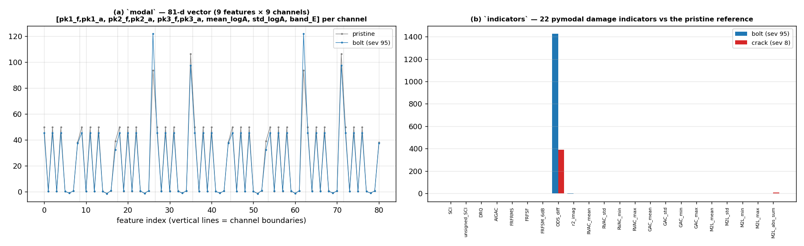
*Figure i — (a) the 81-d `modal` vector for a pristine vs a high-severity bolt case (vertical lines mark the 9 per-channel blocks); (b) the 22 named `indicators` for a bolt vs a crack case, each computed against the pristine reference.*

**`modal` — 81-d physics summary vector.** *(81,), tabular.* For each of the 9 accelerometer channels: the frequency and log-amplitude of the top-3 |H(f)| peaks (6), the mean and std of the log-magnitude spectrum (2), and the total band energy Σ|H|² (1) → 9×9 = 81. It throws away all phase and most of the spectral shape, keeping only resonance locations/heights. Cheapest representation; the 128-baseline's best transferer, but here it is out-classed once richer features are available.

**`indicators` — 22 pymodal damage indicators.** *(22,), tabular.* Classical SHM scalars computed from the *current* FRF against the pristine-mean reference: SCI & unsigned-SCI (CFDAC shape-change), DRQ (from RVAC), AIGAC (from GAC), FRFRMS/FRFSF/FRFSM-6dB, ODS-difference, r²-imag, and mean/std/min/max summaries of the RVAC, GAC and M2L curves (+ M2L abs-sum). Each is a hand-designed damage-sensitivity metric; together they are a 22-d 'expert opinion' vector. Explicitly reference-relative, so in principle robust to some additive bias — but it still encodes the simulator's notion of 'normal'.

### 4.2 Sequences over frequency / time — `frf_mag`, `frf_realimag`, `timeseries`
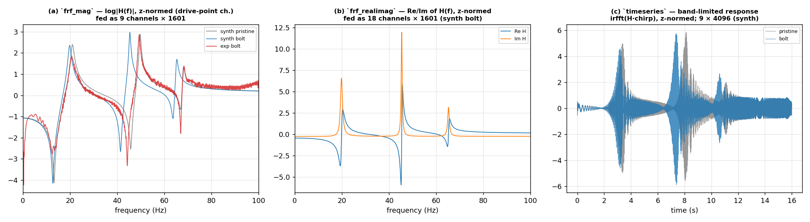
*Figure ii — (a) z-normed log|H(f)|; (b) z-normed Re/Im of H(f); (c) the FRF-reconstructed time response. Shown for the drive-point channel; the models see all 9 (or 18) channels stacked.*

**`frf_mag` — log-magnitude spectrum.** *(9, 1601), sequence.* log₁₀|H(f)| for all 9 channels over the 0–100 Hz / 1601-bin grid, per-sample per-channel z-normalised (so absolute scale and channel gain are removed — the model sees spectral *shape* only). The most direct spectral input; pairs naturally with 1-D CNN/transformer over frequency.

**`frf_realimag` — complex spectrum (Re/Im).** *(18, 1601), sequence.* Real and imaginary parts of H(f) stacked into 18 channels, per-sample z-normalised. Unlike `frf_mag` it keeps **phase**, i.e. the full complex response — which is exactly the information CFDAC is built from. It is the single best transferer for is_bolt/is_hole in this study.

**`timeseries` — reconstructed impulse/chirp response.** *(9, 4096), sequence.* The band-limited time response, irfft(H(f)·chirp-spectrum), 4096 samples at fs=256, per-sample z-normalised. It is FRF-derived (the IQS rig has no stored raw timeseries), reconstructed identically for both domains, so it carries no information beyond the FRF — it is a different *inductive bias* (a temporal view) for the conv/transformer models, not a new sensor.

### 4.3 CFDAC images — `cfdac_{real,imag,mag,phase,realimag,magphase,all}`
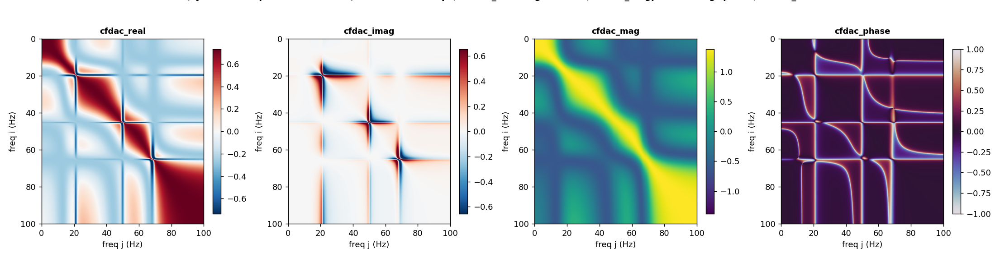
*Figure iii — the four base CFDAC channels for one bolt case. The 7 feature variants are channel subsets/stacks of these.*

**`cfdac_*` — Complex FRF Assurance Criterion images (1601×1601).** *(C, 1601, 1601), image.* The CFDAC cross-assures the current FRF against the pristine reference at every pair of frequencies: C[i,j] = (Hᵢ·conj(refⱼ))² / (‖Hᵢ‖²‖refⱼ‖²). A pristine structure gives a near-diagonal map; damage spreads energy off-diagonal (Figure i). Each variant feeds a different channel set — `real`, `imag`, `mag`, `phase` (1 channel each), `realimag`/`magphase` (2), or `all` (4) — normalised per the engine (real/imag/mag mean-centred, phase ÷π). This is the representation the bespoke 2-D CNNs, the 3-D CNN, the CFDAC-Transformer and the pretrained vision backbones consume.

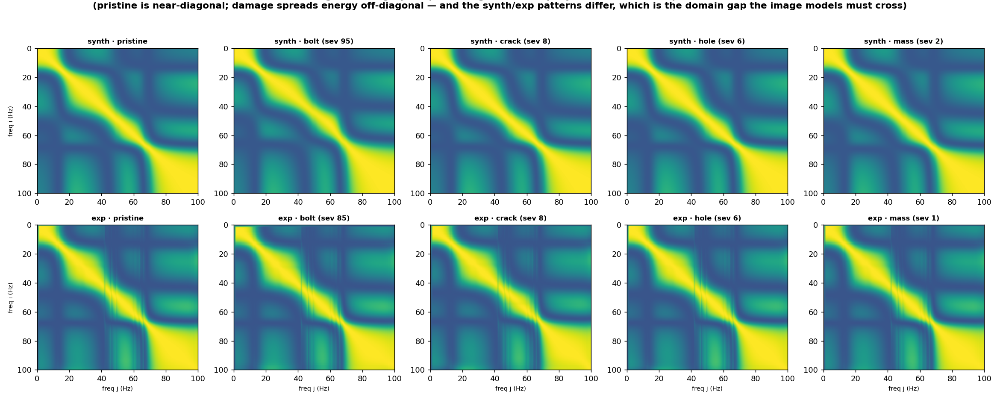
*Figure iv — CFDAC-magnitude fingerprint of each damage class, synthetic (top) vs experimental (bottom). Pristine is near-diagonal; each damage type spreads energy off-diagonal in a characteristic way — and the synthetic and experimental patterns visibly differ, which is the domain gap the image models must cross.*

## 5 · Model architectures — every model, in full
Eleven model families span four design philosophies: **tabular** nets/ensembles on the summary vectors, **1-D sequence** models over frequency/time, **bespoke 2-/3-D nets** built for the full-resolution CFDAC image, and **ImageNet-pretrained vision backbones** fine-tuned on the CFDAC image. Parameter counts below are *measured* from the instantiated `nn.Module`s (representative binary-head config).

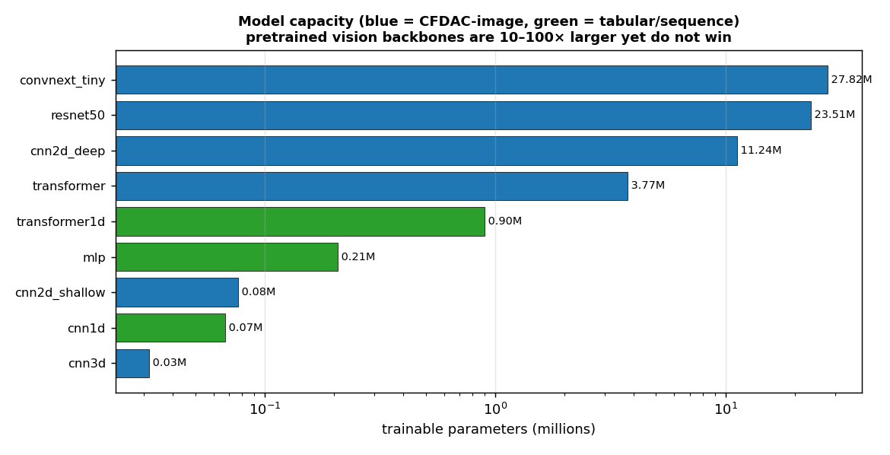
*Figure v — trainable parameters (log scale). The pretrained vision backbones are 10–100× larger than the bespoke nets, yet do not lead on transfer (§8) — capacity is not the bottleneck.*

| model | family | params | notes |
|---|---|---|---|
| `mlp` | tabular / flattened (MLP) | 0.21 M | d_in=81 (modal), hidden=(512,256,128) |
| `rf` | tabular (ensemble) | — | n_estimators=400, class_weight='balanced' |
| `xgb` | tabular (gradient boosting) | — | n_estimators=600, max_depth=6, lr=0.05 |
| `cnn1d` | sequence over frequency (1-D CNN) | 67 k | c_in=9, widths=(32,64,128) |
| `transformer1d` | sequence over frequency (1-D ViT) | 0.90 M | c_in=9, dim=128, depth=4, heads=4, length=1601 |
| `cnn2d_shallow` | CFDAC image (bespoke CNN) | 77 k | n_in=2, widths=(16,32,64) |
| `cnn2d_deep` | CFDAC image (bespoke CNN) | 11.24 M | n_in=2, widths=(64,128,256,512) |
| `cnn3d` | CFDAC volume (bespoke 3-D CNN) | 32 k | n_in=2, widths=(16,32,64) |
| `transformer` | CFDAC image (bespoke ViT) | 3.77 M | n_in=2, dim=192, depth=6, heads=6, input_size=1601 |
| `resnet50` | CFDAC image (ImageNet-pretrained backbone) | 23.51 M | in_chans=2, num_classes=2, pretrained=ImageNet-1k |
| `convnext_tiny` | CFDAC image (ImageNet-pretrained backbone) | 27.82 M | in_chans=2, num_classes=2, pretrained=ImageNet-1k |

**Per-model detail.**

- **`mlp`** (~0.21 M params) — Fully-connected: 3 hidden layers 512→256→128, each Linear→BatchNorm1d→GELU→Dropout(0.3), then a linear head. Shown for modal (d_in=81); d_in = feature length (22 for indicators, C×L for a flattened sequence, e.g. 9×1601=14 409 for frf_mag).
- **`rf`** — RandomForest, 400 trees, class_weight='balanced' (cls) / plain (reg), all CPU cores. Non-parametric — 'size' is the forest, not a weight count. On modal(81)/indicators(22) only.
- **`xgb`** — XGBoost, 600 trees, max_depth=6, lr=0.05, subsample=0.8, colsample_bytree=0.8; multi:softprob / binary:logistic. On modal(81)/indicators(22) only.
- **`cnn1d`** (~67 k params) — 1-D CNN over the frequency/time axis: 7-wide stride-2 stem then 3×(5-wide stride-2 conv→BN→GELU), widths 32→64→128 (each /2); global-avg-pool1d → 64-d FC → logits. Shown for a 9-channel input (frf_mag / timeseries); 18 channels for frf_realimag.
- **`transformer1d`** (~0.90 M params) — Conv tokeniser (15-wide /8 then 5-wide /4, total /32) → tokens of dim 128; CLS + learned pos-embed; 4-layer pre-norm TransformerEncoder (4 heads, MLP ratio 4, GELU, dropout 0.1); LayerNorm → linear head on CLS. Shown for 9 channels × length 1601.
- **`cnn2d_shallow`** (~77 k params) — Port of the 128² baseline: 7×7 stride-4 stem then 3×(5×5 conv→BN→GELU→2× maxpool), widths 16→32→64; global-avg-pool → 64-d FC → logits. Deliberately shallow/cheap.
- **`cnn2d_deep`** (~11.24 M params) — ResNet18-style: 7×7 stride-2 stem + 3×3 maxpool, then 4 stages of 2 residual BasicBlocks (two 3×3 convs + GELU + 1×1 projection shortcut), widths 64→128→256→512, each stage /2; global-avg-pool → 128-d FC (dropout 0.3) → logits. ~7 spatial downsamples digest the full 1601² grid.
- **`cnn3d`** (~32 k params) — Treats the CFDAC channel axis as a depth dimension: input (B,C,N,N)→(B,1,C,N,N). 3-D conv stem (kernel (min(3,C),7,7), spatial stride 4) then 3×(1,3,3) stride-(1,2,2) 3-D convs, widths 16→32→64; global-avg-pool3d → 64-d FC → logits.
- **`transformer`** (~3.77 M params) — Conv tokeniser (5 strided convs, total /64: 1601→~25) → ~625 tokens of dim 192; prepend a CLS token + learned positional embedding; 6-layer pre-norm TransformerEncoder (6 heads, MLP ratio 4, GELU, dropout 0.1); LayerNorm → linear head on the CLS token. Tokenises the full-res CFDAC rather than resizing to 224.
- **`resnet50`** (~23.51 M params) — ResNet50: classic 4-stage bottleneck CNN (25.6 M params), fed CFDAC images resized to 384². ImageNet weights loaded, the input stem adapted to the requested channel count (in_chans=2 here) and the classifier head replaced for the task. Warm-up: head-only for 2 epochs (LR 3e-4), then the whole backbone is unfrozen at LR 3e-5.
- **`convnext_tiny`** (~27.82 M params) — ConvNeXt-Tiny: modern CNN (depthwise 7×7 + inverted bottleneck, 28 M params), fed CFDAC images at native conv resolution. ImageNet weights loaded, the input stem adapted to the requested channel count (in_chans=2 here) and the classifier head replaced for the task. Warm-up: head-only for 2 epochs (LR 3e-4), then the whole backbone is unfrozen at LR 3e-5.

## 6 · Exploratory data analysis — synthetic vs experimental
Before any model, the two datasets are compared directly. This frames everything that follows: *what the models are up against is not noise, it is a structured domain gap.*

### 4.1 Class balance and severity coverage
| class | synth N | exp N |
|---|---|---|
| pristine | 2000 | 462 |
| bolt | 2000 | 1338 |
| crack | 2000 | 320 |
| hole | 2000 | 280 |
| mass | 2000 | 238 |

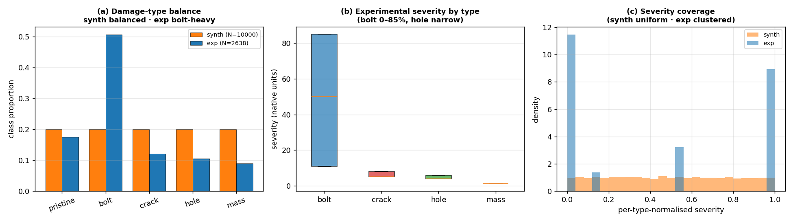
*Figure 2 — (a) the synthetic set is perfectly balanced (2 000/class) while the experimental set is **bolt-dominated** (51% bolt, 18% pristine); training therefore class-weights the loss. (b) Experimental severity by type: bolt-loosening spans a wide 0–85% range, whereas hole and mass occupy narrow bands — this is exactly why the bolt detector has room to improve with severity and the others do not. (c) Per-type-normalised severity: synthetic damage is sampled near-uniformly, but the real damage clusters, so the model is asked to extrapolate over severity ranges it rarely saw.*

### 4.2 Spectral signatures and the domain gap
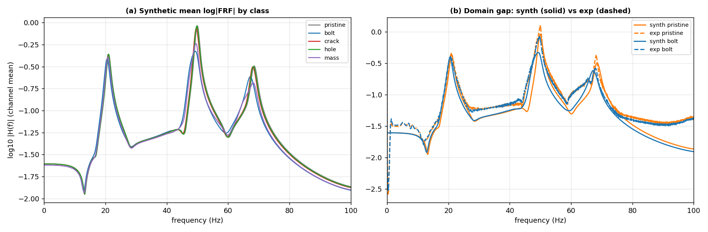
*Figure 3 — channel-averaged mean log|FRF|. (a) Synthetic classes differ mainly in resonance-peak amplitude/position — the information the models exploit in-domain. (b) Overlaying synthetic (solid) on experimental (dashed) for the same class shows the gap: the real structure has shifted resonances, extra anti-resonances, and a higher noise floor the linear ROM never produces.*

### 4.3 Covariate shift, quantified
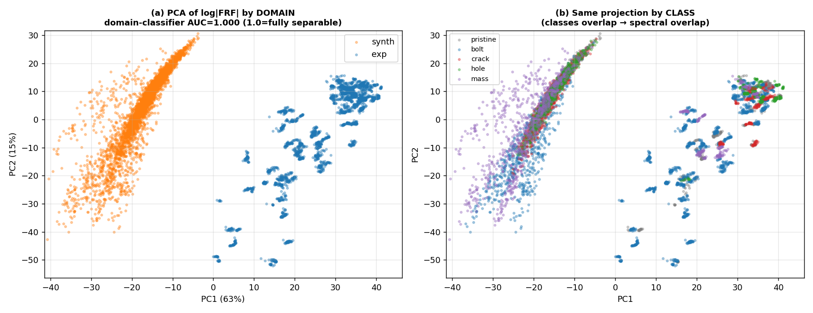
*Figure 4 — PCA of the log|FRF| spectra. (a) Coloured by **domain**, synthetic and experimental form two disjoint clouds (PC1 = 63% of variance); a 5-fold logistic classifier tells them apart with **AUC = 1.000** — i.e. essentially perfectly. (b) The same projection coloured by **damage class** shows the classes overlapping heavily, so the dominant axis of variation in the data is *which domain*, not *which damage*.*

**This is the single most important diagnostic in the report.** A domain-classifier AUC of 1.00 means the sim-to-real gap is not a subtle nuisance — the simulator and the rig are trivially distinguishable from their spectra alone. Any zero-shot transfer at all (and we get meaningful transfer on detection) is therefore a non-trivial success, and the residual errors in §5–6 are the direct, expected consequence of this shift. It also sets the research direction: the lever is **domain adaptation**, not bigger models or higher resolution.

## 7 · Diagnostics — how the best models actually behave on real data
Aggregate scores hide the failure *mode*. Below are the confusion matrices and ROC curves for the single best cell of each task (selected by experimental balanced-acc / R²; see §6 for all cells).

### 5.1 Confusion matrices (experimental, row-normalised)
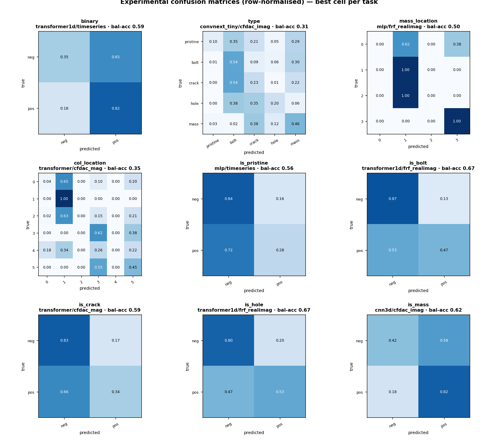
*Figure 5 — read each row as 'of the true X, what fraction was predicted as …'.*

- **binary** (transformer1d/timeseries): catches 82% of positives but flags 64% of negatives as positive — a sensitivity-biased operating point, the expected response when the loss is class-weighted and the prior shifts.
- **is_bolt** (transformer1d/frf_realimag): catches 47% of positives but flags 13% of negatives as positive — a sensitivity-biased operating point, the expected response when the loss is class-weighted and the prior shifts.
- **is_mass** (cnn3d/cfdac_imag): catches 82% of positives but flags 58% of negatives as positive — a sensitivity-biased operating point, the expected response when the loss is class-weighted and the prior shifts.
- **is_hole** (transformer1d/frf_realimag): catches 53% of positives but flags 20% of negatives as positive — a sensitivity-biased operating point, the expected response when the loss is class-weighted and the prior shifts.
- **type** (convnext_tiny/cfdac_imag): the 5-class matrix smears toward the **bolt** column (the majority real class) and the **mass** diagonal survives best — damage *type* is the hardest thing to transfer, because the spectral fingerprint of crack vs hole vs bolt is what the domain shift most corrupts.
- **mass_location / col_location**: rows pile onto one or two columns — localization collapses toward a dominant class, consistent with the near-degenerate spatial classes of the linear ROM (§10) and the weak in-domain ceiling for col_location.

### 5.2 ROC / AUC for the detection tasks
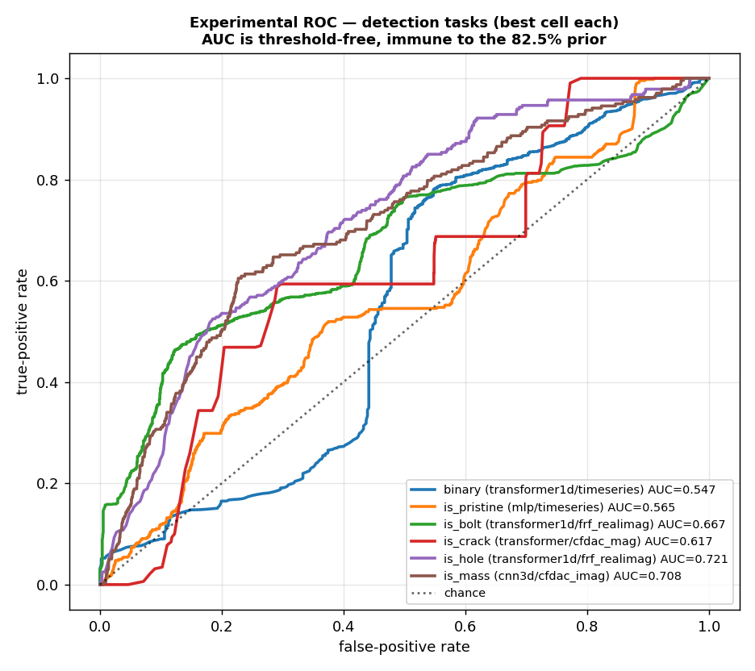
*Figure 6 — AUC is threshold-free and immune to the 82.5% prior, so it is the fairest single number for detection.*

| task | best cell | exp AUC | exp bal-acc | exp macro-F1 | in-domain mF1 |
|---|---|---|---|---|---|
| binary | `transformer1d/timeseries` | **0.547** | 0.589 | 0.582 | 0.86 |
| is_pristine | `mlp/timeseries` | **0.565** | 0.557 | 0.556 | 0.93 |
| is_bolt | `transformer1d/frf_realimag` | **0.667** | 0.669 | 0.654 | 0.89 |
| is_crack | `transformer/cfdac_mag` | **0.617** | 0.587 | 0.566 | 0.54 |
| is_hole | `transformer1d/frf_realimag` | **0.721** | 0.667 | 0.599 | 0.57 |
| is_mass | `cnn3d/cfdac_imag` | **0.708** | 0.620 | 0.399 | 0.58 |

**Reading the AUCs.** `is_hole` and `is_mass` reach AUC ≈ 0.71–0.72 — the strongest threshold-free detectors — yet their *balanced accuracy* at the default cut is lower, because the operating threshold is mis-set by the shift. That gap is good news: it means a handful of labelled real samples to recalibrate the threshold would lift the realised accuracy without any retraining. `binary` and `is_pristine` have the weakest AUCs (≈0.55–0.57): deciding *damaged vs not* in the aggregate is harder than detecting specific damage signatures, because the pristine class is where the domain gap bites hardest (Figure 3a).

## 8 · Per-task catalogue (every cell)
Every (model, feature) cell, sorted best-first. `in-domain` = held-out synthetic score (the ceiling); `exp` columns = zero-shot on real data. The cell-zoo bar plot colours **blue = CFDAC-image** cells and **green = tabular/sequence** cells, so the winning representation family is visible at a glance.

### binary
**Question.** Any damage vs pristine  **Output.** ŷ∈{0=pristine,1=damaged}  **Chance.** 0.50.  82.5% damaged prior; raw accuracy misleading.
**Cells:** 58.

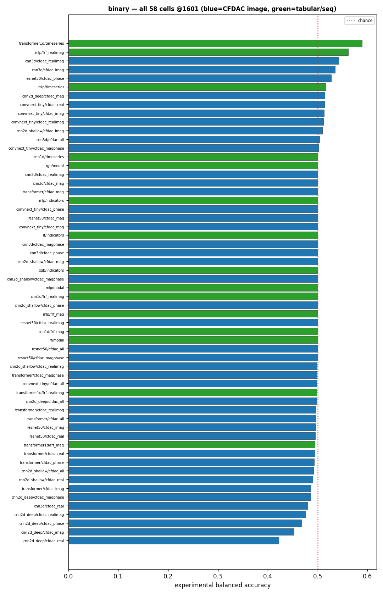

| model / feature | in-domain mF1 | exp bal-acc | exp macro-F1 | collapse |
|---|---|---|---|---|
| `transformer1d/timeseries` | 0.86 | 0.589 | 0.582 |  |
| `mlp/frf_realimag` | 0.94 | 0.562 | 0.562 |  |
| `cnn3d/cfdac_realimag` | 0.57 | 0.542 | 0.542 |  |
| `cnn3d/cfdac_imag` | 0.57 | 0.535 | 0.522 |  |
| `resnet50/cfdac_phase` | 0.95 | 0.527 | 0.525 |  |
| `mlp/timeseries` | 0.95 | 0.516 | 0.490 | yes |
| `cnn2d_deep/cfdac_mag` | 0.69 | 0.514 | 0.491 | yes |
| `convnext_tiny/cfdac_real` | 0.94 | 0.513 | 0.507 | yes |
| `convnext_tiny/cfdac_imag` | 0.96 | 0.513 | 0.480 | yes |
| `convnext_tiny/cfdac_realimag` | 0.95 | 0.511 | 0.491 | yes |
| `cnn2d_shallow/cfdac_imag` | 0.60 | 0.509 | 0.481 | yes |
| `cnn3d/cfdac_all` | 0.55 | 0.505 | 0.490 | yes |
| `convnext_tiny/cfdac_magphase` | 0.94 | 0.502 | 0.463 | yes |
| `resnet50/cfdac_magphase` | 0.92 | 0.500 | 0.452 | yes |
| `resnet50/cfdac_all` | 0.93 | 0.500 | 0.452 | yes |
| `rf/modal` | 0.87 | 0.500 | 0.452 | yes |
| `cnn1d/frf_mag` | 0.74 | 0.500 | 0.452 | yes |
| `resnet50/cfdac_realimag` | 0.90 | 0.500 | 0.452 | yes |
| `mlp/frf_mag` | 0.96 | 0.500 | 0.452 | yes |
| `cnn2d_shallow/cfdac_phase` | 0.65 | 0.500 | 0.452 | yes |
| `cnn1d/frf_realimag` | 0.72 | 0.500 | 0.452 | yes |
| `mlp/modal` | 0.94 | 0.500 | 0.452 | yes |
| `cnn2d_shallow/cfdac_magphase` | 0.76 | 0.500 | 0.452 | yes |
| `xgb/indicators` | 0.81 | 0.500 | 0.452 | yes |
| `cnn2d_shallow/cfdac_mag` | 0.44 | 0.500 | 0.452 | yes |
| `cnn3d/cfdac_phase` | 0.77 | 0.500 | 0.452 | yes |
| `cnn3d/cfdac_magphase` | 0.61 | 0.500 | 0.452 | yes |
| `rf/indicators` | 0.79 | 0.500 | 0.452 | yes |
| `convnext_tiny/cfdac_mag` | 0.44 | 0.500 | 0.452 | yes |
| `resnet50/cfdac_mag` | 0.79 | 0.500 | 0.452 | yes |
| `convnext_tiny/cfdac_phase` | 0.95 | 0.500 | 0.452 | yes |
| `mlp/indicators` | 0.83 | 0.500 | 0.452 | yes |
| `transformer/cfdac_mag` | 0.76 | 0.500 | 0.452 | yes |
| `cnn3d/cfdac_mag` | 0.51 | 0.500 | 0.452 | yes |
| `cnn2d/cfdac_realimag` | 0.45 | 0.500 | 0.452 | yes |
| `xgb/modal` | 0.91 | 0.500 | 0.452 | yes |
| `cnn1d/timeseries` | 0.77 | 0.500 | 0.452 | yes |
| `cnn2d_shallow/cfdac_realimag` | 0.59 | 0.499 | 0.452 | yes |
| `transformer/cfdac_magphase` | 0.93 | 0.498 | 0.460 | yes |
| `convnext_tiny/cfdac_all` | 0.95 | 0.498 | 0.453 | yes |
| `transformer1d/frf_realimag` | 0.89 | 0.498 | 0.460 | yes |
| `cnn2d_deep/cfdac_all` | 0.89 | 0.498 | 0.451 | yes |
| `transformer/cfdac_realimag` | 0.94 | 0.496 | 0.450 | yes |
| `transformer/cfdac_all` | 0.94 | 0.496 | 0.450 | yes |
| `resnet50/cfdac_imag` | 0.88 | 0.496 | 0.463 | yes |
| `resnet50/cfdac_real` | 0.89 | 0.496 | 0.453 | yes |
| `transformer1d/frf_mag` | 0.60 | 0.495 | 0.449 | yes |
| `transformer/cfdac_real` | 0.94 | 0.495 | 0.451 | yes |
| `transformer/cfdac_phase` | 0.89 | 0.493 | 0.448 | yes |
| `cnn2d_shallow/cfdac_all` | 0.60 | 0.492 | 0.297 | yes |
| `cnn2d_shallow/cfdac_real` | 0.55 | 0.490 | 0.490 | yes |
| `transformer/cfdac_imag` | 0.91 | 0.486 | 0.445 | yes |
| `cnn2d_deep/cfdac_magphase` | 0.78 | 0.486 | 0.475 | yes |
| `cnn3d/cfdac_real` | 0.56 | 0.480 | 0.479 | yes |
| `cnn2d_deep/cfdac_realimag` | 0.84 | 0.476 | 0.448 | yes |
| `cnn2d_deep/cfdac_phase` | 0.80 | 0.468 | 0.438 | yes |
| `cnn2d_deep/cfdac_imag` | 0.77 | 0.452 | 0.439 | yes |
| `cnn2d_deep/cfdac_real` | 0.73 | 0.422 | 0.427 | yes |

**Best:** `transformer1d/timeseries` — exp balanced-acc **0.589** (macro-F1 0.582; in-domain 0.86). 2/58 cells clear chance+0.05; 53 collapse to one class. On real data it recovers **82% of true positives** (sensitivity) at **36% specificity**; threshold-free **AUC = 0.547**.

### is_pristine
**Question.** Pristine vs any damage (inverse of binary)  **Output.** ŷ∈{0=damaged,1=pristine}  **Chance.** 0.50.
**Cells:** 57.

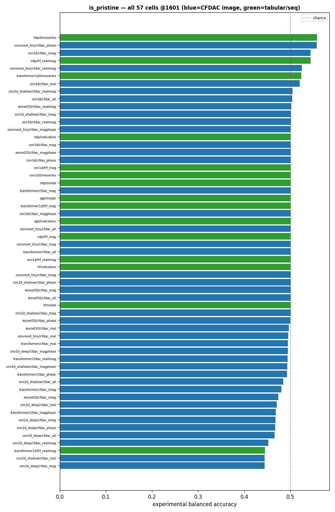

| model / feature | in-domain mF1 | exp bal-acc | exp macro-F1 | collapse |
|---|---|---|---|---|
| `mlp/timeseries` | 0.93 | 0.557 | 0.556 |  |
| `convnext_tiny/cfdac_phase` | 0.92 | 0.556 | 0.561 |  |
| `cnn3d/cfdac_imag` | 0.63 | 0.543 | 0.538 |  |
| `mlp/frf_realimag` | 0.95 | 0.543 | 0.546 |  |
| `convnext_tiny/cfdac_realimag` | 0.96 | 0.524 | 0.502 |  |
| `transformer1d/timeseries` | 0.88 | 0.523 | 0.519 |  |
| `cnn3d/cfdac_real` | 0.61 | 0.519 | 0.515 | yes |
| `cnn2d_shallow/cfdac_realimag` | 0.60 | 0.504 | 0.464 | yes |
| `cnn3d/cfdac_all` | 0.58 | 0.503 | 0.487 | yes |
| `resnet50/cfdac_realimag` | 0.79 | 0.501 | 0.454 | yes |
| `cnn2d_shallow/cfdac_imag` | 0.62 | 0.500 | 0.457 | yes |
| `cnn3d/cfdac_realimag` | 0.60 | 0.500 | 0.500 | yes |
| `rf/modal` | 0.90 | 0.500 | 0.452 | yes |
| `resnet50/cfdac_all` | 0.95 | 0.500 | 0.452 | yes |
| `resnet50/cfdac_mag` | 0.81 | 0.500 | 0.452 | yes |
| `cnn2d_shallow/cfdac_phase` | 0.72 | 0.500 | 0.452 | yes |
| `convnext_tiny/cfdac_imag` | 0.96 | 0.500 | 0.452 | yes |
| `rf/indicators` | 0.82 | 0.500 | 0.452 | yes |
| `cnn1d/frf_realimag` | 0.77 | 0.500 | 0.452 | yes |
| `transformer/cfdac_all` | 0.95 | 0.500 | 0.452 | yes |
| `convnext_tiny/cfdac_mag` | 0.44 | 0.500 | 0.452 | yes |
| `mlp/frf_mag` | 0.95 | 0.500 | 0.452 | yes |
| `convnext_tiny/cfdac_all` | 0.44 | 0.500 | 0.452 | yes |
| `xgb/indicators` | 0.80 | 0.500 | 0.452 | yes |
| `cnn3d/cfdac_magphase` | 0.81 | 0.500 | 0.452 | yes |
| `transformer1d/frf_mag` | 0.66 | 0.500 | 0.452 | yes |
| `xgb/modal` | 0.93 | 0.500 | 0.452 | yes |
| `transformer/cfdac_mag` | 0.63 | 0.500 | 0.452 | yes |
| `mlp/modal` | 0.92 | 0.500 | 0.452 | yes |
| `cnn1d/timeseries` | 0.80 | 0.500 | 0.452 | yes |
| `cnn1d/frf_mag` | 0.70 | 0.500 | 0.452 | yes |
| `cnn3d/cfdac_phase` | 0.79 | 0.500 | 0.452 | yes |
| `resnet50/cfdac_magphase` | 0.90 | 0.500 | 0.452 | yes |
| `cnn3d/cfdac_mag` | 0.61 | 0.500 | 0.452 | yes |
| `mlp/indicators` | 0.85 | 0.500 | 0.452 | yes |
| `convnext_tiny/cfdac_magphase` | 0.96 | 0.500 | 0.452 | yes |
| `cnn2d_shallow/cfdac_mag` | 0.59 | 0.500 | 0.452 | yes |
| `resnet50/cfdac_phase` | 0.95 | 0.499 | 0.452 | yes |
| `resnet50/cfdac_real` | 0.90 | 0.496 | 0.450 | yes |
| `convnext_tiny/cfdac_real` | 0.95 | 0.495 | 0.452 | yes |
| `transformer/cfdac_real` | 0.92 | 0.494 | 0.481 | yes |
| `cnn2d_deep/cfdac_magphase` | 0.83 | 0.494 | 0.475 | yes |
| `transformer/cfdac_realimag` | 0.93 | 0.493 | 0.450 | yes |
| `cnn2d_shallow/cfdac_magphase` | 0.84 | 0.492 | 0.490 | yes |
| `transformer/cfdac_phase` | 0.92 | 0.491 | 0.462 | yes |
| `cnn2d_shallow/cfdac_all` | 0.76 | 0.483 | 0.390 | yes |
| `transformer/cfdac_imag` | 0.89 | 0.479 | 0.476 | yes |
| `resnet50/cfdac_imag` | 0.91 | 0.473 | 0.465 | yes |
| `cnn2d_deep/cfdac_real` | 0.83 | 0.470 | 0.468 | yes |
| `transformer/cfdac_magphase` | 0.91 | 0.468 | 0.438 | yes |
| `cnn2d_deep/cfdac_imag` | 0.83 | 0.467 | 0.445 | yes |
| `cnn2d_deep/cfdac_phase` | 0.89 | 0.467 | 0.441 | yes |
| `cnn2d_deep/cfdac_all` | 0.86 | 0.465 | 0.441 | yes |
| `cnn2d_deep/cfdac_realimag` | 0.81 | 0.451 | 0.435 | yes |
| `transformer1d/frf_realimag` | 0.76 | 0.444 | 0.436 | yes |
| `cnn2d_deep/cfdac_mag` | 0.76 | 0.443 | 0.438 | yes |
| `cnn2d_shallow/cfdac_real` | 0.52 | 0.443 | 0.438 | yes |

**Best:** `mlp/timeseries` — exp balanced-acc **0.557** (macro-F1 0.556; in-domain 0.93). 2/57 cells clear chance+0.05; 51 collapse to one class. On real data it recovers **28% of true positives** (sensitivity) at **84% specificity**; threshold-free **AUC = 0.565**.

### is_bolt
**Question.** Bolt-loosening present? (one-vs-rest)  **Output.** ŷ∈{0,1}  **Chance.** 0.50.  Severity = % loosening, 0–85% — wide range.
**Cells:** 57.

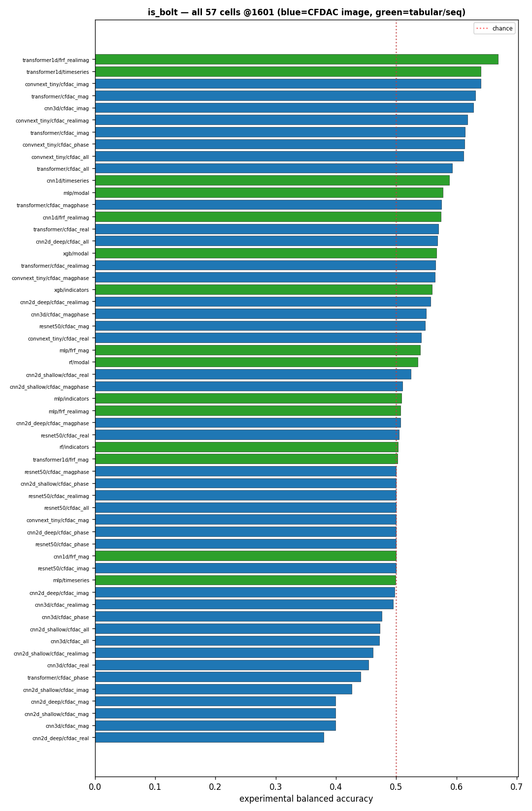

| model / feature | in-domain mF1 | exp bal-acc | exp macro-F1 | collapse |
|---|---|---|---|---|
| `transformer1d/frf_realimag` | 0.89 | 0.669 | 0.654 |  |
| `transformer1d/timeseries` | 0.92 | 0.641 | 0.636 |  |
| `convnext_tiny/cfdac_imag` | 0.93 | 0.640 | 0.633 |  |
| `transformer/cfdac_mag` | 0.93 | 0.631 | 0.626 |  |
| `cnn3d/cfdac_imag` | 0.77 | 0.629 | 0.628 |  |
| `convnext_tiny/cfdac_realimag` | 0.93 | 0.619 | 0.592 |  |
| `transformer/cfdac_imag` | 0.93 | 0.614 | 0.558 |  |
| `convnext_tiny/cfdac_phase` | 0.92 | 0.614 | 0.609 |  |
| `convnext_tiny/cfdac_all` | 0.91 | 0.612 | 0.612 |  |
| `transformer/cfdac_all` | 0.94 | 0.593 | 0.538 |  |
| `cnn1d/timeseries` | 0.93 | 0.588 | 0.508 |  |
| `mlp/modal` | 0.91 | 0.578 | 0.492 |  |
| `transformer/cfdac_magphase` | 0.93 | 0.575 | 0.571 |  |
| `cnn1d/frf_realimag` | 0.93 | 0.574 | 0.485 |  |
| `transformer/cfdac_real` | 0.90 | 0.570 | 0.516 |  |
| `cnn2d_deep/cfdac_all` | 0.93 | 0.569 | 0.507 |  |
| `xgb/modal` | 0.93 | 0.567 | 0.499 |  |
| `transformer/cfdac_realimag` | 0.93 | 0.565 | 0.504 |  |
| `convnext_tiny/cfdac_magphase` | 0.92 | 0.565 | 0.559 |  |
| `xgb/indicators` | 0.92 | 0.559 | 0.549 |  |
| `cnn2d_deep/cfdac_realimag` | 0.80 | 0.557 | 0.466 |  |
| `cnn3d/cfdac_magphase` | 0.88 | 0.550 | 0.550 |  |
| `resnet50/cfdac_mag` | 0.92 | 0.548 | 0.543 |  |
| `convnext_tiny/cfdac_real` | 0.92 | 0.541 | 0.541 |  |
| `mlp/frf_mag` | 0.90 | 0.540 | 0.521 |  |
| `rf/modal` | 0.93 | 0.536 | 0.411 |  |
| `cnn2d_shallow/cfdac_real` | 0.80 | 0.524 | 0.416 |  |
| `cnn2d_shallow/cfdac_magphase` | 0.93 | 0.510 | 0.373 | yes |
| `mlp/indicators` | 0.89 | 0.509 | 0.393 | yes |
| `mlp/frf_realimag` | 0.90 | 0.507 | 0.372 | yes |
| `cnn2d_deep/cfdac_magphase` | 0.94 | 0.507 | 0.451 | yes |
| `resnet50/cfdac_real` | 0.91 | 0.505 | 0.350 | yes |
| `rf/indicators` | 0.92 | 0.503 | 0.470 | yes |
| `transformer1d/frf_mag` | 0.91 | 0.502 | 0.342 | yes |
| `resnet50/cfdac_imag` | 0.93 | 0.500 | 0.337 | yes |
| `cnn1d/frf_mag` | 0.92 | 0.500 | 0.330 | yes |
| `resnet50/cfdac_phase` | 0.93 | 0.500 | 0.337 | yes |
| `cnn2d_deep/cfdac_phase` | 0.93 | 0.500 | 0.330 | yes |
| `convnext_tiny/cfdac_mag` | 0.44 | 0.500 | 0.330 | yes |
| `resnet50/cfdac_all` | 0.92 | 0.500 | 0.337 | yes |
| `resnet50/cfdac_realimag` | 0.93 | 0.500 | 0.337 | yes |
| `cnn2d_shallow/cfdac_phase` | 0.81 | 0.500 | 0.330 | yes |
| `resnet50/cfdac_magphase` | 0.94 | 0.500 | 0.337 | yes |
| `mlp/timeseries` | 0.90 | 0.499 | 0.391 | yes |
| `cnn2d_deep/cfdac_imag` | 0.80 | 0.497 | 0.335 | yes |
| `cnn3d/cfdac_realimag` | 0.78 | 0.495 | 0.489 | yes |
| `cnn3d/cfdac_phase` | 0.89 | 0.476 | 0.471 | yes |
| `cnn2d_shallow/cfdac_all` | 0.93 | 0.473 | 0.389 | yes |
| `cnn3d/cfdac_all` | 0.77 | 0.472 | 0.472 | yes |
| `cnn2d_shallow/cfdac_realimag` | 0.77 | 0.461 | 0.460 | yes |
| `cnn3d/cfdac_real` | 0.78 | 0.454 | 0.438 | yes |
| `transformer/cfdac_phase` | 0.93 | 0.441 | 0.414 | yes |
| `cnn2d_shallow/cfdac_imag` | 0.80 | 0.427 | 0.357 | yes |
| `cnn2d_shallow/cfdac_mag` | 0.59 | 0.399 | 0.315 | yes |
| `cnn2d_deep/cfdac_mag` | 0.94 | 0.399 | 0.315 | yes |
| `cnn3d/cfdac_mag` | 0.62 | 0.399 | 0.314 | yes |
| `cnn2d_deep/cfdac_real` | 0.84 | 0.379 | 0.322 | yes |

**Best:** `transformer1d/frf_realimag` — exp balanced-acc **0.669** (macro-F1 0.654; in-domain 0.89). 21/57 cells clear chance+0.05; 30 collapse to one class. On real data it recovers **47% of true positives** (sensitivity) at **87% specificity**; threshold-free **AUC = 0.667**.

### is_crack
**Question.** Crack present? (one-vs-rest)  **Output.** ŷ∈{0,1}  **Chance.** 0.50.  Severity = crack depth.
**Cells:** 57.

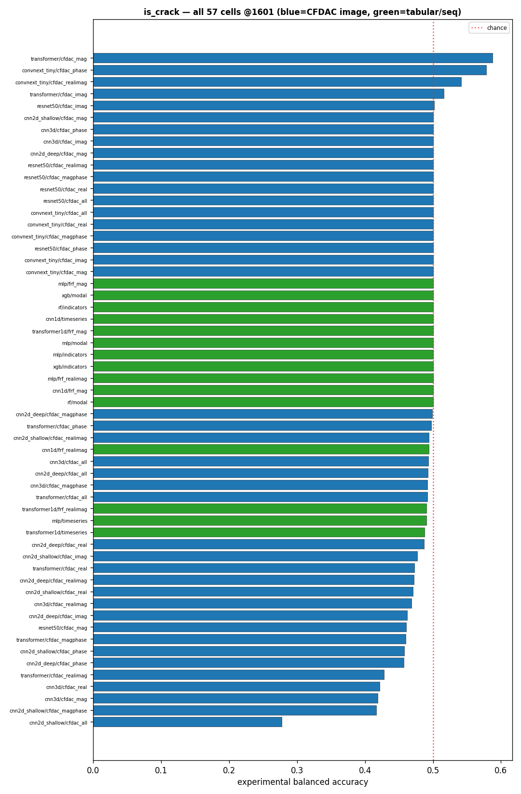

| model / feature | in-domain mF1 | exp bal-acc | exp macro-F1 | collapse |
|---|---|---|---|---|
| `transformer/cfdac_mag` | 0.54 | 0.587 | 0.566 |  |
| `convnext_tiny/cfdac_phase` | 0.77 | 0.579 | 0.577 |  |
| `convnext_tiny/cfdac_realimag` | 0.77 | 0.542 | 0.546 |  |
| `transformer/cfdac_imag` | 0.48 | 0.516 | 0.506 | yes |
| `resnet50/cfdac_imag` | 0.72 | 0.502 | 0.471 | yes |
| `rf/modal` | 0.71 | 0.500 | 0.468 | yes |
| `cnn1d/frf_mag` | 0.58 | 0.500 | 0.468 | yes |
| `convnext_tiny/cfdac_mag` | 0.44 | 0.500 | 0.468 | yes |
| `convnext_tiny/cfdac_imag` | 0.44 | 0.500 | 0.468 | yes |
| `resnet50/cfdac_phase` | 0.76 | 0.500 | 0.468 | yes |
| `mlp/frf_realimag` | 0.78 | 0.500 | 0.468 | yes |
| `xgb/indicators` | 0.73 | 0.500 | 0.468 | yes |
| `mlp/indicators` | 0.76 | 0.500 | 0.468 | yes |
| `cnn2d_deep/cfdac_mag` | 0.53 | 0.500 | 0.468 | yes |
| `mlp/modal` | 0.78 | 0.500 | 0.468 | yes |
| `convnext_tiny/cfdac_magphase` | 0.44 | 0.500 | 0.468 | yes |
| `convnext_tiny/cfdac_real` | 0.44 | 0.500 | 0.468 | yes |
| `transformer1d/frf_mag` | 0.51 | 0.500 | 0.468 | yes |
| `cnn3d/cfdac_imag` | 0.52 | 0.500 | 0.468 | yes |
| `cnn3d/cfdac_phase` | 0.61 | 0.500 | 0.468 | yes |
| `convnext_tiny/cfdac_all` | 0.44 | 0.500 | 0.468 | yes |
| `cnn2d_shallow/cfdac_mag` | 0.48 | 0.500 | 0.468 | yes |
| `cnn1d/timeseries` | 0.57 | 0.500 | 0.468 | yes |
| `resnet50/cfdac_all` | 0.73 | 0.500 | 0.468 | yes |
| `resnet50/cfdac_real` | 0.74 | 0.500 | 0.468 | yes |
| `resnet50/cfdac_magphase` | 0.72 | 0.500 | 0.468 | yes |
| `rf/indicators` | 0.71 | 0.500 | 0.468 | yes |
| `xgb/modal` | 0.72 | 0.500 | 0.468 | yes |
| `resnet50/cfdac_realimag` | 0.76 | 0.500 | 0.468 | yes |
| `mlp/frf_mag` | 0.76 | 0.500 | 0.468 | yes |
| `cnn2d_deep/cfdac_magphase` | 0.70 | 0.499 | 0.467 | yes |
| `transformer/cfdac_phase` | 0.70 | 0.498 | 0.467 | yes |
| `cnn2d_shallow/cfdac_realimag` | 0.52 | 0.494 | 0.465 | yes |
| `cnn1d/frf_realimag` | 0.54 | 0.494 | 0.465 | yes |
| `cnn3d/cfdac_all` | 0.51 | 0.493 | 0.470 | yes |
| `cnn2d_deep/cfdac_all` | 0.64 | 0.493 | 0.464 | yes |
| `cnn3d/cfdac_magphase` | 0.56 | 0.492 | 0.464 | yes |
| `transformer/cfdac_all` | 0.73 | 0.492 | 0.492 | yes |
| `transformer1d/frf_realimag` | 0.76 | 0.490 | 0.467 | yes |
| `mlp/timeseries` | 0.77 | 0.490 | 0.463 | yes |
| `transformer1d/timeseries` | 0.53 | 0.487 | 0.487 | yes |
| `cnn2d_deep/cfdac_real` | 0.50 | 0.487 | 0.487 | yes |
| `cnn2d_shallow/cfdac_imag` | 0.54 | 0.477 | 0.456 | yes |
| `transformer/cfdac_real` | 0.62 | 0.472 | 0.446 | yes |
| `cnn2d_deep/cfdac_realimag` | 0.53 | 0.472 | 0.453 | yes |
| `cnn2d_shallow/cfdac_real` | 0.53 | 0.471 | 0.453 | yes |
| `cnn3d/cfdac_realimag` | 0.55 | 0.468 | 0.464 | yes |
| `cnn2d_deep/cfdac_imag` | 0.55 | 0.462 | 0.448 | yes |
| `resnet50/cfdac_mag` | 0.71 | 0.461 | 0.447 | yes |
| `transformer/cfdac_magphase` | 0.56 | 0.460 | 0.463 | yes |
| `cnn2d_shallow/cfdac_phase` | 0.65 | 0.458 | 0.446 | yes |
| `cnn2d_deep/cfdac_phase` | 0.51 | 0.457 | 0.457 | yes |
| `transformer/cfdac_realimag` | 0.75 | 0.428 | 0.429 | yes |
| `cnn3d/cfdac_real` | 0.55 | 0.422 | 0.427 | yes |
| `cnn3d/cfdac_mag` | 0.44 | 0.419 | 0.424 | yes |
| `cnn2d_shallow/cfdac_magphase` | 0.55 | 0.416 | 0.423 | yes |
| `cnn2d_shallow/cfdac_all` | 0.55 | 0.278 | 0.292 | yes |

**Best:** `transformer/cfdac_mag` — exp balanced-acc **0.587** (macro-F1 0.566; in-domain 0.54). 2/57 cells clear chance+0.05; 54 collapse to one class. On real data it recovers **34% of true positives** (sensitivity) at **83% specificity**; threshold-free **AUC = 0.617**.

### is_hole
**Question.** Hole present? (one-vs-rest)  **Output.** ŷ∈{0,1}  **Chance.** 0.50.  Severity = hole diameter, 1–6 mm (narrow).
**Cells:** 57.

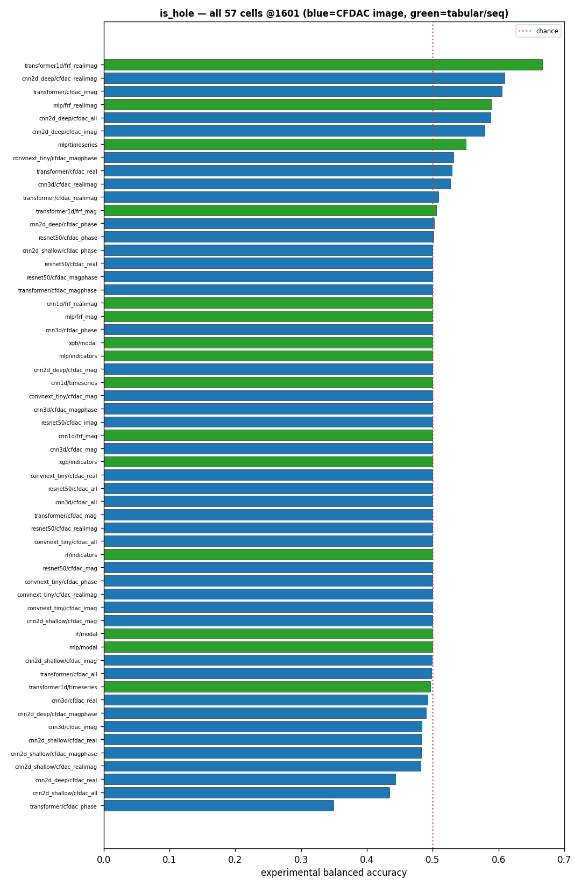

| model / feature | in-domain mF1 | exp bal-acc | exp macro-F1 | collapse |
|---|---|---|---|---|
| `transformer1d/frf_realimag` | 0.57 | 0.667 | 0.599 |  |
| `cnn2d_deep/cfdac_realimag` | 0.59 | 0.609 | 0.512 |  |
| `transformer/cfdac_imag` | 0.57 | 0.605 | 0.588 |  |
| `mlp/frf_realimag` | 0.82 | 0.589 | 0.422 |  |
| `cnn2d_deep/cfdac_all` | 0.58 | 0.588 | 0.540 |  |
| `cnn2d_deep/cfdac_imag` | 0.56 | 0.579 | 0.572 |  |
| `mlp/timeseries` | 0.82 | 0.550 | 0.382 |  |
| `convnext_tiny/cfdac_magphase` | 0.65 | 0.532 | 0.536 |  |
| `transformer/cfdac_real` | 0.59 | 0.529 | 0.528 |  |
| `cnn3d/cfdac_realimag` | 0.55 | 0.527 | 0.530 |  |
| `transformer/cfdac_realimag` | 0.58 | 0.509 | 0.500 | yes |
| `transformer1d/frf_mag` | 0.55 | 0.505 | 0.480 | yes |
| `cnn2d_deep/cfdac_phase` | 0.58 | 0.502 | 0.492 | yes |
| `resnet50/cfdac_phase` | 0.76 | 0.502 | 0.497 | yes |
| `mlp/modal` | 0.83 | 0.500 | 0.472 | yes |
| `rf/modal` | 0.67 | 0.500 | 0.472 | yes |
| `cnn2d_shallow/cfdac_mag` | 0.52 | 0.500 | 0.472 | yes |
| `convnext_tiny/cfdac_imag` | 0.44 | 0.500 | 0.472 | yes |
| `convnext_tiny/cfdac_realimag` | 0.44 | 0.500 | 0.472 | yes |
| `convnext_tiny/cfdac_phase` | 0.44 | 0.500 | 0.472 | yes |
| `resnet50/cfdac_mag` | 0.61 | 0.500 | 0.472 | yes |
| `rf/indicators` | 0.63 | 0.500 | 0.472 | yes |
| `convnext_tiny/cfdac_all` | 0.44 | 0.500 | 0.472 | yes |
| `resnet50/cfdac_realimag` | 0.61 | 0.500 | 0.472 | yes |
| `transformer/cfdac_mag` | 0.44 | 0.500 | 0.472 | yes |
| `cnn3d/cfdac_all` | 0.58 | 0.500 | 0.472 | yes |
| `resnet50/cfdac_all` | 0.71 | 0.500 | 0.472 | yes |
| `convnext_tiny/cfdac_real` | 0.44 | 0.500 | 0.472 | yes |
| `xgb/indicators` | 0.64 | 0.500 | 0.472 | yes |
| `cnn3d/cfdac_mag` | 0.49 | 0.500 | 0.472 | yes |
| `cnn1d/frf_mag` | 0.59 | 0.500 | 0.472 | yes |
| `resnet50/cfdac_imag` | 0.76 | 0.500 | 0.472 | yes |
| `cnn3d/cfdac_magphase` | 0.60 | 0.500 | 0.472 | yes |
| `convnext_tiny/cfdac_mag` | 0.44 | 0.500 | 0.472 | yes |
| `cnn1d/timeseries` | 0.63 | 0.500 | 0.472 | yes |
| `cnn2d_deep/cfdac_mag` | 0.44 | 0.500 | 0.472 | yes |
| `mlp/indicators` | 0.65 | 0.500 | 0.472 | yes |
| `xgb/modal` | 0.72 | 0.500 | 0.472 | yes |
| `cnn3d/cfdac_phase` | 0.59 | 0.500 | 0.472 | yes |
| `mlp/frf_mag` | 0.85 | 0.500 | 0.472 | yes |
| `cnn1d/frf_realimag` | 0.60 | 0.500 | 0.472 | yes |
| `transformer/cfdac_magphase` | 0.62 | 0.500 | 0.472 | yes |
| `resnet50/cfdac_magphase` | 0.71 | 0.500 | 0.472 | yes |
| `resnet50/cfdac_real` | 0.72 | 0.500 | 0.472 | yes |
| `cnn2d_shallow/cfdac_phase` | 0.59 | 0.500 | 0.472 | yes |
| `cnn2d_shallow/cfdac_imag` | 0.58 | 0.499 | 0.472 | yes |
| `transformer/cfdac_all` | 0.64 | 0.498 | 0.471 | yes |
| `transformer1d/timeseries` | 0.54 | 0.497 | 0.470 | yes |
| `cnn3d/cfdac_real` | 0.52 | 0.493 | 0.468 | yes |
| `cnn2d_deep/cfdac_magphase` | 0.57 | 0.490 | 0.482 | yes |
| `cnn3d/cfdac_imag` | 0.52 | 0.483 | 0.463 | yes |
| `cnn2d_shallow/cfdac_magphase` | 0.56 | 0.483 | 0.483 | yes |
| `cnn2d_shallow/cfdac_real` | 0.51 | 0.483 | 0.483 | yes |
| `cnn2d_shallow/cfdac_realimag` | 0.44 | 0.482 | 0.483 | yes |
| `cnn2d_deep/cfdac_real` | 0.57 | 0.443 | 0.442 | yes |
| `cnn2d_shallow/cfdac_all` | 0.61 | 0.435 | 0.430 | yes |
| `transformer/cfdac_phase` | 0.62 | 0.349 | 0.384 | yes |

**Best:** `transformer1d/frf_realimag` — exp balanced-acc **0.667** (macro-F1 0.599; in-domain 0.57). 7/57 cells clear chance+0.05; 47 collapse to one class. On real data it recovers **53% of true positives** (sensitivity) at **80% specificity**; threshold-free **AUC = 0.721**; the AUC sitting above the fixed-threshold balanced-accuracy says the *ranking* is better than the default 0.5 cut — the decision threshold is miscalibrated by the domain shift and could be retuned on a few real samples.

### is_mass
**Question.** Added mass present? (one-vs-rest)  **Output.** ŷ∈{0,1}  **Chance.** 0.50.  Severity near-discrete.
**Cells:** 57.

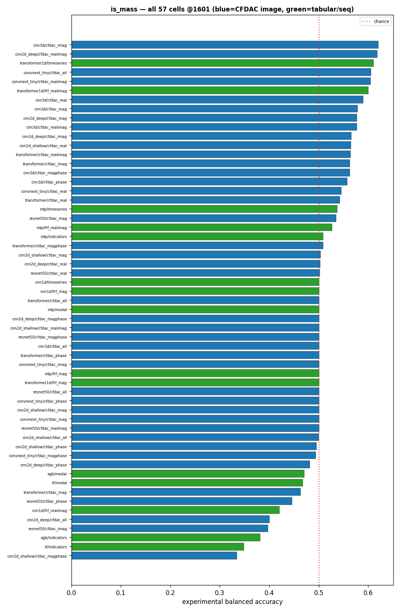

| model / feature | in-domain mF1 | exp bal-acc | exp macro-F1 | collapse |
|---|---|---|---|---|
| `cnn3d/cfdac_imag` | 0.58 | 0.620 | 0.399 |  |
| `cnn2d_deep/cfdac_realimag` | 0.60 | 0.618 | 0.547 |  |
| `transformer1d/timeseries` | 0.73 | 0.610 | 0.535 |  |
| `convnext_tiny/cfdac_all` | 0.97 | 0.605 | 0.507 |  |
| `convnext_tiny/cfdac_realimag` | 0.94 | 0.604 | 0.514 |  |
| `transformer1d/frf_realimag` | 0.95 | 0.600 | 0.389 |  |
| `cnn3d/cfdac_real` | 0.62 | 0.589 | 0.254 |  |
| `cnn3d/cfdac_mag` | 0.56 | 0.578 | 0.231 |  |
| `cnn2d_deep/cfdac_mag` | 0.53 | 0.577 | 0.229 |  |
| `cnn3d/cfdac_realimag` | 0.61 | 0.577 | 0.366 |  |
| `cnn2d_deep/cfdac_imag` | 0.94 | 0.565 | 0.221 |  |
| `cnn2d_shallow/cfdac_real` | 0.59 | 0.565 | 0.323 |  |
| `transformer/cfdac_realimag` | 0.93 | 0.564 | 0.346 |  |
| `transformer/cfdac_imag` | 0.95 | 0.562 | 0.204 |  |
| `cnn3d/cfdac_magphase` | 0.91 | 0.562 | 0.203 |  |
| `cnn3d/cfdac_phase` | 0.92 | 0.557 | 0.319 |  |
| `convnext_tiny/cfdac_real` | 0.95 | 0.545 | 0.381 |  |
| `transformer/cfdac_real` | 0.94 | 0.542 | 0.272 |  |
| `mlp/timeseries` | 0.96 | 0.537 | 0.264 |  |
| `resnet50/cfdac_mag` | 0.89 | 0.535 | 0.201 |  |
| `mlp/frf_realimag` | 0.96 | 0.527 | 0.273 |  |
| `mlp/indicators` | 0.94 | 0.509 | 0.117 | yes |
| `transformer/cfdac_magphase` | 0.96 | 0.508 | 0.108 | yes |
| `cnn2d_shallow/cfdac_mag` | 0.56 | 0.503 | 0.090 | yes |
| `cnn2d_deep/cfdac_real` | 0.93 | 0.503 | 0.484 | yes |
| `resnet50/cfdac_real` | 0.97 | 0.502 | 0.086 | yes |
| `cnn1d/frf_mag` | 0.94 | 0.501 | 0.084 | yes |
| `cnn1d/timeseries` | 0.93 | 0.501 | 0.084 | yes |
| `transformer/cfdac_all` | 0.97 | 0.500 | 0.083 | yes |
| `resnet50/cfdac_realimag` | 0.97 | 0.500 | 0.083 | yes |
| `convnext_tiny/cfdac_mag` | 0.45 | 0.500 | 0.476 | yes |
| `cnn2d_shallow/cfdac_imag` | 0.64 | 0.500 | 0.083 | yes |
| `convnext_tiny/cfdac_phase` | 0.45 | 0.500 | 0.476 | yes |
| `resnet50/cfdac_all` | 0.95 | 0.500 | 0.083 | yes |
| `transformer1d/frf_mag` | 0.75 | 0.500 | 0.083 | yes |
| `mlp/frf_mag` | 0.98 | 0.500 | 0.083 | yes |
| `convnext_tiny/cfdac_imag` | 0.45 | 0.500 | 0.476 | yes |
| `transformer/cfdac_phase` | 0.97 | 0.500 | 0.083 | yes |
| `cnn3d/cfdac_all` | 0.90 | 0.500 | 0.083 | yes |
| `resnet50/cfdac_magphase` | 0.95 | 0.500 | 0.083 | yes |
| `cnn2d_shallow/cfdac_realimag` | 0.76 | 0.500 | 0.083 | yes |
| `cnn2d_deep/cfdac_magphase` | 0.97 | 0.500 | 0.083 | yes |
| `mlp/modal` | 0.99 | 0.500 | 0.083 | yes |
| `cnn2d_shallow/cfdac_all` | 0.92 | 0.500 | 0.476 | yes |
| `cnn2d_shallow/cfdac_phase` | 0.93 | 0.495 | 0.474 | yes |
| `convnext_tiny/cfdac_magphase` | 0.97 | 0.493 | 0.430 | yes |
| `cnn2d_deep/cfdac_phase` | 0.98 | 0.482 | 0.365 | yes |
| `xgb/modal` | 0.97 | 0.470 | 0.471 | yes |
| `rf/modal` | 0.97 | 0.468 | 0.468 | yes |
| `transformer/cfdac_mag` | 0.88 | 0.463 | 0.161 | yes |
| `resnet50/cfdac_phase` | 0.96 | 0.446 | 0.156 | yes |
| `cnn1d/frf_realimag` | 0.96 | 0.420 | 0.428 | yes |
| `cnn2d_deep/cfdac_all` | 0.97 | 0.400 | 0.422 | yes |
| `resnet50/cfdac_imag` | 0.97 | 0.397 | 0.418 | yes |
| `xgb/indicators` | 0.95 | 0.381 | 0.297 | yes |
| `rf/indicators` | 0.94 | 0.348 | 0.300 | yes |
| `cnn2d_shallow/cfdac_magphase` | 0.96 | 0.334 | 0.378 | yes |

**Best:** `cnn3d/cfdac_imag` — exp balanced-acc **0.620** (macro-F1 0.399; in-domain 0.58). 16/57 cells clear chance+0.05; 36 collapse to one class. On real data it recovers **82% of true positives** (sensitivity) at **42% specificity**; threshold-free **AUC = 0.708**; the AUC sitting above the fixed-threshold balanced-accuracy says the *ranking* is better than the default 0.5 cut — the decision threshold is miscalibrated by the domain shift and could be retuned on a few real samples.

### type
**Question.** Damage type (5-class)  **Output.** pristine/bolt/crack/hole/mass  **Chance.** 0.20.
**Cells:** 58.

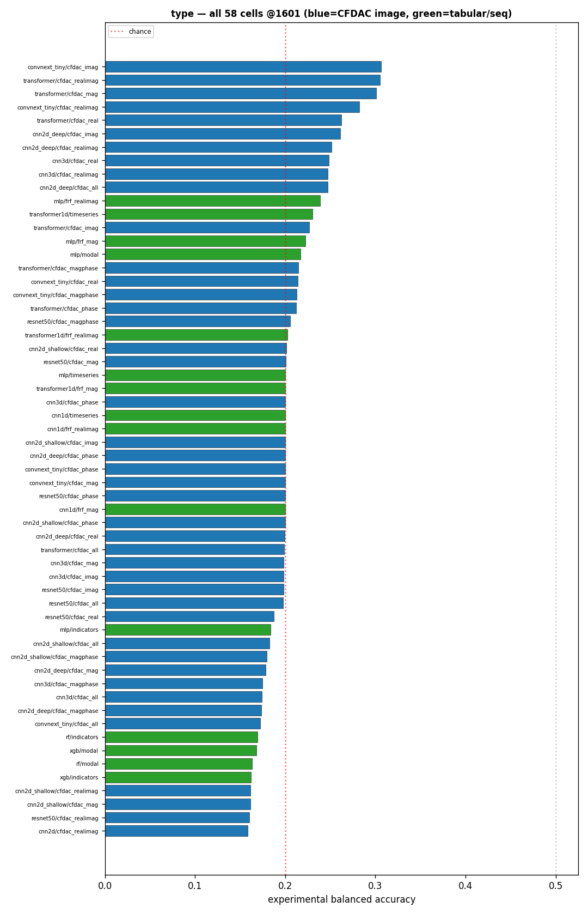

| model / feature | in-domain mF1 | exp bal-acc | exp macro-F1 | collapse |
|---|---|---|---|---|
| `convnext_tiny/cfdac_imag` | 0.82 | 0.306 | 0.280 |  |
| `transformer/cfdac_realimag` | 0.82 | 0.305 | 0.203 |  |
| `transformer/cfdac_mag` | 0.76 | 0.301 | 0.208 |  |
| `convnext_tiny/cfdac_realimag` | 0.85 | 0.282 | 0.246 |  |
| `transformer/cfdac_real` | 0.86 | 0.262 | 0.165 |  |
| `cnn2d_deep/cfdac_imag` | 0.77 | 0.261 | 0.162 |  |
| `cnn2d_deep/cfdac_realimag` | 0.72 | 0.251 | 0.142 |  |
| `cnn3d/cfdac_real` | 0.37 | 0.248 | 0.195 |  |
| `cnn3d/cfdac_realimag` | 0.34 | 0.247 | 0.198 |  |
| `cnn2d_deep/cfdac_all` | 0.85 | 0.247 | 0.128 |  |
| `mlp/frf_realimag` | 0.85 | 0.239 | 0.086 |  |
| `transformer1d/timeseries` | 0.86 | 0.231 | 0.149 |  |
| `transformer/cfdac_imag` | 0.84 | 0.226 | 0.167 |  |
| `mlp/frf_mag` | 0.86 | 0.222 | 0.075 |  |
| `mlp/modal` | 0.86 | 0.217 | 0.066 | yes |
| `transformer/cfdac_magphase` | 0.84 | 0.215 | 0.175 | yes |
| `convnext_tiny/cfdac_real` | 0.84 | 0.214 | 0.186 | yes |
| `convnext_tiny/cfdac_magphase` | 0.82 | 0.213 | 0.162 | yes |
| `transformer/cfdac_phase` | 0.85 | 0.212 | 0.158 | yes |
| `resnet50/cfdac_magphase` | 0.83 | 0.205 | 0.148 | yes |
| `transformer1d/frf_realimag` | 0.86 | 0.203 | 0.149 | yes |
| `cnn2d_shallow/cfdac_real` | 0.42 | 0.202 | 0.138 | yes |
| `resnet50/cfdac_mag` | 0.73 | 0.200 | 0.034 | yes |
| `mlp/timeseries` | 0.84 | 0.200 | 0.034 | yes |
| `transformer1d/frf_mag` | 0.85 | 0.200 | 0.136 | yes |
| `cnn2d_shallow/cfdac_phase` | 0.59 | 0.200 | 0.135 | yes |
| `cnn1d/frf_mag` | 0.70 | 0.200 | 0.033 | yes |
| `resnet50/cfdac_phase` | 0.80 | 0.200 | 0.135 | yes |
| `convnext_tiny/cfdac_mag` | 0.07 | 0.200 | 0.038 | yes |
| `convnext_tiny/cfdac_phase` | 0.07 | 0.200 | 0.060 | yes |
| `cnn2d_deep/cfdac_phase` | 0.80 | 0.200 | 0.033 | yes |
| `cnn2d_shallow/cfdac_imag` | 0.44 | 0.200 | 0.135 | yes |
| `cnn1d/frf_realimag` | 0.68 | 0.200 | 0.135 | yes |
| `cnn1d/timeseries` | 0.72 | 0.200 | 0.033 | yes |
| `cnn3d/cfdac_phase` | 0.59 | 0.200 | 0.135 | yes |
| `cnn2d_deep/cfdac_real` | 0.74 | 0.200 | 0.135 | yes |
| `transformer/cfdac_all` | 0.87 | 0.199 | 0.066 | yes |
| `cnn3d/cfdac_mag` | 0.33 | 0.198 | 0.134 | yes |
| `cnn3d/cfdac_imag` | 0.34 | 0.198 | 0.146 | yes |
| `resnet50/cfdac_imag` | 0.79 | 0.198 | 0.148 | yes |
| `resnet50/cfdac_all` | 0.83 | 0.198 | 0.135 | yes |
| `resnet50/cfdac_real` | 0.75 | 0.188 | 0.047 | yes |
| `mlp/indicators` | 0.80 | 0.183 | 0.082 | yes |
| `cnn2d_shallow/cfdac_all` | 0.35 | 0.182 | 0.079 | yes |
| `cnn2d_shallow/cfdac_magphase` | 0.43 | 0.180 | 0.126 | yes |
| `cnn2d_deep/cfdac_mag` | 0.66 | 0.178 | 0.085 | yes |
| `cnn3d/cfdac_magphase` | 0.47 | 0.175 | 0.129 | yes |
| `cnn3d/cfdac_all` | 0.44 | 0.174 | 0.127 | yes |
| `cnn2d_deep/cfdac_magphase` | 0.84 | 0.174 | 0.136 | yes |
| `convnext_tiny/cfdac_all` | 0.84 | 0.172 | 0.132 | yes |
| `rf/indicators` | 0.74 | 0.169 | 0.105 | yes |
| `xgb/modal` | 0.80 | 0.168 | 0.144 | yes |
| `rf/modal` | 0.81 | 0.163 | 0.129 | yes |
| `xgb/indicators` | 0.74 | 0.162 | 0.113 | yes |
| `cnn2d_shallow/cfdac_realimag` | 0.43 | 0.162 | 0.119 | yes |
| `cnn2d_shallow/cfdac_mag` | 0.20 | 0.162 | 0.124 | yes |
| `resnet50/cfdac_realimag` | 0.79 | 0.160 | 0.124 | yes |
| `cnn2d/cfdac_realimag` | 0.17 | 0.158 | 0.140 | yes |

**Best:** `convnext_tiny/cfdac_imag` — exp balanced-acc **0.306** (macro-F1 0.280; in-domain 0.82). 7/58 cells clear chance+0.05; 44 collapse to one class.

### col_location
**Question.** Column location of damage (6-class)  **Output.** storey×end  **Chance.** 0.17.  BD/AD near-degenerate in the linear ROM.
**Cells:** 58.

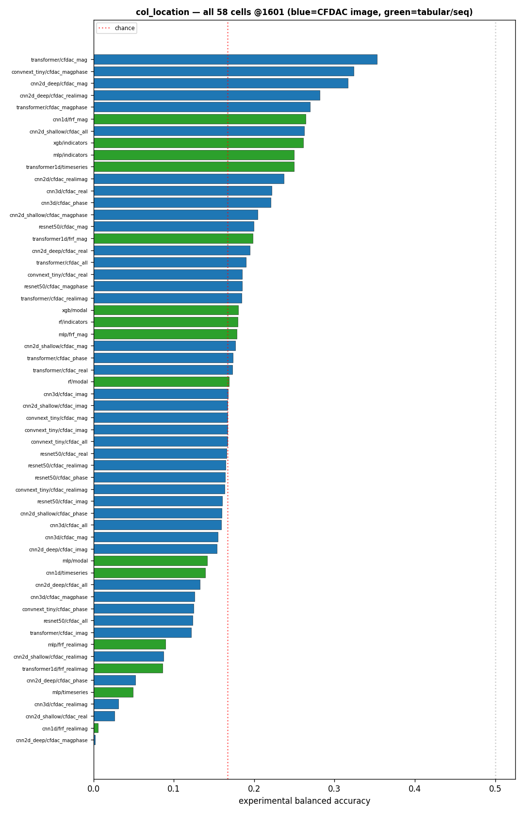

| model / feature | in-domain mF1 | exp bal-acc | exp macro-F1 | collapse |
|---|---|---|---|---|
| `transformer/cfdac_mag` | 0.45 | 0.353 | 0.082 |  |
| `convnext_tiny/cfdac_magphase` | 0.47 | 0.324 | 0.127 |  |
| `cnn2d_deep/cfdac_mag` | 0.46 | 0.316 | 0.163 |  |
| `cnn2d_deep/cfdac_realimag` | 0.45 | 0.281 | 0.170 |  |
| `transformer/cfdac_magphase` | 0.48 | 0.270 | 0.121 |  |
| `cnn1d/frf_mag` | 0.48 | 0.264 | 0.199 |  |
| `cnn2d_shallow/cfdac_all` | 0.45 | 0.262 | 0.114 |  |
| `xgb/indicators` | 0.48 | 0.261 | 0.155 |  |
| `mlp/indicators` | 0.45 | 0.250 | 0.134 |  |
| `transformer1d/timeseries` | 0.48 | 0.250 | 0.136 |  |
| `cnn2d/cfdac_realimag` | 0.07 | 0.237 | 0.114 |  |
| `cnn3d/cfdac_real` | 0.35 | 0.222 | 0.106 |  |
| `cnn3d/cfdac_phase` | 0.50 | 0.220 | 0.141 |  |
| `cnn2d_shallow/cfdac_magphase` | 0.43 | 0.205 | 0.058 |  |
| `resnet50/cfdac_mag` | 0.48 | 0.199 | 0.125 |  |
| `transformer1d/frf_mag` | 0.49 | 0.198 | 0.165 |  |
| `cnn2d_deep/cfdac_real` | 0.47 | 0.194 | 0.158 |  |
| `transformer/cfdac_all` | 0.49 | 0.190 | 0.162 |  |
| `convnext_tiny/cfdac_real` | 0.45 | 0.185 | 0.039 | yes |
| `resnet50/cfdac_magphase` | 0.46 | 0.185 | 0.132 | yes |
| `transformer/cfdac_realimag` | 0.41 | 0.185 | 0.085 | yes |
| `xgb/modal` | 0.47 | 0.180 | 0.080 | yes |
| `rf/indicators` | 0.44 | 0.180 | 0.182 | yes |
| `mlp/frf_mag` | 0.46 | 0.178 | 0.135 | yes |
| `cnn2d_shallow/cfdac_mag` | 0.22 | 0.176 | 0.038 | yes |
| `transformer/cfdac_phase` | 0.45 | 0.174 | 0.101 | yes |
| `transformer/cfdac_real` | 0.48 | 0.173 | 0.069 | yes |
| `rf/modal` | 0.46 | 0.169 | 0.058 | yes |
| `cnn3d/cfdac_imag` | 0.18 | 0.167 | 0.050 | yes |
| `convnext_tiny/cfdac_all` | 0.05 | 0.167 | 0.019 | yes |
| `convnext_tiny/cfdac_imag` | 0.05 | 0.167 | 0.019 | yes |
| `convnext_tiny/cfdac_mag` | 0.05 | 0.167 | 0.019 | yes |
| `cnn2d_shallow/cfdac_imag` | 0.32 | 0.167 | 0.047 | yes |
| `resnet50/cfdac_real` | 0.47 | 0.165 | 0.089 | yes |
| `resnet50/cfdac_realimag` | 0.49 | 0.164 | 0.087 | yes |
| `resnet50/cfdac_phase` | 0.51 | 0.164 | 0.099 | yes |
| `convnext_tiny/cfdac_realimag` | 0.46 | 0.163 | 0.128 | yes |
| `resnet50/cfdac_imag` | 0.46 | 0.160 | 0.147 | yes |
| `cnn2d_shallow/cfdac_phase` | 0.44 | 0.159 | 0.090 | yes |
| `cnn3d/cfdac_all` | 0.43 | 0.159 | 0.121 | yes |
| `cnn3d/cfdac_mag` | 0.25 | 0.155 | 0.020 | yes |
| `cnn2d_deep/cfdac_imag` | 0.32 | 0.154 | 0.136 | yes |
| `mlp/modal` | 0.48 | 0.141 | 0.099 | yes |
| `cnn1d/timeseries` | 0.51 | 0.139 | 0.079 | yes |
| `cnn2d_deep/cfdac_all` | 0.47 | 0.133 | 0.112 | yes |
| `cnn3d/cfdac_magphase` | 0.48 | 0.126 | 0.090 | yes |
| `convnext_tiny/cfdac_phase` | 0.49 | 0.125 | 0.070 | yes |
| `resnet50/cfdac_all` | 0.49 | 0.123 | 0.066 | yes |
| `transformer/cfdac_imag` | 0.48 | 0.121 | 0.101 | yes |
| `mlp/frf_realimag` | 0.50 | 0.090 | 0.050 | yes |
| `cnn2d_shallow/cfdac_realimag` | 0.31 | 0.087 | 0.064 | yes |
| `transformer1d/frf_realimag` | 0.47 | 0.086 | 0.104 | yes |
| `cnn2d_deep/cfdac_phase` | 0.44 | 0.052 | 0.045 | yes |
| `mlp/timeseries` | 0.47 | 0.049 | 0.051 | yes |
| `cnn3d/cfdac_realimag` | 0.42 | 0.031 | 0.045 | yes |
| `cnn2d_shallow/cfdac_real` | 0.15 | 0.026 | 0.028 | yes |
| `cnn1d/frf_realimag` | 0.47 | 0.005 | 0.010 | yes |
| `cnn2d_deep/cfdac_magphase` | 0.51 | 0.002 | 0.003 | yes |

**Best:** `transformer/cfdac_mag` — exp balanced-acc **0.353** (macro-F1 0.082; in-domain 0.45). 13/58 cells clear chance+0.05; 40 collapse to one class.

### mass_location
**Question.** Added-mass location (4-class)  **Output.** base/fl1/fl2/fl3  **Chance.** 0.25.
**Cells:** 58.

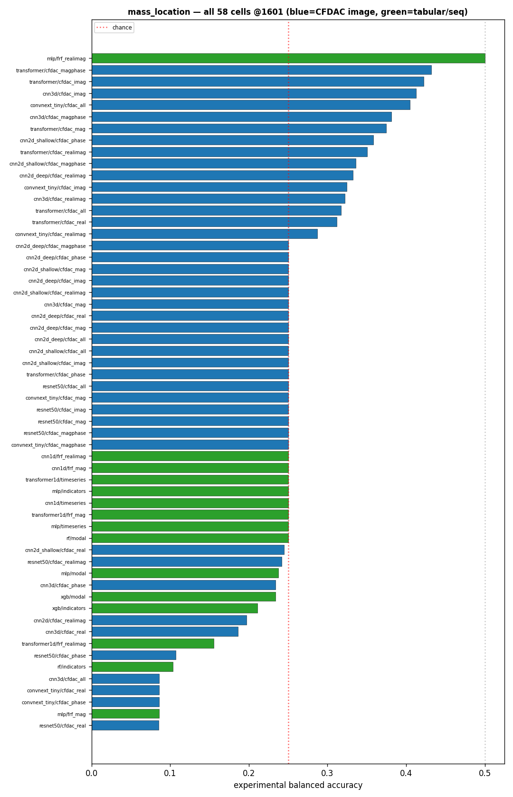

| model / feature | in-domain mF1 | exp bal-acc | exp macro-F1 | collapse |
|---|---|---|---|---|
| `mlp/frf_realimag` | 0.99 | 0.500 | 0.308 |  |
| `transformer/cfdac_magphase` | 0.99 | 0.432 | 0.308 |  |
| `transformer/cfdac_imag` | 0.97 | 0.422 | 0.334 |  |
| `cnn3d/cfdac_imag` | 0.56 | 0.412 | 0.280 |  |
| `convnext_tiny/cfdac_all` | 0.98 | 0.405 | 0.362 |  |
| `cnn3d/cfdac_magphase` | 0.76 | 0.381 | 0.282 |  |
| `transformer/cfdac_mag` | 0.96 | 0.375 | 0.251 |  |
| `cnn2d_shallow/cfdac_phase` | 0.95 | 0.358 | 0.308 |  |
| `transformer/cfdac_realimag` | 0.97 | 0.351 | 0.211 |  |
| `cnn2d_shallow/cfdac_magphase` | 0.83 | 0.336 | 0.176 |  |
| `cnn2d_deep/cfdac_realimag` | 0.83 | 0.332 | 0.196 |  |
| `convnext_tiny/cfdac_imag` | 1.00 | 0.325 | 0.228 |  |
| `cnn3d/cfdac_realimag` | 0.72 | 0.322 | 0.235 |  |
| `transformer/cfdac_all` | 1.00 | 0.317 | 0.250 |  |
| `transformer/cfdac_real` | 0.98 | 0.312 | 0.247 |  |
| `convnext_tiny/cfdac_realimag` | 0.99 | 0.287 | 0.232 |  |
| `cnn2d_shallow/cfdac_imag` | 0.93 | 0.250 | 0.102 | yes |
| `convnext_tiny/cfdac_magphase` | 0.98 | 0.250 | 0.103 | yes |
| `transformer/cfdac_phase` | 0.98 | 0.250 | 0.102 | yes |
| `cnn2d_shallow/cfdac_all` | 0.95 | 0.250 | 0.072 | yes |
| `resnet50/cfdac_magphase` | 0.99 | 0.250 | 0.072 | yes |
| `cnn2d_deep/cfdac_all` | 0.99 | 0.250 | 0.102 | yes |
| `rf/modal` | 1.00 | 0.250 | 0.121 | yes |
| `cnn2d_deep/cfdac_mag` | 0.95 | 0.250 | 0.102 | yes |
| `cnn2d_deep/cfdac_real` | 0.99 | 0.250 | 0.145 | yes |
| `cnn3d/cfdac_mag` | 0.38 | 0.250 | 0.102 | yes |
| `cnn2d_shallow/cfdac_realimag` | 0.96 | 0.250 | 0.102 | yes |
| `mlp/timeseries` | 0.99 | 0.250 | 0.072 | yes |
| `cnn2d_deep/cfdac_imag` | 0.99 | 0.250 | 0.072 | yes |
| `transformer1d/frf_mag` | 0.99 | 0.250 | 0.102 | yes |
| `cnn2d_shallow/cfdac_mag` | 0.68 | 0.250 | 0.102 | yes |
| `cnn2d_deep/cfdac_phase` | 1.00 | 0.250 | 0.102 | yes |
| `cnn2d_deep/cfdac_magphase` | 1.00 | 0.250 | 0.102 | yes |
| `resnet50/cfdac_mag` | 0.96 | 0.250 | 0.102 | yes |
| `resnet50/cfdac_imag` | 0.99 | 0.250 | 0.080 | yes |
| `cnn1d/timeseries` | 0.98 | 0.250 | 0.145 | yes |
| `mlp/indicators` | 0.97 | 0.250 | 0.072 | yes |
| `transformer1d/timeseries` | 0.94 | 0.250 | 0.095 | yes |
| `convnext_tiny/cfdac_mag` | 0.10 | 0.250 | 0.145 | yes |
| `resnet50/cfdac_all` | 0.99 | 0.250 | 0.072 | yes |
| `cnn1d/frf_mag` | 0.99 | 0.250 | 0.145 | yes |
| `cnn1d/frf_realimag` | 0.97 | 0.250 | 0.072 | yes |
| `cnn2d_shallow/cfdac_real` | 0.73 | 0.245 | 0.147 | yes |
| `resnet50/cfdac_realimag` | 0.98 | 0.242 | 0.100 | yes |
| `mlp/modal` | 1.00 | 0.238 | 0.134 | yes |
| `xgb/modal` | 0.99 | 0.234 | 0.123 | yes |
| `cnn3d/cfdac_phase` | 0.96 | 0.234 | 0.119 | yes |
| `xgb/indicators` | 0.96 | 0.211 | 0.193 | yes |
| `cnn2d/cfdac_realimag` | 0.36 | 0.197 | 0.130 | yes |
| `cnn3d/cfdac_real` | 0.68 | 0.186 | 0.193 | yes |
| `transformer1d/frf_realimag` | 0.97 | 0.156 | 0.185 | yes |
| `resnet50/cfdac_phase` | 0.99 | 0.107 | 0.115 | yes |
| `rf/indicators` | 0.97 | 0.104 | 0.077 | yes |
| `convnext_tiny/cfdac_phase` | 1.00 | 0.086 | 0.080 | yes |
| `convnext_tiny/cfdac_real` | 0.99 | 0.086 | 0.060 | yes |
| `cnn3d/cfdac_all` | 0.72 | 0.086 | 0.080 | yes |
| `mlp/frf_mag` | 0.99 | 0.086 | 0.128 | yes |
| `resnet50/cfdac_real` | 0.99 | 0.085 | 0.033 | yes |

**Best:** `mlp/frf_realimag` — exp balanced-acc **0.500** (macro-F1 0.308; in-domain 0.99). 15/58 cells clear chance+0.05; 42 collapse to one class.

### severity
**Question.** Damage severity (regression)  **Output.** ŷ∈[0,1] normalised  **Regression.**  Only non-classifier task.
**Cells:** 58.

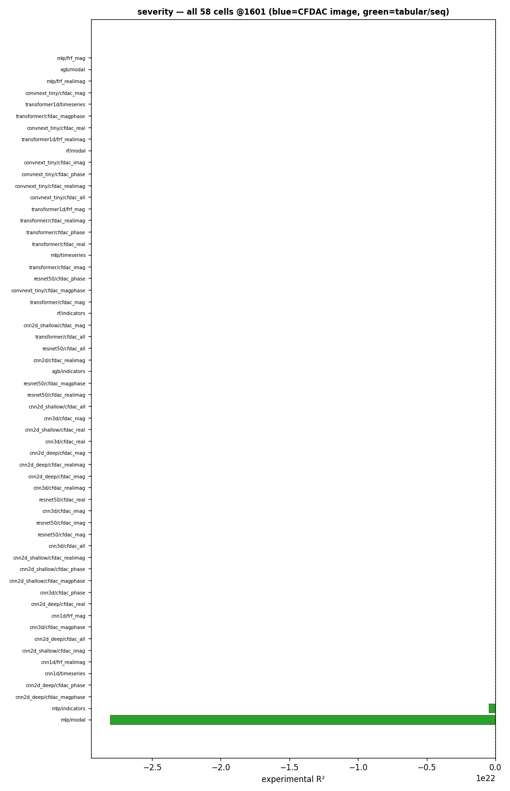

| model / feature | in-domain R² | exp R² |
|---|---|---|
| `mlp/frf_mag` | 0.592 | +0.037 |
| `xgb/modal` | 0.513 | -0.007 |
| `mlp/frf_realimag` | 0.595 | -0.032 |
| `convnext_tiny/cfdac_mag` | -0.000 | -0.033 |
| `transformer1d/timeseries` | 0.494 | -0.042 |
| `transformer/cfdac_magphase` | 0.406 | -0.044 |
| `convnext_tiny/cfdac_real` | 0.549 | -0.055 |
| `transformer1d/frf_realimag` | -0.000 | -0.070 |
| `rf/modal` | 0.547 | -0.082 |
| `convnext_tiny/cfdac_imag` | 0.572 | -0.128 |
| `convnext_tiny/cfdac_phase` | 0.556 | -0.137 |
| `convnext_tiny/cfdac_realimag` | 0.566 | -0.154 |
| `convnext_tiny/cfdac_all` | 0.586 | -0.158 |
| `transformer1d/frf_mag` | 0.249 | -0.175 |
| `transformer/cfdac_realimag` | 0.574 | -0.178 |
| `transformer/cfdac_phase` | 0.274 | -0.222 |
| `transformer/cfdac_real` | 0.484 | -0.318 |
| `mlp/timeseries` | 0.577 | -0.323 |
| `transformer/cfdac_imag` | 0.467 | -0.363 |
| `resnet50/cfdac_phase` | 0.413 | -0.419 |
| `convnext_tiny/cfdac_magphase` | 0.494 | -0.422 |
| `transformer/cfdac_mag` | 0.268 | -0.596 |
| `rf/indicators` | 0.468 | -0.661 |
| `cnn2d_shallow/cfdac_mag` | 0.077 | -0.804 |
| `transformer/cfdac_all` | 0.471 | -0.824 |
| `resnet50/cfdac_all` | 0.435 | -0.937 |
| `cnn2d/cfdac_realimag` | 0.000 | -0.941 |
| `xgb/indicators` | 0.452 | -0.997 |
| `resnet50/cfdac_magphase` | 0.413 | -1.038 |
| `resnet50/cfdac_realimag` | 0.427 | -1.143 |
| `cnn2d_shallow/cfdac_all` | -0.165 | -1.148 |
| `cnn3d/cfdac_mag` | 0.040 | -1.169 |
| `cnn2d_shallow/cfdac_real` | 0.132 | -1.362 |
| `cnn3d/cfdac_real` | 0.128 | -2.184 |
| `cnn2d_deep/cfdac_mag` | 0.039 | -2.693 |
| `cnn2d_deep/cfdac_realimag` | 0.176 | -2.798 |
| `cnn2d_deep/cfdac_imag` | 0.027 | -3.310 |
| `cnn3d/cfdac_realimag` | 0.128 | -4.474 |
| `resnet50/cfdac_real` | 0.426 | -4.941 |
| `cnn3d/cfdac_imag` | 0.100 | -6.864 |
| `resnet50/cfdac_imag` | 0.435 | -6.942 |
| `resnet50/cfdac_mag` | 0.288 | -8.224 |
| `cnn3d/cfdac_all` | 0.183 | -8.953 |
| `cnn2d_shallow/cfdac_realimag` | 0.119 | -13.154 |
| `cnn2d_shallow/cfdac_phase` | 0.203 | -18.306 |
| `cnn2d_shallow/cfdac_magphase` | 0.246 | -31.260 |
| `cnn3d/cfdac_phase` | 0.262 | -31.512 |
| `cnn2d_deep/cfdac_real` | 0.575 | -49.491 |
| `cnn1d/frf_mag` | 0.302 | -49.848 |
| `cnn3d/cfdac_magphase` | 0.274 | -62.275 |
| `cnn2d_deep/cfdac_all` | 0.462 | -127.150 |
| `cnn2d_shallow/cfdac_imag` | 0.139 | -160.171 |
| `cnn1d/frf_realimag` | 0.278 | -219.448 |
| `cnn1d/timeseries` | 0.259 | -895.972 |
| `cnn2d_deep/cfdac_phase` | 0.367 | -1966.978 |
| `cnn2d_deep/cfdac_magphase` | 0.358 | -3131.753 |
| `mlp/indicators` | 0.483 | -475005154580935999488.000 |
| `mlp/modal` | 0.514 | -28047672784197238390784.000 |

**Best:** `mlp/frf_mag` exp R²=0.037 (in-domain R²=0.59). Severity barely transfers; the full diagnosis is in §8.

## 9 · Damage-threshold (DT) severity sweep @1601
Positives are stratified by their damage-severity percentile (each task on its own axis: bolt %, hole mm, mass kg, crack depth); balanced accuracy is recomputed keeping only the more-severe positives (all negatives retained). This tests the central thesis — *transfer should improve with damage severity, because larger damage perturbs the spectrum more than the domain gap does.*

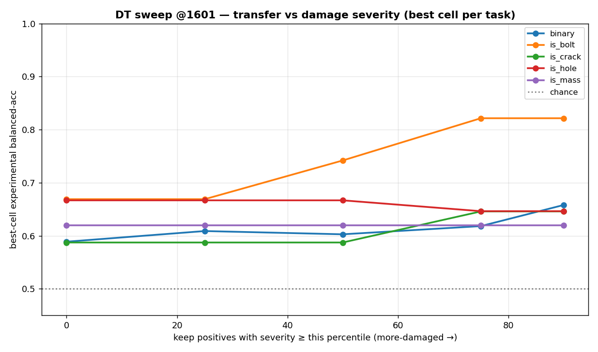
*Figure 7 — best-cell experimental balanced-acc vs the severity percentile kept.*

| task | all (p0) | ≥p50 | ≥p75 | ≥p90 | best cell @p90 |
|---|---|---|---|---|---|
| is_bolt | 0.669 | 0.742 | 0.821 | 0.821 | transformer/cfdac_mag |
| binary | 0.589 | 0.603 | 0.618 | 0.658 | transformer1d/timeseries |
| is_crack | 0.587 | 0.587 | 0.646 | 0.646 | convnext_tiny/cfdac_phase |
| is_hole | 0.667 | 0.667 | 0.646 | 0.646 | mlp/frf_realimag |
| is_mass | 0.620 | 0.620 | 0.620 | 0.620 | cnn3d/cfdac_imag |

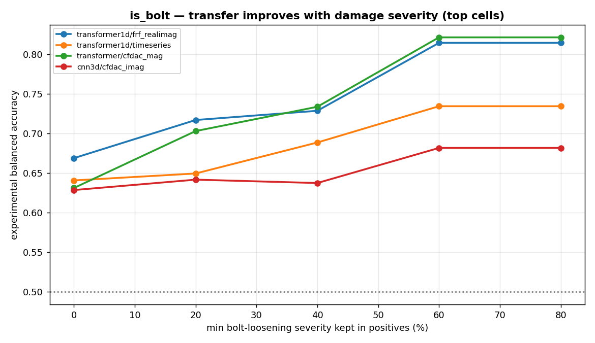
*Figure 8 — the is_bolt detectors, swept on loosening severity.*

**is_bolt reaches ~0.82 balanced-acc at ≥75% loosening** — confirming the thesis where severity has range to vary. is_hole/is_mass stay flat *because their experimental severity range is narrow (Figure 2b), not because the model fails* — there simply is no 'more severe' subset to climb into.

### 9.2 The full diagnostic suite, swept over severity
Balanced accuracy is one scalar; the questions *'does the **ranking** (AUC) improve, and **how** does the confusion matrix change?'* need the whole suite recomputed at each severity threshold. Using the stored class probabilities, the best cell of each detection task is re-scored keeping only progressively more-severe positives.

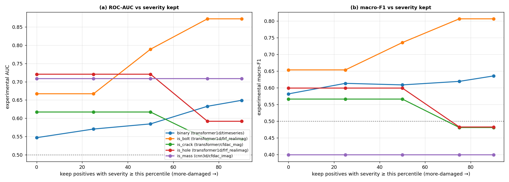
*Figure 9 — ROC-AUC (a) and macro-F1 (b) vs the severity percentile kept.*

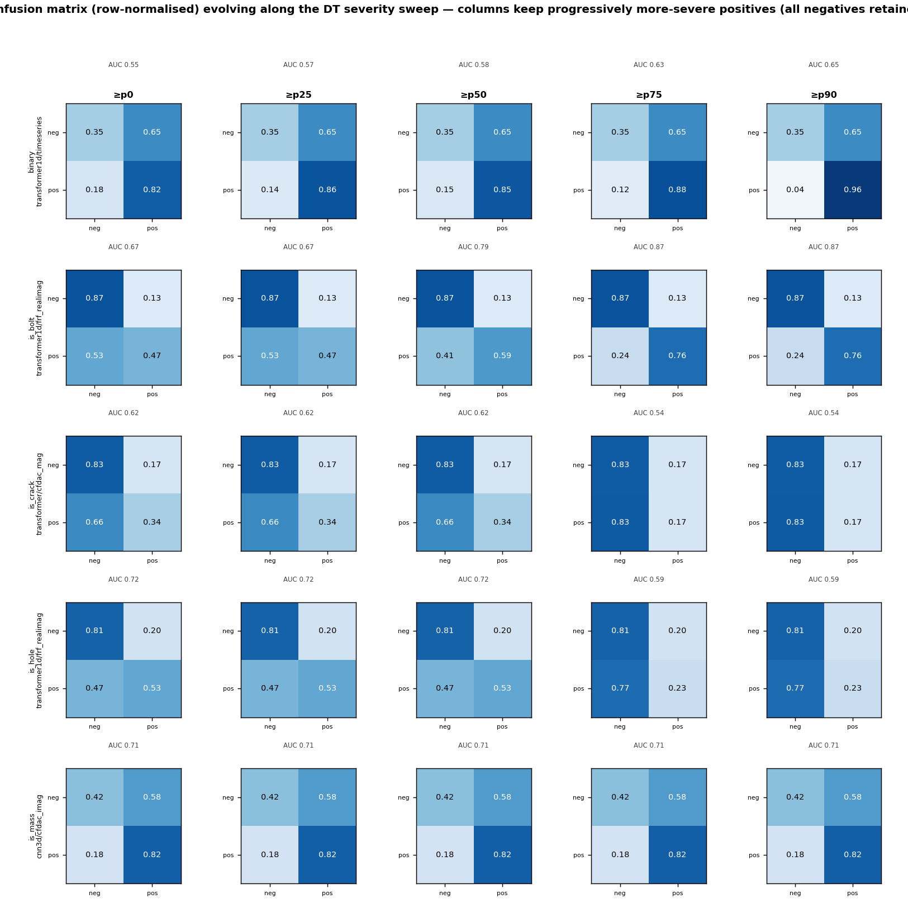
*Figure 10 — the row-normalised confusion matrix at each severity threshold (rows = task, columns = percentile). Watch the positive-row (bottom) darken on the diagonal as damage increases.*

| task | AUC p0 → p90 | sensitivity p0 → p90 | reading |
|---|---|---|---|
| binary `transformer1d/timeseries` | 0.55 → 0.65 | 0.82 → 0.96 | climbs steadily — bigger damage is easier to call damaged (sens 0.82→0.96). |
| is_bolt `transformer1d/frf_realimag` | 0.67 → 0.87 | 0.47 → 0.76 | the clean win: AUC and sensitivity both rise sharply with loosening %. |
| is_crack `transformer/cfdac_mag` | 0.62 → 0.54 | 0.34 → 0.17 | rises then **falls** at p75+ — the severe-crack subset is tiny, so the estimate is noisy, not better. |
| is_hole `transformer1d/frf_realimag` | 0.72 → 0.59 | 0.53 → 0.23 | flat then **drops** at p75+ — same small-sample artefact; hole severity barely varies (1–6 mm). |
| is_mass `cnn3d/cfdac_imag` | 0.71 → 0.71 | 0.82 → 0.82 | perfectly flat — experimental mass severity is near-discrete, so there is no gradient to climb. |

**The honest reading.** Severity helps where it *varies*: `binary` and especially `is_bolt` (AUC 0.67→0.87) improve monotonically. For `is_crack`/`is_hole` the apparent late drop is a **small-sample artefact** — past p75 only a handful of positives remain (the experimental crack/hole severities barely span a range), so the metric becomes noisy rather than genuinely worse. `is_mass` is flat because its real severity is essentially a single level. This nuance is exactly why the sweep reports per-task thresholds and positive counts rather than a single global curve.

### 9.3 The same sweep on a *physical* axis — storey-stiffness loss
Native severity units are not comparable across damage types (a '% loosening' is not a 'mm of crack'). Using the **simulator's own calibrated damage model** (`ml_pipeline.variation.{bolt_jsr_ratio, crack_ratio, hole_ratio}`), each stiffness-reducing damage is mapped to the actual fraction of storey stiffness it removes — putting bolt, crack and hole on one physical axis. (Added mass is excluded: it changes inertia, not compliance, so its stiffness loss is 0.)

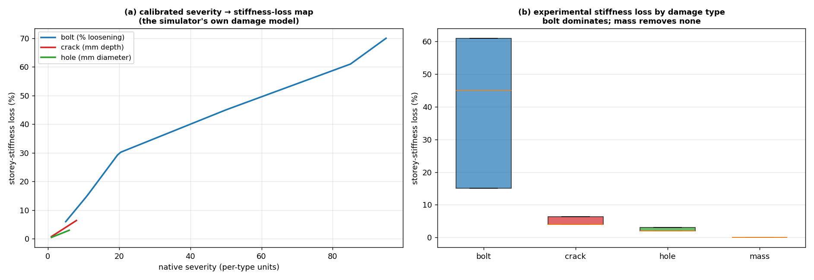
*Figure 11 — (a) the calibrated severity→stiffness-loss map; (b) the experimental stiffness loss each damage type actually produces. This single panel is the physical key to the whole study.*

Experimentally, **bolt loosening removes 15–61% of storey stiffness (median ~45%), while a crack removes only 4–6% and a hole only 2–3%**. The three 'detection' tasks are therefore *not* probing comparable amounts of structural change — crack and hole damage is, physically, an order of magnitude milder.

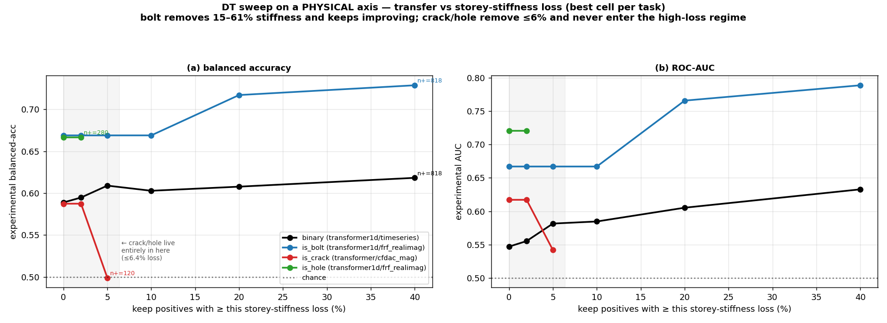
*Figure 12 — best-cell balanced-acc (a) and AUC (b) vs the minimum storey-stiffness loss retained in the positives; the grey band marks the ≤6.4% region where all crack/hole damage lives.*

| task | best cell | ≥0% | ≥5% | ≥20% | ≥40% | positives surviving |
|---|---|---|---|---|---|---|
| binary | `transformer1d/timeseries` | 0.589 | 0.609 | 0.608 | 0.618 | 2176→818 (≥40%) |
| is_bolt | `transformer1d/frf_realimag` | 0.669 | 0.669 | 0.717 | 0.729 | 1338→818 (≥40%) |
| is_crack | `transformer/cfdac_mag` | 0.587 | 0.499 | — | — | 320→0 (≥40%) |
| is_hole | `transformer1d/frf_realimag` | 0.667 | — | — | — | 280→0 (≥40%) |

**This is the physical explanation for the whole detection hierarchy.** On a stiffness-loss axis the story is unambiguous: `binary` and `is_bolt` keep climbing as we retain only structurally-significant damage (is_bolt balanced-acc 0.67→0.73, AUC 0.67→0.79 by ≥40% loss), because bolt damage genuinely reaches that regime. `is_crack` and `is_hole` curves **terminate early** — by ≥10% and ≥5% stiffness loss respectively there are *zero* experimental positives left, because crack/hole simply never remove that much stiffness. Their weak, flat transfer is not a model failure: the damage they represent is physically near-invisible to a global FRF. The takeaway sharpens the severity message of §9.1–9.2: **detection transfers in proportion to how much stiffness the damage removes**, and only bolt-loosening (and any other large-stiffness-loss mechanism) reaches the regime where sim-to-real transfer becomes reliable.

## 10 · Severity regression (the only non-classifier task)
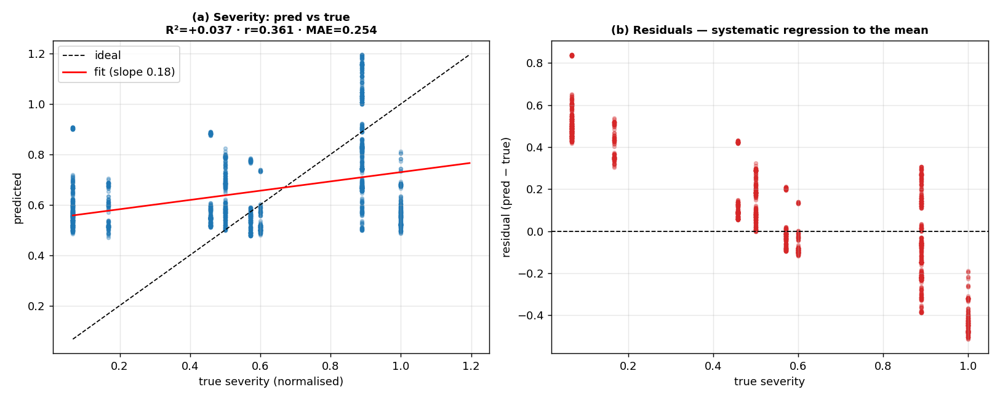
*Figure 13 — (a) predicted vs true severity for the best cell; (b) residuals.*

Best experimental **R² = +0.037** with **Pearson r = 0.361** and **MAE = 0.254** (`mlp/frf_mag`), against **R² ≈ 0.59 in-domain**. The scatter tells the story the R² number alone does not: there *is* a weak positive trend (r ≈ 0.36, the fit slope is positive), so the model is not random — but the predictions collapse toward the training mean (the residual plot in (b) slopes against the true value, the signature of regression-to-the-mean under distribution shift). Restricting to severe cases does **not** raise R² (that just narrows the variance). **Predicting damage *magnitude* zero-shot is effectively unsolved**; recasting it as ordinal severity-band classification (§11) is the recommended fix, since detection already improves monotonically with severity (§7).

## 11 · Cross-task synthesis
1. **Detection ≫ localization ≫ magnitude.** Presence/type transfers (AUC 0.55–0.72, balanced-acc 0.56–0.67); location only weakly (≈1.4–2× chance); severity barely (r≈0.36, R²≈0.04).
2. **Severity is the lever, not the target.** Every detector improves on more-severe damage (is_bolt →0.82 at ≥75% loosening); use damage size to *gate confidence*, don't try to *regress* it.
3. **Representation > model size.** Full complex spectral inputs (raw FRF / CFDAC / FRF-derived timeseries) with sequence/conv models win; the compressed `modal` vector and the ImageNet-pretrained vision backbones (ConvNeXt-T, ResNet50) do **not** lead — pretraining on natural images buys nothing for these spectra.
4. **The ceiling is covariate shift, not capacity.** Near-perfect in-domain (Figure 1) collapses to partial transfer because the domains are AUC=1.00 separable (Figure 4). Higher resolution and bigger nets cannot close a gap that is fundamentally about the simulator not matching the rig.

## 12 · Limitations
- **One experimental structure, one seed per cell** — treat balanced-acc gaps < 0.05 as ties.
- **Post-hoc best-cell selection** (§5–6 pick the winner after seeing the test set) is exploratory, not a held-out estimate; the per-task tables guard against cherry-picking by showing every cell.
- **Localization classes are near-degenerate** in the linear ROM (symmetric crack/hole make the two column ends almost indistinguishable), capping col_location even in-domain (0.45 mF1).
- **`timeseries` is FRF-reconstructed**, not independently measured, so it carries no information beyond the FRF — it is a different *inductive bias*, not a new sensor.
- **128-bin resolution comparison pending** (that run is still in progress).

## 13 · Recommendations
1. **Deploy detection on severe damage and report severity-stratified** (the DT curves, not a single number).
2. **Recalibrate the decision threshold on a few real samples** — the AUC>bal-acc gap (§5.2) is free accuracy.
3. **Use spectral inputs + sequence/conv models; drop `modal` and pretrained vision** as the primary route.
4. **Attack the domain gap directly with domain adaptation** (e.g. CORAL/feature alignment, fine-tune on a small labelled real set, or domain-randomise the simulator) — this is the highest-leverage move given the AUC≈1.0 shift.
5. **Recast severity as ordinal classification** and extend the DT analysis to the multi-class tasks.
6. **Finish the 128-bin run** to settle whether full resolution is necessary.

## 14 · Artefacts (everything is reproducible from these)
- **Engines:** `ml_pipeline/hires_{zoo,tab,all}.py` — CFDAC-image, tabular/sequence, and the unified dispatcher; every model and feature defined here.
- **Analysis scripts:** `hires_zoo_summary.py` (per-cell distillation), `hires_dt_1601.py` (DT balanced-acc sweep), `hires_dt_diag.py` (DT-swept AUC + confusion evolution), `hires_analysis.py` (EDA + best-cell confusion/ROC/severity), `hires_arch.py` (measured parameter counts), `hires_inputs.py` (input-sample figures), `build_hires_report.py` (this report).
- **Data:** `results_hires/{zoo_summary, zoo_best_by_task_res, dt_1601, dt_diag, dt_stiffness, analysis, architectures, inputs}.json`. **Every figure is reproducible from committed data** — the per-case predictions are archived in `results_hires/per_case_hires1601.tar.gz` and the FRF-derived arrays the EDA/input figures need in `results_hires/figure_data.npz` (built by `build_figure_bundle.py`, served by `figdata.py`). Raw per-case predictions also live on branches `colab-hires-{tabular,cnn,transformer,vision}`. See `results/REPRODUCE.md` for the one-command-per-script pipeline.
- **Figures:** `results/figures/hires/` — inputs (`inputs_*`), capacity (`arch_params`), EDA (`eda_*`), best-cell diagnostics (`diag_*`), DT sweep (`dt_1601_combined`, `zoo_dt_is_bolt`, `dt_auc`, `dt_confusion_evo`), per-task cell zoos (`cellzoo_*`).
- **Companion:** `REPORT_synth.md` (in-domain ceiling).
