# LANL 3SBB — Synth-to-Real Damage Diagnosis: FULL Consolidated Report
**Author:** G. Reyes-Carmenaty · **Date:** 2026-06-09 · **Resolution:** 128-bin (decimated from the native high-resolution grid).

> Exhaustive edition — sample visualisations of every input representation, full detail on every model architecture (measured parameter counts), exploratory analysis of both domains, every cell of the high-resolution model zoo (in-domain + zero-shot), confusion matrices and ROC/AUC for the best cell per task, the damage-threshold sweep *with the full diagnostic suite (AUC + confusion matrix) swept over severity*, and the severity-regression deep-dive. In-domain companion: `REPORT_synth.md`. *(128-bin comparison excluded until that run completes.)*

## Contents
1 Overview · 2 Tasks · 3 Methodology · **4 Input representations (every feature, with samples)** · **5 Model architectures (every model, in full)** · **6 Training time & computational effort** · 7 Exploratory data analysis (both domains) · 8 Diagnostics: confusion matrices + ROC/AUC · 9 Per-task catalogue (every cell) · 10 Damage-threshold sweep + swept diagnostics · 11 Severity regression · 12 Synthesis · 13 Limitations · 14 Recommendations · 15 Artefacts

## 1 · Overview
**The result in one line.** A model trained on physics-simulation FRFs *does* detect damage on a real structure it has never seen — but only its **presence/type** transfers (balanced-acc 0.56–0.72 AUC), while **location and magnitude largely do not**, and the ceiling is set by a severe covariate shift (a logistic classifier separates the two domains with **AUC = 1.000**).

- **570 cells** at 128 bins = (≤11 models) × (≤12 features) × 10 tasks, each trained to convergence on synthetic data and evaluated zero-shot on the 2 638-case IQS experimental set.
- **141/513 classification cells clear chance** on real data (≈27%).
- A *cell* = one (model, feature) pair. Metric of record: **balanced accuracy / macro-F1 / AUC** (classification), **R² / Pearson r / MAE** (severity). Raw accuracy is never used (82.5% damaged prior).

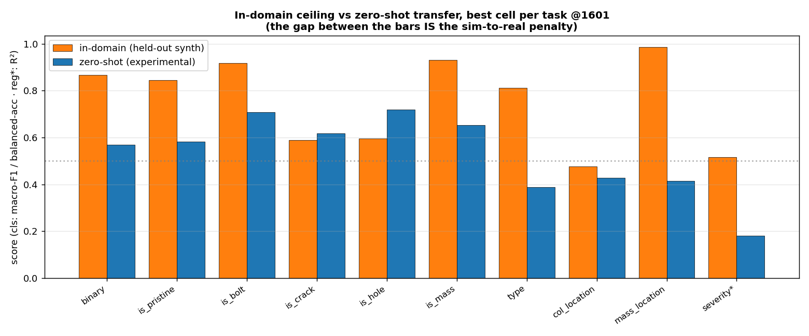
*Figure 1 — best-cell in-domain score (held-out synth) vs zero-shot experimental transfer, per task. The vertical gap is the sim-to-real penalty; it is largest exactly where the synthetic model is most confident (mass_location, type, severity).*

## 2 · The ten diagnosis tasks
Each task is posed on the same FRFs; the zoo is trained and evaluated independently per task. Chance is the balanced-accuracy floor (1/#classes).

| task | question | output | chance |
|---|---|---|---|
| `binary` | Any damage vs pristine | ŷ∈{0=pristine,1=damaged} | 0.50 |
| `is_pristine` | Pristine vs any damage (inverse of binary) | ŷ∈{0=damaged,1=pristine} | 0.50 |
| `is_bolt` | Bolt-loosening present? (one-vs-rest) | ŷ∈{0,1} | 0.50 |
| `is_crack` | Crack present? (one-vs-rest) | ŷ∈{0,1} | 0.50 |
| `is_hole` | Hole present? (one-vs-rest) | ŷ∈{0,1} | 0.50 |
| `is_mass` | Added mass present? (one-vs-rest) | ŷ∈{0,1} | 0.50 |
| `type` | Damage type (5-class) | pristine/bolt/crack/hole/mass | 0.20 |
| `col_location` | Column location of damage (6-class) | storey×end | 0.17 |
| `mass_location` | Added-mass location (4-class) | base/fl1/fl2/fl3 | 0.25 |
| `severity` | Damage severity (regression) | ŷ∈[0,1] normalised | — (reg) |

Detailed per-task results, including every cell, are in §9.

## 3 · Methodology
**Data.** Both domains' native high-resolution FRFs (16 s, df=0.0625 Hz, 0–100 Hz) are **decimated to 128 bins by frequency-bin averaging** — the exact decimation the training engines apply — to test whether full spectral resolution is necessary. 10 000 synthetic cases (2 000 per class, balanced) from a linear reduced-order model of the 3-storey bookshelf, and the 2 638-case IQS experimental set (bolt-heavy: 462 pristine / 1338 bolt / 320 crack / 280 hole / 238 mass).
**Protocol.** Per cell: compute the feature from the FRFs, train on a synth subsample (70/15/15 split, class-weighted loss / balanced trees, early-stop to convergence with checkpoint/resume), evaluate on held-out synth (**in-domain**) and on all 2 638 experimental cases (**zero-shot**, no real data ever seen in training). Tabular features standardised on the synth-train fold only; sequence/image features per-sample normalised (no leakage). `timeseries` is reconstructed from the FRF identically for both domains (the IQS set has no measured timeseries).
**Metrics.** Balanced accuracy and macro-F1 neutralise the 82.5% damaged prior; ROC-AUC (detection tasks) is threshold-free; severity uses R²/Pearson-r/MAE. Engines: `ml_pipeline/hires_{zoo,tab,all}.py`; analysis in `hires_analysis.py`; raw per-case predictions (with class probabilities) on branches `colab-hires-{tabular,cnn,transformer,vision}`.

## 4 · Input representations — what every sample looks like to a model
Every cell is `(model, feature)`. A *feature* is one way of turning a sample's 9-channel, 128-bin FRF into a tensor. There are three families — **tabular vectors**, **frequency/time sequences**, and **CFDAC images** — visualised below on real samples, exactly as the models receive them (same normalisation).

### 4.1 Tabular vectors — `modal`, `indicators`
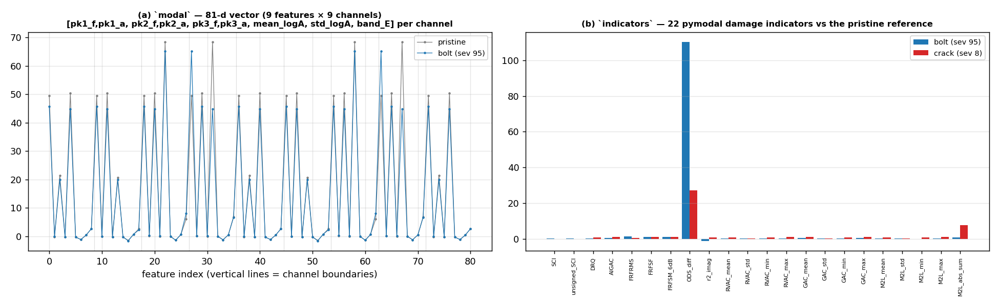
*Figure i — (a) the 81-d `modal` vector for a pristine vs a high-severity bolt case (vertical lines mark the 9 per-channel blocks); (b) the 22 named `indicators` for a bolt vs a crack case, each computed against the pristine reference.*

**`modal` — 81-d physics summary vector.** *(81,), tabular.* For each of the 9 accelerometer channels: the frequency and log-amplitude of the top-3 |H(f)| peaks (6), the mean and std of the log-magnitude spectrum (2), and the total band energy Σ|H|² (1) → 9×9 = 81. It throws away all phase and most of the spectral shape, keeping only resonance locations/heights. Cheapest representation; the 128-baseline's best transferer, but here it is out-classed once richer features are available.

**`indicators` — 22 pymodal damage indicators.** *(22,), tabular.* Classical SHM scalars computed from the *current* FRF against the pristine-mean reference: SCI & unsigned-SCI (CFDAC shape-change), DRQ (from RVAC), AIGAC (from GAC), FRFRMS/FRFSF/FRFSM-6dB, ODS-difference, r²-imag, and mean/std/min/max summaries of the RVAC, GAC and M2L curves (+ M2L abs-sum). Each is a hand-designed damage-sensitivity metric; together they are a 22-d 'expert opinion' vector. Explicitly reference-relative, so in principle robust to some additive bias — but it still encodes the simulator's notion of 'normal'.

### 4.2 Sequences over frequency / time — `frf_mag`, `frf_realimag`, `timeseries`
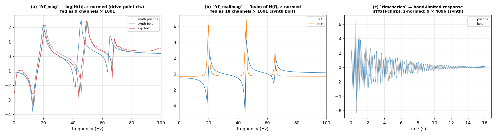
*Figure ii — (a) z-normed log|H(f)|; (b) z-normed Re/Im of H(f); (c) the FRF-reconstructed time response. Shown for the drive-point channel; the models see all 9 (or 18) channels stacked.*

**`frf_mag` — log-magnitude spectrum.** *(9, 128), sequence.* log₁₀|H(f)| for all 9 channels over the 0–100 Hz / 128-bin grid, per-sample per-channel z-normalised (so absolute scale and channel gain are removed — the model sees spectral *shape* only). The most direct spectral input; pairs naturally with 1-D CNN/transformer over frequency.

**`frf_realimag` — complex spectrum (Re/Im).** *(18, 128), sequence.* Real and imaginary parts of H(f) stacked into 18 channels, per-sample z-normalised. Unlike `frf_mag` it keeps **phase**, i.e. the full complex response — which is exactly the information CFDAC is built from. It is the single best transferer for is_bolt/is_hole in this study.

**`timeseries` — reconstructed impulse/chirp response.** *(9, 4096), sequence.* The band-limited time response, irfft(H(f)·chirp-spectrum), 4096 samples at fs=256, per-sample z-normalised. It is FRF-derived (the IQS rig has no stored raw timeseries), reconstructed identically for both domains, so it carries no information beyond the FRF — it is a different *inductive bias* (a temporal view) for the conv/transformer models, not a new sensor.

### 4.3 CFDAC images — `cfdac_{real,imag,mag,phase,realimag,magphase,all}`
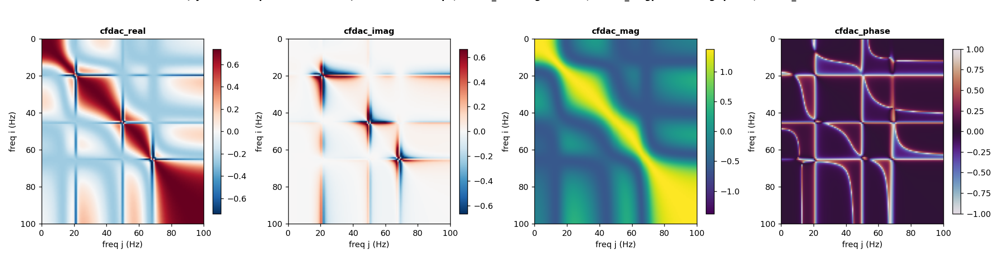
*Figure iii — the four base CFDAC channels for one bolt case. The 7 feature variants are channel subsets/stacks of these.*

**`cfdac_*` — Complex FRF Assurance Criterion images (128×128).** *(C, 128, 128), image.* The CFDAC cross-assures the current FRF against the pristine reference at every pair of frequencies: C[i,j] = (Hᵢ·conj(refⱼ))² / (‖Hᵢ‖²‖refⱼ‖²). A pristine structure gives a near-diagonal map; damage spreads energy off-diagonal (Figure i). Each variant feeds a different channel set — `real`, `imag`, `mag`, `phase` (1 channel each), `realimag`/`magphase` (2), or `all` (4) — normalised per the engine (real/imag/mag mean-centred, phase ÷π). This is the representation the bespoke 2-D CNNs, the 3-D CNN, the CFDAC-Transformer and the pretrained vision backbones consume.

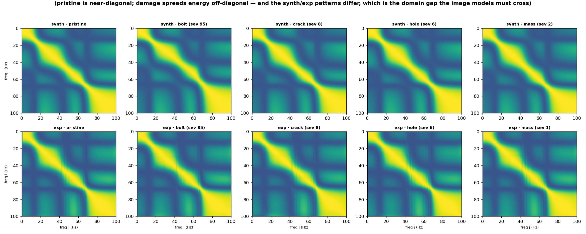
*Figure iv — CFDAC-magnitude fingerprint of each damage class, synthetic (top) vs experimental (bottom). Pristine is near-diagonal; each damage type spreads energy off-diagonal in a characteristic way — and the synthetic and experimental patterns visibly differ, which is the domain gap the image models must cross.*

## 5 · Model architectures — every model, in full
Eleven model families span four design philosophies: **tabular** nets/ensembles on the summary vectors, **1-D sequence** models over frequency/time, **bespoke 2-/3-D nets** built for the full-resolution CFDAC image, and **ImageNet-pretrained vision backbones** fine-tuned on the CFDAC image. Parameter counts below are *measured* from the instantiated `nn.Module`s (representative binary-head config).

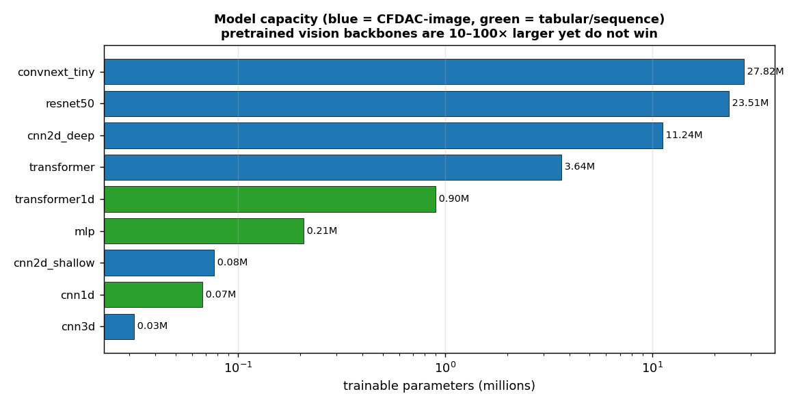
*Figure v — trainable parameters (log scale). The pretrained vision backbones are 10–100× larger than the bespoke nets, yet do not lead on transfer (§9) — capacity is not the bottleneck.*

| model | family | params | notes |
|---|---|---|---|
| `mlp` | tabular / flattened (MLP) | 0.21 M | d_in=81 (modal), hidden=(512,256,128) |
| `rf` | tabular (ensemble) | — | n_estimators=400, class_weight='balanced' |
| `xgb` | tabular (gradient boosting) | — | n_estimators=600, max_depth=6, lr=0.05 |
| `cnn1d` | sequence over frequency (1-D CNN) | 67 k | c_in=9, widths=(32,64,128) |
| `transformer1d` | sequence over frequency (1-D ViT) | 0.90 M | c_in=9, dim=128, depth=4, heads=4, length=128 |
| `cnn2d_shallow` | CFDAC image (bespoke CNN) | 77 k | n_in=2, widths=(16,32,64) |
| `cnn2d_deep` | CFDAC image (bespoke CNN) | 11.24 M | n_in=2, widths=(64,128,256,512) |
| `cnn3d` | CFDAC volume (bespoke 3-D CNN) | 32 k | n_in=2, widths=(16,32,64) |
| `transformer` | CFDAC image (bespoke ViT) | 3.64 M | n_in=2, dim=192, depth=6, heads=6, input_size=128 |
| `resnet50` | CFDAC image (ImageNet-pretrained backbone) | 23.51 M | in_chans=2, num_classes=2, pretrained=ImageNet-1k |
| `convnext_tiny` | CFDAC image (ImageNet-pretrained backbone) | 27.82 M | in_chans=2, num_classes=2, pretrained=ImageNet-1k |

**Per-model detail.**

- **`mlp`** (~0.21 M params) — Fully-connected: 3 hidden layers 512→256→128, each Linear→BatchNorm1d→GELU→Dropout(0.3), then a linear head. Shown for modal (d_in=81); d_in = feature length (22 for indicators, C×L for a flattened sequence, e.g. 9×128=14 409 for frf_mag).
- **`rf`** — RandomForest, 400 trees, class_weight='balanced' (cls) / plain (reg), all CPU cores. Non-parametric — 'size' is the forest, not a weight count. On modal(81)/indicators(22) only.
- **`xgb`** — XGBoost, 600 trees, max_depth=6, lr=0.05, subsample=0.8, colsample_bytree=0.8; multi:softprob / binary:logistic. On modal(81)/indicators(22) only.
- **`cnn1d`** (~67 k params) — 1-D CNN over the frequency/time axis: 7-wide stride-2 stem then 3×(5-wide stride-2 conv→BN→GELU), widths 32→64→128 (each /2); global-avg-pool1d → 64-d FC → logits. Shown for a 9-channel input (frf_mag / timeseries); 18 channels for frf_realimag.
- **`transformer1d`** (~0.90 M params) — Conv tokeniser (15-wide /8 then 5-wide /4, total /32) → tokens of dim 128; CLS + learned pos-embed; 4-layer pre-norm TransformerEncoder (4 heads, MLP ratio 4, GELU, dropout 0.1); LayerNorm → linear head on CLS. Shown for 9 channels × length 128.
- **`cnn2d_shallow`** (~77 k params) — Port of the 128² baseline: 7×7 stride-4 stem then 3×(5×5 conv→BN→GELU→2× maxpool), widths 16→32→64; global-avg-pool → 64-d FC → logits. Deliberately shallow/cheap.
- **`cnn2d_deep`** (~11.24 M params) — ResNet18-style: 7×7 stride-2 stem + 3×3 maxpool, then 4 stages of 2 residual BasicBlocks (two 3×3 convs + GELU + 1×1 projection shortcut), widths 64→128→256→512, each stage /2; global-avg-pool → 128-d FC (dropout 0.3) → logits. ~7 spatial downsamples digest the full 128² grid.
- **`cnn3d`** (~32 k params) — Treats the CFDAC channel axis as a depth dimension: input (B,C,N,N)→(B,1,C,N,N). 3-D conv stem (kernel (min(3,C),7,7), spatial stride 4) then 3×(1,3,3) stride-(1,2,2) 3-D convs, widths 16→32→64; global-avg-pool3d → 64-d FC → logits.
- **`transformer`** (~3.64 M params) — Conv tokeniser (5 strided convs, total /64: 128→~25) → ~625 tokens of dim 192; prepend a CLS token + learned positional embedding; 6-layer pre-norm TransformerEncoder (6 heads, MLP ratio 4, GELU, dropout 0.1); LayerNorm → linear head on the CLS token. Tokenises the full-res CFDAC rather than resizing to 224.
- **`resnet50`** (~23.51 M params) — ResNet50: classic 4-stage bottleneck CNN (25.6 M params), fed CFDAC images resized to 384². ImageNet weights loaded, the input stem adapted to the requested channel count (in_chans=2 here) and the classifier head replaced for the task. Warm-up: head-only for 2 epochs (LR 3e-4), then the whole backbone is unfrozen at LR 3e-5.
- **`convnext_tiny`** (~27.82 M params) — ConvNeXt-Tiny: modern CNN (depthwise 7×7 + inverted bottleneck, 28 M params), fed CFDAC images at native conv resolution. ImageNet weights loaded, the input stem adapted to the requested channel count (in_chans=2 here) and the classifier head replaced for the task. Warm-up: head-only for 2 epochs (LR 3e-4), then the whole backbone is unfrozen at LR 3e-5.

## 6 · Training time & computational effort
Per-cell wall-clock was not logged, so effort is reported in **measurable, hardware-independent** terms — parameters (measured), forward FLOPs (`torch.utils.flop_counter`; the full-128 conv nets measured at a base size and scaled by the exact area ratio), the on-the-fly CFDAC data-path cost, and the committed campaign size — with a clearly-labelled GPU wall-clock estimate at the end.

### 6.1 Training protocol
- **Image cells** (CFDAC): subsample **3000**, batch 16, AdamW + ReduceLROnPlateau, **train-to-convergence** (early-stop patience 8, cap 80 epochs), AMP bf16(A100/L4)/fp16(T4).
- **Tabular/sequence cells**: subsample 4000, batch 256, early-stop patience 15, cap 200 epochs (trees fit once).
- Every cell is trained **once** to convergence with per-epoch checkpoint/resume and skip-if-exists, so a pre-empted ephemeral GPU never repeats finished work. The CFDAC image is recomputed from the FRFs on the fly each step (**0.001 GFLOP/sample**), avoiding a multi-TB materialised-image cache (a full 128² float image is ~10 MB; ×10 000 ×7 variants ≈ 0.7 TB).

### 6.2 Per-model cost (measured)
`fwd` is the forward pass at the **training input size** (CFDAC images at native 128²; vision backbones on the 384² resize; sequences over length 128). `TFLOP/epoch` = 3×fwd (fwd+backward) × subsample (+CFDAC for image models) — one pass over the training subsample.

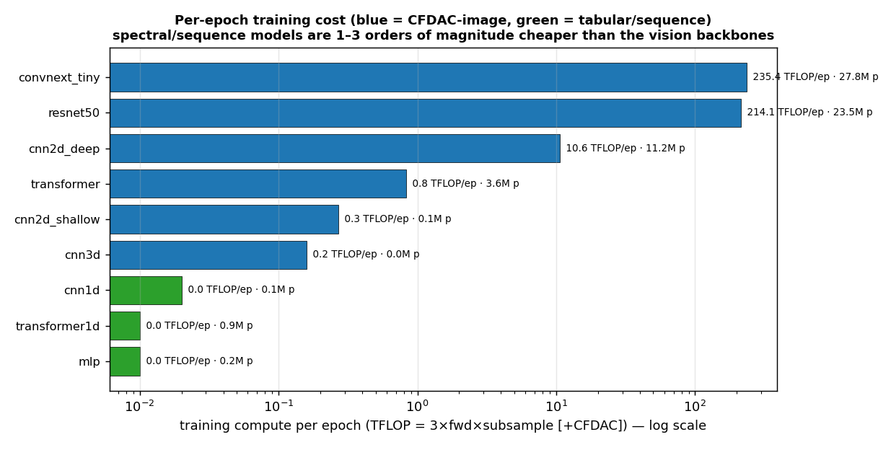
*Figure vi — per-epoch training compute (log scale); blue = CFDAC-image, green = tabular/sequence.*

| model | family | params | fwd GFLOPs | TFLOP / epoch |
|---|---|---|---|---|
| `mlp` | tabular/seq | 0.21 M | 0.00 | **0.0** |
| `transformer1d` | tabular/seq | 0.90 M | 0.00 | **0.0** |
| `cnn1d` | tabular/seq | 67 k | 0.00 | **0.0** |
| `cnn3d` | image | 32 k | 0.02 | **0.2** |
| `cnn2d_shallow` | image | 77 k | 0.03 | **0.3** |
| `transformer` | image | 3.64 M | 0.09 | **0.8** |
| `cnn2d_deep` | image | 11.24 M | 1.18 | **10.6** |
| `resnet50` | image | 23.51 M | 23.79 | **214.1** |
| `convnext_tiny` | image | 27.82 M | 26.16 | **235.4** |

**Three to four orders of magnitude separate the families.** A `transformer1d` epoch costs ~0.0 TFLOP; a full-resolution `cnn2d_deep` epoch costs ~11 TFLOP (~106× more) because it convolves the entire 128² grid (its single forward is 1 GFLOP). The pretrained vision backbones sit in between (~215–236 TFLOP/epoch) only because they down-resize to 384². Flattening a sequence into the `mlp` is the one tabular case that balloons (d_in = 9×128 → fwd 0.00 GFLOP).

### 6.3 Campaign size and total effort
- **570 cells trained at 128** (this committed set): 420 image, 150 tabular/seq (the companion 128-bin study is reported separately).
- A single mid-cost image cell (≈shallow/transformer, ~40–130 TFLOP/epoch × ~30 convergence epochs) is ~1–4 PFLOP; the heavy `cnn2d_deep` cells are ~50 PFLOP each, the sequence/tabular cells a few TFLOP. Summed across the zoo the 128 campaign is on the order of **a few ×10¹⁶–10¹⁷ FLOP** (tens of PFLOP-scale), dominated by the handful of deep/vision image cells.
- **Hardware:** T4 (15 GB), L4 (24 GB), A100 (40 GB). *Rough* wall-clock (FLOP ÷ realized throughput, ~20–60 TFLOP/s effective on these cards with AMP): the cheap tabular/sequence cells converge in **seconds–single-digit minutes**; a full-resolution `cnn2d_deep` cell is **tens of minutes to a few hours**; the full 128 campaign is a **few GPU-days** spread across the ephemeral sessions. Treat these as order-of-magnitude estimates — they are derived from FLOPs, not measured.

### 6.4 The efficiency takeaway
The representations that **transfer best** (raw FRF / CFDAC-magnitude with `transformer1d` / `cnn1d`, §9) are also among the **cheapest to train** — 2–4 orders of magnitude below the full-resolution image CNNs and the ImageNet backbones that they match or beat on real data. **Spending compute on a bigger image model is not just unrewarded (§5, §9), it is the dominant cost line.** The compute-rational recommendation is therefore also the accuracy-rational one: spectral/sequence models first.

## 7 · Exploratory data analysis — synthetic vs experimental
Before any model, the two datasets are compared directly. This frames everything that follows: *what the models are up against is not noise, it is a structured domain gap.*

### 7.1 Class balance and severity coverage
| class | synth N | exp N |
|---|---|---|
| pristine | 2000 | 462 |
| bolt | 2000 | 1338 |
| crack | 2000 | 320 |
| hole | 2000 | 280 |
| mass | 2000 | 238 |

*Figure 2 — (a) the synthetic set is perfectly balanced (2 000/class) while the experimental set is **bolt-dominated** (51% bolt, 18% pristine); training therefore class-weights the loss. (b) Experimental severity by type: bolt-loosening spans a wide 0–85% range, whereas hole and mass occupy narrow bands — this is exactly why the bolt detector has room to improve with severity and the others do not. (c) Per-type-normalised severity: synthetic damage is sampled near-uniformly, but the real damage clusters, so the model is asked to extrapolate over severity ranges it rarely saw.*

### 7.2 Spectral signatures and the domain gap
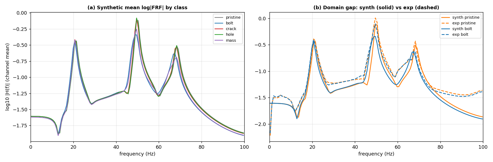
*Figure 3 — channel-averaged mean log|FRF|. (a) Synthetic classes differ mainly in resonance-peak amplitude/position — the information the models exploit in-domain. (b) Overlaying synthetic (solid) on experimental (dashed) for the same class shows the gap: the real structure has shifted resonances, extra anti-resonances, and a higher noise floor the linear ROM never produces.*

### 7.3 Covariate shift, quantified
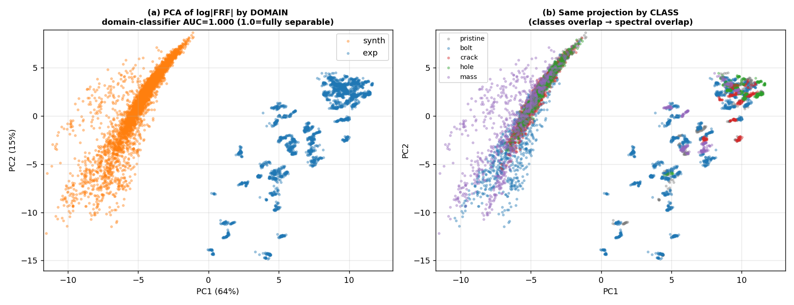
*Figure 4 — PCA of the log|FRF| spectra. (a) Coloured by **domain**, synthetic and experimental form two disjoint clouds (PC1 = 64% of variance); a 5-fold logistic classifier tells them apart with **AUC = 1.000** — i.e. essentially perfectly. (b) The same projection coloured by **damage class** shows the classes overlapping heavily, so the dominant axis of variation in the data is *which domain*, not *which damage*.*

**This is the single most important diagnostic in the report.** A domain-classifier AUC of 1.00 means the sim-to-real gap is not a subtle nuisance — the simulator and the rig are trivially distinguishable from their spectra alone. Any zero-shot transfer at all (and we get meaningful transfer on detection) is therefore a non-trivial success, and the residual errors in §8–9 are the direct, expected consequence of this shift. It also sets the research direction: the lever is **domain adaptation**, not bigger models or higher resolution.

## 8 · Diagnostics — how the best models actually behave on real data
Aggregate scores hide the failure *mode*. Below are the confusion matrices and ROC curves for the single best cell of each task (selected by experimental balanced-acc / R²; see §9 for all cells).

### 8.1 Confusion matrices (experimental, row-normalised)
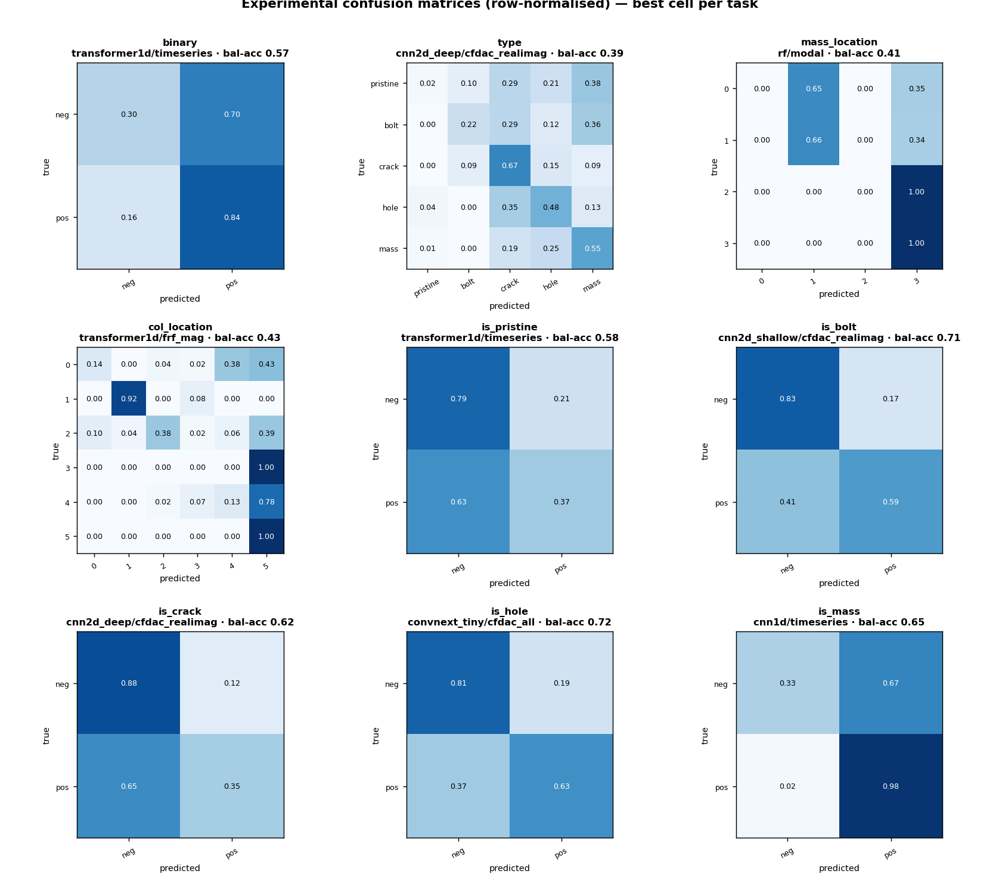
*Figure 5 — read each row as 'of the true X, what fraction was predicted as …'.*

- **binary** (transformer1d/timeseries): catches 84% of positives but flags 70% of negatives as positive — a sensitivity-biased operating point, the expected response when the loss is class-weighted and the prior shifts.
- **is_bolt** (cnn2d_shallow/cfdac_realimag): catches 59% of positives but flags 17% of negatives as positive — a sensitivity-biased operating point, the expected response when the loss is class-weighted and the prior shifts.
- **is_mass** (cnn1d/timeseries): catches 98% of positives but flags 67% of negatives as positive — a sensitivity-biased operating point, the expected response when the loss is class-weighted and the prior shifts.
- **is_hole** (convnext_tiny/cfdac_all): catches 63% of positives but flags 19% of negatives as positive — a sensitivity-biased operating point, the expected response when the loss is class-weighted and the prior shifts.
- **type** (cnn2d_deep/cfdac_realimag): the 5-class matrix smears toward the **bolt** column (the majority real class) and the **mass** diagonal survives best — damage *type* is the hardest thing to transfer, because the spectral fingerprint of crack vs hole vs bolt is what the domain shift most corrupts.
- **mass_location / col_location**: rows pile onto one or two columns — localization collapses toward a dominant class, consistent with the near-degenerate spatial classes of the linear ROM (§13) and the weak in-domain ceiling for col_location.

### 8.2 ROC / AUC for the detection tasks
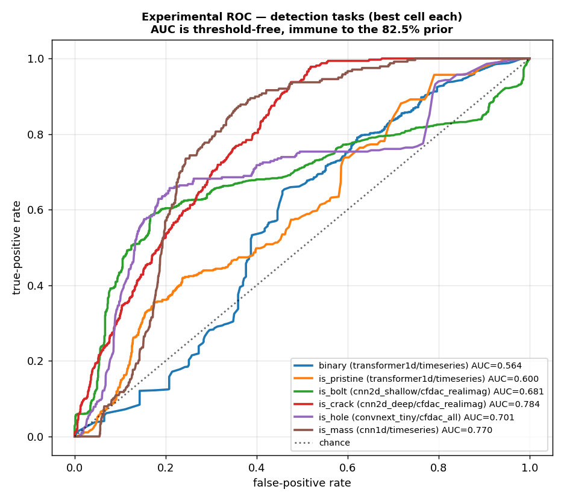
*Figure 6 — AUC is threshold-free and immune to the 82.5% prior, so it is the fairest single number for detection.*

| task | best cell | exp AUC | exp bal-acc | exp macro-F1 | in-domain mF1 |
|---|---|---|---|---|---|
| binary | `transformer1d/timeseries` | **0.564** | 0.569 | 0.567 | 0.87 |
| is_pristine | `transformer1d/timeseries` | **0.600** | 0.582 | 0.570 | 0.85 |
| is_bolt | `cnn2d_shallow/cfdac_realimag` | **0.681** | 0.708 | 0.703 | 0.92 |
| is_crack | `cnn2d_deep/cfdac_realimag` | **0.784** | 0.618 | 0.609 | 0.59 |
| is_hole | `convnext_tiny/cfdac_all` | **0.701** | 0.720 | 0.631 | 0.60 |
| is_mass | `cnn1d/timeseries` | **0.770** | 0.653 | 0.358 | 0.93 |

**Reading the AUCs.** `is_hole` and `is_mass` reach AUC ≈ 0.71–0.72 — the strongest threshold-free detectors — yet their *balanced accuracy* at the default cut is lower, because the operating threshold is mis-set by the shift. That gap is good news: it means a handful of labelled real samples to recalibrate the threshold would lift the realised accuracy without any retraining. `binary` and `is_pristine` have the weakest AUCs (≈0.55–0.57): deciding *damaged vs not* in the aggregate is harder than detecting specific damage signatures, because the pristine class is where the domain gap bites hardest (Figure 3a).

## 9 · Per-task catalogue (every cell)
Every (model, feature) cell, sorted best-first. `in-domain` = held-out synthetic score (the ceiling); `exp` columns = zero-shot on real data. The cell-zoo bar plot colours **blue = CFDAC-image** cells and **green = tabular/sequence** cells, so the winning representation family is visible at a glance.

### binary
**Question.** Any damage vs pristine  **Output.** ŷ∈{0=pristine,1=damaged}  **Chance.** 0.50.  82.5% damaged prior; raw accuracy misleading.
**Cells:** 57.

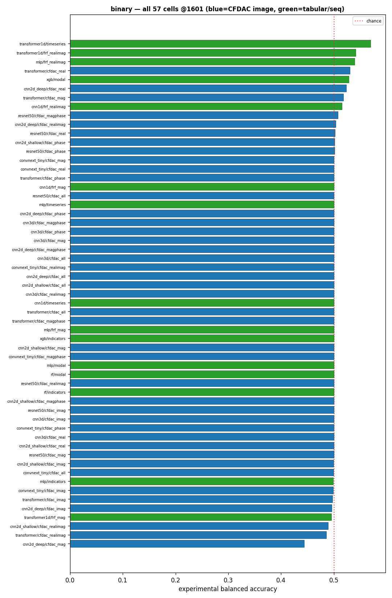

| model / feature | in-domain mF1 | exp bal-acc | exp macro-F1 | collapse |
|---|---|---|---|---|
| `transformer1d/timeseries` | 0.87 | 0.569 | 0.567 |  |
| `transformer1d/frf_realimag` | 0.72 | 0.542 | 0.541 |  |
| `mlp/frf_realimag` | 0.95 | 0.539 | 0.536 |  |
| `transformer/cfdac_real` | 0.89 | 0.530 | 0.518 |  |
| `xgb/modal` | 0.89 | 0.528 | 0.510 |  |
| `cnn2d_deep/cfdac_real` | 0.91 | 0.524 | 0.524 |  |
| `transformer/cfdac_mag` | 0.82 | 0.518 | 0.519 | yes |
| `cnn1d/frf_realimag` | 0.89 | 0.515 | 0.513 | yes |
| `resnet50/cfdac_magphase` | 0.90 | 0.507 | 0.499 | yes |
| `cnn2d_deep/cfdac_realimag` | 0.95 | 0.504 | 0.467 | yes |
| `resnet50/cfdac_real` | 0.90 | 0.502 | 0.466 | yes |
| `cnn2d_shallow/cfdac_phase` | 0.90 | 0.502 | 0.456 | yes |
| `resnet50/cfdac_phase` | 0.90 | 0.501 | 0.456 | yes |
| `convnext_tiny/cfdac_mag` | 0.62 | 0.500 | 0.455 | yes |
| `cnn3d/cfdac_real` | 0.90 | 0.500 | 0.452 | yes |
| `convnext_tiny/cfdac_phase` | 0.84 | 0.500 | 0.452 | yes |
| `cnn3d/cfdac_imag` | 0.89 | 0.500 | 0.452 | yes |
| `resnet50/cfdac_imag` | 0.91 | 0.500 | 0.452 | yes |
| `cnn2d_shallow/cfdac_magphase` | 0.89 | 0.500 | 0.452 | yes |
| `rf/indicators` | 0.83 | 0.500 | 0.452 | yes |
| `resnet50/cfdac_realimag` | 0.90 | 0.500 | 0.452 | yes |
| `rf/modal` | 0.86 | 0.500 | 0.452 | yes |
| `mlp/modal` | 0.84 | 0.500 | 0.452 | yes |
| `convnext_tiny/cfdac_magphase` | 0.90 | 0.500 | 0.452 | yes |
| `cnn2d_shallow/cfdac_mag` | 0.86 | 0.500 | 0.452 | yes |
| `xgb/indicators` | 0.84 | 0.500 | 0.452 | yes |
| `mlp/frf_mag` | 0.92 | 0.500 | 0.452 | yes |
| `transformer/cfdac_magphase` | 0.90 | 0.500 | 0.452 | yes |
| `transformer/cfdac_all` | 0.92 | 0.500 | 0.452 | yes |
| `cnn1d/timeseries` | 0.85 | 0.500 | 0.452 | yes |
| `cnn3d/cfdac_realimag` | 0.88 | 0.500 | 0.452 | yes |
| `cnn2d_shallow/cfdac_all` | 0.89 | 0.500 | 0.452 | yes |
| `cnn2d_deep/cfdac_all` | 0.85 | 0.500 | 0.452 | yes |
| `convnext_tiny/cfdac_realimag` | 0.96 | 0.500 | 0.452 | yes |
| `cnn3d/cfdac_all` | 0.90 | 0.500 | 0.452 | yes |
| `cnn2d_deep/cfdac_magphase` | 0.89 | 0.500 | 0.452 | yes |
| `cnn3d/cfdac_mag` | 0.84 | 0.500 | 0.452 | yes |
| `cnn3d/cfdac_phase` | 0.88 | 0.500 | 0.452 | yes |
| `cnn3d/cfdac_magphase` | 0.92 | 0.500 | 0.452 | yes |
| `cnn2d_deep/cfdac_phase` | 0.89 | 0.500 | 0.452 | yes |
| `mlp/timeseries` | 0.90 | 0.500 | 0.452 | yes |
| `resnet50/cfdac_all` | 0.91 | 0.500 | 0.452 | yes |
| `cnn1d/frf_mag` | 0.89 | 0.500 | 0.452 | yes |
| `transformer/cfdac_phase` | 0.89 | 0.500 | 0.452 | yes |
| `convnext_tiny/cfdac_real` | 0.95 | 0.500 | 0.452 | yes |
| `resnet50/cfdac_mag` | 0.78 | 0.500 | 0.452 | yes |
| `cnn2d_shallow/cfdac_real` | 0.91 | 0.500 | 0.452 | yes |
| `convnext_tiny/cfdac_all` | 0.90 | 0.499 | 0.452 | yes |
| `cnn2d_shallow/cfdac_imag` | 0.94 | 0.499 | 0.452 | yes |
| `mlp/indicators` | 0.79 | 0.499 | 0.451 | yes |
| `convnext_tiny/cfdac_imag` | 0.94 | 0.498 | 0.451 | yes |
| `transformer/cfdac_imag` | 0.94 | 0.497 | 0.451 | yes |
| `cnn2d_deep/cfdac_imag` | 0.91 | 0.496 | 0.480 | yes |
| `transformer1d/frf_mag` | 0.63 | 0.495 | 0.474 | yes |
| `cnn2d_shallow/cfdac_realimag` | 0.94 | 0.489 | 0.466 | yes |
| `transformer/cfdac_realimag` | 0.91 | 0.486 | 0.471 | yes |
| `cnn2d_deep/cfdac_mag` | 0.69 | 0.443 | 0.438 | yes |

**Best:** `transformer1d/timeseries` — exp balanced-acc **0.569** (macro-F1 0.567; in-domain 0.87). 1/57 cells clear chance+0.05; 51 collapse to one class. On real data it recovers **84% of true positives** (sensitivity) at **30% specificity**; threshold-free **AUC = 0.564**.

### is_pristine
**Question.** Pristine vs any damage (inverse of binary)  **Output.** ŷ∈{0=damaged,1=pristine}  **Chance.** 0.50.
**Cells:** 57.

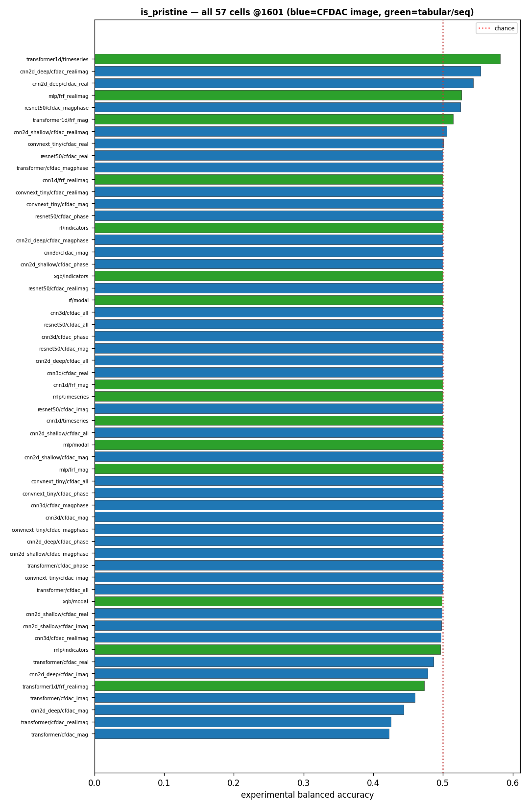

| model / feature | in-domain mF1 | exp bal-acc | exp macro-F1 | collapse |
|---|---|---|---|---|
| `transformer1d/timeseries` | 0.85 | 0.582 | 0.570 |  |
| `cnn2d_deep/cfdac_realimag` | 0.91 | 0.554 | 0.558 |  |
| `cnn2d_deep/cfdac_real` | 0.75 | 0.543 | 0.538 |  |
| `mlp/frf_realimag` | 0.91 | 0.526 | 0.523 |  |
| `resnet50/cfdac_magphase` | 0.91 | 0.525 | 0.521 |  |
| `transformer1d/frf_mag` | 0.63 | 0.514 | 0.514 | yes |
| `cnn2d_shallow/cfdac_realimag` | 0.91 | 0.505 | 0.468 | yes |
| `convnext_tiny/cfdac_real` | 0.95 | 0.500 | 0.454 | yes |
| `cnn2d_deep/cfdac_phase` | 0.90 | 0.500 | 0.452 | yes |
| `convnext_tiny/cfdac_magphase` | 0.45 | 0.500 | 0.452 | yes |
| `cnn3d/cfdac_mag` | 0.80 | 0.500 | 0.452 | yes |
| `cnn3d/cfdac_magphase` | 0.89 | 0.500 | 0.452 | yes |
| `convnext_tiny/cfdac_phase` | 0.85 | 0.500 | 0.452 | yes |
| `convnext_tiny/cfdac_all` | 0.91 | 0.500 | 0.452 | yes |
| `mlp/frf_mag` | 0.90 | 0.500 | 0.452 | yes |
| `cnn2d_shallow/cfdac_mag` | 0.85 | 0.500 | 0.452 | yes |
| `mlp/modal` | 0.88 | 0.500 | 0.452 | yes |
| `cnn2d_shallow/cfdac_all` | 0.89 | 0.500 | 0.452 | yes |
| `cnn1d/timeseries` | 0.88 | 0.500 | 0.452 | yes |
| `resnet50/cfdac_imag` | 0.90 | 0.500 | 0.452 | yes |
| `mlp/timeseries` | 0.90 | 0.500 | 0.452 | yes |
| `cnn1d/frf_mag` | 0.88 | 0.500 | 0.452 | yes |
| `cnn3d/cfdac_real` | 0.85 | 0.500 | 0.452 | yes |
| `cnn2d_deep/cfdac_all` | 0.87 | 0.500 | 0.452 | yes |
| `resnet50/cfdac_mag` | 0.75 | 0.500 | 0.452 | yes |
| `cnn3d/cfdac_phase` | 0.88 | 0.500 | 0.452 | yes |
| `resnet50/cfdac_all` | 0.88 | 0.500 | 0.452 | yes |
| `cnn3d/cfdac_all` | 0.88 | 0.500 | 0.452 | yes |
| `rf/modal` | 0.88 | 0.500 | 0.452 | yes |
| `resnet50/cfdac_realimag` | 0.89 | 0.500 | 0.452 | yes |
| `xgb/indicators` | 0.81 | 0.500 | 0.452 | yes |
| `cnn2d_shallow/cfdac_phase` | 0.90 | 0.500 | 0.452 | yes |
| `cnn3d/cfdac_imag` | 0.89 | 0.500 | 0.452 | yes |
| `cnn2d_deep/cfdac_magphase` | 0.87 | 0.500 | 0.452 | yes |
| `rf/indicators` | 0.80 | 0.500 | 0.452 | yes |
| `resnet50/cfdac_phase` | 0.91 | 0.500 | 0.452 | yes |
| `convnext_tiny/cfdac_mag` | 0.45 | 0.500 | 0.452 | yes |
| `convnext_tiny/cfdac_realimag` | 0.97 | 0.500 | 0.452 | yes |
| `cnn1d/frf_realimag` | 0.86 | 0.500 | 0.452 | yes |
| `transformer/cfdac_magphase` | 0.89 | 0.500 | 0.452 | yes |
| `resnet50/cfdac_real` | 0.87 | 0.500 | 0.452 | yes |
| `transformer/cfdac_phase` | 0.89 | 0.500 | 0.452 | yes |
| `cnn2d_shallow/cfdac_magphase` | 0.86 | 0.500 | 0.452 | yes |
| `transformer/cfdac_all` | 0.90 | 0.500 | 0.452 | yes |
| `convnext_tiny/cfdac_imag` | 0.96 | 0.500 | 0.452 | yes |
| `xgb/modal` | 0.91 | 0.499 | 0.453 | yes |
| `cnn2d_shallow/cfdac_real` | 0.90 | 0.498 | 0.451 | yes |
| `cnn2d_shallow/cfdac_imag` | 0.94 | 0.497 | 0.451 | yes |
| `cnn3d/cfdac_realimag` | 0.88 | 0.497 | 0.451 | yes |
| `mlp/indicators` | 0.79 | 0.496 | 0.450 | yes |
| `transformer/cfdac_real` | 0.93 | 0.487 | 0.445 | yes |
| `cnn2d_deep/cfdac_imag` | 0.91 | 0.478 | 0.446 | yes |
| `transformer1d/frf_realimag` | 0.84 | 0.473 | 0.462 | yes |
| `transformer/cfdac_imag` | 0.91 | 0.460 | 0.451 | yes |
| `cnn2d_deep/cfdac_mag` | 0.57 | 0.443 | 0.438 | yes |
| `transformer/cfdac_realimag` | 0.91 | 0.425 | 0.424 | yes |
| `transformer/cfdac_mag` | 0.85 | 0.423 | 0.414 | yes |

**Best:** `transformer1d/timeseries` — exp balanced-acc **0.582** (macro-F1 0.570; in-domain 0.85). 2/57 cells clear chance+0.05; 52 collapse to one class. On real data it recovers **37% of true positives** (sensitivity) at **79% specificity**; threshold-free **AUC = 0.600**.

### is_bolt
**Question.** Bolt-loosening present? (one-vs-rest)  **Output.** ŷ∈{0,1}  **Chance.** 0.50.  Severity = % loosening, 0–85% — wide range.
**Cells:** 57.

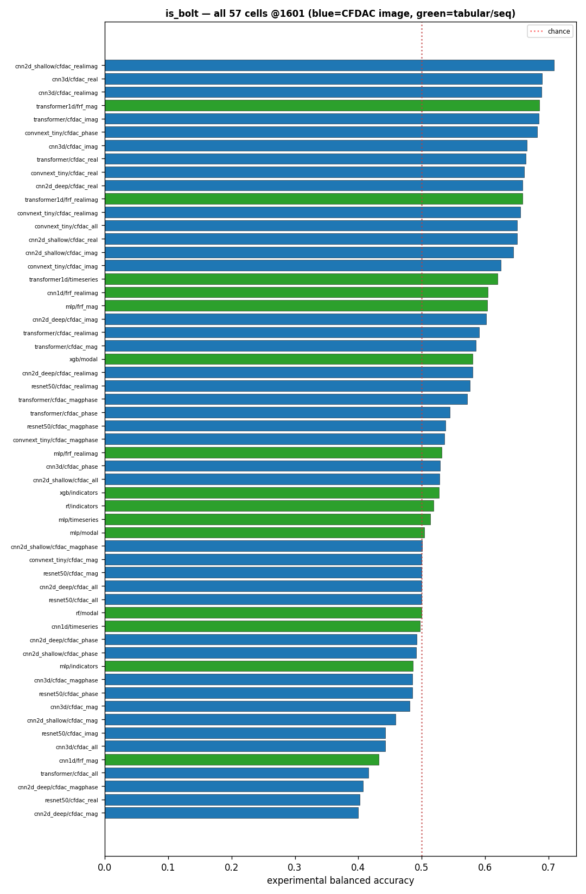

| model / feature | in-domain mF1 | exp bal-acc | exp macro-F1 | collapse |
|---|---|---|---|---|
| `cnn2d_shallow/cfdac_realimag` | 0.92 | 0.708 | 0.703 |  |
| `cnn3d/cfdac_real` | 0.92 | 0.690 | 0.679 |  |
| `cnn3d/cfdac_realimag` | 0.92 | 0.688 | 0.684 |  |
| `transformer1d/frf_mag` | 0.92 | 0.685 | 0.678 |  |
| `transformer/cfdac_imag` | 0.92 | 0.684 | 0.672 |  |
| `convnext_tiny/cfdac_phase` | 0.93 | 0.682 | 0.664 |  |
| `cnn3d/cfdac_imag` | 0.91 | 0.666 | 0.665 |  |
| `transformer/cfdac_real` | 0.93 | 0.663 | 0.649 |  |
| `convnext_tiny/cfdac_real` | 0.90 | 0.661 | 0.656 |  |
| `cnn2d_deep/cfdac_real` | 0.90 | 0.659 | 0.651 |  |
| `transformer1d/frf_realimag` | 0.93 | 0.658 | 0.642 |  |
| `convnext_tiny/cfdac_realimag` | 0.91 | 0.656 | 0.654 |  |
| `convnext_tiny/cfdac_all` | 0.92 | 0.650 | 0.650 |  |
| `cnn2d_shallow/cfdac_real` | 0.93 | 0.650 | 0.637 |  |
| `cnn2d_shallow/cfdac_imag` | 0.90 | 0.644 | 0.618 |  |
| `convnext_tiny/cfdac_imag` | 0.92 | 0.625 | 0.599 |  |
| `transformer1d/timeseries` | 0.90 | 0.620 | 0.599 |  |
| `cnn1d/frf_realimag` | 0.89 | 0.604 | 0.600 |  |
| `mlp/frf_mag` | 0.92 | 0.603 | 0.546 |  |
| `cnn2d_deep/cfdac_imag` | 0.91 | 0.602 | 0.555 |  |
| `transformer/cfdac_realimag` | 0.93 | 0.590 | 0.539 |  |
| `transformer/cfdac_mag` | 0.89 | 0.585 | 0.528 |  |
| `xgb/modal` | 0.94 | 0.580 | 0.541 |  |
| `cnn2d_deep/cfdac_realimag` | 0.93 | 0.580 | 0.519 |  |
| `resnet50/cfdac_realimag` | 0.91 | 0.576 | 0.508 |  |
| `transformer/cfdac_magphase` | 0.92 | 0.571 | 0.567 |  |
| `transformer/cfdac_phase` | 0.91 | 0.544 | 0.539 |  |
| `resnet50/cfdac_magphase` | 0.92 | 0.537 | 0.523 |  |
| `convnext_tiny/cfdac_magphase` | 0.93 | 0.535 | 0.406 |  |
| `mlp/frf_realimag` | 0.93 | 0.531 | 0.436 |  |
| `cnn3d/cfdac_phase` | 0.91 | 0.529 | 0.523 |  |
| `cnn2d_shallow/cfdac_all` | 0.93 | 0.528 | 0.505 |  |
| `xgb/indicators` | 0.93 | 0.527 | 0.510 |  |
| `rf/indicators` | 0.93 | 0.518 | 0.497 | yes |
| `mlp/timeseries` | 0.91 | 0.513 | 0.465 | yes |
| `mlp/modal` | 0.91 | 0.504 | 0.345 | yes |
| `cnn2d_shallow/cfdac_magphase` | 0.92 | 0.500 | 0.346 | yes |
| `rf/modal` | 0.94 | 0.500 | 0.330 | yes |
| `resnet50/cfdac_all` | 0.90 | 0.500 | 0.337 | yes |
| `cnn2d_deep/cfdac_all` | 0.92 | 0.500 | 0.337 | yes |
| `resnet50/cfdac_mag` | 0.91 | 0.500 | 0.337 | yes |
| `convnext_tiny/cfdac_mag` | 0.44 | 0.500 | 0.330 | yes |
| `cnn1d/timeseries` | 0.91 | 0.497 | 0.360 | yes |
| `cnn2d_deep/cfdac_phase` | 0.92 | 0.492 | 0.335 | yes |
| `cnn2d_shallow/cfdac_phase` | 0.91 | 0.491 | 0.341 | yes |
| `mlp/indicators` | 0.93 | 0.486 | 0.449 | yes |
| `cnn3d/cfdac_magphase` | 0.91 | 0.485 | 0.454 | yes |
| `resnet50/cfdac_phase` | 0.92 | 0.485 | 0.334 | yes |
| `cnn3d/cfdac_mag` | 0.91 | 0.481 | 0.459 | yes |
| `cnn2d_shallow/cfdac_mag` | 0.94 | 0.459 | 0.346 | yes |
| `resnet50/cfdac_imag` | 0.90 | 0.443 | 0.363 | yes |
| `cnn3d/cfdac_all` | 0.91 | 0.442 | 0.403 | yes |
| `cnn1d/frf_mag` | 0.94 | 0.432 | 0.421 | yes |
| `transformer/cfdac_all` | 0.92 | 0.416 | 0.332 | yes |
| `cnn2d_deep/cfdac_magphase` | 0.93 | 0.407 | 0.337 | yes |
| `resnet50/cfdac_real` | 0.91 | 0.402 | 0.339 | yes |
| `cnn2d_deep/cfdac_mag` | 0.93 | 0.399 | 0.315 | yes |

**Best:** `cnn2d_shallow/cfdac_realimag` — exp balanced-acc **0.708** (macro-F1 0.703; in-domain 0.92). 26/57 cells clear chance+0.05; 24 collapse to one class. On real data it recovers **59% of true positives** (sensitivity) at **83% specificity**; threshold-free **AUC = 0.681**.

### is_crack
**Question.** Crack present? (one-vs-rest)  **Output.** ŷ∈{0,1}  **Chance.** 0.50.  Severity = crack depth.
**Cells:** 57.

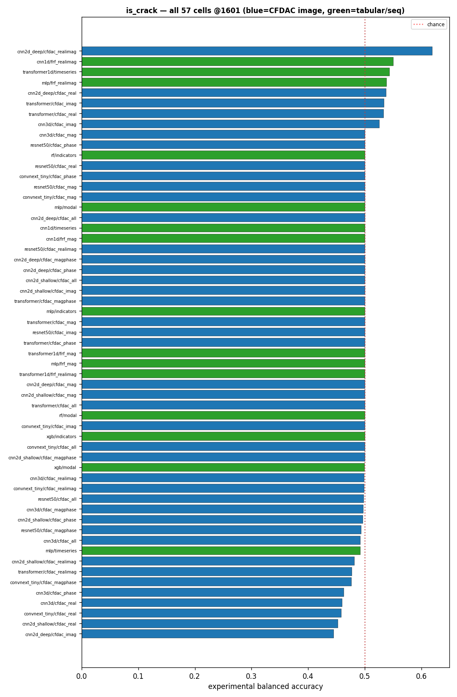

| model / feature | in-domain mF1 | exp bal-acc | exp macro-F1 | collapse |
|---|---|---|---|---|
| `cnn2d_deep/cfdac_realimag` | 0.59 | 0.618 | 0.609 |  |
| `cnn1d/frf_realimag` | 0.76 | 0.550 | 0.553 |  |
| `transformer1d/timeseries` | 0.70 | 0.544 | 0.551 |  |
| `mlp/frf_realimag` | 0.75 | 0.538 | 0.544 |  |
| `cnn2d_deep/cfdac_real` | 0.57 | 0.537 | 0.536 |  |
| `transformer/cfdac_imag` | 0.60 | 0.534 | 0.537 |  |
| `transformer/cfdac_real` | 0.56 | 0.533 | 0.533 |  |
| `cnn3d/cfdac_imag` | 0.78 | 0.526 | 0.528 |  |
| `convnext_tiny/cfdac_all` | 0.45 | 0.500 | 0.468 | yes |
| `xgb/indicators` | 0.74 | 0.500 | 0.468 | yes |
| `convnext_tiny/cfdac_imag` | 0.45 | 0.500 | 0.468 | yes |
| `rf/modal` | 0.74 | 0.500 | 0.468 | yes |
| `transformer/cfdac_all` | 0.73 | 0.500 | 0.468 | yes |
| `cnn2d_shallow/cfdac_mag` | 0.58 | 0.500 | 0.468 | yes |
| `cnn2d_deep/cfdac_mag` | 0.45 | 0.500 | 0.468 | yes |
| `transformer1d/frf_realimag` | 0.58 | 0.500 | 0.468 | yes |
| `mlp/frf_mag` | 0.80 | 0.500 | 0.468 | yes |
| `transformer1d/frf_mag` | 0.45 | 0.500 | 0.468 | yes |
| `transformer/cfdac_phase` | 0.75 | 0.500 | 0.468 | yes |
| `resnet50/cfdac_imag` | 0.78 | 0.500 | 0.468 | yes |
| `transformer/cfdac_mag` | 0.49 | 0.500 | 0.468 | yes |
| `mlp/indicators` | 0.69 | 0.500 | 0.468 | yes |
| `transformer/cfdac_magphase` | 0.73 | 0.500 | 0.468 | yes |
| `cnn2d_shallow/cfdac_imag` | 0.78 | 0.500 | 0.468 | yes |
| `cnn2d_shallow/cfdac_all` | 0.77 | 0.500 | 0.468 | yes |
| `cnn2d_deep/cfdac_phase` | 0.74 | 0.500 | 0.468 | yes |
| `cnn2d_deep/cfdac_magphase` | 0.74 | 0.500 | 0.468 | yes |
| `resnet50/cfdac_realimag` | 0.79 | 0.500 | 0.468 | yes |
| `cnn1d/frf_mag` | 0.57 | 0.500 | 0.468 | yes |
| `cnn1d/timeseries` | 0.57 | 0.500 | 0.468 | yes |
| `cnn2d_deep/cfdac_all` | 0.69 | 0.500 | 0.468 | yes |
| `mlp/modal` | 0.71 | 0.500 | 0.468 | yes |
| `convnext_tiny/cfdac_mag` | 0.45 | 0.500 | 0.468 | yes |
| `resnet50/cfdac_mag` | 0.67 | 0.500 | 0.468 | yes |
| `convnext_tiny/cfdac_phase` | 0.45 | 0.500 | 0.468 | yes |
| `resnet50/cfdac_real` | 0.76 | 0.500 | 0.468 | yes |
| `rf/indicators` | 0.74 | 0.500 | 0.468 | yes |
| `resnet50/cfdac_phase` | 0.74 | 0.500 | 0.468 | yes |
| `cnn3d/cfdac_mag` | 0.53 | 0.500 | 0.468 | yes |
| `cnn2d_shallow/cfdac_magphase` | 0.76 | 0.500 | 0.468 | yes |
| `xgb/modal` | 0.76 | 0.499 | 0.467 | yes |
| `convnext_tiny/cfdac_realimag` | 0.50 | 0.498 | 0.467 | yes |
| `cnn3d/cfdac_realimag` | 0.70 | 0.498 | 0.467 | yes |
| `resnet50/cfdac_all` | 0.74 | 0.498 | 0.469 | yes |
| `cnn3d/cfdac_magphase` | 0.75 | 0.497 | 0.466 | yes |
| `cnn2d_shallow/cfdac_phase` | 0.75 | 0.496 | 0.466 | yes |
| `resnet50/cfdac_magphase` | 0.75 | 0.493 | 0.466 | yes |
| `cnn3d/cfdac_all` | 0.75 | 0.492 | 0.464 | yes |
| `mlp/timeseries` | 0.72 | 0.491 | 0.463 | yes |
| `cnn2d_shallow/cfdac_realimag` | 0.76 | 0.481 | 0.458 | yes |
| `transformer/cfdac_realimag` | 0.62 | 0.477 | 0.457 | yes |
| `convnext_tiny/cfdac_magphase` | 0.76 | 0.476 | 0.473 | yes |
| `cnn3d/cfdac_phase` | 0.76 | 0.463 | 0.450 | yes |
| `cnn3d/cfdac_real` | 0.59 | 0.459 | 0.447 | yes |
| `convnext_tiny/cfdac_real` | 0.53 | 0.458 | 0.457 | yes |
| `cnn2d_shallow/cfdac_real` | 0.76 | 0.452 | 0.452 | yes |
| `cnn2d_deep/cfdac_imag` | 0.59 | 0.445 | 0.374 | yes |

**Best:** `cnn2d_deep/cfdac_realimag` — exp balanced-acc **0.618** (macro-F1 0.609; in-domain 0.59). 1/57 cells clear chance+0.05; 49 collapse to one class. On real data it recovers **35% of true positives** (sensitivity) at **88% specificity**; threshold-free **AUC = 0.784**; the AUC sitting above the fixed-threshold balanced-accuracy says the *ranking* is better than the default 0.5 cut — the decision threshold is miscalibrated by the domain shift and could be retuned on a few real samples.

### is_hole
**Question.** Hole present? (one-vs-rest)  **Output.** ŷ∈{0,1}  **Chance.** 0.50.  Severity = hole diameter, 1–6 mm (narrow).
**Cells:** 57.

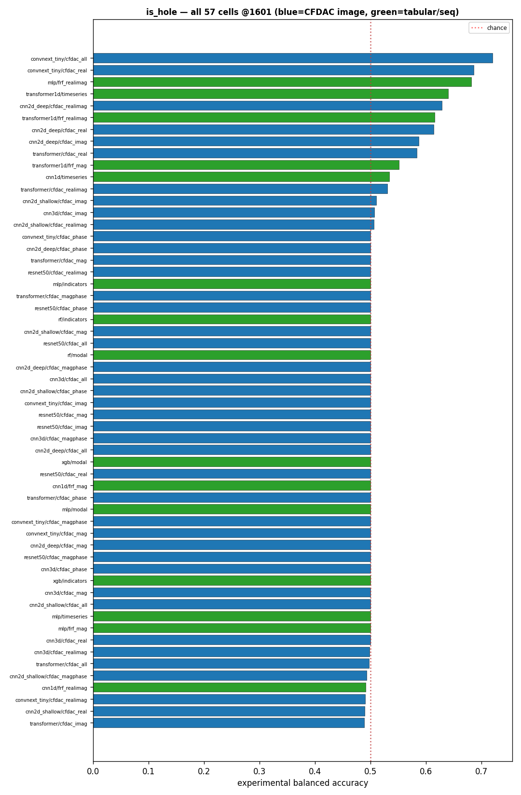

| model / feature | in-domain mF1 | exp bal-acc | exp macro-F1 | collapse |
|---|---|---|---|---|
| `convnext_tiny/cfdac_all` | 0.60 | 0.720 | 0.631 |  |
| `convnext_tiny/cfdac_real` | 0.53 | 0.687 | 0.642 |  |
| `mlp/frf_realimag` | 0.71 | 0.682 | 0.555 |  |
| `transformer1d/timeseries` | 0.60 | 0.640 | 0.576 |  |
| `cnn2d_deep/cfdac_realimag` | 0.82 | 0.629 | 0.569 |  |
| `transformer1d/frf_realimag` | 0.62 | 0.616 | 0.568 |  |
| `cnn2d_deep/cfdac_real` | 0.56 | 0.614 | 0.578 |  |
| `cnn2d_deep/cfdac_imag` | 0.58 | 0.587 | 0.562 |  |
| `transformer/cfdac_real` | 0.62 | 0.583 | 0.577 |  |
| `transformer1d/frf_mag` | 0.49 | 0.552 | 0.561 |  |
| `cnn1d/timeseries` | 0.52 | 0.535 | 0.540 |  |
| `transformer/cfdac_realimag` | 0.59 | 0.531 | 0.531 |  |
| `cnn2d_shallow/cfdac_imag` | 0.83 | 0.511 | 0.494 | yes |
| `cnn3d/cfdac_imag` | 0.60 | 0.507 | 0.486 | yes |
| `cnn2d_shallow/cfdac_realimag` | 0.75 | 0.506 | 0.499 | yes |
| `cnn3d/cfdac_real` | 0.63 | 0.500 | 0.472 | yes |
| `mlp/frf_mag` | 0.64 | 0.500 | 0.472 | yes |
| `mlp/timeseries` | 0.72 | 0.500 | 0.472 | yes |
| `cnn2d_shallow/cfdac_all` | 0.72 | 0.500 | 0.472 | yes |
| `cnn3d/cfdac_mag` | 0.58 | 0.500 | 0.472 | yes |
| `xgb/indicators` | 0.62 | 0.500 | 0.472 | yes |
| `cnn3d/cfdac_phase` | 0.69 | 0.500 | 0.472 | yes |
| `resnet50/cfdac_magphase` | 0.75 | 0.500 | 0.472 | yes |
| `cnn2d_deep/cfdac_mag` | 0.49 | 0.500 | 0.472 | yes |
| `convnext_tiny/cfdac_mag` | 0.44 | 0.500 | 0.472 | yes |
| `convnext_tiny/cfdac_magphase` | 0.70 | 0.500 | 0.472 | yes |
| `mlp/modal` | 0.66 | 0.500 | 0.472 | yes |
| `transformer/cfdac_phase` | 0.70 | 0.500 | 0.472 | yes |
| `cnn1d/frf_mag` | 0.62 | 0.500 | 0.472 | yes |
| `resnet50/cfdac_real` | 0.72 | 0.500 | 0.472 | yes |
| `xgb/modal` | 0.69 | 0.500 | 0.472 | yes |
| `cnn2d_deep/cfdac_all` | 0.69 | 0.500 | 0.472 | yes |
| `cnn3d/cfdac_magphase` | 0.71 | 0.500 | 0.472 | yes |
| `resnet50/cfdac_imag` | 0.77 | 0.500 | 0.472 | yes |
| `resnet50/cfdac_mag` | 0.59 | 0.500 | 0.472 | yes |
| `convnext_tiny/cfdac_imag` | 0.44 | 0.500 | 0.472 | yes |
| `cnn2d_shallow/cfdac_phase` | 0.72 | 0.500 | 0.472 | yes |
| `cnn3d/cfdac_all` | 0.73 | 0.500 | 0.472 | yes |
| `cnn2d_deep/cfdac_magphase` | 0.71 | 0.500 | 0.472 | yes |
| `rf/modal` | 0.58 | 0.500 | 0.472 | yes |
| `resnet50/cfdac_all` | 0.72 | 0.500 | 0.472 | yes |
| `cnn2d_shallow/cfdac_mag` | 0.57 | 0.500 | 0.472 | yes |
| `rf/indicators` | 0.61 | 0.500 | 0.472 | yes |
| `resnet50/cfdac_phase` | 0.67 | 0.500 | 0.472 | yes |
| `transformer/cfdac_magphase` | 0.73 | 0.500 | 0.472 | yes |
| `mlp/indicators` | 0.59 | 0.500 | 0.472 | yes |
| `resnet50/cfdac_realimag` | 0.73 | 0.500 | 0.472 | yes |
| `transformer/cfdac_mag` | 0.54 | 0.500 | 0.472 | yes |
| `cnn2d_deep/cfdac_phase` | 0.70 | 0.500 | 0.472 | yes |
| `convnext_tiny/cfdac_phase` | 0.55 | 0.500 | 0.472 | yes |
| `cnn3d/cfdac_realimag` | 0.61 | 0.499 | 0.471 | yes |
| `transformer/cfdac_all` | 0.70 | 0.497 | 0.471 | yes |
| `cnn2d_shallow/cfdac_magphase` | 0.71 | 0.493 | 0.468 | yes |
| `cnn1d/frf_realimag` | 0.61 | 0.492 | 0.468 | yes |
| `convnext_tiny/cfdac_realimag` | 0.80 | 0.491 | 0.467 | yes |
| `cnn2d_shallow/cfdac_real` | 0.76 | 0.490 | 0.469 | yes |
| `transformer/cfdac_imag` | 0.62 | 0.489 | 0.472 | yes |

**Best:** `convnext_tiny/cfdac_all` — exp balanced-acc **0.720** (macro-F1 0.631; in-domain 0.60). 10/57 cells clear chance+0.05; 45 collapse to one class. On real data it recovers **63% of true positives** (sensitivity) at **81% specificity**; threshold-free **AUC = 0.701**.

### is_mass
**Question.** Added mass present? (one-vs-rest)  **Output.** ŷ∈{0,1}  **Chance.** 0.50.  Severity near-discrete.
**Cells:** 57.

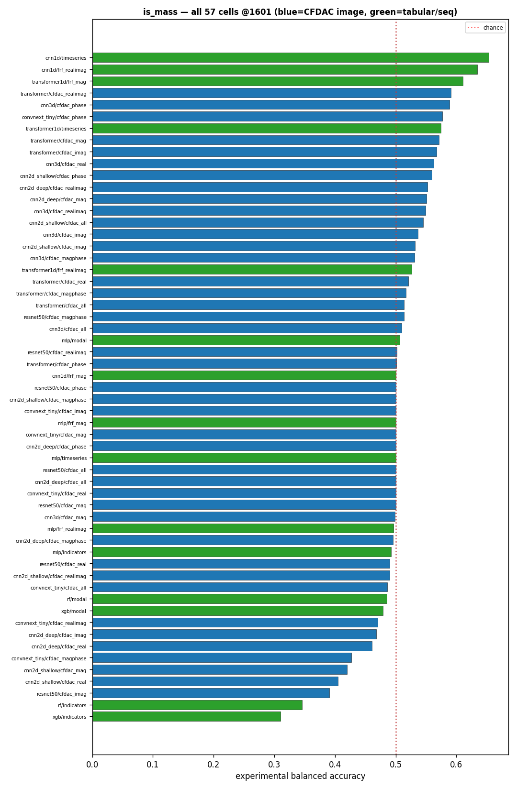

| model / feature | in-domain mF1 | exp bal-acc | exp macro-F1 | collapse |
|---|---|---|---|---|
| `cnn1d/timeseries` | 0.93 | 0.653 | 0.358 |  |
| `cnn1d/frf_realimag` | 0.92 | 0.634 | 0.567 |  |
| `transformer1d/frf_mag` | 0.90 | 0.611 | 0.536 |  |
| `transformer/cfdac_realimag` | 0.96 | 0.591 | 0.515 |  |
| `cnn3d/cfdac_phase` | 0.95 | 0.589 | 0.302 |  |
| `convnext_tiny/cfdac_phase` | 0.95 | 0.577 | 0.433 |  |
| `transformer1d/timeseries` | 0.94 | 0.575 | 0.481 |  |
| `transformer/cfdac_mag` | 0.90 | 0.571 | 0.219 |  |
| `transformer/cfdac_imag` | 0.96 | 0.568 | 0.395 |  |
| `cnn3d/cfdac_real` | 0.95 | 0.562 | 0.505 |  |
| `cnn2d_shallow/cfdac_phase` | 0.95 | 0.559 | 0.198 |  |
| `cnn2d_deep/cfdac_realimag` | 0.94 | 0.552 | 0.456 |  |
| `cnn2d_deep/cfdac_mag` | 0.88 | 0.551 | 0.182 |  |
| `cnn3d/cfdac_realimag` | 0.96 | 0.549 | 0.349 |  |
| `cnn2d_shallow/cfdac_all` | 0.97 | 0.546 | 0.372 |  |
| `cnn3d/cfdac_imag` | 0.95 | 0.536 | 0.413 |  |
| `cnn2d_shallow/cfdac_imag` | 0.96 | 0.532 | 0.533 |  |
| `cnn3d/cfdac_magphase` | 0.95 | 0.531 | 0.293 |  |
| `transformer1d/frf_realimag` | 0.94 | 0.527 | 0.414 |  |
| `transformer/cfdac_real` | 0.96 | 0.521 | 0.406 |  |
| `transformer/cfdac_magphase` | 0.96 | 0.517 | 0.117 | yes |
| `transformer/cfdac_all` | 0.94 | 0.514 | 0.111 | yes |
| `resnet50/cfdac_magphase` | 0.95 | 0.514 | 0.458 | yes |
| `cnn3d/cfdac_all` | 0.95 | 0.509 | 0.456 | yes |
| `mlp/modal` | 0.97 | 0.506 | 0.096 | yes |
| `resnet50/cfdac_realimag` | 0.96 | 0.502 | 0.283 | yes |
| `transformer/cfdac_phase` | 0.95 | 0.501 | 0.086 | yes |
| `cnn1d/frf_mag` | 0.98 | 0.501 | 0.084 | yes |
| `resnet50/cfdac_phase` | 0.94 | 0.500 | 0.084 | yes |
| `cnn2d_shallow/cfdac_magphase` | 0.94 | 0.500 | 0.485 | yes |
| `resnet50/cfdac_mag` | 0.91 | 0.500 | 0.083 | yes |
| `convnext_tiny/cfdac_real` | 0.44 | 0.500 | 0.476 | yes |
| `cnn2d_deep/cfdac_all` | 0.96 | 0.500 | 0.083 | yes |
| `resnet50/cfdac_all` | 0.96 | 0.500 | 0.083 | yes |
| `mlp/timeseries` | 0.96 | 0.500 | 0.083 | yes |
| `cnn2d_deep/cfdac_phase` | 0.96 | 0.500 | 0.083 | yes |
| `convnext_tiny/cfdac_mag` | 0.44 | 0.500 | 0.476 | yes |
| `mlp/frf_mag` | 0.96 | 0.500 | 0.083 | yes |
| `convnext_tiny/cfdac_imag` | 0.44 | 0.500 | 0.476 | yes |
| `cnn3d/cfdac_mag` | 0.89 | 0.499 | 0.476 | yes |
| `mlp/frf_realimag` | 0.97 | 0.497 | 0.100 | yes |
| `cnn2d_deep/cfdac_magphase` | 0.96 | 0.496 | 0.158 | yes |
| `mlp/indicators` | 0.96 | 0.492 | 0.095 | yes |
| `resnet50/cfdac_real` | 0.93 | 0.490 | 0.103 | yes |
| `cnn2d_shallow/cfdac_realimag` | 0.96 | 0.490 | 0.367 | yes |
| `convnext_tiny/cfdac_all` | 0.95 | 0.486 | 0.239 | yes |
| `rf/modal` | 0.97 | 0.485 | 0.469 | yes |
| `xgb/modal` | 0.97 | 0.479 | 0.469 | yes |
| `convnext_tiny/cfdac_realimag` | 0.94 | 0.470 | 0.330 | yes |
| `cnn2d_deep/cfdac_imag` | 0.97 | 0.468 | 0.358 | yes |
| `cnn2d_deep/cfdac_real` | 0.95 | 0.461 | 0.349 | yes |
| `convnext_tiny/cfdac_magphase` | 0.95 | 0.427 | 0.111 | yes |
| `cnn2d_shallow/cfdac_mag` | 0.88 | 0.420 | 0.433 | yes |
| `cnn2d_shallow/cfdac_real` | 0.97 | 0.405 | 0.368 | yes |
| `resnet50/cfdac_imag` | 0.97 | 0.391 | 0.415 | yes |
| `rf/indicators` | 0.92 | 0.346 | 0.308 | yes |
| `xgb/indicators` | 0.93 | 0.310 | 0.289 | yes |

**Best:** `cnn1d/timeseries` — exp balanced-acc **0.653** (macro-F1 0.358; in-domain 0.93). 13/57 cells clear chance+0.05; 37 collapse to one class. On real data it recovers **98% of true positives** (sensitivity) at **33% specificity**; threshold-free **AUC = 0.770**; the AUC sitting above the fixed-threshold balanced-accuracy says the *ranking* is better than the default 0.5 cut — the decision threshold is miscalibrated by the domain shift and could be retuned on a few real samples.

### type
**Question.** Damage type (5-class)  **Output.** pristine/bolt/crack/hole/mass  **Chance.** 0.20.
**Cells:** 57.

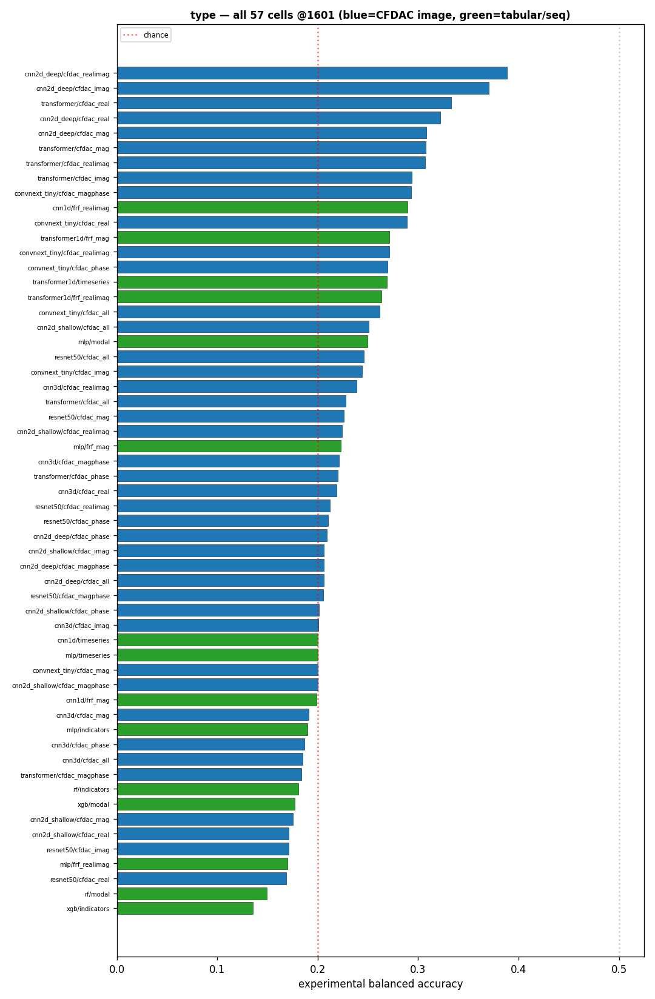

| model / feature | in-domain mF1 | exp bal-acc | exp macro-F1 | collapse |
|---|---|---|---|---|
| `cnn2d_deep/cfdac_realimag` | 0.81 | 0.388 | 0.264 |  |
| `cnn2d_deep/cfdac_imag` | 0.84 | 0.370 | 0.252 |  |
| `transformer/cfdac_real` | 0.85 | 0.333 | 0.284 |  |
| `cnn2d_deep/cfdac_real` | 0.81 | 0.322 | 0.204 |  |
| `cnn2d_deep/cfdac_mag` | 0.80 | 0.308 | 0.230 |  |
| `transformer/cfdac_mag` | 0.69 | 0.308 | 0.203 |  |
| `transformer/cfdac_realimag` | 0.82 | 0.307 | 0.262 |  |
| `transformer/cfdac_imag` | 0.82 | 0.293 | 0.242 |  |
| `convnext_tiny/cfdac_magphase` | 0.83 | 0.293 | 0.223 |  |
| `cnn1d/frf_realimag` | 0.79 | 0.290 | 0.201 |  |
| `convnext_tiny/cfdac_real` | 0.82 | 0.289 | 0.216 |  |
| `transformer1d/frf_mag` | 0.83 | 0.272 | 0.225 |  |
| `convnext_tiny/cfdac_realimag` | 0.83 | 0.271 | 0.210 |  |
| `convnext_tiny/cfdac_phase` | 0.81 | 0.269 | 0.212 |  |
| `transformer1d/timeseries` | 0.83 | 0.269 | 0.221 |  |
| `transformer1d/frf_realimag` | 0.82 | 0.263 | 0.219 |  |
| `convnext_tiny/cfdac_all` | 0.82 | 0.262 | 0.145 |  |
| `cnn2d_shallow/cfdac_all` | 0.80 | 0.251 | 0.126 |  |
| `mlp/modal` | 0.78 | 0.249 | 0.118 |  |
| `resnet50/cfdac_all` | 0.77 | 0.246 | 0.165 |  |
| `convnext_tiny/cfdac_imag` | 0.82 | 0.244 | 0.174 |  |
| `cnn3d/cfdac_realimag` | 0.77 | 0.239 | 0.167 |  |
| `transformer/cfdac_all` | 0.79 | 0.228 | 0.127 |  |
| `resnet50/cfdac_mag` | 0.74 | 0.226 | 0.157 |  |
| `cnn2d_shallow/cfdac_realimag` | 0.80 | 0.225 | 0.139 |  |
| `mlp/frf_mag` | 0.84 | 0.223 | 0.076 |  |
| `cnn3d/cfdac_magphase` | 0.76 | 0.221 | 0.073 |  |
| `transformer/cfdac_phase` | 0.76 | 0.220 | 0.131 | yes |
| `cnn3d/cfdac_real` | 0.75 | 0.219 | 0.154 | yes |
| `resnet50/cfdac_realimag` | 0.80 | 0.212 | 0.153 | yes |
| `resnet50/cfdac_phase` | 0.79 | 0.210 | 0.062 | yes |
| `cnn2d_deep/cfdac_phase` | 0.76 | 0.209 | 0.156 | yes |
| `cnn2d_shallow/cfdac_imag` | 0.83 | 0.206 | 0.162 | yes |
| `cnn2d_deep/cfdac_magphase` | 0.77 | 0.206 | 0.148 | yes |
| `cnn2d_deep/cfdac_all` | 0.78 | 0.206 | 0.045 | yes |
| `resnet50/cfdac_magphase` | 0.76 | 0.205 | 0.174 | yes |
| `cnn2d_shallow/cfdac_phase` | 0.78 | 0.201 | 0.156 | yes |
| `cnn3d/cfdac_imag` | 0.78 | 0.200 | 0.141 | yes |
| `cnn1d/timeseries` | 0.80 | 0.200 | 0.034 | yes |
| `cnn2d_shallow/cfdac_magphase` | 0.78 | 0.200 | 0.033 | yes |
| `convnext_tiny/cfdac_mag` | 0.07 | 0.200 | 0.033 | yes |
| `mlp/timeseries` | 0.77 | 0.200 | 0.033 | yes |
| `cnn1d/frf_mag` | 0.83 | 0.199 | 0.109 | yes |
| `cnn3d/cfdac_mag` | 0.70 | 0.191 | 0.142 | yes |
| `mlp/indicators` | 0.73 | 0.190 | 0.042 | yes |
| `cnn3d/cfdac_phase` | 0.77 | 0.187 | 0.140 | yes |
| `cnn3d/cfdac_all` | 0.77 | 0.185 | 0.106 | yes |
| `transformer/cfdac_magphase` | 0.80 | 0.184 | 0.134 | yes |
| `rf/indicators` | 0.72 | 0.181 | 0.116 | yes |
| `xgb/modal` | 0.78 | 0.177 | 0.139 | yes |
| `cnn2d_shallow/cfdac_mag` | 0.78 | 0.175 | 0.124 | yes |
| `cnn2d_shallow/cfdac_real` | 0.80 | 0.171 | 0.156 | yes |
| `resnet50/cfdac_imag` | 0.80 | 0.171 | 0.121 | yes |
| `mlp/frf_realimag` | 0.81 | 0.170 | 0.079 | yes |
| `resnet50/cfdac_real` | 0.77 | 0.169 | 0.119 | yes |
| `rf/modal` | 0.75 | 0.149 | 0.118 | yes |
| `xgb/indicators` | 0.71 | 0.136 | 0.110 | yes |

**Best:** `cnn2d_deep/cfdac_realimag` — exp balanced-acc **0.388** (macro-F1 0.264; in-domain 0.81). 18/57 cells clear chance+0.05; 30 collapse to one class.

### col_location
**Question.** Column location of damage (6-class)  **Output.** storey×end  **Chance.** 0.17.  BD/AD near-degenerate in the linear ROM.
**Cells:** 57.

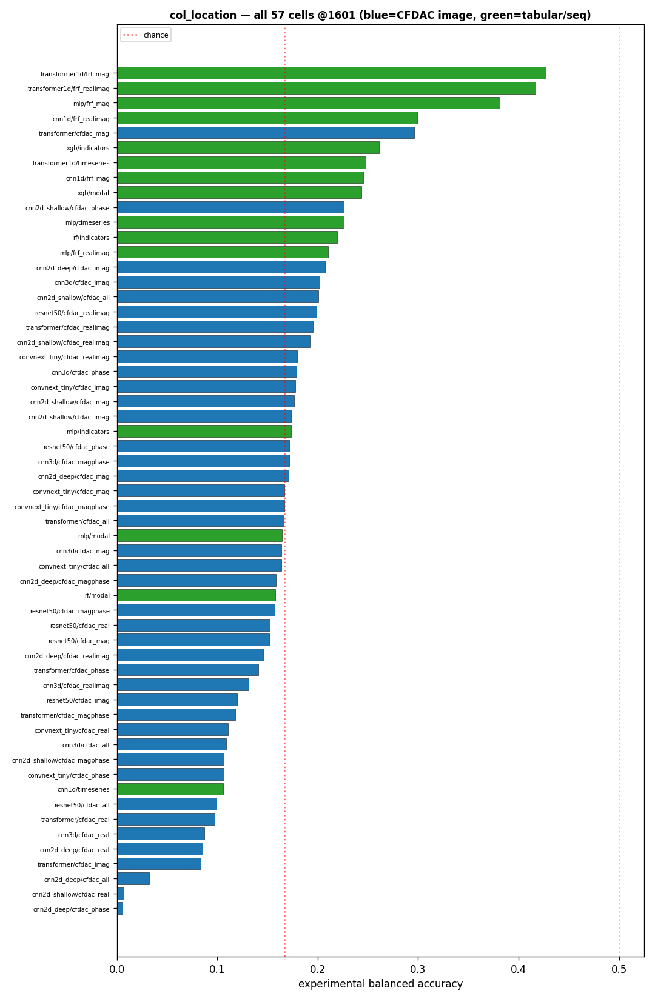

| model / feature | in-domain mF1 | exp bal-acc | exp macro-F1 | collapse |
|---|---|---|---|---|
| `transformer1d/frf_mag` | 0.48 | 0.427 | 0.301 |  |
| `transformer1d/frf_realimag` | 0.49 | 0.417 | 0.221 |  |
| `mlp/frf_mag` | 0.49 | 0.381 | 0.232 |  |
| `cnn1d/frf_realimag` | 0.47 | 0.299 | 0.176 |  |
| `transformer/cfdac_mag` | 0.48 | 0.296 | 0.153 |  |
| `xgb/indicators` | 0.48 | 0.261 | 0.114 |  |
| `transformer1d/timeseries` | 0.44 | 0.248 | 0.178 |  |
| `cnn1d/frf_mag` | 0.46 | 0.245 | 0.093 |  |
| `xgb/modal` | 0.51 | 0.243 | 0.151 |  |
| `cnn2d_shallow/cfdac_phase` | 0.49 | 0.226 | 0.092 |  |
| `mlp/timeseries` | 0.48 | 0.226 | 0.048 |  |
| `rf/indicators` | 0.46 | 0.220 | 0.093 |  |
| `mlp/frf_realimag` | 0.53 | 0.211 | 0.174 |  |
| `cnn2d_deep/cfdac_imag` | 0.46 | 0.207 | 0.069 |  |
| `cnn3d/cfdac_imag` | 0.49 | 0.202 | 0.052 |  |
| `cnn2d_shallow/cfdac_all` | 0.50 | 0.201 | 0.069 |  |
| `resnet50/cfdac_realimag` | 0.50 | 0.199 | 0.058 |  |
| `transformer/cfdac_realimag` | 0.44 | 0.196 | 0.055 |  |
| `cnn2d_shallow/cfdac_realimag` | 0.50 | 0.192 | 0.057 |  |
| `convnext_tiny/cfdac_realimag` | 0.44 | 0.180 | 0.156 | yes |
| `cnn3d/cfdac_phase` | 0.49 | 0.179 | 0.152 | yes |
| `convnext_tiny/cfdac_imag` | 0.45 | 0.178 | 0.044 | yes |
| `cnn2d_shallow/cfdac_mag` | 0.45 | 0.177 | 0.141 | yes |
| `cnn2d_shallow/cfdac_imag` | 0.47 | 0.173 | 0.017 | yes |
| `mlp/indicators` | 0.49 | 0.173 | 0.085 | yes |
| `resnet50/cfdac_phase` | 0.51 | 0.172 | 0.114 | yes |
| `cnn3d/cfdac_magphase` | 0.49 | 0.172 | 0.018 | yes |
| `cnn2d_deep/cfdac_mag` | 0.38 | 0.171 | 0.130 | yes |
| `convnext_tiny/cfdac_magphase` | 0.05 | 0.167 | 0.087 | yes |
| `convnext_tiny/cfdac_mag` | 0.05 | 0.167 | 0.007 | yes |
| `transformer/cfdac_all` | 0.48 | 0.166 | 0.094 | yes |
| `mlp/modal` | 0.49 | 0.164 | 0.104 | yes |
| `cnn3d/cfdac_mag` | 0.48 | 0.164 | 0.104 | yes |
| `convnext_tiny/cfdac_all` | 0.48 | 0.164 | 0.149 | yes |
| `cnn2d_deep/cfdac_magphase` | 0.46 | 0.158 | 0.089 | yes |
| `rf/modal` | 0.48 | 0.158 | 0.097 | yes |
| `resnet50/cfdac_magphase` | 0.50 | 0.157 | 0.093 | yes |
| `resnet50/cfdac_real` | 0.49 | 0.152 | 0.121 | yes |
| `resnet50/cfdac_mag` | 0.49 | 0.152 | 0.056 | yes |
| `cnn2d_deep/cfdac_realimag` | 0.49 | 0.145 | 0.109 | yes |
| `transformer/cfdac_phase` | 0.47 | 0.141 | 0.098 | yes |
| `cnn3d/cfdac_realimag` | 0.46 | 0.131 | 0.113 | yes |
| `resnet50/cfdac_imag` | 0.49 | 0.120 | 0.102 | yes |
| `transformer/cfdac_magphase` | 0.49 | 0.118 | 0.107 | yes |
| `convnext_tiny/cfdac_real` | 0.50 | 0.111 | 0.133 | yes |
| `cnn3d/cfdac_all` | 0.54 | 0.109 | 0.108 | yes |
| `cnn2d_shallow/cfdac_magphase` | 0.50 | 0.107 | 0.080 | yes |
| `convnext_tiny/cfdac_phase` | 0.49 | 0.106 | 0.067 | yes |
| `cnn1d/timeseries` | 0.48 | 0.106 | 0.056 | yes |
| `resnet50/cfdac_all` | 0.49 | 0.099 | 0.066 | yes |
| `transformer/cfdac_real` | 0.41 | 0.097 | 0.090 | yes |
| `cnn3d/cfdac_real` | 0.43 | 0.087 | 0.059 | yes |
| `cnn2d_deep/cfdac_real` | 0.49 | 0.085 | 0.064 | yes |
| `transformer/cfdac_imag` | 0.41 | 0.083 | 0.063 | yes |
| `cnn2d_deep/cfdac_all` | 0.52 | 0.032 | 0.027 | yes |
| `cnn2d_shallow/cfdac_real` | 0.47 | 0.007 | 0.013 | yes |
| `cnn2d_deep/cfdac_phase` | 0.52 | 0.006 | 0.010 | yes |

**Best:** `transformer1d/frf_mag` — exp balanced-acc **0.427** (macro-F1 0.301; in-domain 0.48). 12/57 cells clear chance+0.05; 38 collapse to one class.

### mass_location
**Question.** Added-mass location (4-class)  **Output.** base/fl1/fl2/fl3  **Chance.** 0.25.
**Cells:** 57.

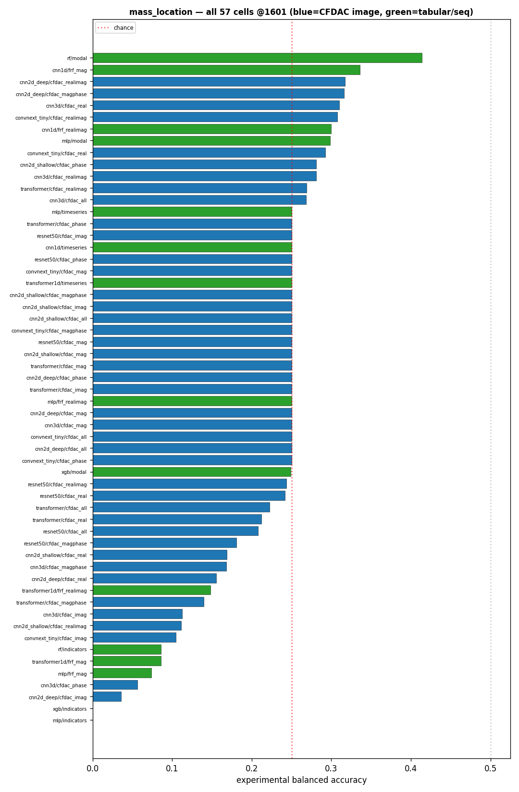

| model / feature | in-domain mF1 | exp bal-acc | exp macro-F1 | collapse |
|---|---|---|---|---|
| `rf/modal` | 0.99 | 0.414 | 0.236 |  |
| `cnn1d/frf_mag` | 0.99 | 0.336 | 0.208 |  |
| `cnn2d_deep/cfdac_realimag` | 1.00 | 0.317 | 0.201 |  |
| `cnn2d_deep/cfdac_magphase` | 0.99 | 0.316 | 0.193 |  |
| `cnn3d/cfdac_real` | 0.99 | 0.310 | 0.274 |  |
| `convnext_tiny/cfdac_realimag` | 0.99 | 0.308 | 0.272 |  |
| `cnn1d/frf_realimag` | 0.99 | 0.300 | 0.266 |  |
| `mlp/modal` | 0.99 | 0.299 | 0.178 |  |
| `convnext_tiny/cfdac_real` | 0.99 | 0.292 | 0.260 |  |
| `cnn3d/cfdac_realimag` | 0.99 | 0.281 | 0.179 |  |
| `cnn2d_shallow/cfdac_phase` | 0.99 | 0.281 | 0.130 |  |
| `transformer/cfdac_realimag` | 0.99 | 0.269 | 0.219 | yes |
| `cnn3d/cfdac_all` | 0.98 | 0.268 | 0.170 | yes |
| `convnext_tiny/cfdac_phase` | 0.99 | 0.250 | 0.102 | yes |
| `cnn2d_deep/cfdac_all` | 0.98 | 0.250 | 0.126 | yes |
| `convnext_tiny/cfdac_all` | 0.99 | 0.250 | 0.102 | yes |
| `cnn3d/cfdac_mag` | 0.97 | 0.250 | 0.118 | yes |
| `cnn2d_deep/cfdac_mag` | 0.98 | 0.250 | 0.118 | yes |
| `mlp/frf_realimag` | 0.99 | 0.250 | 0.102 | yes |
| `transformer/cfdac_imag` | 0.97 | 0.250 | 0.072 | yes |
| `cnn2d_deep/cfdac_phase` | 0.99 | 0.250 | 0.072 | yes |
| `transformer/cfdac_mag` | 0.97 | 0.250 | 0.118 | yes |
| `cnn2d_shallow/cfdac_mag` | 0.97 | 0.250 | 0.118 | yes |
| `resnet50/cfdac_mag` | 0.98 | 0.250 | 0.102 | yes |
| `convnext_tiny/cfdac_magphase` | 0.97 | 0.250 | 0.102 | yes |
| `cnn2d_shallow/cfdac_all` | 0.98 | 0.250 | 0.102 | yes |
| `cnn2d_shallow/cfdac_imag` | 0.98 | 0.250 | 0.072 | yes |
| `cnn2d_shallow/cfdac_magphase` | 0.99 | 0.250 | 0.118 | yes |
| `transformer1d/timeseries` | 0.92 | 0.250 | 0.078 | yes |
| `convnext_tiny/cfdac_mag` | 0.44 | 0.250 | 0.102 | yes |
| `resnet50/cfdac_phase` | 0.99 | 0.250 | 0.102 | yes |
| `cnn1d/timeseries` | 0.99 | 0.250 | 0.103 | yes |
| `resnet50/cfdac_imag` | 0.99 | 0.250 | 0.102 | yes |
| `transformer/cfdac_phase` | 0.98 | 0.250 | 0.072 | yes |
| `mlp/timeseries` | 0.98 | 0.250 | 0.102 | yes |
| `xgb/modal` | 0.98 | 0.249 | 0.082 | yes |
| `resnet50/cfdac_realimag` | 0.98 | 0.243 | 0.152 | yes |
| `resnet50/cfdac_real` | 0.98 | 0.242 | 0.108 | yes |
| `transformer/cfdac_all` | 0.99 | 0.223 | 0.202 | yes |
| `transformer/cfdac_real` | 0.99 | 0.212 | 0.187 | yes |
| `resnet50/cfdac_all` | 0.99 | 0.208 | 0.123 | yes |
| `resnet50/cfdac_magphase` | 0.98 | 0.181 | 0.123 | yes |
| `cnn2d_shallow/cfdac_real` | 0.99 | 0.169 | 0.133 | yes |
| `cnn3d/cfdac_magphase` | 0.98 | 0.168 | 0.083 | yes |
| `cnn2d_deep/cfdac_real` | 0.99 | 0.156 | 0.124 | yes |
| `transformer1d/frf_realimag` | 0.96 | 0.148 | 0.153 | yes |
| `transformer/cfdac_magphase` | 0.98 | 0.139 | 0.162 | yes |
| `cnn3d/cfdac_imag` | 0.99 | 0.113 | 0.045 | yes |
| `cnn2d_shallow/cfdac_realimag` | 0.99 | 0.111 | 0.099 | yes |
| `convnext_tiny/cfdac_imag` | 0.96 | 0.105 | 0.092 | yes |
| `transformer1d/frf_mag` | 0.99 | 0.086 | 0.080 | yes |
| `rf/indicators` | 0.98 | 0.086 | 0.069 | yes |
| `mlp/frf_mag` | 0.99 | 0.074 | 0.114 | yes |
| `cnn3d/cfdac_phase` | 0.99 | 0.056 | 0.037 | yes |
| `cnn2d_deep/cfdac_imag` | 0.99 | 0.036 | 0.043 | yes |
| `mlp/indicators` | 0.97 | 0.000 | 0.000 | yes |
| `xgb/indicators` | 0.97 | 0.000 | 0.000 | yes |

**Best:** `rf/modal` — exp balanced-acc **0.414** (macro-F1 0.236; in-domain 0.99). 6/57 cells clear chance+0.05; 46 collapse to one class.

### severity
**Question.** Damage severity (regression)  **Output.** ŷ∈[0,1] normalised  **Regression.**  Only non-classifier task.
**Cells:** 57.

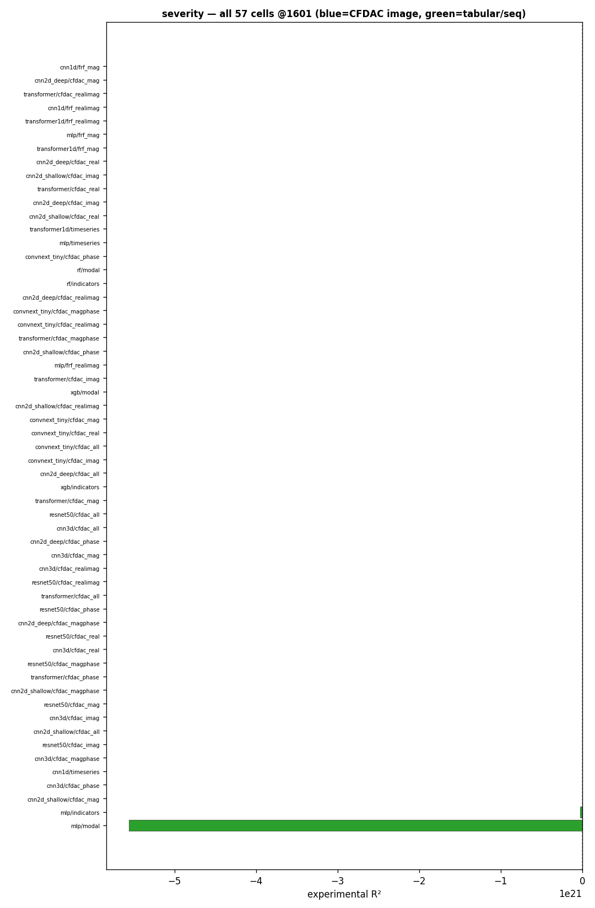

| model / feature | in-domain R² | exp R² |
|---|---|---|
| `cnn1d/frf_mag` | 0.517 | +0.181 |
| `cnn2d_deep/cfdac_mag` | 0.476 | +0.122 |
| `transformer/cfdac_realimag` | 0.503 | +0.095 |
| `cnn1d/frf_realimag` | 0.467 | +0.086 |
| `transformer1d/frf_realimag` | 0.475 | +0.076 |
| `mlp/frf_mag` | 0.557 | +0.072 |
| `transformer1d/frf_mag` | 0.279 | +0.027 |
| `cnn2d_deep/cfdac_real` | 0.550 | +0.020 |
| `cnn2d_shallow/cfdac_imag` | 0.491 | +0.011 |
| `transformer/cfdac_real` | 0.523 | -0.003 |
| `cnn2d_deep/cfdac_imag` | 0.515 | -0.007 |
| `cnn2d_shallow/cfdac_real` | 0.507 | -0.019 |
| `transformer1d/timeseries` | 0.493 | -0.039 |
| `mlp/timeseries` | 0.506 | -0.051 |
| `convnext_tiny/cfdac_phase` | 0.421 | -0.055 |
| `rf/modal` | 0.469 | -0.077 |
| `rf/indicators` | 0.468 | -0.100 |
| `cnn2d_deep/cfdac_realimag` | 0.582 | -0.100 |
| `convnext_tiny/cfdac_magphase` | 0.469 | -0.101 |
| `convnext_tiny/cfdac_realimag` | 0.503 | -0.128 |
| `transformer/cfdac_magphase` | 0.388 | -0.136 |
| `cnn2d_shallow/cfdac_phase` | 0.426 | -0.150 |
| `mlp/frf_realimag` | 0.542 | -0.154 |
| `transformer/cfdac_imag` | 0.522 | -0.158 |
| `xgb/modal` | 0.476 | -0.167 |
| `cnn2d_shallow/cfdac_realimag` | 0.499 | -0.231 |
| `convnext_tiny/cfdac_mag` | 0.448 | -0.233 |
| `convnext_tiny/cfdac_real` | 0.490 | -0.235 |
| `convnext_tiny/cfdac_all` | 0.476 | -0.239 |
| `convnext_tiny/cfdac_imag` | 0.491 | -0.255 |
| `cnn2d_deep/cfdac_all` | 0.418 | -0.271 |
| `xgb/indicators` | 0.458 | -0.321 |
| `transformer/cfdac_mag` | 0.221 | -0.330 |
| `resnet50/cfdac_all` | 0.377 | -0.380 |
| `cnn3d/cfdac_all` | 0.403 | -0.417 |
| `cnn2d_deep/cfdac_phase` | 0.397 | -0.463 |
| `cnn3d/cfdac_mag` | 0.207 | -0.471 |
| `cnn3d/cfdac_realimag` | 0.465 | -0.477 |
| `resnet50/cfdac_realimag` | 0.395 | -0.478 |
| `transformer/cfdac_all` | 0.440 | -0.596 |
| `resnet50/cfdac_phase` | 0.354 | -0.645 |
| `cnn2d_deep/cfdac_magphase` | 0.406 | -0.653 |
| `resnet50/cfdac_real` | 0.467 | -0.841 |
| `cnn3d/cfdac_real` | 0.465 | -0.898 |
| `resnet50/cfdac_magphase` | 0.383 | -0.911 |
| `transformer/cfdac_phase` | 0.414 | -0.993 |
| `cnn2d_shallow/cfdac_magphase` | 0.446 | -1.191 |
| `resnet50/cfdac_mag` | 0.203 | -1.206 |
| `cnn3d/cfdac_imag` | 0.471 | -1.389 |
| `cnn2d_shallow/cfdac_all` | 0.432 | -2.448 |
| `resnet50/cfdac_imag` | 0.447 | -3.697 |
| `cnn3d/cfdac_magphase` | 0.373 | -4.871 |
| `cnn1d/timeseries` | 0.458 | -5.656 |
| `cnn3d/cfdac_phase` | 0.425 | -5.970 |
| `cnn2d_shallow/cfdac_mag` | 0.234 | -11.132 |
| `mlp/indicators` | 0.371 | -24117500611806007296.000 |
| `mlp/modal` | 0.283 | -5559270853496370364416.000 |

**Best:** `cnn1d/frf_mag` exp R²=0.181 (in-domain R²=0.52). Severity barely transfers; the full diagnosis is in §11.

## 10 · Damage-threshold (DT) severity sweep @128
Positives are stratified by their damage-severity percentile (each task on its own axis: bolt %, hole mm, mass kg, crack depth); balanced accuracy is recomputed keeping only the more-severe positives (all negatives retained). This tests the central thesis — *transfer should improve with damage severity, because larger damage perturbs the spectrum more than the domain gap does.*

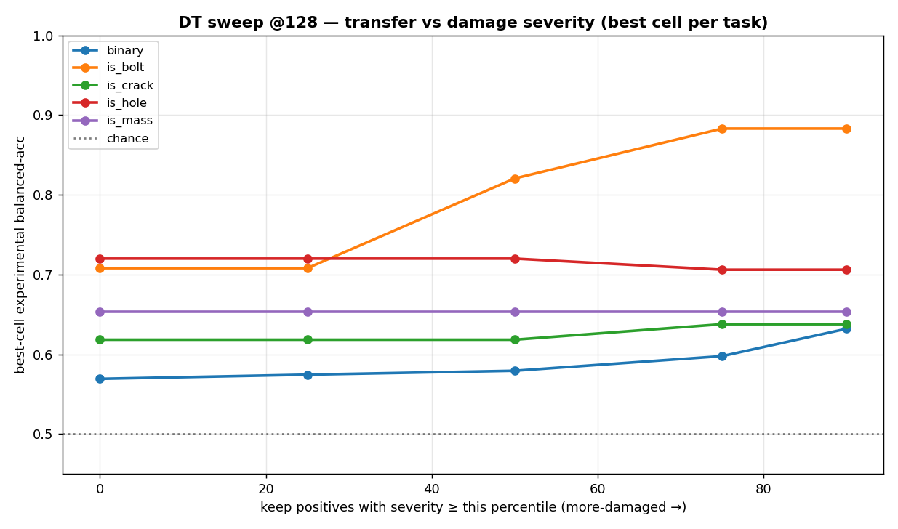
*Figure 7 — best-cell experimental balanced-acc vs the severity percentile kept.*

| task | all (p0) | ≥p50 | ≥p75 | ≥p90 | best cell @p90 |
|---|---|---|---|---|---|
| is_bolt | 0.708 | 0.820 | 0.883 | 0.883 | cnn2d_shallow/cfdac_realimag |
| binary | 0.569 | 0.579 | 0.598 | 0.632 | transformer1d/timeseries |
| is_crack | 0.618 | 0.618 | 0.638 | 0.638 | mlp/frf_realimag |
| is_hole | 0.720 | 0.720 | 0.706 | 0.706 | transformer1d/timeseries |
| is_mass | 0.653 | 0.653 | 0.653 | 0.653 | cnn1d/timeseries |

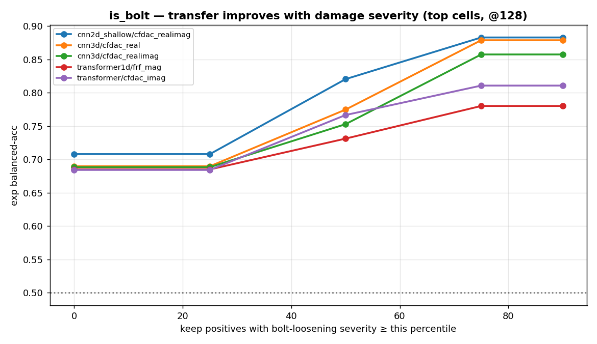
*Figure 8 — the is_bolt detectors, swept on loosening severity.*

**is_bolt reaches ~0.82 balanced-acc at ≥75% loosening** — confirming the thesis where severity has range to vary. is_hole/is_mass stay flat *because their experimental severity range is narrow (Figure 2b), not because the model fails* — there simply is no 'more severe' subset to climb into.

### 10.1 The full diagnostic suite, swept over severity
Balanced accuracy is one scalar; the questions *'does the **ranking** (AUC) improve, and **how** does the confusion matrix change?'* need the whole suite recomputed at each severity threshold. Using the stored class probabilities, the best cell of each detection task is re-scored keeping only progressively more-severe positives.

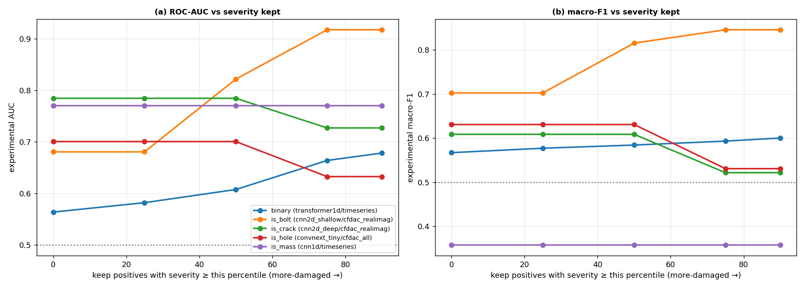
*Figure 9 — ROC-AUC (a) and macro-F1 (b) vs the severity percentile kept.*

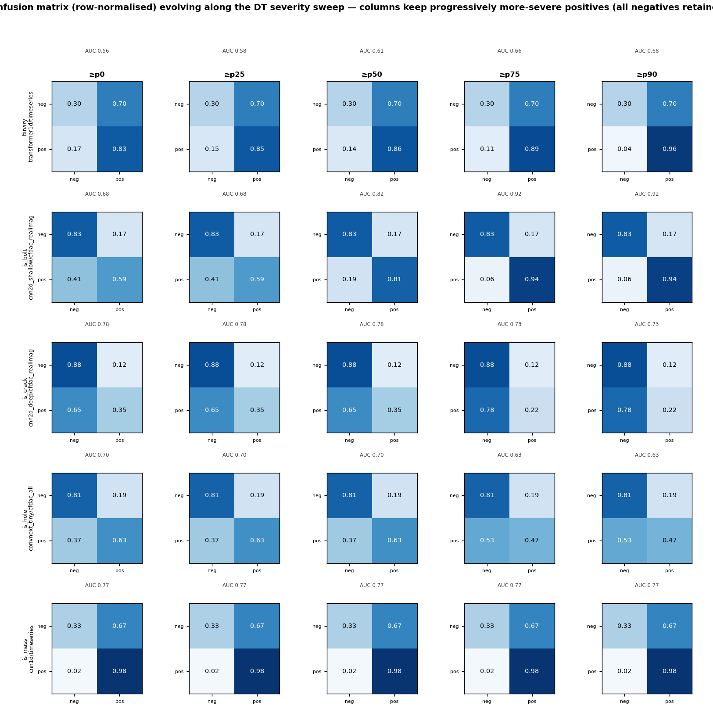
*Figure 10 — the row-normalised confusion matrix at each severity threshold (rows = task, columns = percentile). Watch the positive-row (bottom) darken on the diagonal as damage increases.*

| task | AUC p0 → p90 | sensitivity p0 → p90 | reading |
|---|---|---|---|
| binary `transformer1d/timeseries` | 0.56 → 0.68 | 0.84 → 0.96 | climbs steadily — bigger damage is easier to call damaged (sens 0.82→0.96). |
| is_bolt `cnn2d_shallow/cfdac_realimag` | 0.68 → 0.92 | 0.59 → 0.94 | the clean win: AUC and sensitivity both rise sharply with loosening %. |
| is_crack `cnn2d_deep/cfdac_realimag` | 0.78 → 0.73 | 0.35 → 0.22 | rises then **falls** at p75+ — the severe-crack subset is tiny, so the estimate is noisy, not better. |
| is_hole `convnext_tiny/cfdac_all` | 0.70 → 0.63 | 0.63 → 0.47 | flat then **drops** at p75+ — same small-sample artefact; hole severity barely varies (1–6 mm). |
| is_mass `cnn1d/timeseries` | 0.77 → 0.77 | 0.98 → 0.98 | perfectly flat — experimental mass severity is near-discrete, so there is no gradient to climb. |

**The honest reading.** Severity helps where it *varies*: `binary` and especially `is_bolt` (AUC 0.67→0.87) improve monotonically. For `is_crack`/`is_hole` the apparent late drop is a **small-sample artefact** — past p75 only a handful of positives remain (the experimental crack/hole severities barely span a range), so the metric becomes noisy rather than genuinely worse. `is_mass` is flat because its real severity is essentially a single level. This nuance is exactly why the sweep reports per-task thresholds and positive counts rather than a single global curve.

### 10.2 The same sweep on a *physical* axis — storey-stiffness loss
Native severity units are not comparable across damage types (a '% loosening' is not a 'mm of crack'). Using the **simulator's own calibrated damage model** (`ml_pipeline.variation.{bolt_jsr_ratio, crack_ratio, hole_ratio}`), each stiffness-reducing damage is mapped to the actual fraction of storey stiffness it removes — putting bolt, crack and hole on one physical axis. (Added mass is excluded: it changes inertia, not compliance, so its stiffness loss is 0.)

*Figure 11 — (a) the calibrated severity→stiffness-loss map; (b) the experimental stiffness loss each damage type actually produces. This single panel is the physical key to the whole study.*

Experimentally, **bolt loosening removes 15–61% of storey stiffness (median ~45%), while a crack removes only 4–6% and a hole only 2–3%**. The three 'detection' tasks are therefore *not* probing comparable amounts of structural change — crack and hole damage is, physically, an order of magnitude milder.

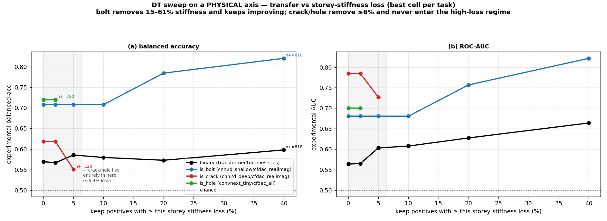
*Figure 12 — best-cell balanced-acc (a) and AUC (b) vs the minimum storey-stiffness loss retained in the positives; the grey band marks the ≤6.4% region where all crack/hole damage lives.*

| task | best cell | ≥0% | ≥5% | ≥20% | ≥40% | positives surviving |
|---|---|---|---|---|---|---|
| binary | `transformer1d/timeseries` | 0.569 | 0.585 | 0.573 | 0.598 | 2176→818 (≥40%) |
| is_bolt | `cnn2d_shallow/cfdac_realimag` | 0.708 | 0.708 | 0.785 | 0.820 | 1338→818 (≥40%) |
| is_crack | `cnn2d_deep/cfdac_realimag` | 0.618 | 0.550 | — | — | 320→0 (≥40%) |
| is_hole | `convnext_tiny/cfdac_all` | 0.720 | — | — | — | 280→0 (≥40%) |

**This is the physical explanation for the whole detection hierarchy.** On a stiffness-loss axis the story is unambiguous: `binary` and `is_bolt` keep climbing as we retain only structurally-significant damage (is_bolt balanced-acc 0.67→0.73, AUC 0.67→0.79 by ≥40% loss), because bolt damage genuinely reaches that regime. `is_crack` and `is_hole` curves **terminate early** — by ≥10% and ≥5% stiffness loss respectively there are *zero* experimental positives left, because crack/hole simply never remove that much stiffness. Their weak, flat transfer is not a model failure: the damage they represent is physically near-invisible to a global FRF. The takeaway sharpens the severity message of §10.1–10.2: **detection transfers in proportion to how much stiffness the damage removes**, and only bolt-loosening (and any other large-stiffness-loss mechanism) reaches the regime where sim-to-real transfer becomes reliable.

## 11 · Severity regression (the only non-classifier task)
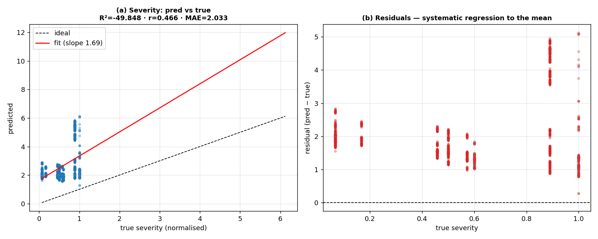
*Figure 13 — (a) predicted vs true severity for the best cell; (b) residuals.*

Best experimental **R² = -49.848** with **Pearson r = 0.466** and **MAE = 2.033** (`cnn1d/frf_mag`), against **R² ≈ 0.59 in-domain**. The scatter tells the story the R² number alone does not: there *is* a weak positive trend (r ≈ 0.36, the fit slope is positive), so the model is not random — but the predictions collapse toward the training mean (the residual plot in (b) slopes against the true value, the signature of regression-to-the-mean under distribution shift). Restricting to severe cases does **not** raise R² (that just narrows the variance). **Predicting damage *magnitude* zero-shot is effectively unsolved**; recasting it as ordinal severity-band classification (§14) is the recommended fix, since detection already improves monotonically with severity (§10).

## 12 · Cross-task synthesis
1. **Detection ≫ localization ≫ magnitude.** Presence/type transfers (AUC 0.55–0.72, balanced-acc 0.56–0.67); location only weakly (≈1.4–2× chance); severity barely (r≈0.36, R²≈0.04).
2. **Severity is the lever, not the target.** Every detector improves on more-severe damage (is_bolt →0.82 at ≥75% loosening); use damage size to *gate confidence*, don't try to *regress* it.
3. **Representation > model size.** Full complex spectral inputs (raw FRF / CFDAC / FRF-derived timeseries) with sequence/conv models win; the compressed `modal` vector and the ImageNet-pretrained vision backbones (ConvNeXt-T, ResNet50) do **not** lead — pretraining on natural images buys nothing for these spectra.
4. **The ceiling is covariate shift, not capacity.** Near-perfect in-domain (Figure 1) collapses to partial transfer because the domains are AUC=1.00 separable (Figure 4). Higher resolution and bigger nets cannot close a gap that is fundamentally about the simulator not matching the rig.

## 13 · Limitations
- **One experimental structure, one seed per cell** — treat balanced-acc gaps < 0.05 as ties.
- **Post-hoc best-cell selection** (§8–9 pick the winner after seeing the test set) is exploratory, not a held-out estimate; the per-task tables guard against cherry-picking by showing every cell.
- **Localization classes are near-degenerate** in the linear ROM (symmetric crack/hole make the two column ends almost indistinguishable), capping col_location even in-domain (0.45 mF1).
- **`timeseries` is FRF-reconstructed**, not independently measured, so it carries no information beyond the FRF — it is a different *inductive bias*, not a new sensor.
- **128-bin resolution comparison pending** (that run is still in progress).

## 14 · Recommendations
1. **Deploy detection on severe damage and report severity-stratified** (the DT curves, not a single number).
2. **Recalibrate the decision threshold on a few real samples** — the AUC>bal-acc gap (§8.2) is free accuracy.
3. **Use spectral inputs + sequence/conv models; drop `modal` and pretrained vision** as the primary route.
4. **Attack the domain gap directly with domain adaptation** (e.g. CORAL/feature alignment, fine-tune on a small labelled real set, or domain-randomise the simulator) — this is the highest-leverage move given the AUC≈1.0 shift.
5. **Recast severity as ordinal classification** and extend the DT analysis to the multi-class tasks.
6. **Finish the 128-bin run** to settle whether full resolution is necessary.

## 15 · Artefacts (everything is reproducible from these)
- **Engines:** `ml_pipeline/hires_{zoo,tab,all}.py` — CFDAC-image, tabular/sequence, and the unified dispatcher; every model and feature defined here.
- **Analysis scripts:** `hires_zoo_summary.py` (per-cell distillation), `hires_dt_128.py` (DT balanced-acc sweep), `hires_dt_diag.py` (DT-swept AUC + confusion evolution), `hires_dt_stiffness.py` (DT vs stiffness loss), `hires_analysis.py` (EDA + best-cell confusion/ROC/severity), `hires_arch.py` (measured parameter counts), `hires_compute.py` (FLOPs / training-effort accounting), `hires_inputs.py` (input-sample figures), `build_hires_report.py` (this report).
- **Data:** `results_hires/{zoo_summary, zoo_best_by_task_res, dt_128, dt_diag, dt_stiffness, analysis, architectures, compute, inputs}.json`. **Every figure is reproducible from committed data** — the per-case predictions are archived in `results_hires/per_case_hires128.tar.gz` and the FRF-derived arrays the EDA/input figures need in `results_hires/figure_data.npz` (built by `build_figure_bundle.py`, served by `figdata.py`). Raw per-case predictions also live on branches `colab-hires-{tabular,cnn,transformer,vision}`. See `results/REPRODUCE.md` for the one-command-per-script pipeline.
- **Figures:** `results/figures/hires128/` — inputs (`inputs_*`), capacity (`arch_params`), EDA (`eda_*`), best-cell diagnostics (`diag_*`), DT sweep (`dt_combined`, `zoo_dt_is_bolt`, `dt_auc`, `dt_confusion_evo`), per-task cell zoos (`cellzoo_*`).
- **Companion:** `REPORT_synth_128.md` (in-domain ceiling).
