# LANL 3SBB — Pristine-anchored damage diagnosis: detailed report (128 bins)

*Top-3 `(model,feature)` cells per task · 2,638 experimental measurements (zero-shot) · 30 cells*

## Contents
1. Overview & headline
2. The damage submodels (what "pristine-anchored" changes)
3. Cost of refusing damaged data
4. Detection diagnostics — ROC
5. Confusion matrices (type / location)
6. Severity regression
7. Damage-threshold (DT) sweep
8. Per-task catalogue (every cell)
9. Full 30-cell table · Reproduce

---

## 1 · Overview & headline

Every model is trained **only on synthetic FRFs** from the reduced-order 3SBB model **adjusted as well as possible from the pristine case alone**: the calibrated pristine baseline plus *first-principles, pristine-anchored* damage submodels (`ml_pipeline/pristine_physics.py`). **No damaged measurement informs the training data.** Models are evaluated **zero-shot** on the real experimental cases. For each task we trained the **top-3 cells** (ranked by experimental transfer in the damage-calibrated 128-bin study) and report the best. The *calibrated* column is the **same cell** from the main study, whose synthetic damage magnitudes **were** fitted to the damaged FRFs — so the gap is the share of performance bought by peeking at the damage.

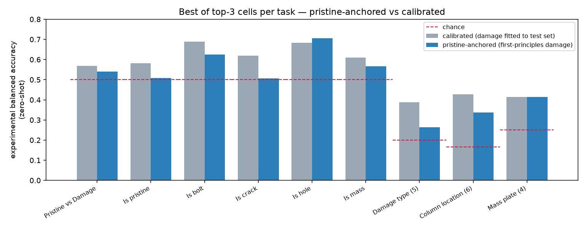

| Task | Best pristine cell | Metric | Pristine | Chance | Calibrated\* | Δ |
|---|---|---|--:|--:|--:|--:|
| Pristine vs Damage | `transformer1d/timeseries` | bal-acc | **0.539** | 0.500 | 0.569 | -0.030 |
| Is pristine | `transformer1d/timeseries` | bal-acc | **0.508** ⚠ | 0.500 | 0.582 | -0.074 |
| Is bolt | `cnn3d/cfdac_real` | bal-acc | **0.624** | 0.500 | 0.690 | -0.065 |
| Is crack | `cnn2d_deep/cfdac_realimag` | bal-acc | **0.506** ⚠ | 0.500 | 0.618 | -0.112 |
| Is hole | `mlp/frf_realimag` | bal-acc | **0.706** | 0.500 | 0.682 | +0.024 |
| Is mass | `transformer1d/frf_mag` | bal-acc | **0.567** | 0.500 | 0.611 | -0.044 |
| Damage type (5) | `cnn2d_deep/cfdac_realimag` | bal-acc | **0.263** | 0.200 | 0.388 | -0.125 |
| Column location (6) | `transformer1d/frf_mag` | bal-acc | **0.336** | 0.167 | 0.427 | -0.091 |
| Mass plate (4) | `rf/modal` | bal-acc | **0.414** | 0.250 | 0.414 | +0.000 |
| Severity (reg) | `transformer/cfdac_realimag` | R² | **0.053** | 0.000 | 0.095 | -0.043 |

\*same cell, damage-calibrated study. ⚠ = collapsed / at chance.

**Mean best-cell experimental balanced accuracy over the 9 classification tasks: pristine `0.496` vs calibrated `0.554` (−0.058).**

## 2 · The damage submodels — what "pristine-anchored" changes

The only thing that differs from the calibrated generator is *how big* each damage is. The calibrated model reads magnitudes from tables whose anchors were fitted to the damaged FRFs; the pristine model derives them from geometry + mechanics, anchored only at the undamaged state.

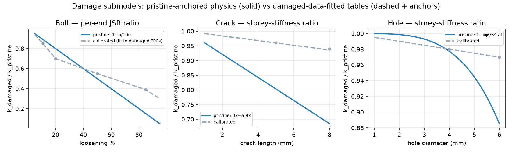

Bolt loosening is the biggest divergence: the pristine `1−p/100` preload law removes *more* stiffness at high severity than the fitted `0.39 @ 85%`. Crack/hole follow geometric section-loss. Mass is identical (a known kg). These curves are the entire difference between the two columns everywhere else in this report.

## 3 · Cost of refusing damaged data

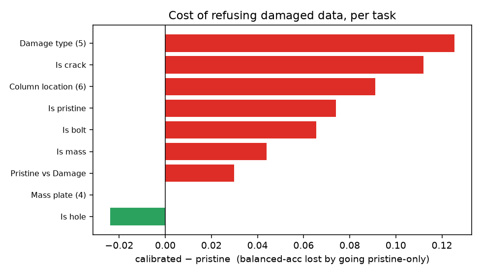

Detection of bolt/hole/mass survives the honesty test; `is_hole` and `mass_location` lose essentially nothing — their physics generalises unaided. Fine typing (`type`) and crack detection (`is_crack`) fall most, because the crack stiffness effect is small and its fitted magnitude was doing real work.

## 4 · Detection diagnostics — ROC

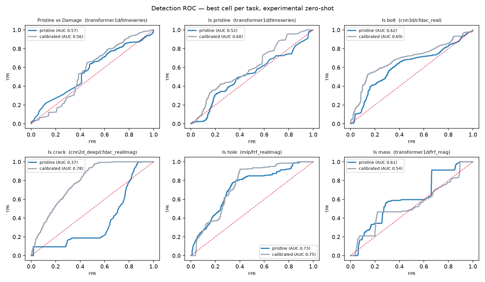

## 5 · Confusion matrices (experimental, row-normalised)

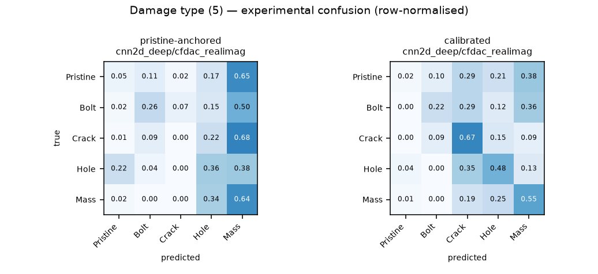

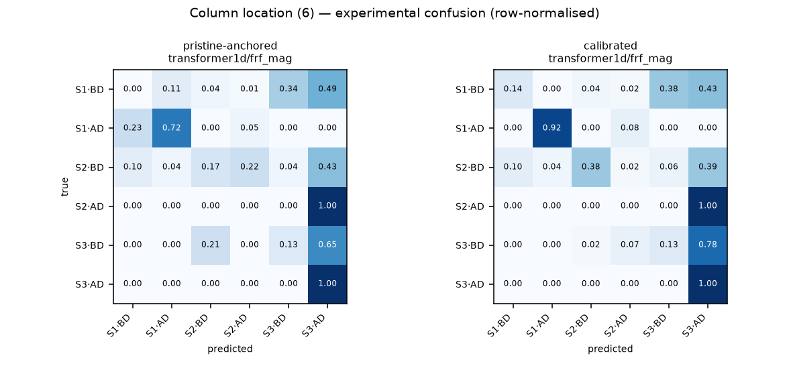

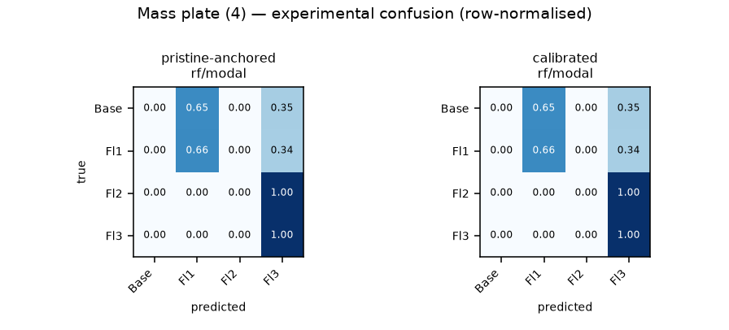

## 6 · Severity regression

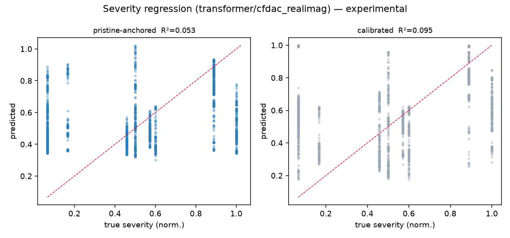

## 7 · Damage-threshold (DT) sweep

Detection should be easier for *larger* damage. Keeping only bolt positives above a rising severity floor, the pristine model's accuracy climbs much like the calibrated one — i.e. the pristine-anchored physics preserves the size→detectability ordering.

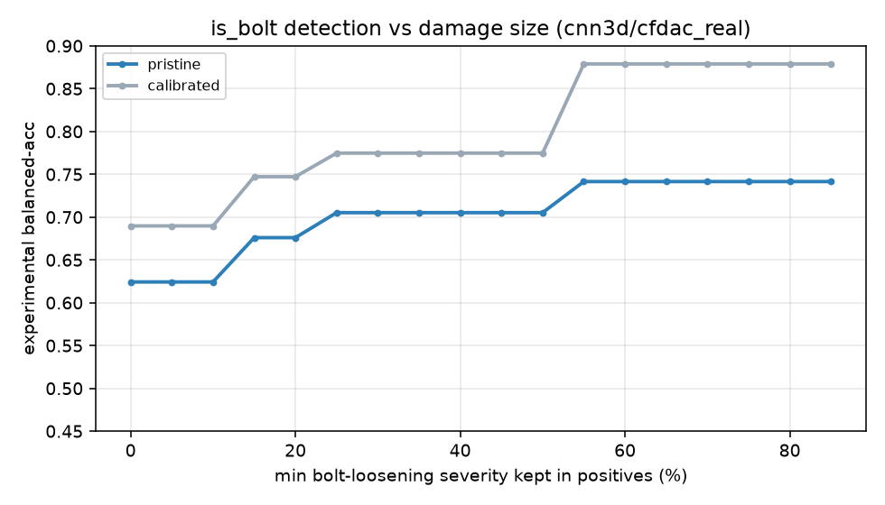

## 8 · Per-task catalogue (every cell)

### Pristine vs Damage (`binary`)

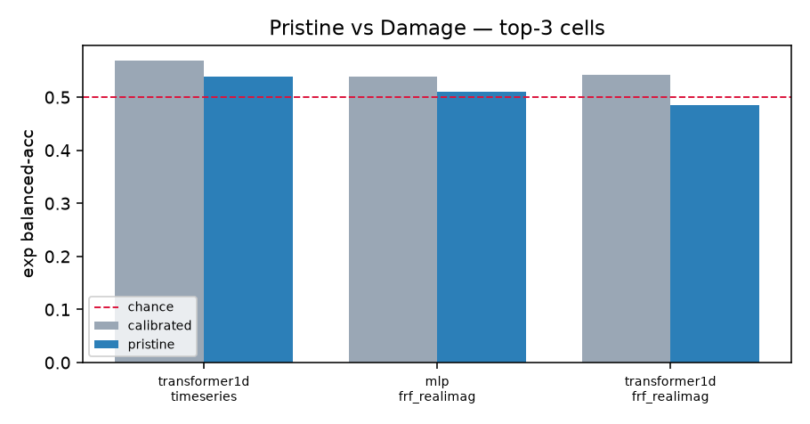

### Is pristine (`is_pristine`)

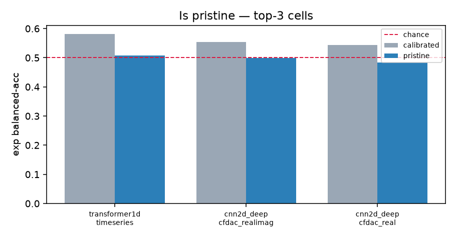

### Is bolt (`is_bolt`)

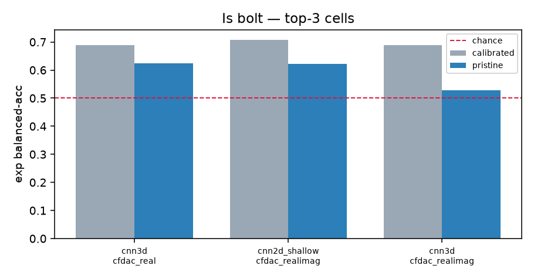

### Is crack (`is_crack`)

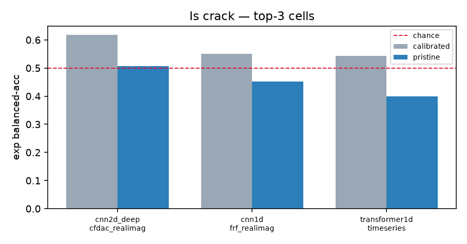

### Is hole (`is_hole`)

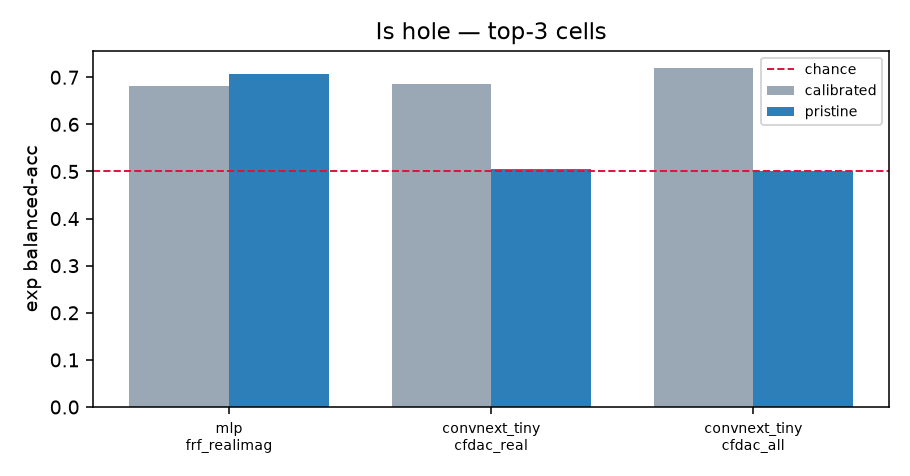

### Is mass (`is_mass`)

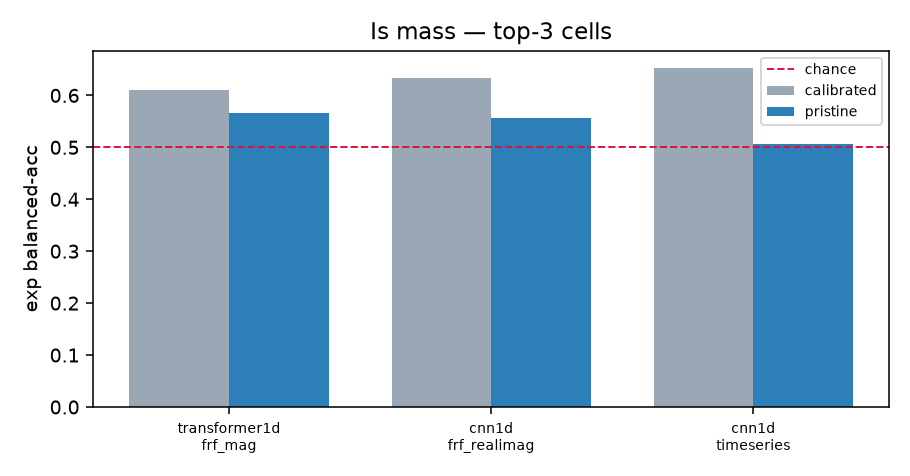

### Damage type (5) (`type`)

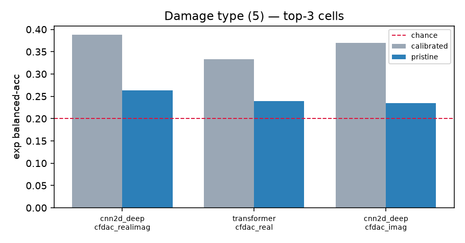

### Column location (6) (`col_location`)

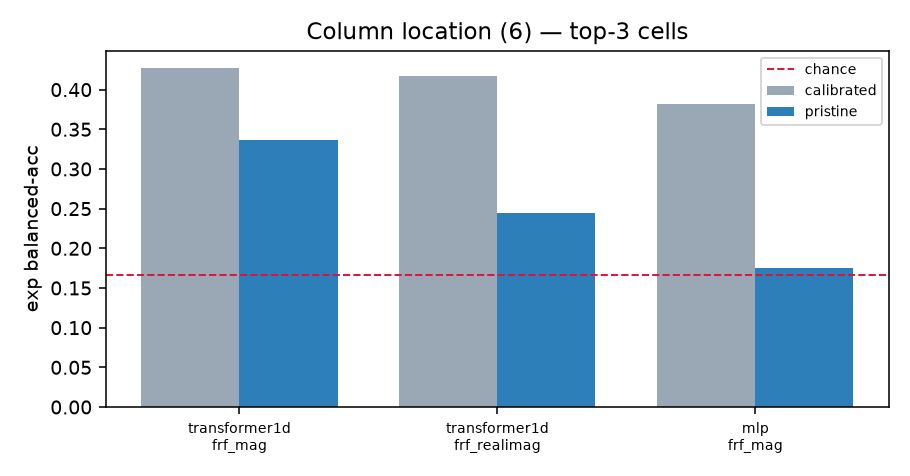

### Mass plate (4) (`mass_location`)

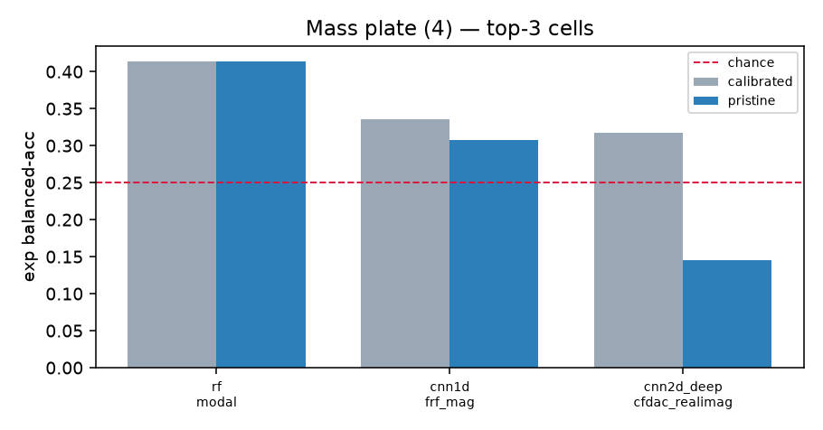

### Severity (reg) (`severity`)

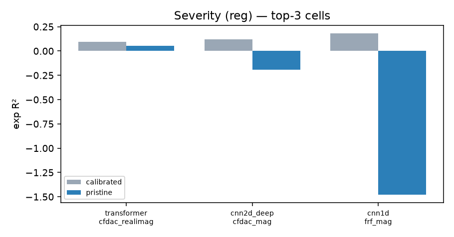


## 9 · Full 30-cell table (experimental zero-shot)

| Task | Model | Feature | Kind | Pristine | macro-F1 | Calibrated\* | Chance | Collapse |
|---|---|---|---|--:|--:|--:|--:|:--:|
| binary | transformer1d | timeseries | cls | 0.539 | 0.537 | 0.569 | 0.500 |  |
| binary | mlp | frf_realimag | cls | 0.511 | 0.506 | 0.539 | 0.500 | yes |
| binary | transformer1d | frf_realimag | cls | 0.485 | 0.479 | 0.542 | 0.500 | yes |
| is_pristine | transformer1d | timeseries | cls | 0.508 | 0.508 | 0.582 | 0.500 | yes |
| is_pristine | cnn2d_deep | cfdac_realimag | cls | 0.499 | 0.453 | 0.554 | 0.500 | yes |
| is_pristine | cnn2d_deep | cfdac_real | cls | 0.483 | 0.476 | 0.543 | 0.500 | yes |
| is_bolt | cnn3d | cfdac_real | cls | 0.624 | 0.623 | 0.690 | 0.500 |  |
| is_bolt | cnn2d_shallow | cfdac_realimag | cls | 0.622 | 0.581 | 0.708 | 0.500 |  |
| is_bolt | cnn3d | cfdac_realimag | cls | 0.528 | 0.444 | 0.688 | 0.500 |  |
| is_crack | cnn2d_deep | cfdac_realimag | cls | 0.506 | 0.505 | 0.618 | 0.500 | yes |
| is_crack | cnn1d | frf_realimag | cls | 0.451 | 0.442 | 0.550 | 0.500 | yes |
| is_crack | transformer1d | timeseries | cls | 0.399 | 0.412 | 0.544 | 0.500 | yes |
| is_hole | mlp | frf_realimag | cls | 0.706 | 0.529 | 0.682 | 0.500 |  |
| is_hole | convnext_tiny | cfdac_real | cls | 0.506 | 0.505 | 0.687 | 0.500 | yes |
| is_hole | convnext_tiny | cfdac_all | cls | 0.500 | 0.472 | 0.720 | 0.500 | yes |
| is_mass | transformer1d | frf_mag | cls | 0.567 | 0.555 | 0.611 | 0.500 |  |
| is_mass | cnn1d | frf_realimag | cls | 0.557 | 0.370 | 0.634 | 0.500 |  |
| is_mass | cnn1d | timeseries | cls | 0.507 | 0.098 | 0.653 | 0.500 | yes |
| type | cnn2d_deep | cfdac_realimag | cls | 0.263 | 0.181 | 0.388 | 0.200 |  |
| type | transformer | cfdac_real | cls | 0.239 | 0.187 | 0.333 | 0.200 |  |
| type | cnn2d_deep | cfdac_imag | cls | 0.235 | 0.120 | 0.370 | 0.200 |  |
| col_location | transformer1d | frf_mag | cls | 0.336 | 0.169 | 0.427 | 0.167 |  |
| col_location | transformer1d | frf_realimag | cls | 0.244 | 0.196 | 0.417 | 0.167 |  |
| col_location | mlp | frf_mag | cls | 0.175 | 0.110 | 0.381 | 0.167 | yes |
| mass_location | rf | modal | cls | 0.414 | 0.236 | 0.414 | 0.250 |  |
| mass_location | cnn1d | frf_mag | cls | 0.307 | 0.194 | 0.336 | 0.250 |  |
| mass_location | cnn2d_deep | cfdac_realimag | cls | 0.145 | 0.175 | 0.317 | 0.250 | yes |
| severity | transformer | cfdac_realimag | reg | 0.053 | — | 0.095 | 0.000 |  |
| severity | cnn2d_deep | cfdac_mag | reg | -0.193 | — | 0.122 | 0.000 |  |
| severity | cnn1d | frf_mag | reg | -1.478 | — | 0.181 | 0.000 |  |

## Reproduce

```bash
python ml_pipeline/build_pristine128_report.py
```

Reads the committed per-case predictions (`results_hires_zoo/pristine128/per_case_pristine128.tar.gz` for the pristine model, `results_hires/per_case_hires128.tar.gz` for the calibrated baseline) and rewrites this report + every figure under `results/figures/pristine128/`. Training notebook: `notebooks/hires_pristine128_top3_gpu.ipynb` (L4 GPU); raw predictions also on branch `colab-hires-pristine128`.
