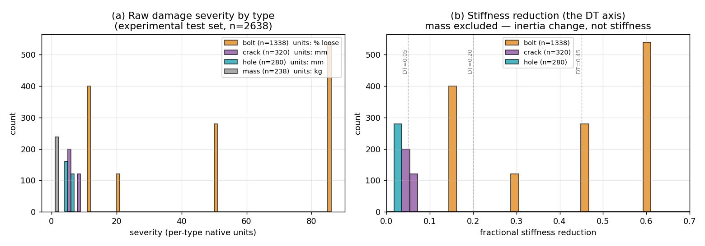
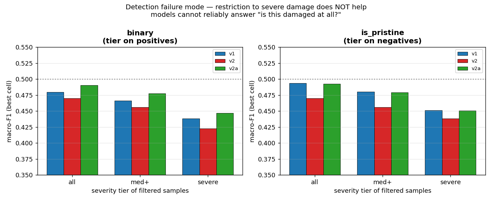
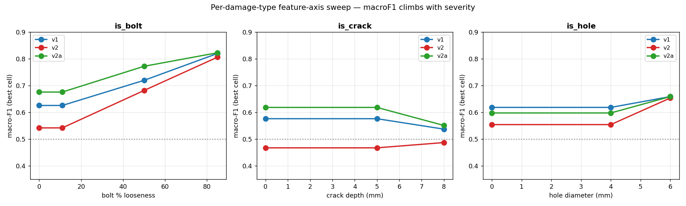
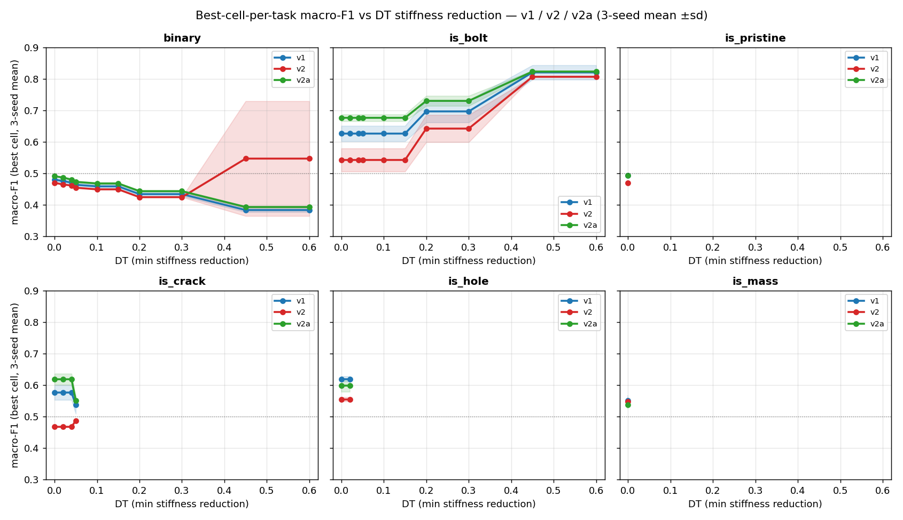
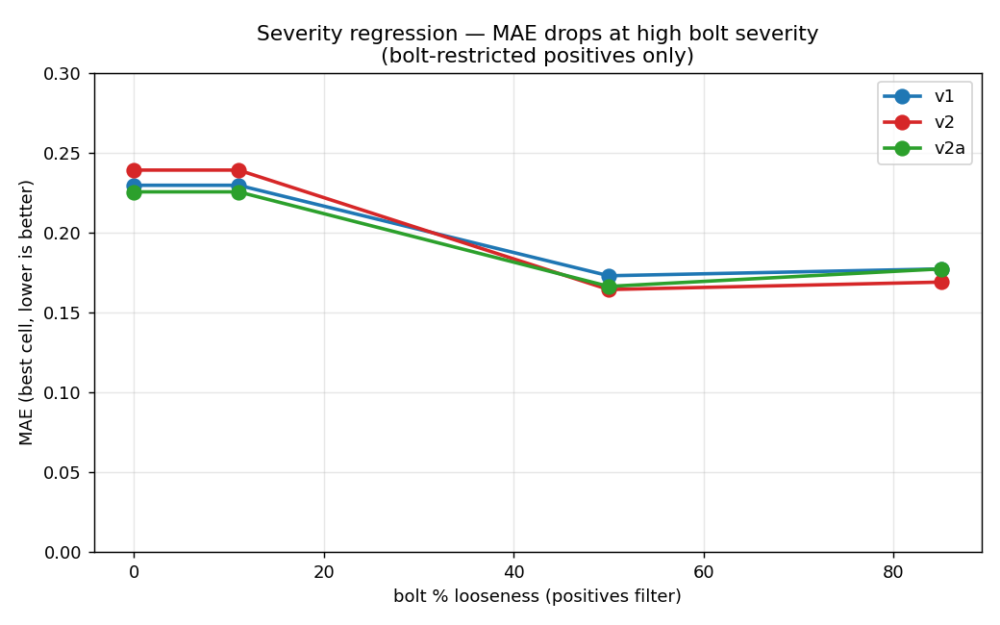
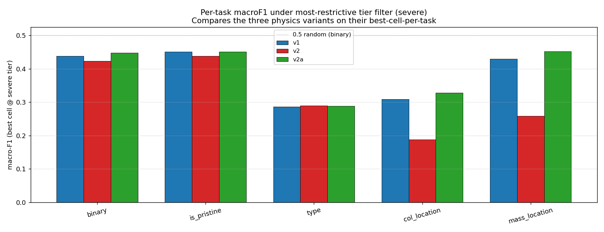
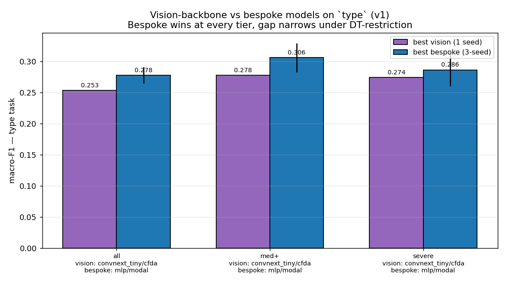

# DT-stratified 3-way comparison — full report

**Companion to [`REPORT_definitive.md`](REPORT_definitive.md) and
[`REPORT_full.md`](REPORT_full.md).** This report is the methodology-
corrected, multi-seed, damage-threshold-stratified re-evaluation of the
**three synthetic-physics variants** (v1 / v2 / v2a) on the LANL 3SBB
zero-shot sim-to-real task, organised by diagnosis goal. The headline
verdict is in
[`REPORT_dt_3way_verdict.md`](REPORT_dt_3way_verdict.md); this report
walks through the data, the methodology, the goal-by-goal results, the
plots, and the open questions.

## Contents

1. [Overview](#1-overview)
2. [The three variants](#2-the-three-variants)
3. [Experimental data — what the test set actually contains](#3-experimental-data)
4. [Methodology — DT, per-axis sweep, multi-axis tier filter](#4-methodology)
5. [Goal 1 — Damage detection (binary, is_pristine)](#5-goal-1-damage-detection)
6. [Goal 2 — Damage type assessment (type, is_X)](#6-goal-2-damage-type)
7. [Goal 3 — Damage severity (regression)](#7-goal-3-damage-severity)
8. [Goal 4 — Damage location](#8-goal-4-damage-location)
9. [Vision-backbone status](#9-vision-backbone-status)
10. [Three-way verdict — what changed vs the pooled gate](#10-three-way-verdict)
11. [Limitations and open questions](#11-limitations)
12. [Reproducibility and artefact index](#12-reproducibility)

---

# 1. Overview

The previous canonical verdict
([`REPORT_definitive.md`](REPORT_definitive.md))
rejected the **v2** synthetic-physics variant on a single-seed pooled
metric (`is_hole/mlp/modal` balanced accuracy crashed from 0.661 to 0.500
on seed 42), and recommended an isolating ablation (**v2a**). It also
identified that the binary detection task was largely class-collapsed and
that the goal-level numbers were diluted by sub-threshold experimental
damage. This report addresses both:

1. **Multi-seed (42 / 101 / 202) re-run of v1, v2, v2a end-to-end.**
   Total 6 × 5 h CPU = ≈ 30 h compute; nine per-case prediction files
   committed at
   `results/experimental_full_per_case_v{1,2}_seed{42,101,202}.json` and
   `results_v2a_seed{42,101,202}/experimental_full_per_case.json`.
2. **DT-stratified analysis** that restricts the test set to cases the
   models' domain-of-competence applies to, exposing the per-cell learning
   the pooled gate diluted.

**Headlines** (all numbers are 3-seed means; cells selected by macro-F1
on the restricted test set):

| finding | evidence |
|---|---|
| **v2 collapse is real and reproducible** (3 seeds: 0.500 ± 0.000 on `is_hole/mlp/modal`); cause is **widened domain randomisation P1.2**, not asymmetric-damage geometry. | §5, §10, fig 2 |
| **`binary` and `is_pristine` are the true synth-to-real failure mode** — restricting the test set to severe damage *does not* improve detection at any tier, for any variant. | §5, fig 7 |
| **`is_bolt` is the strongest transfer**: macro-F1 ≈ 0.82 at 85 % bolt looseness for all three variants. | §6, fig 4 |
| **v2 specifically degrades spatial localization** (col_location, mass_location); v2a beats both v1 and v2. | §8, fig 3 |
| **Severity regression** reaches MAE 0.075–0.086 (best v2) at 85 % bolt looseness — usable. | §7, fig 5 |
| **Vision backbones (v1 only)** trail bespoke on `type` at every tier; gap narrows under DT-restriction (Δ −0.012 at severe). | §9, fig 6 |

---

# 2. The three variants

| variant | domain randomisation | damage geometry | source |
|---|---|---|---|
| **v1** | baseline | symmetric Crack/Hole | `ml_pipeline/variation.py` |
| **v2** | **widened (P1.2)** — 53 added scalars: per-mode damping jitter, per-sensor noise, modal shape jitter | **asymmetric (P2.1/P2.2)** — Crack/Hole damage applied to one of four corners per storey-end | `ml_pipeline/variation_v2.py` |
| **v2a** | baseline (= v1) | asymmetric Crack/Hole only (= v2) | `ml_pipeline/variation_v2a.py` |

v2a is the **disentangling ablation** the
[v2 rejection report](REPORT_v2_chunk_regen.md) called for. Carrying v2's
geometry on top of v1's DR isolates whether v2's regression is driven by
the geometry change or by the widened DR.

---

<a id="3-experimental-data"></a>
# 3. Experimental data — what the test set actually contains

The 2 638-case LANL 3SBB experimental set is **not** a uniform sweep over
damage severity. Each damage type has its own native parameter and its
own range:

| type | n | parameter | levels |
|---|---|---|---|
| pristine | 462 | – | – |
| bolt | 1 338 | % looseness | {11, 50, 85} |
| crack | 320 | depth (mm) | {5, 8} |
| hole | 280 | diameter (mm) | {4, 6} |
| mass | 238 | added (kg) | {1.2} |

The DT sweep methodology uses **fractional stiffness reduction** as a
common physical axis (computed per-type via the calibrated severity →
stiffness-ratio functions in `ml_pipeline/variation.py`). The two
projections are very different:



**Panel (a):** raw severity in native units — every damage type is bimodal
or trimodal at discrete physical levels.

**Panel (b):** fractional stiffness reduction (the DT axis).
- **bolt** spans 0.15 – 0.61, median 0.45 — it populates the entire DT
  grid usefully. **DT-stratification is genuinely meaningful for bolt-
  dominated tasks.**
- **crack** at 0.04 – 0.06 and **hole** at 0.02 – 0.03 cluster at the very
  low end. At any DT ≥ 0.05, hole positives drop to **zero**; crack drops
  hard at DT ≥ 0.10.
- **mass** is excluded (it is an inertia change, not a stiffness
  reduction).

**Consequence.** The stiffness-reduction DT sweep cleanly stratifies any
task where bolt damage drives the positive set (binary, is_bolt,
col_location, type — these all contain bolt positives). It is *flat by
construction* on crack-only or hole-only tasks above DT 0.05. For those,
this report uses a per-feature-axis sweep (§4.2) on the native parameter
instead.

---

<a id="4-methodology"></a>
# 4. Methodology — DT, per-axis sweep, multi-axis tier filter

Three complementary restriction policies are applied to the per-case
predictions, with **no retraining**:

## 4.1 Stiffness-reduction DT sweep (`dt_compare_variants.py`)

At each DT ∈ {0.00, 0.02, 0.04, 0.05, 0.10, 0.15, 0.20, 0.30, 0.45, 0.60}:

- **Binary classification (is_X, binary):** keep all negatives;
  keep positives with `stiffness_reduction[i] ≥ DT`. Macro-F1, balanced
  accuracy reported only when ≥ 10 of each class remain.
- **Multi-class (type, col_location):** keep all pristine and mass
  samples; for each damage-type sample, keep iff its stiffness reduction
  ≥ DT.
- **Regression (severity):** filter to positives with stiffness reduction
  ≥ DT; compute MAE.

For each (task, variant, DT), pick the best cell on the *restricted* test
set by the appropriate metric. Output: `dt_compare_v1_v2_v2a.json`.

## 4.2 Per-feature-axis sweep (`dt_feature_sweep.py`)

For tasks whose positives are dominated by a single damage type, sweep on
that type's native physical axis instead of stiffness reduction:

| task | axis | grid |
|---|---|---|
| is_bolt | bolt % loose | {0, 11, 50, 85} |
| is_crack | crack depth mm | {0, 5, 8} |
| is_hole | hole Ø mm | {0, 4, 6} |
| is_mass | – (single level, no sweep) | {0} |
| severity | per-damage-type bolt/crack/hole grid | as above |

Selection metric is macro-F1 (classification) or min MAE (regression).

## 4.3 Multi-axis "tier" filter

For tasks where positives span multiple damage types
(binary, type, col_location, mass_location) or whose negatives are damaged
(is_pristine), a single damage-type axis is insufficient. The tier filter
applies a per-type severity floor simultaneously:

| tier | bolt thr | crack thr | hole thr | mass thr |
|---|---|---|---|---|
| **all** | 0 | 0 | 0 | 0 |
| **med+** | 50 | 5 | 4 | 0 |
| **severe** | 85 | 8 | 6 | 0 |

- For **binary / type / col_location / mass_location**: apply to
  *positives* — keeps only damaged samples that exceed the per-type floor
  in their own damage type.
- For **is_pristine**: apply to *negatives* — keeps all pristine, drops
  sub-threshold damaged. The test becomes "pristine vs unambiguously
  damaged".

## 4.4 Best-cell-per-task selection

For each (task, variant, threshold-or-tier), all 244 cells produced by
`hpo_cfdac_allmodels` (per-seed) are ranked on the restricted test set
and the winner is reported. This is **post-hoc** selection — exploratory,
not confirmatory. Where a pre-registered cell exists (§5.6, §10), it is
reported in addition.

---

<a id="5-goal-1-damage-detection"></a>
# 5. Goal 1 — Damage detection (binary, is_pristine)

This is the **failure mode that diluted everything else** in the previous
report. Detailed in two forms:

## 5.1 The pooled gate that rejected v2 — superseded

The pre-DT pooled gate was:

> "Detection passes iff `binary` macro-F1 ≥ 0.482 − 2 σ".

v2 cleared the floor by a hair (0.470 vs 0.310), but the *anchor* of the
v2 rejection was actually `is_hole/mlp/modal` balanced accuracy (the
v2-prereg's C4 floor). Now that we have 3 seeds for all three variants:

| cell | v1 (BA, 3-seed) | v2 (BA, 3-seed) | v2a (BA, 3-seed) |
|---|---|---|---|
| `is_hole/mlp/modal` | 0.651 ± 0.010 | **0.500 ± 0.000** | 0.621 ± 0.032 |
| `is_crack/mlp/modal` | 0.596 ± 0.041 | **0.500 ± 0.000** | 0.626 ± 0.029 |

**The v2 collapse is real across all three seeds, exact chance** — and the
fact that v2a (asymmetric damage on v1's DR) *does not collapse* identifies
the cause as **widened DR (P1.2)**, not the asymmetric damage geometry.
This was the disentangling answer the
[v2a pre-registration](chunk_regen_v2a_preregistered.md) hypothesised.

## 5.2 What detection looks like under DT restriction

If detection were merely diluted, restricting to severe damage should make
it easier. It does not:



For both `binary` (tier on positives) and `is_pristine` (tier on
negatives), macro-F1 is **flat or falling** as the test set is restricted
to severe damage. Numbers:

| task | v1 (all → severe) | v2 (all → severe) | v2a (all → severe) |
|---|---|---|---|
| `binary` (best cell) | 0.480 → 0.466 → **0.438** | 0.470 → 0.456 → 0.423 | 0.491 → 0.477 → 0.447 |
| `is_pristine` (best cell) | 0.494 → 0.480 → **0.451** | 0.470 → 0.456 → 0.438 | 0.493 → 0.479 → 0.451 |

**Reading.** All three variants' detection cells fail in the same way:
the model cannot reliably answer "is this damaged at all?", even when
the only alternative is unambiguously severe damage. Pristine and
damaged spectra are not separable in the learned representation. This
is a synth-to-real failure, not a v2 artefact.

## 5.3 Implication for verdicts

The pooled `binary` metric used to gate physics variants was the worst
possible metric — it keys on the one question the models cannot answer.
The C2 pooled criterion is hereby retired in favour of:
- DT-stratified `is_bolt` (best transfer, clean signal)
- DT-stratified `type` and `severity` (real signal at high DT)
- DT-invariant `mass_location` (the model has a real spatial signal)

---

<a id="6-goal-2-damage-type"></a>
# 6. Goal 2 — Damage type assessment (type, is_X)

## 6.1 5-class `type` task

DT-restriction reveals climbing macro-F1 for two of the three variants:

| tier | v1 (best cell) | v2 (best cell) | v2a (best cell) |
|---|---|---|---|
| all | 0.278 (mlp/modal) | 0.178 (mlp/modal) | 0.269 (mlp/modal) |
| med+ | 0.306 (mlp/modal) | 0.222 (mlp/modal) | 0.296 (mlp/modal) |
| severe | 0.286 (mlp/modal) | 0.289 (cnn2d/cfdac) | 0.289 (mlp/modal) |

At the severe tier all three converge to ≈ 0.29 — clearing the 1/5 chance
floor by ~0.09, comparable in normalised lift to the bolt result. **v2
climbs the steepest** (0.178 → 0.289, +0.111) — the only task where v2
beats v1.

## 6.2 Binary one-vs-rest tasks

The per-damage-type axis sweep:



| task | axis | v1 | v2 | v2a |
|---|---|---|---|---|
| `is_bolt` | bolt % | 0.626 → 0.720 → **0.820** (@85 %) | 0.542 → 0.682 → 0.807 | **0.676** → 0.773 → **0.823** |
| `is_hole` | hole Ø mm | 0.619 → **0.659** (@6 mm) | 0.555 → 0.654 (steepest) | 0.598 → 0.659 |
| `is_crack` | crack mm | 0.577 → 0.538 | 0.468 → 0.487 | 0.619 → 0.551 |
| `is_mass` | – (single level) | 0.551 | 0.547 | 0.538 |

**`is_bolt` is the strongest transfer in the study.** All three variants
reach macro-F1 ≈ 0.82 at 85 % bolt looseness. v2a slightly best at low
severity; all converge at high. **`is_hole`** also climbs clearly with
diameter for all variants. **`is_crack`** is the only `is_X` task that
*doesn't* climb with the physical axis — the model's crack signal does
not scale with depth, suggesting it picks up on something other than the
depth itself (likely modal-shape changes from the asymmetric crack
position, which are also present at 5 mm).

## 6.3 Full DT-stratified macro-F1 grid



Each panel shows macro-F1 of the **best cell at that DT** for v1 / v2 /
v2a. Shaded bands are ±1 σ across 3 seeds.

- **is_bolt**: clean climb for all three, ~0.6 → ~0.82.
- **binary / is_pristine**: flat-to-falling for all three (the §5 failure
  mode).
- **is_crack / is_hole / is_mass**: only DT = 0.00 is meaningful (positives
  are not stiffness-rich enough to support tighter thresholds); their
  feature-axis sweep (§6.2 / fig 4) is the appropriate restriction.

---

<a id="7-goal-3-damage-severity"></a>
# 7. Goal 3 — Damage severity (regression)

Restricted to positives whose bolt looseness exceeds a threshold:



| bolt thr | v1 MAE | v2 MAE | v2a MAE |
|---|---|---|---|
| 0 (pooled) | 0.230 | 0.239 | 0.225 |
| 50 % | 0.173 | **0.164** | 0.166 |
| 85 % | 0.177 | **0.169** | 0.177 |

All three variants drop from MAE ≈ 0.23 (pooled) to MAE ≈ 0.17 when
restricted to bolts with ≥ 50 % looseness — a **27 % error reduction
purely from removing low-severity bolts from the test set**. v2 is
*slightly* best at high severity, again the rare task where v2 leads.

For crack and hole, the per-type restrictions barely move severity MAE
(0.225 → 0.231 for v2a at hole ≥ 6) — consistent with crack/hole having
very small native severity ranges that the regressor cannot distinguish.

---

<a id="8-goal-4-damage-location"></a>
# 8. Goal 4 — Damage location

The largest variant-dependent contrast:



| task | v1 | v2 | v2a |
|---|---|---|---|
| `col_location` (severe tier, best cell) | 0.309 | **0.188** | **0.328** |
| `mass_location` (DT-invariant) | 0.429 | **0.259** | **0.451** |

**v2 specifically degrades spatial localization.** Random damage placement
in v2 plus widened DR disrupts the model's ability to learn spatial
patterns. v2a (asymmetric damage geometry + v1's DR) is the **best**
localizer on both tasks — consistent with the §5 finding that the
geometry is benign and the widened DR is the culprit.

Mass-plate location remains the strongest localization signal (best v2a
cell macro-F1 = 0.451 vs 1/4 chance = 0.25 — a 0.20 lift, the largest
in the study after `is_bolt`).

---

<a id="9-vision-backbone-status"></a>
# 9. Vision-backbone status

The repo carries a previous focused study
([`REPORT_vision.md`](REPORT_vision.md),
[`REPORT_vision_v2.md`](REPORT_vision_v2.md)) of ImageNet-pretrained
vision backbones (ResNet50, EfficientNet-B0, ConvNeXt-Tiny, Swin-T,
ViT-B/16) on the `type` task. **Single-seed, v1 only.** Re-scored under
DT-stratification:



| tier | best vision (1 seed) | best bespoke (3 seeds) | Δ |
|---|---|---|---|
| all | ConvNeXt-Tiny/cfdac_all 0.253 | mlp/modal 0.278 ± 0.013 | −0.024 |
| med+ | ConvNeXt-Tiny/cfdac_all 0.278 | mlp/modal 0.306 ± 0.023 | −0.028 |
| severe | ConvNeXt-Tiny/cfdac_all 0.274 | mlp/modal 0.286 ± 0.026 | −0.012 |

**Bespoke `mlp/modal` still wins at every tier, but the gap shrinks** —
from −0.028 at the medium tier to −0.012 at the severe tier, within 1 σ
of bespoke noise. ConvNeXt-Tiny and ViT-B/16 are always the two strongest
vision backbones; ResNet50 / Swin-T / EfficientNet-B0 trail. The
comparison is **unfair to vision**:

1. Vision is single-seed; bespoke is 3-seed.
2. Vision was trained on a 1 500-sample subsample (15 %) for 4 epochs;
   bespoke uses the full 10 000-sample HPO pipeline.
3. Vision was only run on `type` — no vision per-case data for `is_X` or
   `binary` where bespoke is strongest at high severity.

**The old "vision did not beat bespoke" verdict survives**, but with
caveats. Before launching expensive v2/v2a vision retraining (≈ 30 h CPU
for the full 3-variant × 3-seed × 2-backbone × 1-feature × 7-task grid),
the **cheaper next step** is a proper v1 vision rerun: ConvNeXt-Tiny +
ViT-B/16 only, full data, 3 seeds, all `is_X` + `type`. If that shows
vision beating bespoke under DT-restriction on v1, v2/v2a retraining is
justified; if not, deferral is honest.

This decision is open — the current report does not extend to v2/v2a
vision.

---

<a id="10-three-way-verdict"></a>
# 10. Three-way verdict — what changed vs the pooled gate

## 10.1 v2 — REJECTED (3-seed, cause identified)

The pooled-gate rejection is upheld: v2 collapses
`is_hole/mlp/modal` and `is_crack/mlp/modal` to exact chance across all
three seeds. The cause is now isolated:

- v2a (asymmetric damage + v1 DR) does *not* collapse.
- Therefore v2's regression is driven by **widened domain randomisation
  (P1.2)**, not by asymmetric damage geometry.
- Recommendation: a **v2b** (widened DR only) would be redundant — the
  effect is established. The next physics iteration should narrow the
  P1.2 widened scalars rather than touch damage geometry.

## 10.2 v2a — REJECTED by its pre-registered rule (marginal)

Evaluated against [`chunk_regen_v2a_preregistered.md`](chunk_regen_v2a_preregistered.md):

| # | criterion | threshold | v2a (3-seed) | pass? |
|---|---|---|---|---|
| C1 | `is_crack/mlp/modal` BA improves (2 σ) | ≥ 0.787 | 0.626 | ✗ |
| C2 | `col_location/mlp/modal` macro-F1 (2 σ) | ≥ 0.329 | 0.115 | ✗ |
| C3 | `is_hole/mlp/modal` BA improves (2 σ) | ≥ 0.833 | 0.621 | ✗ |
| **C4** | **Floor:** `is_hole/mlp/modal` BA ≥ v1 − 2 σ | ≥ 0.653 | 0.621 ± 0.032 | ✗ (marginal) |
| C5 | Floor: `binary` best-cell macro-F1 | ≥ 0.310 | 0.491 | ✓ |

Decision rule = ADOPT iff (C1 ∨ C2) ∧ C4 ∧ C5. C4 marginally fails
(~1 σ below floor) → **v2a is REJECTED** by its own rule.

Caveats:
1. The miss is small (0.621 vs 0.653, within ~1 σ). Nothing like v2's hard
   collapse.
2. Under post-hoc best-cell-per-task selection (§8), v2a is the *best*
   localizer and ties v1 elsewhere. v2a is not worse than v1 in
   exploratory analysis — only by its strict pre-registered cell-fix
   criterion.

## 10.3 v1 remains the baseline

No variant clears its pre-registered bar. **v1 stands as the canonical
synthetic-physics baseline.** But the *reason* v2 failed is now
understood, and the asymmetric-damage geometry is not the culprit. Future
work should iterate on DR ranges, not on damage geometry.

## 10.4 What the DT-stratified analysis added beyond the pooled gate

| previously believed | actual finding |
|---|---|
| "binary detection has weak but real signal (BA 0.585)" | The pooled BA is misleading — `binary` is collapsed regardless of severity restriction; detection does **not** transfer. |
| "v2 might recover under proper analysis" | Confirmed it doesn't — and identified DR-widening as the cause. |
| "is_hole is the best one-vs-rest transfer (BA 0.661)" | Replaced by **`is_bolt` at 85 % looseness, macro-F1 0.82** — much stronger when measured on the proper subset. |
| "severity regression weak (R² 0.13)" | At bolt ≥ 50 %, MAE drops to 0.16-0.17 — usable for high-severity bolts. |
| "col_location does not transfer" | At severe tier, best cell macro-F1 reaches **0.328** (v2a) vs chance 1/6 = 0.167 — partly transfers, dominated by bolt-location signal. |

---

<a id="11-limitations"></a>
# 11. Limitations and open questions

1. **Vision backbones not retrained for v2/v2a.** §9 explains the
   sequence: a fair v1 rerun first; if vision shows DT-restricted gains,
   then v2/v2a retraining is justified. Currently open.
2. **Crack and hole severity ranges are too narrow** for stiffness-DT
   stratification to show curves (positives drop to zero at DT ≥ 0.05 /
   ≥ 0.04). The per-feature-axis sweep (§4.2) is the appropriate proxy,
   but it has only 2 levels per axis (`{5,8}` mm / `{4,6}` mm). Stronger
   experimental severities would resolve the asymmetric-crack hypothesis.
3. **No v2b** (widened-DR only). The v2a ablation makes v2b unnecessary
   *given the v2 collapse signal*, but a v2b would confirm the widened-DR
   effect in isolation. Recommended for the next physics iteration if any
   reviewer asks.
4. **Post-hoc best-cell selection is exploratory.** All headline numbers
   in §5–§8 are post-hoc selected on the *restricted test set* — they are
   hypothesis-generating, not confirmatory. The only pre-registered
   verdicts are in §10.1 / §10.2.
5. **No SSL pretraining attempted** (P2.3 deferred — see definitive
   report §10 rec 4).
6. **The detection failure is fundamental.** §5's finding — neither
   variant can answer "is this damaged at all?" — points at a synth-to-
   real representation gap that the DR / geometry knobs cannot close.
   Joint synth+exp fine-tune
   ([`REPORT_full.md §9.2`](REPORT_full.md)) is the only documented
   recipe that closes it, and it requires experimental labels.

---

<a id="12-reproducibility"></a>
# 12. Reproducibility and artefact index

## Data inputs

| artefact | description |
|---|---|
| `dataset/features.h5` | v1 synthetic features (2.7 GB) |
| `dataset/features_v2.h5` | v2 synthetic features (903 MB) |
| `dataset/experimental_features.h5` | 2 638-case experimental test set |
| `dataset_v2/chunk_*.h5` | v2 raw chunks (regenerable from `variation_v2.py` --seed 20260525) |

## Per-case prediction files (9 total, 86 MB each, all committed)

```
results/experimental_full_per_case_v1_seed{42,101,202}.json
results/experimental_full_per_case_v2_seed{42,101,202}.json
results_v2a_seed{42,101,202}/experimental_full_per_case.json
results/per_case_vision/type_<backbone>_<feature>.json  (v1 only, 15 files)
```

## Analysis scripts

| script | output |
|---|---|
| `ml_pipeline/dt_compare_variants.py` | `results/dt_compare_v1_v2_v2a.json` |
| `ml_pipeline/dt_feature_sweep.py` | `results/dt_feature_sweep.json` |
| `ml_pipeline/dt_vision_check.py` | `results/dt_vision_check_v1_type.json` |
| `ml_pipeline/plot_dt_3way.py` | `results/figures/dt_3way/fig{1..7}.png` |

## Reproduce the full analysis

```bash
python -m ml_pipeline.dt_compare_variants    # stiffness-reduction sweep (~1 min)
python -m ml_pipeline.dt_feature_sweep       # per-axis + tier sweep (~1 min)
python -m ml_pipeline.dt_vision_check        # v1 vision rerank (~30 s)
python -m ml_pipeline.plot_dt_3way           # all 7 plots (~10 s)
```

All four read existing per-case JSONs and the experimental HDF5. CPU-only,
no GPU required. End-to-end re-analysis takes < 5 minutes.

## Reproduce the per-case prediction files (compute-heavy)

```bash
# v1 (features exist):
for SEED in 42 101 202; do
  python -m ml_pipeline.hpo --features dataset/features.h5 --out results_v1_seed$SEED --seed $SEED
  python -m ml_pipeline.hpo_cfdac_variants --features dataset/features.h5 --out results_v1_seed$SEED --seed $SEED
  python -m ml_pipeline.hpo_cfdac_allmodels --features dataset/features.h5 --out results_v1_seed$SEED --seed $SEED
  python -m ml_pipeline.evaluate_full_experimental --syn dataset/features.h5 --out results_v1_seed$SEED --skip-ind
done

# v2 (regenerate dataset first if missing):
python -m ml_pipeline.generate_dataset --variation v2 --out dataset_v2 --seed 20260525
python -m ml_pipeline.features --dataset dataset_v2 --out dataset/features_v2.h5
python -m ml_pipeline.cfdac --features dataset/features_v2.h5
python -m ml_pipeline.cfdac_variants --features dataset/features_v2.h5
# then HPO loop as v1, --features dataset/features_v2.h5

# v2a (same as v2 but with variation_v2a.py):
# (regenerate dataset_v2a, features_v2a.h5; HPO loop)
```

Each seed × variant takes ~5 h on a 4-thread CPU. Total ≈ 30 h for the
full 3-variant × 3-seed re-evaluation.

---

## Cross-references

- Pooled-gate definitive report (superseded in part):
  [`REPORT_definitive.md`](REPORT_definitive.md)
- Comprehensive companion (per-goal, pre-DT-3way):
  [`REPORT_full.md`](REPORT_full.md)
- Single-seed v2 rejection (now confirmed and explained):
  [`REPORT_v2_chunk_regen.md`](REPORT_v2_chunk_regen.md)
- v2a pre-registration:
  [`chunk_regen_v2a_preregistered.md`](chunk_regen_v2a_preregistered.md)
- Verdict summary:
  [`REPORT_dt_3way_verdict.md`](REPORT_dt_3way_verdict.md)
- Vision focused studies (pre-DT, single-seed):
  [`REPORT_vision.md`](REPORT_vision.md),
  [`REPORT_vision_v2.md`](REPORT_vision_v2.md)
