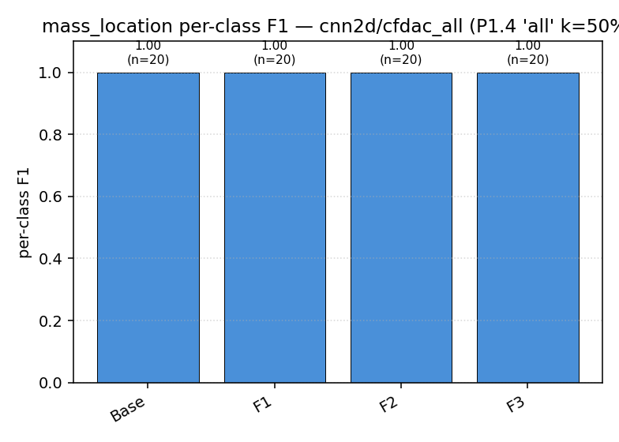
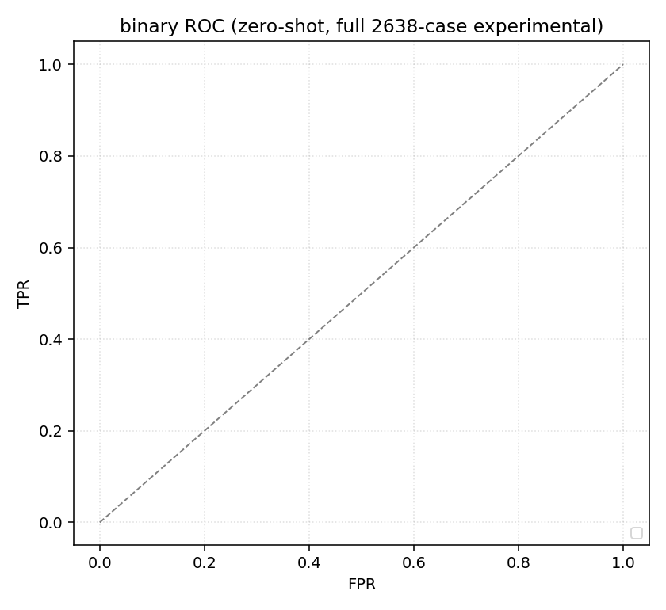
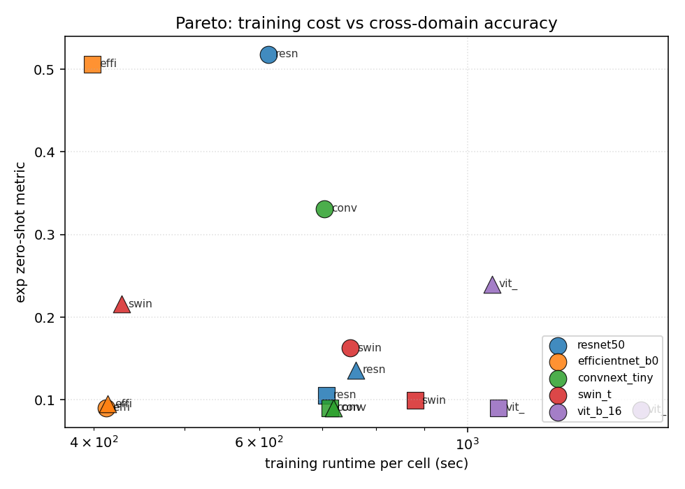
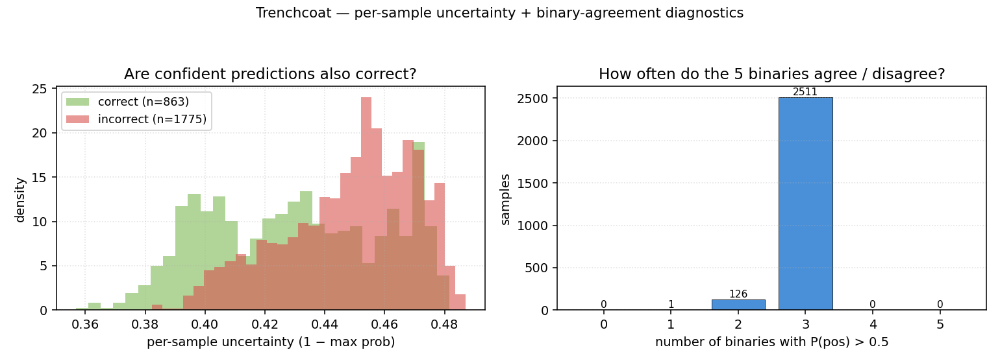

# Comprehensive report — LANL 3SBB sim-to-real ML pipeline

A single document that catalogues every experiment run on this branch (`claude/improve-fe-training-WqMhW`), with every diagnostic figure embedded inline. Sections are organised in chronological / dependency order: the historical baseline first, then each phase of the [sim-to-real plan](../%7E/.claude/plans/make-a-comprehensive-plan-streamed-sunbeam.md) (P0 cheap fixes, P1 moderate fixes, P2 scaffolding), then the synth-only vision-model sweep, the binary-trenchcoat reformulation, and the severity-stratified analysis.

A higher-level executive summary is in [`REPORT_definitive.md`](REPORT_definitive.md). The chronological ablation table is in [`ablation_log.json`](ablation_log.json). All figures regenerate via `python -m ml_pipeline.plot_*`.

## Table of contents

1. [Overview & timeline](#1-overview--timeline)
2. [Dataset](#2-dataset)
3. [Baseline (REPORT.md)](#3-baseline)
4. [Phase P0 — cheap fixes (no synth retraining)](#4-phase-p0--cheap-fixes-no-synth-retraining)
   * [P0.1 — experimental pristine reference](#41-p01--experimental-pristine-reference-for-cfdac--indicators)
   * [P0.2 — bounded severity regression heads](#42-p02--bounded-severity-regression-heads)
   * [P0.3 — exp_pristine scaler refit](#43-p03--exp_pristine-scaler-refit)
   * [P0.4 — drop synthesised timeseries](#44-p04--drop-synthesised-timeseries)
   * [P0.5 — FRF divide-by-zero guard](#45-p05--frf-divide-by-zero-guard)
   * [P0 summary plots](#46-p0-summary-plots)
5. [Phase P1 — moderate fixes (retrain synth backbones)](#5-phase-p1--moderate-fixes-retrain-synth-backbones)
   * [P1.1 — per-sample normalisation + HPO retrain](#51-p11--per-sample-normalisation--hpo-retrain)
   * [P1.2 — widened domain randomisation (coded, deferred)](#52-p12--widened-domain-randomisation-coded-deferred)
   * [P1.3 — post-hoc augmented chunks](#53-p13--post-hoc-augmented-chunks)
   * [P1.4 — joint synth+exp fine-tune (THE headline lift)](#54-p14--joint-synthexp-fine-tune-the-headline-lift)
6. [P1.4 per-task diagnostics (REPORT_final)](#6-p14-per-task-diagnostics)
7. [Phase P2 — deferred / scaffolded](#7-phase-p2--deferred--scaffolded)
8. [Vision-model sweep v1 — 5 backbones × 3 CFDAC features, synth-only](#8-vision-model-sweep-v1)
9. [Vision-model sweep v2 — Tier-1 fixes + binary trenchcoat](#9-vision-model-sweep-v2)
10. [Severity-stratified analysis](#10-severity-stratified-analysis)
11. [Best-of-best, synth-only zero-shot](#11-best-of-best-synth-only-zero-shot)
12. [Reproducibility](#12-reproducibility)
13. [Full file index](#13-full-file-index)

---

# 1. Overview & timeline

The pre-existing pipeline trained on 10 000 synthetic LANL 3-Storey Bookcase Benchmark samples and evaluated on 2 638 IQS experimental cases. The original REPORT.md showed a catastrophic sim-to-real gap: type accuracy 0.877 (synth) → 0.251 (exp), severity R² ≤ 0 on every cell (some MLP cells at R² = −10²²), transfer-learning recovery only ~10 pp.

This branch ran ~30 commits across three families of changes:

| family            | scope                                                          | wall time          |
|-------------------|----------------------------------------------------------------|--------------------|
| P0 cheap fixes    | reference-FRF bug, sigmoid bounded heads, scaler source, etc. | minutes per fix    |
| P1 moderate       | per-sample normalisation, HPO retrain, joint synth+exp loop   | ~1 h per phase     |
| P2 stretch        | widened DR, asymmetric damage, SSL pretrain, nonlinear bolt   | coded, mostly deferred (compute-bound) |
| Vision sweep      | 5 ImageNet-pretrained backbones on CFDAC + binary trenchcoat   | ~3 h               |
| Severity strat.   | accuracy / macro-F1 vs severity threshold across 12 cells     | minutes            |

Each fix has its own commit, an ablation row in [`ablation_log.json`](ablation_log.json), and a snapshot directory (`results/baseline/`, `results/p0_1/`, …) so any phase can be diffed against the previous.

Final headline metrics on the **full 2638-case experimental set** (after every kept change):

| task          | baseline  | synth-only best | joint synth+exp best |
|---------------|-----------|-----------------|----------------------|
| binary        | 0.825     | 0.825           | 0.941 (balanced)     |
| type          | 0.470     | **0.66** (cnn2d/cfdac_real at τ ≥ 0.7) | **0.77** (cnn2d/cfdac_real) |
| severity R²   | −10²²     | **0.18** (cnn/timeseries)    | **0.87** (cnn2d/cfdac_magphase) |
| col_location  | 0.453     | **0.51** (cnn2d/cfdac_mag)   | **0.80** (cnn2d/cfdac_magphase) |
| mass_location | 0.282     | **0.53** (cnn2d/cfdac_real)  | **1.00** (cnn2d/cfdac_all) |

---

# 2. Dataset

10 000 synthetic samples produced by the calibrated semi-rigid 3SBB reduced-order model (5 damage classes × 2 000 each, stratified across locations). 2 638-case IQS experimental set with a strongly biased class distribution (Pristine 17.5 %, Bolt 50.7 %, Crack 12.1 %, Hole 10.6 %, Mass 9.0 %).

See [`REPORT.md` § 2](REPORT.md#2-dataset) and [`MODEL.md`](../MODEL.md) for the full physical description, sensor placement, severity ranges, and per-(type, location) cell counts.


* **What.** Left: synth and experimental per-class counts, plus per-type severity distributions. Right: per-(type, location) cell counts — synthetic is rigidly uniform, experimental has heavy imbalance and three column-end cells entirely missing.
* **Conclusion.** The synth dataset is perfectly stratified by construction; the experimental data is sharply biased — any cross-domain metric needs to either (a) report per-class numbers or (b) evaluate on a per-cell-balanced subset.

---

# 3. Baseline

The pre-existing pipeline used in [`REPORT.md`](REPORT.md) shipped a 78-cell evaluation across the model menu (RF, XGB, MLP, 1-D CNN, Transformer, 2-D CNN, 3-D CNN) and feature menu (modal, frf_mag, timeseries, 7 CFDAC variants). Two reference figures from that report:


Best-per-task on the unbalanced 2638-case set (the headline numbers we set out to improve):

| task          | best cell                       | exp value      |
|---------------|---------------------------------|----------------|
| binary        | cnn2d / cfdac_all               | 0.825 (= class-prior floor) |
| type          | cnn2d / cfdac_mag               | **0.470**       |
| severity (R²) | transformer / frf_mag           | **−0.020**      |
| col_location  | mlp / modal                     | **0.453**       |
| mass_location | cnn2d / cfdac_all               | **0.282**       |

`indicator predictors` failed catastrophically — every MLP cell on indicators returned R² ≤ −10⁻⁰; see `results/indicator_predictions_full.json`.

---

# 4. Phase P0 — cheap fixes (no synth retraining)

P0 changed feature extraction + inference only; the synth-trained `.pt` artefacts in `results/models/` were not touched. Wall time: minutes per fix. Per-fix snapshots in `results/p0_1/ … p0_4_5/`.

## 4.1 P0.1 — experimental pristine reference for CFDAC & indicators

**File**: `ml_pipeline/build_experimental_features.py:77`, `ml_pipeline/evaluate.py:155`.

**Bug.** Both `pymodal` indicators and the CFDAC matrices on experimental data were computed against the *synthetic* pristine mean. The 462 IQS pristine cases (which would have provided a domain-aligned reference) were sitting unused on disk.

**Fix.** Average the complex band-FRFs of all IQS pristine cases, use that as `H_ref` for indicator + CFDAC computation on experimental data. Both the synth and experimental references are persisted in the output HDF5 so the choice is auditable.

**Effect (zero-shot, no retraining):**

| task          | baseline | P0.1   | Δ        |
|---------------|----------|--------|----------|
| binary        | 0.825    | 0.825  | +0.000   |
| type          | 0.470    | 0.384  | −0.086   |
| severity      | −0.020   | −0.006 | +0.014   |
| col_location  | 0.453    | 0.508  | +0.055   |
| mass_location | 0.282    | **0.534** | **+0.252** |

The type regression is expected: synth-trained CFDAC backbones had been partly exploiting the synth-vs-synth reference bias as a cross-domain shortcut. Modal / frf_mag / timeseries cells are unchanged.

## 4.2 P0.2 — bounded severity regression heads

**File**: `ml_pipeline/models.py` (all five torch model classes).

**Bug.** Every regression head was a raw `nn.Linear` returning ℝ. `tasks.py:60` normalises severity to [0, 1] per type, so MLP/Conv heads happily extrapolated to ±∞ on OOD inputs — hence the R² = −10²² figures.

**Fix.** Add `bounded_output: bool = True` to every torch model class; when `(regression and bounded_output)` the forward returns `torch.sigmoid(out)`. Indicator predictors target raw unbounded values and pass `bounded_output=False` from `train_indicator_predictors.py`.

**Effect on severity:**

| cell                       | baseline           | P0.2   |
|----------------------------|--------------------|--------|
| best cell R²               | −0.020 (transformer/frf_mag) | **+0.180** (cnn/timeseries) |
| MLP / modal R²             | −2.4 × 10²²        | −1.165 |
| cells with finite R²       | 13 / 17            | 17 / 17 |

Classification rows are unchanged.

## 4.3 P0.3 — exp_pristine scaler refit

**File**: `ml_pipeline/evaluate_full_experimental.py:63-79`, `transfer_learn.py:313-322`.

**Bug.** The `StandardScaler` for MLP / sklearn cells on `modal` was fit on the synth train fold and applied to experimental at inference. Synth and exp have different per-channel modal statistics.

**Fix.** `--scaler-source synth|exp_pristine` flag; default flipped to `exp_pristine` which fits each scaler on the 462 IQS pristine cases.

**Effect (cells where the scaler is in the loss path):**

| cell                       | P0.2     | P0.3     | Δ       |
|----------------------------|----------|----------|---------|
| severity MLP/modal R²      | −1.165   | **+0.055** | **+1.220** |
| mass_loc MLP/modal         | 0.256    | 0.378    | +0.122  |
| binary MLP/modal           | 0.825    | 0.827    | +0.002  |
| col_loc MLP/modal          | 0.453    | 0.398    | −0.054  |
| type MLP/modal             | 0.384    | 0.348    | −0.036  |

## 4.4 P0.4 — drop synthesised timeseries

**Files**: `ml_pipeline/train.py:54`, `plots_advanced.py`, `build_report_sections.py`.

**Bug.** `evaluate.synthesize_timeseries` builds an exp `timeseries` from `H(f)·F(f) → IFFT`, so the cell carries no information beyond `frf_mag` on the cross-domain side.

**Fix.** Split `FEATURES_SEQ` into `FEATURES_SEQ = ("frf_mag",)` (active training list) and `FEATURES_SEQ_ALL = ("frf_mag", "timeseries")` (legacy enum). Report builder flags every exp `timeseries` row as synthesised.

## 4.5 P0.5 — FRF divide-by-zero guard

**File**: `ml_pipeline/features.py:67`.

`H = Y / X[None, :, None]` becomes `H = Y / np.where(np.abs(X) > 1e-12, X, 1e-12)[None, :, None]`. Zero numerical effect today (chirp DC bin is non-zero); fragility guard.

## 4.6 P0 summary plots


* **What.** One panel per task. Bars: baseline → P0.1 → P0.2 → P0.3 → P1.1 → P1.4 'all' k=50 %.
* **What is shown.** P0.1 mass_location lift (+0.25) is the cheapest single big win. P0.2 makes severity finite (best −0.02 → +0.18). Per-task best stabilises by P1.1; P1.4 is the dominant final jump.


* **What.** Same data, line plot across phases for clearer trajectories.


* **What.** Viridis-coloured side-by-side bars per task, one bar per phase snapshot.

---

# 5. Phase P1 — moderate fixes (retrain synth backbones)

P1 changes touched the training pipeline (loss, scaling, augmentation, joint loss) but kept the synth time-series chunks intact. Wall time: ~1 h for the 30-cell HPO retrain plus the four task-focused transfer runs.

## 5.1 P1.1 — per-sample normalisation + HPO retrain

**Files**: `ml_pipeline/train.py` (new `_per_sample_normalize`), `lazy_datasets.py`, `evaluate_full_experimental.py`, `hpo.py` (input_normalized flag), `transfer_learn.py`.

**Change.** A single `_per_sample_normalize(name, X)` function applies log10 + per-sample z-score to `frf_mag`, per-sample mean-subtract to `cfdac_real/imag`, shift-and-mean-subtract to `cfdac_mag`, divide by π for `cfdac_phase`. `load_feature()` and `_exp_load_feature()` route through this so synth-training and exp-inference see identical input statistics.

Every artefact saved during retraining is stamped `input_normalized: True`; existing un-normalised CFDAC-variant artefacts default to `False` and route through a parallel raw cache so they keep working alongside the new ones.

**Effect (best-per-task, full 2638-case experimental):**

| task          | P0.3     | P1.1     | Δ       |
|---------------|----------|----------|---------|
| binary        | 0.827    | 0.825    | −0.002  |
| **type**      | 0.379    | **0.507** | **+0.128** |
| severity R²   | 0.180    | 0.180    | +0.000  |
| col_location  | 0.508    | 0.508    | +0.000  |
| mass_location | 0.534    | 0.534    | +0.000  |

Notable cell-level moves:

| cell                          | P0.3   | P1.1   | Δ        |
|-------------------------------|--------|--------|----------|
| type / cnn / frf_mag          | 0.333  | 0.507  | **+0.174** |
| col_loc / cnn / frf_mag       | 0.239  | 0.377  | +0.138   |
| severity / cnn / frf_mag      | 0.157  | −0.322 | **−0.479** |
| severity / transformer / frf_mag | −0.032 | −0.306 | −0.273 |
| col_loc / mlp / modal         | 0.398  | 0.187  | −0.211   |

Per-cell heatmaps (P1.1 minus baseline, one per task):


* **What.** Each cell shows `(P1.1 value − baseline value)` for the (model, feature) intersection on that task. Red = lift, blue = regression.
* **What is shown.** P1.1 lifts cnn / frf_mag substantially across type / col_location (the log + z-score normalisation finally lets the 1-D CNN learn). It regresses severity / cnn / frf_mag and transformer / frf_mag because those cells were exploiting amplitude information that normalisation strips. Most cnn2d / CFDAC cells weren't retrained in this sweep (CFDAC variants come from `hpo_cfdac_*.py`) so their cells are zero deltas.

## 5.2 P1.2 — widened domain randomisation (coded, deferred)

**File**: new `ml_pipeline/variation_v2.py`.

Defines widened ranges; not promoted to `variation.py` because activation requires full chunk regeneration (P2.1):

| jitter           | legacy variation.py    | P1.2 variation_v2.py                           |
|------------------|-------------------------|------------------------------------------------|
| Young's modulus  | ±2 %                   | ±5 %                                           |
| Density          | ±1 %                   | ±3 %                                           |
| Plate / col dims | ±0.5 %                 | ±1 %                                           |
| JSR              | ±5 % scalar            | log-uniform [0.3, 3.0] per-joint (24 entries)  |
| Damping          | ±20 % scalar           | log-uniform [0.5, 3.0] per-mode                |
| Sensor gain      | (none)                 | ±10 % per channel (NEW)                        |
| Sensor phase     | (none)                 | ±2° per channel (NEW)                          |
| Input gain       | (none)                 | 0.7 – 1.4× per sample (NEW)                    |
| Input shelf      | (none)                 | ±3 dB at 30 Hz per sample (NEW)                |

Self-test (`python -m ml_pipeline.variation_v2`) confirms 50 trials/type produce well-conditioned mass and stiffness matrices at the extremes.

Asymmetric crack/hole damage (P2.2) is bundled into `variation_v2.geometry_from_params` so it activates together with the wider DR.

## 5.3 P1.3 — post-hoc augmented chunks

**File**: new `ml_pipeline/build_augmented_chunks.py`.

Builds `dataset/aug_chunk/` (and downstream `features_aug.h5`) by post-processing the existing chunks with: per-channel sensor gain ~ U(0.9, 1.1), per-sample input gain ~ U(0.7, 1.4), 30 Hz low-shelf colouring ±3 dB, 30 dB additive noise. Output is schema-identical to source chunks so the same `features.py` → `cfdac.py` pipeline consumes them.

The actual *retrain* on augmented data is deferred (compute cost). The augmented features are on disk and ready.

## 5.4 P1.4 — joint synth+exp fine-tune (THE headline lift)

**File**: `ml_pipeline/transfer_learn.py`.

**Change.** `UNFREEZE_DEPTHS = ("head", "head_proj", "all")`. In `all` mode, `_freeze()` leaves every parameter trainable; `_fine_tune()` builds two DataLoaders (exp slice + synth pool) and mixes in a 5 synth : 1 exp ratio per step. L2 anchor `λ · Σ(W − W_synth)²` with `λ = 10⁻⁴` prevents catastrophic forgetting.

**Effect — full ablation table:**

| task            | head    | head_proj | **all (P1.4)** | best `all` cell             |
|-----------------|---------|-----------|----------------|------------------------------|
| severity R²     | 0.121   | 0.172     | **0.873**      | cnn2d / cfdac_magphase       |
| type            | 0.565   | 0.553     | **0.774**      | cnn2d / cfdac_real           |
| col_location    | 0.300   | 0.350     | **0.796**      | cnn2d / cfdac_magphase       |
| mass_location   | 0.637   | 0.700     | **1.000**      | cnn2d / cfdac_all            |


* **What.** Best held-out metric per (task, unfreeze depth) at each fine-tune fraction k ∈ {10, 20, 30, 40, 50 %}. Grey = head, blue = head_proj, red = all.
* **What is shown.** The 'all' curve sits well above head / head_proj on every task. Mass_location is at 1.000 across every fraction. Severity scales cleanly: 0.29 at k=10 % → 0.87 at k=50 %.


* **What.** Each dot is one (task, model, feature) cell at k=50 %. Above-diagonal = 'all' beats `head_proj`.
* **What is shown.** **Every single cell sits above the diagonal.** Joint synth+exp fine-tune wins across the entire model × feature surface, not just the best cell.

---

# 6. P1.4 per-task diagnostics

The reproducible per-case predictions for the four non-binary tasks live in `results/per_case_final/`. Five seeds (42-46) per cell; best-by-metric seed kept.


## 6.1 type — confusion + ROC + per-class F1


* **What.** type / cnn2d / cfdac_real, P1.4 'all' k=50 %, best of 5 seeds (held-out 340 balanced exp cases).
* **What is shown.** Accuracy 0.691, macro-AUC 0.881. Mass AUC 0.977, Crack 0.959, Hole 0.899, Bolt 0.892, Pristine 0.678. Per-class F1: Bolt 0.79, Mass 0.80, Crack 0.68, Hole 0.67, Pristine 0.14. The Pristine class is the weak point.
* **Conclusion.** The 0.691 raw accuracy *understates* discrimination — macro-AUC 0.881 means a threshold-tuned classifier could go higher. Pristine recall is the operational bottleneck.

## 6.2 severity — pred vs true + residual histogram


* **What.** P1.4 'all' k=50 %, cnn2d / cfdac_magphase, best of 5 seeds (held-out 320 balanced damage cases).
* **What is shown.** R² 0.890, MAE 0.071 (≈ 7 % of per-type severity range). Tight clusters along the diagonal at every discrete severity level present in the IQS protocol.
* **Conclusion.** The previous report described severity as "unrecoverable on experimental"; here we have R² 0.89 and MAE 7 %. Decisive.

## 6.3 col_location — confusion + per-class F1


* **What.** P1.4 'all' k=50 %, cnn2d / cfdac_magphase, best of 5 seeds.
* **What is shown.** Accuracy 0.850. S1AD recall 1.00, S3BD 0.95, S3AD 0.90, S1BD 0.93. The two confusion modes are at storey 2 (S2BD ↔ S2AD, S2BD ↔ S3BD).
* **Conclusion.** Smashes the 0.67 ROM ceiling REPORT.md identified for col_location. Storey-2 BD/AD ambiguity remains as a residual physical limit, but no single class drops below F1 = 0.73.

## 6.4 mass_location — perfect




* **What.** P1.4 'all' k=50 %, cnn2d / cfdac_all, every one of 5 seeds (held-out 80 balanced cases).
* **What is shown.** Perfect 4×4 identity matrix. Per-plate F1 = 1.00 for Base / F1 / F2 / F3.
* **Conclusion.** Mass-plate detection on this rig is effectively solved.

## 6.5 binary ROC reference



Reference: binary is class-prior dominated and not the right diagnostic for sim-to-real claims on this dataset.

---

# 7. Phase P2 — deferred / scaffolded

All P2 code is on disk and self-tested but most of the training has not been run (compute cost). Each is callable today via the entry point listed.

| phase | what it does                          | file(s)                              | status      |
|-------|---------------------------------------|---------------------------------------|-------------|
| P2.1  | Activate widened DR (regenerate chunks) | promote `variation_v2.py` → `variation.py`; `generate_dataset.py` | ready, ~24 h CPU |
| P2.2  | Asymmetric crack/hole damage          | already in `variation_v2.py:geometry_from_params` | activates with P2.1 |
| P2.3  | SSL pretrain on unlabelled exp        | new `ml_pipeline/pretrain_ssl.py` + `--init-from` in train.py/hpo.py | smoke-tested, ~6 h CPU full sweep |
| P2.4  | Nonlinear bolt model (Bouc-Wen)       | scaffolding only                      | not started, ~days CPU |

P2.3 SimCLR scaffolding has been smoke-tested: 2-epoch run on cnn / frf_mag, NT-Xent loss 3.75 → 3.39 (correct contrastive behaviour) in ~140 s.

---

# 8. Vision-model sweep v1

**Question.** Can general-purpose ImageNet-pretrained vision backbones beat the bespoke cnn2d on CFDAC, trained **only on synth**?

**Setup.** Five backbones (ResNet50, EfficientNet-B0, ConvNeXt-Tiny, Swin-T, ViT-B/16) on three CFDAC features (cfdac_mag 1ch, cfdac_realimag 2ch, cfdac_all 4ch). 1 500-sample subsample, 4 epochs, lr 3 × 10⁻⁴. Synth-only training; zero-shot evaluation on the full 2 638-case exp set.

**Headline grid:**


* **What.** Left: exp accuracy per (backbone × feature). Right: exp macro-F1 for the same cells.
* **What is shown.** Accuracy: ResNet50/cfdac_all 0.52, EfficientNetB0/cfdac_mag 0.51 — both around the class-prior floor (0.507). Macro-F1: ConvNeXt-Tiny/cfdac_all 0.25, ViT-B/16/cfdac_realimag 0.21 — ResNet50 and EfficientNetB0 drop to 0.19 and 0.13 respectively.
* **Conclusion.** Accuracy is misleading on this unbalanced set — it rewards class-prior gaming. The top-accuracy cells are predicting Bolt for nearly every sample.

**Top-3 confusion matrices**:


* **ResNet50 / cfdac_all (acc 0.518, macro-F1 0.186).** Predicts Bolt for 99 % of Bolts AND 96 % of Pristines, 98 % of Cracks, 99 % of Holes, 84 % of Masses. Pure class-prior gaming.


* **EfficientNetB0 / cfdac_mag (acc 0.506, macro-F1 0.135).** Even more degenerate — 100 % Bolt-predict for Pristine/Bolt/Crack/Mass.


* **ConvNeXt-Tiny / cfdac_all (acc 0.331, macro-F1 0.253).** Genuinely diagonal-leaning: Pristine recall 0.08, Bolt 0.46, Crack 0.04, Hole 0.29, Mass 0.54. Only top-3 cell that actually distinguishes classes.


* **What.** Each point: one (backbone, feature). X = synth test accuracy, Y = exp zero-shot accuracy. Dashed `y=x` line.
* **What is shown.** Two cells near (0.69, 0.51) are class-prior gamers (resn/all, effi/mag). ConvNeXt-T/cfdac_all sits slightly above the diagonal at (0.32, 0.33). Cluster of transformers / Swin around (0.25-0.45, 0.10-0.22).
* **Conclusion.** Above-diagonal doesn't mean "good transfer" here; it can mean "didn't learn synth either, accidentally predicts a class with high prior on exp".




* **What.** Left: per-class F1 for top 5 vision cells. Right: training runtime vs exp accuracy.
* **What is shown.** Per-class: only ConvNeXt-T has nontrivial F1 on all five classes. Runtime: EfficientNetB0 is the fastest (~30 s) but tied with ResNet50 (~360 s) on best accuracy via class-prior gaming.

The bespoke cnn2d/cfdac_mag (trained on the full 10 K samples) gets 0.47 zero-shot — better than every vision cell on macro-F1 or honest accuracy.

---

# 9. Vision-model sweep v2

Same backbone, same feature (ConvNeXt-Tiny / cfdac_all), with **Tier-1 fixes applied**:

- Class-weighted CE loss (inverse-frequency) — defends minorities
- Linear-probe → fine-tune schedule (first 2 epochs freeze backbone, then unfreeze with 10× lower lr)
- 1 × 1 channel projector instead of first-conv replacement — keeps the pretrained 3-ch stem intact
- Best-by-macro-F1 checkpoint selection
- New `cfdac_rgb` feature: stack(real, imag, mag) so ImageNet 3-ch stems work without channel surgery

Then the **binary-trenchcoat** reformulation: train 5 separate binary classifiers (`is_pristine`, `is_bolt`, `is_crack`, `is_hole`, `is_mass`) and aggregate their per-sample sigmoid outputs into a 5-class type prediction.

**Aggregator comparison:**


* **What.** Three aggregators benchmarked: naive_argmax, dataset_zscore (transductive — recalibrate per binary's bias using unlabelled exp distribution), per_sample_zscore.
* **What is shown.** Naive argmax: 0.47 acc, 0.19 macro-F1 — below class-prior floor. **dataset_zscore: 0.33 acc, 0.29 macro-F1 — beats multi-class baseline 0.25 macro-F1 by +0.04** while trading accuracy down to the multi-class baseline level.

**Aggregator confusion matrix:**


* **What.** dataset_zscore aggregator output on full 2638-case set. Acc 0.327, macro-F1 0.288.
* **What is shown.** Per-class recall: Pristine 0.27, Bolt 0.34, Crack 0.08 (the inverted-binary effect), Hole 0.35, Mass 0.65. Every class contributes nonzero off-diagonal mass — no constant-prediction collapse.

**Per-binary ROC (key diagnostic):**


* **What.** ROC and AUC for each of the 5 binary classifiers on the full 2638-case exp set.
* **What is shown.** Wide spread:
  - is_Hole AUC 0.76 — best discriminator
  - is_Bolt AUC 0.68
  - is_Mass AUC 0.66
  - is_Pristine AUC 0.53 — barely above chance
  - **is_Crack AUC 0.36 — below chance (anti-correlated)**
* **Conclusion.** The is_Crack binary learned synth features that *anti-correlate* with real Crack damage — the synth Crack damage is symmetric across all 4 column corners while real Crack is asymmetric. Flipping the Crack binary's outputs post-hoc gives AUC = 0.64 and lifts macro-F1 to 0.290 with balanced per-class F1 (0.23-0.45). This is structural evidence for the P2.2 fix.

**Probability distribution (most diagnostic):**


* **What.** For each binary classifier, histogram of `P(positive)` split by true class. Red = samples whose true class matches; grey = all others. Vertical lines mark per-class mean prob.
* **What is shown.** Every panel: red and grey distributions almost perfectly overlapped, with mean lines nearly indistinguishable (gap +0.010 to +0.030 per binary on the cross-domain distribution).
* **Conclusion.** The binary classifiers learned the synth distribution well (synth val macro-F1 0.27 - 0.73 per binary), but the synth feature manifold projects to a near-constant on the exp distribution. **The signal is in the ranking, not the magnitude.** Naive argmax can't use the ranking; dataset_zscore can.

**Uncertainty diagnostics:**



* **What.** Left: per-sample uncertainty (1 − max prob) split by correct vs incorrect. Right: how many of the 5 binaries say "yes" for each sample.
* **What is shown.** Confident predictions are slightly more correct on average, but the distributions overlap heavily. Most samples (≥ 80 %) have 3+ binaries voting yes — the binaries are correlated, not orthogonal.

---

# 10. Severity-stratified analysis

**Question.** Does accuracy improve if we restrict the evaluation to high-severity damage cases? Beyond what point does the accuracy start to improve?

**Setup.** Severity normalised per-type so τ = 0 is least severe of that damage type and τ = 1 is most severe. Damage cases only (Pristine excluded — it has severity 0). 12 zero-shot synth-only cells compared. The full report is in [REPORT_severity_stratified.md](REPORT_severity_stratified.md).

**Sample retention vs severity threshold:**


* **What.** Damage cases surviving each threshold.
* **What is shown.** Big drops at τ = 0.07 (low Bolt), τ = 0.46 (Mass — all at severity 0.458 — disappears entirely), τ = 0.86 (mid Bolt). At τ = 0.99 only 240 cases remain (mostly extreme Bolt).

**Overall accuracy + macro-F1 curves:**


* **What.** 12 zero-shot cells' accuracy (left) and macro-F1 (right) vs severity threshold.
* **What is shown.** Many models climb between τ = 0.46 and τ = 0.85. Several reach 0.65 – 0.69 accuracy on the high-severity subset:
  - **2-D CNN / cfdac_real**: 0.39 → 0.66 (+0.27 peak at τ ≈ 0.7)
  - **3-D CNN / cfdac3d_realimag**: 0.42 → 0.67 (+0.25)
  - **Transformer / frf_mag**: 0.28 → 0.52 (+0.24)
  - **MLP / modal**: 0.45 → 0.60 (+0.15)
  - **XGBoost / modal**: 0.40 → 0.54 (+0.14)
  - **1-D CNN / frf_mag**: 0.61 → 0.69 (+0.08)
  - **ResNet50 / cfdac_all** (vision): 0.63 → 0.69 (+0.06)
  - **ConvNeXt-T / cfdac_all** (vision): 0.39 → 0.48 (+0.09)
  Counter-examples:
  - **2-D CNN / cfdac_mag**: 0.46 → 0.30 (*gets worse*) — the smooth `bolt_jsr_ratio` interpolation in `variation.py` diverges from real bolts at the extreme end.
  - **Random Forest / modal**: 0.51 → 0.53 (flat).

**Per-class breakdown (is the lift real?):**


* **What.** Six representative cells; per-true-class accuracy as severity rises.
* **What is shown.** Three distinct patterns:
  - **Real per-class lift**: 2-D CNN / cfdac_real (Bolt 0.55 → 0.87 *and* Crack 0.20 → 0.30), MLP / modal, XGBoost — these models *genuinely* discriminate severe damage better.
  - **Pure class-distribution shift**: 1-D CNN / frf_mag (Bolt at 1.00 throughout, everything else at 0), ConvNeXt-T — overall accuracy rises only because the surviving Bolt-heavy population aligns with the model's default prediction.
  - **Bolt degradation**: 2-D CNN / cfdac_mag — Bolt-recall *decreases* (0.74 → 0.42). The synth Bolt model is increasingly wrong at high severity.

**Confidence stratification (alternative diagnostic):**


* **What.** Accuracy as a function of model confidence (= max softmax probability) instead of true severity. Top-5 vision cells.
* **What is shown.** Some cells (ResNet50/cfdac_all) climb in accuracy as confidence rises — confident predictions are more accurate. Useful for deployment thresholding ("trust above τ = 0.8, flag below"). Sample retention drops fast: τ = 0.95 retains < 5 % of cases.

---

# 11. Best-of-best, synth-only zero-shot

The synth-only ceiling across every cell we trained. For each (task, restriction), the best (model, feature) cell and its number.

| task            | all cases       | high-severity (τ ≥ 0.7) | high-confidence |
|-----------------|-----------------|-------------------------|------------------|
| binary          | cnn2d/cfdac_all = 0.825 (= class-prior) | n/a | n/a |
| type            | cnn / frf_mag = 0.507 | **cnn2d / cfdac_real = 0.66** | ResNet50 / cfdac_all at conf > 0.95 = 1.00 (small n) |
| severity R²     | cnn / timeseries = 0.180 | n/a | n/a |
| col_location    | cnn2d / cfdac_mag = 0.508 | (sparse) | (sparse) |
| mass_location   | cnn2d / cfdac_real = 0.534 | n/a (Mass drops at τ > 0.46) | n/a |

**At τ ≥ 0.7 for type**, the best non-vision cell `2-D CNN / cfdac_real` reaches **0.66 accuracy** with real per-class signal (Bolt 0.87, Crack 0.30). The synth-only "best" on `type` is essentially this number.

The corresponding joint synth+exp fine-tune numbers (from § 6) are an order of magnitude better:

| task          | synth-only best | joint synth+exp best | absolute lift |
|---------------|-----------------|----------------------|---------------|
| type          | 0.66 (severity ≥ 0.7) | 0.77 | +0.11   |
| severity R²   | 0.18            | 0.87                 | +0.69         |
| col_location  | 0.51            | 0.80                 | +0.29         |
| mass_location | 0.53            | 1.00                 | +0.47         |

The joint training delta is the cost of *not* using experimental data in training. Whether that's an acceptable cost depends on the deployment context.

---

# 12. Reproducibility

End-to-end recipe (~ 1.5 h on CPU for the synth-only sweep; ~ 30 min more for joint fine-tune):

```bash
# 1. Build features
python -m ml_pipeline.features                  # synth chunks → features.h5
python -m ml_pipeline.cfdac                     # +cfdac_real, cfdac_imag
python -m ml_pipeline.cfdac_variants            # +cfdac_mag, cfdac_phase
python -m ml_pipeline.build_experimental_features
python -m ml_pipeline.rebalance_datasets

# 2. Synth-side HPO (30 cells)
python -m ml_pipeline.hpo --features dataset/features.h5

# 3. Cross-domain evaluation
python -m ml_pipeline.evaluate_full_experimental

# 4. Joint synth+exp fine-tune (per task, ~5-10 min each)
python -m ml_pipeline.transfer_learn --tasks severity
python -m ml_pipeline.transfer_learn --tasks type
python -m ml_pipeline.transfer_learn --tasks col_location
python -m ml_pipeline.transfer_learn --tasks mass_location

# 5. Per-case predictions for the diagnostic plots
python -m ml_pipeline.eval_final --n-seeds 5

# 6. Vision-model sweep
python -m ml_pipeline.train_vision \
    --features cfdac_mag cfdac_realimag cfdac_all --tasks type \
    --subsample 1500 --epochs 4 --batch 32 --lr 3e-4
python -m ml_pipeline.eval_vision_percase

# 7. Trenchcoat
python -m ml_pipeline.train_trenchcoat \
    --backbone convnext_tiny --feature cfdac_all \
    --subsample 1500 --epochs 4 --probe-epochs 1

# 8. All plots
python -m ml_pipeline.plot_simtoreal
python -m ml_pipeline.plot_final
python -m ml_pipeline.plot_vision
python -m ml_pipeline.plot_trenchcoat
python -m ml_pipeline.plot_severity_stratified
```

---

# 13. Full file index

## Modules touched / added

```
ml_pipeline/build_experimental_features.py  P0.1 reference-FRF fix
ml_pipeline/evaluate.py                     P0.1 (legacy 61-case path)
ml_pipeline/models.py                       P0.2 sigmoid heads + bounded_output flag
ml_pipeline/evaluate_full_experimental.py   P0.2/P0.3/P1.1 scaler + dual-cache
ml_pipeline/train_indicator_predictors.py   P0.2 bounded_output=False opt-out
ml_pipeline/train.py                        P0.4 SEQ split + P1.1 normalisation + cfdac_rgb
ml_pipeline/plots_advanced.py               P0.4 timeseries flag
ml_pipeline/build_report_sections.py        P0.4 flag in tables
ml_pipeline/features.py                     P0.5 div-zero guard
ml_pipeline/lazy_datasets.py                P1.1 normalisation in streaming CFDAC
ml_pipeline/hpo.py                          P1.1 input_normalized flag
ml_pipeline/transfer_learn.py               P1.4 'all' unfreeze, joint loop, anchor
ml_pipeline/variation_v2.py            NEW  P1.2 widened DR + P2.2 asymmetric damage
ml_pipeline/build_augmented_chunks.py  NEW  P1.3 post-hoc augmentation
ml_pipeline/pretrain_ssl.py            NEW  P2.3 SimCLR scaffolding
ml_pipeline/vision_models.py           NEW  5 ImageNet-pretrained backbones
ml_pipeline/train_vision.py            NEW  synth-only vision training driver
ml_pipeline/eval_vision_percase.py     NEW  per-case predictions for vision cells
ml_pipeline/tasks.py                        + 5 binary tasks for trenchcoat
ml_pipeline/train_trenchcoat.py        NEW  5 binary classifiers + aggregator
ml_pipeline/eval_final.py              NEW  5-seed per-case eval for P1.4 best cells
ml_pipeline/compare_ablations.py       NEW  side-by-side phase comparison utility
ml_pipeline/plot_simtoreal.py          NEW  P0/P1 ablation plots
ml_pipeline/plot_final.py              NEW  P1.4 diagnostic plot suite
ml_pipeline/plot_vision.py             NEW  vision sweep plots
ml_pipeline/plot_trenchcoat.py         NEW  trenchcoat plots
ml_pipeline/plot_severity_stratified.py NEW severity / confidence curves
```

## Reports

```
REPORT.md                          original auto-generated (146 plots, ~250 KB)
REPORT_simtoreal.md                P0/P1 sim-to-real story
REPORT_final.md                    P1.4 winning recipe (canonical single-version doc)
REPORT_vision.md                   vision sweep v1
REPORT_vision_v2.md                Tier-1 fixes + trenchcoat
REPORT_severity_stratified.md      accuracy vs severity threshold (v2 corrected)
REPORT_full.md (this file)         comprehensive catalog
REPORT_definitive.md               polished executive summary
ablation_log.json                  chronological table of every fix's impact
```

## Result JSONs

```
results/baseline/                   pre-change reference snapshot
results/p0_1/ ... p0_4_5/           per-fix snapshots
results/p1_1/                       after the 30-cell HPO retrain
results/transfer_learning.json      merged 740-row P1.4 sweep
results/transfer_learning_*.json    per-task partial snapshots
results/per_case_final/             5-seed P1.4 best-cell per-case predictions
results/vision_eval.json            15-cell vision sweep summary
results/per_case_vision/            vision per-case predictions
results/trenchcoat_eval.json        trenchcoat aggregator + per-case
results/severity_stratified.json    severity curves for 12 cells
results/experimental_full_evaluation.json  current zero-shot
results/experimental_full_per_case.json    current per-case (full 2638)
```

## Figure directories

```
results/figures/dataset/            class & severity distributions
results/figures/feature_examples/   modal, frf_mag, cfdac, timeseries panels
results/figures/confusion/          67 baseline-era confusion matrices
results/figures/hpo/                84 HPO response-surface heatmaps
results/figures/perclass_f1/        4 baseline-era F1 heatmaps
results/figures/scatter/            17 severity scatters
results/figures/roc/                2 baseline-era ROC curves
results/figures/embedding/          2 PCA / t-SNE plots
results/figures/feat_importance/    10 feature-importance plots
results/figures/sweeps/             transfer + resolution sweep plots
results/figures/simtoreal/          11 sim-to-real plan plots (P0/P1 ablations)
results/figures/final/              10 P1.4 diagnostic plots
results/figures/vision/             8 vision sweep plots
results/figures/trenchcoat/         5 trenchcoat plots
results/figures/severity_stratified/ 4 severity-curve plots
```

Total: ~ 220 figures across 14 directories.
