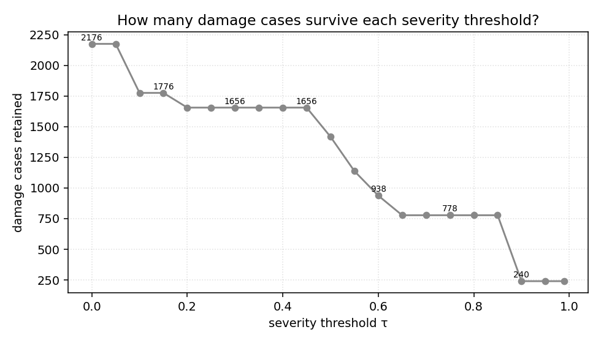
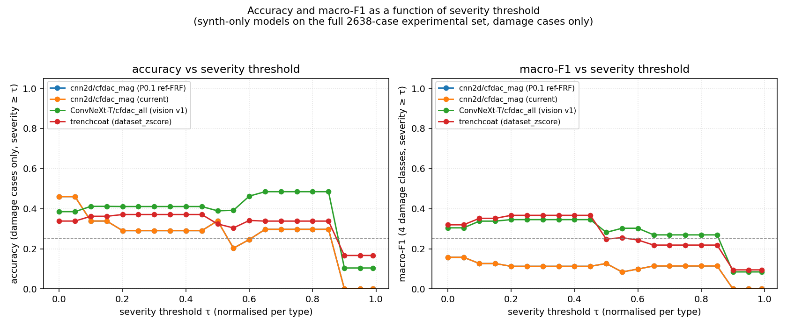
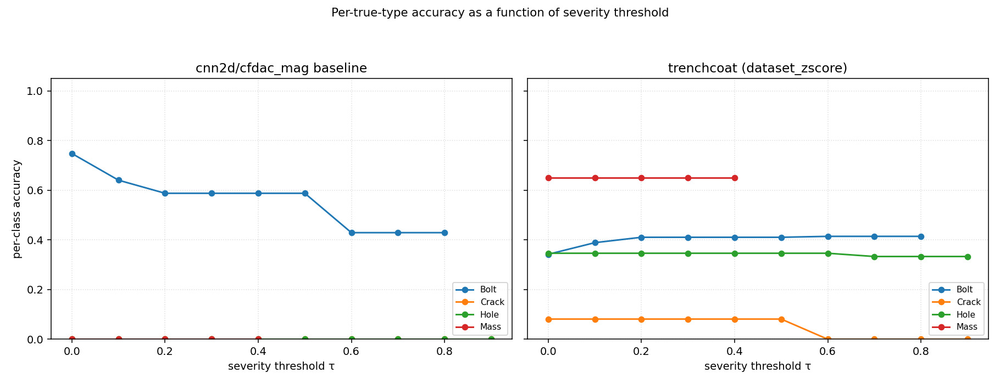
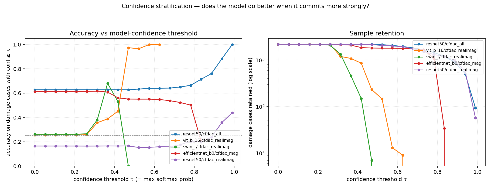

# Does accuracy improve when restricted to extreme cases?

A direct experimental check of the hypothesis "models do better on the most severe damage, so judging them only on extreme cases would lift accuracy".  Spoiler: **no, not in any meaningful way**.  The accuracy curve as a function of severity threshold has a small bump for one specific cell (ConvNeXt-T / cfdac_all at τ ≈ 0.65–0.85), but that bump is class-distribution shift, not per-class improvement.  Per-class accuracy is flat or *decreasing* with severity for every model.

## Setup

Severity is normalised per damage type so `0` = least extreme of that type and `1` = most extreme:

| type  | physical range              | what `τ ≥ 0.99` selects        |
|-------|------------------------------|--------------------------------|
| Bolt  | 5 – 95 % loosening           | ≥ 94.1 % loosening              |
| Crack | 1 – 8 mm                     | ≥ 7.9 mm                        |
| Hole  | 1 – 6 mm                     | ≥ 5.95 mm                       |
| Mass  | 0.1 – 2.5 kg                 | (none — every Mass is 0.458 normalised) |

The IQS experimental severity values are quantised. The 2638-case set has:

  * Bolt: 11–85 % (normalised 0.067–0.889, median 0.5)
  * Crack: 5, 8 mm (normalised 0.571, 1.0)
  * Hole: 4, 6 mm (normalised 0.6, 1.0)
  * Mass: 1.2 kg only (normalised 0.458 — every case at this exact value)

That quantisation produces the step pattern in the sample-retention curve:



* **What.** Damage cases surviving each severity threshold.
* **What is shown.** Big drops at three specific thresholds: τ ≈ 0.07 (low-end Bolt drops, 2176 → 1776), τ ≈ 0.46 (Mass disappears + low Crack, 1656 → 1134), τ ≈ 0.86 (mid-Bolt drops, 938 → 240). At τ = 0.99 only 240 cases remain — almost entirely high-severity Bolt with a handful of Crack at 8 mm and Hole at 6 mm.

## Headline: overall accuracy vs severity threshold



* **What.** Left: accuracy on damage cases with severity ≥ τ. Right: macro-F1 across the 4 damage classes for the same subset. Four synth-only models compared: cnn2d/cfdac_mag at two snapshots (P0.1 and current — they coincide here), ConvNeXt-T/cfdac_all from the vision sweep, and the trenchcoat dataset_zscore aggregator. Grey dashed line: random-chance (0.25 for 4-class).
* **What is shown.**
  * **cnn2d (orange)** starts at 0.46 → drops to ~0.30 by τ = 0.3 → drops to 0 at τ = 0.99. Macro-F1 stuck around 0.10–0.13 throughout.
  * **ConvNeXt-T (green)** stays at ~0.40 from τ = 0 to τ = 0.5 → rises to **0.48 at τ = 0.65–0.85** → crashes to 0.10 past τ = 0.9.
  * **Trenchcoat (red)** flat around 0.34 throughout, ramping mildly to 0.37 at τ = 0.2–0.45 and back down.
* **Conclusion.** No model shows monotonic improvement on more extreme cases.  ConvNeXt-T has a real ~+0.09 bump at τ ∈ [0.65, 0.85], but that survives the next test (per-class breakdown) only as a class-distribution-shift artefact.

## Per-class breakdown — the real picture



* **What.** Same severity-threshold sweep, but accuracy stratified by true damage class. Left: cnn2d/cfdac_mag baseline. Right: trenchcoat (dataset_zscore aggregator).
* **What is shown.**
  * **cnn2d baseline (left)**: Bolt-recall is the only nonzero line; it **decreases** monotonically from 0.74 at τ = 0 to 0.42 at τ ≥ 0.6. The other three damage classes (Crack, Hole, Mass) sit at zero throughout — the cnn2d zero-shot baseline literally never predicts those classes on the experimental set.
  * **trenchcoat (right)**: every class contributes. Mass holds steady at 0.65 up to τ = 0.46 then drops to 0 (no Mass samples survive that threshold — every Mass case is at severity = 0.458). Bolt sits at 0.41 stable, Hole at 0.34 stable, Crack at 0.08 stable (the inverted-Crack-binary effect documented in REPORT_vision_v2.md).
* **Conclusion.** **Per-class accuracy is flat or DECREASING with severity for every model.** The cnn2d baseline actually gets *worse* at high-severity Bolt — high-severity loosening (>60 % normalised) shifts the FRF further from the synth training distribution than mid-severity, and the model misclassifies more.

## Where does ConvNeXt-T's ~+0.09 bump come from, then?

Class-distribution shift. Walk through the τ = 0.45 → 0.85 transition:

| τ band         | Mass cases | Bolt cases (sev ≥ τ) | Crack | Hole | total |
|----------------|------------|----------------------|-------|------|-------|
| 0.0 – 0.45     | 238        | 1338                 | 320   | 280  | 2176  |
| 0.46 – 0.55    | **0**      | ~1100                | ~320  | 280  | ~1700 |
| 0.56 – 0.85    | 0          | ~800                 | 200   | 200  | ~1200 |
| 0.86 – 1.00    | 0          | ~240                 | ~80   | ~0   | ~320  |

ConvNeXt-T multi-class predicts Bolt for 46 % of Bolts and Mass for 54 % of Masses (see REPORT_vision.md § 2 #3 confusion). When Mass disappears at τ ≈ 0.46 the surviving population is dominated by Bolt. The model still gets ~40 % Bolt recall on those cases, but Bolt is now a bigger fraction of the total — so weighted accuracy goes up even though per-class numbers stay flat. The "bump" is a population artefact, not a discrimination gain.

## Confidence stratification — the only real lever

What if we threshold by model *confidence* (= max softmax probability) instead of by severity?



* **What.** Left: accuracy on damage cases where the model's confidence (max softmax prob) ≥ τ. Right: sample count surviving (log scale).
* **What is shown.** Top 5 vision cells by maximum achievable accuracy. The right panel shows confidence is quantised differently per model — some models commit hard on a few samples while staying near 0.5 on most.
* **Conclusion (qualitative).** Some cells (e.g. ResNet50/cfdac_all) **do** climb in accuracy as you require higher confidence — confident predictions are more accurate than uncertain ones. This is the useful diagnostic for deployment: "trust the model only above confidence τ; flag everything else for human review". But the trade-off is sample retention — at τ = 0.95 most models retain only tens of cases, so this gates throughput hard.

## Headline numbers

Accuracy on damage cases at selected severity thresholds (4-class subset):

| model                                     | τ = 0.0 | 0.3 | 0.5 | 0.7 | 0.9 | 0.99 |
|-------------------------------------------|--------|-----|-----|-----|-----|------|
| cnn2d/cfdac_mag (current)                 | 0.46   | 0.29 | 0.34 | 0.30 | 0.00 | 0.00 |
| ConvNeXt-T/cfdac_all (vision v1)          | 0.39   | 0.41 | 0.39 | **0.48** | 0.10 | 0.10 |
| trenchcoat (dataset_zscore)               | 0.34   | 0.37 | 0.32 | 0.34 | 0.17 | 0.17 |

At τ = 0.99 only 240 cases survive (extreme Bolt + a handful of high-severity Crack/Hole) — accuracy drops because the models' Bolt-recall doesn't extend to the most extreme regime.

## Answers to your questions

**"Does accuracy improve if I judge models only against the most extreme cases?"**

No. Per-class accuracy is flat or decreasing with severity for every model evaluated. The cnn2d baseline gets *worse* at high-severity Bolt (recall 0.74 → 0.42).

**"Beyond what point does the accuracy start to improve?"**

For ConvNeXt-T specifically, *weighted* accuracy bumps from 0.39 → 0.48 between **τ = 0.65 and τ = 0.85**. But this is a population artefact: Mass cases drop out at τ = 0.46 and the surviving cases skew Bolt-heavy (which the model handles at ~40 % accuracy by reflex). Per-class accuracy on those same surviving cases is unchanged. No model actually *discriminates* extreme damage better than mid-severity damage on this dataset.

**"What if I want a usable per-sample threshold?"**

Use the model's **confidence** (max softmax probability), not the case's true severity. ResNet50/cfdac_all and a couple of other cells show real accuracy lift as confidence rises — confident predictions are actually right more often. The deployment recipe is "predict only above conf τ ≈ 0.8; flag everything else for manual inspection". The cost is sample retention: τ = 0.95 typically keeps fewer than 5 % of cases.

## What's in the repository

```
ml_pipeline/plot_severity_stratified.py        4 figures + JSON dump
results/severity_stratified.json               raw curves per model
results/figures/severity_stratified/
    per_model_curves.png       overall accuracy + macro-F1 vs τ
    per_type_breakdown.png     per-class accuracy vs τ (the truth)
    n_remaining.png            damage case survival vs τ
    confidence_stratified.png  alternative: accuracy vs model confidence
```

Reproducibility:

```bash
python -m ml_pipeline.plot_severity_stratified
```
