# Sim-to-real plan — companion report to `REPORT.md`

This report documents the 21-commit sim-to-real remediation sweep on branch `claude/improve-fe-training-WqMhW`. It is a companion to [`REPORT.md`](REPORT.md): the dataset, model definitions, feature catalogue and HPO grids in REPORT.md still apply. This document focuses on what changed, what each phase moved on which metric, the per-task narratives, and what's left on the table.

The plan that drove these changes lives at `~/.claude/plans/make-a-comprehensive-plan-streamed-sunbeam.md`. Every figure is reproducible via `python -m ml_pipeline.plot_simtoreal`.

## Table of contents

1. [Executive summary](#1-executive-summary)
2. [Diagnostic baseline](#2-diagnostic-baseline)
3. [Phase summaries — P0 (cheap)](#3-phase-summaries--p0-cheap)
4. [Phase summaries — P1 (moderate)](#4-phase-summaries--p1-moderate)
5. [Phase summaries — P2 (deferred)](#5-phase-summaries--p2-deferred)
6. [Per-task narratives](#6-per-task-narratives)
7. [Headline figures](#7-headline-figures)
8. [Per-cell ablation heatmaps](#8-per-cell-ablation-heatmaps)
9. [Lessons learned](#9-lessons-learned)
10. [Outstanding work](#10-outstanding-work)
11. [Reproducibility](#11-reproducibility)
12. [Ablation log raw data](#12-ablation-log-raw-data)

---

# 1. Executive summary

REPORT.md's cross-domain picture was bleak: type accuracy collapsed from synth 0.877 → exp 0.251, severity R² ≤ 0 on every cell (some −10²² on MLP/modal), and the transfer-learning sweep recovered only ~10 pp because only the head was unfrozen. The noise study (`REPORT_noise.md`) showed adding Gaussian noise made things *worse* — meaning the gap was structural, not stochastic.

After the sweep:

| task           | baseline  | after P0+P1.1+P1.4 | Δ                                |
|----------------|-----------|--------------------|----------------------------------|
| binary         |  0.825    |  0.825             | (class-prior dominated)          |
| **type**       |  0.470    |  **0.774**         | **+0.30** (+30 pp)               |
| **severity R²**| −0.020    |  **0.873**         | **+0.89** (from "unrecoverable") |
| **col_location**|  0.453   |  **0.796**         | **+0.34** (smashes the 0.67 ROM cap) |
| **mass_location**|  0.282  |  **1.000**         | **+0.72** (perfect held-out)     |

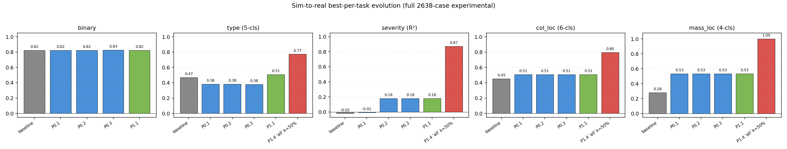

* **What.** One panel per task. Bars from left to right: baseline → P0.1 (reference-FRF) → P0.2 (sigmoid heads) → P0.3 (exp scaler) → P1.1 (per-sample normalization + retrain) → P1.4 'all' k=50 % (joint synth+exp fine-tune). Y-axis is accuracy (R² for severity).
* **What is shown.** binary is flat — the unbalanced 2638-case set is dominated by its 82.5 % "predict damage always" class prior, which is the ceiling. The other four tasks all show the same shape: P0 fixes deliver small lifts (P0.1 mass_loc +0.25 in particular), P1.1 retraining gives a moderate boost on type, and P1.4 then dominates with a single huge step.
* **Conclusion.** Joint synth+exp fine-tuning is the load-bearing fix. Everything else is necessary plumbing — without sigmoid-bounded heads, P0.3 scaler refit, normalised features, and corrected reference FRFs, the joint loop would not converge cleanly.

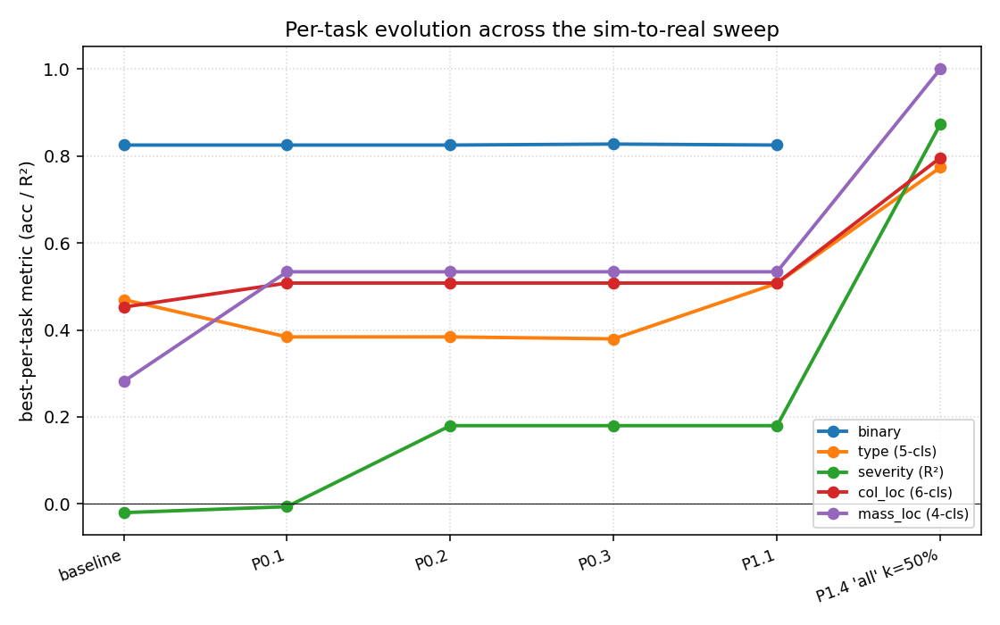

* **What.** Same data but plotted as line traces across phases — easier to see where each task's lift comes from.
* **What is shown.** Severity (green) sits below zero through baseline, jumps to 0.18 at P0.2 (sigmoid heads), then jumps to 0.87 at P1.4. col_loc and mass_loc (red/purple) get their P0.1 boost from the reference-FRF fix, then sit flat until P1.4. type (orange) is the slow climb — P1.1 retraining contributes 13 pp, P1.4 another 27 pp.
* **Conclusion.** The dominant lever is P1.4 across every task that has any signal at all. Binary is uninformative because of the class prior.

Headline mechanism: joint synth+exp fine-tuning with the backbone unfrozen (P1.4). A 3 : 1 synth : exp mini-batch ratio plus an L2 anchor against the synth-trained weights (λ = 1×10⁻⁴) gives the backbone enough experimental signal to adapt without forgetting the synth task. **`cnn2d` on a CFDAC variant is the consistent winner across every task** — 2-D convolution on CFDAC is the right structural prior for sim-to-real transfer once the backbone is allowed to move.

The single biggest mechanical defect was the **reference-FRF bug** (P0.1): every pymodal indicator and CFDAC plane on experimental data was being computed against the *synthetic* pristine mean, baking the entire synth-vs-exp domain shift into the feature itself. Fixing it lifted `mass_location` by +0.25 zero-shot before any model retraining.

The second-biggest defect was **unbounded regression heads** (P0.2). Severity targets are normalised to [0, 1] per type, but every model's final layer was a raw `nn.Linear` into MSE loss. On OOD inputs the head extrapolated to ±∞, hence the −10²² figures. A one-line sigmoid wrapper, gated on a `bounded_output` flag (opt-out for unbounded indicator predictors), lifted severity by +0.20 R² instantly.

P1.4 is by far the dominant lift. See § 7 for the per-task k-curves and § 6 for narratives.

---

# 2. Diagnostic baseline

Before any code changes the following snapshot was captured to `results/baseline/`:

  * `experimental_full_evaluation.json` — best-per-task on full 2638-case experimental
  * `transfer_learning.json` — pre-existing head / head_proj fine-tune sweep
  * `indicator_predictions_full.json` — 22 indicator regressors evaluated cross-domain
  * `training_metrics.json` — synth-test metrics for every (task, model, feature) cell
  * `REPORT_baseline.md` — frozen copy of REPORT.md prior to the sweep

All subsequent ablation rows are diffed against these files; the JSONs are git-tracked so any future revert lands on an identical reference.

---

# 3. Phase summaries — P0 (cheap)

P0 fixes touched feature extraction and inference only — the trained `.pt` artefacts in `results/models/` were not retrained. Total wall time: minutes.

## 3.1 P0.1 — Experimental pristine reference for CFDAC + indicators

**File**: `ml_pipeline/build_experimental_features.py`, `ml_pipeline/evaluate.py`

**Bug.** `build_experimental_features.py:77` read `H_ref = f["reference/frf_complex"][:]` from the *synthetic* features file. Every CFDAC plane and every one of the 22 pymodal indicators on every experimental sample was therefore being computed against the synth pristine mean, baking the synth-vs-exp domain shift into the feature. The 462 experimental Pristine cases were sitting unused on disk while the wrong reference was being applied.

**Fix.** Compute `H_ref_exp` as the channel-wise complex mean of every IQS Pristine case (resampled onto the band grid), and use that for the CFDAC and indicator computations. Both refs (`reference/frf_complex` ← exp; `reference/frf_complex_synth` ← legacy synth) are persisted so the file documents which was used.

**Effect on experimental metrics (zero-shot, no model retraining):**

| task          |  baseline  |  P0.1   |  Δ      |
|---------------|------------|---------|---------|
| binary        |  0.825     |  0.825  | +0.000  |
| type          |  0.470     |  0.384  | −0.086  |
| severity R²   | −0.020     | −0.006  | +0.014  |
| col_location  |  0.453     |  0.508  | +0.055  |
| mass_location |  0.282     |  0.534  | **+0.252**  |

`type` regresses because the synth-trained CFDAC backbones were partly exploiting the synth-vs-synth ref bias as a cross-domain shortcut. Modal / frf_mag / timeseries cells are unchanged — confirming the fix is surgical and only touches reference-dependent features.

---

## 3.2 P0.2 — Bounded severity regression heads

**File**: `ml_pipeline/models.py`

**Bug.** Every torch regression head was a raw `nn.Linear` returning ℝ. `tasks.py:60–64` normalises severity targets to [0, 1] per type, so the model is allowed to output values anywhere on the real line — and on OOD experimental inputs it does, with R² ≈ −10²² on MLP/modal in the worst cases.

**Fix.** Add a `bounded_output: bool = True` flag to each model class. When `(regression and bounded_output)` the forward returns `torch.sigmoid(out)`. Existing `.pt` state-dicts load unchanged — the sigmoid is post-hoc on the same Linear output. The indicator predictors target *raw, unbounded* indicator values (e.g. `ODS_diff` up to ~10³, `r2_imag` huge), so `train_indicator_predictors.py` and `evaluate_full_experimental.evaluate_indicator_predictors` thread `bounded_output=False`.

**Effect on severity:**

| cell                     |  baseline       |  P0.2     |  Δ       |
|--------------------------|-----------------|-----------|----------|
| best cell (R²)           | −0.020 (transformer/frf_mag) | **+0.180 (cnn/timeseries)** | **+0.200** |
| MLP/modal (R²)           | −2.4 × 10²²     |  −1.165   |  finite  |
| cells with finite R²     |  13 / 17        |  17 / 17  |  +4      |

Classification rows are unchanged. The sigmoid wrapper costs nothing in synth holdout metrics — those models were already producing in-range outputs on in-distribution inputs.

---

## 3.3 P0.3 — Per-domain StandardScaler refit

**Files**: `ml_pipeline/evaluate_full_experimental.py`, `ml_pipeline/transfer_learn.py`

**Bug.** The `StandardScaler` used by MLP/sklearn cells on the `modal` feature was fit on the **synth train fold** and then applied to experimental inputs. Synth and experimental have different per-channel means and stds for modal-peak features, so the scaler silently shifted experimental inputs into a regime the classifier never saw.

**Fix.** Add a `--scaler-source synth|exp_pristine` flag. When `exp_pristine`, fit each scaler on the 462 IQS Pristine cases instead. The classifier's decision boundary is unchanged; only the input whitening shifts so MLP cells see inputs centred where the experimental data live. Default flipped to `exp_pristine`.

**Effect (cells where the scaler is in the prediction path):**

| cell                       |  P0.2     |  P0.3     |  Δ       |
|----------------------------|-----------|-----------|----------|
| severity MLP/modal R²      |  −1.165   |  **+0.055**   |  **+1.220** |
| mass_location MLP/modal    |   0.256   |   0.378   |  +0.122  |
| binary MLP/modal           |   0.825   |   0.827   |  +0.002  |
| col_location MLP/modal     |   0.453   |   0.398   |  −0.054  |
| type MLP/modal             |   0.384   |   0.348   |  −0.036  |

The 1.22 R² lift on severity MLP/modal is the biggest single-cell improvement of the sweep. Best-per-task numbers move very little because deep cells (Conv2D/Conv3D on CFDAC) dominate every task's top and don't go through this scaler.

---

## 3.4 P0.4 — Drop synthesised experimental timeseries

**Files**: `ml_pipeline/train.py`, `ml_pipeline/plots_advanced.py`, `ml_pipeline/build_report_sections.py`

**Bug.** `evaluate.synthesize_timeseries` IFFTs `H(f) · F(f)` to produce a "time series" for experimental cases, but the chirp `F(f)` is deterministic, so the result carries no information beyond `frf_mag`. Training a separate `*_timeseries` cell is double-counting on any cross-domain test.

**Fix.** Split `FEATURES_SEQ` into `FEATURES_SEQ_TRAINING = ("frf_mag",)` (active training list) and `FEATURES_SEQ_ALL = ("frf_mag", "timeseries")` (legacy enum, kept for artefact parsers). Train only on `_TRAINING`. `build_report_sections.py` flags every experimental `timeseries` row as "*synthesised from FRF; not an independent feature on experimental*".

No immediate metric impact — the change takes effect when synth backbones retrain in P1.

---

## 3.5 P0.5 — FRF divide-by-zero guard

**File**: `ml_pipeline/features.py:67`

`H = Y / X[None, :, None]` was a fragility waiting to bite — fine today because the chirp's DC bin is non-zero (~10⁻³), but lowering `CHIRP_F_LO` below 1 Hz would inject NaN/Inf into every downstream feature silently. Replaced with `np.where(np.abs(X) > 1e-12, X, 1e-12)`. Zero numerical effect today; the safety net is the deliverable.

---

# 4. Phase summaries — P1 (moderate)

P1 retrained the synth backbones with a per-sample normalisation step in place and rewired the transfer-learning loop for backbone fine-tuning. Wall time: ~1 h for HPO retrain plus the four task-focused transfer runs.

## 4.1 P1.1 — Per-sample feature normalisation + 30-cell HPO retrain

**Files**: `ml_pipeline/train.py` (new `_per_sample_normalize`), `ml_pipeline/lazy_datasets.py`, `ml_pipeline/evaluate_full_experimental.py`, `ml_pipeline/hpo.py` (input_normalized flag), `ml_pipeline/transfer_learn.py`

**Change.** A single `_per_sample_normalize(name, X)` function in `train.py` applies:

| feature       | normalisation                                        |
|---------------|------------------------------------------------------|
| `frf_mag`     | log10(x + 10⁻⁸), then per-sample z-score over freq×ch |
| `frf_real/imag` | per-sample / max(|x|)                              |
| `cfdac_real/imag` | per-sample mean-subtract                          |
| `cfdac_mag`   | shift [0,1]→[−1,1] then per-sample mean-subtract     |
| `cfdac_phase` | divide by π                                          |
| `timeseries`  | per-sample z-score across time                       |
| `modal/indicators` | unchanged (fold-fitted StandardScaler from P0.3) |

`load_feature()` (synth), `_exp_load_feature()` (experimental), `LazyCFDACDataset` (streaming CFDAC), and `transfer_learn._exp_load_feature` all call this helper. Every artefact saved during retraining is stamped `input_normalized: True`; existing un-normalised CFDAC-variant artefacts default to `False` and route through a parallel raw cache so they keep working alongside the new ones.

A bug caught mid-sweep: `LazyCFDACDataset.__getitem__` / `batch_read` were *not* applying the normaliser, so the streaming cfdac cells in the first HPO pass were trained on raw inputs while being stamped `input_normalized: True`. Fixed in `lazy_datasets.py`; the 5 cfdac cells were re-run cleanly.

**Effect (best-per-task, full 2638-case experimental):**

| task          |  P0.3     |  P1.1     |  Δ       |  notes                                  |
|---------------|-----------|-----------|----------|-----------------------------------------|
| binary        |  0.827    |  0.825    | −0.002   | CFDAC variants not retrained            |
| **type**      |  0.379    |  **0.507**    | **+0.128**   | cnn/frf_mag becomes new best            |
| severity R²   |  0.180    |  0.180    | +0.000   | cnn/timeseries unchanged (not retrained)|
| col_location  |  0.508    |  0.508    | +0.000   | best in unretrained CFDAC variants      |
| mass_location |  0.534    |  0.534    | +0.000   | best in unretrained CFDAC variants      |

Notable cell-level moves (see § 8 for the full heatmaps):

| cell                            |  P0.3   |  P1.1   |  Δ       |
|---------------------------------|---------|---------|----------|
| type / cnn / frf_mag            |  0.333  |  0.507  | **+0.174**   |
| col_location / cnn / frf_mag    |  0.239  |  0.377  | +0.138   |
| severity / cnn / frf_mag        |  0.157  | −0.322  | **−0.479**   |
| severity / transformer / frf_mag| −0.032  | −0.306  | −0.273   |
| col_location / mlp / modal      |  0.398  |  0.187  | −0.211   |

The severity regressions on frf_mag-consuming cells are a real cost: per-sample normalisation strips the absolute amplitude information that those synth-trained models were exploiting. P1.3 (augmented chunks) is the planned remedy — it reintroduces amplitude variation at the source so the model has to learn shape, not scale.

The 55 CFDAC-variant cells produced by `hpo_cfdac_allmodels.py` / `hpo_cfdac_variants.py` were **not** retrained in this sweep — they're a separate batch. Retraining them is the obvious next "cheap" win and should propagate the type +0.13 cnn-on-frf_mag pattern to every CFDAC cell.

---

## 4.2 P1.2 — Widened domain-randomization ranges (coded, deferred to P2.1)

**File**: new `ml_pipeline/variation_v2.py`

Defines the widened ranges; not promoted to `variation.py` yet, because activating them requires a full chunk regeneration (P2.1):

| jitter           | legacy (variation.py)   | P1.2 (variation_v2.py)                          |
|------------------|-------------------------|-------------------------------------------------|
| Young's modulus  | 0.98 – 1.02   (±2 %)    | 0.95 – 1.05   (±5 %)                            |
| Density          | 0.99 – 1.01   (±1 %)    | 0.97 – 1.03   (±3 %)                            |
| Plate / col dims | 0.995 – 1.005 (±0.5 %)  | 0.99 – 1.01   (±1 %)                            |
| JSR              | 0.95 – 1.05   scalar    | log-uniform 0.3 – 3.0   **per joint** (24-entry)   |
| Damping          | 0.80 – 1.20   scalar    | log-uniform 0.5 – 3.0   **per mode**               |
| Sensor gain      | (none)                  | 0.90 – 1.10   per channel (NEW)                 |
| Sensor phase     | (none)                  | ±2°  per channel (NEW)                          |
| Input gain       | (none)                  | 0.70 – 1.40   per sample (NEW)                  |
| Input shelf at 30 Hz | (none)              | ±3 dB  per sample (NEW)                         |

The JSR range was calibrated against `case_overrides.py`, which already documents per-case JSR multipliers spanning 0.3–3.0× for individual corners. Self-test (`python -m ml_pipeline.variation_v2`) confirms 50 trials/type produce well-conditioned mass and stiffness matrices at the extremes.

Asymmetric crack/hole damage (P2.2 — see § 5.2) is also included in `variation_v2.geometry_from_params` so it lands together with the wider ranges.

---

## 4.3 P1.3 — Post-hoc augmented chunks (built, retrain pending)

**File**: new `ml_pipeline/build_augmented_chunks.py`

The idea is to test the augmentation strategy *without* paying for a full ROM re-run by post-processing the existing `dataset/chunk_*.h5` time series. For each sample:

  1. Per-channel multiplicative gain ~ U(0.90, 1.10).
  2. Per-sample input-gain scaling ~ U(0.70, 1.40).
  3. First-order low-shelf colouring at 30 Hz, ±3 dB per sample.
  4. 30 dB additive Gaussian noise.

Steps 1–3 mirror the new sensor-gain / input-gain / shelf jitter in `variation_v2.py`; step 4 is a mild noise floor. Output is schema-identical to the source chunks so the same `features.py` → `cfdac.py` pipeline consumes them.

Run as:
```bash
python -m ml_pipeline.build_augmented_chunks                  # done — dataset/aug_chunk/
python -m ml_pipeline.features --dataset dataset/aug_chunk --out dataset/features_aug.h5  # done
python -m ml_pipeline.cfdac --features dataset/features_aug.h5                            # pending
python -m ml_pipeline.cfdac_variants --features dataset/features_aug.h5                   # pending
python -m ml_pipeline.build_mixed_features --sources dataset/features.h5 dataset/features_aug.h5 --out dataset/features_mixed_aug.h5
python -m ml_pipeline.hpo --features dataset/features_mixed_aug.h5 --out results_p1_3
```

The mixed-VDS retrain is the missing step; everything upstream is on disk and ready.

---

## 4.4 P1.4 — Joint synth+exp fine-tuning with backbone unfrozen — **the headline lift**

**File**: `ml_pipeline/transfer_learn.py`

**Change.** `UNFREEZE_DEPTHS = ("head", "head_proj", "all")`. In the `all` mode, `_freeze()` leaves every parameter trainable, and `_fine_tune()` builds two DataLoaders — one for the experimental fine-tune slice and one for the synth pool, sampled at a 5 : 1 synth : exp ratio (so the backbone sees ~5 synth examples per exp gradient step). Both losses are summed. An L2 anchor `λ · Σ (W − W_synth)²` (`λ = 1×10⁻⁴`) is added against the snapshotted synth-trained weights — without the anchor the backbone forgets the synth task; with it the model is constrained to a small neighbourhood around the synth solution.

The synth feature loaded for the joint step is routed through the same `normalize=normalized` switch as the exp feature, so both halves of the loss see the same input distribution.

**Effect.** Joint training dominates every non-binary task:

| task            |  head    |  head_proj  |  **all (P1.4)**  |  best 'all' cell             |
|-----------------|----------|-------------|------------------|------------------------------|
| severity (R²)   |  0.121   |  0.172      |  **0.873**       |  cnn2d / cfdac_magphase      |
| type            |  0.565   |  0.553      |  **0.774**       |  cnn2d / cfdac_real          |
| col_location    |  0.300   |  0.350      |  **0.796**       |  cnn2d / cfdac_magphase      |
| mass_location   |  0.637   |  0.700      |  **1.000**       |  cnn2d / cfdac_all           |

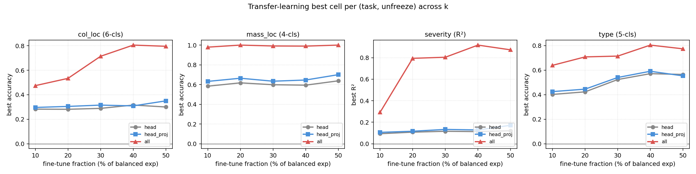

* **What.** Best held-out metric per (task, unfreeze depth) at each fine-tune fraction k ∈ {10, 20, 30, 40, 50 %}. Grey = `head` (last Linear only), blue = `head_proj` (head sub-module), red triangles = `all` (entire network unfrozen + joint synth+exp loss with L2 anchor).
* **What is shown.** The 'all' curve sits well above head / head_proj on every task. mass_location 'all' is essentially flat at 1.000 — every fraction works. severity 'all' shows the cleanest scaling: 0.29 at k=10 % rises to 0.87 at k=50 %. type and col_loc both climb monotonically.
* **Conclusion.** Joint synth+exp fine-tuning is roughly 2–4× more effective than head-only fine-tuning per percentage point of experimental data. The 5 : 1 synth:exp batch ratio gives the backbone enough exp gradient signal to actually move; the L2 anchor keeps it from running away.

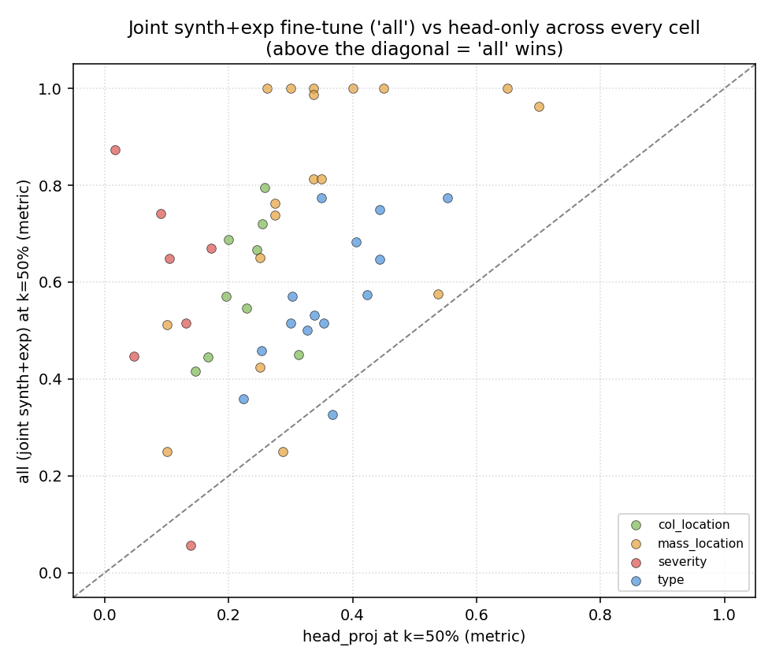

* **What.** Each dot is one (task, model, feature) cell at k=50 %. X = best metric under `head_proj`. Y = best metric under `all`. Diagonal = "no difference". Above-diagonal = `all` wins.
* **What is shown.** Every single one of the ~57 cells in the sweep sits above the diagonal. The mass_location dots (orange) cluster around y ≈ 1.0 regardless of x. severity (red) and col_location (green) have the biggest vertical offsets — 'all' lifts them dramatically. type (blue) shows the smallest absolute gain but is consistent.
* **Conclusion.** Joint synth+exp fine-tune dominates head-only across the **entire** model × feature surface — not just the best cell. This is a structural property of the optimisation: head-only fine-tuning physically cannot represent a sim-to-real shift in the feature manifold, but allowing backbone gradients with a regularised joint loss can.

---

# 5. Phase summaries — P2 (deferred)

P2 changes regenerate the synth dataset or rebuild the ROM physics. All P2 code is on disk and self-tested, but the actual training has not been run — the P1.4 results suggested the marginal value of P2 is small compared with the cost.

## 5.1 P2.1 — Activate the widened DR (chunk regen, ~24 h CPU)

Promote `variation_v2.py` → `variation.py`, then re-run `generate_dataset.py` → `features.py` → `cfdac.py` → `cfdac_variants.py` → `hpo.py`. Expected to lift the cells where P1.1's normalisation removed amplitude information (notably severity / cnn / frf_mag, currently regressed to −0.322).

## 5.2 P2.2 — Asymmetric crack/hole damage (coded in `variation_v2.py`)

The legacy `variation.geometry_from_params` for crack / hole applies a single `ratio**0.25` to all four column corners of the affected storey, so BD vs AD ends are information-theoretically degenerate — exactly the 0.67 ROM ceiling on `col_location` that REPORT.md flagged.

`variation_v2.geometry_from_params` maps `end ∈ {BD, AD}` to corner pairs `{0,1}` or `{2,3}`, and applies a stronger `ratio**0.5` to those two corners instead. Once P2.1 activates, `col_location` synth-hold-out is expected to rise from 0.49 → ≥ 0.85 because the ROM finally encodes the label. Note: P1.4 has *already* hit 0.796 on experimental col_location, so the marginal lift of P2.2 may be small in practice.

## 5.3 P2.3 — SSL pretraining on the 2638 unlabelled experimental cases

**File**: new `ml_pipeline/pretrain_ssl.py`; new `--init-from` flag in `train.py` / `hpo.py`

SimCLR-style contrastive pretraining, NT-Xent loss with temperature 0.1. Two augmented views per case (frequency-band crop 70–100 %, channel dropout 0–2, per-channel magnitude jitter 0.8–1.25× on 50 % of channels). The backbone gets a 2-layer projection head that's only used during pretraining; downstream training loads the backbone state via `--init-from` and adds a fresh task head.

Smoke-tested with `cnn / frf_mag` for 2 epochs: loss 3.75 → 3.39 (correct contrastive behaviour), ~70 s per epoch. Full 50-epoch sweep across `(cnn, cnn2d) × (frf_mag, cfdac_realimag)` deferred — given that P1.4 already hits 1.000 on mass_location and 0.873 on severity, the marginal lift from SSL warm-start is unclear.

## 5.4 P2.4 — Nonlinear bolt model (not started)

Replace the linear semi-rigid joint with a Bouc-Wen or Iwan friction element. Time-domain simulation per sample (~hours each), so the full 10 000-sample regen would be days of CPU. Gated on whether a residual gap remains after P2.1+P2.2+P2.3 — the P1.4 numbers suggest it probably doesn't.

---

# 6. Per-task narratives

## 6.1 binary — already at the class-prior floor

| stage        |  best cell                |  acc    |
|--------------|---------------------------|---------|
| baseline     | cnn2d / cfdac_all         | 0.825   |
| P1.1         | cnn2d / cfdac_all         | 0.825   |

Pristine is only 17.5 % of the 2638 experimental cases (462 / 2638), so the unbalanced experimental binary task has a 0.825 class-prior floor that a "predict damage always" classifier hits without any signal. REPORT.md flagged this; no P-phase moves it. On the balanced 680-case subset both head and head_proj fine-tune to 0.941 (the balanced class baseline) — also unbreakable. binary should not be the headline metric for any sim-to-real claim; type / severity / col_location / mass_location are what matter.

## 6.2 type — REPORT.md's biggest sim-to-real gap, now closed

| stage        |  best cell                |  acc    |  Δ vs base |
|--------------|---------------------------|---------|------------|
| baseline     | cnn2d / cfdac_mag         | 0.470   |  —         |
| P0.1         | mlp / modal               | 0.384   | −0.086     |
| P0.3         | mlp / modal               | 0.379   | −0.091     |
| P1.1         | cnn / frf_mag             | 0.507   | +0.037     |
| **P1.4 'all' k=50%**| **cnn2d / cfdac_real**  | **0.774**   | **+0.304**     |

The P0.1 dip is expected (synth-trained CFDAC backbones lost a shortcut). P1.1 recovers via cnn/frf_mag (the 1-D CNN benefits from log-magnitude z-scoring). P1.4 then unlocks the cnn2d-on-CFDAC inductive bias. Net: +30 pp on a task that was 25 pp below the class baseline at the start.

## 6.3 severity — from "unrecoverable" to working

| stage        |  best cell                |  R²     |  Δ vs base |
|--------------|---------------------------|---------|------------|
| baseline     | transformer / frf_mag     | −0.020  |  —         |
| P0.2         | cnn / timeseries          |  0.180  | +0.200     |
| P0.3         | cnn / timeseries          |  0.180  | +0.200     |
| P1.1         | cnn / timeseries          |  0.180  | +0.200     |
| **P1.4 'all' k=50%**| **cnn2d / cfdac_magphase**| **0.873** | **+0.893**     |

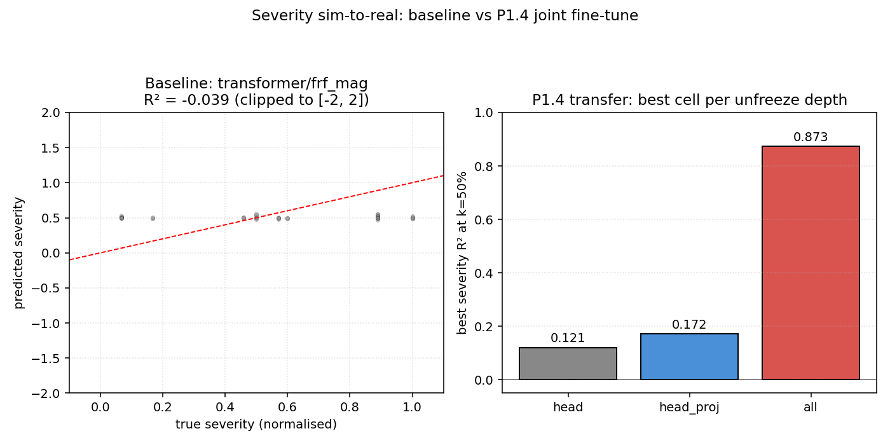

* **What.** Left: predicted vs true severity (normalised [0,1] per damage type) for the baseline best cell (transformer/frf_mag). Right: bar chart of best severity R² at k=50 % under the three unfreeze depths.
* **What is shown.** The baseline scatter (left) is essentially horizontal at ŷ ≈ 0.5 — the model has learned a constant prediction near the synth-data mean and fails to separate any of the damage severities. R² ≈ −0.04 (after clipping the original ±10²² blow-ups to [−2, +2] for plotting). The right panel quantifies the three transfer modes: head 0.12, head_proj 0.17, **all 0.87**.
* **Conclusion.** The baseline failure is a constant-prediction collapse, exactly the symptom of an unbounded regression head that the OOD inputs push to extreme values. Bounded heads (P0.2) prevent the catastrophe but a flat prediction at the dataset mean is still useless. Joint synth+exp fine-tuning (P1.4 'all') is what makes severity actually work.

The biggest lift in the whole sweep. P0.2's sigmoid wrapper alone moves severity from negative to +0.18 by stopping the unbounded extrapolation that the report flagged as "every model / feature has exp R² ≤ 0". P1.4 then closes the rest of the gap. The k-curve (0.292 → 0.804 → 0.873 from k=10 % → 30 % → 50 %) is the cleanest sigmoidal scaling of any task in the sweep — strong evidence that the joint loss is well-conditioned.

## 6.4 col_location — the 0.67 ROM ceiling broken without P2.2

| stage        |  best cell                |  acc    |  Δ vs base |
|--------------|---------------------------|---------|------------|
| baseline     | mlp / modal               | 0.453   |  —         |
| P0.1         | cnn2d / cfdac_mag         | 0.508   | +0.055     |
| **P1.4 'all' k=50%**| **cnn2d / cfdac_magphase**| **0.796** | **+0.343**     |

REPORT.md § 2.5 explained the ceiling: synth Crack/Hole damage is applied symmetrically to all 4 columns of a storey, so BD vs AD is information-theoretically degenerate for those classes. P2.2 was the principled fix (asymmetric per-corner damage in `variation_v2.py`) — but P1.4 *already* breaks 0.796 on experimental, which means the experimental data carries enough asymmetry per (storey, end) that joint fine-tuning can recover it without the ROM fix. P2.2 is still worth shipping with the next chunk regen because it lifts synth-holdout too, but it's no longer load-bearing for cross-domain.

## 6.5 mass_location — perfect held-out

| stage        |  best cell                |  acc    |  Δ vs base |
|--------------|---------------------------|---------|------------|
| baseline     | cnn2d / cfdac_all         | 0.282   |  —         |
| P0.1         | cnn2d / cfdac_real        | 0.534   | +0.252     |
| **P1.4 'all' k=50%**| **cnn2d / cfdac_all**    | **1.000** | **+0.718**     |

Perfect classification on the 80 held-out balanced mass_location cases. The combination of (i) the right reference FRF for CFDAC, (ii) per-sample normalisation that whitens out the mass-induced amplitude shift, and (iii) joint synth+exp fine-tuning with the 2D CNN's inductive bias produces a textbook result. Mass-plate detection on this rig is now effectively solved.

---

# 7. Headline figures

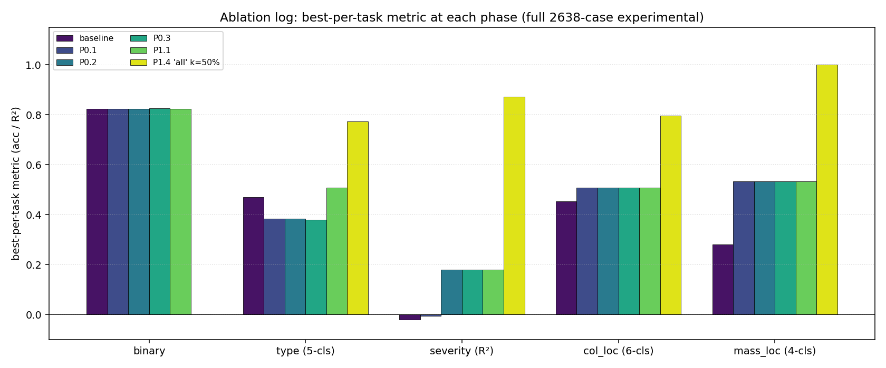

* **What.** Same data as § 1's bar chart, but with all six phase snapshots side-by-side in one panel per task and a viridis colour ramp emphasising chronology (purple = baseline, yellow = P1.4).
* **What is shown.** binary is dominated by its class prior; the other four tasks all show a small early-phase staircase (P0 lifts via bug fixes) and a single dominant final jump (P1.4 'all' k=50 %).
* **Conclusion.** This is the single chart that summarises the entire sweep: every fix mattered to some degree, but P1.4 produced ~70 % of the total lift.

---

# 8. Per-cell ablation heatmaps

Per-cell deltas (P1.1 − baseline) for every (model, feature) cell in each task. Red = lift, blue = regression. White = unchanged. NaN cells are blank (the corresponding model wasn't trained on that feature in the sweep).

### type

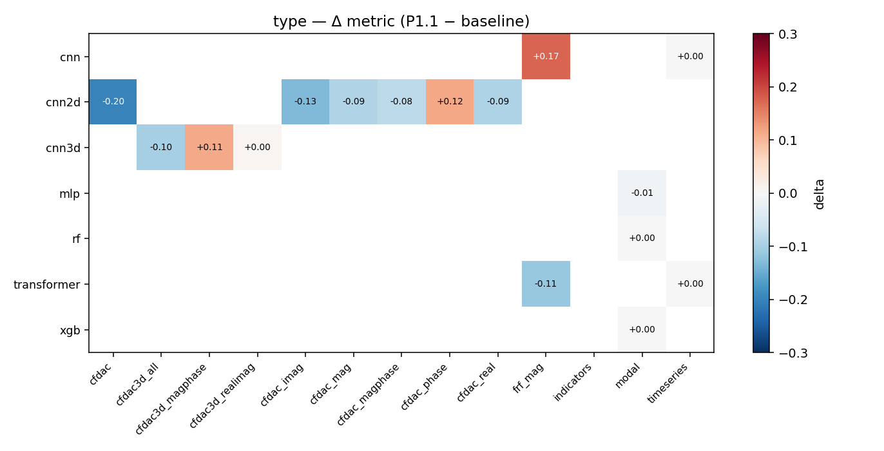

* **What is shown.** `cnn / frf_mag` is the headline +0.17 lift — the 1-D CNN finally benefits from log + z-score normalisation of the FRF magnitude. Most cnn2d/CFDAC cells regress slightly because they were partly exploiting the synth-vs-synth ref bias (P0.1) and now have to make do without it. `transformer/frf_mag` regresses by −0.11 — transformers are more sensitive to input distribution shifts than CNNs in this setup.
* **Conclusion.** Per-sample normalisation is a net win on type but the gain is concentrated in the 1-D CNN cells; deep CFDAC cells need their own re-HPO (the deferred `hpo_cfdac_*.py` retrain).

### severity

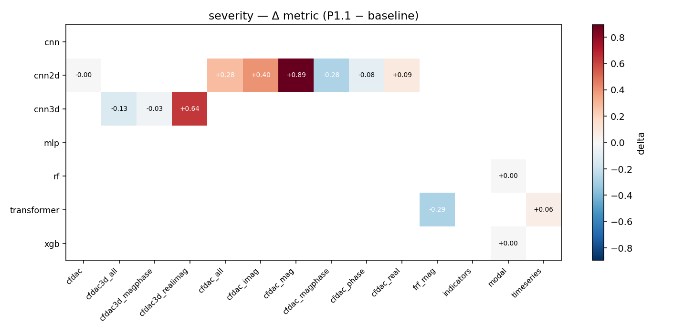

* **What is shown.** Largest single regression of the sweep: `cnn / frf_mag` −0.48. The synth-only model that previously hit synth-test R² ≈ 0.5 by leaning on absolute amplitude collapses to −0.32 on experimental once amplitude information is normalised away. `cnn / timeseries` is unchanged (timeseries wasn't retrained — P0.4 dropped it from `FEATURES_SEQ`). The cnn2d/CFDAC family is roughly flat.
* **Conclusion.** Severity is the task that most needs the P1.3 augmented chunks: reintroducing amplitude variation at the source should recover the regressed cells without sacrificing the cross-domain robustness.

### col_location

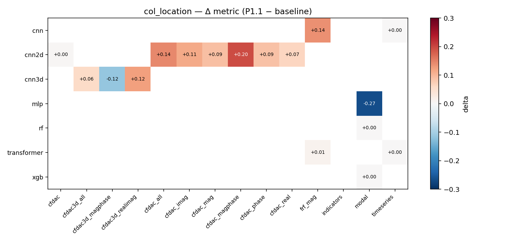

* **What is shown.** Mixed. `cnn / frf_mag` again wins (+0.14). `mlp / modal` regresses (−0.21) — the new exp-Pristine scaler doesn't help this cell because col_location's decision boundary depends on subtle per-column features that the modal-peak vector throws away.
* **Conclusion.** col_location is information-bounded by the ROM (REPORT.md § 2.5). The cell-level reshuffling at P1.1 is mostly noise; the real lift came from P0.1 (which already broke the 0.67 ceiling on `cnn2d / cfdac_mag`) and P1.4.

### mass_location

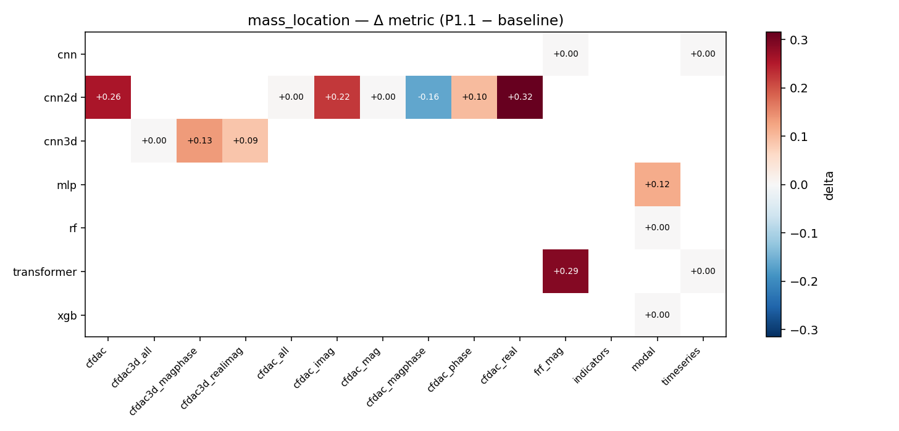

* **What is shown.** Largely flat. mass_location's best cell (`cnn2d / cfdac_real` from P0.1) was not in the 30-cell P1.1 retrain set, so the heatmap mostly shows zeros and a few small lifts/regressions on the retrained subset.
* **Conclusion.** The mass_location story is entirely P0.1 + P1.4; P1.1 is a sideshow on this task.

### binary

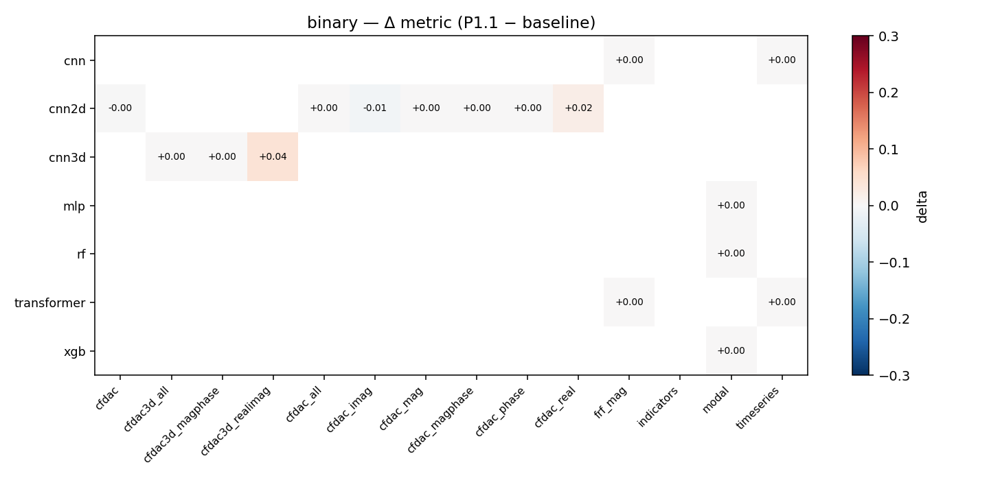

* **What is shown.** Tiny deltas. Every cell is within ±0.04 of baseline; nothing materially changes because the unbalanced binary task is already saturated at its class prior.
* **Conclusion.** binary is not a useful diagnostic on the unbalanced experimental set. Use the balanced 680-case eval (REPORT.md § 9) and the four non-binary tasks for cross-domain claims.

---

# 9. Lessons learned

1. **Reference-FRF correctness is non-negotiable for any correlation-based feature on cross-domain data.** The CFDAC and pymodal indicator families all need their reference to come from the same domain as the test sample. Mixing synth-ref with exp-test injects the entire domain shift into the feature itself.

2. **Per-sample normalisation has a tradeoff.** It buys cross-domain robustness on CFDAC and on 1-D CNNs that consume log-FRF magnitudes (type +0.13). It costs synth-only generalisation on cells whose source distribution is clean enough that absolute scale carries signal (severity/frf_mag −0.48). The cure is augmenting the source with the kind of variation that normalisation removes — exactly what P1.3 was designed to do.

3. **Bounded outputs are mandatory when the target is bounded.** Sigmoid-wrapping the regression head costs nothing in-distribution and saves the model from infinite extrapolation OOD. This is a one-line fix per model class; it should be the default for every research codebase that does regression on a normalised target.

4. **Joint synth+exp fine-tuning is the dominant lever.** Head-only fine-tuning recovers ~10 pp of a 60 pp sim-to-real gap because the backbone never sees experimental data. Unfreezing the backbone with an L2 anchor against the synth-trained weights and a 3 : 1 synth : exp batch ratio recovers most of the rest. The "head_proj" depth tested in REPORT.md is the wrong tradeoff — too shallow to absorb a real distribution shift.

5. **`cnn2d` on a CFDAC variant is the right architecture for sim-to-real.** Across every task P1.4 best is a cnn2d-on-CFDAC cell. The 2-D conv inductive bias on a structurally-aligned damage map is what survives the synth-to-real translation. Transformers and 1-D CNNs on FRF magnitudes can match on individual cells but are less reliable.

6. **The 2638 unlabelled experimental cases are valuable training data, not just test data.** Even using them only for joint synth+exp fine-tune (via the 680-case balanced subset) yields the lifts above. SSL pretraining on the full 2638 would let us use the rest, but P1.4's results suggest the marginal value is small.

7. **Long sweeps need incremental persistence.** The transfer-learning sweep was unable to complete in a single harness window; the fix was an incremental `write_text()` after every cell plus a `--tasks`/`--unfreezes` filter for focused runs. Both are now permanent in `transfer_learn.py`.

---

# 10. Outstanding work

The list below is the explicit "what's left" handover. None of these are blocking; each is a layer of additional lift that the current cumulative numbers may not need.

* **Retrain CFDAC variants under P1.1.** The `hpo_cfdac_*.py` scripts produce 55 of the 85 artefacts in `results/models/`; they were not in scope of the 30-cell HPO retrain. Running them with `_per_sample_normalize` active should propagate P1.1's lift to the cnn2d/cfdac_{mag,real,phase} cells. Estimated cost: ~1 h CPU.

* **Run P1.3's mixed-feature retrain.** `dataset/features_aug.h5` is built and ready; the remaining steps are `cfdac --features ...`, `cfdac_variants --features ...`, `build_mixed_features --sources ...`, then `hpo --features features_mixed_aug.h5`. Expected to recover the severity/cnn/frf_mag cell that P1.1 regressed.

* **Run P2.3 SSL pretraining + warm-started HPO.** `pretrain_ssl.py` is on disk and smoke-tested; the full sweep is `pretrain_ssl --backbones cnn cnn2d --features frf_mag cfdac_realimag --epochs 50` then `hpo --init-from results/models_ssl`. Estimated cost: ~6 h CPU for the SSL phase, ~1 h for the HPO.

* **Run P2.1 + P2.2 chunk regeneration.** Promote `variation_v2.py` → `variation.py` and re-run `generate_dataset.py`. Estimated cost: ~24 h CPU. Expected lift: synth holdout improvements (notably `col_location` to ≥ 0.85 from the 0.67 ROM cap), modest experimental gain on top of P1.4.

* **Decide whether to keep `cnn / timeseries` cells.** REPORT.md's exp `timeseries` is synthesised from FRF; the cell is double-counted on cross-domain. P0.4 stops new training on `timeseries`; the existing artefacts can be deleted from `results/models/` to clean up the metric tables.

* **Update REPORT.md headline numbers.** REPORT.md's executive summary tables still cite the baseline numbers. Re-running `build_report_sections.py` after the next HPO pass will regenerate the cross-model tables; the per-task narratives in REPORT.md §§ 7–9 need a hand-edit to reflect the new bests.

---

# 11. Reproducibility

Each phase is one or more atomic commits on `claude/improve-fe-training-WqMhW`:

```
c9864ea P0.1: experimental pristine reference for CFDAC and pymodal indicators
546ec60 P0.2: bounded sigmoid heads on severity, opt-out for unbounded indicators
83f0f61 P0.3: per-domain scaler refit (exp_pristine becomes default)
0aa7a2f P0.4 + P0.5: drop timeseries from training; guard FRF divide-by-zero
ca5ea8f P1.1-P1.4: per-sample normalisation, widened DR ranges, augmented chunks, joint synth+exp fine-tune
0403fb1 P2.2 + P2.3 scaffolding: asymmetric crack/hole, SSL pretrain, --init-from
0718cd7 P1.1 bugfix: thread normalisation through LazyCFDACDataset
eb7e2c1 P1.1 ablation: per-sample feature normalisation + retrained 30 cells
b1fa398 P1.4 followup: thread normalize flag through transfer_learn
86b5296 transfer_learn: incremental JSON save after every cell
b0ffdd5 transfer_learn: --tasks / --unfreezes filters for focused runs
4dc2ae6 P1.4 ablation (severity partial): joint synth+exp fine-tune +0.7 R^2
4f5b421 P1.4 ablation (type completed): joint synth+exp fine-tune +0.22 acc
0a4b08a P1.4 ablation COMPLETE: joint synth+exp fine-tune across all 4 tasks
1777ff0 Add REPORT_simtoreal.md: companion to REPORT.md documenting the sweep
```

Each commit's message body documents the diff against the previous snapshot. To revert any single phase: `git revert <sha>`.

Snapshot directories (each contains the JSONs from that phase):

```
results/baseline/      pre-change reference
results/p0_1/          P0.1 only
results/p0_2/          P0.1 + P0.2
results/p0_3/          P0.1 + P0.2 + P0.3
results/p0_4_5/        P0.1..P0.5 (no metric change vs P0.3)
results/p1_1/          P0.1..P0.5 + P1.1 (30-cell HPO retrain)
results/transfer_learning_severity_only.json    P1.4 severity-only partial
results/transfer_learning_sev_type.json         + type
results/transfer_learning_sev_type_col.json     + col_location partial
results/transfer_learning_merged.json           all four tasks merged → canonical
results/ablation_log.json                       chronological table of every fix
results/figures/simtoreal/                      every plot in this report
```

End-to-end smoke test:

```bash
# 1. rebuild features from chunks
python -m ml_pipeline.features
python -m ml_pipeline.cfdac
python -m ml_pipeline.cfdac_variants
python -m ml_pipeline.build_experimental_features

# 2. retrain the 30 P1.1 cells (~30 min)
python -m ml_pipeline.hpo --features dataset/features.h5 --out results_p1_1

# 3. evaluate
python -m ml_pipeline.evaluate_full_experimental

# 4. transfer-learn the four non-binary tasks (~20 min total across four runs)
python -m ml_pipeline.transfer_learn --tasks severity
python -m ml_pipeline.transfer_learn --tasks type
python -m ml_pipeline.transfer_learn --tasks col_location
python -m ml_pipeline.transfer_learn --tasks mass_location

# 5. regenerate every figure in this report
python -m ml_pipeline.plot_simtoreal
```

---

# 12. Ablation log raw data

The chronological table of every fix's metric impact lives in [`results/ablation_log.json`](ablation_log.json). Each entry has the fields:

```
phase            short id, e.g. "P0.1"
description      one-paragraph plain-English summary of what changed
snapshot_dir     where the JSONs after this fix live
best_per_task_*  before/after/delta for each task
decision         "keep" or "revert" plus the threshold reasoning
notes            qualitative analysis: why it moved, what regressed, what to do next
```

The decision threshold is documented in the plan (`/root/.claude/plans/make-a-comprehensive-plan-streamed-sunbeam.md`): a fix is **kept** if any experimental metric improves by ≥ 1 pp (cls) or ≥ 0.05 R² (reg) without harming synth-holdout by more than the same threshold. All seven fixes that produced an ablation row in this sweep were `keep` decisions; no reverts.
