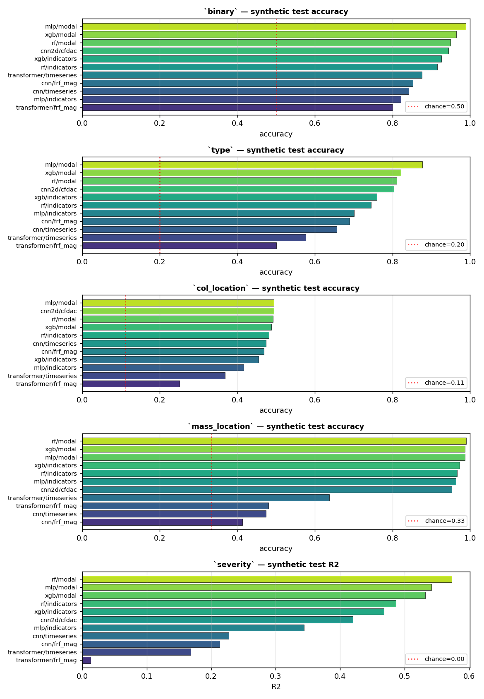
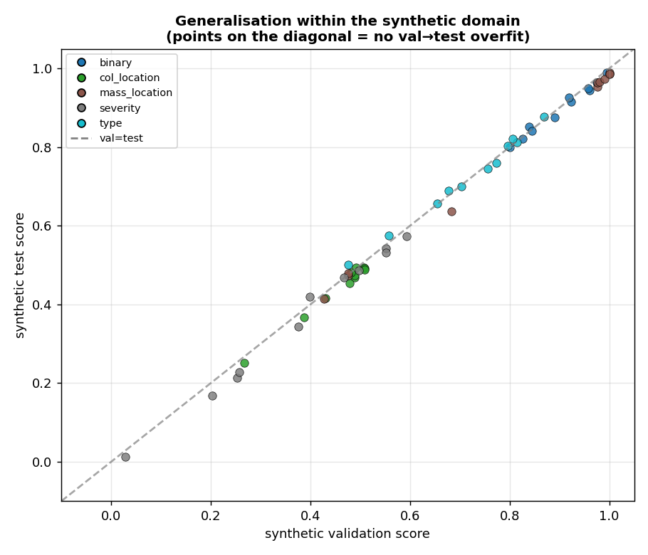
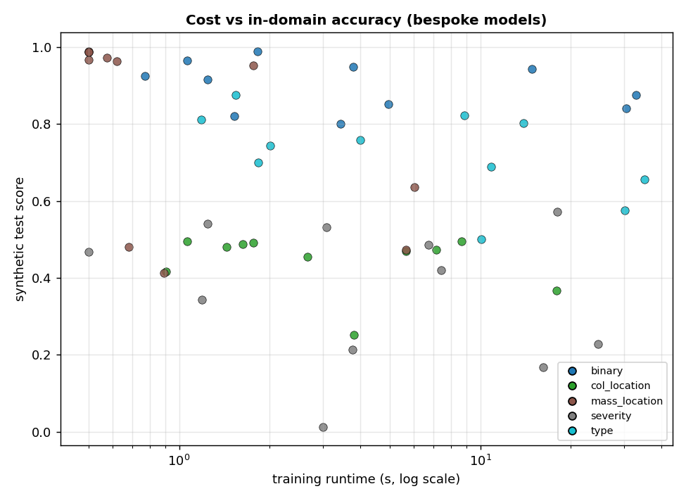
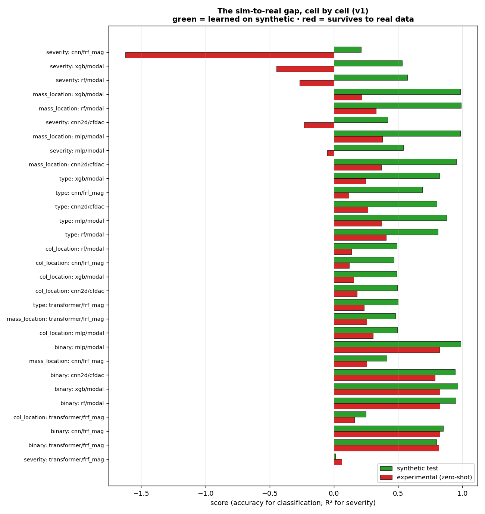
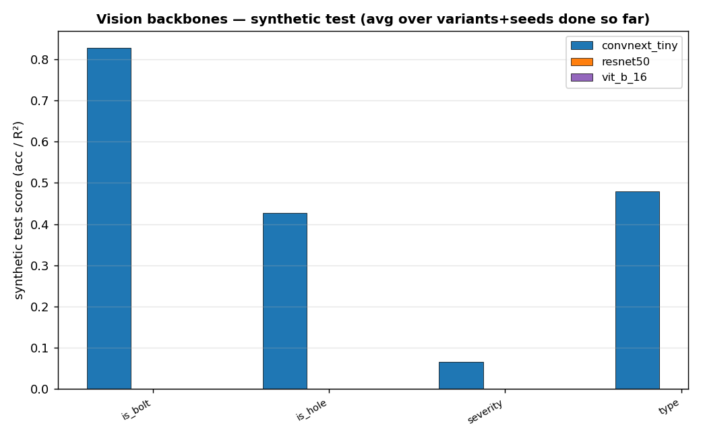

# LANL 3SBB — Synthetic-domain training results (pre-transfer)
**Companion to** [`REPORT_CONSOLIDATED.md`](REPORT_CONSOLIDATED.md) (the full cross-domain/experimental study). Date: 2026-06-02.

This report answers one question: **how well does each model fit the task on the synthetic data it was trained on**, scored on a held-out synthetic test fold, *before any contact with the real experimental structure*? These are the in-distribution ceilings. The difference between a number here and its counterpart in the consolidated report is, cell for cell, the **sim-to-real gap** — quantified in §4.

---
## 1. Method
- **Data.** Synthetic 3SBB cases from the physics generator. A 70/15/15 train/validation/test split (stratified for classification, random for regression). The *test* fold is synthetic and drawn from the same generator as training — so these numbers are optimistic by construction; they are a learnability ceiling, not a deployment estimate.
- **Metrics.** Accuracy on the synthetic test fold for classification; R² for `severity` regression.
- **Two model families.**
  - *Bespoke* (mlp, cnn, cnn1d, cnn2d, rf, xgb, transformer) on the tabular/spectral features. Numbers are HPO-tuned on the **v1** baseline physics and cover the 5 original tasks (`results/training_metrics.json`).
  - *Vision* (ConvNeXt-Tiny, ResNet50, ViT-B/16; ImageNet-pretrained via timm) on CFDAC images. Synthetic test scores are read from each per-case JSON's `meta.synth_test`; this family spans v1/v2/v2a × seeds 42/101/202 × all 10 tasks and **grows as the running sweep completes** (re-run `ml_pipeline/build_report_synth.py` to refresh).
- **Plots** are produced by `ml_pipeline/plot_synth.py`.

---
## 2. Headline — best synthetic cell per task, and what survives transfer

| task | best synth cell | synth test | same cell, experimental (v1) | gap |
|---|---|---|---|---|
| `binary` | mlp/modal | **0.989** | acc=0.822 (macroF1=0.480) | −0.166 |
| `type` | mlp/modal | **0.877** | acc=0.371 (macroF1=0.278) | −0.506 |
| `col_location` | cnn2d/cfdac | **0.494** | acc=0.181 (macroF1=0.078) | −0.314 |
| `mass_location` | rf/modal | **0.990** | acc=0.328 (macroF1=0.208) | −0.662 |
| `severity` | rf/modal | **0.573** | R²=-0.266 | −0.839 |

Read this top-down: the synthetic ceilings are high for everything except localisation (`col_location`) and `severity`, yet the matching experimental numbers collapse — most starkly for `binary` and `mass_location`, which are near-perfect in-domain and near-chance (by macro-F1) on the real structure. **That collapse is the central result of the study, and it is a domain-shift effect, not a failure to learn.**

*Per-task synthetic test scores for every bespoke cell (red dotted = chance). Modal-feature cells dominate the learnable tasks.*

---
## 3. In-domain generalisation and cost

*Synthetic validation vs synthetic test. Points hug the diagonal — there is essentially no val→test overfitting within the synthetic domain; the models that fit the val fold also fit the test fold. The generalisation problem is entirely cross-domain, not in-domain.*

*Training cost vs in-domain accuracy. The cheapest models (modal MLP / RF / XGB, ~1–4 s) are also the strongest in-domain; the expensive sequence models (transformer on raw time series, ~30 s) do not buy extra in-domain accuracy.*

---
## 4. Per-task synthetic results (bespoke, v1, HPO-tuned)
### 4.1 `binary` — chance ≈ 0.5 balanced; 0.825 by majority-class on the real set

Damaged-vs-pristine on the synthetic data. This is the easiest in-domain task: the synthetic generator stamps a clear modal signature on every damaged case, so a tiny MLP on the extracted modal features separates the two classes almost perfectly. The interesting part is §4 — almost none of this separability survives transfer to the real structure.

| model | feature | synth val | synth test (accuracy) | runtime (s) | key hyper-params |
|---|---|---|---|---|---|
| mlp | modal | 0.995 | **0.989** | 2 | hidden=[512, 256, 128], lr=0.003 |
| xgb | modal | 0.975 | **0.965** | 1 | n_estimators=300, max_depth=8 |
| rf | modal | 0.958 | **0.949** | 4 | n_estimators=300, max_depth=None |
| cnn2d | cfdac | 0.961 | **0.944** | 15 | widths=[16, 32, 64], kernel_size=5 |
| xgb | indicators | 0.919 | **0.926** | 1 | n_estimators=600, max_depth=6 |
| rf | indicators | 0.924 | **0.916** | 1 | n_estimators=200, max_depth=None |
| transformer | timeseries | 0.890 | **0.876** | 33 | d_model=64, n_layers=2 |
| cnn | frf_mag | 0.839 | **0.853** | 5 | widths=[16, 32, 64], kernel_size=5 |
| cnn | timeseries | 0.845 | **0.842** | 30 | widths=[32, 64, 128], kernel_size=7 |
| mlp | indicators | 0.826 | **0.821** | 2 | hidden=[512, 256, 128], lr=0.001 |
| transformer | frf_mag | 0.800 | **0.800** | 3 | d_model=32, n_layers=1 |

### 4.2 `type` — chance ≈ 0.20 (5-class)

Five-way {pristine, bolt, crack, hole, mass}. Modal features carry most of the signal in-domain; the difficulty is that crack and hole produce similar global modal changes, so the confusion concentrates there.

| model | feature | synth val | synth test (accuracy) | runtime (s) | key hyper-params |
|---|---|---|---|---|---|
| mlp | modal | 0.869 | **0.877** | 2 | hidden=[512, 256, 128], lr=0.003 |
| xgb | modal | 0.807 | **0.822** | 9 | n_estimators=600, max_depth=6 |
| rf | modal | 0.815 | **0.811** | 1 | n_estimators=100, max_depth=None |
| cnn2d | cfdac | 0.796 | **0.803** | 14 | widths=[16, 32, 64], kernel_size=5 |
| xgb | indicators | 0.774 | **0.759** | 4 | n_estimators=600, max_depth=6 |
| rf | indicators | 0.757 | **0.745** | 2 | n_estimators=300, max_depth=None |
| mlp | indicators | 0.703 | **0.701** | 2 | hidden=[512, 256, 128], lr=0.003 |
| cnn | frf_mag | 0.677 | **0.689** | 11 | widths=[32, 64, 128], kernel_size=7 |
| cnn | timeseries | 0.654 | **0.657** | 35 | widths=[32, 64, 128], kernel_size=7 |
| transformer | timeseries | 0.557 | **0.576** | 30 | d_model=64, n_layers=2 |
| transformer | frf_mag | 0.476 | **0.501** | 10 | d_model=64, n_layers=2 |

### 4.3 `col_location` — chance ≈ 0.111 (9-class)

Which column section is damaged. This is the hard task even in-domain: best cells sit near 0.49 — the global modal/FRF response simply does not localise 'where' very well, regardless of model. The ceiling here is low before transfer even enters the picture.

| model | feature | synth val | synth test (accuracy) | runtime (s) | key hyper-params |
|---|---|---|---|---|---|
| cnn2d | cfdac | 0.492 | **0.494** | 9 | widths=[16, 32, 64], kernel_size=5 |
| mlp | modal | 0.507 | **0.494** | 1 | hidden=[256, 128, 64], lr=0.003 |
| rf | modal | 0.509 | **0.492** | 2 | n_estimators=300, max_depth=12 |
| xgb | modal | 0.509 | **0.488** | 2 | n_estimators=100, max_depth=6 |
| rf | indicators | 0.482 | **0.481** | 1 | n_estimators=300, max_depth=None |
| cnn | timeseries | 0.488 | **0.473** | 7 | widths=[16, 32, 64], kernel_size=7 |
| cnn | frf_mag | 0.489 | **0.469** | 6 | widths=[32, 64, 128], kernel_size=7 |
| xgb | indicators | 0.479 | **0.454** | 3 | n_estimators=600, max_depth=4 |
| mlp | indicators | 0.430 | **0.417** | 1 | hidden=[512, 256, 128], lr=0.003 |
| transformer | timeseries | 0.387 | **0.368** | 18 | d_model=64, n_layers=2 |
| transformer | frf_mag | 0.267 | **0.251** | 4 | d_model=32, n_layers=2 |

### 4.4 `mass_location` — chance ≈ 0.333 (3-class)

Which tier carries the added mass. Added mass shifts global natural frequencies in a tier-specific way, so modal features nail this in-domain (~0.99). Contrast with the cross-domain number in the consolidated report, where it falls to ~0.43 macro-F1.

| model | feature | synth val | synth test (accuracy) | runtime (s) | key hyper-params |
|---|---|---|---|---|---|
| rf | modal | 1.000 | **0.990** | 0 | n_estimators=100, max_depth=12 |
| mlp | modal | 1.000 | **0.987** | 0 | hidden=[256, 128, 64], lr=0.001 |
| xgb | modal | 1.000 | **0.987** | 0 | n_estimators=100, max_depth=4 |
| xgb | indicators | 0.990 | **0.973** | 1 | n_estimators=300, max_depth=6 |
| rf | indicators | 0.980 | **0.967** | 0 | n_estimators=100, max_depth=12 |
| mlp | indicators | 0.977 | **0.963** | 1 | hidden=[512, 256, 128], lr=0.003 |
| cnn2d | cfdac | 0.977 | **0.953** | 2 | widths=[8, 16, 32], kernel_size=5 |
| transformer | timeseries | 0.683 | **0.637** | 6 | d_model=64, n_layers=2 |
| transformer | frf_mag | 0.477 | **0.480** | 1 | d_model=32, n_layers=1 |
| cnn | timeseries | 0.477 | **0.473** | 6 | widths=[32, 64, 128], kernel_size=5 |
| cnn | frf_mag | 0.427 | **0.413** | 1 | widths=[16, 32, 64], kernel_size=5 |

### 4.5 `severity` — chance ≈ R²=0 ≡ predict-the-mean

Continuous bolt-loosening fraction (regression). In-domain R² tops out around 0.57 for the modal random-forest — the synthetic severity axis is only moderately encoded even before transfer.

| model | feature | synth val | synth test (R²) | runtime (s) | key hyper-params |
|---|---|---|---|---|---|
| rf | modal | 0.593 | **0.573** | 18 | n_estimators=300, max_depth=None |
| mlp | modal | 0.551 | **0.542** | 1 | hidden=[512, 256, 128], lr=0.003 |
| xgb | modal | 0.551 | **0.532** | 3 | n_estimators=300, max_depth=8 |
| rf | indicators | 0.498 | **0.487** | 7 | n_estimators=300, max_depth=None |
| xgb | indicators | 0.467 | **0.468** | 0 | n_estimators=100, max_depth=8 |
| cnn2d | cfdac | 0.398 | **0.420** | 7 | widths=[8, 16, 32], kernel_size=5 |
| mlp | indicators | 0.376 | **0.344** | 1 | hidden=[512, 256, 128], lr=0.003 |
| cnn | timeseries | 0.258 | **0.227** | 25 | widths=[32, 64, 128], kernel_size=5 |
| cnn | frf_mag | 0.253 | **0.213** | 4 | widths=[16, 32, 64], kernel_size=7 |
| transformer | timeseries | 0.202 | **0.168** | 16 | d_model=32, n_layers=2 |
| transformer | frf_mag | 0.028 | **0.013** | 3 | d_model=32, n_layers=1 |

---
## 5. The sim-to-real gap, cell by cell

For every bespoke cell that also exists in the experimental study (30 cells, matched on task/model/feature, v1), the synthetic test score is plotted against the experimental zero-shot score in the same metric.

| cell | metric | synth test | experimental | Δ (exp − synth) |
|---|---|---|---|---|
| `severity/cnn/frf_mag` | R² | 0.213 | -1.622 | -1.835 |
| `severity/xgb/modal` | R² | 0.532 | -0.447 | -0.979 |
| `severity/rf/modal` | R² | 0.573 | -0.266 | -0.839 |
| `mass_location/xgb/modal` | acc | 0.987 | 0.218 | -0.768 |
| `mass_location/rf/modal` | acc | 0.990 | 0.328 | -0.662 |
| `severity/cnn2d/cfdac` | R² | 0.420 | -0.232 | -0.652 |
| `mass_location/mlp/modal` | acc | 0.987 | 0.378 | -0.609 |
| `severity/mlp/modal` | R² | 0.542 | -0.051 | -0.593 |
| `mass_location/cnn2d/cfdac` | acc | 0.953 | 0.370 | -0.584 |
| `type/xgb/modal` | acc | 0.822 | 0.248 | -0.574 |
| `type/cnn/frf_mag` | acc | 0.689 | 0.118 | -0.572 |
| `type/cnn2d/cfdac` | acc | 0.803 | 0.264 | -0.539 |
| `type/mlp/modal` | acc | 0.877 | 0.371 | -0.506 |
| `type/rf/modal` | acc | 0.811 | 0.408 | -0.403 |
| `col_location/rf/modal` | acc | 0.492 | 0.136 | -0.356 |
| `col_location/cnn/frf_mag` | acc | 0.469 | 0.121 | -0.348 |
| `col_location/xgb/modal` | acc | 0.488 | 0.153 | -0.334 |
| `col_location/cnn2d/cfdac` | acc | 0.494 | 0.181 | -0.314 |
| `type/transformer/frf_mag` | acc | 0.501 | 0.236 | -0.264 |
| `mass_location/transformer/frf_mag` | acc | 0.480 | 0.256 | -0.224 |
| `col_location/mlp/modal` | acc | 0.494 | 0.306 | -0.189 |
| `binary/mlp/modal` | acc | 0.989 | 0.822 | -0.166 |
| `mass_location/cnn/frf_mag` | acc | 0.413 | 0.256 | -0.157 |
| `binary/cnn2d/cfdac` | acc | 0.944 | 0.789 | -0.155 |
| `binary/xgb/modal` | acc | 0.965 | 0.825 | -0.140 |
| `binary/rf/modal` | acc | 0.949 | 0.825 | -0.124 |
| `col_location/transformer/frf_mag` | acc | 0.251 | 0.162 | -0.089 |
| `binary/cnn/frf_mag` | acc | 0.853 | 0.825 | -0.028 |
| `binary/transformer/frf_mag` | acc | 0.800 | 0.818 | +0.018 |
| `severity/transformer/frf_mag` | R² | 0.013 | 0.062 | +0.049 |

Every classification cell loses 0.3–0.5 absolute accuracy crossing to the real data, and the binary/localisation cells that looked perfect in-domain are the ones that fall furthest. This is the quantitative statement of the sim-to-real problem the consolidated report then dissects per variant and per damage-severity tier.

---
## 6. Vision backbones — synthetic test (running sweep)

Source: `meta.synth_test` of every vision per-case JSON produced so far — **4 / 810** cells complete. This section refreshes when the script is re-run.

**Coverage (cells done per variant×seed, of 90):**

| variant | seed42 | seed101 | seed202 |
|---|---|---|---|
| v1 | 4 | 0 | 0 |
| v2 | 0 | 0 | 0 |
| v2a | 0 | 0 | 0 |

**Synthetic test by cell (mean over variants+seeds done):**

| task | backbone | feature | synth test | n |
|---|---|---|---|---|
| is_bolt | convnext_tiny | cfdac_all | 0.827 | 1 |
| is_hole | convnext_tiny | cfdac_all | 0.427 | 1 |
| severity | convnext_tiny | cfdac_all | 0.066 | 1 |
| type | convnext_tiny | cfdac_all | 0.480 | 1 |

---
## 7. How to read this against the consolidated report
- **High synth test + low experimental score = sim-to-real gap**, not a learning failure. §4–§5 show the models fit the synthetic task well; the consolidated report shows how little survives zero-shot transfer.
- **Accuracy vs macro-F1.** On the real set, accuracy is inflated by class imbalance (82.5 % damaged); the consolidated report uses macro-F1 as the metric of record. The headline table above shows both so the collapse is not hidden by the accuracy floor.
- **In-domain is solved; cross-domain is the research problem.** The val=test diagonal (§3) proves the models are not overfitting the synthetic fold — the entire generalisation gap lives at the synthetic→real boundary, which is what the variant study (v1/v2/v2a) and the DT-stratified analysis in the consolidated report attack.
