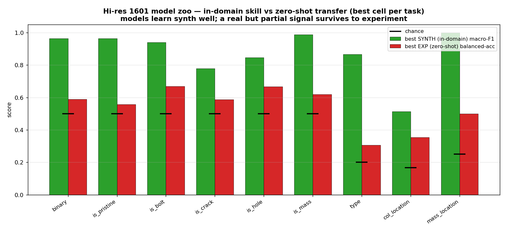

# LANL 3SBB — Synthetic-domain (in-domain) results
**Companion to** [`REPORT_CONSOLIDATED.md`](REPORT_CONSOLIDATED.md) (the full
cross-domain / experimental study). **Date:** 2026-06-08.
**Scope.** How well the **high-resolution (1601-bin) CFDAC model zoo** learns each
diagnosis task *within the synthetic domain* — trained and tested on held-out
synthetic data (the upper bound, before any sim-to-real transfer).
*(Reduced-resolution 128-bin results are excluded until that run completes.)*

---
## Why this report
The consolidated report measures **zero-shot transfer to real data**. This one
isolates the **in-domain ceiling**: with synth-only training and a held-out synth
test fold, *can the models learn the task at all, and how well?* The gap between
this report (in-domain) and the consolidated report (experimental) **is** the
sim-to-real problem, quantified per task.

Same zoo, same 1601-bin features and models, same 70/15/15 split and
train-to-convergence protocol (see `REPORT_CONSOLIDATED.md` → Methodology). The
metric here is the **held-out synthetic** macro-F1 (classification) or R²
(severity).

---
## In-domain results (held-out synthetic test, 1601)

| task | chance | best in-domain (macro-F1 / R²) | best in-domain cell |
|---|---|---|---|
| **mass_location** | 0.25 | **1.00** | `transformer / cfdac_all` |
| **is_mass** | 0.50 | **0.99** | `mlp / modal` |
| **binary** | 0.50 | **0.96** | `mlp / frf_mag` |
| **is_pristine** | 0.50 | **0.96** | `convnext_tiny / cfdac_realimag` |
| **is_bolt** | 0.50 | **0.94** | `cnn2d_deep / cfdac_magphase` |
| **type** (5-cls) | 0.20 | **0.87** | `transformer / cfdac_all` |
| **is_hole** | 0.50 | **0.85** | `mlp / frf_mag` |
| **is_crack** | 0.50 | **0.78** | `mlp / frf_realimag` |
| **col_location** | 0.17 | **0.51** | `resnet50 / cfdac_phase` |
| **severity** (reg) | — | **R² 0.59** | `mlp / frf_realimag` |

### Observations
- **Most tasks are learned very well synthetically** (≥ 0.85 macro-F1 on 6 of 9
  classification tasks; mass_location is effectively perfect). The models and
  features are *not* the bottleneck — the synthetic task is solvable.
- **`col_location` is the in-domain hard case** (0.51): the linear reduced model
  with symmetric crack/hole damage makes the two column ends (BD/AD) nearly
  degenerate, so even in-domain the spatial class is only ~3× chance — an
  intrinsic modelling ceiling, not a learning failure.
- **Severity is learnable but only moderately** (R² 0.59 in-domain) — a real but
  imperfect regression even before transfer.
- **Many feature/model families reach the ceiling.** The best in-domain cells span
  `modal`, `frf_*`, `cfdac_*` with CNN/transformer/vision models — in-domain,
  almost any reasonable representation works. The differences only emerge under
  transfer (see the consolidated report).

---
## The sim-to-real gap (in-domain → experiment)

Best cell per task; in-domain macro-F1/R² vs zero-shot balanced-acc / R²:

| task | in-domain | experiment (zero-shot) | drop |
|---|---|---|---|
| mass_location | 1.00 | 0.50 (bal) | large |
| is_mass | 0.99 | 0.62 | large |
| binary | 0.96 | 0.59 | large |
| is_pristine | 0.96 | 0.56 | large |
| is_bolt | 0.94 | 0.67 | moderate |
| type | 0.87 | 0.31 | large |
| is_hole | 0.85 | 0.67 | moderate |
| is_crack | 0.78 | 0.59 | moderate |
| col_location | 0.51 | 0.35 | moderate |
| severity (R²) | 0.59 | 0.04 | severe |

**Interpretation.** The drop from this report to the experimental one is the
sim-to-real gap. It is **largest where the synthetic model is most confident**
(mass_location, binary, type, severity) — a hallmark of **covariate shift**: the
model locks onto synthetic spectral structure that does not match reality. The
smaller drops (is_bolt, is_hole, is_crack) are exactly the **severe-damage
detectors** that survive transfer (and improve further at high severity — see the
DT sweep in the consolidated report).

---
## Takeaways
1. **In-domain is essentially solved** for detection/typing; the entire challenge
   is transfer.
2. **The most over-confident synthetic tasks transfer worst** — chase domain
   adaptation, not in-domain accuracy.
3. **`col_location` and `severity`** are limited *in-domain too*, so their poor
   transfer is partly an intrinsic ceiling (degenerate classes / weak regression),
   not only covariate shift.

*Experimental transfer, the DT severity sweep, and the per-representation analysis
are in [`REPORT_CONSOLIDATED.md`](REPORT_CONSOLIDATED.md).*
