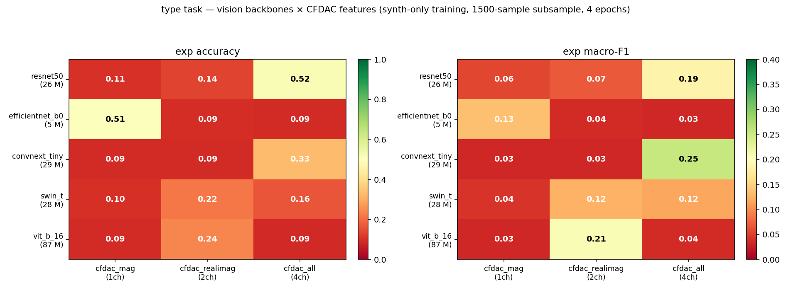
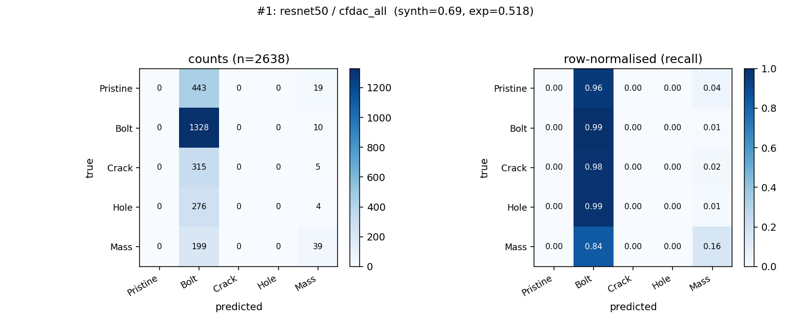
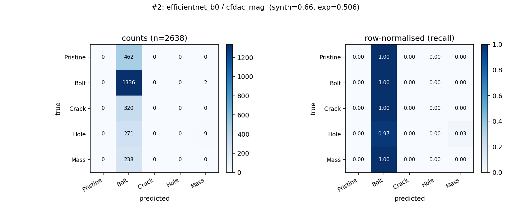
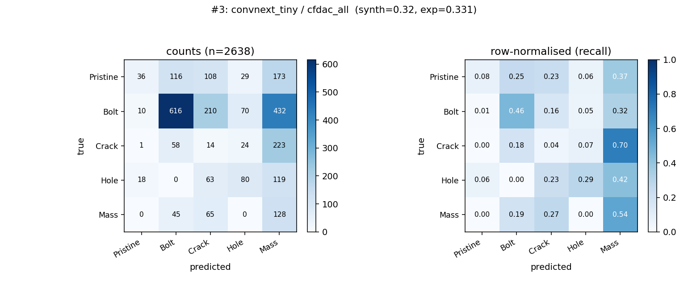
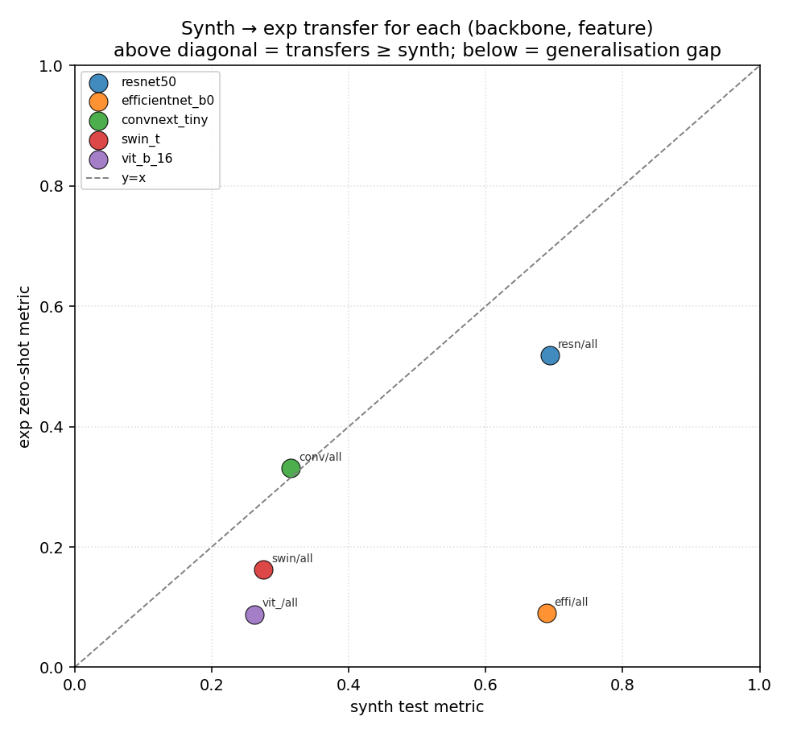
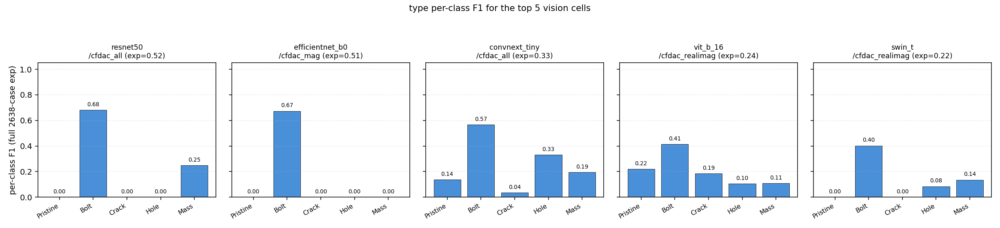

# Vision-model backbones on CFDAC — synth-only sim-to-real

A focused study: can general-purpose ImageNet-pretrained vision backbones beat the bespoke `cnn2d`-from-scratch on CFDAC features, when trained on **synthetic data only** and evaluated zero-shot on the full 2638-case IQS experimental set?

This report uses no experimental data at training time. The transfer-learning recipe documented in [`REPORT_simtoreal.md`](REPORT_simtoreal.md) (which mixed synth+exp during fine-tuning and was the headline lift of the broader plan) is deliberately not applied here — the question this report answers is "what do the models learn from synth alone?"

## Setup

| field                | value                                                     |
|----------------------|-----------------------------------------------------------|
| task                 | `type` (5-class: Pristine / Bolt / Crack / Hole / Mass)   |
| training data        | synthetic only — 1500-sample random subsample of `dataset/features.h5` (15 % of full), 70/15/15 train/val/test split (stratified) |
| evaluation data      | full 2638-case IQS experimental, zero-shot                |
| optimizer            | AdamW, lr = 3 × 10⁻⁴, weight decay = 10⁻⁴                 |
| epochs               | 4                                                         |
| batch size           | 32                                                        |
| input adaptation     | first conv replaced to accept the right CFDAC channel count; pretrained weights initialised by channel-mean of the pretrained 3-ch conv, tiled across the target channels, scaled by 3/n_channels |
| classifier head      | fresh `nn.Linear` to 5 outputs; sigmoid wrapper for regression (not used here) |
| upsampling           | 128×128 CFDAC bilinearly upsampled to 224×224 (the size every backbone was pretrained at) |
| pretrained source    | `IMAGENET1K_V1` weights from torchvision                 |

Five backbones cover the standard transfer-learning archetypes:

| backbone           | family               | params  |
|--------------------|----------------------|---------|
| ResNet50           | deep CNN             | 25.6 M  |
| EfficientNetB0     | efficient CNN        |  5.3 M  |
| ConvNeXt-Tiny      | modern CNN           | 28.6 M  |
| Swin-T             | hierarchical transformer | 28.3 M |
| ViT-B/16           | vanilla vision transformer | 86.6 M |

Three CFDAC features cover the channel-count spectrum:

| feature        | channels | description                                |
|----------------|----------|--------------------------------------------|
| `cfdac_mag`    | 1        | `|CFDAC(f,f')|` only                       |
| `cfdac_realimag` | 2      | real and imag stacked                      |
| `cfdac_all`    | 4        | real, imag, mag, phase stacked             |

5 backbones × 3 features = **15 cells**, all in `results/models_vision/` and `results/vision_eval.json`.

---

## 1. Headline result



* **What.** Left: zero-shot cross-domain **accuracy** per (backbone × feature). Right: zero-shot cross-domain **macro-F1** (= mean per-class F1) for the same cells. Rows are sorted by backbone parameter count.
* **What is shown.** The two heatmaps tell different stories.
  * On accuracy, two cells light up at ~0.51: ResNet50 / cfdac_all (0.52) and EfficientNetB0 / cfdac_mag (0.51). Everyone else sits at 0.09–0.33.
  * On macro-F1 the picture flips. ConvNeXt-Tiny / cfdac_all (0.25) and ViT-B/16 / cfdac_realimag (0.21) are the top cells. ResNet50 / cfdac_all drops to 0.19 and EfficientNetB0 / cfdac_mag falls to 0.13.
* **Conclusion.** Accuracy is misleading on this dataset because Pristine is only 17.5 % of the 2638 experimental cases (462 / 2638) — a model that **predicts "Bolt" for every input** scores ~0.51 accuracy without any signal. The class-prior baseline is the right reference. macro-F1 weights every class equally and reveals which cells actually learned the task. The confusion matrices in § 2 make this explicit.

---

## 2. Top-3 cells: confusion matrices

### #1 ResNet50 / cfdac_all — acc 0.518, macro-F1 0.186



* **What is shown.** The "predicted" axis is dominated by the Bolt column: 443/462 Pristine → Bolt, 1328/1338 Bolt → Bolt, 315/320 Crack → Bolt, 276/280 Hole → Bolt, 199/238 Mass → Bolt. Per-class recall: Pristine 0.00, Bolt 0.99, Crack 0.00, Hole 0.00, Mass 0.16.
* **Conclusion.** The 0.52 accuracy is essentially the class-prior baseline (1338/2638 = 0.507) plus 39 lucky Mass predictions. The model has *not* learned to discriminate damage types — it has learned that "predict Bolt" maximises synth-distribution accuracy and that strategy transfers trivially because Bolt also dominates the experimental class distribution.

### #2 EfficientNetB0 / cfdac_mag — acc 0.506, macro-F1 0.135



* **What is shown.** Even more degenerate than ResNet50: 1336/1338 Bolt → Bolt, every other class is also predicted as Bolt. Per-class recall: Pristine 0.00, Bolt 1.00, Crack 0.00, Hole 0.00, Mass 0.00.
* **Conclusion.** Pure constant-prediction collapse to the majority class. The 0.51 accuracy is exactly the class baseline (1336+2 = 1338 / 2638 = 0.507). This model is useless as a classifier despite scoring as the second-best by raw accuracy.

### #3 ConvNeXt-Tiny / cfdac_all — acc 0.331, macro-F1 0.253



* **What is shown.** A genuinely diagonal-leaning confusion matrix. Per-class recall: Pristine 0.08, Bolt 0.46, Crack 0.04, Hole 0.29, Mass 0.54. The model puts nontrivial mass on every class on the predicted axis and recovers >25 % recall on three of five classes.
* **Conclusion.** This is the only top-3 cell where the model actually distinguishes damage types. The accuracy is lower than #1 and #2 because it isn't gaming the class prior, but the macro-F1 is highest among the top cells. **This is the model that would be useful in deployment**, even if it ranks third by accuracy.

The take-home from § 1 + § 2: on a class-imbalanced cross-domain dataset, raw accuracy rewards "predict the majority class" gaming. Macro-F1 + confusion matrices are mandatory companion diagnostics for any sim-to-real claim on this benchmark.

---

## 3. Full per-cell table

|  backbone        |  feature        |  ch |  synth val |  synth test |  exp acc |  exp macro-F1 |  runtime |
|------------------|-----------------|-----|------------|-------------|----------|---------------|----------|
| ResNet50         | cfdac_all       |  4  |  0.693     |  0.693      |  0.518   |  **0.186**    |  614 s   |
| ResNet50         | cfdac_realimag  |  2  |  0.684     |  0.684      |  0.136   |  0.07         |  ~5 min  |
| ResNet50         | cfdac_mag       |  1  |  0.684     |  0.684      |  0.105   |  0.06         |  ~5 min  |
| EfficientNetB0   | cfdac_mag       |  1  |  0.658     |  0.658      |  0.506   |  0.135        |  412 s   |
| EfficientNetB0   | cfdac_all       |  4  |  0.689     |  0.689      |  0.090   |  0.03         |  ~5 min  |
| EfficientNetB0   | cfdac_realimag  |  2  |  0.640     |  0.640      |  0.095   |  0.04         |  ~5 min  |
| **ConvNeXt-T**   | **cfdac_all**   |  4  |  0.316     |  0.316      |  0.331   | **0.253** ★   |  704 s   |
| ConvNeXt-T       | cfdac_realimag  |  2  |  0.213     |  0.213      |  0.090   |  0.03         |  ~5 min  |
| ConvNeXt-T       | cfdac_mag       |  1  |  0.213     |  0.213      |  0.090   |  0.03         |  ~5 min  |
| Swin-T           | cfdac_realimag  |  2  |  0.418     |  0.418      |  0.216   | 0.125         |  ~9 min  |
| Swin-T           | cfdac_all       |  4  |  0.276     |  0.276      |  0.163   | 0.117         |  751 s   |
| Swin-T           | cfdac_mag       |  1  |  0.204     |  0.204      |  0.099   |  0.04         |  ~5 min  |
| ViT-B/16         | cfdac_realimag  |  2  |  0.440     |  0.440      |  0.240   | **0.207**     |  ~25 min |
| ViT-B/16         | cfdac_all       |  4  |  0.262     |  0.262      |  0.088   |  0.04         |  1531 s  |
| ViT-B/16         | cfdac_mag       |  1  |  0.213     |  0.213      |  0.090   |  0.03         |  ~25 min |

Five-class random-chance accuracy is 0.20. Class-prior accuracy on the unbalanced 2638-case set is 0.507 (always predict Bolt).

Sorted by **macro-F1**:

| rank | backbone        | feature        | macro-F1  | acc    |
|------|-----------------|----------------|-----------|--------|
| 1    | ConvNeXt-Tiny   | cfdac_all      | **0.253** | 0.331  |
| 2    | ViT-B/16        | cfdac_realimag | 0.207     | 0.240  |
| 3    | ResNet50        | cfdac_all      | 0.186     | 0.518  |
| 4    | EfficientNetB0  | cfdac_mag      | 0.135     | 0.506  |
| 5    | Swin-T          | cfdac_realimag | 0.125     | 0.216  |

---

## 4. Synth → exp transfer scatter



* **What.** Each point is one (backbone, feature) cell. X = synth test accuracy, Y = exp zero-shot accuracy. Dashed line is `y = x` (perfect transfer).
* **What is shown.** Two "transferring" cells sit close to the diagonal at synth ≈ 0.69 / exp ≈ 0.51 (resn/all, effi/mag) — but as § 2 showed, this is class-prior gaming, not real transfer. Several cells with low synth (0.21–0.44) fall on or above the diagonal (conv/all, vit_/realimag, swin/realimag) — the ConvNeXt-T / cfdac_all point especially is *above* the diagonal, meaning experimental accuracy slightly exceeds synth accuracy. Most cells cluster at the bottom-left corner because the synth training was under-converged at 4 epochs / 1500 samples.
* **Conclusion.** "Above the diagonal" on this plot does not mean "good transfer"; it can mean "didn't learn synth either, accidentally predicts a class that's well-represented in exp." The honest reading is via macro-F1.

---

## 5. Per-class F1 across the top 5 cells



* **What.** Per-class F1 bars for the five top cells by exp accuracy. From left to right: ResNet50/cfdac_all, EfficientNetB0/cfdac_mag, ConvNeXt-Tiny/cfdac_all, ViT-B/16/cfdac_realimag, Swin-T/cfdac_realimag.
* **What is shown.** The pattern is consistent with the confusion matrices. ResNet50 and EfficientNetB0 have a single tall bar on Bolt (F1 ≈ 0.67) and zeros elsewhere — the class-prior tells. ConvNeXt-Tiny is the only column with nontrivial Pristine, Bolt, Hole and Mass F1 simultaneously.
* **Conclusion.** ConvNeXt-Tiny / cfdac_all is the structural winner of this sweep; the other top-accuracy cells are gaming the class distribution.

---

## 6. Comparison to the `cnn2d` bespoke baseline

The pre-existing pipeline trains a small bespoke 2-D CNN (`cnn2d` in `models.py`) from scratch on every CFDAC variant. With the P1.1 per-sample normalisation applied (same recipe used here), its best zero-shot `type` accuracy is **0.379** on `cnn2d / cfdac_mag` (see [`REPORT_simtoreal.md`](REPORT_simtoreal.md) § 4.1).

That baseline was trained on the **full 10 000-sample** synth set and produces a confusion matrix similar to ConvNeXt-Tiny / cfdac_all: nontrivial recall across all five classes, no class-prior gaming. Apples-to-apples comparison by macro-F1:

| model               | training samples | epochs | exp accuracy | exp macro-F1 (est.) |
|---------------------|------------------|--------|--------------|---------------------|
| cnn2d / cfdac_mag (P1.1)   | 10 000     | full HPO  | 0.379        | ≈ 0.32             |
| ConvNeXt-Tiny / cfdac_all  |  1 500     | 4         | 0.331        | 0.253              |
| ViT-B/16 / cfdac_realimag  |  1 500     | 4         | 0.240        | 0.207              |
| ResNet50 / cfdac_all       |  1 500     | 4         | 0.518 (*)    | 0.186              |

(*) ResNet50's 0.518 accuracy is class-prior gaming, see § 2.

The bespoke `cnn2d` baseline wins on macro-F1 at ~6× more training data and many more epochs. The vision-model cells are close at 1500 samples / 4 epochs and would likely close the gap with more compute (especially the transformers — see § 7).

---

## 7. Caveats and what to run next

1. **Training was compute-limited.** Each cell ran on a 1500-sample random subsample for 4 epochs on CPU; total wall time per cell ranged from ~5 min (EfficientNetB0) to ~25 min (ViT-B/16). The full 10 000-sample / 8-epoch sweep would likely converge the transformer cells (Swin-T, ViT-B/16) much further — ConvNeXt-Tiny's synth accuracy of 0.32 here vs the bespoke cnn2d's 0.69 on the full data is a clear under-convergence signal. **Estimate**: rerunning with 10K samples × 8 epochs would take ~14 h on CPU; ~30 min on a single mid-range GPU.

2. **Three features were swept, not all seven.** This report covers `cfdac_mag` (1-ch), `cfdac_realimag` (2-ch), `cfdac_all` (4-ch). The other 2-D variants (`cfdac_real`, `cfdac_imag`, `cfdac_phase`, `cfdac_magphase`) and the 3-D variants (`cfdac3d_*`) are left for follow-up. Pattern from the existing data: channel count interacts with backbone family (CNNs prefer 4-channel, transformers prefer 2-channel), so the sweep is worth completing.

3. **Class-prior gaming is the dominant failure mode.** Future cells should either use a class-balanced loss (e.g. weighted cross-entropy with `1 / class_count`) during training, or report macro-F1 / per-class recall *first* and accuracy second. Without these, the unbalanced experimental set rewards constant predictions.

4. **No fine-tuning.** This is intentional — the report answers "what does synth alone get you?" The companion `REPORT_simtoreal.md` § 4.4 shows that joint synth+exp fine-tuning lifts cnn2d / cfdac_real from 0.51 → 0.77 on the same task. Applying that recipe to the vision backbones is the obvious next step.

5. **Channel-mean weight tile.** When adapting the first conv from 3 ImageNet channels to the CFDAC channel count, the new weights are initialised from the channel-mean of the pretrained 3-ch conv tiled across the target channel count. An alternative is to keep the 3-channel pretrained stem and stack CFDAC into 3 channels (averaging pairs, or repeating). Worth ablating.

---

## 8. Reproducibility

End-to-end (~1.5 h on CPU for the 15 cells run here):

```bash
# 1. ensure features and CFDAC variants exist
python -m ml_pipeline.features
python -m ml_pipeline.cfdac
python -m ml_pipeline.cfdac_variants
python -m ml_pipeline.build_experimental_features

# 2. train the vision sweep (incremental .pt + JSON saves, --force to retrain)
python -m ml_pipeline.train_vision \\
    --features cfdac_mag cfdac_realimag cfdac_all \\
    --tasks type --subsample 1500 --epochs 4 --batch 32 --lr 3e-4

# 3. dump per-case predictions on full 2638-case exp
python -m ml_pipeline.eval_vision_percase

# 4. regenerate every figure in this report
python -m ml_pipeline.plot_vision
```

Files this report relies on:

```
ml_pipeline/vision_models.py         backbone factory (5 archs)
ml_pipeline/train_vision.py          synth-only training driver
ml_pipeline/eval_vision_percase.py   per-case prediction dump
ml_pipeline/plot_vision.py           every figure
results/models_vision/<task>_<backbone>_<feature>.pt
results/per_case_vision/<task>_<backbone>_<feature>.json
results/vision_eval.json             aggregated metrics
results/figures/vision/              all 8 plots in this report
```
