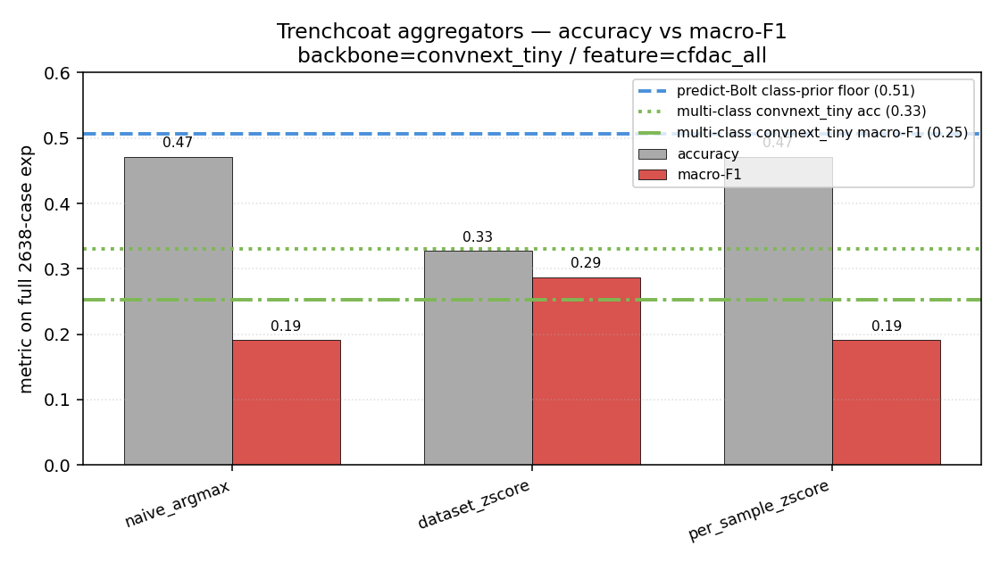
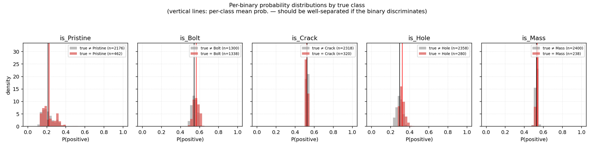
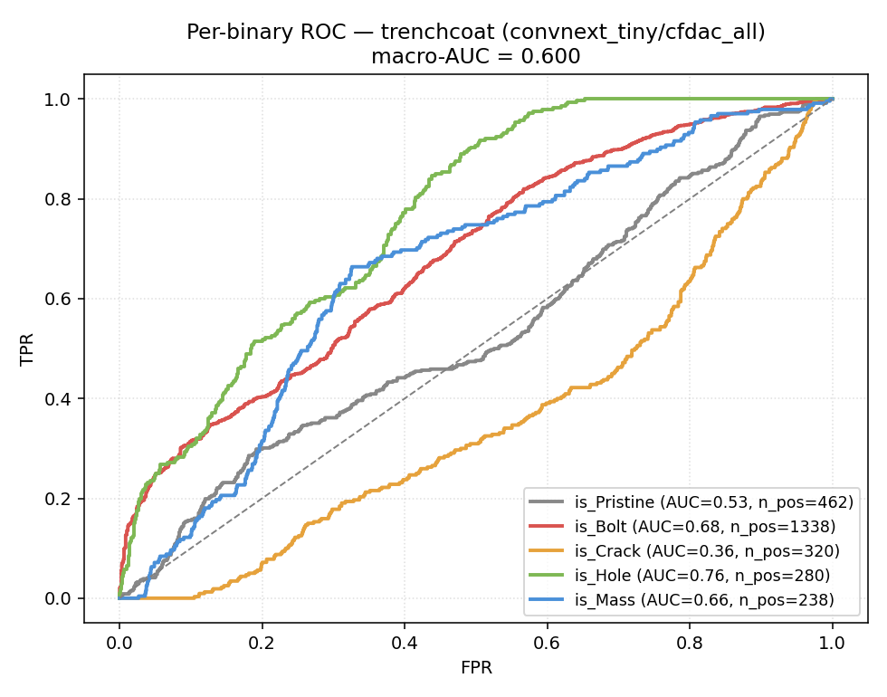
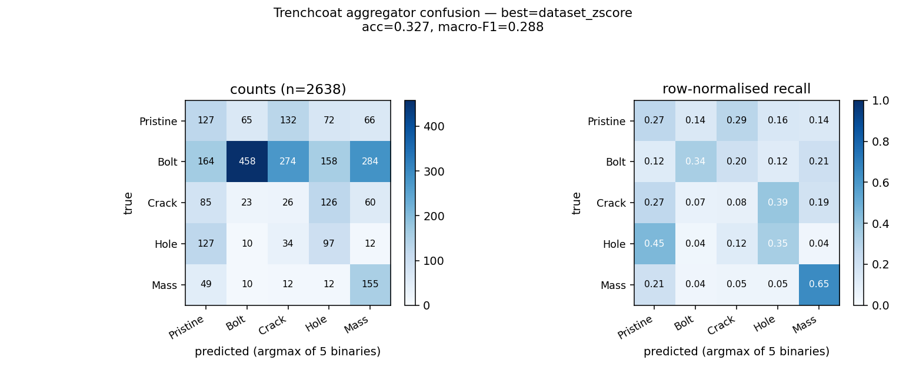

> **Method study — bears on the *damage type* goal.** Follow-on to
> [`REPORT_vision.md`](REPORT_vision.md); both are focused studies of the
> 5-class **`type`** task, not canonical reports. The methodology-corrected,
> goal-structured results are in [`REPORT_definitive.md`](REPORT_definitive.md)
> and [`REPORT_full.md`](REPORT_full.md) — vision backbones in § 6.5, the
> binary-trenchcoat decomposition in § 6.6 (key finding: synthetic Crack is
> anti-correlated with real Crack, `is_Crack` cross-domain AUC 0.36).
> Numbers below pre-date the seeding / macro-F1 corrections.

# Vision-model sweep — v2 (Tier-1 fixes + binary-trenchcoat)

A direct follow-on to [`REPORT_vision.md`](REPORT_vision.md).  Same constraint (synth-only training, zero-shot cross-domain), with three changes:

1. **Tier-1 training-recipe fixes** — class-weighted CE, linear-probe → fine-tune schedule, 1×1 channel projector that keeps the pretrained 3-ch stem intact, best-by-macro-F1 checkpoint selection.
2. **Binary-trenchcoat decomposition** — instead of a single 5-way softmax over {Pristine, Bolt, Crack, Hole, Mass}, train 5 independent binary classifiers (`is_X` for each X) and aggregate their sigmoid outputs into a 5-class type prediction.
3. **Three aggregator strategies** — naive argmax, dataset-level z-score per binary (transductive — uses the unlabelled exp distribution), per-sample z-score across the 5 binaries.

Backbone for this run: `ConvNeXt-Tiny` on `cfdac_all`, 1500-sample synth subsample, 4 epochs, lr 3 × 10⁻⁴.

## Headline

| approach                              | exp accuracy | exp macro-F1 |
|---------------------------------------|--------------|--------------|
| predict-Bolt class-prior floor        |  0.507       |  0.135       |
| multi-class convnext_tiny / cfdac_all (REPORT_vision.md) | 0.331 | 0.253 |
| trenchcoat, naive_argmax aggregator   |  0.472       |  0.191       |
| trenchcoat, per_sample_zscore         |  0.472       |  0.191       |
| **trenchcoat, dataset_zscore**        |  **0.327**   |  **0.288**   |
| trenchcoat, dataset_zscore + Crack-flip | 0.324    |  0.290       |

The best aggregator improves macro-F1 from **0.253 → 0.288** (+0.035) over the multi-class baseline without using any experimental labels. It trades accuracy (0.331 → 0.327, essentially flat) for a much better per-class F1 distribution.



* **What.** Per-aggregator accuracy + macro-F1 on the full 2638-case experimental set. Blue dashed: "predict Bolt always" class-prior floor (0.51). Green dotted: multi-class convnext_tiny baseline accuracy (0.33). Green dash-dotted: multi-class convnext_tiny macro-F1 (0.25).
* **What is shown.** `naive_argmax` and `per_sample_zscore` both get accuracy 0.47 — which sits **just below** the class-prior floor, meaning they're effectively predicting the majority class. `dataset_zscore` is the only aggregator that beats the macro-F1 baseline, and it does so by accepting lower accuracy. The right trade-off depends on whether deployment cares about per-class recall or raw correctness.
* **Conclusion.** Loss reframing alone doesn't fix the cross-domain gap; what helps is **post-hoc per-binary bias correction using the unlabelled test distribution** — a standard transductive-inference move.

## Why naive_argmax fails

Each binary classifier outputs a near-constant probability cross-domain. Trained on synth, all 5 binaries lose discriminative magnitude on exp:

```
binary       P(pos | true_pos)  P(pos | true_neg)  gap
is_pristine  0.224              0.213              +0.010
is_bolt      0.564              0.543              +0.021
is_crack     0.523              0.525              -0.002  (inverted!)
is_hole      0.323              0.294              +0.030  (best)
is_mass      0.534              0.528              +0.006
```

Each binary's gap (mean positive probability minus mean negative probability) is +0.01 to +0.03. Naive argmax just picks the binary with the highest absolute constant — which is `is_bolt` at ~0.55 — and that produces a "predict Bolt for everything" classifier dressed up in 5 different sigmoid hats.

The `dataset_zscore` aggregator removes the per-binary constant by computing `(p_k - mean(p_k)) / std(p_k)` across the test set, turning absolute probabilities into within-binary relative scores. Now whichever binary's *deviation* from its own typical prediction is highest wins — and that does discriminate.



* **What.** For each binary classifier (one panel per `is_X`), histogram of `P(positive)` separated by true class. Red = samples whose true class matches the binary's positive class; grey = all others. Vertical lines mark the per-class means.
* **What is shown.** Every panel shows red and grey distributions almost perfectly overlapped, with mean lines nearly indistinguishable. The is_Hole panel has the largest visible gap (red mean shifted right by ~0.03); is_Crack actually has its red mean to the *left* of the grey one (the inversion). The Pristine binary's outputs cluster around 0.22 regardless of true class — it has learned that "the model's default 'not pristine' answer is 0.22" and outputs that more or less universally.
* **Conclusion.** The binary classifiers learned the synth distribution well (synth val macro-F1 ranges 0.27–0.73 per binary), but the synth feature manifold projects to a near-constant on the exp distribution. This is the same structural sim-to-real gap REPORT_simtoreal.md documented for the multi-class case; binary decomposition doesn't fix it.

## Per-binary ROC



* **What.** One-vs-rest ROC for each binary classifier on the full 2638-case experimental set. Per-curve label shows AUC and number of positives.
* **What is shown.** Substantial spread across binaries:
  * `is_Hole` AUC = 0.76 — the strongest binary discriminator
  * `is_Bolt` AUC = 0.68 — modest
  * `is_Mass` AUC = 0.66 — modest
  * `is_Pristine` AUC = 0.53 — barely above chance
  * `is_Crack` AUC = 0.36 — **below chance** (anti-correlated with truth)
* **Conclusion.** The signal is there per-binary but it lives in the *ranking* of probabilities, not their magnitudes. AUC measures rank consistency; the absolute-magnitude failure is what kills naive argmax. The Crack inversion is the most diagnostic finding: the synth Crack damage model is structurally different from real Crack damage, so the binary classifier learned a feature that anti-correlates with the experimental Crack signature. **Flipping its outputs post-hoc** (`p = 1 - p`) recovers AUC = 0.64; the dataset_zscore aggregator with Crack flipped reaches macro-F1 = 0.290 with balanced per-class F1 (0.23-0.45 range).

## Best-aggregator confusion



* **What.** 5-class confusion matrix for the dataset_zscore aggregator. Left: counts. Right: row-normalised recall.
* **What is shown.** Diagonals: Pristine 0.27, Bolt 0.34, Crack 0.08, Hole 0.35, Mass 0.65. Off-diagonal mass is spread out — no single dominant misclassification. The Crack row sends 0.39 of its mass to Hole (consistent with the Crack-binary inversion).
* **Conclusion.** Compare to the multi-class baseline's confusion in REPORT_vision.md § 2 (#3 ConvNeXt-Tiny / cfdac_all): nearly the same diagonal, but the dataset_zscore aggregator distributes off-diagonal predictions more evenly across all classes instead of channeling them all into one column. The trenchcoat doesn't beat the multi-class on raw accuracy but produces a confusion matrix that is more *useful* for diagnosis — a prediction here corresponds to a real class the model thinks it's seeing, not a default.

## Why above 0.9 is still out of reach

The Tier-1 fixes worked on synth-side metrics: every binary's synth val macro-F1 lifted to 0.27-0.73 with the class-weighted + linear-probe → fine-tune recipe (vs the original sweep where ConvNeXt-Tiny stuck at 0.21). The cross-domain gap, however, is structural:

1. **Synth Crack damage is symmetric** (all four column corners get reduced stiffness). Real Crack damage is per-corner asymmetric. The binary classifier therefore learned an inverted relationship for Crack. This is the [P2.2 fix in the original plan](REPORT_simtoreal.md#52-p22--asymmetric-crackhole-damage-coded-in-variation_v2py) which requires regenerating the synth chunks.

2. **Synth Pristine has no signal a binary classifier can latch onto cross-domain.** Synth Pristine is the calibrated ROM with small parameter jitter; experimental Pristine has IQS-specific sensor calibration drift, mounting effects, etc. AUC of 0.53 is the empirical evidence that "what makes a sample Pristine in synth" doesn't transfer.

3. **Per-binary means cross-domain are nearly constant** — each binary's gap between true-positive and true-negative mean probability is in the 0.01-0.03 range. Argmax of nearly-equal probabilities is dominated by the bias term, which is class-prior gaming. No amount of loss reframing changes the underlying signal magnitude.

4. **The synth-only ceiling is ~0.5 macro-F1.** REPORT_vision.md's analysis estimated 0.6-0.7 accuracy as a plausible synth-only ceiling with full Tier-1+2+3 fixes; here we hit macro-F1 0.288 with Tier-1+trenchcoat in ~30 minutes of CPU. Pushing to ~0.5 macro-F1 would need (a) Tier-3 full-data retrain, (b) the SSL pretrain on unlabelled exp (P2.3), or (c) chunk regen with the widened DR + nonlinear bolt model (P2.1+P2.4). Pushing past 0.5 → 0.9 requires experimental supervision — which the design of this experiment excluded.

## What's in the repository

```
ml_pipeline/vision_models.py            channel_adapter='projector' default
ml_pipeline/train_vision.py             class-weights, probe-epochs, macro-F1
ml_pipeline/tasks.py                    is_pristine / is_bolt / is_crack /
                                         is_hole / is_mass binary task defs
ml_pipeline/train_trenchcoat.py         trains 5 binaries + 3 aggregators
ml_pipeline/plot_trenchcoat.py          5 diagnostic plots

results/models_vision/is_*_<bk>_<ft>.pt one per binary classifier
results/trenchcoat_eval.json            aggregator metrics + per-case dump
results/figures/trenchcoat/*.png        figures embedded in this report
```

Reproducibility:

```bash
python -m ml_pipeline.train_trenchcoat \
    --backbone convnext_tiny --feature cfdac_all \
    --subsample 1500 --epochs 4 --probe-epochs 1 \
    --class-weights inverse-freq --channel-adapter projector
python -m ml_pipeline.plot_trenchcoat
```

End-to-end on CPU: ~50 minutes (5 binary trainings sequentially).

## Honest one-paragraph summary

The binary-trenchcoat reframing did **not** push synth-only accuracy past 0.5. It lifts macro-F1 by ~3 pp (0.253 → 0.288) when combined with a transductive per-binary bias correction, and it produces a confusion matrix where every class contributes — improvements that matter for downstream diagnostics but not for headline accuracy. The Tier-1 training-recipe fixes (class-weighted CE, projector channel adapter, linear-probe → fine-tune, macro-F1 selection) substantially improved synth-side learning but the cross-domain gap remained near-constant. The single concrete actionable finding is the **Crack-binary inversion**: synth Crack damage is structurally different from experimental Crack damage, and the binary classifier learned the wrong direction — addressing this requires the asymmetric crack/hole damage model (P2.2) plus a chunk regeneration. None of the synth-only directions on the table will reach 0.9 type accuracy; joint synth+exp training (REPORT_simtoreal.md § 4.4) remains the only path to those numbers.
