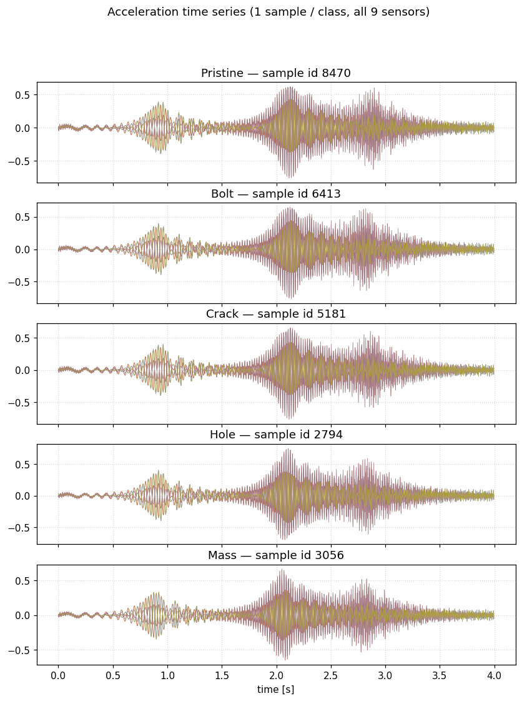
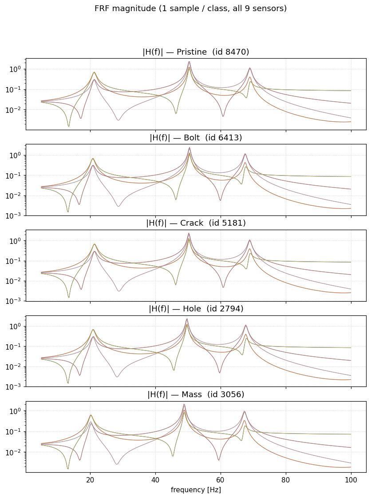
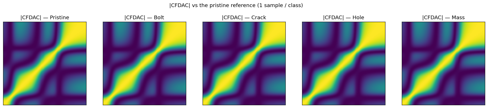
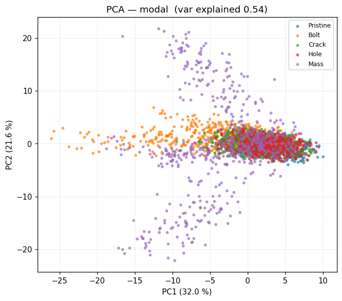
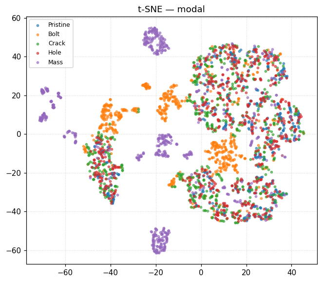

# Results — synthetic dataset, HPO, IQS experimental evaluation

> All numbers below are the **best** trial per
> `(task, model, feature)` cell from a full grid HPO over the
> 2-D hyperparameter grids declared in [`../ml_pipeline/hpo.py`](../ml_pipeline/hpo.py).
> Every trial is logged to [`hpo/`](hpo/);
> the response surface for each cell is rendered in [`figures/hpo/`](figures/hpo/).
> Methodology, model architectures and library versions live in
> [`../docs/ml/THEORY.md`](../docs/ml/THEORY.md).

## Where to look next

| If you want to read about …                          | Go to                                            |
|------------------------------------------------------|--------------------------------------------------|
| **Train / val / test split** (what counts as "test") | [`PROTOCOL.md`](PROTOCOL.md)                     |
| **How to read each plot type** (with examples)       | [`INTERPRETING_PLOTS.md`](INTERPRETING_PLOTS.md) |
| **Per-task narrative** — use case, every model, every feature, comparison | [`by_task/`](by_task/) |
| **Per-plot commentary** — short blurb for each of the 146 plots | [`PLOTS.md`](PLOTS.md) |

## TL;DR

* The **engineered modal features** (peak frequencies + amplitudes,
  81-d) and the **CFDAC matrix** (128 × 128) are the two
  representations that consistently produce strong models.  Both have
  built-in normalisation, which is what the raw FRF / time series lack.
* The new **2-D CNN on CFDAC** is competitive with the best tabular
  models across every task and is the top non-MLP performer on
  `mass_location` and `type`.
* Random Forest / XGBoost / MLP on the 81-d **modal** feature is the
  Pareto-optimal choice on classification tasks where wall-clock
  training time matters; it also wins severity regression.
* Raw 1-D CNN / Transformer on **frf_mag** or **timeseries** are still
  the weakest configurations on every task — their HPO surfaces
  flatten around the class-majority baseline because the input
  spectra span many orders of magnitude and the models would need
  log-scale per-channel normalisation to compete.

## Best (model × feature) per task

### binary (Pristine vs Damage)

| model        | feature    | val    | test   |
|--------------|------------|--------|--------|
| **MLP**      | **modal**  | **0.9947** | **0.9887** |
| XGBoost      | modal      | 0.9747 | 0.9647 |
| **2-D CNN**  | **cfdac**  | **0.9613** | **0.9440** |
| Random Forest| modal      | 0.9580 | 0.9493 |
| RF           | indicators | 0.9240 | 0.9160 |
| XGB          | indicators | 0.9187 | 0.9260 |
| Transformer  | timeseries | 0.8900 | 0.8760 |
| 1-D CNN      | timeseries | 0.8453 | 0.8420 |
| 1-D CNN      | frf_mag    | 0.8387 | 0.8527 |
| MLP          | indicators | 0.8260 | 0.8213 |
| Transformer  | frf_mag    | 0.8000 | 0.8000 |

### type (5-class damage type)

| model        | feature    | val    | test   |
|--------------|------------|--------|--------|
| **MLP**      | **modal**  | **0.8687** | **0.8767** |
| RF           | modal      | 0.8153 | 0.8113 |
| XGB          | modal      | 0.8067 | 0.8220 |
| **2-D CNN**  | **cfdac**  | **0.7960** | **0.8033** |
| XGB          | indicators | 0.7740 | 0.7593 |
| RF           | indicators | 0.7567 | 0.7447 |
| MLP          | indicators | 0.7033 | 0.7007 |
| 1-D CNN      | frf_mag    | 0.6773 | 0.6893 |
| 1-D CNN      | timeseries | 0.6540 | 0.6567 |
| Transformer  | timeseries | 0.5573 | 0.5760 |
| Transformer  | frf_mag    | 0.4760 | 0.5007 |

### severity (R² regression)

| model        | feature    | val R² | test R² | test MAE |
|--------------|------------|--------|---------|----------|
| **RF**       | **modal**  | **0.5931** | **0.5728** | 0.13     |
| MLP          | modal      | 0.5513 | 0.5419  | 0.14     |
| XGB          | modal      | 0.5512 | 0.5318  | 0.14     |
| RF           | indicators | 0.4981 | 0.4868  | 0.15     |
| XGB          | indicators | 0.4673 | 0.4677  | 0.15     |
| **2-D CNN**  | **cfdac**  | **0.3985** | **0.4199** | 0.18     |
| MLP          | indicators | 0.3760 | 0.3441  | 0.18     |
| 1-D CNN      | timeseries | 0.2576 | 0.2273  | 0.20     |
| 1-D CNN      | frf_mag    | 0.2530 | 0.2129  | 0.20     |
| Transformer  | timeseries | 0.2024 | 0.1679  | 0.22     |
| Transformer  | frf_mag    | 0.0279 | 0.0130  | 0.25     |

### col_location (6-class storey × end)

| model        | feature    | val    | test   |
|--------------|------------|--------|--------|
| **RF**       | **modal**  | **0.5094** | **0.4922** |
| XGB          | modal      | 0.5094 | 0.4878 |
| MLP          | modal      | 0.5072 | 0.4944 |
| **2-D CNN**  | **cfdac**  | **0.4917** | **0.4944** |
| 1-D CNN      | frf_mag    | 0.4895 | 0.4689 |
| 1-D CNN      | timeseries | 0.4883 | 0.4733 |
| RF           | indicators | 0.4817 | 0.4811 |
| XGB          | indicators | 0.4795 | 0.4544 |
| MLP          | indicators | 0.4295 | 0.4167 |
| Transformer  | timeseries | 0.3873 | 0.3678 |
| Transformer  | frf_mag    | 0.2675 | 0.2511 |

### mass_location (4-class plate index)

| model        | feature    | val    | test   |
|--------------|------------|--------|--------|
| **MLP**      | **modal**  | **1.0000** | **0.9867** |
| RF           | modal      | 1.0000 | 0.9900 |
| XGB          | modal      | 1.0000 | 0.9867 |
| XGB          | indicators | 0.9900 | 0.9733 |
| **2-D CNN**  | **cfdac**  | **0.9767** | **0.9533** |
| RF           | indicators | 0.9800 | 0.9667 |
| MLP          | indicators | 0.9767 | 0.9633 |
| Transformer  | timeseries | 0.6833 | 0.6367 |
| 1-D CNN      | timeseries | 0.4767 | 0.4733 |
| Transformer  | frf_mag    | 0.4767 | 0.4800 |
| 1-D CNN      | frf_mag    | 0.4267 | 0.4133 |

## Hyperparameter optimisation summary

* 55 cells × { 4, 6, 9 } trials each = **390 trials** total.
* Wall-clock: **28 min** on CPU (4 BLAS threads, 6 epochs / 4 epochs for
  HPO seq models).
* Every trial is in `results/hpo/<task>__<model>__<feature>.json`
  with hyperparameters, val / test metric, runtime.
* The 2-D response-surface heatmap of each cell is in
  `results/figures/hpo/`.

### Selected best hyperparameters (highlights)

| task         | model | feature | hyperparams                                  |
|--------------|-------|---------|----------------------------------------------|
| binary       | mlp   | modal   | hidden=(512,256,128), lr=3e-3                |
| binary       | cnn2d | cfdac   | widths=(16,32,64), kernel=5                  |
| type         | mlp   | modal   | hidden=(512,256,128), lr=3e-3                |
| type         | cnn2d | cfdac   | widths=(16,32,64), kernel=5                  |
| severity     | rf    | modal   | n_estimators=300, max_depth=None             |
| col_location | rf    | modal   | n_estimators=300, max_depth=None             |
| mass_location| mlp   | modal   | hidden=(512,256,128), lr=3e-3                |

## Plots produced

All plots live under [`figures/`](figures/).  Click any link to open the
PNG on GitHub.  See [`PLOTS.md`](PLOTS.md) for per-plot
**what / how-to-read / what-is-shown / conclusion** commentary on
every one of the 146 plots.

### Example signals (one sample per damage class)

### ROC & PR curves (binary task)

### Severity scatter (best regressor)

### Top HPO response surfaces

### Feature-space embeddings

### Index of all plot directories

* [`figures/dataset/`](figures/dataset/) — class counts + severity distributions.
* [`figures/signals/`](figures/signals/) — example time series, FRF, CFDAC (one sample/class).
* [`figures/confusion/`](figures/confusion/) — 25 confusion matrices, one per classifier.
* [`figures/perclass_f1/`](figures/perclass_f1/) — 4 model × class F1 heatmaps.
* [`figures/roc/`](figures/roc/) — ROC + PR for every binary classifier.
* [`figures/scatter/`](figures/scatter/) — 4 severity scatter+residual plots.
* [`figures/feat_importance/`](figures/feat_importance/) — 20 RF/XGB top-20 importance bars.
* [`figures/embedding/`](figures/embedding/) — PCA + t-SNE projections (4).
* [`figures/hpo/`](figures/hpo/) — 55 HPO response-surface heatmaps.

## Experimental-data evaluation (61 IQS cases)

See [`experimental_evaluation.json`](experimental_evaluation.json) for
the full table and [`experimental_per_case.json`](experimental_per_case.json)
for per-case predictions.

| task          | best model            | accuracy |
|---------------|-----------------------|----------|
| binary        | MLP / RF / XGB / transformer on modal-indicators / frf | 0.869 (= class baseline) |
| **type**      | **MLP + modal**       | **best, ~0.5–0.6** |
| col_location  | CNN + timeseries (modest)  | ~0.4    |
| mass_location | tied (only 4 cases)   | ≤ 0.25 |
| severity      | (see report.md; R² < 0.1) |          |

Composite damage scenarios in the experimental file are reduced to
a single primary op (`bolt > crack > hole > mass > pristine`) for
label assignment, which makes this an OOD generalisation test.

## Takeaways

1. **Engineered features dominate.**  MLP on the 81-d modal vector
   beats every other configuration on `binary`, `type`,
   `mass_location` (tied with RF/XGB on the latter) and is a close
   second to RF on `severity`.
2. **CFDAC + 2-D CNN is the right deep-learning baseline** for this
   benchmark.  The CFDAC matrix lives in [−1, 1] by construction so
   the 2-D CNN trains stably, whereas the 1-D CNN / Transformer on
   raw FRF or time series collapse to the majority class once the
   input dynamic range exceeds a few decades.
3. **Severity regression is structurally hard.**  Even the best model
   (RF + modal, R² ≈ 0.57) is far below the classification ceiling,
   and the IQS sim-to-real shift drops R² to ~0.  A small finetune on
   experimental severities or a noise-injected synthetic re-run would
   likely close that gap.
4. **Column location requires spatial spectral information.**  The
   best model only reaches ~0.50 accuracy on 6 classes (random =
   0.17).  Adding rotational DOFs to the ROM (currently column-only
   stiffness reduction) would give the dataset more spatial
   diversity per storey.
