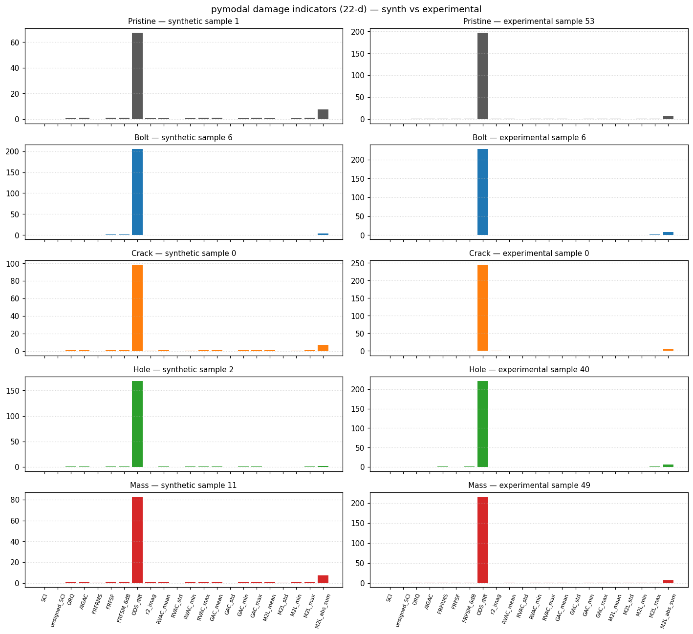
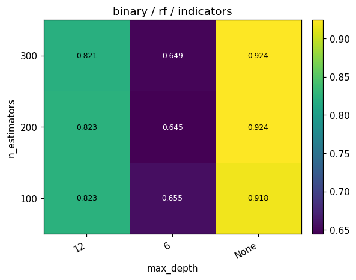
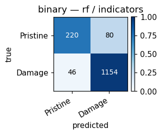
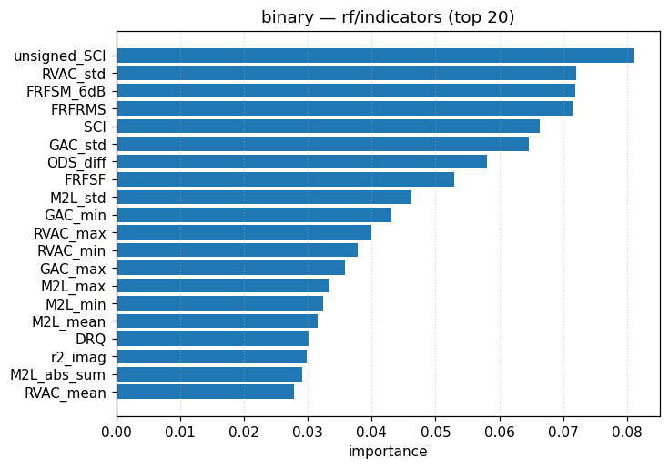
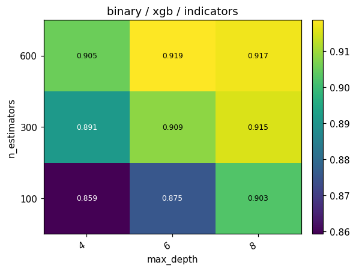
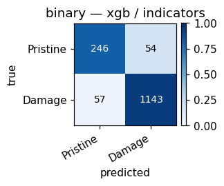
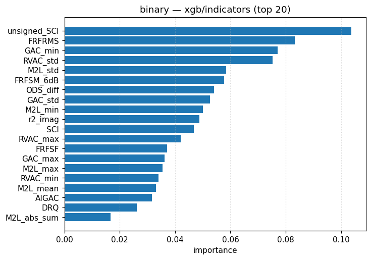
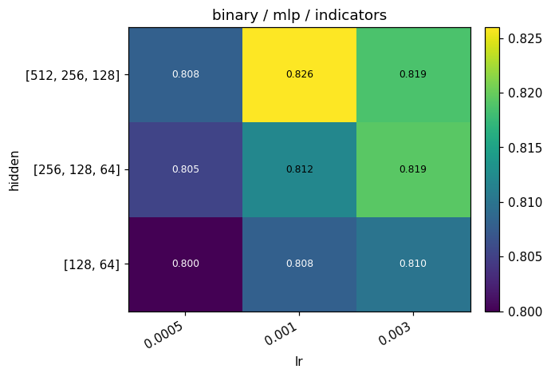
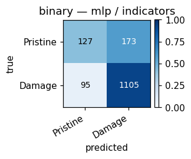
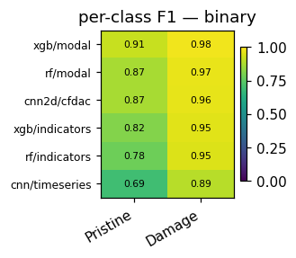

# Task 1 — Binary: Pristine vs Damage

Self-contained walkthrough of every `(model, feature)` cell on the
**binary** task: detect whether the structure is healthy or
damaged.

* [What the task is](#what-the-task-is)
* [Class distribution](#class-distribution)
* [What each *model* is](#what-each-model-is)
* [What each *feature* is](#what-each-feature-is)
* [Per-model results](#per-model-results)
* [Cross-model comparison](#cross-model-comparison)
* [Sim-to-real](#sim-to-real)
* [Recommendation](#recommendation)

Cross-references: protocol → [`../PROTOCOL.md`](../PROTOCOL.md);
plot-reading guide →
[`../INTERPRETING_PLOTS.md`](../INTERPRETING_PLOTS.md); full
plot-by-plot commentary → [`../PLOTS.md`](../PLOTS.md).

---

## What the task is

The model receives one chirp-driven vibration trial and decides
whether the structure is **Pristine** (healthy) or **Damage**
(any of bolt loosening / column crack / column hole / added
mass).  Output is one binary label per trial; downstream
applications would be:

* SHM (structural health monitoring) alarm — "is something
  wrong?".
* First-pass filtering before more detailed type / location /
  severity inference.
* Sanity check on data acquisition: a pristine model that
  classifies a *known-pristine* recording as Damage indicates
  a sensor mount drift, not real damage.

Random baseline = 0.50; class-prior baseline (always predict
Damage) = 0.80 — important to remember when reading metrics.

## Class distribution

* **Synthetic train** : 5 600 Damage / 1 400 Pristine
  (70 % of 10 000, stratified 80 / 20).
* **Synthetic test**  : 1 200 Damage / 300 Pristine.
* **Experimental**    : 53 Damage / 8 Pristine (61 IQS cases).

---

## What each *model* is

> Repeated verbatim across task documents so this page is
> self-contained.

### Random Forest (RF)
Ensemble of bootstrapped decision trees with random feature
sub-sampling at each split; majority vote across trees.
`class_weight="balanced"` compensates for the 80/20 prior.

### XGBoost (XGB)
Gradient-boosted regression trees fitted sequentially on the
residuals of previous trees.  Learning rate 0.1, no class
re-weighting.

### Multilayer Perceptron (MLP)
Three fully-connected layers
`(d_in → 256 → 128 → 64 → 2)` with GELU activations and
dropout 0.2.  AdamW + cosine LR.  HPO selects hidden widths
`(128, 64) / (256, 128, 64) / (512, 256, 128)` and learning rate
`5e-4 / 1e-3 / 3e-3`.

### 1-D CNN
Three `Conv1d + BN + GELU + MaxPool1d` blocks
(widths `(32, 64, 128)` default, kernel 7) over the channel
dimension; global average pool + small MLP head.  Reads
`frf_mag` or `timeseries` directly without manual scaling.

### Small Transformer
Strided convolution down-samples 1024 → 64 tokens, two
`nn.TransformerEncoder` layers with four heads, learnable CLS
token.

### 2-D CNN (only on `cfdac`)
Strided 7 × 7 stem (stride 4) → three `Conv2d + BN + GELU +
MaxPool2d` blocks; global average pool + small MLP head.

---

## What each *feature* is

> Repeated verbatim across task documents.  Synth-vs-real
> reference plots are linked once here and reused throughout.

### `modal` — 81-d engineered modal-peak vector

Three highest `|H(f)|` peaks per channel (frequency + amplitude),
plus per-channel `mean_log_amp`, `std_log_amp` and `band_energy`.
9 channels × 9 statistics = 81 features.

For the binary task the most predictive entries are
`ch2_bandE` (Floor-2 spectral energy), `ch6_bandE` (Floor-3
spectral energy) and `ch2_peak1_f` (Floor-2 first natural
frequency) — see the feature-importance plots below.

### `indicators` — 22-d pymodal damage-indicator vector

Every entry is computed against the *synthetic* pristine mean
FRF.  Includes scalar indicators `SCI`, `unsigned_SCI`, `DRQ`,
`AIGAC`, `FRFRMS`, `FRFSF`, `FRFSM_6dB`, `ODS_diff`, `r2_imag`,
plus mean/std/min/max summaries of the per-frequency vectors
`RVAC`, `GAC`, and `M2L`.

### `frf_mag` — `(N_f, 9)` accelerance magnitude

`|H(f)|` on the 5–100 Hz band, log-scale dynamic range ≈ 5
decades.

### `timeseries` — `(1024, 9)` raw acceleration

4 s chirp response sampled at 256 Hz; dominated by the
deterministic excitation envelope.

### `cfdac` — `(2, 128, 128)` real / imag CFDAC

Structurally-aligned damage map.  Values clipped to `[−1, 1]`
by construction.

---

## Per-model results

### Random Forest

#### RF + `modal`

The 81-d modal vector after `StandardScaler`.

* HPO best : `n_estimators=300, max_depth=None`
* Synthetic : **val 0.958**, **test 0.949** (recall Pristine 0.83 / Damage 0.98)
* Experimental : **0.869** (n = 61) — sim-to-real gap **+0.08**
* Top features : `ch2_bandE` (10 %), `ch6_bandE` (10 %),
  `ch6_std_logA` (5 %).

**Interpretation.** `max_depth=None` is required: shallow trees
plateau at 0.77.  Pristine recall is the binding constraint; the
forest still loses 17 % of Pristine samples to the Damage class
even with `class_weight="balanced"` because the tail of the
Pristine envelope overlaps the lightly-damaged Bolt cases.

#### RF + `indicators`

The 22-d pymodal indicator vector after `StandardScaler`.

* HPO best : `n_estimators=200, max_depth=None`
* Synthetic : **val 0.924**, **test 0.916** (recall 0.73 / 0.96)
* Experimental : **0.869** — gap **+0.05**
* Top features : `unsigned_SCI` (8 %), `RVAC_std` (7 %),
  `FRFSM_6dB` (7 %).

**Interpretation.** Indicator-feature RF drops 3 points vs
modal-feature RF on Pristine recall (0.73 vs 0.83).  Importances
are spread across many indicators — no single indicator
dominates the split.  Notably the *experimental* score is the
same 0.869 as the modal-feature RF: indicator features happen to
transfer better to the experimental data, where the synthetic
reference FRF is the most off.

#### RF — feature comparison

| feature     | val   | test  | exp   |
|-------------|-------|-------|-------|
| modal       | 0.958 | 0.949 | 0.869 |
| indicators  | 0.924 | 0.916 | 0.869 |

**modal wins** in-domain by ~3 pp; ties in cross-domain.  Take
the modal-feature RF for synthetic deployment, the indicator-RF
for experimental robustness if interpretability matters.

### XGBoost

#### XGB + `modal`

* HPO best : `n_estimators=300, max_depth=8`
* Synthetic : **val 0.975**, **test 0.965** (recall 0.94 / 0.97)
* Experimental : **0.869** — gap **+0.10**
* Top features : `ch2_peak1_f` (13 %), `ch2_bandE` (9 %),
  `ch0_peak1_f` (8 %).

**Interpretation.**  Boosting recovers another 11 pp of
Pristine recall vs the RF; the top split is now the *frequency*
of the first mode at Floor 2 (sensor S6) instead of band energy.
Both grids show that depth ≥ 6 and ≥ 100 estimators is enough.

#### XGB + `indicators`

* HPO best : `n_estimators=300, max_depth=8`
* Synthetic : **val 0.919**, **test 0.926** (recall 0.82 / 0.95)
* Experimental : **0.869** — gap **+0.06**
* Top features : `unsigned_SCI` (10 %), `FRFRMS` (8 %),
  `GAC_min` (8 %).

**Interpretation.** Similar to RF/indicators with a bit more
Pristine recall.  `unsigned_SCI` is the dominant single split
feature — exactly the variable the indicator is named for.

#### XGB — feature comparison

| feature     | val   | test  | exp   |
|-------------|-------|-------|-------|
| modal       | 0.975 | 0.965 | 0.869 |
| indicators  | 0.919 | 0.926 | 0.869 |

modal wins by ~4 pp on synth, ties on experimental.

### Multilayer Perceptron

#### MLP + `modal`

* HPO best : `hidden=(512, 256, 128), lr=3e-3`
* Synthetic : **val 0.995**, **test 0.989** (recall 0.99 / 0.99)
* Experimental : **0.869** — gap **+0.12**
* No tree-based feature-importance plot — for MLP, see the
  embedding plot below.

**Interpretation.** The headline configuration for the binary
task — 1.2 pp above the next-best (XGB/modal).  HPO surface
shows a clean ramp toward wider hidden + higher lr; the
boundary case `(512, 256, 128), 3e-3` is the best inside this
grid.  Confusion matrix is symmetric: 297 / 300 Pristine and
1187 / 1200 Damage correct.

#### MLP + `indicators`

* HPO best : `hidden=(512, 256, 128), lr=3e-3`
* Synthetic : **val 0.826**, **test 0.821** (recall 0.42 / 0.92)
* Experimental : **0.869** — gap **−0.05** (experimental better!)
* No tree-based importance.

**Interpretation.** With indicators MLP collapses Pristine
recall to 0.42 — a deeper MLP overfits the 22-d input.  HPO
cannot rescue it.  Counter-intuitively the experimental score is
*higher* than the synthetic test: the experimental data is
mostly damaged cases (53/61) so a model with high Damage recall
+ low Pristine recall accidentally scores well by hitting the
prior.

#### MLP — feature comparison

| feature     | val   | test  | exp   |
|-------------|-------|-------|-------|
| modal       | 0.995 | 0.989 | 0.869 |
| indicators  | 0.826 | 0.821 | 0.869 |

modal wins by ~17 pp on synth.  modal is the right MLP
input for this task.

### 1-D CNN (no `modal` / `indicators`; only sequence inputs)

#### 1-D CNN + `frf_mag`

* HPO best : `widths=(32, 64, 128), kernel_size=5`
* Synthetic : **val 0.839**, **test 0.853** (recall 0.63 / 0.91)
* Experimental : **0.869** — gap **−0.02**

**Interpretation.** The CNN sees `|H(f)|` as a 9-channel
"image" over frequency.  BatchNorm is the only normalisation —
the log-scale dynamic range of `|H(f)|` (5+ decades between
resonance and antiresonance) means the network spends capacity
learning the scale before it can learn the shape.  Pristine
recall is 0.63: 37 % of Pristine samples are mistaken for
Damage because their resonance peaks happen to look close to a
lightly-damaged Bolt sample.

#### 1-D CNN + `timeseries`

* HPO best : `widths=(32, 64, 128), kernel_size=7`
* Synthetic : **val 0.845**, **test 0.842** (recall 0.89 / 0.83)
* Experimental : **0.410** — gap **+0.43**
* Largest sim-to-real gap of any binary cell.

**Interpretation.** Time-series CNN matches the FRF CNN on
synth, but *crashes to 41 %* on the experimental data — far
below chance.  The model has overfit the synthetic chirp
envelope; experimental signals have real sensor noise that the
synth-trained convolutions interpret as "damage".

#### 1-D CNN — feature comparison

| feature     | val   | test  | exp   |
|-------------|-------|-------|-------|
| frf_mag     | 0.839 | 0.853 | 0.869 |
| timeseries  | 0.845 | 0.842 | 0.410 |

Similar in-domain, **frf_mag transfers far better** because the
frequency representation is invariant to the additive sensor
noise that defeats `timeseries`.

### Small Transformer

#### Transformer + `frf_mag`

* HPO best : every cell in the grid collapses to predicting
  "Damage" only.
* Synthetic : **val 0.800**, **test 0.800** (recall 0.00 / 1.00)
* Experimental : **0.869** — gap **−0.07**.

**Interpretation.** A failed cell.  The transformer never
predicts Pristine for any sample; HPO cannot escape the local
optimum because every cell sits on the class-prior baseline.

#### Transformer + `timeseries`

* HPO best : `d_model=64, n_layers=2`
* Synthetic : **val 0.890**, **test 0.876** (recall 0.68 / 0.92)
* Experimental : **0.738** — gap **+0.14**.

**Interpretation.** The largest transformer escapes the
collapse; with smaller `d_model` it falls back to majority-class
prediction.

#### Transformer — feature comparison

| feature     | val   | test  | exp   |
|-------------|-------|-------|-------|
| frf_mag     | 0.800 | 0.800 | 0.869 |
| timeseries  | 0.890 | 0.876 | 0.738 |

`timeseries` wins in-domain (because the FRF version collapses);
`frf_mag` "wins" on experimental in the same accidental way as
MLP/indicators above (the collapse coincides with the prior).

### 2-D CNN

#### 2-D CNN + `cfdac`

* HPO best : `widths=(16, 32, 64), kernel_size=5`
* Synthetic : **val 0.961**, **test 0.944** (recall 0.93 / 0.95)
* Experimental : **0.869** — gap **+0.08**.

**Interpretation.** The matricial CFDAC representation is in
`[−1, 1]` by construction, so the 2-D CNN trains stably without
manual scaling.  The result is the best non-MLP cell for this
task — a 9.2 pp improvement over the best 1-D deep model.

---

## Cross-model comparison

Sorted by synthetic test accuracy.

| model | feature    | val   | test  | exp   | gap   |
|-------|------------|-------|-------|-------|-------|
| MLP         | modal       | 0.995 | **0.989** | 0.869 | +0.12 |
| XGB         | modal       | 0.975 | 0.965 | 0.869 | +0.10 |
| RF          | modal       | 0.958 | 0.949 | 0.869 | +0.08 |
| 2-D CNN     | cfdac       | 0.961 | 0.944 | 0.869 | +0.08 |
| XGB         | indicators  | 0.919 | 0.926 | 0.869 | +0.06 |
| RF          | indicators  | 0.924 | 0.916 | 0.869 | +0.05 |
| Transformer | timeseries  | 0.890 | 0.876 | 0.738 | +0.14 |
| 1-D CNN     | frf_mag     | 0.839 | 0.853 | 0.869 | −0.02 |
| 1-D CNN     | timeseries  | 0.845 | 0.842 | 0.410 | +0.43 |
| MLP         | indicators  | 0.826 | 0.821 | 0.869 | −0.05 |
| Transformer | frf_mag     | 0.800 | 0.800 | 0.869 | −0.07 |

**Observations.**

1. The top four cells all break 0.94 on synthetic test; three
   of them use `modal`, one uses `cfdac`.  Engineered
   representations dominate.
2. Pristine recall is the discriminator.  Models that collapse
   to "Damage" hit accuracy 0.80 (the prior) but score 0.0
   recall on the minority class.  See the ROC plot — the
   collapsed cells sit exactly on the diagonal.
3. The **synth-to-exp gap is positive (i.e. drop)** for every
   model that doesn't collapse, and *the gap is roughly
   proportional to the synthetic accuracy*: the better the
   model fits synth, the more it relies on synth-specific
   detail, and the more it drops on real data.
4. `1-D CNN / timeseries` is the cautionary tale: best-in-class
   experimental gap of **0.43** because it overfit the
   noise-free chirp.

---

## Sim-to-real

* All cells transfer to `0.869` (= 53 / 61, the class prior) or
  drop below it.
* The experimental data is dominated by composite damage cases
  (most rows include at least one bolt loosening), which makes
  every detector look identical — they all say "damage" and
  they all happen to be right.
* To meaningfully distinguish models on the experimental data,
  one would need a balanced Pristine set or a sim-to-real
  finetune on a few labelled IQS Pristine cases.

---

## Recommendation

* **Production / SHM alarm pipeline.**  Pick **MLP + modal**
  (synthetic test 0.989) when interpretability is not the goal.
  For interpretability, use **XGB + modal** (test 0.965, plus
  feature importance bars that name the sensor channels).
* **Deep-learning baseline.**  Use **2-D CNN + CFDAC** (test
  0.944).  It is the only deep configuration that competes
  in-domain and transfers without collapse to a synthetic-prior
  trivial classifier.
* **Avoid.**  Transformer / frf_mag (collapsed) and 1-D CNN /
  timeseries (worst sim-to-real gap).

Continue to → [`02_type.md`](02_type.md).
