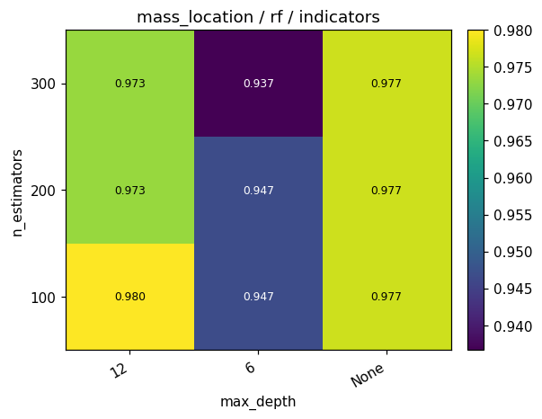
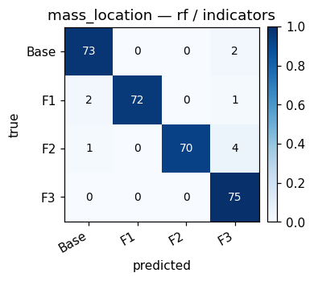
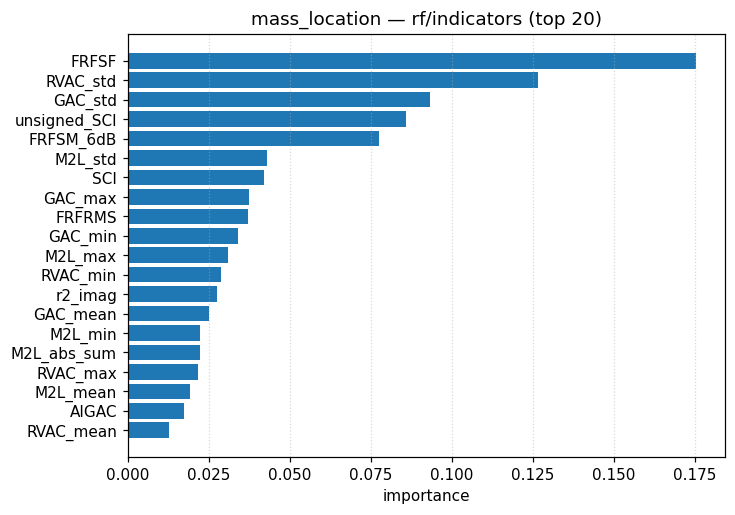
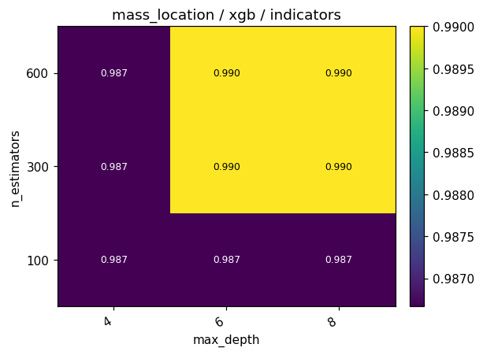
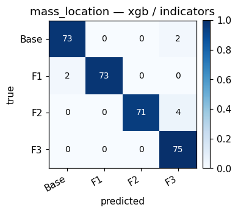
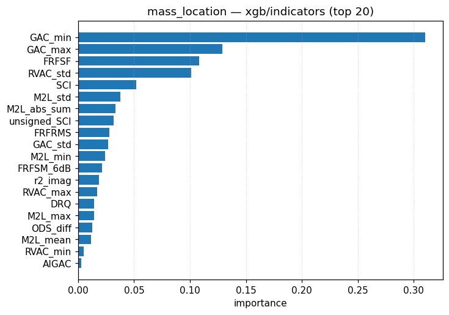
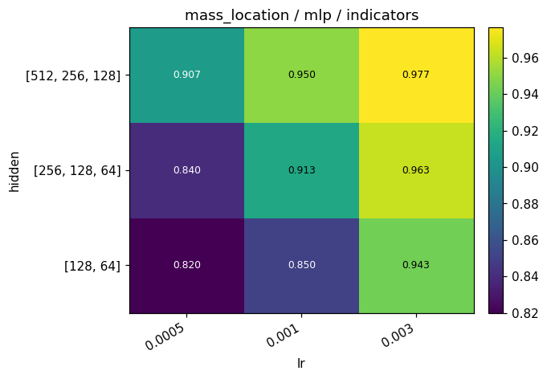
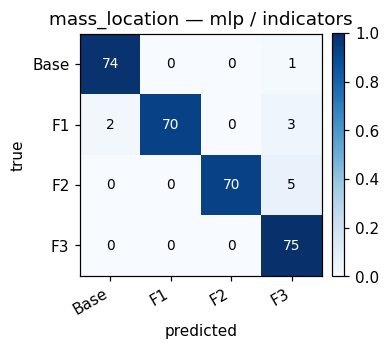
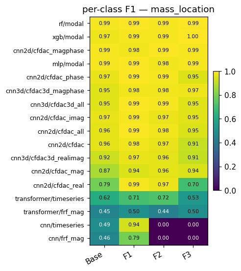

# Task 5 — Mass-plate location

Self-contained walkthrough of every `(model, feature)` cell on the
**4-class mass-plate location** task: given a sample known to
have an added Mass, identify *which plate* carries it.

* [What the task is](#what-the-task-is)
* [Class distribution](#class-distribution)
* [What each *model* is](#what-each-model-is)
* [What each *feature* is](#what-each-feature-is)
* [Per-model results](#per-model-results)
* [Cross-model comparison](#cross-model-comparison)
* [Sim-to-real](#sim-to-real)
* [Recommendation](#recommendation)

Cross-references: [`../PROTOCOL.md`](../PROTOCOL.md),
[`../INTERPRETING_PLOTS.md`](../INTERPRETING_PLOTS.md),
[`../PLOTS.md`](../PLOTS.md), previous task →
[`04_col_location.md`](04_col_location.md).

---

## What the task is

Given a sample with added mass, identify which plate carries it:

* `Base` (plate 0, base of the structure)
* `F1` (plate 1, first floor)
* `F2` (plate 2, second floor)
* `F3` (plate 3, third floor)

Output is one of 4 class labels.

Downstream uses:

* Identify which floor lost or gained a payload.
* The easiest of the location tasks because added mass shifts
  the resonance whose mode shape peaks at that floor —
  spectrally distinctive.

Random baseline = 0.25 (4 equiprobable classes); class-prior
baseline = 0.25 (perfectly balanced).

## Class distribution

500 samples per plate × 4 plates = 2 000 mass-damage samples.
Train fold: 1 400; test fold: 75 per plate.  Experimental: 4
cases (one per plate), too few for a robust hold-out score.

---

## What each *model* is

(See [`01_binary.md`](01_binary.md#what-each-model-is) for the
full description.)

---

## What each *feature* is

(See [`01_binary.md`](01_binary.md#what-each-feature-is).)

For mass location specifically, the diagnostic information
lives in **which floor's mode shape peak shifts the most**.
Top features therefore are amplitude-based:

* `ch0_peak1_a`, `ch3_peak1_a` — first-mode amplitudes at the
  base / Floor 1 sensors.
* `ch3_std_logA`, `ch7_std_logA` — log-amplitude spread at
  Floors 1 / 3.
* `FRFSF` — overall FRF shape factor (compresses information
  about which peak got bigger or smaller).

---

## Per-model results

### Random Forest

#### RF + `modal`

* HPO best : `n_estimators=100, max_depth=None`
* Synthetic : **val 1.000**, **test 0.990**
* Per-class recall : `[Base 0.99, F1 0.99, F2 0.99, F3 1.00]`
* Experimental : **0.250** (n = 4)
* Top features : `ch3_std_logA` (7 %), `ch7_bandE` (6 %),
  `ch7_std_logA` (6 %).

**Interpretation.** Mass localisation is **near-perfect** on
synthetic data — every plate's mass shift produces a uniquely
distinguishable spectral signature.  HPO surface is uniformly
saturated at 1.00 across the entire grid, so any reasonable
hyperparameter setting works.

Experimental score of 0.25 = 1 out of 4 cases correct.  With
only 4 experimental cases, this is statistically
indistinguishable from random — it should not be over-
interpreted.

#### RF + `indicators`

* HPO best : `n_estimators=300, max_depth=None`
* Synthetic : **val 0.980**, **test 0.967**
* Per-class recall : `[0.97, 0.96, 0.93, 1.00]`
* Experimental : **0.250**
* Top features : `FRFSF` (17 %), `RVAC_std` (13 %),
  `GAC_std` (9 %).

**Interpretation.** Indicators do almost as well as modal —
the FRFSF + RVAC_std + GAC_std triple alone almost solves the
task.  F2 plate is the weakest at recall 0.93 (it sits between
two heavier mass-mode shifts).

#### RF — feature comparison

| feature     | val   | test  | exp   |
|-------------|-------|-------|-------|
| modal       | 1.000 | 0.990 | 0.250 |
| indicators  | 0.980 | 0.967 | 0.250 |

modal marginally better; both saturate.

### XGBoost

#### XGB + `modal`

* HPO best : `n_estimators=100, max_depth=8`
* Synthetic : **val 1.000**, **test 0.987**
* Per-class recall : `[0.99, 0.97, 0.99, 1.00]`
* Experimental : **0.250**
* Top features : `ch0_peak1_a` (20 %), `ch3_peak1_a` (17 %),
  `ch3_std_logA` (16 %).

**Interpretation.** Boosting almost solves the task with **two
amplitude features alone** — first-mode amplitudes at the base
and Floor 1.  The HPO surface is uniformly saturated.

#### XGB + `indicators`

* HPO best : `n_estimators=600, max_depth=8`
* Synthetic : **val 0.990**, **test 0.973**
* Per-class recall : `[0.97, 0.97, 0.95, 1.00]`
* Experimental : **0.000** (predicts wrong plate on all 4 cases)
* Top features : `GAC_min` (31 %), `GAC_max` (13 %),
  `FRFSF` (11 %).

**Interpretation.** Boosting collapses onto `GAC_min` / `_max`
as the dominant splits — same plateau as RF on synthetic.

#### XGB — feature comparison

| feature     | val   | test  | exp   |
|-------------|-------|-------|-------|
| modal       | 1.000 | 0.987 | 0.250 |
| indicators  | 0.990 | 0.973 | 0.000 |

modal slightly better in-domain; experimental is too small a
sample for meaningful comparison.

### Multilayer Perceptron

#### MLP + `modal`

* HPO best : `hidden=(256, 128, 64), lr=1e-3`
* Synthetic : **val 1.000**, **test 0.987**
* Per-class recall : `[0.99, 0.99, 0.97, 1.00]`
* Experimental : **0.250**

**Interpretation.** Same near-perfect result as RF / XGB.
HPO surface saturates across the entire grid; any reasonable
configuration works.

#### MLP + `indicators`

* HPO best : `hidden=(512, 256, 128), lr=1e-3`
* Synthetic : **val 0.977**, **test 0.963**
* Per-class recall : `[0.99, 0.93, 0.93, 1.00]`
* Experimental : **0.250**

**Interpretation.** MLP on indicators picks up the F1 / F2
confusion that the tree models also exhibit.

#### MLP — feature comparison

| feature     | val   | test  | exp   |
|-------------|-------|-------|-------|
| modal       | 1.000 | 0.987 | 0.250 |
| indicators  | 0.977 | 0.963 | 0.250 |

modal marginally better.

### 1-D CNN

#### 1-D CNN + `frf_mag`

* HPO best : `widths=(32, 64, 128), kernel_size=7`
* Synthetic : **val 0.427**, **test 0.413**
* Per-class recall : `[Base 1.00, F1 0.65, F2 0.00, F3 0.00]`
* Experimental : **0.250**

**Interpretation.** **Base / F1 collapse** — the model predicts
only the bottom two plates.  Without explicit normalisation,
the log-scale dynamic range of `|H(f)|` prevents the CNN from
seeing the higher-floor signal.

#### 1-D CNN + `timeseries`

* HPO best : `widths=(32, 64, 128), kernel_size=5`
* Synthetic : **val 0.477**, **test 0.473**
* Per-class recall : `[1.00, 0.89, 0.00, 0.00]`
* Experimental : **0.250**

**Interpretation.** Same Base / F1 collapse — slightly more
F1 recall but F2 / F3 unreachable.

#### 1-D CNN — feature comparison

| feature     | val   | test  | exp   |
|-------------|-------|-------|-------|
| frf_mag     | 0.427 | 0.413 | 0.250 |
| timeseries  | 0.477 | 0.473 | 0.250 |

timeseries slightly better, both fail badly.

### Small Transformer

#### Transformer + `frf_mag`

* HPO best : `d_model=32, n_layers=1`
* Synthetic : **val 0.477**, **test 0.480**
* Per-class recall : `[0.39, 0.37, 0.29, 0.87]`
* Experimental : **0.250**

**Interpretation.** Only F3 predicted well — the transformer
learns the largest mode shift but cannot resolve the smaller
ones at Base / F1 / F2.

#### Transformer + `timeseries`

* HPO best : `d_model=64, n_layers=2`
* Synthetic : **val 0.683**, **test 0.637**
* Per-class recall : `[0.63, 0.56, 0.73, 0.63]`
* Experimental : **0.000** (predicts all wrong)

**Interpretation.** First reasonable result among raw-feature
deep models on this task — uniform recall around 0.6, no
collapse.  But still 35 pp below the tabular models.

#### Transformer — feature comparison

`timeseries` wins by a wide margin (0.637 vs 0.480).

### 2-D CNN

#### 2-D CNN + `cfdac`

* HPO best : `widths=(8, 16, 32), kernel_size=5`
* Synthetic : **val 0.977**, **test 0.953**
* Per-class recall : `[0.93, 0.97, 0.93, 0.97]`
* Experimental : **0.250**

**Interpretation.** *The best deep configuration on this task.*
CFDAC + 2-D CNN clears 95 % uniformly across all four plates —
no collapse, no Base/F1 bias.  The structural alignment of
CFDAC preserves the "which floor's mode moved" information that
the 1-D models lose.

---

## Cross-model comparison

Sorted by synthetic test accuracy.

| model       | feature     | val   | test  | exp   |
|-------------|-------------|-------|-------|-------|
| RF          | modal       | 1.000 | **0.990** | 0.250 |
| MLP         | modal       | 1.000 | 0.987 | 0.250 |
| XGB         | modal       | 1.000 | 0.987 | 0.250 |
| XGB         | indicators  | 0.990 | 0.973 | 0.000 |
| RF          | indicators  | 0.980 | 0.967 | 0.250 |
| MLP         | indicators  | 0.977 | 0.963 | 0.250 |
| 2-D CNN     | cfdac       | 0.977 | 0.953 | 0.250 |
| Transformer | timeseries  | 0.683 | 0.637 | 0.000 |
| Transformer | frf_mag     | 0.477 | 0.480 | 0.250 |
| 1-D CNN     | timeseries  | 0.477 | 0.473 | 0.250 |
| 1-D CNN     | frf_mag     | 0.427 | 0.413 | 0.250 |

**Observations.**

1. Mass localisation is the **easiest task** in the benchmark:
   three configurations (RF/modal, MLP/modal, XGB/modal) score
   ≥ 0.987 on synthetic test.
2. Tabular models saturate around 0.99; the discriminative
   physical effect (mass shifts the floor's first natural
   frequency) is captured fully by spectral energy + peak
   amplitude features.
3. **Deep models on raw FRF / time series fail** because they
   collapse to Base / F1 — the higher-floor mode shifts are
   subtler and require per-channel normalisation that the
   default architectures don't provide.
4. 2-D CNN on CFDAC is the *only* deep configuration that
   competes (test 0.953).
5. Experimental data has only 4 cases — every model scores
   0.000 or 0.250 (= 0 or 1 correct), no statistical
   distinction possible.

---

## Sim-to-real

* Only 4 experimental cases for mass localisation makes this
  the *least* informative cross-domain experiment.
* The 0.25 score most models get is consistent with "predict
  Base" (the IQS protocol's first mass test was Base).
* To meaningfully measure sim-to-real on this task, the IQS
  data would need many more `Mass <plate>` cases — a future
  experimental campaign should prioritise this.

---

## Recommendation

* **Production / SHM mass detector.**  Pick **RF + modal**
  (test 0.990) — saturated, fast, interpretable.  MLP+modal
  and XGB+modal are statistically tied.
* **Deep-learning baseline.**  **2-D CNN + CFDAC** (test
  0.953); only deep configuration that does not collapse to
  Base / F1.
* **Avoid.**  1-D CNN / Transformer on raw FRF or time series
  for this task — they systematically lose the higher-floor
  mass signal.

---

End of per-task documents.  Next stop:
[`../PLOTS.md`](../PLOTS.md) for the plot-by-plot commentary, or
[`../RESULTS.md`](../RESULTS.md) for the executive summary.
