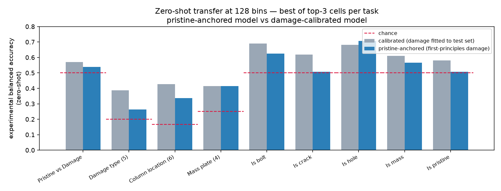

# Zero-shot report — pristine-anchored model (128 bins, top-3 cells per task)

*Generated 2026-06-13 · 2,638 experimental measurements · 30 cells (top-3 × 10 tasks)*

## What this is

Every model here is trained **only on synthetic FRFs** from the reduced-order 3SBB model **adjusted as well as possible from the pristine case alone** — the calibrated pristine baseline plus *first-principles, pristine-anchored* damage submodels (`ml_pipeline/pristine_physics.py`): bolt = remaining-preload JSR drop `1−p/100`, crack/hole = geometric section-loss of `I_xx`, mass = known kg. **No damaged measurement informs the training data.** Models are then evaluated **zero-shot** on the real experimental cases. For each task we trained the **top-3 `(model, feature)` cells** (ranked by experimental transfer in the damage-calibrated 128-bin study) and report the best.

The "calibrated" column is the *same cell* from the main study, whose synthetic damage magnitudes **were** fitted to the damaged experimental FRFs. The gap is therefore the share of performance that came from letting the surrogate see the damaged data.

## Headline — best of top-3 per task

| Task | Best pristine cell | Metric | Pristine | Chance | Calibrated\* | Δ vs calib |
|---|---|---|--:|--:|--:|--:|
| Pristine vs Damage | `transformer1d/timeseries` | bal-acc | **0.539** | 0.500 | 0.569 | -0.030 |
| Damage type (5) | `cnn2d_deep/cfdac_realimag` | bal-acc | **0.263** | 0.200 | 0.388 | -0.125 |
| Severity (reg) | `transformer/cfdac_realimag` | R² | **0.053** | 0.000 | 0.095 | -0.043 |
| Column location (6) | `transformer1d/frf_mag` | bal-acc | **0.336** | 0.167 | 0.427 | -0.091 |
| Mass plate (4) | `rf/modal` | bal-acc | **0.414** | 0.250 | 0.414 | +0.000 |
| Is bolt | `cnn3d/cfdac_real` | bal-acc | **0.624** | 0.500 | 0.690 | -0.065 |
| Is crack | `cnn2d_deep/cfdac_realimag` | bal-acc | **0.506** ⚠ | 0.500 | 0.618 | -0.112 |
| Is hole | `mlp/frf_realimag` | bal-acc | **0.706** | 0.500 | 0.682 | +0.024 |
| Is mass | `transformer1d/frf_mag` | bal-acc | **0.567** | 0.500 | 0.611 | -0.044 |
| Is pristine | `transformer1d/timeseries` | bal-acc | **0.508** ⚠ | 0.500 | 0.582 | -0.074 |

\*same cell, damage-calibrated study. ⚠ = collapsed / at chance.

**Mean best-cell experimental balanced accuracy over the 9 classification tasks: pristine `0.496` vs calibrated `0.554` (−0.058).**

## Reading it

- **Detection survives the honesty test.** Bolt, hole and mass detection stay well above chance with no damaged data (`is_hole` 0.71, `is_bolt` 0.62, `is_mass` 0.57); `is_hole` and `mass_location` lose essentially nothing vs the calibrated model — their physics (geometric hole `I`-loss, a known added mass) generalizes on its own.

- **Quantification / fine typing lean hardest on the fitted magnitudes.** `type` (−0.125) and `is_crack` (−0.112) fall the most, and `is_crack` collapses to chance — the crack stiffness effect is small and its realized magnitude was doing real work in the calibrated model. `col_location` (−0.091) and `severity` R² (0.05 vs 0.10) are weak in both, i.e. hard regardless of fitting.

- **Net:** dropping all damaged-data-fitted magnitudes costs only ~6 balanced-accuracy points on average — most of the SHM signal is carried by the pristine-anchored physics, not by having peeked at the damage.

## Full 30-cell table (experimental zero-shot)

| Task | Model | Feature | Kind | Pristine | Calibrated\* | Chance | Collapse |
|---|---|---|---|--:|--:|--:|:--:|
| binary | transformer1d | timeseries | cls | 0.539 | 0.569 | 0.500 |  |
| binary | mlp | frf_realimag | cls | 0.511 | 0.539 | 0.500 | yes |
| binary | transformer1d | frf_realimag | cls | 0.485 | 0.542 | 0.500 | yes |
| type | cnn2d_deep | cfdac_realimag | cls | 0.263 | 0.388 | 0.200 |  |
| type | transformer | cfdac_real | cls | 0.239 | 0.333 | 0.200 |  |
| type | cnn2d_deep | cfdac_imag | cls | 0.235 | 0.370 | 0.200 |  |
| severity | transformer | cfdac_realimag | reg | 0.053 | 0.095 | 0.000 |  |
| severity | cnn2d_deep | cfdac_mag | reg | -0.193 | 0.122 | 0.000 |  |
| severity | cnn1d | frf_mag | reg | -1.478 | 0.181 | 0.000 |  |
| col_location | transformer1d | frf_mag | cls | 0.336 | 0.427 | 0.167 |  |
| col_location | transformer1d | frf_realimag | cls | 0.244 | 0.417 | 0.167 |  |
| col_location | mlp | frf_mag | cls | 0.175 | 0.381 | 0.167 | yes |
| mass_location | rf | modal | cls | 0.414 | 0.414 | 0.250 |  |
| mass_location | cnn1d | frf_mag | cls | 0.307 | 0.336 | 0.250 |  |
| mass_location | cnn2d_deep | cfdac_realimag | cls | 0.145 | 0.317 | 0.250 | yes |
| is_bolt | cnn3d | cfdac_real | cls | 0.624 | 0.690 | 0.500 |  |
| is_bolt | cnn2d_shallow | cfdac_realimag | cls | 0.622 | 0.708 | 0.500 |  |
| is_bolt | cnn3d | cfdac_realimag | cls | 0.528 | 0.688 | 0.500 |  |
| is_crack | cnn2d_deep | cfdac_realimag | cls | 0.506 | 0.618 | 0.500 | yes |
| is_crack | cnn1d | frf_realimag | cls | 0.451 | 0.550 | 0.500 | yes |
| is_crack | transformer1d | timeseries | cls | 0.399 | 0.544 | 0.500 | yes |
| is_hole | mlp | frf_realimag | cls | 0.706 | 0.682 | 0.500 |  |
| is_hole | convnext_tiny | cfdac_real | cls | 0.506 | 0.687 | 0.500 | yes |
| is_hole | convnext_tiny | cfdac_all | cls | 0.500 | 0.720 | 0.500 | yes |
| is_mass | transformer1d | frf_mag | cls | 0.567 | 0.611 | 0.500 |  |
| is_mass | cnn1d | frf_realimag | cls | 0.557 | 0.634 | 0.500 |  |
| is_mass | cnn1d | timeseries | cls | 0.507 | 0.653 | 0.500 | yes |
| is_pristine | transformer1d | timeseries | cls | 0.508 | 0.582 | 0.500 | yes |
| is_pristine | cnn2d_deep | cfdac_realimag | cls | 0.499 | 0.554 | 0.500 | yes |
| is_pristine | cnn2d_deep | cfdac_real | cls | 0.483 | 0.543 | 0.500 | yes |

## Reproduce

- Notebook: `notebooks/hires_pristine128_top3_gpu.ipynb` (L4 GPU).
- Raw per-case predictions: `per_case_pristine128.tar.gz` (this folder) and branch `colab-hires-pristine128`.
- Metrics: `zero_shot_summary.json`.
